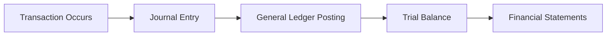

## 27.2 Frequently Used Formulas, Ratios, and Journal Entries

This section serves as a “go-to” quick reference guide for candidates preparing for the CPA Financial Accounting and Reporting (FAR) exam. While the preceding chapters offer in-depth conceptual explanations, what follows distills some of the most frequently used formulas, ratios, and journal entries that appear in practical accounting settings and on the exam. Organized for convenient review, these summaries help you swiftly recall essential material and reduce mistakes under exam pressure.

---

### Overview and Purpose

• Reinforce core concepts: From core EPS calculations to bond discount amortization, easily navigate the numeric side of financial reporting and analysis.  
• Enhance test readiness: Familiarize yourself with the typical style and flow of calculations required in problem-solving scenarios.  
• Practice standard entries: Quickly review foundational journal entries that you’ll see repeatedly, such as revenue recognition or depreciation.  

These references are designed to be supplemented by more detailed discussions found in relevant chapters of this book, such as:  
• Chapter 6 for EPS (basic and diluted)  
• Chapter 12 for depreciation formulas  
• Chapter 16 for bond amortization entries  
• Chapter 8 for in-depth ratio analysis  

---

## Essential Formulas for the FAR Exam

Below are some of the most common formulas tested on the FAR exam, organized by topic. While each formula is simple on its own, practicing complete examples is crucial to fully internalize the context in which these formulas apply.

### Earnings per Share (EPS)

1. Basic EPS

   Basic EPS measures net income allocated to each share of common stock outstanding.  

   Using KaTeX for clarity:

   
   \text{Basic EPS} = \frac{\text{Net Income} - \text{Preferred Dividends}}{\text{Weighted Average Number of Common Shares Outstanding}}
   

   Key Points:
   - Subtract any preferred dividends for cumulative preferred stock, whether or not declared.  
   - The weighted average number of shares accounts for stock splits, stock dividends, and issuance or repurchase of shares during the year.

2. Diluted EPS

   Diluted EPS adjusts the denominator (and sometimes the numerator) for potential common shares (e.g., stock options, convertible bonds).  

   
   \text{Diluted EPS} = \frac{\text{Net Income} - \text{Preferred Dividends} + \text{After-Tax Interest Savings on Convertible Debt}}{\text{Weighted Average Number of Common Shares + Dilutive Potential Shares}}
   

   Key Points:
   - Potential shares are included only if they *reduce* EPS (i.e., they are dilutive).  
   - The “if-converted” method is used for convertible instruments.  
   - The treasury stock method is used for stock options, warrants, and similar instruments.

---

### Depreciation, Amortization, and Depletion

Depreciation is one of the most common accounting calculations. FAR relentlessly tests knowledge of different depreciation methods, each with unique formulas.

1. Straight-Line Method (SL)

   
   \text{Annual Depreciation Expense} = \frac{\text{Cost of Asset} - \text{Salvage Value}}{\text{Useful Life}}
   

   Straight-line is uniform over the asset’s life.

2. Declining-Balance Method (e.g., Double Declining Balance)

   
   \text{Annual Depreciation Expense in Year } i = 
   \left( \frac{2}{\text{Useful Life}} \right) \times \text{Book Value at Beginning of Year } i
   

   Key Points:
   - Salvage value is usually ignored in calculating the depreciation base, but book value should not fall below salvage value.  
   - Most common variant: Double Declining Balance (DDB), using 2 ÷ Useful Life as the accelerated rate.

3. Sum-of-the-Years’-Digits (SYD)

   
   \text{Annual Depreciation Expense} = \left( \frac{\text{Remaining Life in Years}}{\frac{\text{Useful Life} \times (\text{Useful Life} + 1)}{2}} \right) \times (\text{Cost} - \text{Salvage Value})
   

   The denominator is the sum of the digits from 1 to n (the “sum of years”). This method is front-loaded.

4. Units-of-Production (Activity) Method

   
   \text{Depreciation Expense (Per Unit)} = \frac{\text{Cost} - \text{Salvage Value}}{\text{Total Units or Hours of Production Over Life}}
   

   The expense for a period = Depreciation Expense (Per Unit) × Actual Units (or hours) produced in that period.

---

### Bond Amortization

Accounting for bonds is a staple in FAR. Two core methods exist: (1) the Effective Interest Method (preferred under GAAP) and (2) the Straight-Line Method (an acceptable alternative only if not significantly different from the effective method, although widely used in practice for simplicity).

1. Effective Interest Method

   • The interest expense each period = carrying value × effective (market) interest rate.  
   • The difference between cash interest paid and interest expense is the amortization of the bond’s discount or premium.

   Example Formula:

   
   \text{Interest Expense} = \text{Carrying Amount of the Bond} \times \text{Yield Rate per Period}
   

   
   \text{Amortization of Discount/Premium} = \text{Interest Expense} - \text{Cash Interest Paid}
   

2. Straight-Line Method

   • The total discount or premium is evenly amortized over the bond’s life.  
   • The periodic amortization amount = (Total Discount or Premium) ÷ (Total Number of Interest Periods).  
   • Then, Interest Expense = Cash Interest Paid ± Amortization of Discount (or Premium).  

---

## Key Financial Ratios

Analyzing financial statements requires familiarity with standardized metrics. Ratios help measure profitability, liquidity, solvency, and more. While each ratio has variants, these summary formulas are commonly tested.

### Liquidity Ratios

• Current Ratio:

  
  \text{Current Ratio} = \frac{\text{Current Assets}}{\text{Current Liabilities}}
  

  Measures short-term debt-paying ability; >1 is typically desired.

• Quick (Acid-Test) Ratio:

  
  \text{Quick Ratio} = \frac{\text{Cash + Marketable Securities + Receivables}}{\text{Current Liabilities}}
  

  Excludes inventory and prepaid expenses to isolate highly liquid assets.

• Cash Ratio:

  
  \text{Cash Ratio} = \frac{\text{Cash + Cash Equivalents + Marketable Securities}}{\text{Current Liabilities}}
  

  Even stricter measure of short-term liquidity.

### Activity (Efficiency) Ratios

• Inventory Turnover:

  
  \text{Inventory Turnover} = \frac{\text{Cost of Goods Sold}}{\text{Average Inventory}}
  

  High turnover indicates more frequent inventory turnover, but too high may indicate stockouts.

• Accounts Receivable Turnover:

  
  \text{AR Turnover} = \frac{\text{Net Credit Sales}}{\text{Average Net Receivables}}
  

  Reflects how quickly a company collects cash from customers.

• Accounts Payable Turnover:

  
  \text{AP Turnover} = \frac{\text{COGS or Credit Purchases}}{\text{Average Accounts Payable}}
  

  Measures how quickly a firm pays its suppliers.

### Profitability Ratios

• Gross Margin:

  
  \text{Gross Margin Percentage} = \frac{\text{Net Sales} - \text{Cost of Goods Sold}}{\text{Net Sales}}
  

• Return on Equity (ROE):

  
  \text{ROE} = \frac{\text{Net Income}}{\text{Average Shareholders’ Equity}}
  

• Return on Assets (ROA):

  
  \text{ROA} = \frac{\text{Net Income}}{\text{Average Total Assets}}
  

• Net Profit Margin:

  
  \text{Net Profit Margin} = \frac{\text{Net Income}}{\text{Net Sales}}
  

### Solvency Ratios

• Debt-to-Equity:

  
  \text{Debt-to-Equity} = \frac{\text{Total Liabilities}}{\text{Total Shareholders’ Equity}}
  

  Gauges the proportion of financing from creditors versus equity holders.

• Times Interest Earned (Interest Coverage):

  
  \text{Times Interest Earned} = \frac{\text{Earnings Before Interest \& Taxes (EBIT)}}{\text{Interest Expense}}
  

  Measures ability to service debt.

---

## Standard Journal Entries: A Quick Reference

Journal entries provide the backbone of financial accounting. Mastering standard entries and variations is essential for FAR success. Below is a curated list of high-frequency entries. For thorough explanations of these and more, see Chapters 9 (Cash and Cash Equivalents), 10 (Trade Receivables), 11 (Inventory), 12 (PP&E), 16 (Debt), 17 (Equity), 20 (Revenue), and so on.

### Cash and Receivables

• Recording a Cash Sale:

  Debit: Cash  
  Credit: Sales Revenue  

• Collecting Accounts Receivable:

  Debit: Cash  
  Credit: Accounts Receivable  

• Recognizing Uncollectible Accounts (Allowance Method):

  1) Estimate/uncollectible:
     
     Debit: Bad Debt Expense  
     Credit: Allowance for Doubtful Accounts  

  2) Write-off specific account:

     Debit: Allowance for Doubtful Accounts  
     Credit: Accounts Receivable  

### Inventory

• Purchases (Periodic System):

  Debit: Purchases  
  Credit: Accounts Payable  

• Purchases (Perpetual System):

  Debit: Inventory  
  Credit: Accounts Payable  

• Sale of Inventory (Perpetual System):

  Debit: Accounts Receivable (or Cash)  
  Credit: Sales Revenue  
  Debit: Cost of Goods Sold  
  Credit: Inventory  

### Property, Plant & Equipment (PP&E)

• Acquisition of Fixed Assets:

  Debit: PP&E (e.g., Machinery)  
  Credit: Cash (or Accounts Payable)  

• Recording Depreciation:

  Debit: Depreciation Expense  
  Credit: Accumulated Depreciation  

• Disposal of Fixed Assets (Gain):

  Debit: Cash (proceeds)  
  Debit: Accumulated Depreciation  
  Credit: Equipment (historical cost)  
  Credit: Gain on Disposal of Equipment  

### Bond Issuance and Amortization

• Issuing Bonds at Discount:

  Debit: Cash (issue price)  
  Debit: Discount on Bonds Payable  
  Credit: Bonds Payable (face value)  

• Amortizing Discount (Effective Interest Method Example):

  Debit: Interest Expense  
  Credit: Discount on Bonds Payable  
  Credit: Cash (interest payment)  

• Issuing Bonds at Premium:

  Debit: Cash (issue price)  
  Credit: Premium on Bonds Payable  
  Credit: Bonds Payable (face value)  

• Amortizing Premium (Effective Interest Method Example):

  Debit: Interest Expense  
  Debit: Premium on Bonds Payable  
  Credit: Cash (interest payment)  

### Equity Transactions

• Issuing Common Stock at Par:

  Debit: Cash  
  Credit: Common Stock (at par value)  
  Credit: Additional Paid-In Capital (APIC) (excess)  

• Repurchasing Stock (Treasury Stock, Cost Method):

  Debit: Treasury Stock  
  Credit: Cash  

• Reissuing Treasury Stock Above Cost:

  Debit: Cash  
  Credit: Treasury Stock  
  Credit: APIC – Treasury Stock  

### Revenue Recognition

Under the new 5-step revenue recognition model (ASC 606):

• Recording Revenue (when performance obligations are satisfied):

  Debit: Accounts Receivable (or Cash)  
  Credit: Sales/Service Revenue  

If contract liabilities or unearned revenue exist:

  Debit: Unearned Revenue  
  Credit: Revenue  

### Expenses and Accruals

• Accruing an Expense:

  Debit: Expense  
  Credit: Accrued Liability (e.g., Wages Payable, Interest Payable)  

• Paying an Accrued Expense:

  Debit: Accrued Liability  
  Credit: Cash  

### Lease Accounting (Lessee)

• Operating Lease (ASC 842):

  Initial Recognition of Right-of-Use Asset and Lease Liability:
  
  Debit: Right-of-Use Asset (Operating)  
  Credit: Lease Liability  

  Periodic Lease Payment:
  
  Debit: Lease Expense  
  Credit: Cash  

  (Right-of-use asset and lease liability are amortized in the background with slightly different presentation.)

• Finance Lease (Lessee):

  Debit: Right-of-Use Asset (Finance)  
  Credit: Lease Liability  

  Periodic Lease Payment:
  
  Debit: Interest Expense  
  Debit: Lease Liability  
  Credit: Cash  

  Record amortization of ROU asset each period:
  
  Debit: Amortization Expense  
  Credit: Accumulated Amortization – ROU Asset  

### Contingencies

• Recognizing a Probable and Reasonably Estimable Loss:

  Debit: Loss (Lawsuit, Warranties, etc.)  
  Credit: Liability (Lawsuit Payable, Warranty Liability, etc.)  

### Example Flow of a Typical Transaction

Below is a simplified diagram that illustrates the general flow of a transaction from the point of journal entry through final financial statement presentation:

1. A Transaction Occurs: It can be an invoice to the customer, accrual of an expense, or bond issuance.  
2. Journal Entry: The initial accounting record, capturing debits and credits.  
3. General Ledger Posting: Each journal entry is posted to the specific GL accounts.  
4. Trial Balance: Summarizes all GL accounts, used to check error-free debits and credits.  
5. Financial Statements: Ultimately, the numbers flow into the main statements for external reporting.

---

## Best Practices and Common Pitfalls

1. Always match interest expense with the correct carrying value for the effective interest method.  
2. Check that you have accounted for partial-year conventions when calculating depreciation if the asset is placed in service mid-year.  
3. Ensure that if convertible securities are antidilutive, they are excluded from diluted EPS.  
4. Watch for modifications in lease or revenue contracts that might trigger remeasurement of liabilities or updated recognition of revenue.  
5. Confirm your beginning and ending balances in inventory calculations (e.g., LIFO, FIFO) align with the method used (periodic vs. perpetual).  
6. Keep a mental or written “cheat sheet” of standard accounts used during typical transactions (e.g., always open or close the “Allowance for Doubtful Accounts” with the same offset accounts).  

---

## Practical Example: Recording an Interest Expense Using the Effective Interest Method

Let’s illustrate bond amortization for a single period using the Effective Interest Method. Suppose a $100,000 bond is 5 years until maturity, with a 10% stated interest rate (paid annually), sold at a discount to yield an effective rate of 12%. The discounted price was $96,535.80, which becomes the bond’s initial carrying value.

• Beginning Carrying Value: $96,535.80  
• Interest Payment = $100,000 × 10% = $10,000  
• Effective Interest Expense = $96,535.80 × 12% = $11,584.30  
• Amortization of Discount = $11,584.30 − $10,000 = $1,584.30  

Journal Entry:

Debit: Interest Expense ................. $11,584.30  
Credit: Discount on Bonds Payable ...... $1,584.30  
Credit: Cash (Interest Paid) ........... $10,000  

Resulting new carrying value of the bond = $96,535.80 + $1,584.30 = $98,120.10.

---

## Real-World Scenarios and References

• Be mindful of actual business processes. For instance, when performing a partial disposal of equipment, the recognized gain or loss and the reversal of any associated accumulated depreciation can become complex.  
• In practice, many large companies utilize enterprise resource planning (ERP) software that automates calculations for depreciation, amortization, and bond discount/premium tracking.  
• For additional official guidance, consult FASB Accounting Standards Codification (ASC) topics:  
  – ASC 230 for Statement of Cash Flows  
  – ASC 606 for Revenue Recognition  
  – ASC 505 for Equity  
  – ASC 470 for Debt  
  – ASC 840 (superseded by ASC 842) for Leases  

---

## SEO-Optimized Quiz: Frequently Used Formulas, Ratios, and Journal Entries



### Which method calculates an annual depreciation expense by applying a constant rate to the asset’s beginning book value each year?

- [ ] Straight-line depreciation method
- [x] Double declining balance method
- [ ] Sum-of-the-years’-digits method
- [ ] Units-of-production method

> **Explanation:** The double declining balance (DDB) method uses a rate of (2 ÷ Useful Life) multiplied by the asset’s beginning book value every year.

### How do you calculate basic earnings per share (EPS)?

- [x] Divide (Net Income − Preferred Dividends) by the weighted average number of common shares outstanding
- [ ] Divide Net Income by the end-of-year common shares outstanding
- [ ] Divide (Net Income + Preferred Dividends) by the weighted average number of common shares outstanding
- [ ] Divide (Net Income − Preferred Dividends) by the ending common shares outstanding

> **Explanation:** Basic EPS is calculated as (Net Income − Preferred Dividends) ÷ Weighted Average Number of Common Shares Outstanding.

### In the effective interest method of bond discount amortization, the interest expense for a period equals:

- [ ] Face Value × Stated Rate
- [ ] Bond Issue Price × Stated Rate
- [x] Carrying Value of the Bond × Effective (Market) Interest Rate
- [ ] Market Price of the Bond × Stated Rate

> **Explanation:** Under the effective interest method, the interest expense each period is calculated by multiplying the carrying value (which changes each period) by the market interest rate at issuance.

### Which of the following journal entries properly records the write-off of an uncollectible account using the allowance method?

- [ ] Debit Bad Debt Expense; Credit Accounts Receivable
- [ ] Debit Accounts Receivable; Credit Allowance for Doubtful Accounts
- [x] Debit Allowance for Doubtful Accounts; Credit Accounts Receivable
- [ ] Debit Bad Debt Expense; Credit Cash

> **Explanation:** When writing off a specific uncollectible account under the allowance method, the entry to remove the receivable from the books debits the allowance and credits the receivable.

### The gross margin percentage is best described as:

- [x] (Net Sales − COGS) ÷ Net Sales
- [ ] COGS ÷ Net Sales
- [ ] Net Sales ÷ Gross Profit
- [x] (Net Sales − COGS) ÷ Average Inventory

> **Explanation:** The gross margin percentage is (Net Sales − COGS) ÷ Net Sales. (Note: The last answer marked is incorrect. The correct ratio for inventory turnover is COGS ÷ Average Inventory. Make sure to interpret the question carefully.)

### What is the interest portion of the journal entry for a finance lease payment by the lessee?

- [x] Debit Interest Expense
- [ ] Credit Lease Liability
- [ ] Debit Lease Liability
- [ ] Debit Equipment

> **Explanation:** Under a finance lease, each periodic payment is split between interest expense and principal reduction of the lease liability. The interest portion is debited to Interest Expense.

### Which ratio would be most relevant to measure a company’s short-term liquidity?

- [x] Current Ratio
- [ ] Debt-to-Equity Ratio
- [x] Quick Ratio
- [ ] Return on Assets

> **Explanation:** The Current Ratio and Quick Ratio both measure short-term liquidity. Debt-to-Equity and Return on Assets measure solvency and profitability, respectively. (Note that more than one ratio can be relevant to short-term liquidity. The question as phrased can have multiple correct answers based on real-world contexts, but typically the Current Ratio and Quick Ratio are the most straightforward.)

### When a company issues common stock for more than its par value, the excess is recorded as:

- [ ] Treasury Stock
- [ ] Retained Earnings
- [x] Additional Paid-In Capital
- [ ] Premium on Bonds Payable

> **Explanation:** Any amount received above par (or stated) value is credited to Additional Paid-In Capital (APIC).

### If an organization wants to measure its ability to service debt, which ratio would be most relevant?

- [ ] Quick Ratio
- [x] Times Interest Earned
- [ ] Inventory Turnover
- [ ] Net Working Capital

> **Explanation:** The Times Interest Earned (Interest Coverage) ratio shows how many times a company’s earnings can cover its interest obligations, indicating debt service capacity.

### The correct entry to record depreciation on machinery used in operations is:

- [x] Debit Depreciation Expense; Credit Accumulated Depreciation
- [ ] Debit Machinery; Credit Cash
- [ ] Debit Machinery; Credit Depreciation Expense
- [ ] Debit Depreciation Expense; Credit Machinery

> **Explanation:** Depreciation Expense is closed to the Income Statement, while Accumulated Depreciation is the contra-asset account offsetting the asset on the Balance Sheet.



---

## For Additional Practice and Deeper Preparation

**[FAR CPA Hardest Mock Exams: In-Depth & Clear Explanations](https://www.udemy.com/course/far-cpa-mock-exams/?referralCode=F88050F8D5C76764F6BD)**  

**Financial Accounting and Reporting (FAR) CPA Mocks:** 6 Full (1,500 Qs), Harder Than Real! In-Depth & Clear. Crush With Confidence!  

- Tackle full-length mock exams designed to mirror real FAR questions.  
- Refine your exam-day strategies with detailed, step-by-step solutions for every scenario.  
- Explore in-depth rationales that reinforce higher-level concepts, giving you an edge on test day.  
- Boost confidence and minimize anxiety by mastering every corner of the FAR blueprint.  
- Perfect for those seeking exceptionally hard mocks and real-world readiness.  

_Disclaimer: This course is not endorsed by or affiliated with the AICPA, NASBA, or any official CPA Examination authority. All content is for educational and preparatory purposes only._
