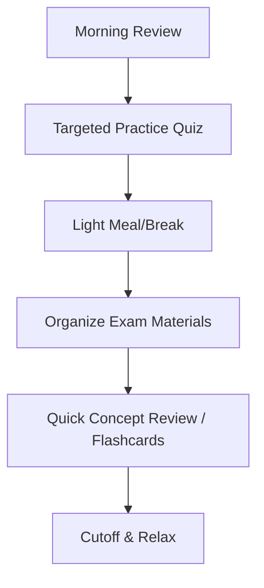

## 27.3 Last-Minute Study Notes and Exam-Day Reminders

Preparing for the Financial Accounting and Reporting (FAR) section of the Uniform CPA Examination can feel like a marathon, and in the final days before test day, it often turns into a sprint. With so many topics—from governmental accounting and not-for-profit standards to consolidated financial statements and stockholders’ equity—you need a plan to keep your focus sharp and your confidence high. This section provides last-minute study notes and exam-day reminders, offering both practical and psychological tools. By following well-structured checklists and embracing proactive strategies, you will approach the exam day with calm assurance.

Keeping in mind the breadth of FAR content, make sure you reference earlier chapters in this guide (Chapters 1 through 26) for deeper discussions on each technical area. Because FAR covers a variety of financial standards, you will also find it beneficial to revisit the IFRS differences highlighted in Chapter 25 as well as the illustrative practice scenarios and comprehensive exercises in Chapter 26. Even if you have already worked through these chapters, these final reminders will help tie everything together.

------------------------------------------------------------------------------------------------
### Overview

This last-minute study and exam-day guide has three core objectives:

• Provide practical checklists (Do’s and Don’ts) to keep you on track in the final days and hours before your exam.  
• Offer time-management strategies to ensure you pace yourself correctly during each testlet and simulation.  
• Suggest stress-management tips to help you maintain composure and peak mental performance during the exam.

To make the most of these guidelines, integrate them with the knowledge you have already acquired from earlier chapters: from how to handle intangible assets (Chapter 14), to understanding the intricacies of accounting for income taxes (Chapter 21), to effectively using the Statement of Cash Flows (Chapter 3).

Consider creating a personalized study plan using these recommendations, emphasizing any areas where you feel less confident. Let these pointers supplement your existing review—not displace it.

------------------------------------------------------------------------------------------------
### High-Level Checklists (Do’s and Don’ts)

Below are concise checklists to help you organize your final days of study. Use them as reminders of best practices and problematic pitfalls that can surface as the exam approaches.

#### Do’s

1. **Review Comprehensive Summaries and Formulas**  
   Focus on high-level overviews such as those found in Chapter 27.1: High-Level Summaries. Revisit the ratio formulas, common disclosures, and core journal entry prototypes. For instance, recall the formula for the current ratio using KaTeX:  
   <br>  
   $$
   \text{Current Ratio} = \frac{\text{Current Assets}}{\text{Current Liabilities}}
   $$  
   This formula is often tested conceptually in FAR.

2. **Practice Key Journal Entries**  
   Journal entries are the language of accounting. Review how to record revenue recognition entries under ASC 606, the basic entries for bond issuance from Chapter 16, and the entries for leases (Chapter 23).

3. **Revisit Governmental and NFP Flash Points**  
   Chapters 4 and 5 detail unique requirements for not-for-profit and government organizations (e.g., measurement focus, basis of accounting, and net asset classifications). Repetitive practice with the fund financial statements and the government-wide reconciliations will help you avoid confusion.

4. **Use Active Recall**  
   Conduct short, timed quizzes or flash card sessions. Ask yourself conceptual questions:  
   “What are the recognition criteria for intangible assets?”  
   “How does a not-for-profit entity report net assets with donor restrictions?”  
   Summaries from Chapter 8 (Financial Statement Analysis) can also be quickly reviewed with bullet notes and ratio assessments.

5. **Simulate the Exam Environment**  
   Practice under timed conditions. FAR comprises multiple-choice questions (MCQs) and task-based simulations (TBSs). Tackling a full-length practice test is an excellent dry run, letting you refine your pacing and ensure you’re comfortable with the exam software layout.

6. **Stay Organized and Prioritize**  
   Create a short list of the most critical topics. You might organize them as:  
   - Revenue Recognition (Chapter 20)  
   - Leases (Chapter 23)  
   - Deferred Taxes (Chapter 21)  
   - Consolidations and Business Combinations (Chapter 26)  
   Quickly reviewing these top-tier areas can significantly boost your score if you strengthen key fundamental concepts.

#### Don’ts

1. **Don’t Overlook Small Details**  
   While big-picture topics like revenue recognition are critical, smaller points—such as intangible asset amortization from Chapter 14 or accounting changes and errors (Chapter 18)—frequently appear in MCQs. Make sure you have them covered.

2. **Don’t Memorize Without Understanding**  
   It is easy to fall into the trap of memorizing IFRS vs. GAAP differences (Chapter 25), but you must grasp the rationale behind each difference. The exam often tests application rather than pure memorization.

3. **Don’t Cram All Night**  
   Cramming can lead to mental fatigue. Instead, do a steady, targeted review, focusing on the areas you’ve determined as weaknesses. Avoid burning yourself out when you most need mental clarity.

4. **Don’t Ignore Breaks or Rest**  
   Many candidates try to power through the final days without breaks. Unstructured cramming leads to lower retention. Take short breaks to recharge. A refreshed mind often recalls information more efficiently.

5. **Don’t Change Your Strategy Last Minute**  
   If you have a proven approach for answering multiple-choice questions or for time management on simulations, stick to it. Sudden changes can introduce confusion during the exam.

------------------------------------------------------------------------------------------------
### Time Management During the Exam

FAR is known for its volume of content, and you can quickly lose time if you drift off schedule. Remember the structure: you typically have multiple testlets of MCQs followed by task-based simulations. Each must be navigated within the total allotted exam time, often four hours for the FAR section. Below are some strategies:

• **Set Micro Goals:** Allocate a rough time limit for each MCQ testlet. If you have 33 MCQs in a testlet, and your approach allows 1.25 minutes per MCQ, keep yourself loosely to that schedule. You may finish some questions faster, leaving time for the more challenging ones.

• **Don’t Get Stuck:** If an MCQ stumps you, select your best-educated choice and move on. You can always revisit flagged questions if time allows.

• **TBS Prioritization:** For simulations, identify the “low-hanging fruit” first—parts you can answer without wading into complex calculations. Ensure you quickly capture easy points (e.g., inputting common data or filling out straightforward journal entries). Then move on to more intricate computations.

• **Check the Clock:** Periodically glance at the countdown. Aim for a comfortable cushion as you enter your final testlet. Rushing the last few questions can lead to careless mistakes.

• **Use a Time Buffer for Unexpected Complexity:** Some simulations might involve partial credit. Even if you cannot fully complete a complex simulation, partial credit can benefit you significantly if you get certain sections correct.

Below is a simple visual flow of how you might allocate your time on exam day. The diagram is in Mermaid.js format:

```mermaid
flowchart LR
    A(Start FAR Exam) --> B[Multiple-Choice Testlet 1: 33 MCQs]
    B --> C[Multiple-Choice Testlet 2: 33 MCQs]
    C --> D[Optional Break (Short)]
    D --> E[Simulations: TBS 1 - TBS 3]
    E --> F[Optional Break (Short)]
    F --> G[Simulations: TBS 4 - TBS 6]
    G --> H(Review & Submit)
```

Notice how short breaks are integrated. Using break times strategically to regroup can help reset your focus.

------------------------------------------------------------------------------------------------
### Stress Management and Well-Being

As crucial as subject expertise is, your emotional state on exam day can significantly affect your performance. Elevated stress can cloud judgment, cause second-guessing, and impair your recall. Below are some science-backed tips for staying calm and confident:

• **Adequate Rest**  
  Aim for seven to eight hours of quality sleep in the nights leading up to the exam. Your brain recharges and retains information more effectively when well-rested.

• **Mindful Breathing**  
  When you sense anxiety, take 30 seconds to do mindful breathing. Slowly inhale for four counts, hold for four, and exhale for four. This technique can clear mental chatter, allowing you to re-center.

• **Positive Self-Talk**  
  Studies suggest that reframing your mindset before a stressful event can lead to better performance. Use affirmations such as, “I’ve studied diligently, and I’m prepared to do my best.”

• **Light Nutrition**  
  Eat balanced, light meals on exam day. Heavy foods can make you sluggish during the test. Pack a healthy snack if you think you may need something during a break.

• **Avoid Negativity**  
  Limit exposure to negative talk. If fellow candidates are discussing panicked last-minute topics in the test center, politely excuse yourself. Protect your mental space.

------------------------------------------------------------------------------------------------
### Additional Best Practices and Common Pitfalls

#### Best Practices

• **Leverage Mnemonics**  
  Reinforce your memory for certain tricky areas (e.g., “NERD” for the four types of intangible assets or “BASIC” for the five-step revenue recognition process). Mnemonics can help lock in complex content.

• **Cross-Reference IFRS Distinctions**  
  You may see IFRS-based questions on the exam. For instance, IFRS prohibits LIFO for inventory, as covered in Chapter 25. Quick references help you avoid mixing IFRS and GAAP incorrectly.

• **Continual Review of Past Mock Exams**  
  With each practice exam you take, review incorrect answers and revisit relevant chapters. Did you miss a question on government-wide statements because you overlooked the reconciliation? Revisit Chapter 5 for additional examples.

• **Focus on High-Yield Areas**  
  Some topics have a higher probability of being tested (e.g., revenue recognition, not-for-profit net assets, consolidated statements). Ensure you are confident in these critical areas.

#### Common Pitfalls

• **Over-Complicating Calculations**  
  The exam often tests core calculations. Resist the urge to perform unnecessary steps. For example, if a question on intangible assets explicitly gives you the fraction of the year that has elapsed, apply that fraction accurately and don’t overthink.

• **Forgetting to Check the Simulation Instructions**  
  Each TBS might have specific instructions—some will ask for certain decimal places, while others might require text explanations. Overlooking details can cost precious points.

• **Failing to Use All Resources**  
  The AICPA sample tests, especially those for FAR, mirror the real environment’s functionalities (e.g., authoritative literature if allowed). Practice navigating these resources so that you can access them quickly.

------------------------------------------------------------------------------------------------
### Final Day and Exam-Day Routine

The day before the exam is critical. Here is a sample schedule:

1. **Morning/Early Afternoon**  
   • Review quick sheets, flashcards, or a mind map of key concepts.  
   • Pair up with a study buddy (virtually or in-person) to discuss any last uncertainties.  

2. **Late Afternoon/Early Evening**  
   • Do a brief, timed quiz focusing on your weaker topics.  
   • Arrange your exam materials (e.g., two forms of ID, testing confirmation).  
   • Plan healthy meals for the evening and the next morning.  

3. **Evening**  
   • Skim through the major conceptual areas (e.g., conceptual framework from Chapter 2).  
   • Set a definitive cutoff time. By around 9 or 10 PM, cease studying. Let your mind relax.  

4. **Exam Day Morning**  
   • Avoid heavy cramming. Review only the notes or formulas you consistently forget.  
   • Take 5-10 minutes of mindfulness or light stretching to center yourself.  
   • Eat a moderate breakfast. Overeating or skipping breakfast can negatively affect your focus.  

5. **Arrival at the Test Center**  
   • Arrive early—stress from tardiness is counterproductive.  
   • Bring required identification and documents.  
   • Take a couple of slow, deep breaths and maintain confidence.  

------------------------------------------------------------------------------------------------
### Representative Conceptual Diagram

Below is a simplified strategic timeline for your final day, visualized in Mermaid.js:



This approach helps keep the day structured without overwhelming yourself with last-minute frantic study sessions.

------------------------------------------------------------------------------------------------
### Conclusion

FAR may be daunting, but thorough preparation, coupled with strong study habits, time-management strategies, and good mental hygiene, will guide you toward success. Cross-reference any tricky points with earlier chapters or external resources like official AICPA practice material, and don’t forget to maintain your morale. A winning mindset can often be the difference between a borderline pass and a commanding performance.

Even if you receive a difficult question or an unexpected simulation, remember that partial credit, an efficient time strategy, and calm, confident reasoning can see you through. Stick to your plan, do not doubt your hard-earned knowledge, and trust in your long period of study and practice.

You’ve reached the end of this Final Summaries and Quick Reference section. Continue below to test your knowledge with a short quiz tailored to last-minute reminders, and check out the recommended practice resources to build on the comprehensive preparation you already have.

------------------------------------------------------------------------------------------------

## Test Your Knowledge: Last-Minute CPA FAR Exam Concepts



### Which of the following is considered a key strategy in managing your time for the FAR section?

- [ ] Focusing only on the first testlet and running out of time for simulations
- [ ] Randomly guessing on all simulations without reading instructions
- [x] Setting micro goals for each testlet and using optional breaks to regroup
- [ ] Skipping the MCQs and only doing simulations

> **Explanation:** Setting micro goals for each testlet and breaking down the exam into manageable segments is a proven method to stay on schedule and reduce exam-day stress.

### When it comes to last-minute studying, the best practice for retaining information is:

- [ ] Cramming all night without any breaks
- [ ] Skipping essential topics to focus on minor details
- [x] Conducting short, targeted, and frequent review sessions with breaks in between
- [ ] Completely stopping studying two days before the exam

> **Explanation:** Short, targeted, and frequent review sessions help reinforce retention and reduce burnout, ensuring that you can recall information efficiently on exam day.

### Which of the following is NOT a recommended way to manage stress on exam day?

- [ ] Performing mindful breathing exercises to calm nerves
- [ ] Taking short breaks to refresh during the exam
- [x] Comparing yourself with other candidates and panicking over their progress
- [ ] Using positive self-talk to maintain confidence

> **Explanation:** Comparing yourself with other candidates can increase anxiety, draining valuable mental energy that could otherwise be used to focus on your own performance.

### During the final review, which topic commonly yields high returns in FAR?

- [ ] The definition of petty cash, exclusively
- [ ] Equity method sub-totals for immaterial ownership
- [x] Revenue recognition steps under ASC 606
- [ ] Outdated GAAP rules not tested anymore

> **Explanation:** Revenue recognition under ASC 606 is a significant, high-yield topic. Mastering its five-step model can greatly improve your chances of answering multiple questions accurately.

### Which of the following is the main reason to avoid changing your exam strategy at the last minute?

- [x] Sudden changes can create confusion and increase mistakes
- [ ] The original strategy has no impact on performance
- [x] Consistency reduces stress and promotes confidence
- [ ] Exam strategies are irrelevant once you sit down

> **Explanation:** Abrupt strategy changes can lead to misallocation of time and confusion. Sticking to a practiced method fosters confidence and consistency, minimizing surprises.

### If you are pressed for time during the task-based simulations, the recommended approach is to:

- [x] Tackle easily understood sections or partial answers to secure partial credit
- [ ] Spend all remaining time on one simulation, ignoring others
- [ ] Randomly guess all answers for maximum speed
- [ ] Leave the simulation blank if unsure

> **Explanation:** Partial credit often applies in simulations. Securing points on simpler components first ensures you capitalize on your knowledge as efficiently as possible.

### Which of the following is a benefit of using short, mindful breaks during the FAR exam?

- [x] Helps reset your mental focus
- [ ] Increases overall exam time by an additional hour
- [x] Reduces stress and allows brief mental recovery
- [ ] Delays the scoring of your exam

> **Explanation:** Short breaks help you regain composure and clarity. While they do not extend the total time, they can improve the quality of your performance when used wisely.

### When preparing for differences between IFRS and GAAP, the primary focus should be on:

- [x] Understanding the rationale behind each difference for application-based questions
- [ ] Memorizing every obscure IFRS rule not in GAAP
- [ ] Dismissing IFRS since it might not appear on the exam
- [ ] Studying only IFRS for intangible assets

> **Explanation:** Knowing the reasoning behind differences helps in answering conceptual and application-based questions. Blind memorization often falls short on the exam.

### What is a practical first step in dealing with a simulation you find overwhelmingly difficult?

- [x] Identify any small parts you can solve easily for partial credit
- [ ] Skip it immediately without reading
- [ ] Change the test’s difficulty setting
- [ ] Exceed the recommended time limit in figuring it out

> **Explanation:** Securing partial credit where you can is an optimal approach. Do simpler portions first and then handle tougher sections if time allows.

### True or False: Reviewing a handful of major topics the morning of the exam is more beneficial than attempting comprehensive coverage of all FAR materials.

- [x] True
- [ ] False

> **Explanation:** Focusing on a short list of major or weak areas prevents overwhelm and fatigue. Attempting to re-study everything in detail the morning of the exam can lead to confusion and burnout.



------------------------------------------------------------------------------------------------

## For Additional Practice and Deeper Preparation

**[FAR CPA Hardest Mock Exams: In-Depth & Clear Explanations](https://www.udemy.com/course/far-cpa-mock-exams/?referralCode=F88050F8D5C76764F6BD)**  

**Financial Accounting and Reporting (FAR) CPA Mocks:** 6 Full (1,500 Qs), Harder Than Real! In-Depth & Clear. Crush With Confidence! 

- Tackle full-length mock exams designed to mirror real FAR questions.  
- Refine your exam-day strategies with detailed, step-by-step solutions for every scenario.  
- Explore in-depth rationales that reinforce higher-level concepts, giving you an edge on test day.  
- Boost confidence and minimize anxiety by mastering every corner of the FAR blueprint.  
- Perfect for those seeking exceptionally hard mocks and real-world readiness.  

_Disclaimer: This course is not endorsed by or affiliated with the AICPA, NASBA, or any official CPA Examination authority. All content is for educational and preparatory purposes only._
