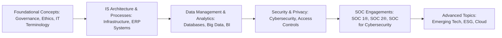
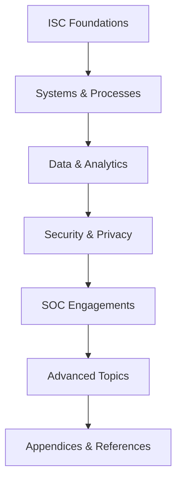

## 1.1 Scope and Structure of the ISC Discipline

Information Systems and Controls (ISC) is an expansive domain examining the intersection of technology, data, governance, and risk management. As businesses continue to invest in robust information systems—and as these systems grow more complex and integrated—Certified Public Accountants (CPAs) play a pivotal role in guiding their clients toward sound IT governance, cyberdefense, and control best practices. This section explains the essential scope of the ISC discipline from the perspective of the 2025 AICPA examination blueprint, clarifies how this discipline supports CPA fundamentals, and outlines the primary domains covered in this book.

### Understanding ISC in the CPA Context

At a surface level, “Information Systems and Controls” might seem relevant only to specialists in IT. However, modern CPAs are often called upon to validate that controls around financial data are reliable, to ensure that data used in financial statements or management decision-making is accurate and secure, and to evaluate risks associated with technology-driven processes. Whether CPAs work in public accounting, corporate finance, internal audit, or advisory capacities, they need a well-rounded understanding of how information systems operate, how internal controls are designed and tested, and how governance frameworks establish accountability in the digital environment.

Below is a high-level depiction of how major ISC domains interrelate and contribute to the CPA’s broader command of financial assurance and advisory services:

From foundational concepts of governance and risk to specialized engagements like SOC reports or cybersecurity assessments, CPAs must develop a structured lens to tackle information systems challenges. The breadth of ISC extends far beyond technology alone and encompasses process understanding, risk evaluation, controls design, audit procedures, and the ethical responsibilities inherent in overseeing digital data flows.

### Fundamental Pillars of the ISC Blueprint

In alignment with the AICPA’s guidance, the ISC discipline can be grouped into several key pillars. Each pillar underpins critical knowledge areas that empower CPAs to identify and address technology-related risks, opportunities, and compliance obligations within any type of organization—commercial, governmental, or nonprofit. The pillars described below align closely with the structure of this book:

• Foundational Concepts and Professional Context  
• Information Systems Architecture, Processes, and Controls  
• Data Management and Advanced Analytics  
• Security, Confidentiality, and Privacy  
• System and Organization Controls (SOC) Engagements  
• Advanced Topics, Practical Guidance, and Future Trends  
• Appendices and Reference Materials  

This organization provides a natural progression from basic concepts about IT controls to advanced auditing techniques and real-world advisory implications.

### Why These Domains Matter for CPAs

Modern CPAs are no longer confined to reviewing receipts, checking financial ledgers, or analyzing income statements in isolation. As technology evolves, auditors and financial professionals are increasingly asked to:

• Assess the internal controls built into complex Enterprise Resource Planning (ERP) systems.  
• Examine IT-driven processes tied to financial statement accuracy, focusing on the reliability of input, throughput, and output of critical transactions.  
• Validate cybersecurity and data privacy measures that protect sensitive client and organizational data.  
• Evaluate emerging technologies—blockchain, robotic process automation (RPA), artificial intelligence (AI)—and their impact on the control environment, data integrity, and regulatory compliance.  
• Provide assurance or advisory support for organizations undergoing SOC 1® or SOC 2® examinations.  
• Offer insights and strategic recommendations that connect technology risks with broader operational and financial performance.

A well-rounded mastery of ISC domains is essential for fulfilling these roles effectively. Each domain detailed in this book links to practical skills CPAs need to succeed in both standard and specialized engagements.

### Scope of the ISC Discipline

The scope of the ISC discipline encapsulates the breadth of what CPAs must know to intersect seamlessly with IT environments. This scope includes but is not limited to:

• Foundations of IT Governance: Understanding frameworks like COSO Internal Control – Integrated Framework, COSO Enterprise Risk Management (ERM), COBIT 2019, and the associated regulatory environment.  
• Basic IT Knowledge: Familiarity with hardware, software, networking components, and system development life cycles (SDLC).  
• IT General Controls (ITGCs): Recognizing common control categories (e.g., access controls, change management, computer operations) and how each impacts financial statement integrity.  
• Data Management: Managing data life cycles, database structures, and data analytics that underpin financial reporting and operational decision-making.  
• Cybersecurity and Privacy: Appreciating threat landscapes, encryption practices, disaster recovery strategies, and regulatory obligations around confidentiality of sensitive information.  
• SOC Engagements: Conducting, interpreting, or relying on SOC 1®, SOC 2®, and SOC for Cybersecurity reports, including the interplay of user entity controls and subservice organizations.  
• Emerging Topics: Rapid innovations—5G, IoT (Internet of Things), quantum computing—that introduce new forms of risk, opportunity, and regulatory challenges.

### How This Book Is Organized

This book—“Certified Public Accountant (CPA, AICPA®), Uniform CPA Examination Blueprints (Effective date: January 2025): Information Systems and Controls (ISC) Examination Supplemental Guide”—is divided into seven distinct parts. Each part builds on the previous one, offering a cumulative learning journey for the reader.

**Part I: Foundational Concepts and Professional Context**  
• Offers background on the evolution of CPA roles in IT environments.  
• Explores essential IT and IS terminology.  
• Covers governance frameworks like COSO, COBIT 2019, and important regulations like PCI DSS, HIPAA, and GDPR.  
• Introduces the fundamentals of IT assurance, ethics, and independence.  

**Part II: Information Systems Architecture, Processes, and Controls**  
• Delves into IT infrastructure, from hardware to operating systems and cloud computing models.  
• Examines ERP and accounting information systems, their architecture, and the role of automation and blockchain.  
• Discusses the structure of business processes (e.g., sales cycle, procure-to-pay cycle), flowcharting methods, and how to identify control deficiencies.  
• Introduces IT General Controls (ITGCs), the cornerstone of reliable system functionality.  

**Part III: Data Management and Advanced Analytics**  
• Explores data governance, database structures, data warehousing, big data environments, and essential analytics methods.  
• Addresses data quality, risk management, integration of data from disparate sources, and the use of advanced analytical tools such as AI and machine learning.  
• Highlights pitfalls in data analytics, along with continuous monitoring and other proactive control mechanisms.  

**Part IV: Security, Confidentiality, and Privacy**  
• Provides a detailed overview of cybersecurity fundamentals, including threats, zero-trust security models, and essential defense mechanisms (e.g., firewalls, IDPS, multi-factor authentication).  
• Explains encryption, key management, data loss prevention, privacy regulations, and unified strategies for preventing data breaches.  
• Details incident response procedures and forensic investigation basics to handle security events.  
• Advises on how to assess and test cybersecurity controls effectively.  

**Part V: System and Organization Controls (SOC) Engagements**  
• Focuses on the purpose, types, and scope of SOC reports (SOC 1®, SOC 2®, SOC 3®, SOC for Cybersecurity).  
• Explores the form and content of SOC reports, management assertions, and complementary user entity controls.  
• Guides you through planning and performing SOC engagements, from fieldwork to reporting opinions and handling subsequent events.  

**Part VI: Advanced Topics, Practical Guidance, and Future Trends**  
• Focuses on emerging technologies such as AI, quantum computing, the Internet of Things, and 5G connectivity.  
• Discusses data ethics, corporate social responsibility, and environmental, social, and governance (ESG) considerations in technology adoption.  
• Introduces advanced cloud governance issues, continuous auditing, and new skill sets that CPAs can expect to develop.  

**Part VII: Appendices and Reference Materials**  
• Gathers a consolidated glossary of key IT, security, and control terms.  
• Summarizes prominent technical frameworks and regulations.  
• Includes templates and checklists that CPAs can adapt for IT governance, change management, or particular audit engagements.

### Relevance to CPA Practice

Every topic within this book serves to enhance the CPA’s ability to:

• **Identify Internal Control Weaknesses**: By thoroughly understanding ITGCs and automated control sets, CPAs can pinpoint areas that might introduce financial misstatements or data errors.  
• **Protect Systems and Data**: CPAs assess cybersecurity readiness, ensuring client data remains secure from an ever-growing landscape of threats.  
• **Manage Risks**: From selecting third-party vendors to adopting new technologies like blockchain, CPAs can help organizations identify, measure, and respond to technology risks.  
• **Conduct SOC Engagements**: With increased reliance on cloud-based services and outsourced functions, CPAs proficient in SOC 1® or SOC 2® tools and methodologies become valuable advisors in evaluating service providers’ control environments.  
• **Champion Ethical Data Use**: As data analytics gathers steam, CPAs are in prime position to uphold data integrity, champion transparency, and ensure compliance with privacy regulations worldwide.  
• **Lead Digital Transformation**: Technology-savvy CPAs who appreciate the intricacies of information systems can spur organizational improvements by advocating for strategic digital investments and robust internal control frameworks.

### Case Study: An ERP Implementation Gone Awry

Imagine a mid-sized manufacturing company that decides to implement a new, cloud-based ERP system without robust internal IT governance. During the transition, the company overlooks fundamental security controls, such as multi-factor authentication (MFA) for remote logins and timely system patching.

As a result, the company’s order-entry and payment-processing modules face downtime due to a phishing attack—freezing critical customer billing processes and ultimately leading to significant financial losses and reputational damage. A CPA team with solid ISC knowledge could have preempted many issues by recommending:

• Formal change management processes and testing environments.  
• Access controls and credential management (e.g., role-based privileges, MFA implementation).  
• IT security monitoring (e.g., intrusion detection and real-time log reviews).  
• Periodic vulnerability assessments to identify system weaknesses or configuration gaps.

This scenario underscores how technology missteps can sink operational performance and disrupt financial reporting. CPAs who recognize red flags early help mitigate such crises, protecting stakeholder interests and preserving the integrity of financial data.

### Common Pitfalls in ISC

1. **Underestimating IT Risks**: Many organizations regard IT as purely operational and neglect to budget or plan for robust cybersecurity, vendor oversight, or data retention strategies until a crisis strikes.  
2. **Fragmented Accountability**: Without a cohesive governance framework, responsibility for IT controls, data security, and financial audits may be scattered across departments, leading to coverage gaps.  
3. **Poor Documentation**: Failure to document policies, procedures, and system configurations makes it difficult to conduct effective audits or respond quickly to incidents.  
4. **Ineffective Change Management**: Downtime, data corruption, or security vulnerabilities often arise when new software versions or patches are applied without thorough testing.  
5. **Weak Segregation of Duties**: In small organizations especially, employees might fulfill multiple IT and financial roles that create potential conflicts of interest or security exposures.  
6. **Lack of Ongoing Training**: Technological progress outstrips staff skill development, leaving skill gaps that hamper the ability to operate, maintain, and audit innovative systems.

### Visual Map of the Book’s Structure

Below is a simplified diagram illustrating how each of the major parts references and builds upon the others:

This structural progression ensures that readers gradually develop an understanding of IT building blocks, key risks, and specialized audit concepts before diving into emerging or advanced areas like AI, quantum computing, and ESG-driven technology governance.

### Conclusion

The ISC discipline merges technical knowledge with financial acumen—an imperative for CPAs who navigate complex digital ecosystems. This book is designed to equip you with the strategic, operational, and ethical perspectives you need to evaluate information systems and safeguard the integrity of financial data in today’s tech-driven environment. By studying each domain, practicing with real-world scenarios, and learning from recognized frameworks, you become better prepared for both the CPA exam and the evolving demands of 21st-century business.

---

## Test Your Knowledge: ISC Scope and Structure Fundamentals



### Which of the following best describes the overarching goal of the ISC discipline for CPAs?
- [ ] Mastering a narrow subset of IT coding skills
- [x] Equipping CPAs to address risks and controls of information systems that impact financial integrity
- [ ] Focusing solely on cybersecurity technical certifications
- [ ] Eliminating all technology spending within organizations

> **Explanation:** ISC aims to ensure CPAs can recognize and manage IT-related risks and controls that directly influence financial reporting, audit, and advisory functions.

### What is a key advantage for CPAs who fully understand IT governance frameworks like COSO and COBIT?
- [ ] They can self-certify as network engineers
- [x] They can effectively evaluate and design internal controls related to financial data integrity
- [ ] They can eliminate the need for audits
- [ ] They can instantly detect hacking attempts without tools

> **Explanation:** Frameworks such as COSO and COBIT help CPAs align IT controls with broader organizational goals and develop robust internal control structures.

### Which domain primarily addresses the creation, storage, and management of data throughout its lifecycle?
- [ ] Information Systems Architecture
- [x] Data Management and Advanced Analytics
- [ ] Security, Confidentiality, and Privacy
- [ ] System and Organization Controls (SOC) Engagements

> **Explanation:** Data Management and Advanced Analytics focus on data governance, database structures, warehousing, big data, and how to analyze data for decision-making and audit.

### In the context of ISC, why is change management critical?
- [x] It helps prevent unauthorized or poorly tested updates that could compromise system integrity
- [ ] It strictly limits all software updates indefinitely
- [ ] It focuses only on marketing personnel’s branding changes
- [ ] It is optional in agile development environments

> **Explanation:** Proper change management includes documentation, testing, and approval of updates, mitigating risks like corruption of financial data or system downtime.

### Which of the following correctly pairs an ISC domain with an example engagement activity?
- [x] SOC Engagements – Audit of an external service provider’s processing integrity controls
- [ ] Foundational Concepts – Deploying a new cloud computing architecture
- [ ] Security & Privacy – Structuring an ERP system’s functional modules
- [ ] Data Management – Performing an incident response after a cybersecurity breach

> **Explanation:** SOC engagements typically involve evaluating and reporting on a third-party service provider’s controls, including processing integrity, which is essential for financial statement assurance.

### Which common pitfall often arises due to small teams or resource constraints in an organization?
- [ ] Sophisticated, formalized governance structure
- [x] Weak segregation of duties
- [ ] Mature identity management system
- [ ] Comprehensive IT risk assessment

> **Explanation:** In smaller organizations, employees often wear multiple hats, creating potential conflicts of interest or reduced security if system privileges are not well segregated.

### Why are data life cycle considerations important for CPAs?
- [x] Data classification, retention schedules, and destruction protocols can significantly impact financial records, privacy compliance, and audit trails
- [ ] Data is a static asset and rarely changes
- [ ] Only IT administrators need to consider data life cycle management
- [ ] They ensure all data stays stored forever

> **Explanation:** CPAs must understand how data is created, attached to financial transactions, archived, and destroyed to ensure compliance, prevent unauthorized disclosure, and maintain robust audit trails.

### Which is the best reason to integrate “Business Impact Analysis (BIA)” into a CPA’s approach to IT audits?
- [x] It identifies critical functions and recovery priorities that shape business continuity planning
- [ ] It replaces the need for any IT risk assessment
- [ ] It only concerns the marketing department’s brand image
- [ ] It eliminates the chance of any downtime absolutely

> **Explanation:** BIAs help organizations rank critical processes and define time-sensitive recovery objectives, which is crucial for safeguarding financial operations during disruptions.

### What is a major benefit of Part VII: Appendices and Reference Materials in this ISC guide?
- [x] It provides templates, glossaries, and summarized frameworks for quick reference and practical use
- [ ] It removes the need for continuous learning and development
- [ ] It strictly focuses on general ledger reconciliation practices
- [ ] It is primarily an optional read for anyone uninterested in IT

> **Explanation:** The appendices offer quick lookups, summary documents, and tools that CPAs can tailor to various IT-focused audits or governance tasks, reinforcing applied learning.

### True or False: CPAs involved in SOC 1® or SOC 2® engagements do not need any knowledge of IT general controls or cybersecurity risks.
- [ ] True
- [x] False

> **Explanation:** SOC engagements require thorough evaluation of a service organization’s control environment, including IT general controls, security measures, and risk management processes related to financial and other critical data.



---

## For Additional Practice and Deeper Preparation

### [Information Systems and Controls (ISC)](https://www.udemy.com/course/isc-cpa-mock-exams/?referralCode=E1217303222935C5E464)

**Information Systems and Controls (ISC) CPA Mocks:** 6 Full (1,500 Qs), Harder Than Real! In-Depth & Clear. Crush With Confidence!

- Tackle full-length mock exams designed to mirror real ISC questions.  
- Refine your exam-day strategies with detailed, step-by-step solutions for every scenario.  
- Explore in-depth rationales that reinforce higher-level concepts, giving you an edge on test day.  
- Boost confidence and minimize anxiety by mastering every corner of the ISC blueprint.  
- Perfect for those seeking exceptionally hard mocks and real-world readiness.

_Disclaimer: This course is not endorsed by or affiliated with the AICPA, NASBA, or any official CPA Examination authority. All content is for educational and preparatory purposes only._

---

### References & Further Reading

• AICPA: Official CPA Exam Blueprints – https://www.aicpa.org  
• COSO: Committee of Sponsoring Organizations of the Treadway Commission – https://www.coso.org  
• ISACA: COBIT 2019 Framework – https://www.isaca.org/resources/cobit  
• Center for Internet Security (CIS) – https://www.cisecurity.org  
• NIST: National Institute of Standards and Technology (Cybersecurity Framework) – https://www.nist.gov  

These resources provide supplementary insight into frameworks, standards, and best practices for auditing, managing, and governing IT systems and data. By exploring both the theoretical and practical components of ISC, you position yourself to become indispensable in a tech-driven profession where risk-informed decision-making is paramount.
