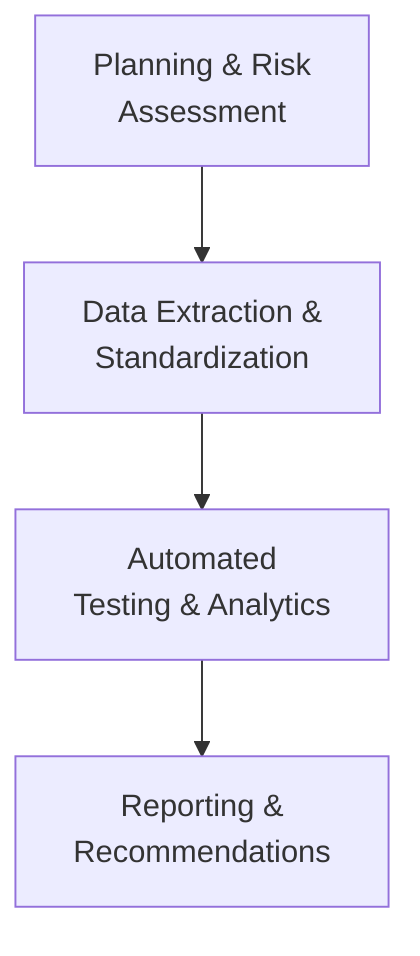
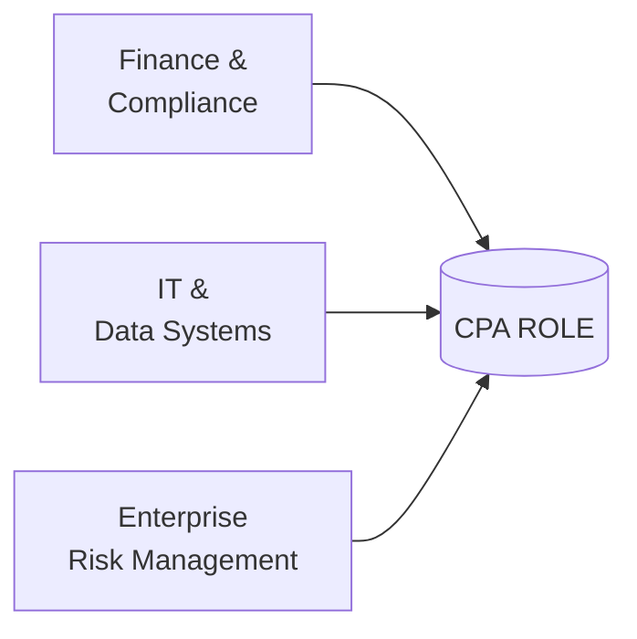

## 1.2 The Evolving Role of CPAs in IT Audits and Advisory

The role of Certified Public Accountants (CPAs) has expanded significantly in today’s digital age. CPAs are no longer solely concerned with traditional financial reporting, compliance, and tax matters. They are increasingly called upon to understand the ever-evolving landscape of information technology (IT), data analytics, cybersecurity, and the systems that support financial information flows. This evolution has given rise to new opportunities and responsibilities for CPAs as both IT auditors and advisors. This section explores how the profession is adapting, the value CPAs bring to IT audits, and why mastery of Information Systems and Controls (ISC) knowledge is becoming a linchpin for career advancement and professional success.

CPAs now serve as trusted partners who can bridge the gap between finance, information systems, and risk management. To remain competitive and relevant, modern CPAs must be conversant in technology-driven auditing processes, data analytics, cybersecurity, and the broader regulatory frameworks that underpin IT governance. Strengthening these competencies enables them to offer decision-ready insights, perform more targeted assessments, provide strategic guidance, and ensure stakeholders maintain confidence in the reliability and security of financial and operational data.

-------------------------------------------------------------------------------
  
### The Intersection of Finance and Technology

Traditionally, CPAs have focused on ensuring financial data integrity, internal controls, and regulatory compliance. However, advances in technology have transformed financial processes, data management, and organizational risk profiles. Accounting systems, once solely tasked with capturing, storing, and reporting transactional data, now play an integral role in business analytics, process automation, and strategic decision-making.

As Part II of this guide (“Information Systems Architecture, Processes, and Controls”) details, modern organizations rely on interconnected networks, cloud computing, Enterprise Resource Planning (ERP) systems, and advanced database infrastructures to support complex operations. The accountant’s role now extends to evaluating the design and effectiveness of these systems and ensuring they meet both internal control requirements and external compliance obligations.

#### Key Areas Where Finance and Technology Intersect

• **Data Analytics and Strategy**: CPAs leverage data analytics tools to produce insights related to budgeting, forecasting, and performance measurement.  
• **Risk Management**: Technology has expanded the scope of risk, introducing cybersecurity threats and data privacy concerns that intertwine with traditional financial risks.  
• **Process Automation**: Tools like Robotic Process Automation (RPA) and artificial intelligence (AI) free CPAs from repetitive tasks, allowing them to focus on investigative, strategic work.  
• **Real-Time Reporting**: With cloud-based solutions, financial reporting is rapidly becoming a near real-time process, demanding equally real-time assurance.  

-------------------------------------------------------------------------------

### Why CPAs are Well-Suited to IT Audits and Advisory

The CPA credential denotes a high level of integrity, independence, and competence in understanding internal controls, auditing standards, and ethics. These same qualities translate well into IT audits, where assessing controls over automated systems, network security, software development processes, and data integrity is critical. 

1. **Foundational Control Expertise**  
   CPAs often have deep knowledge of the COSO Internal Control – Integrated Framework, guiding principles for governance, risk, and compliance (GRC), and an awareness of key standards like COBIT or the AICPA Trust Services Criteria. This foundation equips CPAs to evaluate both manual and automated controls within an IT environment.

2. **Strong Analytical Skillset**  
   Analytical and critical-thinking skills are central to the CPA profession. These skills allow CPAs to understand data flows, spot unusual trends, and identify system-level risks that can potentially compromise financial data accuracy or hamper operational efficiency.

3. **Ethical Mandate and Professional Skepticism**  
   As mandated by the Code of Professional Conduct, CPAs exercise professional skepticism and objectivity. In an IT audit context, such skepticism is vital in evaluating emerging technologies, third-party services, or new controls. It ensures that reliance on automated processes does not overshadow diligent oversight.

4. **Interdisciplinary Communication**  
   CPAs excel at translating complex technical information into actionable insights for stakeholders from diverse backgrounds. This ability is invaluable for presenting IT audit findings to boards, audit committees, or executive leaders who may lack a technical background but must still understand the implications of IT risks. 

-------------------------------------------------------------------------------

### Technology-Enabled Procedures in Modern Auditing

The digital shift has led to IT audits becoming more data-driven and technology-enabled. CPAs are increasingly using specialized audit software, data visualization tools, blockchain exploratory frameworks, AI-assisted analytics, and continuous monitoring platforms. These innovations enhance the accuracy and timeliness of audit work while providing deeper operational, financial, and compliance insights.

Below is a high-level illustration of how a technology-enabled IT audit might be structured:

**Diagram Explanation:**

• **Planning & Risk Assessment**: The CPA sets objectives and identifies organizational and IT-specific risks (e.g., cybersecurity threats, lack of appropriate access controls).  
• **Data Extraction & Standardization**: Relevant financial and operational data is gathered from various systems (ERP, databases, cloud environments) and standardized for analysis.  
• **Automated Testing & Analytics**: Automated tools perform control effectiveness tests, data analytics, and anomaly detection, drastically reducing manual sampling needs.  
• **Reporting & Recommendations**: The CPA interprets the analytics results, identifies areas for improvement, and communicates findings to management or governance bodies.

By using such an approach, CPAs provide greater transparency and thoroughness within an IT audit engagement. Technology enables them to test entire populations of data, analyze multiple data streams simultaneously, and deliver more relevant findings for continuous improvement.

-------------------------------------------------------------------------------

### Changes in the Profession Demanding ISC Mastery

The push toward digital transformation demands CPAs become conversant in ISC-related concepts to stay relevant and continue to deliver value. Regulatory authorities, professional bodies, and oversight committees increasingly expect CPAs to:

• Identify and mitigate emerging cybersecurity risks (Chapter 16).  
• Conduct audits under frameworks such as SOC 1® and SOC 2® (see Part V on SOC Engagements).  
• Assess the design, implementation, and monitoring of robust IT General Controls (Chapter 8).  
• Review ERP configurations and third-party integrations for financial accuracy and compliance (Chapter 6).  
• Offer advisory services on process automation, data management strategies, and system governance (Chapters 15 and 29).

In the context of the Uniform CPA Examination, the AICPA has introduced expanded coverage of ISC because organizations demand auditors who can verify the reliability of systems that generate critical financial data. For instance, the ability to evaluate Enterprise Resource Planning (ERP) security parameters or test system change management processes is rapidly becoming a standard requirement in many financial audit and advisory engagements.

-------------------------------------------------------------------------------

### Real-World Case: IT Advisory Opportunity

Consider a mid-sized regional manufacturing company implementing a new ERP system. While the organization is confident in its accounting team’s ability to ensure correct data input, it lacks internal knowledge regarding:

• The necessary security protocols for the new ERP environment.  
• Configuration settings to meet regulatory requirements.  
• Proper segregation of duties (SoD) within various ERP modules.  
• Disaster recovery and continuity planning for the new system.  

A CPA with strong ISC expertise can step in to:

1. **Assess the Current Controls**: Evaluate user permissions, data flows, and SoD frameworks.  
2. **Advise on Best Practices**: Recommend aligning the system with relevant standards such as COBIT 2019.  
3. **Monitor Implementation**: Oversee the development and testing phases to spot potential control gaps.  
4. **Conduct Post-Implementation Reviews**: Provide assurance and ongoing reporting for management and external stakeholders.

Such engagements underscore the added value CPAs bring beyond traditional financial statement audits, merging both technical and financial acumen.

-------------------------------------------------------------------------------

### Emergence of Cybersecurity Expertise

With cybersecurity threats on the rise (see Chapter 16: Foundations of Cybersecurity), CPAs have found increasing demand for their expertise in evaluating and advising on security controls. CPAs focus on the financial and reputational impacts of breaches, from lost business to regulatory fines. They can incorporate cybersecurity reviews within broader internal controls assessments, an approach that resonates well with boards looking for a holistic risk management strategy.

A CPAs’ combined knowledge of internal controls, financial processes, and compliance requirements uniquely positions them to assess the overall security posture of an organization. Through analyzing access control, encryption, and incident response capabilities, CPAs add value not only by identifying vulnerabilities but by quantifying potential losses and advising on cost-effective protective measures.

-------------------------------------------------------------------------------

### How CPAs Can Further Develop IT Skills

1. **Continuous Learning**  
   Remaining current is crucial. CPAs should regularly engage with continuing education programs, webinars, and certifications offered by professional bodies, cloud service providers, and cybersecurity organizations.

2. **Leveraging Collaborative Partnerships**  
   Partnering with or hiring IT specialists and data scientists can fill skills gaps. CPAs should collaborate with these professionals to build robust multidisciplinary teams.

3. **Professional Networking and Communities**  
   Actively participating in forums, conferences, and industry events (e.g., ISACA, ACFE, IIA) provides insights into the latest threats, tools, and best practices for IT audits.

4. **Practical Exposure**  
   Hands-on experience with ERP systems, analytics platforms, and security assessments nurtures a deeper understanding of the complexities involved in IT auditing and advisory.

-------------------------------------------------------------------------------

### Common Pitfalls and Best Practices

#### Pitfalls

• **Overreliance on Automated Tools**  
  Failing to apply professional judgment and skepticism may lead to overlooked exceptions or system misconfigurations.

• **Lack of Clear Communication**  
  Technical details can overwhelm non-IT stakeholders, hindering the effectiveness of findings and recommendations.

• **Insufficient Training**  
  Underestimating the learning curve for new technologies like AI, machine learning, or blockchain may lead to misguided opinions and suboptimal recommendations.

• **Ignoring Culture and Organizational Resistance**  
  Technologies succeed when aligned with organizational culture. Ignoring staff buy-in or failing to integrate new methods into existing workflows can limit benefits.

#### Best Practices

• **Holistic Risk Assessment**  
  Integrate IT risk considerations into the overall enterprise risk assessment, bridging gaps between finance, IT, and operations.

• **Proactive Collaboration**  
  Engage with IT teams early and frequently. Mutual respect and partnership often yield more accurate and efficient control evaluations.

• **Emphasize Documentation**  
  Clear, consistent documentation of controls, testing methodologies, and results is vital for traceability and regulatory inspections.

• **Continuous Monitoring**  
  Encourage clients or employers to implement automated monitoring of critical systems to detect anomalies quickly and reduce the risk of control failures going unnoticed.

-------------------------------------------------------------------------------

### Future Outlook for CPAs in IT Audits

The digital revolution shows no signs of slowing. Developments in blockchain, data analytics, AI-driven automation, and edge computing will further transform financial processes and the associated assurance activities. CPAs who invest in ISC knowledge will find themselves at the nerve center of these changes—identifying and mitigating risk, streamlining processes, and driving value through insightful, technology-forward advisory services.

Looking ahead, CPAs will take on broader engagements, such as:

• **Continuous Auditing and Monitoring**: Offering near real-time assurance through automated tools integrated into dynamic IT environments.  
• **Focus on ESG and Data Ethics** (Chapter 30): Ensuring that sustainability disclosures and ethically sourced data align with robust assurance frameworks.  
• **Emphasis on Resilience**: Advising on business continuity, cyber risk transfer (cyber insurance strategies), and advanced disaster-recovery mechanisms.  

-------------------------------------------------------------------------------

### Practical Diagram: CPA at the Center of IT Assurance

Below is a visual representation of how modern CPAs stand at the center of multiple overlapping areas—finance, IT, and risk. The CPA’s role involves balancing technical acuity, regulatory compliance, and business insights.

**Diagram Explanation:**

1. **Finance & Compliance**: CPAs use their in-depth financial knowledge to assess impacts of IT changes on financial reporting and compliance.  
2. **IT & Data Systems**: They evaluate system configuration, data integrity, and the robustness of technology-enabled controls.  
3. **Enterprise Risk Management**: CPAs help identify and mitigate IT-related risks, ensuring the alignment of risk appetite and strategic objectives.

-------------------------------------------------------------------------------

### References for Further Exploration

• AICPA. (2023). “Trust Services Criteria,” available on the AICPA’s official website.  
• ISACA. (2019). “COBIT 2019 Framework,” available at www.isaca.org.  
• COSO. (2017). “Enterprise Risk Management: Integrating with Strategy and Performance.”  
• “Cybersecurity: Managing Cyber Risk in the Financial Services Industry,” from the World Economic Forum.  
• “Information Systems and Controls (ISC) CPA Mocks” [Udemy Course](https://www.udemy.com/course/isc-cpa-mock-exams/?referralCode=E1217303222935C5E464).

-------------------------------------------------------------------------------

## Mastering the Evolving Role of CPAs in IT Audits Quiz



### CPAs are increasingly involved in IT audits because:
- [x] They possess foundational control and ethical expertise that applies well in technical settings.
- [ ] They are the only professionals allowed to operate IT systems legally.
- [ ] They automatically receive a cybersecurity certification upon licensure.
- [ ] They have no stake in enterprise risk management.

> **Explanation:** CPAs have deep internal control, regulatory knowledge, and a strong ethical reputation that makes them uniquely qualified to assess IT environments, especially as organizations digitize operations.

### Which of the following is a notable benefit of technology-enabled audit procedures?
- [x] Enhanced breadth and depth of data testing through automation.
- [ ] Guaranteed reduction of all audit risks to zero.
- [ ] Complete elimination of the need for professional judgment.
- [ ] Replacing all human efforts with machine-only auditing.

> **Explanation:** Automation and data analytics enable CPAs to handle extensive data sets for more robust testing. However, these procedures supplement—rather than replace—professional judgment and expertise.

### What is a common pitfall for CPAs when performing IT audits?
- [x] Overreliance on automated tools without applying adequate professional skepticism.
- [ ] Collecting a broad selection of data sets for analysis.
- [ ] Documenting findings clearly for non-technical stakeholders.
- [ ] Keeping abreast of technology through continuous learning.

> **Explanation:** While automated tools are a powerful asset, overreliance without ongoing critical evaluation can lead to overlooked anomalies or system misconfigurations.

### Why is it beneficial for CPAs to collaborate with IT specialists?
- [x] It bridges any gaps in technical knowledge and enhances multidisciplinary engagements.
- [ ] It eliminates the need for CPAs to learn about emerging technologies.
- [ ] It absolves the CPA of any reporting responsibilities.
- [ ] It completely removes the need for external audits.

> **Explanation:** Collaboration ensures a robust approach to IT auditing by bringing together the complementary skills of both the CPA and the IT specialist, strengthening the overall audit or advisory engagement.

### Which statement is true regarding CPAs’ role in cybersecurity assessments?
- [x] CPAs help identify vulnerabilities and quantify their potential financial and reputational costs.
- [ ] CPAs have exclusive authority over data encryption protocols.
- [x] CPAs integrate cybersecurity risk assessments with broader financial and operational risk considerations.
- [ ] CPAs disregard cybersecurity when auditing cloud-hosted systems.

> **Explanation:** CPAs offer a holistic perspective on the cost implications and compliance risks of cyber threats, drawing on their financial and internal control expertise.  

### What is one of the main reasons that the AICPA includes ISC content in the Uniform CPA Examination?
- [x] Organizations increasingly demand assurance over the systems generating and processing financial data.
- [ ] It is a direct replacement for all traditional financial questions.
- [ ] It exclusively covers taxation of digital services.
- [ ] It focuses only on QuickBooks and similar accounting software.

> **Explanation:** The AICPA recognized that modern businesses rely on integrated electronic systems, and CPAs must competently evaluate and ensure the integrity of these systems.

### An example of a technology-enabled audit procedure is:
- [x] Using data analytics tools to test entire populations of transactional data.
- [ ] Solely relying on staff interviews with no verification.
- [x] Applying AI-based algorithms to detect unusual patterns or fraud indicators.
- [ ] Substituting all financial data with random sampling data.

> **Explanation:** By leveraging data analytics and AI-based techniques, CPAs can analyze large data sets efficiently and effectively, helping to spot irregularities that may be missed by traditional methods.

### What is an outcome of continuous monitoring in IT audits?
- [x] Quick detection of anomalies and potential control breaches.
- [ ] The complete elimination of the need for any human auditing.
- [ ] A passive form of oversight with minimal stakeholder involvement.
- [ ] Guaranteed immunity from data security breaches.

> **Explanation:** Continuous monitoring can alert auditors and management to issues as they arise, enabling timely corrective action before problems escalate.

### In a typical technology-enabled IT audit, which of the following steps is crucial?
- [x] Defining the scope of automated testing and data analytics work.
- [ ] Relying on management’s verbal assurance without verifying underlying systems.
- [ ] Avoiding any documented methodology to maintain flexibility.
- [ ] Not communicating with the IT department to maintain independence.

> **Explanation:** Clearly defining the scope and methodology, and engaging with the IT department, ensures the audit addresses the core risks and evaluates appropriate controls effectively. 

### CPAs can add value in IT advisory by:
- [x] Providing recommendations for aligning governance structures with frameworks like COBIT.
- [ ] Halting all advanced technology initiatives if the organization is compliant.
- [ ] Restricting any collaboration with cybersecurity or IT teams.
- [ ] Disregarding user access and change management processes.

> **Explanation:** CPAs can advise on aligning strategic IT initiatives with recognized frameworks, improving internal controls, and optimizing processes across the enterprise.



--------------------------------------------------------------------------------

## For Additional Practice and Deeper Preparation

### [Information Systems and Controls (ISC)](https://www.udemy.com/course/isc-cpa-mock-exams/?referralCode=E1217303222935C5E464)  

**Information Systems and Controls (ISC) CPA Mocks:** 6 Full (1,500 Qs), Harder Than Real! In-Depth & Clear. Crush With Confidence!  

- Tackle full-length mock exams designed to mirror real ISC questions.  
- Refine your exam-day strategies with detailed, step-by-step solutions for every scenario.  
- Explore in-depth rationales that reinforce higher-level concepts, giving you an edge on test day.  
- Boost confidence and minimize anxiety by mastering every corner of the ISC blueprint.  
- Perfect for those seeking exceptionally hard mocks and real-world readiness.

_Disclaimer: This course is not endorsed by or affiliated with the AICPA, NASBA, or any official CPA Examination authority. All content is for educational and preparatory purposes only._
