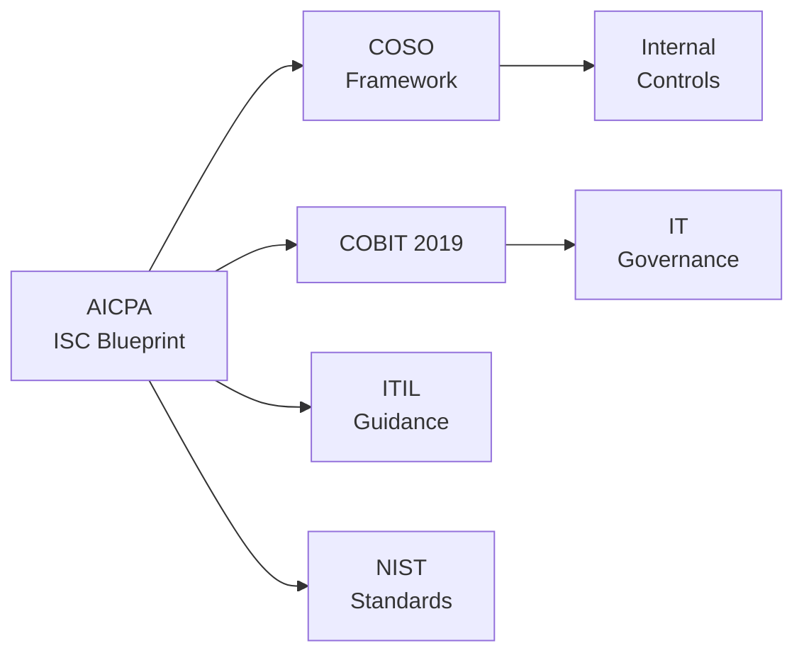

## 1.3 Overview of the AICPA ISC Blueprint and Related Standards

The American Institute of Certified Public Accountants (AICPA) has introduced the Information Systems and Controls (ISC) domain in the Uniform CPA Examination Blueprint, effective from January 2025, to reflect the growing importance of technology in accounting, auditing, and advisory services. The ISC domain encompasses a range of competencies—from foundational IT concepts to complex frameworks, audit and assurance techniques, security controls, data management, and governance frameworks.

This section aims to:  
• Summarize how the AICPA’s ISC Blueprint catalogues essential competencies.  
• Illustrate how each chapter in this Supplemental Guide maps to the official AICPA content outlines.  
• Highlight the myriad of frameworks (COSO, COBIT, ITIL, PCI DSS, HIPAA, GDPR, and others) and standards that underpin and influence the examination content.  
• Provide a foundational reference point for understanding prerequisites, knowledge areas, and their practical application in professional practice.  

By embedding these standards and frameworks within the ISC Blueprint, the AICPA ensures that newly licensed CPAs have the skills needed not only to navigate risk and compliance within digital ecosystems, but also to serve as trusted advisors in the face of technological evolution.

-------------------------------------------------------------------------------

### The Significance of the ISC Domain in the Uniform CPA Examination

The Information Systems and Controls (ISC) domain marks a paradigm shift in how CPAs engage with technology. Whereas previous iterations of the exam emphasized broad IT fundamentals, the updated ISC content areas delve into the mechanics of implementing, auditing, and governing information systems. The incorporation of cybersecurity, data analytics, business process controls, SOC engagements, and emerging technologies underscores the CPA profession’s recalibration in an era dominated by digital transformation.

The primary objectives of the ISC portion of the exam include:

• Demonstrating proficiency in evaluating the design and operating effectiveness of IT controls.  
• Understanding the interplay between business processes, data integrity, and financial reporting accuracy.  
• Applying risk-based approaches to identify and respond to potential IT-related misstatements and control deficiencies.  
• Advising stakeholders on the governance and implementation of technology solutions in line with recognized frameworks and regulatory requirements.

-------------------------------------------------------------------------------

### Mapping the ISC Blueprint to the Supplemental Guide’s Chapters

While the ISC domain is summarized by the AICPA in distinct content areas, this Supplemental Guide expands upon these areas through logical, sequential chapters that reflect real-world workflows and risk considerations. Below is a high-level overview of how these chapters align with the AICPA ISC Blueprint themes:

• Part I: Foundational Concepts and Professional Context (Chapters 1–4)  
  – Establishes the overarching role of CPAs in technology oversight and links fundamental terms and definitions to the AICPA’s specified knowledge areas.  
  – Introduces COSO frameworks, risk assessment methodologies, governance structures, and the professional standards that guide IT audits, mapping directly to competencies relating to internal control awareness, risk frameworks, and ethical considerations.  

• Part II: Information Systems Architecture, Processes, and Controls (Chapters 5–10)  
  – Addresses infrastructure, ERP systems, and core business processes, including essential controls within these environments.  
  – Reflects the ISC’s emphasis on analyzing transaction flows, IT General Controls (ITGC), change management, and the systems development life cycle (SDLC).  

• Part III: Data Management and Advanced Analytics (Chapters 11–15)  
  – Deep dives into data governance, database administration, data warehousing, big data, and analytics, paralleling the exam’s focus on data integrity, data analytics, and continuous monitoring techniques.  

• Part IV: Security, Confidentiality, and Privacy (Chapters 16–21)  
  – Demonstrates the alignment with topics such as cybersecurity threats, access management, encryption, privacy regulations, and incident response, which the AICPA identifies as growing priorities for CPAs in IT assurance.  

• Part V: System and Organization Controls (SOC) Engagements (Chapters 22–27)  
  – Maps directly to the AICPA’s specialized SOC reports, including SOC 1®, SOC 2®, and SOC for Cybersecurity. These are key areas of examination as CPAs are expected to understand the scope, methodologies, and reporting implications in various assurance engagements.  

• Part VI: Advanced Topics, Practical Guidance, and Future Trends (Chapters 28–31)  
  – Connects to the emerging areas identified by the AICPA—including blockchain, artificial intelligence, Internet of Things (IoT), quantum computing, 5G, and ESG considerations—and addresses the competencies required to advise stakeholders on risks, controls, and strategic implications.  

• Part VII: Appendices and Reference Materials (Chapters 32–34)  
  – Provides additional resources, checklists, templates, and references to frameworks that the AICPA deems essential for exam readiness and real-world application.  

-------------------------------------------------------------------------------

### Key Requirements in the AICPA ISC Blueprint

Although the levels of testing (i.e., remembering and understanding vs. application and analysis) vary across subtopics, there are recurrent competencies threaded throughout the ISC Blueprint:

1. **Risk Assessment**  
   The Blueprint stresses evaluating IT-related risks in various environments, including network infrastructure, databases, cloud environments, and outsourced operations.

2. **Internal Control Evaluation**  
   CPAs must assess design adequacy and operating effectiveness of IT controls—specifically ITGC (change management, access controls, operations) and application controls (input, processing, output controls).

3. **Regulatory Compliance**  
   Knowledge of frameworks such as COSO, COBIT 2019, and regulations such as Sarbanes-Oxley (SOX), HIPAA, PCI DSS, and GDPR is paramount. The AICPA situates CPAs at the intersection of these requirements, ensuring that they can advise on overlapping compliance mandates.

4. **Security and Privacy**  
   Greater emphasis is placed on cybersecurity measures, encryption, network security, vulnerability assessments, incident response, and privacy laws to manage data exposure risk.

5. **SOC Reporting**  
   The ISC domain heavily references assurance engagements involving SOC 1®, SOC 2®, SOC 3®, and SOC for Cybersecurity, focusing on scoping, testing, reporting, and client communication.

6. **Data Management and Analytics**  
   Expectations around data governance and the ability to leverage data analytic tools are embedded throughout the Blueprint. CPAs are tested on their capacity to interpret data flows, controls, and the reliability of data for financial and nonfinancial decision-making.

7. **Emerging Technologies**  
   The landscape of new technologies—like blockchain, robotic process automation (RPA), AI, and cloud computing—features prominently, with an emphasis on identifying the associated risks and recommending appropriate mitigating controls.

-------------------------------------------------------------------------------

### Relevant Standards and Frameworks

The ISC Blueprint references multiple governing frameworks, guidelines, and regulations that shape best practices in IT audits, risk assessments, and data management. Below is a concise summary of how these standards interplay with ISC competencies:

• **COSO Internal Control – Integrated Framework**  
  – A core framework for designing and evaluating internal controls, crucial in assessing IT controls within business processes.

• **COSO ERM Framework**  
  – Expands the focus to an enterprise-wide risk management approach, including technology-related risks and how they integrate into strategic objectives.

• **COBIT 2019**  
  – Provides an IT governance framework that complements COSO and offers detailed processes and control activities to ensure that information systems are effectively managed and aligned with enterprise objectives.

• **ITIL (IT Infrastructure Library)**  
  – Outlines best practices for IT service management, offering a structured approach to operations and service delivery that is increasingly relevant for CPAs engaged in operational audits.

• **PCI DSS (Payment Card Industry Data Security Standard)**  
  – Establishes controls around cardholder data security, a domain often subject to both regulatory examination and external assurance engagements.

• **HIPAA (Health Insurance Portability and Accountability Act)**  
  – Addresses health information privacy and security requirements, pertinent for CPAs performing audits or consulting in healthcare settings.

• **GDPR (General Data Protection Regulation)**  
  – The European Union’s comprehensive data privacy law that has global implications for data processing and breach notification procedures, reflecting a shift toward more stringent privacy controls throughout the world.

• **NIST (National Institute of Standards and Technology)**  
  – Widely recognized security controls guidance, including the NIST Cybersecurity Framework, used by various organizations seeking a benchmark for designing and measuring their information security posture.

Many of these frameworks and regulations share overlapping objectives regarding risk identification, control implementation, continuous monitoring, and governance. The AICPA expects CPAs to be familiar with these commonalities and to demonstrate their ability to integrate multiple frameworks simultaneously.

-------------------------------------------------------------------------------

### Visualizing the Relationship Between the AICPA ISC Blueprint and Key Frameworks

Below is a simplistic Mermaid diagram illustrating how the AICPA ISC Blueprint draws upon multiple frameworks to define its competencies:

In this diagram, the AICPA ISC Blueprint branches out and integrates a variety of recognized standards and frameworks. Each framework contributes a unique perspective or set of controls, and, in turn, CPAs leverage these to fulfill examination requirements and meet professional obligations.

-------------------------------------------------------------------------------

### Connecting the ISC Blueprint with Professional Practice

A key attribute of the ISC domain is its focus on practical application. Beyond passing the exam, newly licensed CPAs are expected to:

• Evaluate an entity’s current IT environment, identify gaps using frameworks like COSO, COBIT, or NIST, and propose enhancements that align with regulatory and compliance requirements.  
• Conduct or advise on external and internal IT audits, ensuring that the scope, testing approach, and documentation adhere to AICPA professional standards.  
• Collaborate with cross-functional teams in finance, operations, and IT to design integrated controls—especially in ERP implementations, data management, and cybersecurity contexts.  
• Serve in leadership roles when adopting emerging technologies, particularly around due diligence, risk assessment, design considerations, and strategic decision-making.

-------------------------------------------------------------------------------

### Practical Examples and Case Studies

Below are two brief scenarios to illustrate how integrative knowledge of AICPA requirements and industry frameworks might appear in practice:

1. **Healthcare Organization Undergoing a HIPAA Audit**  
   A mid-sized hospital system is concerned about safeguarding patient data. An internal audit reveals deficiencies in how electronic health records are protected and encrypted. A CPA specializing in IT audits references COSO to categorize controls, uses COBIT 2019 processes to guide improvements to the hospital’s IT governance, and advocates for aligning with HIPAA requirements to ensure compliance. The result is an enhanced security posture, reduced chance of future breaches, and improved audit readiness.

2. **SOC 2® Engagement in a SaaS Company**  
   A software-as-a-service (SaaS) startup preparing for a SOC 2® engagement engages a CPA firm to evaluate its security and availability controls. The CPA team leverages the Trust Services Criteria outlined by the AICPA and cross-references them against COBIT 2019 components. They test encryption procedures, data backup and recovery plans, and access management controls. The finalized SOC 2® report provides prospective clients with assurance about the startup’s control environment.

Such examples underscore the CPA’s evolving role beyond strictly financial audits to include evaluating and attesting to the effectiveness of technology controls.

-------------------------------------------------------------------------------

### Best Practices and Common Pitfalls

• **Best Practices**  
  – Embrace a holistic view: Integrate multiple frameworks (e.g., COSO and COBIT) to avoid narrowly scoped control designs.  
  – Stay informed: Keep up-to-date with changing regulations (e.g., GDPR updates) and technology trends.  
  – Document thoroughly: Maintain clear control documentation, test steps, and conclusions for external review.  
  – Foster cross-functional collaboration: Engage with IT, legal, compliance, and operational teams early and often.

• **Common Pitfalls**  
  – Overlooking subservice organizations or user entity controls in SOC 1® or SOC 2® engagements.  
  – Relying solely on a single framework without considering specific regulatory requirements or industry nuances.  
  – Underestimating the importance of cybersecurity given the rising threats in an interconnected world.  
  – Neglecting continuous monitoring or post-implementation assessments, leading to a decline in controls effectiveness over time.

-------------------------------------------------------------------------------

### References for Further Exploration

• AICPA, “Uniform CPA Examination Blueprints” (Effective Date: January 2025).  
• The IIA, “Global Technology Audit Guides (GTAG)” series.  
• COSO, “Internal Control – Integrated Framework” and “ERM Framework”.  
• ISACA, “COBIT 2019 Framework.”  
• NIST, “Cybersecurity Framework” and “Special Publications (SP) 800-series.”  
• ISACA and AICPA, joint whitepapers on IT governance and risk management.  

By integrating these resources into your study and practice, you will ensure both exam readiness and professional competence in evaluating and managing IT-related risks.

-------------------------------------------------------------------------------

## Quiz on AICPA ISC Blueprint & Related Standards



### Which of the following is a primary focus within the AICPA ISC Blueprint?
- [ ] Exclusive reliance on financial statement testing
- [x] Evaluating IT controls for effectiveness
- [ ] Using only manual processes in audits
- [ ] Limiting audit scope to small businesses

> **Explanation:** The ISC domain emphasizes the importance of IT controls design and operating effectiveness, ensuring CPAs can critically evaluate technology’s impact on financial reporting and compliance.

### Which framework is commonly cross-referenced with the COSO Internal Control – Integrated Framework to enhance IT governance?
- [ ] ITIL
- [x] COBIT 2019
- [ ] Six Sigma
- [ ] ISO 9001

> **Explanation:** COBIT 2019 is specifically designed to provide a robust IT governance approach and is often paired with COSO to address technology risks and controls comprehensively.

### According to the ISC Blueprint, which of the following is a major reason CPAs must understand data analytics?
- [x] To interpret large datasets and ensure data reliability
- [ ] To create complex visual effects in presentations
- [ ] To manage financial statement layout design
- [ ] To conduct manual bank reconciliations

> **Explanation:** The AICPA underscores the importance of data analytics, including interpreting large data sets, automating control testing, and providing heightened assurance over complex IT environments.

### Which of the following best describes the overarching goal of SOC 2® engagements as per the AICPA ISC Blueprint?
- [ ] To provide financial statement-level audit opinions
- [ ] To evaluate an entity’s engineering best practices
- [x] To report on controls relevant to security, availability, processing integrity, confidentiality, or privacy
- [ ] To assess personal tax return compliance

> **Explanation:** SOC 2® engagements focus on the Trust Services Criteria—security, availability, processing integrity, confidentiality, and privacy—and result in a report outlining the effectiveness of controls in these areas.

### Which of the following is a common pitfall identified when organizations rely exclusively on one framework (e.g., COSO) for their IT controls?
- [ ] They gain international recognition automatically
- [x] They may miss industry-specific regulatory requirements
- [ ] They prevent further audits from third parties
- [ ] They eliminate the need for management override

> **Explanation:** Using a single framework can create blind spots when specific laws or industry mandates require additional controls not covered by that framework.

### What does defense-in-depth refer to in the context of cybersecurity under the ISC Blueprint?
- [x] Layered security strategies combining multiple controls
- [ ] Relying solely on perimeter firewalls
- [ ] Eliminating all administrative privileges
- [ ] Outsourcing IT security entirely

> **Explanation:** Defense-in-depth emphasizes multiple, overlapping security measures, ensuring any single point of failure does not compromise the entire system.

### Which of the following best illustrates how CPAs apply the AICPA ISC Blueprint in practice?
- [x] Conducting IT audits that evaluate both technical controls and financial reporting impacts
- [ ] Focusing only on basic ledger reconciliations
- [ ] Eliminating risk assessments in small businesses
- [ ] Shifting all IT functions to a third-party vendor with no oversight

> **Explanation:** The essence of the ISC Blueprint is for CPAs to integrate technology assessments (e.g., system security, data integrity) with traditional financial reporting considerations.

### What is one of the primary benefits of referencing COBIT 2019 while performing an IT risk assessment?
- [ ] To guarantee full compliance with all state laws automatically
- [ ] To discontinue all manual testing procedures
- [ ] To reduce the scope of the external audit
- [x] To utilize a globally recognized framework that aligns IT processes with enterprise goals

> **Explanation:** COBIT 2019 offers a governance and management framework, helping CPAs align IT processes, controls, and metrics with an organization’s strategic objectives.

### What is the relationship between HIPAA and the AICPA ISC Blueprint’s requirements?
- [x] HIPAA’s security and privacy requirements align with the ISC focus on data protection
- [ ] HIPAA is exclusively a financial reporting standard
- [ ] HIPAA has no relevance to IT audits or data management
- [ ] HIPAA only applies to manufacturing industries

> **Explanation:** HIPAA’s mandates on healthcare data privacy and security are directly relevant to the ISC domain’s focus on managing and safeguarding sensitive information.

### Under the ISC Blueprint, the concept of “subsequent events” in SOC engagements refers to:
- [x] Events that occur after the balance sheet date but before the SOC report issuance
- [ ] The immediate reissuance of a SOC report with no additional testing
- [ ] A standard approach to ignoring vendor changes
- [ ] The mandatory recall of all previous audit opinions

> **Explanation:** In SOC engagements, subsequent events are relevant facts that arise after the testing period ends but before report issuance. CPAs must evaluate their impact on the report and consider whether additional procedures are necessary.



-------------------------------------------------------------------------------

## For Additional Practice and Deeper Preparation

### [Information Systems and Controls (ISC)](https://www.udemy.com/course/isc-cpa-mock-exams/?referralCode=E1217303222935C5E464)

**Information Systems and Controls (ISC) CPA Mocks:** 6 Full (1,500 Qs), Harder Than Real! In-Depth & Clear. Crush With Confidence! 

- Tackle full-length mock exams designed to mirror real ISC questions.  
- Refine your exam-day strategies with detailed, step-by-step solutions for every scenario.  
- Explore in-depth rationales that reinforce higher-level concepts, giving you an edge on test day.  
- Boost confidence and minimize anxiety by mastering every corner of the ISC blueprint.  
- Perfect for those seeking exceptionally hard mocks and real-world readiness.  

_Disclaimer: This course is not endorsed by or affiliated with the AICPA, NASBA, or any official CPA Examination authority. All content is for educational and preparatory purposes only._
