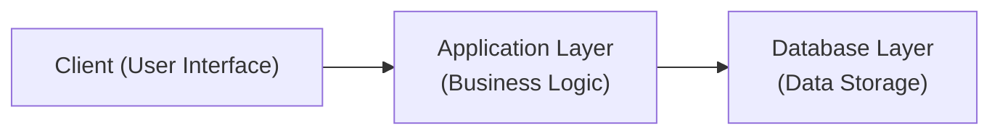

## 2.1 Key Information Technology Definitions

Information technology (IT) has grown into an expansive discipline encompassing hardware, software, networks, data management, security, and a broad spectrum of advanced tools. As CPAs prepare to conduct effective IT audits, advisory services, or simply navigate modern financial reporting environments, it becomes vital to internalize core IT and IS (Information Systems) concepts. This section provides a foundational glossary-like guide to essential terms and definitions that readers can reference throughout this book. The terms defined here cross-reference deeper chapters in this guide—helping you align fundamental definitions with advanced discussions on governance, frameworks, enterprise resource planning, data management, and security.

This glossary is designed to assist you in recognizing the language of information technology, bridging any knowledge gaps that could impede your engagement with internal controls, data risk assessments, or system assurance. Each concept is presented with direct examples or real-world applications, linking them to the broader domain of accounting, auditing, and financial reporting.

  
Information Technology vs. Information Systems  
--------------------------------------------
Information Technology (IT) typically refers to the set of tools, processes, and infrastructure—both hardware and software—that support the creation, storage, exchange, and usage of data or information. This can include servers, user devices, operating systems, and a variety of application software. IT is often viewed as the enabler or backbone of modern businesses. 

Information Systems (IS), on the other hand, encompass more than just technology. An IS includes the people, processes, and data that support business operations, as well as the technology components. In financial and accounting contexts, the IS perspective is crucial because it factors in how employees use technology, how data flows through systems, and how decisions are made based on that information. While IT offers the infrastructure and toolset, IS describes how these components interact to meet organizational objectives.

Why It Matters for CPAs: CPAs evaluating internal controls must adopt an IS lens to understand not just the technology but how it integrates with human workflows, business processes, and reporting objectives. As you proceed through chapters like Chapter 7 (“Business Processes in Information Systems”) and Chapter 8 (“IT General Controls”), keep in mind the interplay between technical infrastructure and organizational processes.

  
Hardware  
---------
Hardware refers to the physical components of a computer system or network. These may include servers, desktops, laptops, tablets, smartphones, routers, switches, and storage devices (e.g., hard drives, solid-state drives, network-attached storage arrays). From an auditing or assurance perspective, hardware plays a critical role in ensuring the reliability and security of financial data. 

• Servers: High-performance machines tasked with storing data, running applications, and managing network resources.  
• Workstations/Endpoints: Computers (desktop or laptop) used by employees for daily tasks.  
• Networking Devices: Routers direct data packets between networks, while switches manage traffic within a local area network (LAN).  
• Storage Devices: SAN (Storage Area Network) or NAS (Network Attached Storage) solutions host large volumes of data for quick retrieval and backup.  

Real-World Example: A company’s payroll data may reside on an on-premises server. Ensuring that server’s hardware configurations are correctly deployed, sufficiently protected against unauthorized access, and regularly maintained is a key IS control. 

  
Software  
---------
Software includes the sets of instructions (programs) that tell hardware devices what to do. It is broadly categorized into system software—such as operating systems—and application software—like accounting programs, database management tools, and ERP modules.

• Operating Systems (OS): Core software that manages hardware resources and provides services for application programs. Popular enterprise OS options include Windows Server, Linux distributions (e.g., Red Hat, Ubuntu), and UNIX variants.  
• Application Software: Tools designed to perform specific tasks, relevant to organizational needs. Examples include QuickBooks, Oracle Financials, or custom web applications.  
• Utility Software: Programs that perform maintenance or technical tasks, such as antivirus tools or disk management utilities.

Why It Matters for CPAs: Reviewing financial or operational data often requires analyzing general IT controls around software. For example, verifying that only updates from approved sources are installed (see Chapter 10 on “IT Change Management”) can mitigate the risk of introducing vulnerabilities that compromise financial statements or auditing processes.

  
Networks  
---------
Networks connect individual devices, enabling the transfer of data. Two main types of networks dominate organizational infrastructure:

• Local Area Network (LAN): Covers limited geographical areas, such as within a building or campus.  
• Wide Area Network (WAN): Connects multiple LANs across broader regions, possibly spanning cities or continents (the internet is the largest WAN).  

Nowadays, the network perimeter extends beyond physical offices:
• Virtual Private Network (VPN): Provides secure, encrypted tunnels for remote access over public networks.  
• Intranet: An internal-facing network accessible only by authorized employees.  
• Extranet: A controlled external connection allowing partners or vendors partial network access.  

Businesses may use additional devices (firewalls, intrusion detection systems, proxies) to filter, monitor, and secure network traffic. For CPAs, properly segregated networks demonstrate a strong preventive control measure, reducing the likelihood of data breaches that could distort financial information or compromise confidential data.

  
Data  
-----
Data represents the raw tokens of information stored, processed, and transmitted within IT systems. Data can be structured (easily organized in rows and columns like a relational database), semi-structured (email messages with some predictable fields but also free-form text), or unstructured (images, text files, audio, and video).

• Master Data: Foundational data that rarely changes, such as a chart of accounts or customer information.  
• Transaction Data: Information resulting from business events, such as sales orders or payments.  
• Metadata: Data about data, describing attributes like creation date or file format.  

In an accounting context, data integrity, completeness, and accuracy are paramount for reliable financial reporting. Controls ensuring correct data input, processing, and storage form an integral part of IT audits.

  
Databases and Database Management Systems (DBMS)  
------------------------------------------------
A database is an organized repository of data, stored and accessed electronically. A Database Management System (DBMS) is the software that manages, manipulates, and secures that data (e.g., Oracle, Microsoft SQL Server, MySQL, or PostgreSQL). 

A DBMS typically:
• Sets data structures (tables, relations).  
• Enforces data integrity constraints (e.g., preventing invalid entries).  
• Allocates or restricts user access based on roles and permissions.  

Proper database management is discussed extensively in Chapter 12 (“Database Structures and Administration”). For CPAs, key considerations include user-access controls (ensuring only appropriate personnel can modify data), audit trails (logging changes to sensitive tables), and backups to maintain business continuity.

  
Client-Server and Three-Tier Architectures  
------------------------------------------
Information systems often follow a client-server model. A client (e.g., user’s computer or smartphone) requests services from a server, which responds with the necessary data or computations. As systems scale, more separation is introduced—such as presentation (front-end), business logic (application layer), and data (back-end). This structure is often called a “three-tier architecture.”

Below is a simplified Mermaid diagram illustrating a typical three-tier architecture:

• Front-End (Presentation Layer): The user interface (web browser, mobile app)  
• Middle (Application Layer): Business logic, validation, and transaction processing  
• Back-End (Database Layer): Data storage, queries, updates, and backups  

When auditing financial systems (e.g., an ERP), understanding how data flows across these layers helps identify where controls need to be in place—such as validation checks in the middle tier or authorization checks at the data layer.

  
Cloud Computing  
---------------
Cloud computing leverages remote servers—typically hosted by third parties—for on-demand access to computing resources such as storage, processing power, and software. Key service models include:

• Infrastructure as a Service (IaaS): Provides virtualized computing resources over the internet (e.g., Amazon EC2, Microsoft Azure virtual machines).  
• Platform as a Service (PaaS): Offers a development platform with infrastructure and tools (e.g., AWS Elastic Beanstalk, Google App Engine).  
• Software as a Service (SaaS): Delivers fully functional applications over the internet (e.g., Salesforce, Microsoft 365).  

Cloud deployment models can be public, private, or hybrid. Public clouds are managed by external providers, while private clouds run on a company’s proprietary infrastructure. Hybrid clouds blend both approaches, allowing flexible scaling. Chapter 5 (“IT Infrastructure Fundamentals”) dives deeper into cloud computing.  
 
For CPAs, cloud computing raises important considerations around vendor risk management, data privacy, and service-level agreements (SLAs). Understanding how data is stored or transferred can highlight potential compliance issues with regulations like GDPR or HIPAA, particularly if data crosses international boundaries.

  
Virtualization  
--------------
Virtualization is the process of creating a virtual (rather than physical) version of an IT environment. For instance, a single physical server might run multiple virtual machines, each with its own operating system and applications. This approach maximizes hardware utilization, reduces costs, and makes system provisioning more agile.

Types of Virtualization:  
• Server Virtualization: Partitioning one physical server into multiple virtual instances (VMs).  
• Desktop Virtualization: Allowing full desktop environments to run on a centralized server.  
• Network Virtualization: Abstracting network resources, combining them into a single, software-based administrative entity.  

CPAs should be aware that virtualization can impact IT GC (General Control) domains such as access controls or change management. For instance, a compromised hypervisor (the virtualization management software) poses a significant threat to all virtual machines hosted on that hardware.

  
Big Data  
--------
“Big Data” refers to large volumes of data—structured, semi-structured, or unstructured—whose scale, variety, and velocity exceed traditional databases’ capacity. Examples include social media interactions, sensor data from Internet of Things (IoT) devices, and real-time transactional data from high-frequency trading systems. Managing big data often requires specialized tools like Hadoop or NoSQL databases. 

From a CPA’s standpoint, big data analytics can reveal business insights (e.g., predicting customer behavior) but also amplifies data governance challenges. Chapter 13 (“Data Warehousing and Big Data Environments”) explores these issues, emphasizing how CPAs should evaluate data quality and security in large-scale environments.

  
Internet of Things (IoT)  
------------------------
IoT bridges the physical and digital worlds through interconnected devices that gather and exchange data. These can be wearables (e.g., smartwatches), sensors in manufacturing plants, or smart home devices. CPAs should be aware that IoT devices introduce new control risks, such as unpatched firmware or insecure network configurations, potentially giving attackers entry points into corporate networks.

Real-World Scenario: A manufacturing firm might deploy IoT sensors to track inventory on a production line. Although highly efficient, a misconfigured sensor or a default admin password can expose sensitive operational or financial data, complicating the organization’s risk profile.

  
Enterprise Resource Planning (ERP) Systems  
------------------------------------------
Enterprise Resource Planning (ERP) systems integrate core business processes into a unified platform—finance, procurement, supply chain, human resources, and more. Examples include SAP, Oracle ERP Cloud, Microsoft Dynamics, and NetSuite. ERPs enrich data consistency and visibility across departments, but also demand rigorous controls to prevent data errors from propagating throughout the enterprise.

In Chapter 6 (“Enterprise Resource Planning (ERP) and Accounting Information Systems”), we explore how CPAs often focus on evaluating transaction cycles (payroll, revenue, etc.) within an ERP to ensure accurate financial reporting. Comprehensive configuration management, user-access rights, and automated controls for approvals are critical to maintaining reliable financial statements.

  
Robotic Process Automation (RPA)  
--------------------------------
RPA uses software “bots” to automate repetitive tasks traditionally handled by people—like data entry or invoice processing. These bots interact with applications similarly to a human user (e.g., clicking on buttons, populating fields). RPA can significantly reduce labor costs and error rates, but it also adds new control considerations:

• Bot Identity and Security: Ensuring bots operate under defined roles and permissions.  
• Audit Trails: Tracking bot activity to verify compliance with financial policies.  
• Change Management: Updating RPA scripts alongside system configurations to maintain processes’ accuracy.  

From an audit perspective, RPA usage may alter the nature of internal controls. Instead of verifying a person’s manual steps, CPAs and internal auditors might need to assess the reliability of automated workflows and their alignment with management’s policies.

  
Application Development and DevOps  
----------------------------------
Software Development Life Cycle (SDLC) refers to the structured framework (e.g., Waterfall, Agile) for designing, creating, testing, and deploying software. DevOps extends this by merging development (Dev) and operations (Ops) teams, fostering continuous integration (CI) and continuous deployment (CD) practices. Code changes are more frequent and iterative, requiring robust automated testing and version control systems (like Git).

For financial systems, DevOps can expedite feature delivery while maintaining code integrity—but also demands well-documented procedures that CPAs can review for compliance and risk. Chapter 10 (“IT Change Management”) explains how to evaluate processes that quickly roll out patches or new features to critical financial applications.

  
APIs and Microservices  
----------------------
• Application Programming Interface (API): A set of protocols and definitions allowing software systems to communicate. When a front-end mobile app pulls data from a payroll system, it often uses an API to request that data securely and in a standardized format.  
• Microservices: An architectural approach that breaks large applications into smaller, independently deployable services, each handling a specific function (e.g., payment processing, user authentication).  

For CPAs, APIs and microservices can simplify the audit trail by isolating processes into modules. However, multiple services communicate over networks, requiring strong authentication and transport-layer security to ensure accurate data exchange and preserve system integrity.

  
Security, Cybersecurity, and Encryption  
---------------------------------------
Security in IT involves protecting data, systems, networks, and processes from malicious activity, unauthorized access, or other forms of harm. Cybersecurity is a subset focusing on defending internet-connected systems.

Key elements:
• Authentication and Authorization: Verifying user identity, then granting appropriate privileges.  
• Encryption: Transforming data into unreadable “ciphertext” so only authorized parties can access it.  
• Firewalls: Filtering traffic in and out of a network boundary.  
• Intrusion Detection and Prevention: Monitoring network or system activity for vulnerabilities or attacks.  
• Incident Response: Having a plan to detect, contain, and remediate security breaches.

Chapter 16 (“Foundations of Cybersecurity”) and subsequent security chapters detail these concepts, discussing best practices for risk mitigation. CPAs are increasingly called upon to consider cybersecurity in financial audits, ensuring that threats do not compromise reliability and compliance.

  
Blockchain  
----------
Blockchain is a decentralized, distributed ledger technology that records transactions across many participating nodes in a peer-to-peer network. Each “block” contains a batch of transactions, linked cryptographically to the previous block. This structure makes data tampering extremely difficult.

Applications for CPAs: 
• Cryptocurrency: Some organizations hold cryptocurrency as an asset or accept it as payment.  
• Smart Contracts: Automated execution of contractual terms, reducing overhead in financial processes.  
• Supply Chain Audits: Tracking raw materials or products from origin to consumer can be more transparent using blockchain-based solutions.

However, blockchain also presents unique auditing and regulatory concerns given its nascent state and the complexity of technology. Chapter 6.4 (“Blockchain Integration and Considerations for Financial Reporting”) examines these aspects in-depth.

  
Mobile Computing and BYOD  
-------------------------
Mobile computing refers to using portable devices—smartphones, tablets—for tasks traditionally performed on desktops. Many organizations embrace BYOD (Bring Your Own Device) policies, enabling employees to use personal devices for work. While this approach reduces hardware costs and increases flexibility, it also introduces:

• Security Risks: Personal devices might not be as secure or updated, exposing enterprise resources to vulnerabilities.  
• Data Privacy Concerns: Mixing personal and corporate data on a single device complicates risk management.  
• Device Management Solutions: Mobile Device Management (MDM) and Enterprise Mobility Management (EMM) systems to enforce security policies (password requirements, remote wipe).

For CPAs, ensuring financial data accessed via mobile channels remains within compliance requires strong authentication and data handling guidelines. MDM logs may also become audit evidence to validate controls.

  
Common Pitfalls and Best Practices  
----------------------------------
• Weak Access Controls: Failing to implement the principle of least privilege can leave critical financial data accessible to unauthorized users.  
• Insufficient Documentation: Overly complex or poorly documented IT environments hamper both internal and external audits, making it challenging to trace data flows.  
• Inadequate Backup and Recovery: Businesses that lack robust disaster recovery plans risk data loss. For instance, a company that only keeps local backups on a single server may find itself unable to recover after hardware failures.  
• Poor Patch Management: Neglecting to timely update operating systems or software can introduce exploitable vulnerabilities.  
• Over-Reliance on Third Parties: Cloud providers, outsourced developers, or SaaS vendors may create single points of failure if not managed under well-defined contracts and monitoring.

  
Practical Examples and Case Studies  
-----------------------------------
• Financial Services Firm: A small brokerage relies on real-time data feeds to manage trades. Understanding “low latency networks” becomes crucial, along with specialized software to handle large transaction volumes. Their database includes “hot” data (actively used) and “cold” data (older but relevant for audits).  
• Non-Profit Organization: When pivoting to remote operations, staff members use personal devices for tracking donations. An MDM solution must be implemented to enforce encryption and limit unauthorized data export.  
• Manufacturing Company: Deploys IoT sensors across assembly lines for continuous productivity measurements. Auditors concentrate on network segmentation to prevent lateral attacks from a single compromised sensor and ensure reliable inventory records.  

These scenarios exemplify the synergy between technology and financial processes, and how closely CPAs must examine system design, security posture, and data oversight.

  
References for Further Exploration  
----------------------------------
• ISACA (Information Systems Audit and Control Association): Offers publications and frameworks bridging audit and IT.  
• AICPA Trust Services Criteria: Addresses integrated frameworks for security, availability, confidentiality, processing integrity, and privacy.  
• NIST CSF (National Institute of Standards and Technology Cybersecurity Framework)  
• IIA (Institute of Internal Auditors): Provides insights into technology risks affecting assurance engagements.  
• ITIL (Information Technology Infrastructure Library): Best practice framework for IT service management.

As you proceed to the following chapters, keep this glossary handy to decode the technical parlance. The better your command of these terms, the more effectively you can evaluate IT-based internal controls, assess risk in data-driven engagements, and guide intelligent, technology-focused business decisions.

  
## Test Your Knowledge: Key IT & IS Definitions



### Which of the following best describes the difference between Information Technology (IT) and Information Systems (IS)?

- [ ] IT focuses on the structured processes and people involved, while IS deals strictly with hardware and software.
- [x] IT comprises the technical infrastructure and tools, while IS includes people, processes, and technology working together.
- [ ] IT and IS are synonymous; the terms can be used interchangeably in all contexts.
- [ ] IS is primarily about hardware and physical devices, while IT is about data flows.

> **Explanation:** IT centers on hardware, software, and technical components. IS integrates these elements with human processes and organizational workflows.

### What is a primary benefit of strong network segmentation within an organization?

- [x] It limits the potential damage if one network segment is compromised.
- [ ] It makes user authentication unnecessary in some segments.
- [ ] It drives up overall bandwidth costs significantly.
- [ ] It replaces the need for malware scanning.

> **Explanation:** By segmenting the network, an attacker breaching one segment is less able to move laterally across the entire environment, enhancing overall security.

### Which statement about cloud computing is correct?

- [x] IaaS, PaaS, and SaaS are popular cloud service models.
- [ ] Only public cloud models are legally acceptable for financial data.
- [ ] Hybrid clouds are never used by enterprises.
- [ ] Cloud computing must be 100% on-premises hardware with no external providers.

> **Explanation:** Cloud computing has multiple service models (IaaS, PaaS, SaaS) and various deployment models (public, private, hybrid). Each has distinct advantages.

### Why is understanding big data important for CPAs?

- [x] It introduces new governance challenges and offers analytic opportunities affecting financial reporting.
- [ ] Only marketing teams benefit from big data.
- [ ] Big data has no relevance for transaction-based financial audits.
- [ ] CPAs will never work with unstructured data.

> **Explanation:** Big data can improve insight into sales, inventory, or customer behavior, but it also complicates data governance and requires careful auditing.

### Which of the following best describes RPA (Robotic Process Automation)?

- [x] Software bots automating repetitive tasks, often interacting with applications like a human user.
- [ ] Robots in manufacturing lines assembling physical products.
- [x] A means to reduce manual data entry errors and time-consuming tasks.
- [ ] A technology that replaces an entire ERP system.

> **Explanation:** RPA automates tasks at the user-interface level, often significantly reducing errors, costs, and manual labor, yet it does not replace entire systems or physical manufacturing robots.

### In a three-tier architecture, which layer typically performs business logic?

- [x] The application layer.
- [ ] The client or presentation layer.
- [ ] The database layer.
- [ ] The network layer.

> **Explanation:** The application layer handles the logic and rules that govern how data is processed, validated, and transferred between user interfaces and data storage.

### Which of the following best defines virtualization?

- [x] Creating virtual machines or resources that are abstracted from physical hardware.
- [ ] Moving all corporate operations to an offshore data center.
- [x] The practice of running multiple operating systems on one server simultaneously.
- [ ] Only storing data in raw text files on the local hard drive.

> **Explanation:** Virtualization involves abstracting computing resources from physical hardware, allowing multiple virtual machines and environments on one physical server.

### Why should CPAs pay particular attention to user-access controls in a database?

- [x] Inadequate controls may allow unauthorized changes to financial data, compromising reporting integrity.
- [ ] User-access controls have no bearing on data backups.
- [ ] Databases automatically filter out malicious query attempts without configuration.
- [ ] Database user-access controls are only needed in large corporations.

> **Explanation:** Weak or unregulated user-access permissions can lead to critical modifications or deletions of financial records by unauthorized individuals.

### Which statement is true about an API in the context of enterprise software?

- [x] It defines how different software systems can communicate and exchange data.
- [ ] It physically connects servers in a local network.
- [ ] It must only be used in on-premises solutions.
- [ ] It is a database technology for storing unstructured data.

> **Explanation:** An API outlines the rules and protocols for software interactions, enabling modular communication between components.

### With respect to security, an encryption process is considered effective primarily when:

- [x] The keys governing encryption and decryption are well-managed and protected.
- [ ] Hackers have easy access to those keys for testing.
- [ ] Decryption is possible without the correct key or credentials.
- [ ] The encryption software is free and does not require updates.

> **Explanation:** Encryption depends on the secrecy and robustness of the keys. Poor key management undermines all other security efforts.



---

## For Additional Practice and Deeper Preparation

### [Information Systems and Controls (ISC)](https://www.udemy.com/course/isc-cpa-mock-exams/?referralCode=E1217303222935C5E464)

**Information Systems and Controls (ISC) CPA Mocks:** 6 Full (1,500 Qs), Harder Than Real! In-Depth & Clear. Crush With Confidence!

- Tackle full-length mock exams designed to mirror real ISC questions.  
- Refine your exam-day strategies with detailed, step-by-step solutions for every scenario.  
- Explore in-depth rationales that reinforce higher-level concepts, giving you an edge on test day.  
- Boost confidence and minimize anxiety by mastering every corner of the ISC blueprint.  
- Perfect for those seeking exceptionally hard mocks and real-world readiness.  

_Disclaimer: This course is not endorsed by or affiliated with the AICPA, NASBA, or any official CPA Examination authority. All content is for educational and preparatory purposes only._
