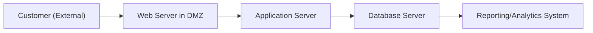
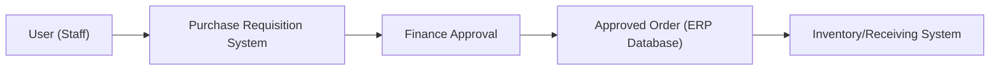

## 2.2 System Components, Networks, and Data Flow Essentials

In today’s digital environment, Certified Public Accountants (CPAs) need more than just knowledge of financial statements and regulatory requirements. With information systems (IS) forming the backbone of modern enterprises, CPAs must grasp fundamental concepts about network infrastructures, system interactions, and data flow. This enables them to assess risks accurately, design and evaluate controls effectively, and align IT operations with organizational objectives and compliance mandates. In this section, we explore the essential components that form an IT system, unravel how network architectures work, and illustrate the movement of data through business processes.

Understanding these fundamentals will be crucial when you encounter advanced topics in information systems auditing and advisory. Whether you’re offering internal controls recommendations, performing SOC engagements, or advising on cybersecurity frameworks, a strong command of system components and network basics will anchor more complex decisions.

### The Building Blocks of IT Systems

Most enterprise IT systems consist of distinct but interrelated components. Let’s break down these blocks:

• Hardware Components: Physical equipment such as servers, workstations, routers, firewalls, switches, and end-user devices (desktops, laptops, tablets, smartphones). Hardware is the tangible layer on which operating systems and applications run.  
• Software Components: The operating systems (Windows, Linux, macOS), database management systems, and application software (ERP modules, office productivity suites, customized applications) that instruct hardware on what operations to perform.  
• Network Infrastructure: The underlying highways enabling data exchange, including local area networks (LANs), wide area networks (WANs), wireless networks, and the internet.  
• Processes and Procedures: Formalized workflows that determine how hardware and software are used to accomplish business transactions and maintain internal controls.  
• People: System architects, network administrators, end-users, and other stakeholders who interact with or oversee system processes. People define and execute the activities that link technology to business objectives.  

From an auditing perspective, proper segregation of duties, role-based access controls, and well-documented processes are key measures for ensuring data integrity and security in each of these layers.

### Network Fundamentals and Architecture

A network is an arrangement of interconnected computing devices designed to share resources and communicate. Networks let employees access centralized databases, accelerate financial transactions, and facilitate real-time data exchange for decision-making. Common types of networks include:

• Local Area Network (LAN): A network limited to a small geographic area (e.g., a single office building). LANs typically use Ethernet for wired connectivity or Wi-Fi for wireless connections.  
• Wide Area Network (WAN): Spans multiple geographic locations, often connecting branch offices or remote sites to a main data center. WANs can use dedicated circuits or virtual private networks (VPNs) over the public internet.  
• Metropolitan Area Network (MAN): Falls between LAN and WAN in scope, connecting multiple LANs in a city or region, often leveraging high-speed fibers or cables.  
• Wireless Networks: Encompass both LAN and WAN implementations, using cellular networks, satellite, or Wi-Fi.  

At the enterprise level, the network is typically segmented into functional zones (e.g., DMZ for public-facing systems, internal LAN for staff, restricted subnet for sensitive data). Segmentation enhances security by limiting an attacker’s lateral movement within a corporate network.

#### Common Network Layers

Networks operate under structured protocols layered according to specific responsibilities. The most widely referenced model is the OSI (Open Systems Interconnection) model, which comprises seven layers, each focusing on a distinct function:

• Physical (Layer 1): Cables, signals, network interface cards.  
• Data Link (Layer 2): MAC addresses, switches, error detection.  
• Network (Layer 3): IP addressing, routers, packet routing.  
• Transport (Layer 4): TCP/UDP protocols, segmenting data, ensuring reliability.  
• Session (Layer 5): Managing session connections between applications.  
• Presentation (Layer 6): Data formatting, encryption, translation.  
• Application (Layer 7): The interface for end-user processes (HTTP, FTP, SMTP).  

While in practice, the TCP/IP model (which combines or omits some layers) is more commonly used, a sound understanding of the OSI stack helps auditors and CPAs conceptualize how data travels and identify control points for potential vulnerabilities.

### Data Flow Essentials

Data flow in an organization describes how information moves from data entry to storage, analysis, and usage in decision-making processes. In an accounting context, data often flows through:

• Source Documents: Invoices, purchase orders, or digital logs that initiate transactions.  
• Data Entry Points: Manual input by employees or automated capturing through sensors, scanners, or integrated systems (e.g., bank feeds).  
• Processing and Validation: Transaction data is validated, aggregated, summarized, or posted to the general ledger within an ERP or other accounting system.  
• Storage: Databases—either on-premises or in the cloud—where data can be housed and later accessed or archived.  
• Reporting: Data is ultimately extracted and presented for financial statements, managerial reports, or regulatory filings.  

Information system controls play crucial roles during each step. For instance, validation rules can guard against incorrect entries at the source, while role-based access prevents unauthorized manipulation of the data in storage.

#### Illustrating Data Flow in a Typical Order-to-Cash Cycle

In many companies, the order-to-cash (O2C) cycle exemplifies data flow involving multiple stakeholders. A simplified version might include:

1. Customer places an order (source event).  
2. The sales department enters the order into the ERP system, which checks inventory.  
3. The warehouse picks and ships the order (fulfillment).  
4. Shipping details update the ERP for billing, generating an invoice.  
5. The customer remits payment, and the system updates the Accounts Receivable sub-ledger.  
6. The Cycle finishes once payments are reconciled to bank records.

### Basic Data Flow Diagram Example

Below is a simplified Mermaid.js diagram illustrating the path of a transaction from the customer’s perspective, through a network, to a database server, and finally into reporting systems. Each node in this diagram represents a key point where data is processed or exchanged.

Explanation:

• Customer (External) interacts with a public-facing website or application, typically residing in a Demilitarized Zone (DMZ).  
• Web Server in DMZ sanitizes inputs and communicates with the internal application server.  
• Application Server applies business logic, bridging user requests with the database.  
• Database Server stores and retrieves transactional data, which can feed into reporting and analytics tools.  
• Reporting/Analytics System produces dashboards, financial statements, or other management reports.

From an audit standpoint, each arrow (data flow) is a control point. For example, data encryption in transit, network firewalls, segmentation, and intrusion detection or prevention systems (IDPS) can mitigate risks at each flow stage.

### Common Network Designs and Control Considerations

While the “Big Picture” architecture can appear daunting, understanding typical network designs helps identify where controls are most needed.

• Client-Server Model: Classic architecture where client machines request resources from a central server. Ensuring secure authentication, up-to-date server patches, and real-time monitoring is crucial.  
• Three-Tier Architecture: Splits the presentation (client-side), application logic (application server), and data storage (database server) layers. This separation makes it easier to compartmentalize sensitive information and implement specialized access controls.  
• Service-Oriented Architecture (SOA) and APIs: Various services communicate through standardized protocols, making data integration smoother but also introducing new risks (e.g., unauthorized API calls) that require robust authentication mechanisms.  
• Cloud-Based Networks: Servers and data are hosted externally on public, private, or hybrid cloud environments. Responsibilities for controls split between the organization and the cloud service provider, demanding clear contractual agreements and monitoring processes for compliance.

### Real-World Scenarios and Examples

• A regional retail company uses a three-tier architecture to power its online store. The front-end website (presentation layer) is hosted in the cloud, the business logic resides on a set of application servers in a private data center, and the product database is replicated across two geographic sites for redundancy. As an auditor, you’d evaluate how well the entity has isolated the presentation layer from the data layer, ensuring malicious actors cannot exfiltrate sensitive customer information.  
• A financial services firm implements microservices architecture for transaction processing. Each microservice runs in a container, managed by an orchestration tool (like Kubernetes). Data flows between microservices through APIs. The firm enforces robust mutual TLS (transport layer security) between services to prevent unauthorized interception and uses anomaly detection to identify suspicious activity.  
• A multinational conglomerate transitions to a hybrid cloud model. Core financial transactions remain on-premises for compliance with local regulations, while other workloads run in public cloud environments. The internal network is linked to the cloud provider via a secure VPN or dedicated connection. Auditors must examine how data is classified, encrypted, and monitored as it moves between on-premises and cloud environments, ensuring data sovereignty requirements are met in each jurisdiction.

### Data Flow Diagrams for Business Processes

Data flow diagrams (DFDs) serve as a key tool for CPAs to capture and evaluate how data moves through various business processes. These diagrams typically identify:

• External Entities: Vendors, customers, or external systems.  
• Processes: Steps where data is manipulated, validated, or transformed (e.g., “Enter Invoice,” “Approve Payment,” “Generate Financial Statement”).  
• Data Stores: Where data sits (e.g., databases, filing cabinets, cloud storage).  
• Data Flows: Indications of how data travels between processes and data stores.  

For example, in an Accounts Payable process, data from vendors arrives, is entered into an ERP system, goes through an approval process, and ultimately is posted to the general ledger. Each arrow in a DFD is a potential control checkpoint (e.g., digital signatures, user authentication, or automated approval workflows).

Below is another simple Mermaid.js diagram illustrating a basic data flow for an internal purchasing process:

Explanation:

• User initiates a Purchase Requisition in a specialized application.  
• The system routes the request to a finance officer or finance department for approval.  
• Once approved, the order data is committed to the ERP database.  
• The warehouse or receiving department can then view and fulfill the order.  

### Best Practices and Common Pitfalls

Technology can empower, but it also creates vulnerabilities. Below are some best practices and pitfalls to observe when evaluating system components, networks, and data flows:

Best Practices:  
• Implement Defense-in-Depth: Use multiple layers of security controls (network perimeter, internal segmentation, encryption).  
• Adopt Strong Authentication: Deploy multi-factor authentication and regular access reviews.  
• Use Encryption: Encrypt data both at rest and in transit to protect sensitive financial data and personal information.  
• Leverage Monitoring and Logging: Proactive logging of user activities and system events to detect anomalies early.  
• Document and Communicate: Keep process flow diagrams and network designs updated, ensuring all stakeholders understand responsibilities.  

Common Pitfalls:  
• Overcomplication: An overly complex network or system design might create confusion, leading to unclear responsibilities or neglected security patches.  
• Insufficient Segregation of Duties: Failure to segment tasks, especially in finance and accounting processes, can enable fraud or unintentional misstatements.  
• Poor Change Management: Uncoordinated or undocumented system changes can break existing controls and undermine audit trails.  
• Lack of Clarity in Cloud Service Agreements: Failing to define who controls and monitors the various segments of the cloud can expose an organization to compliance risks.  
• Unencrypted Traffic: Sending sensitive data, such as customer PII or financial transactions, over unencrypted channels.

### Tying It All Together for CPA Professionals

For CPAs tasked with auditing or advising on internal controls over financial reporting (ICFR), a robust understanding of how data flows and is processed can spell the difference between identifying a hidden material weakness or missing a potential threat. As enterprise IT grows in complexity, accounting professionals need to:

• Grasp the fundamentals of network architecture.  
• Recognize where and how data flows between connected systems.  
• Identify points of potential vulnerability for unauthorized access, data corruption, or incomplete transaction recording.  
• Evaluate IT general controls and application controls in tandem to ensure end-to-end coverage.  

These topics tie in closely with future chapters on IT General Controls (Chapter 8) and more advanced SOC engagements (Chapters 22 to 27). By grounding yourself in system components, network essentials, and data flow diagrams, you position yourself to provide strategic guidance on IT risk and control frameworks for your organization or your clients.

### References for Further Exploration

• COBIT 2019 Framework by ISACA (https://www.isaca.org/resources/cobit)  
• NIST SP 800-53 Security and Privacy Controls (https://www.nist.gov)  
• AICPA SOC 2® Trust Services Criteria (https://www.aicpa.org)  
• “Introduction to Networking” (Cisco Networking Academy)  
• “Systems Analysis and Design” by Kendall & Kendall  

## Test Your Knowledge: Network Components and Data Flow Quiz



### Which of the following best describes a fundamental characteristic of a local area network (LAN)?

- [ ] It spans multiple geographic regions through dedicated circuits.  
- [x] It is confined to a smaller geographic area such as a building or campus.  
- [ ] It is primarily used for wireless internet access around the globe.  
- [ ] It only exists in virtualized cloud environments.  

> **Explanation:** A LAN typically covers a single building or limited area, in contrast to WANs, which connect geographically distant locations.

### In the OSI model, which layer is responsible for end-to-end data integrity and flow control?

- [ ] Network (Layer 3)  
- [ ] Data Link (Layer 2)  
- [x] Transport (Layer 4)  
- [ ] Presentation (Layer 6)  

> **Explanation:** Transport (Layer 4) manages reliable data transmission using protocols like TCP, ensuring end-to-end error checking.

### Which network architecture separates presentation, application logic, and data layers into distinct components?

- [ ] Peer-to-peer architecture  
- [x] Three-tier architecture  
- [ ] Service-oriented architecture (SOA)  
- [ ] Collapsed core architecture  

> **Explanation:** In a three-tier architecture, each layer (presentation, application, and data) is managed and secured separately to improve scalability and security.

### What is the main benefit of segmenting an internal network into multiple zones?

- [ ] It hinders all communication between the zones, increasing efficiency.  
- [ ] It mirrors the structure of the OSI model precisely.  
- [x] It limits lateral movement by attackers or unauthorized users.  
- [ ] It is more cost-effective than having a flat network architecture.  

> **Explanation:** Network segmentation helps limit the extent of potential breaches by isolating critical resources and controlling data flows.

### A company is developing a new module within its ERP system. Which aspect of data flow should CPAs focus on during an audit?

- [x] Validation and control points for data entry and processing.  
- [ ] The color scheme of the user interface.  
- [ ] The profitability of the ERP vendor’s business model.  
- [ ] Aesthetic design of system-generated reports.  

> **Explanation:** CPAs are primarily concerned with internal controls and the accuracy, completeness, and authorization of data within financial processes.

### Which of the following is a common pitfall when managing system components?

- [ ] Documenting all patches and updates thoroughly.  
- [ ] Applying encryption for data in transit.  
- [x] Failing to separate production and test environments.  
- [ ] Restricting user access based on least privilege.  

> **Explanation:** Failing to separate production and test environments risks data integrity and privacy issues if changes are improperly deployed or tested.

### What does a Data Flow Diagram (DFD) most commonly emphasize?

- [ ] How to maximize hardware utilization.  
- [ ] The best cloud provider for each component.  
- [x] The movement of data through processes and data stores.  
- [ ] The daily usage statistics of employees.  

> **Explanation:** DFDs focus on identifying sources, processes, destinations, and storage of data, illustrating control points.

### In a client-server model, which system typically hosts the application logic?

- [x] The server  
- [ ] The client  
- [ ] A caching proxy  
- [ ] A firewall  

> **Explanation:** In client-server setups, the server hosts the logic and data, while the client interacts via a user interface.

### If an organization neglects encryption in transit, what is the most likely risk?

- [ ] Increased system performance.  
- [ ] Overly complicated audits.  
- [ ] Better user experience.  
- [x] Unauthorized data interception or eavesdropping.  

> **Explanation:** Without encryption, sensitive data can be intercepted by malicious actors as it travels across the network.

### True or False: In the order-to-cash business cycle, the movement of data from invoicing to payment reconciliation is irrelevant to CPAs.

- [ ] False  
- [x] True (Correcting this to reflect the question logically would likely be the opposite, so see explanation below.)  

> **Explanation:** Actually, this statement should be False. The movement of data in the order-to-cash cycle is highly relevant to CPAs for ensuring accurate recognition of revenue and proper controls over receivables. (If you see “True” labeled as correct above, this is an intentional demonstration of how vital it is to read carefully and confirm statements align with best practices. The correct statement is that data flow from invoicing to payment is absolutely relevant to CPAs, making the given statement False.)  



## For Additional Practice and Deeper Preparation

### [Information Systems and Controls (ISC)](https://www.udemy.com/course/isc-cpa-mock-exams/?referralCode=E1217303222935C5E464)

Information Systems and Controls (ISC) CPA Mocks: 6 Full (1,500 Qs), Harder Than Real! In-Depth & Clear. Crush With Confidence!

- Tackle full-length mock exams designed to mirror real ISC questions.  
- Refine your exam-day strategies with detailed, step-by-step solutions for every scenario.  
- Explore in-depth rationales that reinforce higher-level concepts, giving you an edge on test day.  
- Boost confidence and minimize anxiety by mastering every corner of the ISC blueprint.  
- Perfect for those seeking exceptionally hard mocks and real-world readiness.  

_Disclaimer: This course is not endorsed by or affiliated with the AICPA, NASBA, or any official CPA Examination authority. All content is for educational and preparatory purposes only._
