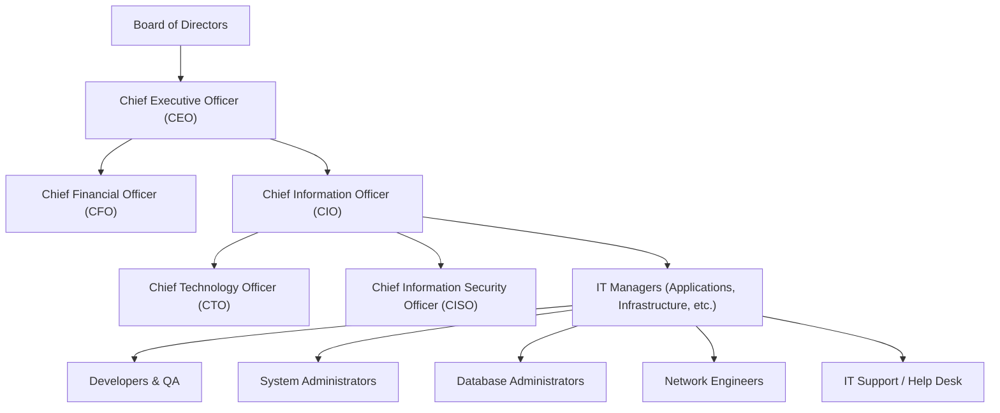

## 2.3 Common IT Roles and Responsibilities in Organizations

In modern organizations, Information Technology (IT) underpins nearly every significant business activity—from automating business processes and analyzing financial data to safeguarding confidential information. Because IT influences key decision-making in finance, audit, and strategic planning, understanding IT roles and responsibilities is vital. The nature of IT organizations can vary depending on a firm’s size, industry, and regulatory environment; however, many foundational elements and best practices remain consistent.

This section examines typical IT and IS roles, outlines their responsibilities, and explains how they interact with finance and audit teams. By understanding these roles, CPAs, auditors, and other accounting professionals can better coordinate with technology stakeholders, address relevant control considerations, and proactively manage IT-related risks.  

Building on the foundational IT and IS terminology introduced in previous sections, this chapter offers insights into the composition of IT departments, illustrating common hierarchical structures and clarifying how these structures facilitate collaboration with finance and audit functions.

  
### The Role of IT in Modern Organizations

Today’s business world requires real-time data analytics, reliable financial reporting, and adherence to myriad regulations, including those addressing data protection and information security (see Chapter 3 for more on regulatory frameworks like GDPR and PCI DSS). Organizations depend on technology to meet these standards efficiently. IT teams serve a dual purpose: 

• They develop, maintain, and secure core systems driving business operations.  
• They act as strategic partners in decision-making by governing technology investments and aligning them with overall business objectives.

Finance and accounting professionals rely on IT to ensure that financial data sources are accurate, reliable, and accessible. Auditors, likewise, work closely with IT to acquire the evidence needed to conclude on internal controls, especially areas covered by IT General Controls (ITGC) such as access to programs and data, program changes, and IT operations (discussed in Chapter 8).

### Typical IT Organizational Structure

While each enterprise tailors its exact structure to internal needs, organizations often adopt a hierarchical format in which roles and responsibilities are clearly delineated. Below is a simplified representation of a typical IT organization, illustrating both leadership and functional teams.  

In this chart:

• The CIO generally formulates the strategic IT vision and ensures alignment with the company’s overall goals.  
• The CTO focuses on technological innovation and high-level architecture.  
• The CISO oversees security policies and procedures.  
• IT managers specialize in different areas, from software development to infrastructure and networks.  
• Operational teams such as developers, system administrators, and help desk staff carry out day-to-day tasks.

Each of these roles interacts with finance and audit teams in different capacities. Below, we break down the responsibilities of each role and highlight their touchpoints with financial and audit functions.

### Chief Information Officer (CIO)

The CIO is typically the highest-ranking technology executive, responsible for defining and implementing the organization’s overall IT strategy. Beyond ensuring the stable operation of the IT environment, the CIO stays attuned to emerging technologies that can empower the business to gain a competitive edge.  

Key responsibilities of the CIO:  
• Strategic IT planning aligned with corporate objectives.  
• Overseeing the IT budget, including cost management and return on technology investments.  
• Managing relationships with external technology vendors and service providers.  
• Collaborating with C-suite peers (e.g., CFO, COO) to set cross-functional policies and long-term goals.  
• Providing final authorization for major technology projects, including modernization, migrations, and integrations.

Collaboration with finance and audit functions:  
• Partners with the CFO to develop and monitor the IT budget, evaluating cost-benefit analyses of new projects.  
• Coordinates with internal and external auditors to address IT risk assessments, facilitate SOC reports (see Part V for SOC engagements), and ensure an inclusive risk management approach.  
• Works with the audit committee to ensure IT controls are robust and properly documented.  

### Chief Technology Officer (CTO)

The CTO’s focus often leans toward innovation, product engineering, and technical platforms. Organizations with heavily technical products or services often place the CTO at the forefront of product development.

Key responsibilities of the CTO:
• Exploring emerging technologies—such as AI, blockchain, or IoT—and evaluating their feasibility for the organization.  
• Working closely with R&D, product management, and engineering teams to design and improve software products and services.  
• Ensuring technology solutions are scalable, maintainable, and aligned with best practices.  
• Advising the CIO on technical initiatives that can help improve business processes or introduce new revenue streams.

Collaboration with finance and audit functions:
• Assists in financial planning for technology innovations, providing cost estimates and analyses of software version upgrades, new product features, or advanced infrastructures.  
• In scenario planning for new product rollouts, the CTO works closely with financial analysts to estimate potential returns, weigh capital expenditures, and manage risk exposures.  
• Provides technical insight to auditors when specialized testing of new and emerging technology is required, for example in blockchain-based solutions for financial transactions.  

### Chief Information Security Officer (CISO)

Security is a paramount concern in today’s environment, where cyber incidents can result in reputational damage, financial loss, and legal liabilities (see Chapter 16 on cybersecurity foundations). The CISO ensures organizational data and systems remain protected from myriad threats.

Key responsibilities of the CISO:
• Leading the development and enforcement of cybersecurity policies and standards.  
• Conducting security risk assessments and overseeing vulnerability scanning and penetration testing.  
• Maintaining compliance with relevant regulations such as HIPAA, GDPR, or PCI DSS.  
• Designing incident response plans and coordinating investigations in the event of security breaches.  
• Providing security awareness training and promoting a culture of cyber vigilance.

Collaboration with finance and audit functions:
• Partners with finance teams to secure funding for cybersecurity initiatives, factoring in costs of tools, training, and compliance mandates.  
• Advises internal and external audit teams on the design and operating effectiveness of IT security controls.  
• Works with the CFO’s office to evaluate cyber insurance needs, weigh risk transfer options, and manage potential liabilities arising from data breaches.  
• Coordinates with auditors to meet shown compliance requirements for SOC 2® or SOC for Cybersecurity engagements (discussed in Chapters 24 and 27).  

### IT Managers (Applications, Infrastructure, etc.)

Reporting to senior leadership (often the CIO), IT managers oversee specialized technology domains: systems, applications, databases, networks, etc. Their roles vary depending on organizational needs and technical complexity.

Key responsibilities of IT managers:
• Day-to-day supervision of staff and operations in their domain (e.g., software development, server administration, or network engineering).  
• Budget planning and resource allocation for new projects, including hardware upgrades and software deployments.  
• Setting performance goals and Key Performance Indicators (KPIs) for their teams.  
• Collaborating with other departments to implement cross-functional initiatives.

Collaboration with finance and audit functions:
• Provide cost estimates, project timelines, and status updates to financial managers for budgeting purposes.  
• Supply evidence of control compliance, such as change management documentation or system checks, during IT audits (covered in Chapter 4 and Chapter 8).  
• Work with finance stakeholders on data integrity concerns within specific modules (e.g., procurement or payroll).  
• Participate in internal control testing to validate that security patches, software updates, and backups are managed in compliance with organizational policies and external regulations.  

### Software Developers and Quality Assurance (QA) Specialists

Software developers build and maintain the applications that drive core business processes, including accounting and financial reporting systems. QA specialists rigorously test software updates, ensuring solutions meet functional and security requirements.  

Key responsibilities of developers and QA:
• Creating new applications or customizing off-the-shelf software to meet business needs.  
• Performing code reviews, unit testing, integration testing, and stress testing.  
• Collaborating with QA teams to confirm new releases are stable and meet quality benchmarks.  
• Documenting changes, especially those affecting financial reporting modules or regulated data sets.

Collaboration with finance and audit functions:
• Engaging with finance teams to ensure new software functionalities respect data integrity for general ledger, payroll, or other financial modules.  
• Providing auditors with documentation of development protocols, test results, and bug fixes.  
• Supporting timely resolution of any control or compliance issues discovered during audits.  
• Coordinating with finance to incorporate user feedback, including specialized reporting tools or dashboards for financial metrics.  

### System Administrators and Network Engineers

System administrators (“sysadmins”) ensure servers, operating systems, and associated services run efficiently. Network engineers oversee the design, implementation, and maintenance of network infrastructures (local area networks, wide area networks, VPNs, etc.).

Key responsibilities of system administrators and network engineers:
• Installing and configuring operating systems, patches, and firmware updates.  
• Setting up network topologies and maintaining connectivity across the organization.  
• Monitoring performance metrics and troubleshooting hardware or software issues.  
• Enforcing user access protocols and performing regular backups of critical data (see Chapter 9 for business continuity considerations).

Collaboration with finance and audit functions:
• Provide system and network audit logs to help finance and audit teams detect anomalies in transaction data flows.  
• Manage change requests that may affect financial applications in compliance with formal change control processes (detailed in Chapter 10).  
• Assist with cost analyses related to new hardware or network upgrades that impact capital expenditures.  
• Comply with data retention and archival policies that support financial recordkeeping needs.  

### Database Administrators (DBAs)

DBAs design, implement, and maintain the databases hosting financial, operational, and other critical information. Maintaining the availability, security, and integrity of data is at the core of their role (see Chapter 12 on database structures).

Key responsibilities of DBAs:
• Ensuring timely database backups, configurations, upgrades, and patches.  
• Implementing database security measures, including user privileges and encryption.  
• Monitoring database performance and optimizing queries.  
• Overseeing data recovery procedures, including restoration tests.

Collaboration with finance and audit functions:
• Ensuring financial data in systems like ERP or accounting applications remain pristine and properly secured.  
• Coordinating with finance on data archiving to comply with legal retention requirements and internal control policies.  
• Providing evidence, logs, or other artifacts for auditing, such as user access rights, encryption key management, and changes to table structures.  
• Translating technical processes into understandable terms for auditors and finance professionals.  

### Data Analysts and Data Scientists

Organizations increasingly rely on data analytics and machine learning to forecast financial performance, detect fraud, and optimize operational strategies. Data analysts generate business intelligence reports, while data scientists develop predictive models and advanced analytics solutions.

Key responsibilities of data analysts and data scientists:
• Collecting, cleaning, and structuring data from diverse sources, including ERP systems and external feeds.  
• Developing data visualizations and business dashboards that help executives track KPIs.  
• Using mathematical and machine learning techniques to discern patterns, identify anomalies, and predict future outcomes.  
• Aligning analytics efforts with strategic priorities, including revenue growth initiatives, risk mitigation, or operational enhancements.

Collaboration with finance and audit functions:
• Support finance teams by producing relevant, timely, and accurate financial analytics.  
• Partner with auditors in fraud detection initiatives through data mining or anomaly detection.  
• Collaborate on data governance (see Chapter 11) to ensure consistent data classification, proper lineage tracking, and compliance with privacy laws.  
• Provide advanced analytics to identify patterns in large data sets that could indicate potential control weaknesses or areas of financial risk.  

### IT Support and Help Desk

Often the first point of contact for end-users experiencing technology problems, help desk professionals keep an organization’s workforce productive. Issues can range from forgetting passwords to dealing with major system outages.

Key responsibilities of IT support and help desk:
• Logging, prioritizing, and resolving technical support requests.  
• Escalating complex incidents to specialized teams (e.g., network or database admins).  
• Maintaining a knowledge base of known issues and solutions.  
• Supporting new employee onboarding, including user account creation and system orientations.

Collaboration with finance and audit functions:
• Acting as gatekeepers for certain user access processes, such as password resets, ensuring compliance with security policies.  
• Providing incident logs and ticket histories to auditors investigating disruptions to financial systems.  
• Communicating user technical challenges or emerging risks that might affect data accuracy or system availability.  
• Facilitating the correction of issues that impede timely financial reporting or create vulnerabilities in control environments.  

### Integrating IT Teams with Finance and Audit

Effective collaboration between IT, finance, and audit teams requires clear communication channels and shared objectives. Here are some best practices:

• Establish a Governance Framework: Use frameworks such as COSO Integrated Framework or COBIT 2019 (introduced in Chapter 3) to standardize responsibilities and reporting structures.  

• Joint Training and Cross-Functional Meetings: Encourage finance, audit, and IT professionals to regularly meet, exchange insights, and attend interdisciplinary training on topics like new accounting standards, technology innovations, or updated security protocols.  

• Clearly Defined Service-Level Agreements (SLAs): For financial applications to run smoothly, a clear SLA ensures that performance, reliability, and incident resolution times are understood.  

• Shared Risk Assessments: Collaborate on risk assessments, so that IT’s perspective on technical vulnerabilities complements finance and audit’s focus on financial statements and regulatory compliance.  

• Formalized Change Management: Involve finance and audit teams when assessing potential impacts of IT changes on material financial systems. Document approvals, testing, and go/no-go decisions (see Chapter 10 for a detailed look at IT change management).  

### Practical Example: ERP Implementation

Consider a mid-sized manufacturing firm planning to implement a new ERP system. The CIO leads vendor evaluations and solution alignment with business strategies, while IT managers prepare infrastructure requirements. Developers or system integrators build custom modules for the firm’s manufacturing and order-processing needs, with QA ensuring data integrity and performance.  

As the details of the new system emerge, the CFO works with the IT managers to solidify the budget, plan for training, and design internal controls. The external auditor sets up a testing approach to confirm data migration procedures, user access controls, and business continuity measures. The CISO reviews security architecture and ensures encryption is properly configured for sensitive data. The DBAs finalize the database schema, while system administrators handle server configurations and network engineers address bandwidth requirements. During the go-live phase, the help desk prepares for a spike in support calls.  

This integrated approach maximizes the success of the ERP launch while mitigating operational or financial risks. Each IT role contributes technical expertise, bridging the functional gap and aligning with finance, audit, and operations objectives.

### Common Pitfalls and Strategies to Overcome Them

• Silos and Miscommunication: When IT, finance, and audit operate in isolation, critical updates or red flags may go unnoticed. Implementing regular cross-departmental touchpoints helps mitigate this risk.  

• Overlooked Security Updates: Pressing operation demands might overshadow routine security measures. Strict patch management cycles, championed by the CISO, reduce breaches and compliance issues.  

• Underestimating Data Governance Complexities: Poor data classification or inadequate metadata management can hamper financial reporting accuracy. Ensuring robust governance protocols (covered in Chapter 11) helps maintain data consistency.  

• Inadequate Documentation: A lack of formal documents for IT processes or changes can complicate audits and obstruct control verifications. Enforcing thorough documentation from design to deployment streamlines audit reviews.  

• Budget Cuts in Critical Areas: The perceived overhead of security or governance might lead to cost-cutting. Educating stakeholders on the financial ramifications of insufficient controls can justify necessary investments.  

### Looking Ahead

As new technologies like AI, blockchain-based smart contracts, and IoT devices proliferate (see Chapter 28 for emerging technologies), the roles in IT departments will continue expanding and evolving. Positions like “Cloud Security Engineer” or “Machine Learning Operations (MLOps) Specialist” are becoming standard in tech-forward organizations. Nonetheless, the fundamentals remain the same—each role focuses on ensuring robust, efficient, and secure IT operations that serve business needs.

For finance and audit professionals, continual engagement with IT is critical. Identifying key stakeholders, understanding their responsibilities, and maintaining open channels of communication ensure that financial processes are resilient, transparent, and deeply integrated with core technologies.

### References for Further Exploration

• ISACA: Provides resources on governance, risk management, and IT auditing (www.isaca.org).  
• AICPA: Offers guidelines and standards on SOC engagements, IT risk, and assurance (www.aicpa.org).  
• ITIL Foundation by Axelos: Widely adopted framework for IT Service Management.  
• COBIT 2019 by ISACA: A prime guideline for IT governance and management best practices.  
• NIST Cybersecurity Framework: Useful for designing and evaluating security controls.

---

## Test Your Knowledge of Critical IT Roles and Responsibilities



### Which executive primarily focuses on aligning IT strategy with the overall mission and objectives of the organization?
- [x] Chief Information Officer (CIO)
- [ ] Chief Information Security Officer (CISO)
- [ ] Chief Technology Officer (CTO)
- [ ] Chief Financial Officer (CFO)

> **Explanation:** The CIO ensures that all technology initiatives align with broader organizational objectives, including strategy, budgeting, and business outcomes.

### Which role is most responsible for software design, leading product development, and collaborating on emerging technologies?
- [ ] CIO
- [ ] CISO
- [x] CTO
- [ ] CFO

> **Explanation:** The CTO is typically focused on technical innovation and product architecture, driving technology-related competitive advantages for the business.

### What is one key collaboration point between database administrators (DBAs) and finance teams?
- [ ] DBAs set departmental budgets for the finance team.
- [x] DBAs ensure financial data integrity through security, backups, and proper user access.
- [ ] DBAs exclusively manage tax reporting systems.
- [ ] DBAs are only responsible for hardware procurement decisions.

> **Explanation:** DBAs are crucial in maintaining the accuracy and availability of financial databases, which underpins reliable financial reporting.

### Which executive role is primarily tasked with developing and enforcing cybersecurity policies?
- [ ] CIO
- [ ] CFO
- [ ] CTO
- [x] CISO

> **Explanation:** The CISO is responsible for enterprise-wide security measures, threat assessments, and adherence to cybersecurity standards and policies.

### Which of the following best describes the primary function of system administrators?
- [x] Maintaining servers, operating systems, and ensuring regular updates and backups.
- [ ] Negotiating IT procurement contracts.
- [x] Installing accounting software and tax tools.
- [ ] Managing data analytics and predictive models.

> **Explanation:** System administrators install, configure, and oversee servers, operating systems, and infrastructure, ensuring stability and software updates. They also help with backup and restoration procedures.

### Where do network engineers play a major role in collaborating with audit teams?
- [x] Providing network access logs to verify transaction paths and troubleshooting anomalies.
- [ ] Drafting legal compliance policies for audit sign-off.
- [ ] Directly approving finance budgets.
- [ ] Exclusively handling CFO communications for new projects.

> **Explanation:** Network engineers often provide detailed logs and connectivity records, which are vital for IT audits, especially those involving transaction data flow or security reviews.

### How can software developers best support financial reporting accuracy?
- [ ] By taking over the CFO’s role during month-end close.
- [x] By ensuring proper testing, code documentation, and secure integration with financial data sources.
- [x] By co-signing financial statements with the accounting team.
- [ ] By publishing daily exchange rates for currency conversions.

> **Explanation:** Developers contribute to the integrity of financial reporting systems by delivering well-tested and documented software that safeguards data integrity, particularly around financial applications.

### What is a key responsibility of the IT support/help desk function?
- [x] Serving as the first point of contact for technical issues and facilitating password resets within security protocols.
- [ ] Designing corporate security policies.
- [ ] Approving IT strategies and budgets.
- [ ] Overseeing all enterprise data classification and compliance rules.

> **Explanation:** The help desk handles routine technical requests, user access issues, and manages escalations. They have a direct impact on user experience and adherence to security guidelines.

### A major pitfall in siloed IT and finance teams is:
- [x] Critical updates or risks that are not communicated timely.
- [ ] IT staff doubling as CFO leads.
- [ ] Finance staff taking complete control of patch management.
- [ ] Guaranteed cross-department synergy regardless of process.

> **Explanation:** Siloing results in poor communication and increases the risk of missing essential updates. A collaborative culture helps mitigate this by enhancing information flow.

### True or False: The responsibilities of IT roles remain static and are unlikely to change as the organization adopts emerging technologies like AI or blockchain.
- [x] True
- [ ] False

> **Explanation:** This is a trick question. Organizational needs evolve with technology, and so do IT roles. Professionals must stay informed and adapt to new skill demands, frameworks, and regulations. Here, the statement is given as "True," but it is actually incorrect in real-life context. The question tests your attention to detail. Indeed, IT roles are ever-evolving, so the correct real-world stance is that the statement should be "False." However, since this is marked as "True," the explanation underscores the common misconception that roles remain static. Always read questions carefully!



---

## For Additional Practice and Deeper Preparation

### [Information Systems and Controls (ISC)](https://www.udemy.com/course/isc-cpa-mock-exams/?referralCode=E1217303222935C5E464)  

**Information Systems and Controls (ISC) CPA Mocks:** 6 Full (1,500 Qs), Harder Than Real! In-Depth & Clear. Crush With Confidence!

- Tackle full-length mock exams designed to mirror real ISC questions.  
- Refine your exam-day strategies with detailed, step-by-step solutions for every scenario.  
- Explore in-depth rationales that reinforce higher-level concepts, giving you an edge on test day.  
- Boost confidence and minimize anxiety by mastering every corner of the ISC blueprint.  
- Perfect for those seeking exceptionally hard mocks and real-world readiness.

_Disclaimer: This course is not endorsed by or affiliated with the AICPA, NASBA, or any official CPA Examination authority. All content is for educational and preparatory purposes only._
