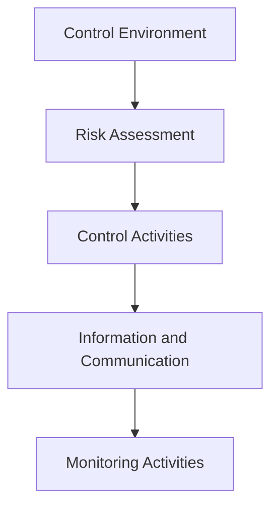

## 3.1 COSO Internal Control – Integrated Framework: Relevance to Information Systems

The Committee of Sponsoring Organizations of the Treadway Commission (COSO) developed the Internal Control – Integrated Framework (ICIF) to help organizations design, implement, and evaluate effective controls. In today’s environment, technology permeates every aspect of financial reporting and operational processes, so understanding how COSO’s Framework applies to information systems is paramount for CPAs and IT auditors. This section highlights how each of COSO’s five components—Control Environment, Risk Assessment, Control Activities, Information and Communication, and Monitoring Activities—can be leveraged to address technology-related risks. We will also explore real examples, best practices, and alignment techniques that make the framework particularly relevant for enterprise information systems.

--------------------------------------------------------------------------------

### Overview of COSO’s Internal Control – Integrated Framework

First introduced in 1992 and updated in 2013, COSO’s framework remains a foundational standard for designing and evaluating internal controls. It aims to enhance organizational performance and governance by providing a robust model that supports reliable financial reporting, compliance with laws and regulations, and operational excellence. With the rapid acceleration of technology’s role in finance, applying COSO principles to information systems is no longer optional—it's a critical success factor.

At a high level, COSO defines internal control as “a process, effected by an entity’s board of directors, management, and other personnel, designed to provide reasonable assurance regarding the achievement of objectives” in three key areas:
• Operations Objectives (effectiveness and efficiency of operations)  
• Reporting Objectives (reliability of internal and external reporting)  
• Compliance Objectives (adherence to applicable laws and regulations)  

Information technology is central to these three objectives because it impacts how data is captured, stored, processed, and reported. Consequently, your organization’s IT environment must align with COSO’s five integrated components of internal control. Below is a simple diagram illustrating how these five COSO components build upon one another in a typical organization:

Each component works in unison to ensure that technology-related activities meet organizational objectives. When well-designed and properly implemented in an information systems context, these controls mitigate technology risks such as unauthorized access, unapproved program changes, unreliable data, and system downtime.

--------------------------------------------------------------------------------

### 1. Control Environment

#### Definition and Importance  
The Control Environment is the keystone of the entire COSO framework. It reflects the organization’s culture, tone at the top, and ethical values. In technology contexts, the control environment establishes clear roles and responsibilities for IT personnel and fosters a security-conscious culture. If management disregards system integrity or demonstrates lax attitudes toward security, lower-level employees are likely to mirror these behaviors.

#### Key Elements in an IT Environment
• Ethical Tone: Management should demonstrate integrity by enforcing strict adherence to cybersecurity and data privacy guidelines.  
• Organizational Structure: Clearly define IT governance roles—such as data owners, system administrators, and cybersecurity leads—so there is accountability for critical controls.  
• Competence and Training: Provide ongoing education for IT staff and end-users around emerging threats, system updates, and control requirements.  
• Management Oversight: Set up committees (e.g., IT steering committee, risk committee) that meet regularly to review and approve major IT projects and initiatives.

#### Real-World Example  
A mid-sized manufacturing company notices an uptick in phishing attempts targeting its finance department. Management holds a mandatory company-wide training covering phishing red flags and updates their code of conduct to address cybersecurity responsibilities explicitly. This clear tone at the top—demonstrating that data protection is paramount—improves workplace awareness, reduces successful phishing attacks, and heightens overall security stretching from the finance team’s daily tasks to how system administrators manage user accounts.

--------------------------------------------------------------------------------

### 2. Risk Assessment

#### Definition and Importance
Under COSO, Risk Assessment involves identifying, analyzing, and evaluating the risks that could prevent the organization from achieving its objectives. From an information systems perspective, this includes understanding how technology might fail to capture or process transactions accurately, or how reliance on third-party providers could introduce vulnerabilities. The Risk Assessment component helps management prioritize which IT controls need immediate attention.

#### Steps in the IT Risk Assessment Process  
• Identify IT Objectives: Determine what the organization wants to achieve with its technology—from enabling secure remote access to ensuring accurate reporting.  
• Identify Risks: Catalog potential threats, such as system breaches, data corruption, or operational disruptions (e.g., server outages).  
• Analyze Risks: Evaluate each risk’s likelihood and potential impact. This might involve rating scale methods or quantitative approaches.  
• Prioritize and Respond: Decide on risk responses—avoidance, reduction through controls, transfer (e.g., insurance), or acceptance—balanced with cost-benefit analyses.

#### Real-World Example  
An online retail company relies heavily on its e-commerce website for revenue. Through their IT Risk Assessment, they identify major risks such as Distributed Denial of Service (DDoS) attacks, cardholder data breaches, and server downtime during peak holiday shopping seasons. Using the COSO approach, the organization analyzes the probabilities and impacts of these threats, then allocates resources to bolster firewall controls, apply intrusion detection systems, and set up an incident response plan.

--------------------------------------------------------------------------------

### 3. Control Activities

#### Definition and Importance
Control Activities are the policies and procedures put in place to mitigate identified risks. In the realm of information systems, control activities might include automated system checks, password policies, segregation of duties in software development, and comprehensive data backup processes. These activities ensure that technology-related controls align with organizational objectives and effectively address IT risks.

#### Key Classifications of IT Control Activities
• Preventive Controls: Aim to deter or prevent errors or unauthorized activities (e.g., role-based access controls).  
• Detective Controls: Identify errors or irregularities that may have already occurred (e.g., intrusion detection systems, audit trails).  
• Corrective Controls: Remediate identified gaps or security events (e.g., restoring data from backups after a ransomware attack).  

#### Examples of Control Activities in Practice
• Segregation of Duties in IT Systems: A developer should not have the authority to move code into production without oversight or approval from a release manager.  
• Data Validation Controls: Automated input validation checks to ensure sales transactions contain all necessary fields and permissible value ranges.  
• Patch Management Policies: Schedules and implements system and application patches with testing protocols to minimize operational disruption.  
• Encryption of Sensitive Data: Protect sensitive files in transit (e.g., TLS/SSL for web transactions) and at rest (e.g., database encryption).

#### Real-World Example
A healthcare organization regularly processes sensitive patient records. They implement multifactor authentication (MFA) and network segmentation to restrict access to medical databases. A robust patch management process ensures that all medical devices and servers receive timely updates, reducing vulnerabilities from outdated software. Additionally, the organization’s detective controls routinely scan for irregular logins or unauthorized database queries. By emphasizing these control activities, the organization substantially reduces the likelihood of a privacy breach and maintains compliance with HIPAA regulations.

--------------------------------------------------------------------------------

### 4. Information and Communication

#### Definition and Importance
Information and Communication deals with how data is generated, reported, and shared both internally and externally. In an IT context, this includes ensuring the organization’s systems are capable of producing reliable, timely, and relevant information that flows to the right individuals. Effective communication ensures that policies, controls, and risk assessments are consistently understood and followed throughout the enterprise.

#### Core Aspects of Information and Communication in IT
• Data Quality: The data feeding into financial and operational reports must be accurate, complete, and secure.  
• Communication Channels: Clear escalation procedures and consistent messaging regarding IT policies, incident response plans, and internal training.  
• External Reporting: Managing stakeholder expectations, adhering to standards like PCI DSS (for payment card data) or GDPR (for European Union citizens’ data).  

#### Real-World Example
A financial institution that processes thousands of transactions daily invests in data visualization and real-time dashboards to monitor anomalies. It also establishes alerts that instantly communicate suspicious activity to both the cybersecurity team and relevant management personnel. These dashboards provide executive-level summaries, while technical teams receive detailed logs and event traces. This robust communication approach shortens the time needed to respond to possible unauthorized events and fosters trust in the institution’s reporting.

--------------------------------------------------------------------------------

### 5. Monitoring Activities

#### Definition and Importance
Monitoring Activities verify whether internal controls operate effectively over time. This includes routine checks, internal audits of system controls, and real-time alert systems that measure performance metrics (e.g., system availability). In an IT environment, continuous monitoring can help an organization quickly identify control breakdowns or security incidents.

#### Approaches to Monitoring
• Ongoing Monitoring: Automated alerting and performance dashboards identify control lapses in real time (e.g., unusual login attempts).  
• Separate Evaluations: Periodic, structured reviews—often performed by internal auditors or external specialists—to test key controls.  
• Reporting Deficiencies: All identified weaknesses or vulnerabilities should be evaluated, and corrective measures implemented promptly.

#### Real-World Example
A global logistics provider uses an enterprise-wide platform to track shipments and financial transactions across multiple time zones. An internal audit team conducts quarterly evaluations of critical IT systems, including server logs, access controls, and transaction processing. Meanwhile, automated monitoring tools generate immediate alerts for suspicious patterns, such as repeated failed login attempts. The synergy between continuous and periodic monitoring ensures robust oversight, helping the organization respond quickly to threats and sustain operational effectiveness.

--------------------------------------------------------------------------------

### Combining the Components: Case Study Example

#### Integrated Approach at “ABC Tech Solutions”
Imagine a mid-sized software outsourcing company named “ABC Tech Solutions.” With a majority of its services involving high-availability cloud deployments for global clients, it must seamlessly implement COSO’s five components in its IT environment:

• Control Environment: The CEO and executives at ABC Tech emphasize ethical values and a strong “security-first” mindset. They form an IT steering committee that meets monthly to review IT-related policies.  
• Risk Assessment: ABC Tech performs annual cybersecurity risk assessments, identifying threats like unpatched servers, insider threats, and compliance risks in multi-cloud deployments.  
• Control Activities: The IT team implements role-based-access controls for developers, ensuring that no one has carte blanche to modify or deploy code without review. Automated vulnerability scans run weekly, and multifactor authentication is mandatory for VPN access.  
• Information and Communication: Management issues security bulletins whenever a major patch or policy change arises. A well-organized intranet site provides each department with relevant, easy-to-digest documentation on IT policies and procedures.  
• Monitoring Activities: Real-time intrusion detection logs feed into a Security Information and Event Management (SIEM) solution. A dedicated internal audit group reviews the effectiveness of controls semi-annually and convenes with the IT steering committee to address potential deficiencies.

By integrating the COSO framework across these areas, ABC Tech Solutions significantly reduces its risk of security breaches, ensures more accurate financial reporting for both internal and client billing, and confidently meets regulatory mandates.

--------------------------------------------------------------------------------

### Aligning COSO with Other Frameworks

Although COSO is influential, it can stand alongside or be integrated with other frameworks:
• COBIT 2019 (Chapter 3.3): Focuses more specifically on governance and management of enterprise IT.  
• ISO 27001: Offers guidelines specifically for information security management systems.  
• COSO ERM (Chapter 3.2): Goes deeper into enterprise-wide risk management, complementing the internal control focus.  
• Industry-Specific Regulations: For example, PCI DSS for payment card data or HIPAA for healthcare data often rely on COSO-like principles to ensure strong internal controls in relevant business processes.

No matter which additional frameworks you adopt, COSO provides a solid foundation that ensures technology processes are aligned with organizational goals. This alignment promotes consistent, reliable IT services that underpin financial reporting, compliance, and operational success.

--------------------------------------------------------------------------------

### Best Practices and Common Pitfalls

Below is a simple table summarizing key best practices and frequent pitfalls for each COSO component in an IT context:

| COSO Component         | Best Practice                                              | Common Pitfall                                           |
|------------------------|------------------------------------------------------------|----------------------------------------------------------|
| Control Environment    | Clear top management support for IT policies and controls | Lack of accountability or tone at the top                |
| Risk Assessment        | Formal process for IT risk identification and prioritization | Treating IT risk as an afterthought or sporadic concern  |
| Control Activities     | Dialog between IT and business on required controls; robust segregation of duties | Excessive reliance on one team, leading to conflicts of interest or missed controls |
| Information & Communication | Timely distribution of policies and system updates | Poorly configured communication lines or outdated procedures |
| Monitoring Activities  | Combination of real-time alerts and regular audits         | Random or poorly coordinated reviews that uncover risks too late |

**Best Practices**  
• Integrate IT controls into the broader corporate governance structure.  
• Maintain an ongoing risk assessment cycle to capture emerging threats.  
• Leverage automated technologies—continuous auditing, real-time alerts—to enhance monitoring.  

**Common Pitfalls**  
• Overlooking cultural factors that discourage employees from reporting security concerns.  
• Failing to regularly update or test the effectiveness of key IT controls.  
• Allocating insufficient budget or resources for IT governance initiatives.

--------------------------------------------------------------------------------

### Looking Ahead: The Evolving Role of COSO in Technology

As emerging technologies—cloud computing, artificial intelligence, blockchain, and IoT—continue to transform business models, the COSO framework remains a guiding light. By proactively applying COSO’s five integrated components, organizations can better anticipate and manage the complexities of new technology landscapes while preserving data integrity and ensuring reliable financial reporting.

When combined with a culture that values continuous improvement, the COSO framework helps CPAs and IT auditors build a resilient, high-performing technology environment that can adapt to evolving regulatory and competitive challenges.

--------------------------------------------------------------------------------

## Strengthen Your Mastery of COSO in IT Environments



### Which of the following best describes the "Control Environment" in a COSO-based IT setting?
- [x] It sets the ethical tone at the top and forms the foundation for all other controls.  
- [ ] It consists solely of automated control activities for IT infrastructure.  
- [ ] It deals exclusively with third-party risk and vendor oversight.  
- [ ] It is purely about security software and hardware solutions.  

> **Explanation:** The Control Environment shapes the organization's culture, ethics, and management oversight in IT operations. It lays the groundwork for how seriously employees will view and comply with the entire internal control system.

### In a robust COSO-based Risk Assessment process, which step typically occurs first?
- [ ] Prioritize and respond to identified risks.  
- [x] Identify and catalog IT objectives and potential risks.  
- [ ] Implement detective controls to catch errors or breaches.  
- [ ] Create final incident response reports for stakeholders.  

> **Explanation:** The first step in risk assessment is to identify IT objectives and potential risks. Only then can the organization analyze these risks and decide how to prioritize and treat them.

### What is the main purpose of “Information and Communication” within the COSO framework?
- [ ] To ensure all employees memorize the corporate mission statement.  
- [x] To facilitate the flow of reliable, relevant, and timely data to the right people.  
- [ ] To require periodic rotation of IT staff among operating units.  
- [ ] To mandate external audits be performed annually.  

> **Explanation:** Information and Communication under COSO focuses on generating, communicating, and using relevant information so that internal controls function effectively and accurately.

### Which of the following best represents a “Preventive Control” in an IT context?
- [x] Requiring multi-factor authentication for all user logins.  
- [ ] Running weekly vulnerability scans to detect issues.  
- [ ] Maintaining a log of user activities for incident investigation.  
- [ ] Performing a periodic financial statement audit.  

> **Explanation:** Multi-factor authentication deters unauthorized access before it can happen, making it a preventive control. Detective controls come later to identify issues that already occurred.

### Which of these statements about Monitoring Activities is correct?  
- [x] Monitoring activities can be ongoing, separate evaluations, or a mix of both.  
- [ ] Monitoring only happens once per year, during the annual audit.  
- [x] Monitoring should identify control deficiencies early and enable swift correction.  
- [ ] Monitoring is optional if management trusts its employees.  

> **Explanation:** Monitoring involves continuous or periodic reviews of the internal control system to catch and resolve issues before they cause significant damage or noncompliance.

### Which aspect of the Control Environment ensures employees have the necessary skills for their IT roles?
- [x] Competence and training initiatives.  
- [ ] Implementation of detective controls.  
- [ ] Regular system availability testing.  
- [ ] Automated password reset mechanisms.  

> **Explanation:** The Control Environment includes practices that confirm employees are competent and well-trained to fulfill their responsibilities, aligning with organizational values and objectives.

### Which of the following scenarios illustrates a potential pitfall in applying COSO’s Risk Assessment component to information systems?
- [x] Management performs risk assessments only after a security breach occurs.  
- [ ] The organization measures the impact and likelihood of key IT risks.  
- [x] Management documents overdue patch requirements but never allocates resources.  
- [ ] The organization sets up a risk committee to meet quarterly to discuss technology threats.  

> **Explanation:** A reactive (rather than proactive) approach to risk assessment is a common pitfall, as is failing to follow up on identified risks. Both undermine the comprehensive value of COSO.

### Which best describes how IT Control Activities interact with the Risk Assessment component?
- [x] Control Activities mitigate the specific risks identified during Risk Assessment.  
- [ ] Control Activities exist only to comply with external audit requests.  
- [ ] Control Activities shape the organizational culture and ethical tone.  
- [ ] Control Activities are an overarching objective that stands apart from risk analysis.  

> **Explanation:** Once risks are identified and evaluated, organizations select and develop specific control activities to address those risks effectively.

### In the COSO framework, how do "Information and Communication" and "Monitoring Activities" interrelate from an IT perspective?
- [x] Information from monitoring efforts must be communicated effectively, enabling corrective actions.  
- [ ] They are standalone processes with no overlapping functions.  
- [ ] Monitoring is only relevant to the board of directors, while communication is reserved for IT staff.  
- [ ] Communication replaces monitoring by producing standardized reports.  

> **Explanation:** Monitoring identifies when controls are ineffective, but that insight must be conveyed to those responsible so actions can be taken. Effective communication channels ensure timely and effective response.

### True or False: Under COSO, a robust internal control environment implies zero risk of technology-related breaches.
- [x] True  
- [ ] False  

> **Explanation:** Although the objective is risk mitigation, no system of internal control can guarantee zero risk. COSO aims to provide reasonable assurance, acknowledging that some level of residual risk remains.



--------------------------------------------------------------------------------

## For Additional Practice and Deeper Preparation

### [Information Systems and Controls (ISC)](https://www.udemy.com/course/isc-cpa-mock-exams/?referralCode=E1217303222935C5E464)

Information Systems and Controls (ISC) CPA Mocks: 6 Full (1,500 Qs), Harder Than Real! In-Depth & Clear. Crush With Confidence!

- Tackle full-length mock exams designed to mirror real ISC questions.  
- Refine your exam-day strategies with detailed, step-by-step solutions for every scenario.  
- Explore in-depth rationales that reinforce higher-level concepts, giving you an edge on test day.  
- Boost confidence and minimize anxiety by mastering every corner of the ISC blueprint.  
- Perfect for those seeking exceptionally hard mocks and real-world readiness.  

_Disclaimer: This course is not endorsed by or affiliated with the AICPA, NASBA, or any official CPA Examination authority. All content is for educational and preparatory purposes only._
