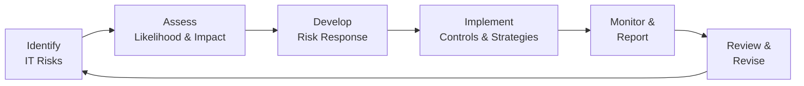

## 3.2 COSO ERM for IT: Risk Management Across Digital Environments

Enterprise Risk Management (ERM) provides a structured and systematic approach for identifying, assessing, managing, and monitoring risks that can affect an organization’s ability to achieve its objectives. In today’s dynamic business environment, technology touches virtually every aspect of an organization—spanning from internal processes to global-facing digital storefronts. As a result, risk considerations related to Information Technology (IT) and Information Systems (IS) are paramount to enterprise success and resilience.

This section explores how the Committee of Sponsoring Organizations’ Enterprise Risk Management (COSO ERM) framework applies to IT and digital environments. Readers will gain an understanding of key IT risk categories, strategies for evaluating and responding to these risks, and best practices for integrating ERM principles within a modern technology infrastructure.

### The Rationale for COSO ERM in IT

COSO ERM was designed to help organizations cultivate a culture of risk awareness and to align risk management with strategic and operational planning. For IT functions, the alignment is crucial because:

• Emerging Threats: Cyber threats, system downtime, and data breaches have far-reaching implications for operational continuity, reputation, and regulatory compliance.  
• Complexity of Digital Ecosystems: As companies adopt cloud models, Internet of Things (IoT) devices, and advanced analytics, their risk profiles expand in scale and complexity.  
• Strategic Value of IT: Technology is no longer just a support function; it drives innovation, customer engagement, and competitive advantage. Effective risk management ensures sustainable growth in technology-driven initiatives.  
• Regulatory Landscape: Laws such as GDPR, HIPAA, PCI DSS, and other regulations increase expectations for organizations to have robust, well-documented IT controls.  

By embedding ERM processes in the IT function, organizations can better anticipate risks, respond more swiftly, and align IT outcomes with broader business goals.

### Core Principles of COSO ERM for IT

While COSO ERM comprises multiple components (such as governance and culture, strategy and objective setting, performance, review and revision, and information, communication, and reporting), the following core principles are particularly relevant to IT:

• Governance and Culture: Emphasizes the tone from the top, including leadership’s role in establishing ethical standards and commitment to effective risk management. In IT, this fosters a culture that respects and values security, compliance, and innovation.  
• Strategy and Objective Setting: Ensures that technology initiatives align with business objectives. In practice, IT strategic planning incorporates appropriate risk appetite and risk tolerance levels to guide technology investments.  
• Performance: Involves identifying and assessing IT-related risks, implementing risk responses, and developing key risk indicators (KRIs) and metrics for performance monitoring.  
• Review and Revision: Entails continuous reassessment of IT risks and their impacts, reflecting new threats, technologies, or organizational changes.  
• Information, Communication, and Reporting: Provides clear channels for communicating IT risk insights to management and stakeholders.  

When properly integrated, these core principles shape the enterprise’s approach to digital risk—balancing security, privacy, and reliability with the need for agility and innovation.

### Integrating ERM with Digital Strategy

Technology is interwoven with the strategic goals of most modern organizations. Therefore, ERM for IT should not operate in isolation. Instead, risk assessments and mitigation strategies should:

• Incorporate Market Trends and Innovation: Evaluate how emerging technologies (e.g., AI, RPA, blockchain) might offer both opportunities (new revenue streams, process efficiencies) and threats (intellectual property risk, compliance exposures).  
• Align Technology Goals with Business Objectives: For instance, if an organization’s strategic goal is to expand globally, its IT team must assess localized compliance requirements and data governance issues.  
• Engage Cross-Functional Stakeholders: Collaboration between IT, Finance, Operations, Legal, and HR ensures that technology risk management addresses all relevant dimensions, from data privacy to financial reporting.  
• Establish Risk Tolerances: Define, in measurable terms, acceptable levels of interruption, data loss, or security incidents according to the organization’s overall risk appetite.

### Typical IT Risk Categories

Within a COSO ERM context, IT risks can be categorized in various ways. The following table presents common IT risk domains along with illustrative examples:

| Risk Category            | Description                                      | Examples                                                         |
|--------------------------|--------------------------------------------------|------------------------------------------------------------------|
| Cybersecurity            | Threats to confidentiality, integrity, and availability of data and systems | Phishing attacks, ransomware, malware, denial-of-service (DoS)   |
| Data Privacy & Protection| Potential breach of privacy regulations or misuse of personal data | Unauthorized access to personal identifiers, GDPR non-compliance |
| Operational Resilience   | Inability to maintain operations following a disruption | Extended server outages, hardware failures, DR plan deficiencies |
| Vendor & Third-Party     | Risks introduced through external service providers or IT outsourcing | Weak controls at a cloud vendor, subservice organization risks   |
| Regulatory & Compliance  | Failure to meet legal and regulatory requirements specific to IT | Non-compliance with PCI DSS, HIPAA, or other industry mandates   |
| System Implementation    | Challenges related to new technology deployments or upgrades | ERP rollout delays, insufficient testing, integration failures    |
| Strategic Technology Risks| Misalignment of technology initiatives with overall business goals | Overinvestment in unproven technology, outdated infrastructure    |
| Project Management       | Risk of cost overruns, missed deadlines, or scope creep | Budgetary shortfalls, poor resource planning, inadequate governance |

By identifying these risks, organizations can prioritize their focus based on impact, likelihood, and alignment with strategic objectives.

### The COSO ERM Process Applied to IT

The COSO ERM process is iterative and cyclical, designed to achieve ongoing identification, assessment, response, and monitoring of risks. Below is a conceptual flow diagram depicting how IT risk management steps align with the COSO ERM process:

#### Identify IT Risks
This phase involves uncovering internal and external IT events that could hamper the achievement of objectives. Tools often include risk registers, IT audits, vulnerability scans, and scenario planning.

#### Assess Likelihood and Impact
After the risks are identified, organizations evaluate the probability of occurrence and potential severity of consequences. Consider both quantitative (financial losses, downtime periods) and qualitative (reputation damage, regulatory sanctions) factors.

#### Develop Risk Response
Organizations then select a response strategy—a critical step that shapes resource allocation and control design. Common IT risk responses include acceptance, avoidance, sharing (e.g., cyber insurance, outsourcing), and reduction through enhanced controls.

#### Implement Controls and Strategies
In this phase, organizations put the chosen risk response into action. For an IT risk, this could range from adopting multi-factor authentication (MFA) to reengineering entire legacy systems to align with new standards.

#### Monitor and Report
Continuous monitoring ensures that risks are being managed effectively. Key risk indicators should be integrated into dashboards and periodically reported to IT and executive leadership.

#### Review and Revise
As the digital environment evolves—through new regulations, cyber threats, or business initiatives—periodic review ensures the risk management framework remains relevant and robust.

### Possible Risk Responses in IT

One of the most critical decisions in managing IT risk is determining the right course of action given the risk exposure and organizational risk appetite. The following table illustrates how these choices can manifest in practice:

| Risk Response   | Description                         | Example                                                                       |
|-----------------|-------------------------------------|-------------------------------------------------------------------------------|
| Avoid           | Eliminate risk by discontinuing an activity | Cease using an outdated, unsupported operating system with known vulnerabilities |
| Reduce (Mitigate)| Implement controls to lower the risk likelihood and/or impact | Deploy data encryption, implement access management, or patch systems promptly |
| Transfer (Share)| Shift the risk to a third party or insurance| Purchase cyber liability insurance or outsource specific IT services           |
| Accept          | Tolerate the risk if it aligns with risk appetite more cost-effective than mitigation | Operate a legacy system if the cost of upgrading outweighs the potential exposure |

### Balancing Risk Appetite and Innovation

In modern organizations, IT is often a driver of innovation. A zero-risk approach can stifle creativity and lead to missed opportunities. Conversely, excessive risk-taking might compromise data integrity, invite regulatory fines, or damage the organization’s reputation. Balancing risk appetite with technology innovation involves:

• Conducting Cost-Benefit Analysis: Evaluate the potential returns and costs (including intangible benefits) for each IT project or risk mitigation measure.  
• Using Pilot Programs: Roll out new or risky technologies in controlled environments before full-scale deployment.  
• Scenario and Stress Testing: Run simulations to understand worst-case events, from large-scale ransomware to catastrophic data loss.  
• Defining Clear Escalation Paths: Ensure decision-making authority is transparent so that high-level risks receive appropriate oversight.

### Real-World Example: Cloud Migration Strategy

Consider a mid-sized financial services company planning to migrate its on-premises applications to a public cloud environment. The organization recognizes multiple IT risks, including data breaches, regulatory non-compliance, vendor lock-in, and system downtime during migration.

1. Identify: The company’s risk assessment highlights compliance with various financial regulations, concerns about data privacy in a shared environment, and potential downtime if not properly managed.  
2. Assess: Management assigns a high impact score because downtime can result in financial losses and reputational risks. The likelihood is also moderate due to complexities in data migration, integration, and security management.  
3. Respond:  
   • Avoid: Reject the idea of a public cloud environment for certain sensitive workloads.  
   • Reduce: Increase testing measures, adopt robust encryption, and configure multi-zone deployments for high availability.  
   • Transfer: Additional cybersecurity insurance and in some cases partner with a managed cloud service provider to share responsibilities.  
   • Accept: Some minor risks, such as partial system outages during non-critical hours, might be acceptable if they align with the risk appetite.  
4. Implementation: The company invests in training IT employees, establishing detailed migration runbooks, and setting up a real-time monitoring system.  
5. Monitor & Report: Daily dashboards track system performance and compliance metrics.  
6. Review & Revise: Post-implementation reviews identify areas for improvement, such as refining data classification protocols and implementing advanced analytics for threat detection.

### Practical Steps to Implement COSO ERM for IT

Organizations looking to enhance their risk culture and adopt COSO ERM for IT can follow these practical steps:

• Perform a Comprehensive Risk Inventory: Regularly update a centralized risk register capturing threats, vulnerabilities, and potential events.  
• Define a Governance Structure: Specify roles and responsibilities for IT committees, internal audit teams, and compliance officers.  
• Conduct Periodic Risk Assessments: Use frameworks like COBIT, NIST CSF, or ISO 27001 to systematically evaluate technical risks.  
• Develop Key Performance & Risk Indicators: Align metrics (e.g., number of critical patches outstanding, detected intrusions) with risk tolerances.  
• Strengthen Incident Response: Formalize processes for detecting, containing, and recovering from security incidents or service disruptions.  
• Train Staff: Risk awareness should permeate the organization through regular security and compliance training.  
• Integrate ERM Processes in Development Life Cycle: Embed risk assessments in each stage of system and software development, from design and coding to deployment and maintenance.

### Common Pitfalls

Despite the benefits, integrating COSO ERM within IT workflows can encounter challenges:

• Lack of Executive Buy-In: Without clarity from senior management on strategic and risk priorities, IT teams may lack direction.  
• Siloed Implementations: When risk management remains in separate silos (e.g., finance vs. IT), critical risks may not be adequately identified or mitigated.  
• Excessive Complexity: Overly complex processes or an overabundance of specialized frameworks can lead to confusion among teams.  
• Resource Constraints: Limited budget or talent can undermine the quality of risk assessments and control implementations.

### Best Practices

To overcome these pitfalls, organizations can focus on:

• Engaging Leadership: Encourage board and C-suite to champion IT risk management, driving cultural acceptance throughout the organization.  
• Streamlining Processes: Adopt frameworks and tools that fit the organization’s maturity level, rather than blindly implementing everything at once.  
• Investing in Technology: Explore governance, risk, and compliance (GRC) platforms to automate parts of the risk management process (e.g., real-time alerts, risk dashboards).  
• Continuous Improvement: Adopt a mindset that sees risk management as ongoing, adjusting to new threats, technologies, and business opportunities.

### Case Study: Implementing a Risk-Aware Culture in a Healthcare Organization

A large healthcare provider operating multiple hospitals and clinics recognized vulnerabilities in its patient data management system. After experiencing a small ransomware incident, the organization committed to implementing COSO ERM for its IT resources:

• Governance & Culture: Formed an executive-level IT Risk Committee to set expectations for data security.  
• Strategy & Objectives: Outlined the goal of ensuring minimal patient data exposure through well-defined risk tolerances, with specific thresholds for downtime.  
• Performance: Deployed a multi-layered security architecture, including next-generation firewalls and continuous endpoint monitoring.  
• Review & Revision: Commissioned quarterly vulnerability assessments to keep pace with new cyber threats and regulatory changes such as HIPAA updates.  
• Communication & Reporting: Provided the board and management with monthly IT risk dashboards, focusing on critical incidents, response times, and ongoing projects to reinforce accountability.  

As a result, risk awareness became a central aspect of its organizational culture—an ethos of shared responsibility that significantly reduced the likelihood and impact of future cyber incidents.

### Conclusion

As digital environments evolve, so do the risks and opportunities they present. By applying COSO ERM principles to IT, organizations can develop a proactive, integrated approach to safeguarding their technology investments, data assets, and stakeholder interests. Effective ERM for IT balances introducing innovative solutions with robust governance and controls, enabling organizations to stay resilient, confident, and forward-looking in the face of continuous technological change.

References for Further Exploration:

• COSO, Enterprise Risk Management—Integrating with Strategy and Performance  
• ISACA, COBIT 2019 Framework  
• NIST Cybersecurity Framework  
• ISO/IEC 27001 Information Security Management  
• AICPA, SOC for Cybersecurity Guidance  

---

## Master Your Understanding: COSO ERM for IT Risk Management Quiz



### Which of the following best describes the primary benefit of integrating COSO ERM into IT governance?

- [ ] Minimizing all IT expenditures by cutting technology investments.  
- [x] Aligning technology risk management with overall business objectives.  
- [ ] Eliminating the need for vendor risk assessments and due diligence.  
- [ ] Guaranteeing complete avoidance of all technology-based risks.  

> **Explanation:** COSO ERM encourages a risk-aware culture, ensuring IT initiatives align with broader business goals. The objective is not to eliminate all risk but to manage it strategically.

### What is a key consideration when defining IT risk appetite in a modern organization?

- [ ] Intensifying any risk that promotes short-term financial gains.  
- [x] Balancing security and compliance with the potential benefits of innovation.  
- [ ] Strictly focusing on cost reduction at the expense of system performance.  
- [ ] Demanding zero risk tolerance in all IT projects.  

> **Explanation:** Organizations need to weigh innovation opportunities against risk exposures. A balanced approach avoids stifling growth while simultaneously safeguarding assets.

### Which of the following is an example of a cyber risk response strategy involving risk avoidance?

- [ ] Purchasing a cyber liability insurance policy.  
- [ ] Implementing stronger password policies.  
- [ ] Accepting the risk of downtime during non-peak hours.  
- [x] Discontinuing the use of an outdated operating system with known vulnerabilities.  

> **Explanation:** Risk avoidance involves completely eliminating an activity to remove the associated risk, such as discarding obsolete systems.

### In the COSO ERM process, which step directly follows developing a risk response?

- [ ] Identifying IT risks.  
- [x] Implementing controls and strategies.  
- [ ] Reviewing and revising the risk profile.  
- [ ] Avoiding or accepting the identified risks.  

> **Explanation:** After an organization decides on its preferred risk response, it must implement the necessary controls or strategies to carry out that decision.

### Which of the following best represents a “transfer” (or sharing) risk response in the context of IT risk?

- [x] Procuring an insurance policy to cover potential cyber incidents.  
- [ ] Conducting a proof-of-concept on new technology.  
- [x] Outsourcing a critical system to a managed service provider.  
- [ ] Shutting down a high-risk legacy application.  

> **Explanation:** Transferring risk can involve leveraging insurance or outsourcing systems and processes to external vendors better equipped or contractually obligated to manage specific risks.

### What is a common pitfall when implementing COSO ERM in IT environments?

- [x] Applying overly complex frameworks that confuse personnel.  
- [ ] Achieving complete visibility of minor IT risks.  
- [ ] Allocating ample budget and staff for risk management.  
- [ ] Using a consistent method of communication across teams.  

> **Explanation:** Overcomplicating processes can lead to “analysis paralysis” and confusion. The best approach is adopting the right level of complexity for the organization’s size and maturity.

### Which activity exemplifies the “Review and Revise” component of COSO ERM?

- [x] Updating vulnerability scans and risk assessments after a new software deployment.  
- [ ] Designing new security training modules for the entire organization.  
- [x] Revisiting the IT risk appetite to ensure alignment with changing business conditions.  
- [ ] Purchasing software licenses for an analytics platform.  

> **Explanation:** The “Review and Revise” phase emphasizes continual improvement and adapting to shifts in technology, regulations, and strategic objectives.

### How do pilot programs reduce IT risks associated with new technologies?

- [ ] By enforcing zero access to new technologies at all times.  
- [x] By testing technology in a controlled environment before full-scale rollout.  
- [ ] By ensuring third-party vendors shoulder all risk.  
- [ ] By removing organizational oversight on technology decisions.  

> **Explanation:** Pilot programs provide a contained incubation period to test systems, gather feedback, and refine processes before widespread implementation.

### What is a key best practice for embedding a COSO ERM mindset into IT processes?

- [x] Conduct frequent, targeted training sessions to build risk awareness across the organization.  
- [ ] Delegate final risk oversight responsibilities solely to front-line employees.  
- [ ] Require no formal documentation of IT risks for agile-based projects.  
- [ ] Keep data classification optional to reduce bureaucracy.  

> **Explanation:** An effective risk culture involves continuous training, documentation, and collective responsibility that ensures everyone understands the importance of managing IT risks.

### True or False: A zero-risk approach to technology innovation is encouraged by COSO ERM to maintain system security.

- [x] True  
- [ ] False  

> **Explanation:** This is a trick question. While COSO ERM aims to manage risk effectively, a zero-risk approach often hinders innovation. In practical terms, “true” statement ironically highlights a misunderstanding: COSO ERM actually recommends balancing risk with opportunities. As a best practice, organizations avoid an absolute zero-risk approach if it restricts necessary innovation.  



---

## For Additional Practice and Deeper Preparation

### [Information Systems and Controls (ISC)](https://www.udemy.com/course/isc-cpa-mock-exams/?referralCode=E1217303222935C5E464)

Information Systems and Controls (ISC) CPA Mocks: 6 Full (1,500 Qs), Harder Than Real! In-Depth & Clear. Crush With Confidence!

- Tackle full-length mock exams designed to mirror real ISC questions.  
- Refine your exam-day strategies with detailed, step-by-step solutions for every scenario.  
- Explore in-depth rationales that reinforce higher-level concepts, giving you an edge on test day.  
- Boost confidence and minimize anxiety by mastering every corner of the ISC blueprint.  
- Perfect for those seeking exceptionally hard mocks and real-world readiness.  

_Disclaimer: This course is not endorsed by or affiliated with the AICPA, NASBA, or any official CPA Examination authority. All content is for educational and preparatory purposes only._
