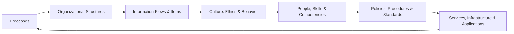
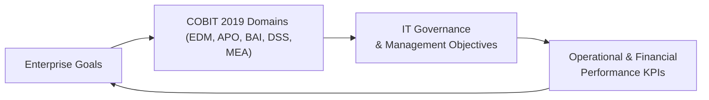

## 3.3 COBIT 2019 Overview: Governance System Principles and Components

The effective governance of enterprise information technology (IT) has become a critical function for modern organizations. CPAs often find themselves at the intersection of financial oversight and technology enablement, playing a key role in evaluating IT controls, ensuring regulatory compliance, and aligning IT activities with strategic business objectives.

COBIT 2019, developed and maintained by ISACA, has long been recognized as a leading framework for IT governance and management. While previous iterations (such as COBIT 5) are still relevant, COBIT 2019 provides revised principles, updated core models, and extensive guidance that helps organizations tailor governance approaches to specific business contexts. For CPAs, COBIT 2019 offers a structured way to assess, recommend improvements, and assure stakeholders that IT resources are used efficiently, effectively, and in accordance with organizational goals.

This section explores the main features of COBIT 2019, looking at its governance system principles, components, and how CPAs can use the framework to assess IT governance alignment with business goals.

Introduction to COBIT 2019  
COBIT stands for “Control Objectives for Information and Related Technology.” It is both a comprehensive and flexible framework designed to help organizations achieve optimal benefits from IT usage, while managing risks and ensuring compliance. COBIT 2019 refines the governance concepts from earlier versions, focusing on the following themes:  
• Aligning IT governance with organizational strategy.  
• Delivering value while mitigating IT-related risk.  
• Applying a principles-driven, dynamic governance approach.  
• Enabling a holistic view of IT across all areas of the business.

COBIT 2019 is often deployed in tandem with other frameworks and standards, such as COSO Internal Control – Integrated Framework (see Chapter 3.1), COSO ERM for IT (3.2), and ISO 27001/2. Taken together, these frameworks reinforce the importance of designing and operating effective controls that encompass not only financial processes but also the broader technology landscape.

The Need for COBIT 2019 in CPA Practice  
CPAs frequently evaluate or give assurance regarding an entity’s financial statements, IT-related processes, and controls. In an environment where IT is integral to every aspect of accounting, compliance, and reporting, robust governance is critical. By using COBIT 2019, CPAs can:  
• Assess how well IT initiatives support business strategy and financial objectives.  
• Identify gaps in control design or operation.  
• Tailor recommendations to address unique governance and risk management needs.  
• Communicate effectively with IT professionals and senior management, bridging the gap between financial oversight and technical performance.  

These capabilities align closely with CPAs’ evolving responsibilities in IT audits, SOC engagements (see Part V), and broader advisory services.

Foundational Principles of COBIT 2019  
COBIT 2019 rests on six core governance system principles, which guide the design, implementation, and continuous improvement of a governance system:

Provide Stakeholder Value  
The ultimate purpose of any governance framework is to ensure that IT and related resources create value for the organization’s stakeholders. This includes customers, shareholders, employees, regulators, and other interested parties. A CPA using COBIT 2019 will evaluate whether defined governance objectives effectively capture financial and operational imperatives.

Holistic Approach  
COBIT 2019 views governance as an all-encompassing approach, addressing people, processes, technology, culture, and organizational structures. CPAs are encouraged to look beyond technology controls alone and assess the interplay between IT processes and enterprise-wide risk management (see Chapter 3.2 for parallels to Enterprise Risk Management).

Dynamic Governance System  
Organizations continually adapt to new technologies, market conditions, and regulatory changes. COBIT 2019 emphasizes the importance of regularly updating and refining the governance system to remain fit for purpose. CPAs can apply a risk-based lens, highlighting how changes in technology—such as migrating a critical accounting system to the cloud—necessitate modifications to governance structures.

Governance Distinct from Management  
One of COBIT’s notable insights is the separation of governance from management activities. Governance sets direction, evaluates results, and monitors performance and compliance. Management plans, builds, runs, and monitors the day-to-day activities. CPAs can use this distinction in engagements to clarify role responsibilities and ensure accountability mechanisms are appropriately assigned.

Tailored to Enterprise Needs  
Not every company has the same risk tolerance, resources, or strategy. COBIT 2019 promotes tailoring governance frameworks to an organization’s nature, size, risk profile, and compliance requirements. CPAs leverage this principle to provide client-specific recommendations rather than one-size-fits-all solutions.

End-to-End Governance System  
COBIT 2019 addresses the entire enterprise, not just a standalone IT department. It encourages cross-functional collaboration and integrated oversight of data, processes, and controls that extend across finance, operations, marketing, and more. This principle resonates deeply with CPAs’ broader perspective that often encompasses financial reporting, operational controls, and risk management across the enterprise.

Key Components of a Governance System  
COBIT 2019 describes seven components that function as “enablers” or building blocks for effective governance:

• Processes  
• Organizational Structures  
• Information Flows and Items  
• Culture, Ethics, and Behavior  
• People, Skills, and Competencies  
• Policies, Procedures, and Standards  
• Services, Infrastructure, and Applications  

When applied together, these components ensure that governance and management objectives are consistently supported throughout the organization.

Processes  
Processes define the tasks and sequence of activities that achieve specific governance or management objectives. COBIT 2019 organizes these into domains such as Evaluate, Direct, and Monitor (EDM); Align, Plan, and Organize (APO); Build, Acquire, and Implement (BAI); Deliver, Service, and Support (DSS); and Monitor, Evaluate, and Assess (MEA). A CPA’s audit or advisory engagement might focus on the controls embedded within these processes—for instance, reviewing the APO processes that establish how new financial applications are selected and implemented.

Organizational Structures  
The composition and reporting lines of committees, boards, and teams play a vital role in clarifying responsibilities. A robust governance structure ensures that critical issues—like IT resource allocation, cybersecurity measures, and vendor management—are escalated to the right groups. CPAs can examine whether boards of directors and executive committees have clear charters that align IT priorities with strategic financial objectives.

Information Flows and Items  
Data is the lifeblood of modern organizations. COBIT 2019 emphasizes the importance of accurate, timely, and secure information flow between stakeholders. Data integrity is particularly relevant to CPAs who rely on precise and complete data for financial reporting. Appropriate information flows also facilitate risk assessments, budgeting, and compliance activities.

Culture, Ethics, and Behavior  
Even the most sophisticated technologies fail if the organization’s culture does not support disciplined execution. COBIT 2019 calls for an ethical climate in which employees understand how their actions impact IT risk and governance objectives. CPAs often encounter instances where apparent “tone at the top” issues undermine an otherwise robust control environment.

People, Skills, and Competencies  
COBIT 2019 recognizes that individuals with the right knowledge and skills are essential to achieving governance goals. CPAs often bridge the gap between finance and IT, using their expertise to evaluate whether skill sets, training programs, and leadership development activities align with broader governance objectives.

Policies, Procedures, and Standards  
Documentation is core to any well-structured governance system. Clear policies and procedures provide a roadmap for consistent implementation and accountability. For CPAs, understanding IT policies—such as access control, system change management, and incident response—helps to assess how effectively the organization follows established processes.

Services, Infrastructure, and Applications  
Technology solutions (hardware, software, networks, cloud services) must be adequately supported, maintained, and integrated into the organization’s broader governance system. CPAs might review service agreements, evaluate vendor performance, or confirm that the infrastructure incorporates necessary controls for financial transaction integrity.

Mermaid Diagram: COBIT 2019 Governance System Components

In the diagram above, each component links to the others in a holistic cycle, reflecting COBIT 2019’s view that governance is most effective when every part of the system works cohesively.

Governance and Management Objectives  
COBIT 2019 consolidates governance and management tasks into 40 objectives spread across five domains:

• Evaluate, Direct, and Monitor (EDM)  
• Align, Plan, and Organize (APO)  
• Build, Acquire, and Implement (BAI)  
• Deliver, Service, and Support (DSS)  
• Monitor, Evaluate, and Assess (MEA)  

For CPAs, these domains serve as a convenient reference when evaluating whether IT processes are fulfilling organizational goals—particularly in areas that affect financial transactions, such as BAI for new ERP implementations or DSS for ongoing service delivery and IT support.

Tailoring COBIT 2019  
While COBIT 2019 provides a universal framework, every enterprise has unique needs. Tailoring means identifying governance priorities based on:  
• Strategic objectives (e.g., international expansion, cost optimization).  
• Industry regulations (e.g., HIPAA for healthcare, GDPR for data privacy).  
• Enterprise size, structure, and risk capacity.  

A CPA may help an organization choose which processes require the most attention, ensuring that limited resources are dedicated to areas with the highest impact on value creation or risk mitigation. For example, a highly regulated enterprise might prioritize areas associated with data privacy and compliance, while a technology startup may focus on rapid product development and agility.

Aligning COBIT 2019 with Business Goals  
One of COBIT 2019’s hallmark features is the ability to link IT objectives to enterprise goals (such as growth, innovation, or operational excellence) and stakeholder needs. At the strategic level, organizations define what they want to achieve financially, operationally, and competitively. By mapping those aspirations to specific IT governance and management objectives, COBIT 2019 bridges the gap between technology investments and broader business sustainability.

The Role of CPAs in Ensuring Alignment  
CPAs perform various engagements and can leverage COBIT 2019 as follows:  

Compliance and Assurance Engagements  
In audits or SOC reports, CPAs gather evidence of control implementation across technology domains. They assess the design of these controls against COBIT objectives to validate alignment with recognized best practices. CPAs can present findings to boards or governance committees, recommending necessary remediation steps.

Risk Assessment and Advisory  
CPAs often assist in risk assessments, identifying where technology processes could expose the organization to potential losses or regulatory breaches. By referencing COBIT 2019’s broad coverage—especially in the APO (Align, Plan, and Organize) and MEA (Monitor, Evaluate, and Assess) domains—CPAs can help formulate action plans to strengthen the organization’s risk posture.

Performance Measurement  
Many CPAs are involved in performance measurement and analytics, such as Key Performance Indicators (KPIs) or Key Risk Indicators (KRIs). COBIT 2019 provides a catalog of metrics to monitor how well governance and management objectives are met. With these metrics, CPAs can contribute to an integrated performance dashboard mapping IT contributions, financial results, and strategic outcomes.

Case Study Example  
Imagine a mid-sized manufacturing company implementing a new ERP system to integrate finance and production processes. The CFO engages a CPA firm to ensure the project is well-managed and aligned with corporate goals—reducing labor-intensive reconciliations and speeding up month-end closes.

1. The CPA team uses COBIT 2019’s BAI domain (Build, Acquire, and Implement) to evaluate project governance, from vendor selection to data migration.  
2. They check the APO domain (Align, Plan, and Organize) to verify that IT resources—personnel, budget, and timelines—are properly allocated and monitored.  
3. They confirm the DSS domain (Deliver, Service, and Support) is designed to offer ongoing support post-implementation, ensuring the ERP will continue to meet operational and financial needs.  

Through the lens of COBIT 2019, the new ERP system’s controls are documented, validated, and refined in alignment with management’s stated goals: faster financial close, real-time production insights, and robust data integrity.

Mermaid Diagram: Mapping COBIT 2019 Domains to Enterprise Goals

Practical Steps to Implement COBIT 2019  
Although each organization’s path will vary, a typical approach to implementing COBIT 2019 may include:  
• Scoping and Tailoring: Identify which governance and management objectives are most relevant.  
• Current State Assessment: Compare existing IT processes and controls against COBIT 2019 guidance to find gaps.  
• Improvement Roadmap: Define key priorities, timeframes, and resource allocations.  
• Implementation: Roll out upgraded policies, organizational structures, or technology solutions.  
• Continuous Monitoring: Use metrics and regular audits to track adherence and measure success.

Potential Challenges and Pitfalls  
Implementing any overarching framework can be daunting. Common challenges that CPAs and organizations may encounter include:  
• Cultural Resistance: Employees may resist change if they do not understand the benefits of a structured governance framework.  
• Over-Engineered Solutions: Some businesses adopt too many processes or advanced controls that are disproportionate to their actual needs.  
• Inadequate Sponsorship: Without buy-in from executive leadership, COBIT 2019 initiatives may lack necessary resources.  
• Fragmented Implementation: Focusing on only one domain (e.g., risk management) without addressing interconnected processes may weaken the holistic impact of governance.

By anticipating these hurdles, CPAs can advise stakeholders on change management tactics, communication strategies, and realistic project plans.

Synergies with Other Standards and Frameworks  
COBIT 2019 is not used in isolation. It dovetails with frameworks discussed in:  
• Chapter 3.1 (COSO Internal Control – Integrated Framework), relevant to financial reporting controls.  
• Chapter 3.2 (COSO ERM for IT), emphasizing enterprise-wide risk management integration.  
• Chapter 3.4 (Other Influential Standards), such as PCI DSS and HIPAA, which focus on industry-specific controls.  
• Chapter 4.1 (IT Audit Objectives and Methodologies), where auditors incorporate COBIT 2019 to structure their assessments.  

These relationships allow CPAs to build comprehensive governance and control structures without redundancy, ensuring alignment and consistency in risk oversight.

Conclusion  
COBIT 2019 provides a robust framework for establishing, maintaining, and improving IT governance systems that align with broader organizational objectives. Its principle-led approach helps CPAs and other professionals examine the interplay between technology, processes, culture, and strategic goals. By adopting COBIT 2019, organizations not only protect their assets and comply with regulations but also maximize the value technology delivers to stakeholders.

CPAs occupy a unique position at the cross-section of technology, finance, and compliance. Harnessing COBIT 2019 principles and components can strengthen the credibility of advisory recommendations, enhance audit outcomes, and drive a deeper understanding of how IT supports strategic business imperatives. Ultimately, this framework gives CPAs a comprehensive lens to ensure that IT governance remains agile, tailored, and value-driven—all of which benefit the organizations they serve.

## Test Your Knowledge of COBIT 2019 Governance



### COBIT 2019 emphasizes which foundational concept for IT governance?

- [ ] Focusing on technology only
- [ ] Ensuring minimum compliance with IT regulations
- [x] Delivering stakeholder value across the entire enterprise
- [ ] Standardizing all IT processes globally

> **Explanation:** COBIT 2019 is built around providing stakeholder value while considering a holistic approach, ensuring IT initiatives are tied to broader business objectives and stakeholder expectations.

### Which of the following best describes COBIT 2019’s approach to implementing governance?

- [ ] Rigid, one-size-fits-all solutions
- [x] Flexible, principle-driven alignment with enterprise needs
- [ ] Mandatory certification for all employees
- [ ] Strictly financial reporting only

> **Explanation:** COBIT 2019 allows for tailoring the governance system based on the organization’s size, risk appetite, and strategic goals, making it both flexible and principle-driven.

### In COBIT 2019, the “End-to-End Governance System” principle means:

- [ ] IT governance is managed solely by the IT department
- [ ] Only technical teams should be held accountable for governance
- [x] Governance includes all aspects and functions within the enterprise
- [ ] COBIT covers only external vendor relationships

> **Explanation:** This principle mandates that the reach of governance extends across the organization, integrating business processes, departments, and stakeholders to ensure cohesive oversight.

### Which of the following is NOT one of the seven key components in a COBIT 2019 governance system?

- [ ] Processes
- [ ] People, Skills, and Competencies
- [x] Physical Office Layout
- [ ] Organizational Structures

> **Explanation:** The seven governance enablers of COBIT 2019 include processes, people, culture, policies, information, services/infrastructure/applications, and structures, but not physical office layout.

### In the context of COBIT 2019, which domain deals with building or acquiring new IT solutions and implementing them?

- [ ] EDM
- [ ] APO
- [x] BAI
- [ ] DSS

> **Explanation:** “Build, Acquire, and Implement” (BAI) focuses on how organizations develop or procure new IT capabilities and ensure they are implemented effectively.

### How can CPAs leverage COBIT 2019 in assurance engagements?

- [ ] By focusing strictly on tax regulations
- [ ] By designing software solutions
- [ ] By replacing all other IT frameworks
- [x] By aligning control evaluations with recognized governance standards

> **Explanation:** COBIT 2019 can be used by CPAs to structure and benchmark the organization’s governance practices, ensuring IT and financial goals align, and that controls are appropriately implemented.

### Which of these is a common challenge in implementing COBIT 2019?

- [x] Lack of executive sponsorship
- [ ] Simple scoping and universal acceptance
- [ ] Immediate results with minimal effort
- [ ] No need for tailoring across different industries

> **Explanation:** Lack of executive sponsorship and cultural resistance are frequent issues. Effective governance implementation requires support from top leadership and buy-in from the entire organization.

### Why does COBIT 2019 differentiate governance from management?

- [x] Governance sets direction and monitors, management executes day-to-day tasks
- [ ] Management is always more important than governance
- [ ] Governance deals only with technical aspects
- [ ] The terms are interchangeable

> **Explanation:** COBIT 2019 underscores that governance involves setting direction, evaluating outcomes, and monitoring performance, while management plans and executes operational tasks.

### What type of enterprise goal would typically align with Deliver, Service, and Support (DSS) objectives in COBIT 2019?

- [ ] Innovation in quantum computing
- [ ] Formulating organizational ethics
- [x] Improving help desk function and incident management
- [ ] Setting corporate mission statements

> **Explanation:** DSS objectives address the day-to-day operational and support activities, including service desk performance, incident response, and customer or end-user support.

### True or False? COBIT 2019 can be integrated with other frameworks, such as COSO and ISO standards, to provide comprehensive governance.

- [x] True
- [ ] False

> **Explanation:** COBIT 2019 is designed to integrate with various complementary frameworks, allowing better alignment of IT, financial, and operational controls with enterprise-wide objectives.



## For Additional Practice and Deeper Preparation

### [Information Systems and Controls (ISC)](https://www.udemy.com/course/isc-cpa-mock-exams/?referralCode=E1217303222935C5E464)

Information Systems and Controls (ISC) CPA Mocks: 6 Full (1,500 Qs), Harder Than Real! In-Depth & Clear. Crush With Confidence!

• Tackle full-length mock exams designed to mirror real ISC questions.  
• Refine your exam-day strategies with detailed, step-by-step solutions for every scenario.  
• Explore in-depth rationales that reinforce higher-level concepts, giving you an edge on test day.  
• Boost confidence and minimize anxiety by mastering every corner of the ISC blueprint.  
• Perfect for those seeking exceptionally hard mocks and real-world readiness.

_Disclaimer: This course is not endorsed by or affiliated with the AICPA, NASBA, or any official CPA Examination authority. All content is for educational and preparatory purposes only._
