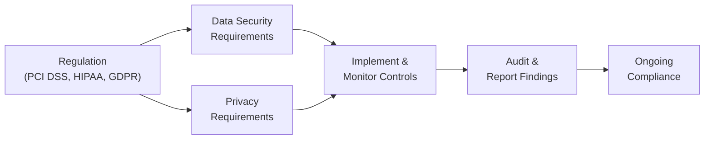

## 3.4 Other Influential Standards and Regulations (e.g., PCI DSS, HIPAA, GDPR)

The modern business environment demands a thorough understanding of the key laws and standards governing data security, privacy, and confidentiality. Beyond the broad frameworks (e.g., COSO, COBIT, and ITIL) introduced earlier, organizations must also comply with specific industry-focused regulations that impose critical requirements on how data is collected, stored, processed, and protected. These regulations significantly impact the design and operation of internal controls, as well as the way Certified Public Accountants (CPAs) plan and perform IT audits or advisory engagements.

This section examines three prominent data security and privacy regulations and standards:
• Payment Card Industry Data Security Standard (PCI DSS)  
• Health Insurance Portability and Accountability Act (HIPAA)  
• General Data Protection Regulation (GDPR)  

Each of these has a unique scope, rationale, and compliance approach but shares a common purpose: to ensure the confidentiality, integrity, and availability of sensitive data. As CPAs increasingly encounter data security and privacy requirements in audit and advisory contexts, understanding how to integrate these regulations into risk management and control assessment processes becomes paramount.

--------------------------------------------------------------------------------

Understanding the regulations below will be critical when evaluating an entity’s internal control environment, performing SOC engagements (see Part V), or advising clients on effective information system controls.

## The Payment Card Industry Data Security Standard (PCI DSS)

Payment Card Industry Data Security Standard (PCI DSS) is a globally recognized set of security requirements developed by the PCI Security Standards Council, established jointly by major payment card brands (e.g., Visa, MasterCard, American Express, Discover, and JCB). Although sometimes incorrectly referred to as a law, PCI DSS is actually an industry-mandated standard. However, non-compliance can lead to fines, reputational damage, and even loss of the ability to process credit card transactions, making adherence essential for entities handling payment card data.

Scope  
• PCI DSS covers all entities that store, process, or transmit cardholder data, including merchants, service providers, and other third parties that handle card payments.  
• It sets guidelines for securing payment infrastructure, including cardholder data environments (CDEs), networks, and supporting applications.  

Key Requirements  
PCI DSS is divided into six overarching objectives, which are further broken down into 12 primary requirements:  
1. Build and Maintain a Secure Network and Systems  
2. Protect Cardholder Data  
3. Maintain a Vulnerability Management Program  
4. Implement Strong Access Control Measures  
5. Regularly Monitor and Test Networks  
6. Maintain an Information Security Policy  

Typical Compliance Steps  
1. Scoping the Cardholder Data Environment (CDE): Identify and document all in-scope systems, networks, storage, and third-party service providers that handle card data.  
2. Gap Analysis: Compare current security policies and controls against PCI DSS requirements to pinpoint areas of non-compliance.  
3. Remediation: Address gaps through measures like network segmentation, system hardening, expanded encryption, and improved access controls.  
4. Testing and Validation: Conduct regular vulnerability scans, penetration tests, and on-site assessments (depending on merchant level, as defined by the card brands).  
5. Reporting and Certification: Provide a Self-Assessment Questionnaire (SAQ) or complete a Report on Compliance (ROC) with a Qualified Security Assessor (QSA).  

Practical Example  
A medium-sized retailer accepting in-store and online credit card payments must ensure all payment systems, web applications, and underlying network infrastructure conform to PCI DSS. They may deploy network firewalls, robust encryption for stored card data, and implement system monitoring to detect unauthorized activity across POS devices. The CPA or IT auditor, in turn, would verify that configurations adhere to the standard, confirm the retailer’s vulnerability scan results, and test compliance evidence (e.g., firewall rule sets, encryption certificates).

--------------------------------------------------------------------------------

## The Health Insurance Portability and Accountability Act (HIPAA)

HIPAA is a U.S. federal law enacted to protect sensitive patient data. Its key provisions relevant to data privacy and security are found in the Administrative Simplification section, which includes the HIPAA Privacy Rule and Security Rule. Entities responsible for HIPAA compliance (known as “covered entities” and “business associates”) include healthcare providers, health plans, clearinghouses, and the organizations that interact with protected health information (PHI).

Scope  
• Applies to protected health information (PHI) that can identify an individual or relate to health conditions, treatments, or payments.  
• Covers healthcare providers, insurance companies, and business associates that handle PHI on behalf of covered entities (e.g., third-party billing companies, IT service providers managing patient records).  

Key Requirements  
1. Privacy Rule: Defines appropriate use and disclosure of health information, including patient rights over their data.  
2. Security Rule: Establishes standards for protecting ePHI (electronic protected health information) in terms of confidentiality, integrity, and availability.  
3. Breach Notification Rule: Details the process and timelines for notifying individuals and authorities in the event of a data breach.  

Typical Compliance Steps  
1. Risk Analysis: Conduct a thorough assessment to identify threats and vulnerabilities across administrative, physical, and technical safeguards.  
2. Policy and Procedure Development: Establish written policies for PHI usage, disclosures, workforce training, and contingency planning (including data backup and disaster recovery).  
3. Access Controls and Encryption: Implement strict user authentication, role-based access, and encryption or equivalent measures for transmitting and storing ePHI.  
4. Monitoring and Auditing: Log system activity, monitor for unauthorized access to patient records, and regularly audit for compliance with the Security Rule.  
5. Breach Preparedness: Maintain a robust incident response plan that includes breach notification processes to comply with regulatory timelines.

Common Pitfalls  
• Underestimating the complexity of business associate agreements (BAAs).  
• Inadequate staff training leading to accidental disclosures of PHI.  
• Failure to monitor or quickly detect unauthorized access or potential data breaches.  

Practical Example  
A CPA tasked with auditing a regional hospital’s HIPAA compliance practices might review user access logs within the hospital’s electronic health record (EHR) system to ensure only authorized employees can access patient data. The auditor may also examine contractual agreements with third-party service providers (e.g., a billing software vendor) to verify that BAAs adequately specify each party’s security responsibilities.  

--------------------------------------------------------------------------------

## The General Data Protection Regulation (GDPR)

GDPR is an expansive data protection law enforced across the European Union (EU) that also applies to organizations around the globe processing data of EU residents. GDPR elevates the rights of individuals over their personal data, requiring stringent measures to safeguard personal information, ensure lawful data processing, and uphold transparency.

Scope  
• Applies to organizations (data controllers and data processors) that offer goods or services to, or monitor the behavior of, individuals in the EU.  
• Personal Data under GDPR is any information that can directly or indirectly identify a natural person, including names, addresses, online identifiers (e.g., IP addresses), and more.  

Key Principles  
1. Lawfulness, Fairness, and Transparency: Data must be processed legally, with clarity about how and why personal data is used.  
2. Purpose Limitation: Personal data collected for one purpose should not be unduly repurposed.  
3. Data Minimization: Collect only as much data as necessary to fulfill a specific business purpose.  
4. Accuracy: Keep data correct and up to date.  
5. Storage Limitation: Retain data only as long as it is needed for legitimate purposes.  
6. Integrity and Confidentiality: Maintain data security via appropriate technical and organizational measures.  
7. Accountability: Demonstrate compliance with GDPR obligations and maintain thorough documentation.  

Typical Compliance Steps  
1. Data Mapping and Gap Analysis: Document types of personal data collected, data flows, storage locations, and any transfers to third parties or across borders.  
2. Updating Privacy Notices: Provide individuals with clear, accessible information regarding data use, retention, and rights (e.g., rights to access, rectification, or erasure).  
3. Implementing Security Measures: Protect data at rest and in transit, deploying encryption, pseudonymization, or anonymization where feasible.  
4. Data Protection Impact Assessments (DPIAs): Evaluate high-risk data processing activities to identify and mitigate potential compliance risks.  
5. Establishing Breach Response: Develop processes to detect, report, and investigate personal data breaches within the legally mandated timeframes.  
6. Appointing a Data Protection Officer (DPO): Required if the core activities involve large-scale data processing or sensitive personal data.

Practical Example  
A multinational e-commerce retailer may process EU customer data even when operating out of a U.S.-based headquarters. The retailer would need to appoint a representative or DPO within the EU and ensure that website privacy policies, cookie consent mechanisms, and marketing communications comply with GDPR requirements. The CPA reviewing the retailer’s data privacy practices might validate the existence of data subject request procedures (e.g., how the company handles “right to be forgotten” requests) and check that data processing agreements for cloud providers meet GDPR contractual standards.

--------------------------------------------------------------------------------

## Additional Notes on Data Security and Privacy Obligations
Although PCI DSS, HIPAA, and GDPR are among the most commonly encountered regulations, other authoritative standards can also influence how organizations design and test controls. Consider the following:  
• Gramm-Leach-Bliley Act (GLBA) for financial institutions in the U.S.  
• Children’s Online Privacy Protection Act (COPPA) for organizations targeting users under 13 in the U.S.  
• California Consumer Privacy Act (CCPA), a state-level regulation that extends privacy rights to California residents.  

CPAs in public practice must factor in these regulatory mandates when designing audit procedures or offering advisory services. Understanding how each regulatory environment aligns with the COSO framework, COBIT, and various IT general controls (ITGCs) can help ensure that an organization’s control structure meets the demands of legal and regulatory compliance.

--------------------------------------------------------------------------------

## Typical Challenges and Best Practices

• Challenge: Changing Regulatory Landscape  
  – Best Practice: Establish ongoing monitoring of proposed and newly enacted regulations; integrate compliance updates into existing governance frameworks (COSO ERM, COBIT).  

• Challenge: Overlapping Requirements  
  – Best Practice: Create a unified compliance strategy that streamlines audits and testing, reducing “audit fatigue” for control owners by mapping advanced frameworks such as NIST or ISO 27001 to the relevant regulations.  

• Challenge: Third-Party Vendor Risks  
  – Best Practice: Require detailed service-level agreements (SLAs) and data processing agreements (DPAs). Verify that vendors adhere to appropriate security standards with independent audits such as SOC 2® or relevant certifications.  

• Challenge: Maintaining Complete and Accurate Records  
  – Best Practice: Implement robust policies for record retention, access logs, and evidence of control operation. Leverage automation where feasible to reduce human error.  

• Challenge: Data Governance and Classification  
  – Best Practice: Adopt a data classification schema (see Chapter 11) and track repositories containing sensitive data. Automate discovery and classification technologies for large data sets.  

--------------------------------------------------------------------------------

## Illustrative Diagram: Data Security and Privacy Regulations

Below is a simplified diagram depicting how an entity’s data security and privacy obligations intersect with various regulations. Although each standard differs in scope and focus, they often intersect in terms of core protective measures and oversight processes.

• A: A regulation such as PCI DSS, HIPAA, or GDPR imposes specific data handling and protection requirements.  
• B and C: Entities must adopt both security and privacy controls to safeguard data and ensure compliance with legislative demands.  
• D: These controls must be implemented and monitored, with periodic internal evaluations to verify effectiveness.  
• E: Periodic audits (internal, external, or SOC engagements) generate compliance reports.  
• F: Compliance is an ongoing cycle that requires continuous improvement, threat monitoring, and updating of internal policies.

--------------------------------------------------------------------------------

## Role of CPAs in Ensuring Compliance

CPAs play a significant role in guiding organizations through regulatory compliance. Their tasks might include:  
• Reviewing internal controls over financial information that intersects with protected data (payment card details, patient health records, or personal data).  
• Evaluating service organizations’ compliance with PCI DSS or HIPAA provisions as part of SOC 1® or SOC 2® engagements.  
• Assessing the design and operating effectiveness of privacy controls under GDPR, including third-party data processing and data protection impact assessments (DPIAs).  
• Advising on the governance structure needed to align compliance frameworks with organizational risk tolerance, leveraging COSO’s ERM or COBIT’s governance components.

A CPA’s specialized insight into financial systems, combined with an understanding of IT risks, positions them well to act not only as auditors verifying adherence but also as strategic advisors, helping design robust control environments that meet multi-layered regulatory expectations.

--------------------------------------------------------------------------------

## References and Further Exploration

Below are additional resources for in-depth study of data security and privacy regulations:  
• PCI Security Standards Council: Official documentation on PCI DSS, Self-Assessment Questionnaires, and best practices. (https://www.pcisecuritystandards.org/)  
• U.S. Department of Health & Human Services (HHS) HIPAA Info: Includes guidance on the HIPAA rules, training materials, case studies. (https://www.hhs.gov/hipaa/index.html)  
• European Commission GDPR Portal: Official GDPR texts, guidelines, and resources for businesses. (https://ec.europa.eu/info/law/law-topic/data-protection_en)  
• International Association of Privacy Professionals (IAPP): Training, research, and certifications on international data privacy. (https://iapp.org/)  
• AICPA Privacy Resources: Guidance documents on privacy frameworks and exam resources for CPAs. (https://www.aicpa.org/)  

--------------------------------------------------------------------------------

## Assess Your Knowledge of Data Security and Privacy Regulations



### In which scenario is PCI DSS most relevant?
- [ ] When a U.S. hospital stores patient health records electronically  
- [x] When a retailer processes credit card payments online and in-store  
- [ ] When a marketing firm handles personal data of EU citizens exclusively for email campaigns  
- [ ] When a financial services company manages personal investment portfolios  

> **Explanation:** PCI DSS specifically applies to entities that store, process, or transmit cardholder data, making it directly relevant to retailers handling credit card transactions.

### A core requirement of the HIPAA Privacy Rule includes:
- [x] Limiting the use and disclosure of protected health information unless authorized or a valid exception applies  
- [ ] Enforcing the principle of data portability for all personal data worldwide  
- [ ] Mandating the encryption of all cardholder data at rest  
- [ ] Requiring immediate breach notification to the media for all data incidents  

> **Explanation:** The HIPAA Privacy Rule restricts how protected health information is used and disclosed. Data portability is a GDPR concept, and encrypting payment data at rest is a PCI DSS concern.

### Which principle of GDPR focuses on limiting the collection of personal data to what is strictly necessary?
- [ ] Accuracy  
- [ ] Lawfulness, Fairness, and Transparency  
- [x] Data Minimization  
- [ ] Integrity and Confidentiality  

> **Explanation:** GDPR’s Data Minimization principle stipulates that organizations should only collect as much personal data as necessary for a specific business purpose.

### What is a common pitfall that healthcare organizations face under HIPAA?
- [ ] Overinvestment in encryption tools for payment card data  
- [ ] Excess logging of data disposal activities  
- [ ] Inadequate patient consults regarding opioid prescriptions  
- [x] Insufficient workforce training on how to handle protected health information  

> **Explanation:** A frequently cited HIPAA compliance issue arises when staff are not adequately trained on properly handling PHI, leading to accidental disclosures or breaches.

### Under PCI DSS, one typical first step for achieving compliance is:
- [x] Defining the cardholder data environment (CDE) scope  
- [ ] Immediately encrypting all website cookies  
- [ ] Outsourcing all payment processing to third-party vendors  
- [x] Conducting a full penetration test on internal networks  

> **Explanation:** The scoping of the cardholder data environment is essential. However, vulnerability scans and penetration testing are also required (the question allows multiple correct guidelines here). Organizations typically prioritize scoping and gap analysis first.

### Which of the following describes a requirement of the GDPR’s Breach Notification obligations?
- [x] Organizations must generally report data breaches to the relevant supervisory authority within 72 hours after becoming aware  
- [ ] Organizations have no time limit for reporting, as long as they offer remediation  
- [ ] Organizations only need to report breaches if more than one million data subjects are affected  
- [ ] Organizations must directly notify local law enforcement for all reported breaches  

> **Explanation:** GDPR requires breach notification to the relevant supervisory authority within 72 hours of awareness of the breach, unless it is unlikely to result in risk to the data subject.

### Which of the following best describes a “business associate” under HIPAA?
- [x] A vendor or service provider that handles PHI on behalf of a covered entity  
- [ ] A local retailer that accepts payment card transactions  
- [x] A third-party hosting patient records for a medical clinic  
- [ ] A European data protection supervisory authority  

> **Explanation:** Under HIPAA, a business associate is any third-party vendor or partner that creates, receives, maintains, or transmits PHI on behalf of a covered entity.

### GDPR’s accountability principle requires organizations to:
- [x] Placard their offices with data protection guidelines  
- [ ] Delegate all data protection activities to government agencies  
- [x] Document compliance efforts, demonstrate processes for ensuring compliance, and maintain detailed records  
- [ ] Adopt encryption only when dealing with credit card data  

> **Explanation:** The GDPR’s accountability principle mandates that organizations must be able to demonstrate how they comply with data protection principles, which involves documentation, governance, and oversight.

### A major difference between PCI DSS and HIPAA is:
- [ ] PCI DSS only applies to large multinational entities  
- [x] PCI DSS focuses on payment card information security, while HIPAA is centered on protecting healthcare-related data  
- [ ] HIPAA offers no guidance on breach notification  
- [ ] HIPAA universally applies to all personal data, regardless of health context  

> **Explanation:** PCI DSS is an industry standard for payment card data, whereas HIPAA applies to health information. Though both require serious data protection controls, they have separate scopes and rules.

### A retailer subject to GDPR processes a right-to-be-forgotten request from an EU citizen. The retailer must:
- [x] Delete the subject’s personal data unless a legitimate reason for retention exists  
- [ ] Transfer the data to another EU member state for verification  
- [ ] Immediately shut down all data processing activities  
- [ ] Inform the local authorities before removing any data  

> **Explanation:** Under GDPR, individuals have the right to request erasure of their personal data. Unless retained for valid legal reasons (tax, compliance, etc.), organizations must comply with the erasure request.



--------------------------------------------------------------------------------

## For Additional Practice and Deeper Preparation

### [Information Systems and Controls (ISC)](https://www.udemy.com/course/isc-cpa-mock-exams/?referralCode=E1217303222935C5E464)

Information Systems and Controls (ISC) CPA Mocks: 6 Full (1,500 Qs), Harder Than Real! In-Depth & Clear. Crush With Confidence!

• Tackle full-length mock exams designed to mirror real ISC questions.  
• Refine your exam-day strategies with detailed, step-by-step solutions for every scenario.  
• Explore in-depth rationales that reinforce higher-level concepts, giving you an edge on test day.  
• Boost confidence and minimize anxiety by mastering every corner of the ISC blueprint.  
• Perfect for those seeking exceptionally hard mocks and real-world readiness.  

_Disclaimer: This course is not endorsed by or affiliated with the AICPA, NASBA, or any official CPA Examination authority. All content is for educational and preparatory purposes only._
