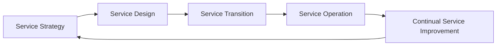

## 3.5 ITIL and IT Service Management Overviews

Information Technology Infrastructure Library (ITIL) has long been recognized as the de facto standard for IT Service Management (ITSM). It provides a collection of best practices that guide organizations in planning, delivering, and supporting IT services aligned with business needs. Accounting professionals—who are increasingly tasked with overseeing internal controls over financial reporting—should become familiar with ITIL because it enhances the reliability and continuity of IT operations that support financial processes. Ensuring technology supports accurate and timely financial reporting is integral to maintaining internal control in a modern accounting environment.

This section explores how ITIL clarifies roles, responsibilities, and processes across IT services while fostering an environment conducive to strong internal controls. We will connect ITIL’s core components (Incident Management, Problem Management, and Change Management) to key control objectives relevant to financial reporting and compliance, illustrating how a structured approach to IT service management helps mitigate risk.

  
### Purpose and Scope of ITIL

ITIL was originally developed in the 1980s by the United Kingdom’s Central Computer and Telecommunications Agency to address various inefficiencies and inconsistencies in government IT services. Today, ITIL is maintained by Axelos and has evolved into ITIL 4, reflecting modern concepts such as Agile, DevOps, and value streams.

At its heart, ITIL:

• Provides standardized terminology and frameworks to guide IT service lifecycles.  
• Emphasizes value creation through effective service design, delivery, and continual improvement.  
• Establishes roles, processes, and metrics that help organizations align IT capabilities with business objectives.  

For CPAs and other financial professionals, ITIL is particularly relevant because:

1. Accurate financial reporting depends heavily on system availability and data integrity.  
2. Repetitive or prolonged disruptions to IT services can delay or corrupt financial transactions.  
3. A structured approach to identifying, analyzing, and resolving service incidents reduces risk of misstatement, downtime, and non-compliance with standards such as COSO, SOX, and other regulations.  

  
### ITIL Service Lifecycle Overview

ITIL references a service lifecycle designed to ensure continuous improvement and alignment with evolving business needs. Although the latest ITIL 4 model uses the “Service Value System” concept, many organizations still conceptualize ITIL in terms of five major lifecycle phases: Service Strategy, Service Design, Service Transition, Service Operation, and Continual Service Improvement. Below is a simple representation using Mermaid.js:

• Service Strategy: Lays the foundation for how an organization provides value to customers (internal or external) through its IT services.  
• Service Design: Focuses on designing new or changed services and ensuring they meet stakeholder requirements, including security and reliability.  
• Service Transition: Manages the build, test, and deployment of changed or new services into production.  
• Service Operation: Concentrates on delivering and supporting the IT services in use, ensuring reliability, performance, and availability.  
• Continual Service Improvement (CSI): Ongoing efforts to refine processes, services, and technical capabilities in alignment with evolving business needs.  

For organizations with critical financial reporting responsibilities, these lifecycle phases offer a structured way to integrate risk management and internal control processes directly into IT operations.  

  
### Core ITIL Processes: Incident, Problem, and Change Management

Although ITIL comprises numerous processes (e.g., Service Level Management, Release Management, Configuration Management), three of the most widely adopted—and the most directly relevant to accounting and PCI/HIPAA compliance—are:

• Incident Management  
• Problem Management  
• Change Management  

Each of these intersects with financial operations in meaningful ways, affecting the timeliness of reporting, the completeness and accuracy of data, and the overall reliability of information flows.

  
#### Incident Management

In ITIL terms, an incident is an unplanned interruption or reduction in the quality of an IT service. For instance, an accounting department user may submit an incident ticket because they cannot access the enterprise resource planning (ERP) system just before month-end close.

Key objectives of Incident Management include:

1. Restore normal service operation as quickly as possible.  
2. Minimize adverse impact on business operations.  
3. Ensure that incidents are properly logged, classified, and prioritized.  

From an accounting context, prompt incident resolution minimizes disruptions to core processes—such as invoice processing, payroll runs, and financial consolidations—that can lead to delays or inaccuracies in financial reporting. Well-managed incidents help avoid material weaknesses and operational breakdowns that would trigger external audit concerns.

**Illustrative Scenario**  
A mid-sized manufacturing company experiences an ERP outage while processing daily sales transactions. The finance team logs an incident ticket, which is promptly routed to the IT help desk. Because of well-defined Incident Management procedures, the issue is escalated to the correct IT specialist in minutes. Downtime is limited to just a few hours, preventing an extended break in transaction recording, which could have impacted the accuracy of the daily sales ledger and subsequent financial statements.

  
#### Problem Management

Whereas Incident Management is about resolving individual disruptive events quickly, Problem Management focuses on diagnosing underlying causes to prevent recurrent incidents. In an accounting context, repeated system outages or data integrity failures can raise red flags about management’s ability to maintain effective internal controls.

Problem Management typically includes two broad approaches:

• Reactive Problem Management: Investigating root causes after incidents occur, determining how to prevent recurrence.  
• Proactive Problem Management: Identifying potential areas of risk or instability before they result in service disruptions.  

By conducting root cause analyses (RCA), IT teams can propose systemic improvements (e.g., improved patching processes, hardware upgrades, database optimizations) to protect financial systems against repeated errors or outages. This helps assure external stakeholders—auditors, regulators, investors—that the organization is devoted to continuous improvement in its IT controls.

**Illustrative Scenario**  
Over a three-month period, a retailer’s accounting system experiences four separate outages related to a database connection timeout. While Incident Management teams fixed each outage temporarily, Problem Management stepped in to analyze comprehensive logs. They discovered that the database instance was under-provisioned during peak weekly loads. The solution: increase capacity and implement a load-balancing strategy. This not only resolved the immediate issue but also dramatically reduced the likelihood of future outages at critical financial close periods.

  
#### Change Management

Change Management—sometimes called Change Control—governs the process of introducing enhancements, fixes, patches, or new features into the production environment. Rigorous Change Management is essential for maintaining the stability and consistency of financial data.

A structured Change Management approach typically includes:

• Request for Change (RFC): A formal proposal outlining the nature, rationale, and potential impact of a proposed change.  
• Impact Assessment: A risk and cost-benefit analysis, identifying how the change may affect systems, compliance requirements, or existing controls.  
• Approval Process: Decision-making by a Change Advisory Board (CAB) or designated stakeholders with authority to accept or reject high-risk changes.  
• Implementation & Post-Implementation Review: Execution of the approved change, followed by retrospective evaluation to ensure no unintended side effects.  

For accountants and auditors, a strong Change Management process helps prevent unauthorized or erroneous modifications to systems that could jeopardize financial reporting. This structure aligns neatly with internal control frameworks, such as COSO and COBIT, that demand safeguard measures when updating mission-critical systems.

**Illustrative Scenario**  
A healthcare organization plans to upgrade its ERP software. Because patient billing data and accounting data reside within the same environment, the IT team files an RFC that details potential impacts on transaction posting, integrations with payment gateways, and compliance with the Health Insurance Portability and Accountability Act (HIPAA). Following a rigorous approval process, the upgrade is executed in a controlled environment, then migrated to production over a weekend. Finance users test key reports, validating data integrity. By Monday morning, the new environment is fully operational with minimal disruption—and well-documented for future audits.

  
### ITIL’s Link to Internal Controls

ITIL processes typically intersect strongly with recognized internal control frameworks such as COSO and COBIT. In the accounting sphere, internal controls help ensure that financial data is accurate, reliable, and secure. Controlled IT environments prevent unauthorized data manipulation, system outages, and privacy breaches that can harm both an entity’s financial statements and its reputation.

Several crucial connections:

1. **Risk Assessment & Control Activities (COSO Principles):** ITIL processes directly support risk assessment for IT-related scenarios by introducing standard practices for identifying, prioritizing, and mitigating disruptions.  
2. **Monitoring Activities:** ITIL’s focus on continual service improvement mirrors COSO’s guidance to monitor internal controls and react to deficiencies in real time.  
3. **Information & Communication:** Incident, Problem, and Change Management processes ensure relevant, timely communication of significant IT events. This underpins an organization’s ability to grasp the state of its controls and quickly address anomalies.  
4. **Preventive vs. Detective Controls:** ITIL fosters both preventive controls (e.g., thorough testing before implementing a change) and detective controls (e.g., robust monitoring to spot anomalies in real-time).  

The synergy between ITIL and internal controls is practical: improved IT services reduce system-related errors, support timely financial closings, minimize restatements, and keep audit opinions unqualified.

  
### Establishing a Service Management Culture

Successful adoption of ITIL is not just about process definitions—it is equally about fostering a culture of continuous improvement and accountability. In finance and accounting contexts:

• **Collaboration:** Finance staff must collaborate with IT to accurately scope requirements, test changes, and provide feedback on service improvement.  
• **Training & Awareness:** Both IT personnel and accounting professionals benefit from training sessions. Finance users equipped with basic knowledge of ITIL concepts can escalate issues promptly and participate actively in resolution efforts.  
• **Documentation & Knowledge Management:** Orderly and up-to-date documentation on system configurations, known errors, and critical business cycles paves the way for effective process management.  

Over time, embedding ITIL processes leads to tangible benefits such as reduced downtime, clearer IT governance, and better financial data quality.  

  
### Real-World Case Study: Month-End Close Disruption

To illustrate how these processes play out in an accounting setting, consider the following scenario:

• **Scenario:** A professional services firm is finalizing month-end close. The ERP suddenly crashes, resulting in the finance team being unable to post late-day journal entries and run final reports. This puts compliance with corporate policies and timely reporting at risk.  
• **Incident Management:** The finance director calls the service desk. The incident is logged with high priority, referencing “critical month-end activity.” IT diagnoses that a patch applied earlier inadvertently corrupted a config file.  
• **Temporary Fix and Escalation:** A high-priority fix is rolled back within hours, restoring service. The finance team can complete its close without missing internal deadlines.  
• **Problem Management:** After the incident, a cross-functional Problem Management session explores root cause. IT staff discover the patch was not tested with the live ERP environment’s batch processes. A vulnerability in the testing environment (missing certain batch scripts) exposed a configuration gap.  
• **Change Management Improvement:** The next time a patch is introduced, it goes through a more robust testing stage (with correct batch scripts) and a formal approval to ensure no risk to the ERP. Documentation is updated, mitigating future disruptions.  

In this example, ITIL processes buttress internal controls by minimizing period-end financial disruption and ensuring accurate general ledger postings. As a result, the firm is more confident in the reliability of its financial data.

  
### ITIL Service Desk vs. Support Center

While “Service Desk” and “Help Desk” are often used interchangeably, ITIL draws a subtle distinction:

• **Help Desk:** Primarily reactive, focused on incident logging and resolution.  
• **Service Desk:** Broadens the scope to include coordination with other ITIL processes, proactively addressing recurring issues (Problem Management), maintaining knowledge bases, and gathering user feedback.  

A robust Service Desk environment enhances the user experience, reduces time-to-resolution, and helps the organization maintain strong internal controls by acting as a centralized, structured communication hub.

  
### Best Practices and Common Pitfalls

1. **Best Practices**  
   • Align Incident, Problem, and Change workflows with corporate risk appetite.  
   • Implement robust knowledge management systems that store solutions to common incidents and problems.  
   • Integrate financial significance into incident priority definitions—e.g., label anything that jeopardizes timely financial reporting as high or critical.  
   • Perform regular post-implementation reviews of changes, ensuring no new control gaps have been inadvertently introduced.  
   • Encourage active collaboration between finance, IT, compliance, and internal audit teams to bridge process knowledge.  

2. **Common Pitfalls**  
   • Overcomplicating workflows or forcing the organization to adopt overly rigid ITIL procedures. Balance is key.  
   • Neglecting the specialized needs of finance and accounting stakeholders—failing to account for critical tasks like month-end close or statutory audits.  
   • Underestimating training and communication requirements. Roles and responsibilities must be crystal clear.  
   • Focusing on incident resolution at the expense of problem management, leading to repeated disruptions.  
   • Believing ITIL is only an IT “checklist.” The real value emerges through continuous improvement and cross-functional engagement.

  
### Integrating ITIL with Other Frameworks

IT control frameworks such as COBIT (Control Objectives for Information and Related Technologies), COSO ERM (Enterprise Risk Management), and ISO/IEC 27001 (Information Security) often work hand-in-hand with ITIL. For example:

• **COBIT 2019** provides a governance lens for enterprise IT, prescribing how accountability, risk management, and policy-making should be structured. ITIL, on the other hand, details how to operationally deliver these services day-to-day.  
• **COSO ERM** offers a holistic approach to risk management that includes IT risk. ITIL addresses how to effectively manage that IT risk by standardizing service delivery and fostering proactive problem resolution.  
• **ISO/IEC 27001** focuses specifically on information security management systems. ITIL’s processes (Incident, Problem, Change) become part of the daily operations that keep data secure and private, fitting neatly under an ISO 27001 scope.  

By linking ITIL processes with established governance frameworks, organizations gain a robust ecosystem for dealing with the massive volumes of financial data and the myriad compliance requirements facing contemporary CPAs.

  
### Practical Advice for Accountants and Auditors

• **Learn ITIL Basics:** Familiarity with the vocabulary and process structures of ITIL ensures more effective communication with IT teams.  
• **Assess ITIL Maturity:** During risk assessments, external or internal auditors should gauge how mature an organization’s ITIL processes are. Immature processes can introduce higher risk to financial reporting systems.  
• **Examine Key Controls:** Ensure that Incident, Problem, and Change Management controls are designed and operating effectively as part of the financial audit scope, particularly for controls around financial applications.  
• **Track Metrics:** Ask for availability reports (e.g., monthly ERP uptime) and incident statistics (average resolution times, number of critical incidents). High levels of disruptions or slow resolution times can signal deeper control issues.  
• **Audit Documentation:** Confirm that major incidents and high-risk changes have adequate documentation, including approvals and back-out plans. This ties directly to evaluating the design and effectiveness of internal controls.  

  
### Summary

ITIL’s structured and iterative approach to delivering, supporting, and improving IT services is a powerful tool in an environment where timely, accurate financial data is essential. By clearly defining and linking processes like Incident, Problem, and Change Management, ITIL helps reduce downtime, strengthen internal controls, and instill confidence in auditors, regulators, and stakeholders. The key is recognizing that ITIL’s success is not solely in following its processes but in integrating them seamlessly with broader organizational and accounting objectives.

For CPAs, auditors, and finance professionals, adopting ITIL means building resilient systems and reducing the likelihood of material misstatements or compliance breaches. When properly implemented, ITIL fosters an ecosystem where IT and accounting professionals collaborate, aligning IT services with the core mission of producing reliable financial information and satisfying regulatory requirements.

  
### References and Further Exploration

• Axelos — The Official Home of ITIL (https://www.axelos.com/)  
• “ITIL® 4 Foundation” by Axelos: A practical guide to modern ITSM practices.  
• “COBIT 2019 Framework” by ISACA: Offers governance principles aligning well with ITIL’s operational guidelines.  
• “COSO Internal Control—Integrated Framework”: Foundational for internal controls best practices.  

Use these resources to gain deeper insights into ITIL principles and pursue relevant certifications, improving both your expertise in managing IT services and your ability to supervise robust internal controls over financial processes.

------------------------------------------------------------------------------------------
## Test Your Knowledge: ITIL & IT Service Management Quiz



### Which of the following best summarizes ITIL’s primary focus?

- [x] Providing best-practice guidance for managing and delivering IT services.
- [ ] Offering a strict regulatory mandate for software patching.
- [ ] Serving as an enforcement mechanism for international accounting standards.
- [ ] Outlining CFO responsibilities for capital expenditures.

> **Explanation:** ITIL sets best-practice guidelines for IT Service Management. It is not limited to compliance or accounting functions, though it supports them indirectly.

### What is the MAIN objective of Incident Management in an accounting context?

- [x] Restore service operation as quickly as possible, minimizing negative impact on financial processes.
- [ ] Identify all future risks that might impact the service.
- [ ] Track the lifecycle of software updates throughout the organization.
- [ ] Ensure all subledgers are up to date.

> **Explanation:** Incident Management aims to resolve disruptions rapidly. For finance, timely resolution protects processes like accounts payable, month-end steps, and reporting from data and timing errors.

### How does Problem Management differ from Incident Management?

- [x] Problem Management addresses root causes and prevents recurrence, while Incident Management focuses on quick restoration.
- [ ] Problem Management is the process of applying software patches in production environments.
- [x] Problem Management can be reactive or proactive to avoid repeated incidents.
- [ ] Problem Management occurs only after service level agreements are updated.

> **Explanation:** Incident Management aims to tackle immediate disruptions; Problem Management investigates underlying causes, adopting both proactive and reactive approaches.  

### Which of the following describes Change Management’s primary role?

- [x] Ensuring that modifications to IT systems follow a controlled governance process.
- [ ] Approving employee leave requests in the finance department.
- [ ] Handling day-to-day user questions about spreadsheets.
- [ ] Organizing monthly staff meetings.

> **Explanation:** Change Management evaluates, tests, and deploys system changes in a structured, risk-assessed manner to protect service continuity and data integrity.

### Which ITIL process most directly helps prevent the recurrence of repetitive system outages related to financial applications?

- [x] Problem Management
- [ ] Incident Management
- [x] Problem Management
- [ ] Capacity Management

> **Explanation:** Problem Management seeks root causes of repeated incidents; it works in conjunction with other processes to prevent recurrence and improve system stability over time.

### In what way is ITIL beneficial for maintaining effective internal controls?

- [x] It provides structured processes (like Incident, Problem, and Change Mgt) that ensure systems remain stable and reliable.
- [ ] It dictates how accounting entries must be posted in the general ledger.
- [ ] It standardizes financial reporting formats for external disclosures.
- [ ] It replaces all COSO-related controls with new IT controls.

> **Explanation:** ITIL complements, rather than replaces, internal control frameworks by articulating standardized processes for managing IT-related events and changes that can directly affect data integrity.

### Why might CPAs benefit from having knowledge of ITIL processes?

- [x] They can better assess risks, coordinate audit procedures, and ensure IT disruptions do not compromise financial data.
- [ ] They can configure ERP user interfaces without assistance.
- [x] They can collaborate effectively with IT to improve financial process stability.
- [ ] They can override changes in the system with no IT approvals.

> **Explanation:** Understanding ITIL helps CPAs integrate IT considerations into their risk assessments and fosters effective collaboration, rather than operating in silos.

### Which ITIL process ensures that changes to critical systems, such as ERP solutions, undergo risk assessment and approval prior to implementation?

- [x] Change Management
- [ ] Problem Management
- [ ] Incident Management
- [ ] Release Management

> **Explanation:** Change Management sets the structure for evaluating, approving, and implementing modifications to production systems, safeguarding data and service continuity.

### Which of the following best illustrates the importance of an integrated approach between ITIL and financial processes?

- [x] Thorough testing prior to a system update prevents disruptions during the month-end close process.
- [ ] Conducting an external financial audit without involving IT staff.
- [ ] Revising the chart of accounts to incorporate new IFRS standards.
- [ ] Setting arbitrary deadlines for patch releases, regardless of financial calendar.

> **Explanation:** Coordinating IT changes with financial cycles (e.g., month-end close, year-end) is critical to avoiding data inaccuracies and downtime in reporting processes.

### An effective Problem Management practice supports internal controls by:

- [x] True
- [ ] False

> **Explanation:** By identifying the root causes of incidents, Problem Management helps organizations prevent repeated service disruptions, thus strengthening control over financial data and processes.



------------------------------------------------------------------------------------------

## For Additional Practice and Deeper Preparation

### [Information Systems and Controls (ISC)](https://www.udemy.com/course/isc-cpa-mock-exams/?referralCode=E1217303222935C5E464)

Information Systems and Controls (ISC) CPA Mocks: 6 Full (1,500 Qs), Harder Than Real! In-Depth & Clear. Crush With Confidence!

- Tackle full-length mock exams designed to mirror real ISC questions.  
- Refine your exam-day strategies with detailed, step-by-step solutions for every scenario.  
- Explore in-depth rationales that reinforce higher-level concepts, giving you an edge on test day.  
- Boost confidence and minimize anxiety by mastering every corner of the ISC blueprint.  
- Perfect for those seeking exceptionally hard mocks and real-world readiness.  

_Disclaimer: This course is not endorsed by or affiliated with the AICPA, NASBA, or any official CPA Examination authority. All content is for educational and preparatory purposes only._
