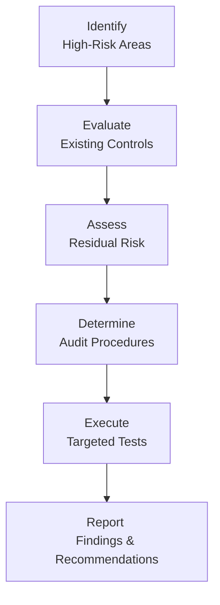
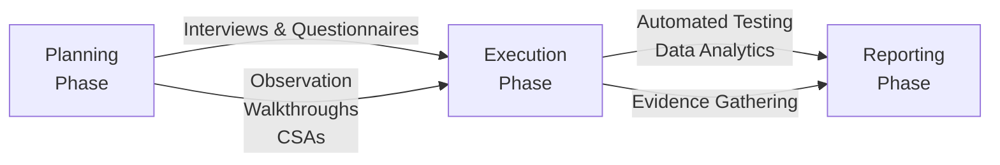

## 4.1 IT Audit Objectives and Methodologies

Information Technology (IT) audits play a crucial role in evaluating the efficiency and security of an organization’s technological environment. With the growing reliance on multimedia systems, e-commerce platforms, cloud deployments, and complex ERP solutions, a well-defined audit process is essential for ensuring the integrity, availability, and confidentiality of data. Moreover, IT audits help organizations meet regulatory requirements, enhance operational performance, and align with corporate governance and risk management frameworks. This section provides a comprehensive overview of the core objectives driving IT audits, explores standard methodologies used in different engagements, and examines the phases of an IT audit—planning, execution, and reporting—through a risk-based lens.

In prior chapters, particularly Chapter 2 (Core IT and IS Terminology) and Chapter 3 (Governance, Frameworks, and Regulatory Environment), we discussed how technology underpins modern business operations and how risk management frameworks (like COSO and COBIT) guide IT controls. Building upon those concepts, this chapter’s focus on IT audit objectives and methodologies underscores how CPAs must balance strategic and compliance imperatives to deliver robust audit opinions and recommendations.

---------------------------------------------------------------------

### Objectives of IT Audits

While the specific scope of an IT audit may vary depending on the organization’s industry, regulatory environment, and business needs, the overarching objectives typically include:

• Accuracy and Completeness of Information: Verifying that data inputs, processing, and outputs are reliable, consistent, and meet established standards for accuracy.  
• Confidentiality and Privacy: Ensuring that access controls, encryption technologies, and other security measures adequately protect sensitive data from unauthorized disclosure.  
• Availability and Continuity: Determining whether networks, servers, and applications remain accessible to authorized users and whether the organization has adequate disaster recovery and business continuity measures.  
• Integrity of Controls and Systems: Evaluating the design and effectiveness of IT General Controls (ITGCs) and application controls to support trustworthy financial reporting and operational processes.  
• Compliance and Regulatory Requirements: Confirming the organization’s adherence to applicable laws, regulations, governance frameworks, and contractual obligations.  
• Efficiency and Performance Improvement: Identifying opportunities to optimize system performance, reduce operating costs, and streamline business processes.

These objectives guide the development of effective risk assessment exercises to determine which areas represent the highest threat (or opportunity) for the organization. In turn, these high-risk areas typically receive increased scrutiny and resource allocation during the planning and fieldwork phases.

---------------------------------------------------------------------

### Phases of an IT Audit

Most IT audits can be segmented into three broad phases:  
1. Planning  
2. Execution  
3. Reporting  

Though these phases often overlap or iterate in practice—particularly in agile organizations—understanding their distinctions is essential for standardizing the approach.

#### Planning

The planning phase is fundamental to a successful IT audit. During planning, the auditor:

• Defines Scope and Objectives: Outlines what systems, processes, and controls fall under the audit’s purview, consistent with organizational or regulatory priorities.  
• Conducts a Preliminary Risk Assessment: Identifies areas of higher inherent risk (e.g., financial transaction systems, online sales processes, or mission-critical cloud platforms). Considers prior findings, changes in the environment, and emerging threats.  
• Considers Materiality: Determines how potential errors or control weaknesses could affect financial statements or critical operations.  
• Establishes an Audit Program: Creates a structured plan (or audit program) specifying the objectives, methodologies, timeline, and resource requirements.  
• Coordinates with Stakeholders: Involves IT personnel, management, and other business owners to gain thorough insights and streamline information requests.

A strong planning phase sets the tone for the rest of the engagement by clarifying roles, responsibilities, and lines of communication.

#### Execution

Once the plan is finalized, the audit team moves into the execution (or fieldwork) stage:

• Evidence Gathering: Auditors perform tests of controls, evaluate system configurations, conduct personnel interviews, and analyze transaction logs.  
• Sampling and Testing: Uses risk-based sampling methodologies to gather sufficient audit evidence. This may include tests of design (Are controls well-designed to address the stated risk?) and tests of effectiveness (Do the controls operate consistently over time?).  
• Use of Data Analytics: Increasingly, auditors employ data analytics to detect anomalies, monitor potential fraud, and assess large data sets efficiently.  
• Continuous Communication: The audit team usually holds regular check-ins with IT and business stakeholders to address unexpected findings and keep the engagement on track.  
• Interim Documentation: Workpapers, including test results and supporting documentation, are compiled systematically to support final conclusions and the audit report.

Given the complexity of modern environments, IT auditors may also rely on specialized tools—like network vulnerability scanners, configuration compliance checkers, or continuous monitoring dashboards—to broaden coverage in a time-efficient manner.

#### Reporting

The final phase culminates in delivering summarized findings and recommendations:

• Compilation of Findings: Organizes issues or control gaps identified during execution. Each finding typically includes a description, root cause, potential impact, and recommendation.  
• Evaluation of Severity: Classifies findings (e.g., high, medium, low) based on the magnitude of risk.  
• Management Response: Provides management the opportunity to formally respond, outline corrective actions, and propose remediation deadlines.  
• Audit Conclusion and Opinion: Formally states whether IT controls are adequate (unqualified or unmodified opinion) or if significant weaknesses might affect reliable financial reporting or compliance obligations.  
• Improvement Roadmap: Many audit reports also offer an improvement roadmap or set of recommended best practices, helping the organization strengthen controls and align with industry frameworks like COBIT or ITIL.

The audit report may take various forms, ranging from an internal management memo to a formalized opinion letter, depending on the organization’s objectives, stakeholder requirements, and relevant frameworks.

---------------------------------------------------------------------

### Risk-Based Audit Methodologies

A cornerstone of modern auditing, the risk-based approach allows auditors to allocate resources proportionally to where risks are greatest. This approach involves:

• Identifying High-Risk Areas: Key financial systems, customer data repositories, e-commerce platforms, and other sensitive functions often rank high on the risk radar.  
• Assessing Inherent Risk vs. Control Risk: Inherent risk pertains to the susceptibility of systems or processes to inaccuracies or fraud before considering controls. Control risk relates to the likelihood that existing controls fail to detect or prevent errors.  
• Determining Residual Risk: After considering control design and effectiveness, residual risk represents any remaining exposure that might require compensating controls, insurance, or further attention.  
• Tailoring Audit Procedures: The nature, timing, and extent of testing are adjusted based on a system’s residual risk level—one with higher residual risk receives more extensive coverage.

Below is a simplified Mermaid diagram demonstrating the steps in a risk-based audit cycle:

> In this diagram, the auditor starts by pinpointing high-risk areas (A), then evaluates established controls (B) to see if they adequately reduce risk. Next, the team assesses the remaining (residual) risk (C), decides on the level and extent of testing (D), conducts the appropriate tests (E), and finally reports the findings (F).

#### Benefits of a Risk-Based Approach

• Focuses Time and Resources: Directs audit efforts toward the most significant threats, ensuring efficient use of limited resources.  
• Enhances Assurance: Provides a higher degree of confidence that critical issues are identified, reducing the likelihood of material misstatements or security breaches.  
• Dynamically Adapts to Changing Environments: Risk assessments can be updated as new threats and technologies emerge, ensuring that audits remain relevant and forward-looking.  
• Improves Management Alignment: Aligns the audit’s scope with management’s priorities and the organization’s strategic objectives.

---------------------------------------------------------------------

### Tools, Techniques, and IT Audit Methodologies

IT audits often combine traditional assurance techniques with technology-driven, innovative approaches. Some common tools and techniques include:

• **Interviews and Questionnaires**: Gain qualitative insights into processes, assessing staff awareness of policies and procedures.  
• **Automated Testing**: Use specialized software to scan system settings, evaluate code changes, or analyze network traffic.  
• **Data Analytics**: Leverage large data sets to identify patterns, anomalies, or irregularities that might indicate control weaknesses or fraud.  
• **Observation and Walkthroughs**: Follow transaction flows from data input through the system to validate whether processes align with documentation.  
• **Control Self-Assessments (CSAs)**: Encourage process owners to evaluate their own controls, fostering a culture of accountability and early detection of issues.

An effective methodology blends these techniques in a logical, risk-based manner, ensuring the auditor gathers sufficient and appropriate evidence to support conclusions.

Below is a conceptual Mermaid diagram illustrating how various IT audit methodologies might combine with phases of the audit:

> In this diagram, the IT audit methodologies (interviews, automated testing, data analytics, observations, CSAs) are presented as tools that feed into each phase of the audit from planning to execution to reporting. 

---------------------------------------------------------------------

### Practical Examples and Real-World Scenarios

1. **Migrating to the Cloud**  
   An organization transitioning from on-premise servers to a cloud computing platform inherently faces new risks related to data security, encryption mechanisms, and vendor lock-in. A risk-based audit would emphasize reviewing the security configurations of the cloud environment, vendor SLAs, and data migration protocols. During planning, the auditor might discover that the organization relies heavily on mission-critical applications hosted by a third party, triggering enhanced focus on third-party risk management controls during execution.  

2. **Implementing an ERP System**  
   A multinational company implementing an ERP system to consolidate financial reporting may face challenges related to user access control, data cleansing, and integration with legacy modules. The IT auditor’s objective is to ensure that the new system’s workflows do not introduce material misstatements in financial reporting. Testing would include validating role-based access, reviewing the mapping of old data to the new system, and ensuring that posting logic in the general ledger aligns with established accounting rules.

3. **Merger or Acquisition**  
   When two organizations merge, they integrate systems, policies, and data repositories. The synergy may create complexities in standardizing controls and ensuring consistent security across environments. A risk-based IT audit approach would focus on potential vulnerabilities, such as misaligned encryption standards, conflicting data policies, or duplication of user accounts that increase the risk of unauthorized access.  

In each scenario, planning identifies unique risks, the audit team tailors its testing strategy accordingly, and the final report provides actionable insights, enabling management to remediate weaknesses.

---------------------------------------------------------------------

### Common Pitfalls and Challenges

• **Insufficient Scoping**: Overlooking critical systems or underestimating the breadth of interconnected applications can cause auditors to miss significant risks.  
• **Poor Communication**: Failure to engage key stakeholders early can lead to delays, insufficient information, and reluctance from business owners to embrace recommended changes.  
• **Overreliance on Manual Processes**: Manual testing can be time-consuming and prone to error in large, complex environments. Automated tools often enhance accuracy and efficiency.  
• **Failure to Update Risk Assessments**: IT landscapes evolve rapidly. Audits that rely on outdated assumptions risk missing emerging threats such as new cyberattack vectors or compliance mandates.  
• **Misalignment of Technology Tools**: Employing tools not suited for the organization’s technology stack can lead to irrelevant findings or incomplete coverage.  

To avoid these pitfalls, IT auditors should focus on continuous engagement with the organization, keep risk assessments current, perform adequate resource planning, and remain attuned to evolving regulatory and technological developments.

---------------------------------------------------------------------

### Best Practices: Enhancing IT Audit Effectiveness

• **Collaborate with Other Assurance Functions**: IT security teams, compliance officers, and Internal Audit can share insights that enrich the planning and design of tests.  
• **Leverage Data Analytics Early**: Integrating data analytics into planning fosters a deeper understanding of system transactions and identifies the most relevant areas for testing.  
• **Invest in Continuous Monitoring**: Post-audit, continuous monitoring tools can help detect anomalies earlier and maintain control effectiveness year-round.  
• **Stay Current with Frameworks and Regulations**: Familiarity with COBIT, ISO standards, PCI DSS, and other specialized regulations ensures that audits remain compliant and relevant.  
• **Maintain Independence and Objectivity**: Ensure the audit team (or external advisors) remains free of conflicts of interest that could bias findings or recommendations.

---------------------------------------------------------------------

### Conclusion

IT audit objectives and methodologies revolve around ensuring that technology supports business goals in a secure, reliable, and compliant manner. By breaking the audit down into the phases of planning, execution, and reporting, auditors follow a disciplined, repeatable structure that aligns with professional standards. The risk-based approach remains a sought-after methodology, enabling auditors to focus on high-impact areas and deliver recommendations that drive both security and efficiency improvements.

Skillful application of these principles requires sound judgment, technical expertise, and clear communication. As technology evolves—from cloud computing to IoT devices and quantum cryptography—CPAs combining financial acumen with IT audit proficiency are best positioned to lead organizations through the complexities of modern, data-driven environments.

---------------------------------------------------------------------

## Check Your Knowledge: IT Audit Objectives and Methodologies



### Which phase of the IT audit process sets its tone by defining the scope, conducting initial risk assessments, and coordinating with stakeholders?

- [x] Planning
- [ ] Execution
- [ ] Reporting
- [ ] Continuous Monitoring

> **Explanation:** The planning phase lays the groundwork by establishing the audit’s scope, identifying high-risk areas, and setting timelines. Without a properly defined scope, testing and reporting are at risk of missing critical findings.

### In a risk-based IT audit, which risk factor refers to the likelihood that existing controls may fail to detect or correct errors?

- [ ] Inherent Risk
- [x] Control Risk
- [ ] Detection Risk
- [ ] Residual Risk

> **Explanation:** In a risk-based approach, control risk addresses the probability that established controls will not detect or prevent errors or misstatements.

### What is one key advantage of adopting a risk-based audit methodology in IT engagements?

- [x] It allows auditors to focus efforts on the most significant threats.
- [ ] It relies solely on manual controls testing.
- [ ] It disregards lower-level risks.
- [ ] It only applies to external audits, not internal audits.

> **Explanation:** A major benefit is that it optimizes resource allocation, ensuring that the most critical and high-risk areas receive the most thorough evaluation.

### Which of these audit activities is primarily performed during the execution (fieldwork) phase?

- [ ] Drafting the final audit report
- [ ] Setting the audit objectives
- [x] Gathering and analyzing evidence
- [ ] Finalizing the scope statement

> **Explanation:** During the execution phase, the auditor gathers evidence and performs tests to assess control design and effectiveness.

### Which of the following is a common pitfall when conducting IT audits?

- [x] Relying on outdated risk assessments
- [ ] Extensive testing of high-risk areas
- [x] Including feedback from key business owners
- [ ] Aligning the audit approach with relevant frameworks

> **Explanation:** Failing to update the risk assessment as the environment changes can result in missing emerging threats. It’s critical to keep risk assessments current throughout the audit process.

### When determining the severity of findings to include in the audit report, which classification typically indicates the highest level of risk?

- [x] High
- [ ] Moderate
- [ ] Low
- [ ] Advisory

> **Explanation:** A high classification suggests that immediate remediation is required to mitigate a significant threat or vulnerability.

### To confidently conclude whether IT controls are functioning effectively under a risk-based approach, auditors must ensure:

- [x] They apply sufficient and appropriate testing procedures.
- [ ] They rely solely on verbal assurances from the IT department.
- [x] They avoid using data analytics tools.
- [ ] They exclude regulatory compliance requirements from the audit.

> **Explanation:** Adequate testing procedures, based on the identified risks, are essential to formulate a reliable opinion on control effectiveness.

### During an IT audit for a newly implemented ERP system, the auditor’s primary focus typically includes:

- [x] Reviewing user access controls and role-based permissions
- [ ] Implementing system upgrades
- [ ] Establishing next year’s IT budget
- [ ] Designing the marketing strategy for the ERP system

> **Explanation:** Proper user access control is crucial for ensuring the integrity of transaction processing and data security in ERP systems.

### Which phase in the audit cycle most directly incorporates recommendations for future improvements or potential system enhancements?

- [ ] Planning
- [ ] Execution
- [x] Reporting
- [ ] Monitoring

> **Explanation:** In the reporting phase, findings are consolidated, each issue is described, and recommendations are offered to address underlying weaknesses.

### True or False: In a thorough IT audit, the organization’s business objectives play no significant role when defining the audit’s scope.

- [ ] True
- [x] False

> **Explanation:** Business objectives are central to defining which critical processes, systems, and data entries should be covered in the audit. Aligning IT audit scope with business objectives ensures relevance and tangible outcomes.



---------------------------------------------------------------------

## For Additional Practice and Deeper Preparation

### [Information Systems and Controls (ISC)](https://www.udemy.com/course/isc-cpa-mock-exams/?referralCode=E1217303222935C5E464)  

**Information Systems and Controls (ISC) CPA Mocks:** 6 Full (1,500 Qs), Harder Than Real! In-Depth & Clear. Crush With Confidence!

- Tackle full-length mock exams designed to mirror real ISC questions.  
- Refine your exam-day strategies with detailed, step-by-step solutions for every scenario.  
- Explore in-depth rationales that reinforce higher-level concepts, giving you an edge on test day.  
- Boost confidence and minimize anxiety by mastering every corner of the ISC blueprint.  
- Perfect for those seeking exceptionally hard mocks and real-world readiness.  

_Disclaimer: This course is not endorsed by or affiliated with the AICPA, NASBA, or any official CPA Examination authority. All content is for educational and preparatory purposes only._
