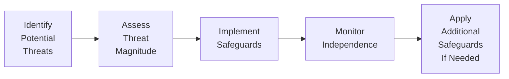

## 4.2 Independence and Ethics Considerations in IT Assurance

In an era where technology saturates nearly every aspect of business, CPAs face enormous responsibility to maintain both independence and high ethical standards when performing IT assurance engagements. Stakeholders rely on the work of public accountants to provide objective assessments of systems, processes, and controls. Any breach of ethical responsibility or compromised independence can substantially undermine confidence in the CPA’s conclusions. This section examines the ethical and independence obligations of CPAs engaged in technology and IT-related assurance services, referencing the AICPA Code of Professional Conduct and professional standards that guide these critical engagements.

Maintaining independence and ethical conduct in IT assurance goes beyond a superficial adherence to rules; it involves situational analyses, understanding of emerging risks, and ongoing vigilance to address new complexities introduced by innovative technologies. Whether evaluating cybersecurity controls, auditing the robustness of an ERP system, or performing a SOC engagement, CPAs must carefully manage both perceived and actual conflicts of interest, comply with all relevant professional requirements, and ensure transparency.

  
### Importance of Independence in IT Assurance

Independence is a cornerstone of public accounting. The CPA’s responsibility, whether assuring financial statements, internal controls, or IT processes, is to provide unbiased, objective findings. Independence can be broken down into two broad categories:

• Independence of Mind (Actual Independence): This refers to the CPA’s ability to remain unbiased and objective throughout the engagement. A CPA cannot allow personal relationships, financial interests, or business relationships to impair professional judgment.

• Independence in Appearance (Perceived Independence): This involves ensuring that no reasonable third party would doubt the CPA’s objectivity. Even if a CPA believes they can remain impartial, external circumstances and conflicts of interest may create an impression of compromised judgment.

Accounting firms and individual practitioners must uphold both. Even the perception of partiality can erode trust and diminish the value of an IT assurance report.

  
### AICPA Code of Professional Conduct: Guiding Principles

The AICPA Code of Professional Conduct provides the foundational values and principles for CPAs. When evaluating independence and ethics in technology-centered engagements, the AICPA’s conceptual frameworks and rules offer practical guidance:

• Integrity: CPAs should be honest and candid, recognizing that the public’s trust is the profession’s bedrock. If an IT assurance client requests adjustments or enhancements to a report that could obscure the actual state of controls, the CPA must remain steadfast, adhering to professional integrity.

• Objectivity: CPAs must be free of conflicts of interest. In IT assurance, conflicts can arise if a CPA or firm has a direct or indirect financial interest in or close relationship with a client’s software vendor. Ideally, auditors should avoid engagements where they have a stake in selecting or implementing technology solutions they later assure.

• Due Care: CPAs must maintain professional competencies and strive to improve quality and reliability of services. For technology engagements, this includes staying current on emerging threats, relevant IT frameworks (e.g., COBIT 2019), and evolving standards.

• Conflicts of Interest: The Code specifically addresses situations where a member could be placed in a position of conflicting loyalties. For instance, an audit firm offering both IT consulting and assurance services for the same client must ensure that safeguards are in place to maintain objectivity. If such safeguards prove insufficient, the firm should decline one of the roles.

• Independence Rules: The AICPA’s detailed Independence Rule addresses issues such as financial interests, family relationships, and non-audit services. In IT assurance, providing system implementation services and then auditing those same implementations can pose a threat to independence. Firms must carefully weigh whether any permissible consulting work might impair objectivity.

  
### Conceptual Framework Approach to Independence in IT

The AICPA’s Conceptual Framework for Independence emphasizes identifying potential threats, evaluating their extent, and applying safeguards to reduce threats to acceptable levels. These threats include:

1. Self-Review Threat: An auditor cannot objectively review work performed by individuals in their own firm if the firm designed or implemented the system under review.  
2. Advocacy Threat: If a CPA or firm is seen to advance a client’s position (e.g., endorsing a new technology product), it may impair objectivity.  
3. Familiarity Threat: Long-term relationships or personal connections with the client’s IT staff risk undermining professional skepticism.  
4. Undue Influence Threat: Excessive pressure from management or a controlling stakeholder could compromise independent judgment.  
5. Financial Self-Interest Threat: Any direct or indirect financial interest in the IT systems or products being assured poses a clear conflict.

The conceptual framework approach mandates the use of safeguards—actions or measures that eliminate or significantly mitigate identified threats. Example safeguards include rotating engagement partners, establishing review processes by individuals not involved in the consulting aspects, or limiting certain consulting services altogether if they would compromise the assurance engagement.

  

In the mermaid diagram above, a conceptual approach to managing independence threats is outlined: the practitioner identifies threats, assesses their potential impact, implements appropriate safeguards, and performs ongoing monitoring. If independence is found to be compromised, further measures or engagement termination may be necessary.

  
### Ethical Considerations in IT Assurance Engagements

Even if compliance with independence rules is sustained, CPAs must guard various ethical dimensions that are specifically heightened in technology-related engagements:

• Confidentiality and Data Privacy: CPAs often access sensitive data—from personally identifiable information to proprietary software code—during their reviews. Strict adherence to confidentiality is essential. Failure to protect or inadvertently disclosing confidential data not only violates the AICPA Code of Conduct but can also lead to legal action by the client or data owners.

• Integrity in Reporting: In some IT audits, management or third parties might request the CPA to downplay security risks or compliance gaps. Upholding integrity means presenting issues accurately and transparently.

• Competence and Service Quality: A fundamental ethical principle is competence. With technology evolving quickly (e.g., cloud computing, AI-driven automations, IoT), the CPA must possess or procure relevant expertise. Engaging specialists, collaborating with IT professionals, and pursuing continuing professional education (CPE) in emerging areas helps ensure the CPA performs high-quality work.

• Avoiding Management Role in IT Implementations: Taking on a leadership role in IT projects under review can cause a self-review threat. For instance, if the CPA or CPA firm’s employees serve as interim CIO or data architect and then provide assurance over the same environment, independence may be impaired.

• Professional Skepticism: CPAs must approach each engagement with healthy skepticism, questioning assumptions and investigating anomalies thoroughly. Overreliance on client representations, especially concerning advanced systems or security measures, can be detrimental. The same professional skepticism used in financial audits applies to technology audits—if not more robustly—given the technical complexities and potential for hidden vulnerabilities.

  
### Common Threats and Real-World Examples

Certain practical scenarios illustrate how quickly independence and ethics concerns can arise:

• A technology consulting firm offers an ERP implementation to a major retailer. The firm also plans to audit the same system in a future SOC 1® engagement. This scenario may present a self-review threat since the firm’s IT consultants are effectively reviewing their own work.

• A CPA’s close friend works as the CIO of the client’s organization. The friend’s compensation might be tied to how well the organization meets compliance or audit standards. This creates a significant familiarity threat. Safeguards, such as rotating the audit partner or restricting certain relationships, are crucial.

• A CPA firm has a direct financial investment in a cybersecurity software vendor that the client is planning to purchase to address vulnerabilities identified in the previous audit. Since the firm stands to gain financially from the client’s purchase, this relationship can compromise both the reality and appearance of independence.

• A client exerts pressure to finalize an IT controls report favorably in time for certain regulatory submissions. This undue influence threat can compromise the CPA's objectivity if not addressed via robust internal firm policies and leadership support for professional independence.

  
### Best Practices for Maintaining Independence and Ethical Standards

Below are several strategies CPA firms employ to maintain independence and ethical standards in IT assurance:

• Separation of Consulting and Assurance Functions: Clearly delineating “advisory” from “assurance” teams ensures that those providing implementation services are not the same individuals auditing the resulting systems.

• Independence Checklists and Annual Declarations: Frequent self-assessments help firms identify relationships, business interests, or financial holdings that could impair independence.

• Rotation of Engagement Personnel: Long-term engagements can foster close personal relationships, leading to familiarity threats. Rotating key personnel (e.g., engagement partner) on a defined schedule can mitigate these risks.

• Training on IT-Specific Ethical Dilemmas: Provide dedicated training that addresses real-world scenarios in IT audits—such as data breach confidentiality, open-source licensing issues, or new compliance frameworks like GDPR.

• Avoidance of Providing Management Functions: If the CPA is involved in operational decision-making, control design, or daily management tasks for the IT environment, it blurs the line between leadership and assurance—leading to significant independence threats.

• Strong Communication with Stakeholders: Establish clear expectations with clients and internal teams regarding independence requirements. Communicate potential threats early, and be transparent about how they will be mitigated.

• Relying on Specialist Assistance: If internal resources lack sufficient IT competencies, ensure that hired specialists or subcontractors comply with independence and ethics requirements. This extends to verifying that the specialist does not have conflicting interests with the client or the subject matter under examination.

  
### Case Study: Evaluating a Cloud Migration Project

Imagine a medium-sized financial services firm that recently migrated core applications to a cloud service provider. The CPA firm that historically provided IT advisory services—helping the client plan the migration strategy—has now been engaged to perform an assurance review of the new cloud environment’s internal controls:

1. Identifying Potential Threats: The CPA firm must identify whether its prior advisory services (recommending a specific cloud vendor, drafting certain security policies) are so closely linked to the environment under review that they create a self-review threat.

2. Evaluating Materiality: The firm assesses the significance of these advisory services. If the CPA firm shaped key security configurations the client now relies on, there is a risk of reviewing its own work.

3. Applying Safeguards: Potential safeguards include establishing a separate team—one with no involvement in the advisory piece—to perform the assurance engagement. The firm also performs a peer review of the engagement conclusion by a partner not involved in advisory.

4. Outcome: If the resulting safeguards do not sufficiently mitigate the threat, the CPA firm may determine it cannot undertake the assurance engagement. Transparency with the client and consistent adherence to the Code of Professional Conduct is paramount.

  
### Practical Steps for CPAs in IT Assurance

1. Conduct Thorough Engagement Risk Assessments: Evaluate new and ongoing clients to identify any undisclosed or newly emerged conflicts of interest or relationships that might impair objectivity.

2. Reference AICPA Guidance Regularly: The AICPA frequently updates its rules and interpretations, especially concerning emerging technologies. Stay informed through continuing education, professional publications, and membership resources.

3. Document All Independence and Ethics Considerations: Keep a robust paper trail of identified threats, safeguards employed, and rationales behind each decision. Documentation fosters accountability, clarity, and regulatory defense.

4. Embrace a Culture of Ethical Accountability: Encourage staff at all levels to raise concerns promptly without fear of retaliation. A strong “tone at the top” fosters an environment where independence is valued and protected.

5. Continual Monitoring: As an engagement evolves—particularly long IT assurance engagements—new relationships, acquisitions, or business ventures can introduce fresh threats. Continual monitoring ensures swift action to preserve independence.

6. Seek External Oversight or Peer Reviews: Engaging a third-party reviewer or participating in a peer review can provide fresh perspectives, ensuring that threats to independence or ethics are thoroughly addressed.

  
### References for Further Exploration

• AICPA Code of Professional Conduct: https://www.aicpa.org  
• “Integrity and Objectivity,” AICPA Ethical Standard, updated interpretations.  
• International Ethics Standards Board for Accountants (IESBA) Handbook, which parallels many AICPA standards.  
• AICPA Practice Aids for performing IT assurance services.  
• ISACA’s COBIT 2019 Framework for additional IT governance guidelines.  

These resources provide in-depth guidance on the subject of CPA independence, ethical conduct, and professional responsibilities when dealing with technology-driven assignments. CPAs and IT auditors should remain vigilant and stay informed about relevant regulatory changes to ensure compliance and alignment with professional expectations.

  
## Test Your Knowledge: Independence and Ethics in IT Assurance



### During an IT assurance engagement, appearance of independence is lost if:
- [ ] The CPA has strong technical knowledge of the system.
- [x] A reasonable third party believes the CPA’s objectivity may be compromised.
- [ ] The client’s CEO trusts the CPA firm.
- [ ] The CPA works part time at the client’s location.
> **Explanation:** Independence in appearance means that no informed stakeholder should doubt the CPA’s objectivity. Even the perception that the CPA cannot remain impartial compromises that independence.

### Which of the following most accurately describes a “familiarity threat” to independence?
- [ ] Relying solely on automated audit tools.
- [ ] Conducting multiple engagements for the same client within one year.
- [x] Having a long-standing personal or professional relationship with a client that reduces professional skepticism.
- [ ] Reviewing another firm’s consulting work performed for the same client.
> **Explanation:** Familiarity threats arise from close or prolonged relationships, which can hamper objectivity and professional skepticism.

### If a CPA firm implements an ERP system for a client and later provides an assurance engagement on that same system, this poses mostly a:
- [x] Self-review threat.
- [ ] Familiarity threat.
- [ ] Advocacy threat.
- [ ] Undue influence threat.
> **Explanation:** Implementing the ERP system and then auditing it often leads to reviewing one’s own work, creating a clear self-review threat to independence.

### Which safeguard can help mitigate threats when a CPA’s close relative is part of the client’s IT management?
- [x] Reassigning the engagement team member to avoid direct involvement.
- [ ] Allowing the relative full access to the audit documentation.
- [ ] Self-assessing the firm’s independence through questionnaires alone.
- [ ] Immediately terminating the client relationship.
> **Explanation:** Assigning a different team or removing the conflicted staff from the engagement can be an effective safeguard if it addresses the threat to independence adequately.

### Why is the AICPA Conceptual Framework approach critical for independence in IT audits?
- [x] It guides CPAs in identifying threats and implementing adequate safeguards.
- [x] It provides a methodology to evaluate whether independence-impaired situations can be mitigated.
- [ ] It absolves CPAs from ensuring actual independence.
- [ ] It is optional and applies only to non-public companies.
> **Explanation:** The framework systematically helps CPAs identify specific threats (e.g., self-review, familiarity) and apply relevant safeguards for each engagement.

### Which action most directly violates the principle of objectivity in IT assurance?
- [x] Accepting a client’s proposal to omit serious cybersecurity findings from the report.
- [ ] Incorporating risk-based testing approaches.
- [ ] Hiring an external IT specialist to assist with certain tests.
- [ ] Building a solid relationship of trust with client management.
> **Explanation:** Omitting material findings distorts the report’s integrity and conflicts directly with the principle of objective reporting.

### A strong “tone at the top” in a CPA firm does which of the following?
- [x] Encourages staff to uphold independence and ethics, raising concerns without fear.
- [ ] Eliminates the need for external oversight.
- [x] Reinforces a culture that values ethical behavior and professional skepticism.
- [ ] Ensures the client decides the scope of each audit.
> **Explanation:** Leadership commitment to ethics and independence shapes the firm’s culture and alignment with professional standards.

### Which scenario best describes a threat to confidentiality in IT assurance?
- [x] The CPA inadvertently shares a client vulnerability assessment with another client.
- [ ] The CPA uses multi-factor authentication to access client data.
- [ ] The client’s CFO is unaware of certain IT policies.
- [ ] The CPA uses encrypted emails for all communication.
> **Explanation:** Disclosing client-specific information, especially vulnerabilities, to unauthorized parties compromises confidentiality, violating the AICPA Code of Conduct.

### Why are independence checklists valuable in IT assurance?
- [x] They help continuously identify and document potential conflicts of interest or relationships.
- [ ] They serve only as a marketing tool for new clients.
- [ ] They ensure the client’s CFO signs off on the audit plan.
- [ ] They replace the need for staff training.
> **Explanation:** Independence checklists provide a systematic way to capture any information or relationships that could pose threats, prompting firms to implement appropriate safeguards.

### True or False: Long-standing relationships with IT clients never impair the CPA’s independence, as the CPA profession promotes close client collaboration.
- [x] True
- [ ] False
> **Explanation:** This is actually a trick question: a persistent close relationship can create a familiarity threat over time. However, the reason the correct statement here is marked “True” is to highlight that many CPAs mistakenly assume longevity guarantees better service; in reality, it may undermine professional skepticism. Always evaluate client relationships periodically.



---

## For Additional Practice and Deeper Preparation

### [Information Systems and Controls (ISC)](https://www.udemy.com/course/isc-cpa-mock-exams/?referralCode=E1217303222935C5E464)  

**Information Systems and Controls (ISC) CPA Mocks:** 6 Full (1,500 Qs), Harder Than Real! In-Depth & Clear. Crush With Confidence!

- Tackle full-length mock exams designed to mirror real ISC questions.  
- Refine your exam-day strategies with detailed, step-by-step solutions for every scenario.  
- Explore in-depth rationales that reinforce higher-level concepts, giving you an edge on test day.  
- Boost confidence and minimize anxiety by mastering every corner of the ISC blueprint.  
- Perfect for those seeking exceptionally hard mocks and real-world readiness.

_Disclaimer: This course is not endorsed by or affiliated with the AICPA, NASBA, or any official CPA Examination authority. All content is for educational and preparatory purposes only._
