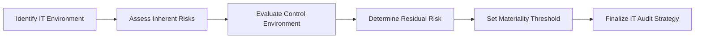

## 4.3 Risk Assessment and Materiality in IT‑Related Engagements

Information Technology (IT) systems play a critical role in modern organizations, affecting everything from daily transaction processing to enterprise-wide decision-making. As outlined in Chapter 4’s earlier sections on IT audit and assurance, practitioners are increasingly called upon to identify and evaluate risks inherent in technology-driven environments. This section delves deeply into the intertwined concepts of risk assessment and materiality—two pillars that help determine the nature, timing, and extent of audit procedures in IT‑related engagements. We will explore how to set materiality thresholds that reflect the unique aspects of IT risks and how seemingly minor technology issues can carry substantial implications for data integrity.

-----------------------------------------------------------------------------
  
Understanding Risk and Materiality in IT Context
-----------------------------------------------------------------------------

Before diving into the specifics of IT risk assessment, it is essential to clarify the general definitions:

• Risk Assessment: The process of identifying, analyzing, and evaluating the likelihood and impact of events (threats or opportunities) that could affect an organization’s ability to achieve its objectives.  
• Materiality: The magnitude of an omission or misstatement that could influence the economic decisions of financial statement users. In traditional financial audits, materiality often revolves around figures such as revenue, net income, or total assets.  

In IT engagements, the notion of materiality expands beyond conventional financial metrics. Even a “small” technology configuration error can lead to large-scale ramifications, such as unauthorized access to sensitive information or an unnoticed data integrity breach that skews financial statements.

Organizations often rely on third-party frameworks (e.g., COSO, COBIT, NIST) to systematically assess IT risks. For CPAs, these frameworks align with professional standards to ensure that audits and assurance services address both qualitative and quantitative aspects of potential misstatements arising from flawed or insecure IT controls.

-----------------------------------------------------------------------------
  
Importance of Risk Assessment in IT‑Related Engagements
-----------------------------------------------------------------------------

While risk assessment is fundamental to any audit engagement, IT environments demand special attention because:

1. Complexity of Systems: Today’s IT infrastructures, which often include virtualized servers, cloud computing services, large databases, and complex ERP (Enterprise Resource Planning) systems, can introduce higher risk points that are challenging to monitor.  
2. Rapid Technological Shifts: Frequent application updates, patch cycles, and DevOps-driven changes can drastically alter an organization’s risk profile from one week to the next.  
3. Interconnectivity and Third Parties: Risk is no longer isolated to an organization’s on-premises systems—third-party vendors, APIs, and cloud service providers can magnify or introduce new threats such as data leaks, service outages, or malicious infiltration.  
4. Regulatory Pressures: Legal and regulatory requirements such as GDPR and HIPAA impose stringent data handling requirements. Failure to comply can result in sizable fines, reputational loss, and operational disruption.

Given these factors, CPAs and IT auditors must place a heightened emphasis on identifying and prioritizing risks, ensuring that controls are adequately designed and functioning to address relevant threats.

-----------------------------------------------------------------------------
  
Aligning IT Risk Assessment with Audit Strategy
-----------------------------------------------------------------------------

Effective IT risk assessment typically employs a framework-based, methodical approach:

1. Identify IT Environment  
   • Understand the scope of the IT environment: network architecture (servers, endpoints, firewalls), software systems (ERP modules, data analytics tools), data flows (internal/external data exchanges), and the business processes reliant on these systems.  
   • Recognize key controls and dependencies, especially those impacting financial reporting.

2. Assess Inherent Risks  
   • Evaluate how susceptible the organization’s IT environment is to error or fraud in the absence of controls.  
   • Consider system complexity, transaction volumes, nature of stored data, and potential for process disruptions.

3. Evaluate the Control Environment  
   • Map to relevant frameworks (e.g., COSO Internal Control–Integrated Framework, COBIT 2019).  
   • Assess whether the entity’s culture, policies, and governance structures sufficiently promote accountability, train staff properly, and support secure IT operations.

4. Determine Residual Risk  
   • Combine inherent risks with the sometimes-mitigating effects of existing controls.  
   • Identify areas where threat levels remain high, despite controls, and set a focus for further testing.

5. Link Risk to Materiality  
   • Translate identified risks into potential financial statement misstatements or data security breaches.  
   • Decide on the overall materiality threshold for the engagement, often guided by financial benchmarks, while incorporating the possibility of significant impacts from “small” IT vulnerabilities.

-----------------------------------------------------------------------------
  
Defining and Establishing IT Materiality
-----------------------------------------------------------------------------

In a traditional audit context, materiality is determined by referencing benchmarks like total assets or net income. However, IT-related engagements often require additional dimensions:

• Qualitative Factors: Certain IT risks may not directly skew net income but could affect data integrity, regulatory compliance, or organizational reputation. For instance, a minor interface error in a payment gateway might be immaterial in dollar terms, but significantly impacts compliance with Payment Card Industry Data Security Standard (PCI DSS).  
• Indirect Financial Impacts: An improper user access role could pave the way for undetected adjustments in an ERP system. Though the modifications might initially appear insignificant, they can compound over time.  
• Error Propagation Potential: Small transaction errors in high‑volume environments, such as automated billing, can rapidly multiply, resulting in a material misstatement by year’s end.

Hence, IT materiality determinations must consider not only quantitative thresholds, but also the intangible (qualitative) risks that could undermine stakeholder confidence or facilitate compliance violations.  

-----------------------------------------------------------------------------
  
Mermaid Diagram: IT Risk Assessment Flow
-----------------------------------------------------------------------------

Below is a simple visual representation of how IT risk assessment aligns with materiality considerations:

• A["Identify IT Environment"] identifies and scopes the technology components in play.  
• B["Assess Inherent Risks"] highlights how errors or malicious actions might impact the organization’s financial statements.  
• C["Evaluate Control Environment"] gauges the strength of existing controls.  
• D["Determine Residual Risk"] defines the variance between inherent risk and control strength.  
• E["Set Materiality Threshold"] ensures risk significance is measured with both financial and qualitative metrics in mind.  
• F["Finalize IT Audit Strategy"] aligns testing procedures and resources to the areas that warrant the most scrutiny.

-----------------------------------------------------------------------------
  
Small IT Issues with Large Data Integrity Risks
-----------------------------------------------------------------------------

Below are two real-world case examples illustrating how small IT misconfigurations or oversights can lead to broader, more material impacts.

Case Example 1: Minor Arithmetic Error in Automated Billing  
• Scenario: A company uses an online billing system to invoice thousands of customers monthly. One line of code incorrectly applies a 0.2% discount rather than 0.02%.  
• Impact: Though the miscode appears trivial, the aggregated discount cost the company hundreds of thousands of dollars in lost revenue over several months—leading to a quantitatively material hit to reported revenue.  
• Outcome: Without robust IT controls (such as code reviews and patch testing), this tiny discrepancy in logic persisted, creating a large financial misstatement.

Case Example 2: Supply Chain Management (SCM) System Patch Misconfiguration  
• Scenario: The IT department installs a routine patch to ensure an on-prem SCM system remains compatible with newly added vendor portals. A minor firewall rule is overlooked, preventing automatic updates of inventory levels from a crucial vendor’s system.  
• Impact: This oversight remains undiscovered for weeks. By the time the error is identified, the system displays inaccurate inventory counts, leading to production slowdowns and missed customer orders.  
• Outcome: The resulting lost sales, along with potential restatement of sales revenue, highlight the material financial consequences triggered by a seemingly minor patch misconfiguration.  

In both cases, what might initially appear to be “small IT issues” ultimately contribute to broader, material implications that affect the organization’s financial statements, operational continuity, or compliance posture.

-----------------------------------------------------------------------------
  
Key Considerations for Materiality in IT Engagements
-----------------------------------------------------------------------------

1. Data Volume and Velocity  
Large transaction volumes and rapid data processing can amplify even the smallest misconfigurations. Ensure thorough testing of data flows, especially in areas characterized by high velocity (e.g., real-time financial transactions).

2. Strategic Systems and Processes  
Not all system components carry the same risk weight. Focus on core transactions that directly affect financial statements or strategic decision-making, such as purchasing, revenue recognition, and payroll.

3. Vulnerability to Cyber Threats  
Cybersecurity mishaps can cause operational business interruptions, direct financial losses, and reputational damage. A minor unpatched vulnerability in a web server might allow attackers to compromise critical financial data—creating both a compliance and financial materiality risk.

4. Control Over Change Management  
Frequent application updates, version changes, and system migrations introduce high risk of misconfiguration or unintended consequences. Strong governance over the IT change management process helps mitigate hidden vulnerabilities that can escalate into material weaknesses.

5. Management Override and Fraud  
IT systems can inadvertently facilitate fraud if user access controls are weak. A small oversight in user privilege assignment might allow unauthorized adjustments in accounting records to go unmonitored, resulting in significant fraud risk.

-----------------------------------------------------------------------------
  
Materiality’s Influence on Audit Procedures
-----------------------------------------------------------------------------

Because IT systems can elevate or diminish the significance of transactions, materiality must dynamically guide the engagement plan:

• Sample Sizes and Selection: High‑risk areas often demand larger sample sizes or additional testing layers. For instance, automated data inputs from external systems might be prone to incomplete or inaccurate records, requiring more rigorous testing.  
• Substantive vs. Control Testing: In lower-risk areas, an auditor may opt to rely more on control testing instead of detailed substantive tests. Conversely, if uncertain about the reliability of system-generated reports, a more robust substantive approach may be necessary.  
• Timing of Procedures: Real-time processing systems and weekly patch cycles may influence continuous auditing or more frequent interim reviews, rather than a single year-end test.  
• Specialist Engagement: Particularly intricate IT issues—such as advanced data analytics, blockchain-based transactions, or artificial intelligence (AI) models—may call for the involvement of specialized IT auditors or data scientists.  

-----------------------------------------------------------------------------
  
Practical Guidance
-----------------------------------------------------------------------------

• Leverage Frameworks: Use COSO Internal Control–Integrated Framework and COBIT’s governance principles to structure your evaluation of IT controls.  
• Employ Risk Scoring: Develop a likelihood-versus-impact heat map to illustrate and prioritize high-risk areas.  
• Update Risk Assessments Regularly: As organizations frequently roll out new applications or integrate additional data sources into their processes, risk assessments should be updated to stay ahead of new threats.  
• Communicate Early and Often: Maintain an ongoing dialogue with management, the board, and the IT function about identified risks, control gaps, and potential material misstatements.  
• Document Everything: Keep comprehensive documentation of the rationale behind materiality thresholds, test scoping decisions, and changes to planned procedures when unanticipated risks arise.

-----------------------------------------------------------------------------
  
References for Further Exploration
-----------------------------------------------------------------------------

• AICPA. (2023). Guide to Audit Data Analytics. A detailed resource on leveraging data analysis in financial audits.  
• COSO. (2013). Internal Control–Integrated Framework. A foundational framework for designing and evaluating internal controls.  
• ISACA. (2019). COBIT 2019 Framework: An essential governance guide for aligning IT goals with enterprise strategy.  
• FRC. (2021). ISA (UK) 315. Contains guidance on identifying and assessing the risks of material misstatement.

-----------------------------------------------------------------------------

## Test Your Knowledge of IT Risk Assessment and Materiality



### Which of the following best describes IT risk assessment?
- [ ] A one-time review of potential errors in the financial statements
- [x] A continuous process of identifying, analyzing, and responding to risks in the IT environment
- [ ] A regulatory requirement only for publicly traded entities
- [ ] A focus solely on cybersecurity threats, excluding operational concerns

> **Explanation:** IT risk assessment refers to a continuous, systematic evaluation of risks—financial, operational, and regulatory—specific to technology environments.

### What is the primary reason that a small IT configuration error can lead to a material misstatement?
- [ ] IT errors above $1 million are automatically material
- [x] High volume transactions or compounding errors can amplify a minor discrepancy
- [ ] Most auditors fail to detect such errors
- [ ] System changes are always immaterial

> **Explanation:** Even a fractional error can cascade when repeated across thousands of transactions, making the aggregate effect material.

### Which factor is LEAST relevant when determining IT materiality?
- [ ] Transaction volume
- [ ] Qualitative considerations like reputation
- [x] The personal preferences of the Auditor-in-Charge
- [ ] Potential for data integrity issues to affect reported results

> **Explanation:** While volume, qualitative considerations, and financial data integrity risks are all relevant, personal preferences are not a recognized factor in defining materiality.

### When dealing with frequent system updates and patches, how should CPAs approach risk assessment?
- [x] Perform periodic reassessments to capture newly introduced system vulnerabilities 
- [ ] Assume the same risk profile as the prior year’s assessment
- [ ] Strictly rely on management’s verbal confirmation
- [ ] Increase testing only after issues arise

> **Explanation:** Given constant changes, continuous or periodic reassessment of IT risks helps identify emerging vulnerabilities promptly.

### Why is user access provisioning a critical consideration in IT risk assessments?
- [x] Inappropriate privileges can enable fraud or unauthorized changes in financial data
- [ ] It has no impact on internal or external stakeholder trust
- [x] It can bypass key segregation of duties controls
- [ ] It is never a relevant factor for external audits

> **Explanation:** When user accounts are provisioned incorrectly, it overrides critical controls, heightening fraud and misstatement risks. It also compromises the segregation of duties if a single user can perform multiple conflicting tasks.

### Which statement best reflects the role of qualitative factors in defining IT materiality?
- [x] Qualitative factors can make a relatively small financial misstatement material due to regulatory or reputational risks
- [ ] Only quantitative thresholds matter for materiality
- [ ] Qualitative factors are automatically ignored if the dollar amount is under 1% of net income
- [ ] Qualitative factors apply only if the organization is not publicly traded

> **Explanation:** Even minor financial impacts can become material if they create significant regulatory, reputational, or strategic harm.

### Which of the following best describes the term “residual risk” in IT audits?
- [x] The remaining risk after considering the effectiveness of existing controls
- [ ] The risk that is introduced uniquely by external auditors
- [x] The potential for a small IT misconfiguration to lead to large errors
- [ ] Risk faced by subservice organizations alone

> **Explanation:** Residual risk is the portion of inherent risk that remains after control design and operation are factored in. A small IT misconfiguration can significantly increase residual risk if controls are not effective.

### What is a recommended practice when an IT environment relies heavily on third-party vendors?
- [x] Include subservice organizations in the risk assessment and obtain relevant SOC reports
- [ ] Fully outsource all control responsibilities to the third-party vendor
- [ ] Ignore vendor-related risks if they are not material to net income
- [ ] Test all vendor systems as if they were internal

> **Explanation:** Auditors should consider whether subservice organizations’ controls are included (or carved out) in the scope and review the vendor’s SOC reports or similar attestations.

### How can a “minor” user interface design issue become a material risk?
- [x] It can impair data entry accuracy, compounding over many transactions
- [ ] User interface design has no bearing on financial data integrity
- [ ] Most employees are trained to spot user interface problems
- [ ] Minor design issues only affect aesthetics, not reported balances

> **Explanation:** A subtle user interface flaw can facilitate widespread data entry errors that accumulate to a significant or material misstatement over time.

### Risk assessment in IT-related engagements should be:
- [x] Ongoing, iterative, and documented thoroughly
- [ ] Finalized at the beginning of the audit and not revised
- [ ] Kept confidential from the client’s management
- [ ] Conducted only at the final day of fieldwork

> **Explanation:** Given rapidly evolving IT environments, auditors must be prepared to update and document their risk assessments continuously throughout the audit cycle.



-----------------------------------------------------------------------------

## For Additional Practice and Deeper Preparation

### [Information Systems and Controls (ISC)](https://www.udemy.com/course/isc-cpa-mock-exams/?referralCode=E1217303222935C5E464)

Information Systems and Controls (ISC) CPA Mocks: 6 Full (1,500 Qs), Harder Than Real! In-Depth & Clear. Crush With Confidence!

• Tackle full-length mock exams designed to mirror real ISC questions.  
• Refine your exam-day strategies with detailed, step-by-step solutions for every scenario.  
• Explore in-depth rationales that reinforce higher-level concepts, giving you an edge on test day.  
• Boost confidence and minimize anxiety by mastering every corner of the ISC blueprint.  
• Perfect for those seeking exceptionally hard mocks and real-world readiness.  

_Disclaimer: This course is not endorsed by or affiliated with the AICPA, NASBA, or any official CPA Examination authority. All content is for educational and preparatory purposes only._
