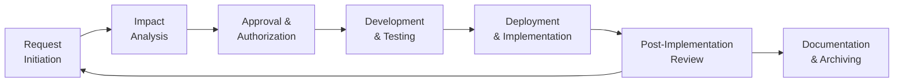

## 10.1 Change Control Concepts: Policies and Procedures

Change control is a cornerstone of effective IT governance and risk management. Within an organization’s technology landscape, even small system modifications can significantly affect system stability, security, and accuracy of financial data. The overarching goal of change control is to ensure that any alteration—be it a minor software update, a patch application, or a major infrastructure replacement—follows a systematic, documented, and appropriately authorized procedure. This process helps management maintain control over risks that could arise from unplanned or unauthorized changes, particularly those impacting financial reporting, systems reliability, and data integrity.

Change control is especially critical for Certified Public Accountants (CPAs), who are increasingly involved in technology assurance and advisory services. As outlined in the AICPA’s Information Systems and Controls (ISC) Blueprint, CPAs and IT auditors must verify that controls are in place to maintain data integrity and meet compliance requirements. Policies and procedures that manage system changes effectively help assure stakeholders—internal or external—that the organization’s control environment is robust and capable of mitigating risk.

Below is a comprehensive discussion on change control concepts, mandatory steps in a formal change management process, and the risks of bypassing critical controls.

---

### Importance of Change Control Policies and Procedures

Clear, well-enforced policy frameworks guide how changes to IT systems are requested, assessed, approved, implemented, and reviewed. Change control policies typically outline:

• Roles and responsibilities for those proposing, testing, approving, and implementing changes.  
• Authorization matrices that designate who can approve what type or scale of change.  
• Formal documentation and recordkeeping requirements.  
• Processes for emergency changes and deviations.  
• Communication and coordination procedures among key stakeholders (e.g., Finance, IT, Audit, Security).  

Strong change control practices:

• Safeguard the integrity of financial, operational, and compliance-related data.  
• Protect the production environment against untested or damaging changes.  
• Reduce the likelihood of misstatements or financial reporting errors.  
• Enhance system availability and reliability.  
• Facilitate audit readiness by maintaining a consistent, verifiable audit trail.  

When an organization’s change procedures are well-structured and consistently applied, the likelihood of disruptions, cybersecurity incidents, or material weaknesses diminishes significantly.

---

### Core Objectives of a Formal Change Control Process

A robust change management process commonly aims to accomplish several objectives:

• Consistency: Ensure each proposed change goes through a uniform set of steps—initiation, review, approval, testing, implementation, and documentation.  
• Transparency: Provide complete visibility into what changes are happening, why they are happening, and their associated risks and benefits.  
• Accountability: Assign clear responsibilities to individuals or teams, making sure each participant knows their role in approving, testing, or deploying modifications.  
• Compliance: Align with relevant standards, frameworks, and regulations (e.g., COSO Internal Control – Integrated Framework, COBIT 2019, PCI DSS, HIPAA).  
• Risk Management: Thoroughly evaluate the impact and scope of each change to identify threats to system availability, integrity, confidentiality, and operational continuity.  

By upholding these objectives, organizations can better control the flow of modifications and maintain a well-managed IT ecosystem, especially critical in finance, accounting, and regulated industries.

---

### Mandatory Steps in a Formal Change Management Process

Though exact processes vary based on organizational structure, size, and risk profile, the following steps are considered essential in formal change management:

#### Change Request (CR) Initiation  
The process begins when a stakeholder (e.g., business user, IT personnel) documents a need for change in a formal request. This request should clearly state:  
• Nature of the requested change, including associated systems and applications.  
• Business justification and expected benefits.  
• Potential risks and impact on operations.  
• Urgency and proposed timeline.

This request is typically entered into a centralized tracking system or ticketing tool (e.g., Jira, ServiceNow). Properly capturing details during initiation ensures later phases can assess feasibility, risk, and resource requirements accurately.

#### Impact Analysis and Risk Assessment  
Once a request is logged, technical and business teams perform a detailed risk assessment. The depth of this analysis usually depends on the change’s complexity and potential risk. Key elements include:  
• Identifying affected systems, modules, and data flows (cross-referencing Chapter 7: Business Processes in Information Systems).  
• Evaluating security implications and compliance requirements (relating to Chapters 16-20 on cybersecurity, confidentiality, and privacy).  
• Considering financial implications, especially if changes affect general ledger modules or transaction processing.  
• Cost-benefit analysis to weigh disruption or overhead against potential gains from the change.

Proper risk assessment ensures the organization avoids any “surprises” during implementation and that stakeholders are aware of both the benefits and drawbacks of each planned alteration.

#### Approval and Authorization  
Following a thorough impact analysis, organizations require one or more levels of approval. Approval structures often follow an authorization matrix that ties potential risk and cost to who must sign off on the change (e.g., system owner, IT director, CFO, CEO). For changes affecting financial systems or compliance matters, a higher level of scrutiny and additional sign-offs (such as from an internal audit function) may be necessary.

The approval phase should include documentation of:  
• Acceptance criteria or success metrics for the change.  
• Assigned responsibilities for development, testing, and final rollout.  
• Any gating conditions or prerequisites that must be met before proceeding.

This step ensures accountability and fosters alignment among technical teams and business stakeholders, preventing unauthorized or ill-advised changes from inadvertently proceeding.

#### Development and Testing in Segregated Environments  
Once a change is authorized, the development team carries out the modifications in a designated environment (referencing 10.2 Environments and Testing). To prevent unintended disruptions, changes are never directly developed and tested in the production environment. Instead, the organization typically has separate development (DEV) and quality assurance (QA) or testing (STAGING) environments.

In these environments, teams perform:  
• Coding or configuration changes.  
• Preliminary unit tests to confirm basic functionality.  
• System integration tests to ensure the change works with related modules.  
• Regression testing to verify that existing functionalities are not broken.  

Documentation here is key; testers record their results, highlight anomalies, and confirm readiness for final deployment.

#### Deployment and Implementation  
After successful testing, the rollout to production is planned. This typically occurs during scheduled maintenance windows to minimize impact on users. In certain industries with continuous operations (e.g., healthcare, banking), rolling or partial deployments may be necessary.

A formal deployment checklist might include:  
• Confirming backups of production systems and critical data.  
• Communicating downtime or limited availability to end users, if pertinent.  
• Assigning pilot groups or test subsets to verify adjustments in a controlled manner.  
• Monitoring system performance closely immediately following changes.

This step also includes contingency planning, describing how the organization can revert changes (“roll back”) if severe issues arise that could jeopardize data integrity, system stability, or compliance.

#### Post-Implementation Review and Documentation  
Shortly after the change is implemented, the team conducts a review. They examine:  
• Whether the change achieved its objectives (performance improvements, bug fixes, etc.).  
• Any incidents, issues, or unanticipated user feedback.  
• Overall alignment with the initial request and success criteria set out during approval.  

The lessons learned from post-implementation reviews help refine future change processes. Additionally, accurate and complete documentation of the entire change lifecycle is archived. This final record provides a solid audit trail for external or internal auditors, demonstrating that strict controls were followed.

---

### Emergency Changes and Bypassing Formal Steps

Despite an organization’s best efforts to plan thoroughly, emergency scenarios do arise: critical security breaches, system outages, or last-minute regulatory mandates. In such urgent circumstances, certain standard steps (e.g., extensive testing, multiple-level approvals) may be shortened or bypassed to expedite the fix.

However, an emergency change policy must still provide guardrails. Typically, a designated emergency change authority (e.g., the on-duty IT manager and at least one more executive-level approver) is empowered to approve these modifications. Even when time is exceedingly short, the organization should:

• Document the reason for the emergency in the same ticketing or request system.  
• Conduct minimal feasible testing.  
• Reassess and fully document the implementation after operations are stabilized.  

Any formal bypass of controls must be carefully logged, along with rationale, to maintain an audit trail and preserve accountability. Repeated “emergency” changes without subsequent review can indicate broader process gaps, eventually resulting in system instability or compliance violations.

---

### Risks of Bypassing or Weakening Change Controls

Failing to adhere to consistent change control protocols raises significant concerns:

• Unauthorized changes that allow malicious or erroneous code into production.  
• Inadvertent disruptions to business-critical services, such as payment processing or consolidated financial reporting.  
• Integrity breaches leading to misstated financial statements or inaccurate managerial reports.  
• Security vulnerabilities introduced by untested patches or configurations.  
• Violations of regulatory requirements that can result in lawsuits, fines, or reputational damage.  

From an auditor’s perspective, repeated lapses in change control can create a deficiency under the COSO Internal Control framework, or a potential material weakness if these lapses significantly affect financial reporting.

---

### Integration with COSO, COBIT, and Other Frameworks

Change control underpins several recognized frameworks:

• COSO Internal Control – Integrated Framework: Emphasizes control activities and monitoring. Properly managed change ensures the control environment remains stable, especially for financial reporting processes.  
• COBIT 2019: Provides guidance on how to align technology governance with business goals. Specific management objectives address change enablement, configuration management, and release management, which collectively help organizations achieve high maturity in oversight.  
• ISO/IEC 27001: Focuses on preserving confidentiality, integrity, and availability of information. Establishing a formal change management policy is part of the standard’s information security management system.  
• ITIL (Information Technology Infrastructure Library): Outlines best practices for incident, problem, and change management from a service management standpoint.  

By mapping an organization’s change management processes to these frameworks, CPAs, IT auditors, and management can confirm that relevant control objectives and best practices are met.

---

### Practical Examples and Case Studies

Below are two straightforward scenarios illustrating how a formal change control policy prevents or mitigates common problems:

• Scenario A: A large retail company plans to update the software responsible for generating monthly sales reports. During testing in the QA environment, the team discovers that a new function for inventory forecasting sends data to a restricted database table that finance staff do not have access to. Because of robust testing, the organization identifies the gap, updates user permissions accordingly, and prevents an incident that could have led to data inaccuracy and confusion.  

• Scenario B: A health services organization applies an emergency patch to fix an email server vulnerability suspected to be exploited by hackers. Due to the urgency, the normal multi-level approval path is bypassed, but properly documented under the emergency change procedure. Once stable, the IT security team performs a post-implementation review, verifying the patch’s effectiveness and ensuring no other systems were adversely affected. Because emergency procedures and documentation were diligently followed, auditors later confirm that the organization maintained a proper audit trail despite the haste.

These cases underscore how both planned and emergency changes can be competently handled when an organization has a formal, well-enforced change management protocol.

---

### Common Pitfalls and Challenges

Even with established policies, organizations may encounter:

• Incomplete Documentation: If teams rush, they may neglect to properly record change details, test results, or approvals.  
• Weak Enforcement: Employees may bypass formal processes when deadlines loom, leading to “shadow IT” changes that remain hidden from official records.  
• Excessive Bureaucracy: An overly complex approval matrix can stall valid changes, causing business inefficiencies and frustration.  
• Overlooking Dependencies: Highly interconnected systems require a detailed impact analysis, or an isolated change could disrupt critical processes.  
• Inadequate Testing: Insufficient or poorly orchestrated testing can introduce serious production issues.  

Addressing these pitfalls calls for a balance between robust oversight and flexible processes that adapt to real-world demands.

---

### Best Practices for Effective Change Control

Organizations can strengthen their change control processes by focusing on these best practices:

• Establish Clear Policies: Use concise and well-structured documentation that covers standard changes, emergency procedures, and key control points.  
• Provide Training and Awareness: Ensure all stakeholders (including business users, developers, and management) understand the importance of formal approvals and testing.  
• Utilize Dedicated Tools: Implement integrated ticketing and documentation systems, linking change requests, approvals, and readouts of test results.  
• Segregate Duties: Assign roles so that the person who requests a change is not the same person who approves or deploys it in production (see Chapter 8: IT General Controls for details on separation of duties).  
• Automate where Possible: Automated workflows help enforce adherence to policies, limiting the risk of missed steps (e.g., using triggers to prevent deployment without documented approvals).  
• Conduct Regular Audits: Periodic reviews by internal or external auditors help maintain compliance and continuously improve change management.  

By applying these measures, organizations ensure that every change is handled consistently and responsibly.

---

### Visualizing the Change Control Lifecycle

The following Mermaid.js diagram illustrates the change control lifecycle, from request initiation through post-implementation review. Note that each step emphasizes documentation and risk management.

• Request Initiation: Start of the process, with thorough documentation.  
• Impact Analysis: Comprehensive risk assessment, ensuring stakeholders are aware of potential side effects.  
• Approval & Authorization: Sign-offs from designated roles, crucial for accountability.  
• Development & Testing: Separation of environments to avoid production risk.  
• Deployment & Implementation: Planned rollout, with fallback procedures.  
• Post-Implementation Review: Ensures objectives are met and identifies future improvements.  
• Documentation & Archiving: Preserves a complete audit trail; the cycle continues for subsequent changes.

---

### References for Further Exploration

• AICPA Audit and Accounting Guide: “Audit Sampling” – Offers perspectives on sampling approaches when monitoring IT changes.  
• ISACA’s COBIT 2019 Framework: Highlights best practices for governance and management of enterprise IT.  
• ITIL Practitioner Guidance: Provides a workflow-oriented approach to change, incident, and problem management.  
• NIST SP 800-53: Recommends security controls for federal information systems, emphasizing formal change management.  

For those looking to deepen their skills in practical application and testing strategies, consulting these references will help align organizational change control with industry standards.

---

## Explore Your Mastery of Change Control Concepts



### Which of the following is the best reason to implement formal changes only after thorough testing in a separate environment?

- [x] It reduces the risk of introducing untested code or configurations into production.
- [ ] It helps lower the cost of the change management process.
- [ ] It shortens the time required for approvals.
- [ ] It eliminates the need for documentation.

> **Explanation:** Testing changes in a staging or QA environment prevents introducing errors or vulnerabilities into production, helping preserve data integrity and minimize downtime.

### What is a common risk of bypassing the formal change control process for routine updates?

- [ ] The finance team might learn about the change too soon.
- [ ] Approval times might decrease for all changes, even high-risk ones.
- [ ] Audit trails might become more detailed and accurate.
- [x] Unauthorized or misconfigured changes could undermine system stability, leading to potential material misstatements.

> **Explanation:** When formal controls are bypassed, there is an increased probability of unauthorized or poorly tested implementations, possibly causing security, availability, or financial reporting issues.

### Which step in the change control process typically provides a final check on whether the change met its objectives?

- [ ] Approval and Authorization
- [ ] Impact Analysis
- [ ] Development and Testing
- [x] Post-Implementation Review

> **Explanation:** The post-implementation review verifies whether the change fulfilled the business objectives and highlights lessons learned to improve future processes.

### Why is documentation especially critical during the change management lifecycle?

- [x] It establishes an audit trail and ensures accountability.
- [ ] It replaces the need for change approval boards.
- [ ] It minimizes the need for developer testing.
- [ ] It only matters if the change involves financial data.

> **Explanation:** Proper documentation captures all relevant details (rationale, approvals, testing, sign-offs) and is essential for audit readiness and continuous improvement.

### Which of the following best describes the value of including a rollback plan in the change control process?

- [x] It protects the production environment by allowing a quick reversion if issues arise.
- [ ] It automatically migrates the new changes into compliance without review.
- [x] It makes sure financial controls remain unaffected even under emergency conditions.
- [ ] It is only valuable for hardware upgrades, not for software changes.

> **Explanation:** A rollback plan ensures the organization can revert changes if they prove harmful, thereby minimizing disruptions to both operational and financial systems.

### How can excessive bureaucracy in a change management process negatively impact an organization?

- [ ] It ensures a flawless change management environment.
- [x] It may discourage employees from following formal procedures due to complexity and delays.
- [ ] It automatically complies with all regulatory requirements.
- [ ] It allows straightforward documenation of each change request.

> **Explanation:** Overly burdensome procedures can undermine adherence, prompting employees to circumvent safeguards, introducing new risks.

### Which scenario best illustrates an emergency change procedure?

- [x] A critical security patch is deployed immediately to stop an active exploit, with minimal testing and expedited approvals.
- [ ] A planned system upgrade is delayed due to resource constraints.
- [x] A new feature is rolled out after thorough QA in a separate staging environment.
- [ ] Regular monthly patch management is completed.

> **Explanation:** Emergency changes generally prioritize immediate mitigation of an active threat, allowing for accelerated approvals and minimal testing, but still require thorough post-implementation documentation.

### If an organization routinely labels standard updates as "emergency changes" to shorten the approval process, what risk emerges?

- [x] Formal processes for risk assessment and testing may be bypassed, potentially introducing errors.
- [ ] The organization might reduce cycle time in a fully compliant manner.
- [ ] Documentation practices will become more robust and complete by default.
- [ ] It ensures all changes undergo a consistent chain of approvals from senior management.

> **Explanation:** Treating standard changes as emergencies repeatedly can weaken institutional controls and lead to poorly tested modifications.

### Why is segregation of duties critical in change management?

- [x] It prevents any single person from having unchecked authority over the entire process.
- [ ] It automatically streamlines the documentation process.
- [ ] It reduces the total cost of compliance.
- [ ] It has no impact unless there are financial implications.

> **Explanation:** Segregation of duties is a key internal control, ensuring no single individual can propose, approve, implement, and review the same change without oversight—thereby reducing fraud or error.

### True or False: Change control policies are only necessary for changes that impact financial reporting systems.

- [x] True
- [ ] False

> **Explanation:** While change controls are most visibly critical in financial reporting, the best practice—emphasized by frameworks like COSO, COBIT, and ISO/IEC 27001—is to establish consistent policies across all significant IT systems. However, some organizations may place stricter controls on financial applications. The overarching principle remains that all system changes benefit from formal change control to safeguard data integrity, availability, and security.



---

## For Additional Practice and Deeper Preparation

### [Information Systems and Controls (ISC)](https://www.udemy.com/course/isc-cpa-mock-exams/?referralCode=E1217303222935C5E464)

**Information Systems and Controls (ISC) CPA Mocks:** 6 Full (1,500 Qs), Harder Than Real! In-Depth & Clear. Crush With Confidence!

- Tackle full-length mock exams designed to mirror real ISC questions.  
- Refine your exam-day strategies with detailed, step-by-step solutions for every scenario.  
- Explore in-depth rationales that reinforce higher-level concepts, giving you an edge on test day.  
- Boost confidence and minimize anxiety by mastering every corner of the ISC blueprint.  
- Perfect for those seeking exceptionally hard mocks and real-world readiness.  

_Disclaimer: This course is not endorsed by or affiliated with the AICPA, NASBA, or any official CPA Examination authority. All content is for educational and preparatory purposes only._
