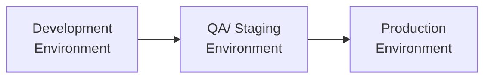

## 10.2 Environments and Testing (Development, QA/Staging, Production)

In modern organizations, the deployment of software changes—whether they involve new features, bug fixes, security patches, or updates to financial and accounting systems—requires a well-structured approach to environments and testing. The overarching objective of maintaining separate environments (Development, QA/Staging, and Production) is to reduce risk, maintain data integrity, and ensure that all modifications function correctly prior to final release. By segregating these environments, organizations create clear boundaries for testing, validation, and approval, which helps preserve the integrity of production data and ultimately protects financial reporting.

This section explores the rationale behind maintaining distinct environments, provides an overview of typical testing procedures, and highlights best practices to reduce risk in an IT change management context. We will build upon concepts introduced in Chapter 8: IT General Controls (ITGC) – Standard Domains and Chapter 9: System Availability and Business Continuity, focusing on how proper environment segregation aligns with robust control structures and continuity strategies.

-------------------------------------------------------------------------------

### Key Objectives of Environment Segregation

1. **Risk Reduction**: Restricting development or testing activities to non-production environments helps contain the scope of potential errors and failures. If a faulty software patch affects the QA/Staging environment, the impact is controlled and does not immediately disrupt live financial transactions or sensitive data.

2. **Data Integrity**: By preventing developers from directly modifying production data, environment segregation enhances data quality and accuracy. This is particularly important for accounting information systems (AIS) and ERP platforms, where even small data errors can lead to significant financial misstatements.

3. **Controlled Change Management**: Each environment aligns with specific change procedures. Development is for coding, QA/Staging for thorough testing, and Production for live use. This clear division of responsibilities ensures accountability and traceability of all modifications.

4. **Security and Compliance**: Some frameworks and regulations (e.g., PCI DSS, HIPAA, GDPR) mandate strict control over how and where data is accessed, tested, and stored. Environment segregation, paired with strong access controls, mitigates the risk of unauthorized data access or unintended changes that could violate regulatory requirements.

5. **Performance Testing**: Large-scale or high-impact changes, such as a new module in an ERP system, might require rigorous performance and load testing. Separate QA or staging environments allow organizations to run such tests without affecting real-time business operations.

-------------------------------------------------------------------------------

### Overview of Typical Environments

Although naming conventions can vary, the three most common environments where software is developed, tested, and deployed are as follows:

- **Development Environment**  
- **QA/Staging Environment**  
- **Production Environment**  

Below, we break down the key characteristics, risks, and best practices in each environment.

#### Development Environment

The Development environment is where software creation, bug fixing, and initial configuration take place. It is typically accessible to developers, system analysts, and certain IT operational roles. Development is the most fluid environment, often subject to frequent code check-ins, patch deployment, and experimentation with new features or technologies.

1. **Primary Purpose**:  
   - Software coding and initial integrations.  
   - Quick prototyping of new features or modules.  
   - Initial debugging and repair of identified defects.

2. **Data and Configuration**:  
   - Frequent use of synthetic or sanitized datasets (i.e., data structurally similar but stripped of confidential or personally identifiable information).  
   - Configuration changes or experimental scripts tested here first.

3. **Risk Mitigation**:  
   - Implement strong version control systems (e.g., Git) to track changes.  
   - Limit developer access to only what is necessary.  
   - Secure the environment to deter unauthorized access, while still allowing flexibility for innovation.

4. **Common Pitfalls**:  
   - Overlooking documentation of changes.  
   - Using live production data for testing in development, which compromises confidentiality and can skew test results.  
   - Allowing developers to store sensitive credentials or production-like secrets in the source code.

-------------------------------------------------------------------------------

#### QA/Staging Environment

Sometimes referred to as the test environment or staging environment, the QA (Quality Assurance) or Staging environment is designed to more closely resemble production, but without real end-users or actual operational data. This environment is critical for comprehensive testing, user acceptance, and release candidate stabilization.

1. **Primary Purpose**:  
   - Validation of new features, bug fixes, and system integrations in a near-production scenario.  
   - Execution of detailed test scenarios, including load tests and stress tests.  
   - User acceptance testing (UAT) by key stakeholders (e.g., finance, accounting, or operational teams).

2. **Data and Configuration**:  
   - Many organizations use sanitized data sets that mirror production volumes (but de-identified for privacy).  
   - System configurations, versions, and patches typically mirror production to ensure consistency of testing outcomes.

3. **Risk Mitigation**:  
   - Strictly controlled release management policies: changes promoted from Development to QA/Staging only after rigorous code review and approval.  
   - Clear separation of duties (e.g., testers vs. developers) to ensure unbiased assessments.  
   - Automated test scripts (regression, integration, and performance testing) to catch critical bugs.

4. **Common Pitfalls**:  
   - Incomplete or mismatched data sets that do not accurately reflect production usage patterns.  
   - Time constraints leading to shortcuts in testing processes (e.g., not performing full regression tests).  
   - Neglecting to keep the QA/Staging environment fully aligned with Production configurations, resulting in inconsistent test results.

-------------------------------------------------------------------------------

#### Production Environment

The Production environment is where the software application or system is actively used by end-users or internal stakeholders to conduct daily business processes. Because this environment handles live transactions, it is paramount that all changes have been rigorously tested before deployment.

1. **Primary Purpose**:  
   - Host mission-critical systems for real-time use, including financial transaction recording, accounting processes, and client-facing applications.  
   - Provide a stable and secure environment with minimal downtime and stringent access controls.

2. **Data and Configuration**:  
   - Holds real, sensitive, and possibly regulated data that must be carefully protected.  
   - Must flawlessly integrate with other production systems, such as ERPs, CRMs, or proprietary data warehouses.

3. **Risk Mitigation**:  
   - Enforce rigorous change approval procedures (e.g., change advisory board, formal sign-offs).  
   - Deploy changes during scheduled maintenance windows to reduce disruption.  
   - Continuously monitor system health, logging events and performance metrics for proactive issue detection.

4. **Common Pitfalls**:  
   - Insufficiently tested patches causing system failures, data corruption, or financial misstatements.  
   - Unauthorized direct updates to production, bypassing the QA/Staging environment.  
   - Lack of rollback or disaster recovery (DR) planning for unanticipated deployment failures.

-------------------------------------------------------------------------------

### How Environment Segregation Reduces Risk

One of the primary benefits of having multiple environments lies in the strict controls around which individuals or teams can access and modify each environment. Properly segregating roles helps ensure that changes only proceed after rigorous checks and that no team member can unilaterally make changes to production without peer review. This is in direct alignment with the principle of “least privilege,” where individuals can only access the minimal set of resources required to perform their duties.

From a financial reporting perspective, environment segregation helps maintain the integrity and reliability of the data used for external reporting. A single flawed patch or code update could otherwise produce incorrect financial statements or lead to compliance fines if the environment is not properly secured and validated.

A simplified view of typical environment flow may be visualized with a Mermaid diagram:

> **Diagram Explanation**:  
> 1. Changes originate in the Development Environment, where they are designed and coded.  
> 2. After successful unit tests, changes move to the QA/Staging Environment for broader testing such as integration, performance, and user acceptance.  
> 3. Once validated, changes are promoted to the Production Environment, ensuring that any potential disruptions have been caught in earlier stages.

-------------------------------------------------------------------------------

### Typical Acceptance Testing Procedures

Testing is integral to maintaining system reliability and data integrity, particularly in organizations with complex ERP systems managing general ledger entries, accounts receivable, accounts payable, and more. Acceptance testing generally consists of several stages, each of which is conducted in the Development or QA/Staging environment:

1. **Unit Testing**:  
   - Performed by developers or software engineers to confirm that each module or piece of functionality operates correctly in isolation.  
   - Usually automated via frameworks, ensuring consistent checks for newly introduced code.

2. **Integration Testing**:  
   - Ensures that modules or components function cohesively.  
   - Verifies data flows across different system components, databases, or external APIs.

3. **System Testing**:  
   - Evaluates the system as a whole within the QA/Staging environment.  
   - Checks for stability, performance, and compliance with functional and non-functional requirements.

4. **User Acceptance Testing (UAT)**:  
   - Conducted by end-users or subject matter experts (e.g., the finance team, accounting departments) who will be working with the updated system daily.  
   - Assesses whether the system meets real-world requirements and use cases.  
   - Often focuses on validating accounting entries, invoice handling, or budget calculations to verify financial accuracy.

5. **Regression Testing**:  
   - Re-runs existing test suites to confirm that new changes have not broken any previously functioning features.  
   - Particularly critical for financial modules, where a small change can have wide-ranging effects on reporting processes.

6. **Pre-Production Testing**:  
   - Final check in a staged or pre-production environment that closely mimics Production.  
   - Involves sanity checks, final sign-offs by senior stakeholders, and validation of compliance.

-------------------------------------------------------------------------------

### Best Practices in Environment Management and Testing

1. **Strict Access Control**  
   - Ensure permissions are role-based (e.g., while developers have access to Development, QA engineers have QA/Staging access, and only authorized personnel can deploy to Production).  
   - Rotate or vault credentials regularly, removing user accounts that no longer need access.

2. **Configuration as Code (CaC)**  
   - Store environment configuration in version-controlled repositories (similar to the application code), making changes more transparent and auditable.  
   - Reduces the risk of hidden or undocumented changes that could cause known-good configurations to drift over time.

3. **Automated Testing and Continuous Integration (CI)**  
   - Incorporate automated testing suites to run unit, integration, and regression tests after each code check-in.  
   - This practice accelerates the feedback loop, allowing developers to fix defects quickly.

4. **Controlled Release Procedures**  
   - Employ standardized release pipelines, ensuring that code migrates systematically from Development to QA/Staging, and ultimately to Production only after explicit sign-off.  
   - Implement checklists to guarantee the completeness of tested features and relevant documentation before deployment.

5. **Data Anonymization or Masking**  
   - Strictly avoid using live data in Development or QA/Staging.  
   - Leverage anonymization or masking tools to mimic real-world data volumes and patterns without exposing sensitive information.

6. **Disaster Recovery (DR) and Rollback Plans**  
   - Document clear procedures for reverting to a previous stable state in case a Production deployment fails.  
   - Conduct periodic DR drills in staging environments to ensure readiness.

7. **Continuous Monitoring and Logging**  
   - Establish monitoring dashboards that track system metrics, error rates, and performance in QA and Production.  
   - Collect and analyze logs to identify potential issues proactively.

-------------------------------------------------------------------------------

### Real-World Scenarios and Case Studies

1. **Financial Institution ERP Upgrade**  
   A global bank decided to upgrade its core ERP system’s reporting module to meet new regulatory guidelines. Following best practices, the development team built and tested a prototype in the Development environment. After unit tests, the changes were promoted to QA, where the bank’s finance department performed UAT. Several discrepancies in transaction rounding were detected, prompting a quick fix. Because the miscalculations were caught in QA, the final release to Production went smoothly, preserving the integrity of financial statements and avoiding regulatory scrutiny.

2. **SaaS Provider Patching**  
   A Software-as-a-Service (SaaS) provider with a large customer base discovered a security vulnerability in its application. Developers rushed to create a security patch in Development. After successful QA testing with load simulations that replicated real-user behavior, the patch was promoted to Production. Continuous monitoring indicated that the patch resolved the vulnerability without introducing performance bottlenecks, demonstrating the value of environment segregation for rapid and safe software fixes.

-------------------------------------------------------------------------------

### Common Pitfalls and Challenges

- **Inadequate Testing Coverage**: Time or resource constraints might cause teams to skip or abbreviate crucial tests.  
- **Lack of Documentation**: In high-pressure releases, teams might omit detailed logs or trackers of changes, making future audits or rollbacks difficult.  
- **Production-Like Data in Development**: Unauthorized use of live data in lower environments can cause privacy non-compliance and compromise data integrity.  
- **Unclear Incident Response Channels**: If a release fails, organizations may face confusion about who should handle the rollback, leading to extended downtime or data corruption.

-------------------------------------------------------------------------------

### Strategies to Overcome Challenges

1. **Test Early, Test Often**  
   - Encourage a “shift left” approach to testing—performing tests earlier in the Development lifecycle.  

2. **Make Testing Standardized and Repeatable**  
   - Use test automation tools wherever possible, particularly for regression tests in financial modules.  

3. **Implement a Change Control Board (CCB)**  
   - Assemble a cross-functional team to review and approve changes, ensuring both technical and business stakeholders agree on the release scope and timing.  

4. **Conduct Frequent Environment Audits**  
   - Periodically review environment configurations for drift, ensuring QA mirrors Production as closely as possible.  

5. **Ensuring Proper Separation of Duties**  
   - Align environment responsibilities with distinct roles (developer, tester, release manager) and enforce policies that bar individuals from unilaterally deploying to Production.

-------------------------------------------------------------------------------

### Practical Example: Environment Access Matrix

Below is a sample table illustrating how an environment access matrix can be designed, specifically for an ERP used in a mid-sized manufacturing firm:

| Environment | Primary Users/Access                 | Typical Actions                                           | Sensitivity Level      |
|-------------|--------------------------------------|-----------------------------------------------------------|------------------------|
| Development | Developers, IT Engineers             | Code updates, initial testing, bug fixes                  | Low to Medium          |
| QA/Staging  | QA Analysts, Business Testers (Finance, Accounting SMEs) | Functional testing, user acceptance testing, regression tests | Medium                |
| Production  | Operations Team, Administrators (Limited Developer Access) | Live transactions, stable environment for daily operations | High (contains real data) |

This matrix clarifies who has access rights in each environment, what features they are permitted to modify, and the overall data sensitivity level.

-------------------------------------------------------------------------------

### Conclusion

Maintaining distinct Development, QA/Staging, and Production environments is a foundational practice in effective IT change management. Organizations that invest time and resources into crafting well-defined processes across these environments significantly reduce operational risk, enhance data integrity, and consistently maintain high standards for financial and non-financial reporting. When coupled with robust testing protocols—ranging from unit tests to full regression and user acceptance testing—this comprehensive approach improves system reliability and underpins financial controls.

Organizations of any size—particularly those subject to strict regulatory oversight or frequent financial audits—stand to gain from adopting a disciplined approach to environment segregation and testing. By integrating these principles into their broader IT Governance structure (see Chapter 3: Governance, Frameworks, and Regulatory Environment), finance and accounting professionals can help ensure robust, error-free operations that bolster confidence among users, stakeholders, and regulators alike.

-------------------------------------------------------------------------------

## Master Your Knowledge of Environments and Testing



### Which primary advantage of environment segregation most directly protects an organization’s real-time financial data?

- [ ] Faster deployment of code changes
- [x] Reduced risk of code errors impacting production
- [ ] More efficient use of developer resources
- [ ] Enhanced user interface design

> **Explanation:** By maintaining separate Development, QA/Staging, and Production environments, organizations ensure that flawed or unapproved changes do not directly affect live systems and financial records, thus significantly reducing the risk to real-time financial data.

### What is the main purpose of the QA/Staging environment?

- [ ] Hosting customer-facing features and live transactions
- [ ] Quickly testing minor bug fixes in production
- [x] Validating new features and bug fixes in a near-production scenario
- [ ] Merging sensitive financial data for reporting

> **Explanation:** The QA/Staging environment is designed to mirror the Production environment as closely as possible, allowing teams to test new features and bug fixes without risking disruption of live data or operations.

### Which of the following tests typically occurs first in the software development lifecycle?

- [x] Unit testing
- [ ] User acceptance testing
- [ ] Production monitoring
- [ ] Regression testing

> **Explanation:** Unit testing occurs early in the process and is generally performed by developers to verify individual components or modules before broader testing takes place.

### During a financial audit, which environment generally provides auditors with the safest and most accurate reflection of how changes may impact the organization?

- [ ] Development
- [x] QA/Staging
- [ ] Sandbox
- [ ] Production

> **Explanation:** The QA/Staging environment offers a near-production setup without risking actual data, making it ideal for auditors to assess potential effects of changes in a controlled setting.

### Which is a best practice when handling data in the QA/ Staging environment?

- [x] Using masked or anonymized production data
- [ ] Employing an exact copy of production data in full
- [x] Testing with a reduced dataset that doesn't mirror production scale
- [ ] Allowing real user credentials for end-to-end testing

> **Explanation:** Properly anonymizing or obfuscating sensitive data ensures regulatory compliance and reduces the risk of exposing confidential information while still reflecting real-world usage patterns.

### What is the primary function of the “shift left” approach in software testing?

- [x] Performing testing tasks earlier in the development cycle
- [ ] Testing code only after it is deployed to production
- [ ] Delegating QA responsibilities solely to the finance team
- [ ] Automating every step of the deployment process

> **Explanation:** Shifting left encourages development teams to run tests, identify bugs, and address issues early in the lifecycle, reducing the likelihood of costly defects discovered late in production.

### Which outcome best characterizes a robust user acceptance testing (UAT) process in a finance department?

- [ ] A quick review of code by developers only
- [x] Key accounting staff validating that the updated system meets real-world needs
- [x] Identifying minor user interface changes without verifying underlying calculations
- [ ] Ignoring system functionality in favor of aesthetic feedback

> **Explanation:** UAT involves business experts, such as accounting staff, performing hands-on testing to confirm that the system aligns with daily financial workflows and business rules.

### What is the main rationale behind assigning different roles to Development, QA, and Production environments?

- [x] Ensuring segregation of duties and preventing unauthorized changes
- [ ] Speeding up the overall release process at the cost of thorough testing
- [ ] Granting full access to each employee in all environments
- [ ] Reducing collaborative efforts across teams

> **Explanation:** Restricting and clarifying environment access ensures that only authorized individuals can modify each environment, protecting the integrity of Production systems and data.

### Which scenario might indicate a major pitfall in environment segregation?

- [ ] Developers have read-only access to production logs
- [x] The QA environment uses live customer payment information
- [ ] Automated regression tests run in the QA environment
- [ ] Production environment requires multi-factor authentication

> **Explanation:** Using live customer data in the QA environment can result in privacy, compliance, and data security risks, violating the key principle of environment segregation.

### True or False: Properly maintained QA/Staging and Development environments can allow continuous deployments to production without additional risk.

- [x] True
- [ ] False

> **Explanation:** With well-structured, well-tested, and well-governed QA/Staging and Development processes, continuous deployment or integration can be performed effectively and with minimized risk, as defects are caught early before reaching production.



-------------------------------------------------------------------------------

## For Additional Practice and Deeper Preparation

### [Information Systems and Controls (ISC)](https://www.udemy.com/course/isc-cpa-mock-exams/?referralCode=E1217303222935C5E464)

**Information Systems and Controls (ISC) CPA Mocks:** 6 Full (1,500 Qs), Harder Than Real! In-Depth & Clear. Crush With Confidence!

- Tackle full-length mock exams designed to mirror real ISC questions.  
- Refine your exam-day strategies with detailed, step-by-step solutions for every scenario.  
- Explore in-depth rationales that reinforce higher-level concepts, giving you an edge on test day.  
- Boost confidence and minimize anxiety by mastering every corner of the ISC blueprint.  
- Perfect for those seeking exceptionally hard mocks and real-world readiness.  

_Disclaimer: This course is not endorsed by or affiliated with the AICPA, NASBA, or any official CPA Examination authority. All content is for educational and preparatory purposes only._
