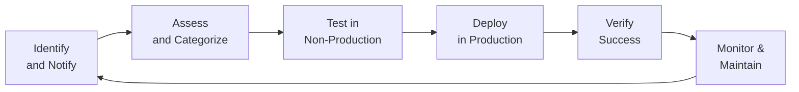

## 10.3 Patch Management: Risks and Controls

Patch management is the systematic process of identifying, acquiring, testing, deploying, and monitoring software updates (or patches) for operating systems, applications, databases, and other components of the IT environment. The primary objectives are to remediate known security vulnerabilities, fix functionality issues, and maintain overall systems stability. In the context of an accounting information system, effective patch management ensures the integrity, availability, and confidentiality of financial data. Neglecting patches can expose organizations to costly data breaches and system failures, undermining stakeholder confidence.

Organizations that align patch management with broader IT change management initiatives (see Chapter 10) demonstrate due diligence and strengthen their control environment. This approach reduces downtime, streamlines processes, and optimizes resource allocation—a key consideration for CPAs tasked with evaluating IT controls and financial statement reliability.

Below, we discuss the risks posed by poor patch management, explain the patching lifecycle, and outline controls and best practices to enhance patch processes. We also highlight testing and rollback procedures, emphasizing how each component contributes to the organization’s overall risk management strategy.

### Significance of Patch Management

Patches address software defects or vulnerabilities that attackers can exploit to gain unauthorized access, disrupt services, or steal information. A well-known historical example is the 2017 Equifax data breach, which stemmed from an unpatched vulnerability in Apache Struts and resulted in the exposure of sensitive financial household information. Similarly, the WannaCry and NotPetya ransomware outbreaks capitalized on systems that lacked critical Windows security patches.

From a CPA’s vantage point, neglected patches heighten the probability of errors or fraud within financial applications, raising material misstatement risks. Patch management is thus essential not only for cybersecurity and operational continuity but also for meeting regulatory and auditing requirements outlined by bodies such as the AICPA, PCAOB, and ISACA.

### Common Risks and Challenges

• Security Exploits and Data Breaches: An unpatched system is an open invitation to hackers who might use known security flaws to access valuable data.  
• Regulatory Noncompliance: Failure to apply necessary patches can violate data protection regulations (PCI DSS, HIPAA, GDPR) and lead to penalties.  
• Operational Downtime: Unplanned downtime may occur if security patches are deployed without proper testing, negatively impacting finance and accounting functions that rely on system availability.  
• Compatibility Issues: Applying patches without compatibility checks can cause system errors, software crashes, and data corruption, especially in complex ERP environments.  
• Loss of Trust: Undiagnosed vulnerabilities can damage an organization’s reputation, reducing customer and investor confidence in its capacity to manage sensitive financial information effectively.

### Patch Management Lifecycle

Patch management activities align closely with the broader change management process (see Chapter 10). Although practices vary across organizations, a typical lifecycle includes:

1) Identification and Notification:  
   • Monitoring vendor websites, security advisories (e.g., US-CERT, SANS, Microsoft Security Bulletins), and automated vulnerability scanners for new patches.  
   • Reviewing relevant patches that address critical flaws or compliance obligations.  

2) Assessment and Categorization:  
   • Determining patch criticality—security, high, medium, or low—based on the severity of the identified vulnerability and its potential business impact.  
   • Evaluating system dependencies and potential side effects on financial applications, databases, or ERP modules.  

3) Testing and Validation:  
   • Testing patches in a dedicated environment (e.g., QA, staging) to confirm compatibility, functionality, and performance without risking live financial data.  
   • Developing rollback plans to revert to previous states if the patch introduces issues.  

4) Scheduled Deployment:  
   • Defining a systematic deployment schedule for production systems, guided by the risk level of the vulnerability.  
   • Communicating expected outcomes, downtime, and potential disruptions to relevant stakeholders, including finance teams.  

5) Verification and Documentation:  
   • Confirming successful installation of patches and verifying that applications and services remain stable, especially those supporting critical financial reporting processes.  
   • Documenting the patch process, including test results and management approvals, for audit and compliance purposes.  

6) Ongoing Monitoring:  
   • Periodically reviewing patches to ensure they remain effective and that no new interdependencies or vulnerabilities have emerged.  
   • Leveraging automated tools that scan for missing updates, misconfigurations, or newly disclosed security bulletins.

Below is a Mermaid diagram illustrating a simplified patch management lifecycle:

### Testing Patches Before Production

Thorough testing is vital to prevent unintended consequences in critical financial systems. Testing ensures that the patch:  
• Resolves identified security weaknesses without introducing new ones.  
• Maintains or improves system performance.  
• Interacts smoothly with integrated applications (ERP modules, database management systems, financial reporting portals).  
• Does not conflict with internal controls around data integrity, potentially jeopardizing the financial statement audit.

Testing typically involves:  
• Utilizing a dedicated testing environment (development or QA) that mirrors production as closely as possible.  
• Employing change management policies (see Chapter 10) to control the movement of code or configuration items from lower environments to production.  
• Running user acceptance tests (UAT) with typical financial transactions to verify that the patch does not disrupt the general ledger, revenue cycle, or other important functions.  
• Documenting test scenarios, results, and sign-offs from relevant financial system owners or management personnel.

### Role of Rollback Plans

Even after thorough testing, there is always a possibility that a patch may fail under real production conditions or produce unforeseen side effects. A rollback plan helps mitigate these risks by outlining:  
• Conditions that trigger rollback (e.g., unexpected system crashes, data corruption).  
• Steps to restore the previous system version, including data backups or snapshots taken before patch deployment.  
• Communication protocols to quickly notify finance and accounting teams of system disruptions.  
• Time, personnel, and resources required to complete recovery operations.  
• Contingency options if the rollback also fails, such as disaster recovery protocols described in Chapter 9 (System Availability and Business Continuity).

A rollback plan is especially important for mission-critical environments in the finance sector, where even brief interruptions can have severe economic or reputational consequences.

### Timely Patch Deployment

One of the most frequent questions in patch management is how quickly an organization should deploy patches. While there is no universal answer, best practices suggest a risk-based approach. High-severity or zero-day vulnerabilities demand immediate remediation—often within 24 to 72 hours—especially if they permit remote code execution or enable attackers to access financial data. Medium or lower-severity security patches may have slightly longer remediation windows. The underlying principle is to minimize the organization’s risk exposure without undermining production stability.

#### Scheduling Strategies

• Rolling Patches: Deploy patches in small batches to subsets or “pilot groups” of systems, reducing the potential impact area if issues arise.  
• Maintenance Windows: Align patch releases with pre-defined maintenance windows to minimize disruption of financial closing processes or online customer transactions.  
• Automated Deployment Tools: Use centralized patch management solutions (e.g., WSUS, SCCM, or third-party tools) for consistent patch distribution and progress tracking.

#### CPA Considerations

• Materiality Assessments: From the CPA perspective, a system housing significant transaction volumes or sensitive PII data has a higher potential financial statement impact. Such systems warrant more frequent patch analysis.  
• Evidence of Control Operation: CPAs or IT auditors may request patch logs and testing documentation to validate that management’s internal control process is functioning effectively.  
• Management Accountability: Confirm roles and responsibilities are clear in the patching process (see Chapter 2 for IT Roles and Responsibilities). Ensure senior management and/or the board is aware of major vulnerabilities if they pose a significant business risk.

### Patch Management Tools and Automation

Organizations commonly use dedicated patch management platforms or integrated solutions within endpoint security suites. These platforms help:  
• Consolidate patch notifications and approvals within a single interface.  
• Automate the scheduling, deployment, and verification of patches across server fleets, workstations, and even IoT devices.  
• Generate compliance reports demonstrating patch coverage and identifying incomplete or failed deployments.  
• Integrate with vulnerability management tools that scan systems for missing patches and prioritize critical updates.

In large organizations with complex on-premises and cloud-based infrastructures, automated patch management ensures consistent, organization-wide compliance. However, automation does not eliminate the need for human oversight, especially for anomalies such as partial deployments or reboots that fail to complete. Skilled IT operators and auditors should monitor the automated workflows to ensure adequate control.

### Patch Management Controls

Robust controls can enhance the effectiveness and reliability of patch processes. Some examples:

• Policy and Procedures: Formally define patch management policies in alignment with COSO, COBIT, and relevant standards (see Chapter 3). Outline responsibilities and SLAs for responding to different severity levels.  
• Segregation of Duties (SoD): Separate responsibilities for testing patches (development teams) and approving or deploying them into production (operations). CPAs often examine the degree of SoD to ensure robust controls.  
• Documentation and Approval: Maintain a thorough record of tests performed, approvals granted, and changes applied. This evidence is essential for auditors.  
• Audit Trails and Logging: Collect logs from patch management tools, servers, and endpoints, ensuring that any unauthorized or failed patch attempts are flagged.  
• Vulnerability Scanning: Regular scanning helps identify unpatched systems and provides insight into ongoing threat assessments.  
• Training and Awareness: Provide employees responsible for patch deployment with current knowledge of vendor patch practices, vulnerability disclosure policies, and best practices.

### Practical Examples and Case Studies

• Scenario – Quarterly Patch Cycle in a Mid-Sized Accounting Firm:  
  A regional CPA firm that relies on cloud-based Practice Management software schedules routine patch deployments every quarter. The firm designates two weeks for patch identification and prioritization, one week for testing in a QA environment, and one final week for controlled production deployment. Timely patching has reduced the incidence of security incidents and has strengthened their SOC 2® position related to the Security Trust Services Criterion.

• Scenario – High-Severity Patch in a Global Financial Institution:  
  A major bank discovered a critical zero-day vulnerability affecting its core banking system. The vulnerability was widely publicized and carried a high CVSS score. Under the organization’s emergency change management protocol, the bank deployed the patch within 48 hours. Prior to the live install, it ran ad-hoc tests to validate basic functionality. While this condensed approach deviated from the usual multi-week process, the bank successfully mitigated the risk without significant downtime to customer-facing services.

• Scenario – Patching ERP Modules at a Manufacturer:  
  A manufacturing client used an integrated ERP solution that handled everything from inventory tracking to financial reporting. A routine patch inadvertently caused conflicts with a custom invoice generation plug-in. Because the IT team had enforced a thorough rollback plan, they reverted the system to the previous stable state within minutes, preventing a deeper disruption of the month-end financial close process. The root cause was identified in the test environment before the patch was redeployed with an updated configuration.

### Best Practices for Effective Patch Management

Below is a sample table outlining best practices, challenges, and recommended solutions:

| Best Practice                            | Common Challenges                                      | Suggested Remedies                                      |
|-----------------------------------------|--------------------------------------------------------|---------------------------------------------------------|
| Develop a Formal Patch Policy           | Lack of management buy-in, incomplete scope            | Secure executive sponsorship, align with COSO/COBIT     |
| Classify Patches by Criticality         | Overwhelming volume of updates, conflicting schedules  | Use vulnerability intelligence feeds, define rigorous risk-ranking criteria |
| Test Thoroughly in a Staging Environment| Limited resources, time constraints                    | Employ virtual labs, utilize scripting to automate tests|
| Schedule Patches Strategically          | Disruption to business operations                      | Use maintenance windows, pilot deployments              |
| Communicate with Stakeholders           | Misalignment between IT, Finance, HR                   | Engage cross-functional teams early and frequently      |
| Maintain Rollback Plans                 | Lack of documented emergency procedures                | Store system images/backups, train staff on restoration |
| Audit the Patch Management Process      | Unclear accountability, no continuous improvement loop | Use logs, spot checks, formal internal/external audits  |
| Apply Automated Tools                   | Tool selection complexity, risk of over-automation     | Evaluate vendor solutions carefully, keep robust oversight |

### Common Pitfalls

• Delayed Deployment: Overly cautious strategies lead to leaving critical vulnerabilities unpatched for extended periods.  
• Inadequate Testing: Skipping thorough testing to expedite deployment can backfire, resulting in system outages.  
• Lack of Comprehensive Coverage: Remote endpoints or third-party vendor systems may remain unpatched due to oversight.  
• Poor Documentation: Neglecting detailed patch records makes it difficult to satisfy audit requirements and identify root causes of issues.  
• Patch Sprawl: Keeping track of multiple vendor apps or OS versions intensifies the complexity.  

### Relationship to Other Frameworks

• COBIT (Chapter 3.3): Guides governance and management of enterprise IT, emphasizing patch management under “Manage Problems and Incidents” and “Manage Changes.”  
• COSO Internal Control Framework (Chapter 3.1): Recommends strong monitoring and control activities around technology, with patching as a key defense in safeguarding information reliability.  
• NIST SP 800-40: A specialized publication offering best practices focused on creating a robust enterprise patch and vulnerability management program.  
• PCI DSS (Chapter 3.4): Specifically mandates maintaining a secure network and systems, including applying critical patches within one month of release.

### Final Thoughts

Patch management is a linchpin of modern IT security and operational performance. For CPAs, patch management serves as an important control mechanism that safeguards transactional integrity and continuity of financial reporting. When executed consistently within a strong internal control environment, effective patching narrows the window of vulnerability, reduces the likelihood of major security incidents, and supports compliance with regulatory mandates. 

Ultimately, organizations that adopt a risk-based, well-documented, and continuously improving patch management process stand better prepared to adapt to the evolving threat landscape. This preparedness not only protects mission-critical financial data but also fosters trust among auditors, stakeholders, and key decision-makers.

## Test Your Knowledge: Patch Management Essentials



### Which of the following is a primary goal of patch management?

- [ ] Strengthen marketing analytics
- [ ] Outsource key IT operations
- [x] Remediate known software vulnerabilities
- [ ] Reduce system resource usage to a minimum

> **Explanation:** Patch management aims to remediate known software vulnerabilities and fix functionality issues. While it can improve performance, the main priority centers on security and stability.

### Which step in the patch management lifecycle involves examining patches in a designated QA environment?

- [ ] Deployment
- [x] Testing
- [ ] Identification
- [ ] Ongoing Monitoring

> **Explanation:** In the Testing phase, patches are verified in a non-production or QA environment to check compatibility and functionality prior to live deployment.

### What is a key risk of skipping or underemphasizing patch testing?

- [ ] Improved version control
- [x] System outages or new vulnerabilities
- [ ] Lower system resource usage
- [ ] Enhanced rollback capabilities

> **Explanation:** Skipping patch testing increases the risk of deploying defective or incompatible updates, which may result in system instability, unanticipated downtime, or new security issues.

### Why is maintaining a rollback plan crucial in patch management?

- [ ] It provides a framework to defer patches indefinitely.
- [ ] It allows organizations to skip testing entirely.
- [x] It offers a safe way to revert to previous configurations if a patch fails.
- [ ] It justifies ignoring upstream vendor recommendations.

> **Explanation:** Rollback plans give organizations a contingency approach if a patch introduces issues in production. This is especially critical for mission-critical financial systems.

### Which best describes a risk-based approach to deciding patch deployment timelines?

- [x] Prioritizing critical, high-severity patches for immediate release
- [ ] Always applying all patches simultaneously system-wide
- [x] Identifying vulnerabilities that pose the greatest business impact
- [ ] Rejecting vendor patches longer than one page of instructions

> **Explanation:** Risk-based approaches prioritize immediate remediation for critical vulnerabilities while simultaneously assessing the impact of lower-severity patches according to business risk.

### How do automated patch management tools assist organizations?

- [x] They streamline patch notification, deployment, and verification.
- [ ] They eliminate the need for any human oversight in patch management.
- [ ] They are only available for small organizations.
- [ ] They replace the role of internal auditors.

> **Explanation:** Automated solutions help coordinate policies, schedules, and apply patches consistently. However, oversight is still necessary to monitor potential issues and confirm successful deployments.

### What role does segregation of duties play in patch management?

- [x] Separating testing and approval tasks helps ensure independent checks.
- [ ] Combining development, testing, and deployment under one team speeds patching.
- [x] Supporting auditors by delineating responsibilities among staff
- [ ] Limiting management’s visibility into vulnerability remediation progress

> **Explanation:** Segregation of duties ensures that different individuals oversee testing and approving patches, reducing the risk of oversight or conflicts of interest.

### A critical zero-day vulnerability with a high CVSS score is discovered in a core financial system. Which response is most appropriate?

- [ ] Defer patching until the next quarterly cycle.
- [x] Expedite patch testing and deployment within a short timeframe.
- [ ] Apply the patch to only one test machine and ignore production for now.
- [ ] Deny emergency protocol use unless at least a month of testing is completed.

> **Explanation:** High-severity zero-day vulnerabilities demand rapid action, often requiring an emergency protocol with condensed testing to protect vital financial data.

### Which of the following is a key benefit of documenting patch processes and test results?

- [x] Facilitates audits and demonstrates control effectiveness
- [ ] Hides the oversight of delayed patch deployments
- [ ] Eliminates the need for QA environments
- [ ] Replaces security advisories from official vendors

> **Explanation:** Thorough documentation is essential for audits, demonstrating that an organization’s control environment ensures patches are properly tested and deployed.

### Patch management is critical to which of the following from a CPA’s perspective?

- [x] Reducing the risk of material misstatements in financial reporting
- [ ] Increasing the number of unpatched vulnerabilities
- [ ] Eliminating the need for IT change management
- [ ] Ensuring indefinite system downtime

> **Explanation:** From a CPA viewpoint, unpatched systems can expose significant risks to financial data, possibly leading to inaccuracies or fraud. Effective patch management addresses these concerns.



---

## For Additional Practice and Deeper Preparation

### [Information Systems and Controls (ISC)](https://www.udemy.com/course/isc-cpa-mock-exams/?referralCode=E1217303222935C5E464)

**Information Systems and Controls (ISC) CPA Mocks:** 6 Full (1,500 Qs), Harder Than Real! In-Depth & Clear. Crush With Confidence!

- Tackle full-length mock exams designed to mirror real ISC questions.  
- Refine your exam-day strategies with detailed, step-by-step solutions for every scenario.  
- Explore in-depth rationales that reinforce higher-level concepts, giving you an edge on test day.  
- Boost confidence and minimize anxiety by mastering every corner of the ISC blueprint.  
- Perfect for those seeking exceptionally hard mocks and real-world readiness.  

_Disclaimer: This course is not endorsed by or affiliated with the AICPA, NASBA, or any official CPA Examination authority. All content is for educational and preparatory purposes only._
