## 10.4 Continuous Integration and Continuous Deployment in Modern DevOps

Continuous Integration (CI) and Continuous Deployment (CD) have revolutionized the way organizations manage software changes. By automating key steps in the build, test, and deploy process, CI/CD pipelines reduce administrative overhead, accelerate development cycles, and improve software reliability and quality—all while making it easier for teams to integrate security controls and identify risks early. For professionals in Finance and Accounting, including CPAs involved in auditing information systems, CI/CD practices help ensure that core financial applications are stable, secure, and able to support critical business processes without disruption.

This section delves into the core principles and practical implementation considerations of Continuous Integration and Continuous Deployment, focusing on how DevOps methodologies mitigate risks—particularly in IT change management—and the role of security scanning. Understanding these concepts is invaluable for technology-literate CPAs who work closely with IT teams to envision robust control environments and effective audit and assurance programs.

  
### Overview of Continuous Integration and Continuous Deployment

DevOps emerged as a response to the traditional challenges of software development, such as siloed teams, long release cycles, and lack of visibility into application performance. In a DevOps model, development (Dev) and operations (Ops) departments collaborate more closely, resulting in:

• Streamlined workflow processes  
• Frequent and consistent code integration  
• Automated testing for early detection of errors  
• Automated deployment to production or pre-production environments  

The combined approach of CI/CD reflects the modern best practice in managing software changes:

• Continuous Integration (CI)—Frequent merges of new or updated code back into a shared repository, coupled with automated builds and tests.  
• Continuous Deployment (CD)—Automated release of tested code into production or staging environments, reducing manual intervention and the possibility of human error.  

For critical business applications (e.g., accounting systems, financial reporting platforms, ERP modules), these techniques boost reliability and consistency. By catching issues early through automated testing, production downtime and potential financial misstatements can be reduced significantly.

  
### Key Components of CI/CD Pipelines

A well-designed CI/CD pipeline typically includes the following stages:

1. Version Control and Source Management  
2. Build Automation (Compilation and Packaging)  
3. Automated Testing (Unit, Integration, Functional, and Security Tests)  
4. Security Scanning and Vulnerability Assessment  
5. Deployment to Staging  
6. Production Deployment  
7. Monitoring and Feedback Loops  

Each stage is designed to run automatically based on triggers—such as a new code commit in the version control repository. This automation includes immediate feedback on potential build failures, coding errors, test coverage gaps, or security vulnerabilities.

  
### Importance of Version Control

All CI/CD processes rely heavily on source code version control systems (VCS). Popular VCS options include Git (with platforms such as GitHub, GitLab, or Bitbucket), Apache Subversion (SVN), and Mercurial. For an accounting environment:

• Financial regulatory requirements (like Sarbanes-Oxley, or SOX) emphasize robust control over code changes in systems that house financial records.  
• VCS logs provide a detailed audit trail of who changed what and when—critical for demonstrating compliance and facilitating external IT audits.  

Continuous Integration tools (e.g., Jenkins, GitLab CI/CD, Azure DevOps, CircleCI) typically integrate with VCS platforms to detect new commits automatically and trigger the build, test, and deployment workflows.

  
### Automated Build and Testing

Once a developer commits a change, the CI tool retrieves the updated code and compiles, if necessary, into an executable or deployable package. For example, if the application is built using Java, the CI system may run Maven or Gradle to produce JAR or WAR files. If it is a .NET application, it may use MSBuild to generate DLL files. For scripting languages, the “build” step could be as simple as code packaging.

Once the build is generated, automated testing ensures that the new code does not break existing functionality. Testing typically includes:

• Unit Testing: Focus on individual modules or classes. Ensures each function or method behaves as expected.  
• Integration Testing: Verifies that multiple components work together harmoniously.  
• Functional or End-to-End Testing: Emulates real user journeys throughout the application.  
• Regression Testing: Ensures that new features or patches did not reintroduce previously solved defects.  

For systems critical to finance (e.g., general ledger, accounts payable, or accounts receivable modules), any code malfunction could lead to inaccurate financial data or outages. Automated testing serves as a vital safety net.

  
### Integrating Security Scanning

Given the heightened sensitivity of financial data, integrating security scanning into the CI/CD pipeline is imperative. This helps ensure that new code, third-party libraries, and infrastructure scripts do not expose the organization to cybersecurity risk. Common security scans include:

• Static Application Security Testing (SAST): Scans source code for vulnerabilities such as SQL injection risks, cross-site scripting vectors, or unsafe cryptographic libraries.  
• Dynamic Application Security Testing (DAST): Simulates malicious behavior against a running application instance to identify security flaws in real-world conditions.  
• Software Composition Analysis (SCA): Flags known vulnerabilities in third-party libraries and frameworks. For example, a widely used library might have a published CVE (Common Vulnerabilities and Exposures) that must be patched or replaced.  

Security scanning can be configured to halt the pipeline if severe vulnerabilities are found—ensuring that no code moves forward to production deployment until security issues are remediated.

  
### Continuous Deployment: Automated Releases

In a Continuous Deployment environment, once an application has passed the necessary tests and security scans, it can be automatically deployed to production. While this might seem risky for financial systems, well-governed organizations adopt additional controls such as:

• Staged Releases: The application is first deployed to a staging or pre-production environment, closely mirroring production settings. If end-to-end tests, user acceptance tests, or performance stress tests pass, production deployment proceeds.  
• Approval Gates and Change Advisory Board (CAB) Oversight: Built-in hold points or approvals may be required for high-risk changes. Cross-functional teams may review production release candidates, especially if changes involve business-critical features.  
• Feature Flags: Allows developers to enable or disable specific features without needing to redeploy the entire system. This helps to mitigate the risk of abruptly introducing new functionality.  

The goal is to balance speed with risk management. While fully automated deployments bring agility and rapid time-to-market, strong governance processes ensure compliance with accounting and regulatory requirements.

  
### CI/CD in Practice: A Financial Use Case

Consider a scenario where a regional bank wants to modernize its online loan application platform. This platform interacts with core banking systems and must comply with strict data privacy and financial reporting regulations:

• Development teams push code to the bank’s central Git repository.  
• A CI pipeline is triggered, checking out the latest changes.  
• Automated tests validate business logic, ensuring that lending calculations, interest accrual, and user workflow remain correct.  
• Security scans detect any usage of out-of-date libraries, injection flaws, or open ports in the application images.  
• Once validated, a CD pipeline deploys the build to a staging environment. The QA team verifies major workflows, including calculating interest rates and generating a summary report for regulatory compliance.  
• If sign-off is granted, the pipeline proceeds to deploy the code automatically into production during a designated release window.  
• Monitoring tools watch for anomalies such as unexpectedly high error rates or surges in memory usage. Alerts notify operations if issues appear after release, and version rollbacks are quick and scripted.  

By integrating these steps, the bank reduces reliance on manual intervention, shortens release cycles, and gains real-time confidence in system stability and security.

  
### DevOps Pipeline Diagram

Below is a simplified visual representation of a typical CI/CD pipeline with integrated security checks. The diagram shows how code commits flow through the integration and deployment stages:

```mermaid
flowchart LR
    A["Developer Commits Code"] --> B["CI Server<br/>Fetch Latest Commit"]
    B --> C["Build & Unit Tests"]
    C --> D["Security Scanning<br/>(SAST, SCA, etc.)"]
    D --> E["Integration & Functional Tests"]
    E --> F["Artifact Creation<br/>& Packaging"]
    F --> G["Staging Environment"]
    G --> H["Security Scanning<br/>(DAST)"]
    H --> I["Approval Gate<br/>OR Automatic Trigger"]
    I --> J["Production Deployment"]
    J --> K["Monitoring & Feedback"]
```

In this flow:

• The developer initiates a pipeline by committing code to a source control repository.  
• The CI server automatically pulls the latest commit, building the application and running tests.  
• Security scans are performed alongside functional checks.  
• An artifact (e.g., a Docker image or compiled binary) is promoted into a staging environment for further tests.  
• If final approvals or automated checks pass, an automatic or semi-automatic release to production occurs.  
• Monitoring and feedback loops remain active in production to ensure any newly introduced defects are caught early.

  
### Collaboration Between Accounting and IT

In finance-related projects, collaboration between accounting teams and DevOps practitioners is critical to guard data integrity, comply with regulations, and maintain internal controls. CPAs in consulting or auditing capacities can provide valuable input regarding:

• Key financial control points that must be tested in the pipeline (e.g., locked-down user roles, vendor authenticity checks, or accurate ledger postings).  
• Government and industry regulations that may necessitate additional testing or security measures.  
• Data confidentiality requirements for personally identifiable information (PII) or sensitive payment card data (PCI-DSS).  

Regular communication ensures that the DevOps pipeline integrates the organization’s compliance posture, alleviating potential audit findings or material misstatements.

  
### Best Practices for CI/CD in Financial and Accounting Systems

1. Use Code Reviews and Peer Programming  
   • Implement mandatory peer review steps and ensure that changes that affect core financial logic undergo formal review.  

2. Maintain Clear Audit Trails  
   • Make sure that the CI/CD tool retains logs of build, test, and deployment events along with user identities, timing, and success/failure statuses.  

3. Enforce Strict Security Policies  
   • Integrate SAST and DAST scanning, requiring resolution of high-severity vulnerabilities before deployment.  

4. Implement Role-Based Access Control (RBAC) in the Pipeline  
   • Restrict who can modify pipelines, approve deployments, or access production.  

5. Segment Production Environments  
   • Ensure that production data and systems are isolated, limiting direct access and following the principle of least privilege.  

6. Continuously Monitor  
   • Set up application performance monitoring, intrusion detection, and real-time alerts to detect production issues quickly.  

7. Use Automated Rollbacks and Disaster Recovery Steps  
   • Keep a stable version of the last successful build easily accessible for quick rollbacks.  

8. Frequent, Incremental Releases  
   • Smaller, more frequent releases lower risk compared to large, infrequent releases that can mask multiple changes.  

  
### Common Pitfalls and How to Avoid Them

• Overly Complex Pipelines: An excessively complicated pipeline can frustrate development, leading to errors. Keep it lean and well-documented.  
• Neglecting Security in Early Stages: If security scanning only occurs late in the process, critical issues might surface only after investing substantial resources. Shift security testing as early as possible.  
• Poorly Managed Secrets: Credentials, passwords, and tokens can leak if not encrypted or stored properly in pipeline systems. Implement secure vaults for secret management.  
• Lacking Sufficient Test Coverage: Failure to test critical financial transaction paths could allow errors that compromise data accuracy. Thorough test coverage and code coverage metrics are essential.  
• Failing to Document Configuration Changes: Teams must keep track of environment-specific variables and configurations. Proper documentation is necessary for repeatable and auditable deployments.  
• Inadequate Monitoring: Without robust monitoring, pipeline health checks, or post-deployment alerts, failures or anomalies may go unnoticed until they impact customers or financial data.  

  
### Real-World Example: Automating Financial Report Generation

A growing fintech company that generates weekly consolidated financial statements for its clients wanted to adopt CI/CD. The system loads transactional data from multiple sources, processes them through a set of rules, and outputs consolidated statements. Manual bottlenecks previously caused delays and variations in data quality. By implementing a CI/CD pipeline:

• Whenever rules are updated (e.g., classification changes, adjustments in IFRS/GAAP handling), the pipeline automatically tests them on historical snapshots of data to detect any misclassifications.  
• Integration tests validate that the final statements accurately match previously approved results within acceptable tolerances.  
• If a user modifies a data transformation script, security scanning ensures the script does not expose sensitive client data to unauthorized logs.  
• Deployment to the production environment is possible at any time once the pipeline passes all tests, preventing errors from impacting the monthly financial close process.  

  
### Strategies for Continuous Improvement

CI/CD pipelines in DevOps are never static. Over time, teams refine them to incorporate new technologies, frameworks, or compliance demands. Continuous improvement strategies include:

• Retrospectives and Agile Sprints: Regularly assess pipeline performance, test coverage, build time, and reliability.  
• Tool Integrations: Evaluate novel solutions to streamline code scanning, container security, or AI-driven test automation.  
• Culture of Accountability: Encourage developers, operations staff, and auditors to collaborate proactively, share feedback, and evolve best practices.  

By iterating on pipeline design and practices, organizations can keep pace with emerging threats, remain agile in their software deployments, and maintain robust compliance.

  
### References and Further Reading

• “Continuous Delivery: Reliable Software Releases through Build, Test, and Deployment Automation” by Jez Humble and David Farley  
• “The DevOps Handbook” by Gene Kim, Jez Humble, Patrick Debois, and John Willis  
• NIST Cybersecurity Framework (CSF) guidelines on vulnerability management  
• Azure DevOps, GitLab CI/CD, Jenkins, and CircleCI official documentation  

  
## Elevate Your DevOps Knowledge with This CI/CD Quiz



### Continuous Integration emphasizes which primary goal?

- [ ] Only manual checks by a Quality Assurance team
- [ ] Separating development and operations teams
- [x] Merging frequent code changes into a shared repository
- [ ] Eliminating automated testing

> **Explanation:** Continuous Integration focuses on merging new code into a common repository regularly. Automated tests validate the code to catch issues early, facilitating more reliable software releases.

### Which practice helps prevent major integration conflicts in a CI/CD pipeline?

- [x] Frequent code commits with smaller changesets
- [ ] Combining all code at the end of a release cycle
- [ ] Skipping code reviews to speed up development
- [ ] Automatically merging code without any testing

> **Explanation:** In CI/CD, developers are encouraged to commit changes frequently. Smaller changes are easier to review, test, and integrate, thereby reducing the risk of major conflicts.

### Why is security scanning considered critical in financial CI/CD pipelines?

- [x] It helps detect vulnerabilities before deploying to production
- [ ] It solely improves network performance metrics
- [ ] It replaces the need for an external audit
- [ ] It is optional if code reviews are thorough

> **Explanation:** Security scanning identifies vulnerabilities such as outdated libraries or injection flaws early in the development cycle. This is essential for financial applications, which must protect sensitive data and comply with regulations.

### Which of the following tests is typically performed to validate individual methods or functions?

- [x] Unit Testing
- [ ] Integration Testing
- [ ] End-to-End Testing
- [ ] Acceptance Testing

> **Explanation:** Unit testing verifies the smallest functional parts of an application (e.g., functions or classes). Other types of testing focus on larger components or overall system functionality.

### What is a primary advantage of using feature flags in a Continuous Deployment environment?

- [x] Allowing specific features to be turned on or off without redeploying the application
- [ ] Eliminating the need for version control
- [x] Simplifying production rollbacks entirely
- [ ] Increasing manual testing requirements

> **Explanation:** Feature flags enable granular control over feature availability, allowing quick toggling and phased rollouts without requiring full redeployment. This also eases rollbacks if a new feature malfunctions in production.

### How can a pipeline ensure it does not deploy software with known critical security issues?

- [ ] Merge all changes before running security scans
- [ ] Rely only on manual penetration testing after deployment
- [x] Configure the pipeline to fail on critical vulnerabilities
- [ ] Assume third-party libraries are always secure

> **Explanation:** A well-structured pipeline halts or “fails” if it finds critical vulnerabilities, thereby preventing potentially unsafe code from reaching production.

### Which best practice helps maintain audit trails for external oversight in financial systems?

- [x] Comprehensive logging of builds, deployments, and user actions
- [ ] Keeping the same set of credentials for all developers
- [x] Deploying changes without storing any historical logs
- [ ] Performing manual backups of code without timestamps

> **Explanation:** Logs that record who initiated a build, who approved deployments, and when these actions occurred are crucial for audits—particularly for regulated financial environments.

### When implementing a CI/CD pipeline for a core banking system, which measure is typically required for high-risk changes?

- [x] Approval or sign-off from a Change Advisory Board
- [ ] Avoiding any staging or test environment
- [ ] Strictly manual deployment to production
- [ ] Ignoring automated test results

> **Explanation:** High-risk updates often require a formal review or approval by a designated board or a senior management team to verify compliance with financial regulations and risk guidelines before production deployment.

### Which statement best describes a “shift-left” security approach?

- [x] Integrating security testing earlier in the development process
- [ ] Delaying vulnerability scans until the production stage
- [ ] Centrally scheduling releases to a single monthly cutoff
- [ ] Using manual penetration tests as the only security check

> **Explanation:** “Shift-left” means incorporating security measures at the earliest stages of development, such as code scanning upon commit, ensuring threats are caught well before production.

### A key benefit of CI/CD in regulated financial environments is:

- [x] Faster, more reliable releases with improved risk management
- [ ] Manual tracking of code changes
- [ ] Prolonged development cycles and fewer builds
- [ ] Minimal communication between Dev and Ops teams

> **Explanation:** CI/CD accelerates product releases while adding automated checks and monitoring, reducing errors and improving risk management—particularly crucial for regulated financial environments.



## For Additional Practice and Deeper Preparation

### [Information Systems and Controls (ISC)](https://www.udemy.com/course/isc-cpa-mock-exams/?referralCode=E1217303222935C5E464)

**Information Systems and Controls (ISC) CPA Mocks:** 6 Full (1,500 Qs), Harder Than Real! In-Depth & Clear. Crush With Confidence!

- Tackle full-length mock exams designed to mirror real ISC questions.  
- Refine your exam-day strategies with detailed, step-by-step solutions for every scenario.  
- Explore in-depth rationales that reinforce higher-level concepts, giving you an edge on test day.  
- Boost confidence and minimize anxiety by mastering every corner of the ISC blueprint.  
- Perfect for those seeking exceptionally hard mocks and real-world readiness.  

_Disclaimer: This course is not endorsed by or affiliated with the AICPA, NASBA, or any official CPA Examination authority. All content is for educational and preparatory purposes only._
