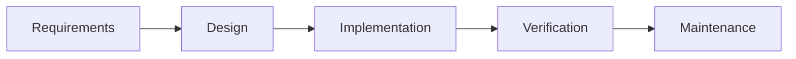
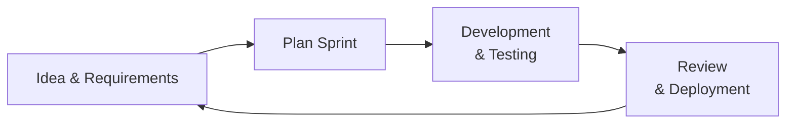
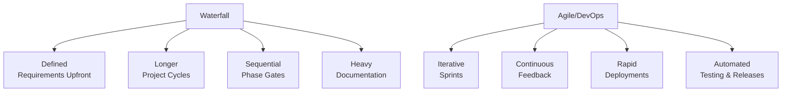

## 10.5 Systems Development Life Cycle (SDLC): Waterfall vs. Agile/DevOps

Effectively managing the life cycle of system development initiatives is a core requirement for organizations aiming to keep pace with technological change while meeting compliance and financial reporting needs. CPAs and financial professionals frequently engage with IT teams to ensure that project scopes, budgets, and risks align with organizational objectives and regulatory frameworks. This section explores two major Families of SDLC approaches—Waterfall’s linear model and Agile/DevOps’ iterative model—while assessing each approach’s impact on risk oversight, quality, and compliance.

Organizations often customize these methodologies or adopt a hybrid approach to address unique risk profiles, development timelines, and stakeholder expectations. A thorough understanding of Waterfall and Agile/DevOps helps CPAs better evaluate internal controls—especially in contexts requiring tight financial governance, regulatory compliance, and reliable audit trails.

  
Overview of the Systems Development Life Cycle (SDLC)

The Systems Development Life Cycle (SDLC) provides a structured approach to building or modifying information systems. SDLC methodologies typically include several phases:

• Initiation or Requirements Gathering  
• Planning or Design  
• Implementation or Coding  
• Testing or Verification  
• Deployment or Integration  
• Maintenance and Ongoing Improvement  

Traditional SDLC phases often appear in a specific sequence, which is especially visible in Waterfall methodologies. Agile, by contrast, compresses and repeats phases in iterative “sprints,” quickly responding to new information as it arises, leading to continuous release cycles and ongoing feedback loops.

Knowing how each approach handles these phases is critical for risk identification and mitigation. In highly regulated sectors—such as financial services, healthcare, or government—understanding methodology-driven risk factors is imperative. The type of SDLC chosen can substantially influence how quickly an organization detects and corrects errors, adheres to compliance requirements, and maintains robust control environments.

  
The Waterfall Methodology

Waterfall is a traditional, sequential SDLC methodology. Each phase is completed in full before moving on to the next, reflecting a logical progression of tasks:

• Requirements → Design → Implementation → Verification → Maintenance

Once a phase is deemed complete, teams typically do not go back. This linear structure has historically made Waterfall appealing for large-scale projects with highly stable and well-defined requirements, such as certain enterprise resource planning (ERP) or heavily regulated financial reporting systems.

Characteristics of Waterfall

1. Sequential Progression: Waterfall’s hallmark is moving in a downward, non-iterative flow. This helps define a clear start and end point for each phase.  
2. Documentation Heavy: Requirements and design details are formally documented at the beginning, creating a robust paper trail often favored by auditors.  
3. Predictable Scope and Timelines: Because requirements are defined upfront, project scope, budget, and schedules are easier to forecast.  
4. Control Emphasis: Each phase gate typically includes formal reviews or sign-offs, aligning well with change management controls (see Chapter 10.1 on Change Control Concepts).  
5. Limited Flexibility: Major changes to scope or requirements may require returning to earlier phases, incurring costs and risking schedule overruns.

Example in a Financial Institution

Consider a bank implementing a new loan origination platform that must comply strictly with government regulations and follow AICPA standards for financial data handling. Because the regulatory environment demands comprehensive design documentation, the Waterfall model ensures requirements are fully captured and approved by compliance teams before coding begins. Any mid-project changes, however, could lead to rework and timeline extensions, a risk that must be balanced against the value of robust upfront planning.

Diagram: Waterfall Model Flow

In this flow, each stage must be completed and signed off before moving on, reflecting Waterfall’s linear nature.  

  
The Agile Methodology and Emergence of DevOps

Agile emerged to address the need for rapid development and greater flexibility, especially in environments where customer needs or technical requirements evolve constantly. Agile methods—commonly encompassed under frameworks like Scrum, Kanban, or Lean—reduce the risk of delivering irrelevant or outdated functionality. DevOps is often seen as an extension of Agile’s iterative principles, integrating development and operations to enable continuous integration (CI) and continuous deployment (CD).

Characteristics of Agile

1. Iterative Development: Instead of delivering an entire project at once, Scrum or Kanban teams deliver functionality in short “sprints,” each typically lasting one to four weeks.  
2. Continuous Feedback: Teams frequently seek feedback from stakeholders, testers, and prototypes to ensure the product meets evolving business needs.  
3. Adaptive Planning: Requirements are refined over time, allowing flexibility in priorities as new insights emerge.  
4. Cross-Functional Collaboration: Agile teams often include developers, testers, business analysts, and end-users, fostering collaboration and reducing miscommunication.  
5. Self-Organizing Teams: Daily stand-up meetings and sprint retrospectives help teams manage workflow while constantly improving processes.

DevOps Builds Upon Agile

DevOps integrates the development (Dev) phase with the operation (Ops) phase, pushing for faster, more reliable releases. This model aims to reduce friction by:

• Automating Testing and Deployment: Continuous integration and continuous deployment (CI/CD) pipelines automate code merges, testing, and deployments.  
• Infrastructure as Code (IaC): Environments are managed using code (e.g., scripts, templates) for uniformity and scalability.  
• Monitoring and Observability: DevOps teams implement advanced monitoring tools, capturing metrics (e.g., CPU usage, error rates, memory consumption) to rapidly detect and address issues.  
• Culture of Collaboration: Breaking down silos between developers, IT operations, product owners, and auditors fosters integrated views of project success and risk management.

In many accounting or financial reporting engagements, DevOps can accelerate updates to systems that require frequent compliance changes, enabling organizations to adapt quickly without sacrificing control. Key to this approach is robust automated testing and continuous monitoring, which align with demands for accurate financial data and reduced risk of regulatory non-compliance.

Diagram: Simplified Agile/DevOps Iterative Flow

This cycle repeats until project objectives are met. Continuous loops of planning, building, reviewing, and feedback ensure maximum alignment with stakeholder needs and tight oversight of ongoing changes.

  
Risk Oversight in Waterfall and Agile/DevOps

Regardless of methodology, CPAs and auditors focus on ensuring data integrity, compliance with regulations, and reliable financial reporting. Each model presents unique considerations for risk oversight:

Waterfall Risk Considerations

• High Cost of Late Changes: Because each phase is dependent on the previous one, late discoveries can be costly.  
• Long Feedback Cycle: Testing is concentrated in later stages, increasing the risk of discovering errors after significant investment.  
• Strong Governance at Phase Gates: Sign-offs at each phase reinforce accountability and create well-defined audit trails.  
• Potential for Scope Creep: If requirements drift but remain “unofficial,” the project may suffer from mismatched deliverables, raising the risk of internal control gaps.

Agile/DevOps Risk Considerations

• Rapid Release Cadence: New features and changes are deployed quickly, potentially introducing errors if controls are not automated or robust enough.  
• Continuous Testing: Automated testing frameworks can detect issues earlier, lowering the risk of a widespread or prolonged impact.  
• Streamlined Documentation: Agile/DevOps teams often rely on user stories and real-time collaboration tools, which can be challenging for traditional auditors unless well-structured.  
• Dependency on Culture and Practices: Strong collaboration is vital to reduce misalignment. Without consistent discipline in sprint reviews, acceptance criteria, and code reviews, errors can accumulate.  
• Control Integration in the Pipeline: With DevOps, continuous integration and continuous deployment must embed adequate controls. This may require specialized risk assessment methods for pipeline configuration, code storage, and environment management.

In regulated industries, additional layers of governance (e.g., separation of duties, mandatory sign-offs) may be introduced into Agile/DevOps methods to maintain compliance with frameworks such as SOX, GDPR, HIPAA, or PCI DSS. Ultimately, the success of each model depends on thoughtful risk identification and robust controls designed proportionally to the scale and criticality of the system being developed.

  
Practical Examples and Case Studies

1. Mid-Sized Retailer Implementing an E-Commerce Platform  
   • Waterfall Approach: The retailer invests time early on to detail requirements for product listings, inventory management, and secure payment integration. Though lengthy, this approach helps finalize a robust architecture for data exchanges with the existing accounting system. However, new compliance mandates discovered mid-development create rework, delaying the project and escalating costs.  
   • Agile/DevOps Approach: An incremental rollout delivers new features—product browsing, checkout, user profiles—in sprints. Each sprint includes automated testing integrated with the existing financial system to ensure that sales data logs are in compliance with revenue recognition rules. Changes in compliance requirements from a new Payment Card Industry Data Security Standard (PCI DSS) update are addressed in upcoming sprints without halting broader development.

2. Global Finance Firm Moving to a Cloud-Based ERP  
   • Waterfall Approach: A comprehensive design phase ensures all financial controls are built in from the start, leveraging meticulous documentation to integrate with ledger systems across multiple geographies. However, test findings near the end of development uncover database migration challenges. Revisions at this stage require significant rewriting of code, plus re-verification of financial controls.  
   • Agile/DevOps Approach: The finance firm implements the cloud-based ERP gradually. DevOps pipelines automatically test data integrity, validate financial transactions, and confirm compliance with IFRS (International Financial Reporting Standards) updates. Frequent feedback loops from internal auditors allow quick adjustments after each sprint, mitigating scope creep and building confidence in real-time data validation.

  
Best Practices and Key Considerations

• Align Methodology with Project Risk: Waterfall may be more appropriate where requirements are highly stable and well-defined (e.g., legacy financial reporting software rewrite), while Agile/DevOps suits projects with evolving needs and rapid feedback cycles (e.g., new web or mobile financial services).  
• Strengthen Documentation in Agile/DevOps: Ensure user stories, acceptance criteria, and automated test results are well archived for audit and regulatory purposes.  
• Embed Controls into the Pipeline: In Agile/DevOps, incorporate automated checks (such as verifying segregation of duties in code approvals or controlling access to build servers) within CI/CD pipelines.  
• Leverage Phase Gates Adaptively: Even in Waterfall, embed frequent control checks rather than delaying them until after design or development. In Agile, add “mini-gates” at each sprint, reviewing risk and compliance aspects continuously.  
• Maintain Cross-Functional Collaboration: CPAs, financial analysts, risk managers, and IT teams should collaborate regularly. This practice ensures requirements consistently reflect compliance factors and financial best practices.  
• Assess Change Documentation: Whether Waterfall or Agile, maintain robust record-keeping for any requirement changes. This is especially critical for audits and for tracking the rationale behind modifications that could impact key financial controls.  
• Conduct Regular Retrospectives: Retrospectives are not solely an Agile practice. Waterfall or hybrid projects can benefit from formal post-milestone reviews to improve processes and identify or mitigate risks sooner.

  
Diagram: Comparing Waterfall vs. Agile/DevOps

  
References for Further Exploration

• Project Management Institute (PMI) – Official Guide to Project Management and methodology comparisons.  
• Scrum Guides – Definitive resources on Scrum processes, sprint cycles, and roles.  
• DevOps Research & Assessment (DORA) – Data-driven insights into DevOps practices, metrics, and organizational performance.  
• Institute of Internal Auditors (IIA) – Publications on best practices for integrating internal controls into system development and change management.  
• AICPA – Guidance on SOC engagements, especially SOC 1® and SOC 2® reporting, for verifying control frameworks in development environments.

  
## Challenge Your Knowledge: Waterfall vs. Agile/DevOps



### Which phase of Waterfall involves verifying that the product or system meets specified requirements?
- [ ] Design
- [ ] Maintenance
- [x] Verification
- [ ] Implementation

> **Explanation:** In the Waterfall model, the Verification phase is where testing occurs to ensure the system aligns with initial requirements.  

### Which Agile-related concept focuses on breaking silos between Development and Operations teams?
- [ ] Scrum
- [ ] Waterfall
- [ ] Daily Stand-ups
- [x] DevOps

> **Explanation:** DevOps integrates development and operations, emphasizing continuous integration, continuous deployment, collaboration, and monitoring.  

### In Agile, which principle most helps reduce the risk of delivering irrelevant features?
- [ ] Completing all documentation upfront
- [x] Iterative development with continuous feedback
- [ ] Conducting a single test phase at the end
- [ ] Employing only senior developers

> **Explanation:** Agile’s iterative cycles and regular feedback loops ensure the system being developed remains closely aligned with evolving user needs.  

### In the Waterfall method, returning to fix a fundamental design flaw discovered late in the project is typically:
- [ ] Quick and easy
- [x] Expensive and time-consuming
- [ ] Impossible under any circumstances
- [ ] Handled completely by external auditors

> **Explanation:** Waterfall’s sequential nature means design errors discovered late require redoing earlier phases, leading to extensive rework and increased costs.  

### Which of the following is a key advantage of integrating continuous testing into a DevOps pipeline?
- [x] Early detection of defects
- [ ] Larger batch releases
- [x] Faster feedback for developers
- [ ] Less reliance on automation

> **Explanation:** Continuous testing spots defects quickly, providing immediate developer feedback. Early detection and rapid responses reduce the chances of widespread errors.  

### How do Agile projects typically track requirements for each sprint?
- [x] Using user stories and product backlogs
- [ ] By finalizing all requirements upfront
- [ ] By storing them only in archival documentation
- [ ] By avoiding documentation altogether

> **Explanation:** Agile leverages user stories, which define feature expectations from the end-user’s perspective. These user stories, maintained in a product backlog, guide sprint planning and development.  

### What is one benefit of Waterfall’s phase-gate approvals in highly regulated environments?
- [x] Clear checkpoints for compliance reviews
- [ ] Fewer documents required
- [x] Predictable scope expansions
- [ ] Real-time feedback cycles

> **Explanation:** Formal sign-offs at the end of each phase provide defined checkpoints, allowing compliance teams to review documentation and system designs systematically.  

### In Agile/DevOps, what is the main strategy to mitigate the risk of rapid deployments introducing errors?
- [x] Automated testing and continuous integration
- [ ] Eliminating iteration and focusing only on final deliverables
- [ ] Relying solely on developer experience
- [ ] Disabling production monitoring tools

> **Explanation:** Automated testing and continuous integration are cornerstones of Agile/DevOps, catching errors quickly, preventing them from propagating into production.  

### Why might a financial institution choose a hybrid approach blending Waterfall and Agile/DevOps for its IT projects?
- [ ] It wants inconsistent methods across departments
- [x] It requires upfront compliance sign-offs yet also needs flexibility
- [ ] It has no need for internal controls
- [ ] It wants to avoid all documentation

> **Explanation:** Hybrid models allow essential regulatory requirements—often addressed upfront using Waterfall-like documentation—while providing iterative releases and updates through Agile/DevOps practices.  

### Waterfall is generally best suited for projects with highly stable and well-defined requirements.  
- [x] True 
- [ ] False

> **Explanation:** Waterfall’s strength lies in situations where requirements are unlikely to change. Once a project starts downstream phases, going back to redesign can be costly and disruptive, making Waterfall ideal when scope stability is assured.



## For Additional Practice and Deeper Preparation

### [Information Systems and Controls (ISC)](https://www.udemy.com/course/isc-cpa-mock-exams/?referralCode=E1217303222935C5E464)

Information Systems and Controls (ISC) CPA Mocks: 6 Full (1,500 Qs), Harder Than Real! In-Depth & Clear. Crush With Confidence! 

• Tackle full-length mock exams designed to mirror real ISC questions.  
• Refine your exam-day strategies with detailed, step-by-step solutions for every scenario.  
• Explore in-depth rationales that reinforce higher-level concepts, giving you an edge on test day.  
• Boost confidence and minimize anxiety by mastering every corner of the ISC blueprint.  
• Perfect for those seeking exceptionally hard mocks and real-world readiness.

_Disclaimer: This course is not endorsed by or affiliated with the AICPA, NASBA, or any official CPA Examination authority. All content is for educational and preparatory purposes only._
