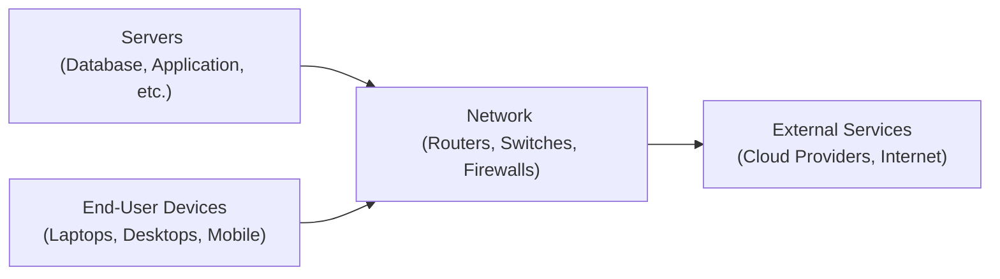

## 5.1 Hardware Components: Servers, End‑User Devices, and Networks

Hardware components serve as the physical foundation of every organization’s IT ecosystem. Whether hosting financial data, running complex enterprise applications, or facilitating daily communication, hardware lies at the core of operational integrity. Because all accountants and IT audit professionals rely on robust and reliable hardware platforms, understanding common vulnerabilities and applying the right controls is crucial to maintaining both financial accuracy and regulatory compliance.

This section explores three main categories of hardware: servers, end-user devices, and networks. It also delves into how each category introduces security vulnerabilities and the control measures auditors, CPAs, and management teams should implement.

### The Importance of Hardware in an IT Environment
Organizations—particularly financial institutions—depend on hardware to process critical data in areas such as general ledger operations, accounts payable, inventory management, client relationship management, and more. Without secure and reliable hardware:

• Transaction data becomes compromised or lost.  
• Incorrect information could be made available to management or auditors.  
• Production workflows risk severe downtime and reputational damage.

Because hardware underpins virtually all aspects of IT, it is also a prime focal point for risk assessment. As you will discover in Chapter 8 (IT General Controls) and Chapter 16 (Foundations of Cybersecurity), effective controls around hardware can prevent a cascade of system-wide vulnerabilities.

---

### Servers: The Backbone of Enterprise Infrastructure

Servers are specialized computers designed to handle heavy processing workloads, manage multiple simultaneous user requests, store vast amounts of data, and run critical business applications (such as ERP systems discussed in Chapter 6). Servers are typically installed in data centers or server rooms, which are dedicated facilities with enhanced physical and environmental controls.

#### Common Types of Servers  
• File and Print Servers: Manage file storage and printing services for a network.  
• Application Servers: Host and run business applications (ERP, CRM, etc.).  
• Database Servers: Store, organize, and process large volumes of structured data (see Chapter 12).  
• Web Servers: Deliver web pages or applications over the internet or intranet.  
• Virtualization Hosts: Run multiple virtual machines (VMs) for better resource utilization.  

#### Potential Vulnerabilities in Servers  
1. Physical Tampering and Theft  
   Poorly secured server rooms can allow unauthorized individuals to tamper with or steal physical hardware. This can lead to data breaches, service interruption, and reputational harm.

2. Insider Threats  
   Privileged users with direct server access can intentionally or unintentionally alter configurations or copy sensitive data.  

3. Unpatched Firmware and Operating Systems  
   Servers running outdated firmware or unpatched operating systems are at risk of a wide range of exploits, enabling attackers to gain unauthorized access.  

4. Hardware Failure  
   Overheating, improper ventilation, or inadequate power backup in data centers can lead to physical hardware failure, endangering data availability and integrity.

5. Inadequate Configuration  
   Misconfigured access controls, insecure services, or open ports on servers can expose an environment to threats like ransomware and advanced persistent threats (APTs).

#### Key Controls for Servers  
• Physical Security Measures  
  – Restricted access to server rooms (biometric locks, surveillance cameras).  
  – Environmental controls such as temperature monitoring, fire suppression, and uninterruptible power supplies (UPS).  

• Hardening and Configuration  
  – Regular patches, service pack installations, and anti-malware updates.  
  – Disabling unnecessary services and closing unused ports.  
  – Implementing secure password guidelines and role-based access controls.  

• Monitoring and Logging  
  – Continuous monitoring for unusual activities.  
  – Logging of system events with log retention aligned to regulatory requirements.  

• Redundancy and High Availability  
  – RAID (Redundant Array of Independent Disks) for disk fault tolerance.  
  – Clustered or mirrored servers to ensure continuous service in case of a failure.  
  – Routine backup and restore testing to validate data recovery processes.  

• Segregation of Duties  
  – Separate server administration tasks from auditing responsibilities to ensure that no single individual has unchecked power over data and settings.  

These controls are directly linked to the broader IT General Controls (ITGCs) framework discussed in Chapter 8, emphasizing their importance in an operational audit and financial statement audit context.

---

### End-User Devices: Gateway to Organizational Data

Intended for daily operations, end-user devices (laptops, desktops, smartphones, tablets, point-of-sale terminals, etc.) are the final link in delivering information to individual staff, management, and, in some cases, external stakeholders. These devices are often the most visible (and most vulnerable) hardware layer, as they interact with servers, cloud services, and even personal networks (outside corporate firewalls).

#### Potential Vulnerabilities in End-User Devices  
1. Malware and Ransomware  
   Users may inadvertently download malicious software by clicking links in phishing emails or visiting compromised websites.

2. Unauthorized Software Installation  
   Without proper controls, staff can install unapproved or pirated applications, which may contain malware or create compatibility issues.  

3. Data Leakage Through External Media  
   USB drives, memory cards, or external hard drives can be used to copy confidential data from endpoints.

4. Device Theft or Loss  
   Portable devices (laptops, smartphones) are susceptible to theft in public spaces, leading to compromised corporate data if not encrypted.

5. Inconsistent Patch Management  
   Missing updates and patches at the endpoint level leave security gaps, especially if the device operates outside corporate networks.  

6. User Misconfiguration  
   Employees may disable encryption, antivirus tools, or firewalls to increase convenience, exposing the device—and the organization—to threats.

#### Key Controls for End-User Devices  
• Endpoint Protection Platforms (EPP) and Endpoint Detection and Response (EDR)  
  – Integrated technologies that provide antivirus, anti-malware, firewall, and intrusion detection capabilities.  

• Patch Management and Software Updates  
  – Centrally managed patch deployment and update policies (see Chapter 10 on Change Management for more details).  
  – Automatic updates for operating systems and critical software.

• Physical Security  
  – Laptop locks and secure cabinets for on-site storage.  
  – Policies requiring staff to never leave devices unattended, especially in public areas.

• Encryption and Data Protection  
  – Hard drive encryption using solutions like BitLocker (Windows) or FileVault (macOS).  
  – Remote wipe capabilities for lost or stolen devices.

• Strong Authentication and Access Control  
  – Enforcing robust password policies or multi-factor authentication (MFA).  
  – Role-based privileges to ensure sensitive data is only accessed by authorized personnel.

• Mobile Device Management (MDM)  
  – Centralized oversight of mobile hardware, with remote locking and wipe features.  
  – Policy enforcement that includes app restrictions, posture control, and geolocation tracking.

• Acceptable Usage Policies  
  – Clear guidelines on authorized software installation and internet usage.  
  – Periodic training to raise employee awareness about daily cybersecurity threats.

Securing end-user devices is often the first line of defense against data breaches. Many enterprise-wide security policies outlined in Chapter 16 (Foundations of Cybersecurity) and Chapter 17 (Security Architecture and Network Management) rely on consistent endpoint controls to reduce risk systematically.

---

### Networks: Connecting Systems, Sharing Resources

Networks provide the pathways for data transmission among servers, end-user devices, and external resources. A robust network infrastructure ensures data integrity, availability, and confidentiality. Because networks often span wide areas (including the internet), they are prime targets for a host of threat actors.

#### Network Components  
• Routers: Forward data packets between different networks, selecting the best path.  
• Switches: Connect devices on a local area network (LAN) and manage data flow within the organization.  
• Firewalls: Filter incoming and outgoing traffic according to predefined rules, preventing unauthorized access.  
• Intrusion Detection Systems (IDS) / Intrusion Prevention Systems (IPS): Monitor network traffic for suspicious activities.  
• Wireless Access Points (WAPs): Enable wireless connectivity for laptops, mobile devices, and IoT endpoints.  
• Virtual Private Networks (VPNs): Securely extend private networks across public infrastructure (like the internet).

#### Common Network Vulnerabilities  
1. Insecure Network Architecture  
   Poorly segmented networks, unprotected wireless access points, or default credentials used by network devices expose an organization to attacks.

2. Weak Perimeter Defenses  
   Firewalls and gateways lacking robust filtering rules become easy entry points for hackers.

3. Distributed Denial of Service (DDoS) Attacks  
   Attackers can flood network resources, crippling network availability and preventing legitimate access.

4. Unencrypted Traffic  
   Transmitting sensitive data in plain text can be intercepted by eavesdroppers or malicious insiders.

5. Rogue Devices  
   Unsanctioned devices on the corporate network (e.g., personal Wi-Fi routers or unauthorized IoT devices) may bypass established security policies.

6. Lack of Continuous Monitoring  
   Without real-time observation and alerting, suspicious network behaviors can go unnoticed.

#### Network Controls and Best Practices  
• Perimeter Security (Firewalls and Gateways)  
  – Implement next-generation firewalls capable of deep-packet inspection.  
  – Maintain strict inbound and outbound traffic rules and regularly audit firewall configurations.

• Network Segmentation  
  – Isolate critical servers and sensitive data in separate VLANs or subnets.  
  – Restrict network access based on specific job functions or device types (see Chapter 18 on Access Management).

• Secure Communication Protocols  
  – Use secure protocols (HTTPS, SSL/TLS, SSH, SFTP) to encrypt data in transit.  
  – Deploy site-to-site or remote-access VPN solutions for external connections.

• Wireless Security  
  – Enforce strong wireless encryption (WPA2 or WPA3) with robust pre-shared keys or certificate-based authentication.  
  – Segment guest wireless networks to limit access to internal resources.

• Intrusion Detection and Prevention  
  – Employ IDS/IPS solutions and configure them to log and raise alerts for suspicious activities.  
  – Use Security Information and Event Management (SIEM) tools to aggregate and analyze logs from multiple network devices.

• DDoS Protection  
  – Use traffic scrubbing services that filter out malicious requests.  
  – Monitor network bandwidth and define thresholds to trigger alerts.

• Continuous Monitoring and Vulnerability Scanning  
  – Schedule regular scans (internal and external) to detect potential weaknesses.  
  – Implement a network monitoring system for real-time performance and threat detection.

By reinforcing network defenses, organizations maintain transaction integrity and privacy, vital for financial processes and compliance efforts (e.g., SOX, HIPAA, PCI DSS). These controls cross-reference with the network security strategies outlined in Chapter 17 (Security Architecture and Network Management) and the broader incident response frameworks in Chapter 20.

---

### Putting It All Together: A Holistic Hardware Landscape

Below is a simplified mermaid diagram illustrating a typical organizational hardware setup. While actual environments can be far more complex, this conceptual view helps visualize the key hardware components and their interactions.

In this diagram, servers (A), end-user devices (B), and the network (C) all interplay. Communication with external services (D) is facilitated through secure gateways and perimeter security. Each layer must maintain effective controls to ensure the overall reliability, security, and auditability of the organization’s systems.

---

### Real-World Financial Example: Retail Chain Point-of-Sale Infrastructure

Consider a retail chain with multiple stores whose point-of-sale (POS) devices process transactions. Here is how hardware vulnerabilities might manifest:

• Servers on-site store sales data during business hours, then upload nightly to a central enterprise resource planning (ERP) system. If server patches are outdated, attackers can intercept or manipulate sales records.  
• End-user devices: Employees use tablets for inventory checks. A lost or stolen tablet with saved credentials could compromise store financial data.  
• The store network relies on wireless access points for real-time product lookups. If the wireless network is not segregated or encrypted properly, an intruder could sniff transmissions or introduce malware.

Controls countering these risks include physically securing server closets, implementing MDM solutions to encrypt and control tablets, and configuring wireless LANs with strong encryption and separate guest networks. Regular audits and inventory checks of POS devices detect unnoticed replacements or additions.

---

### Practical Tips and Common Pitfalls

• Regularly update hardware inventories: It is easy to lose track of endpoints and server components, especially in large organizations. Un inventoried hardware is a high risk for unknown vulnerabilities.  
• Avoid default vendor settings: Hackers often seek out devices still running default credentials. Change passwords and update configurations promptly.  
• Monitor device end-of-life cycles: Operating legacy servers or out-of-support endpoints can severely compromise security. Develop a structured retirement plan for aging hardware.  
• Don’t ignore physical access: All the network controls in the world will not matter if an attacker can walk away with a server backup drive or log into an unlocked workstation.  
• Conduct routine compliance checks: Cross-check your hardware setup against relevant standards (COBIT, NIST, PCI DSS) to maintain regulatory alignment.

---

### References for Further Exploration

• NIST Special Publication 800-53: Security and Privacy Controls for Information Systems and Organizations  
• ISO/IEC 27002: Guidelines for organizational information security standards  
• AICPA SOC 2® Trust Services Criteria: Focus on security, availability, processing integrity, confidentiality, privacy  
• SANS Institute Whitepapers: Provide deep dives into endpoint and server security measures  

---

## Test Your Knowledge: Key Hardware Components and Controls



### Which hardware category is most often targeted by attackers through phishing emails and malware downloads?
- [ ] Servers in the data center
- [ ] Routers and Switches
- [x] End-user devices
- [ ] Firewalls
> **Explanation:** Most phishing attempts and ransomware threats are directed at end-user devices (e.g., laptops, desktops, mobile devices) because they are the easiest entry point into an organization.

### Which is a critical control for high-availability server environments?
- [x] RAID configurations and clustered servers
- [ ] A single point-of-failure design
- [ ] Infrequent firmware updates
- [ ] Disabling monitoring logs
> **Explanation:** RAID and server clustering enable redundancy, ensuring that if one component fails, the system remains operational.

### When discussing endpoint security, which measure helps protect against device theft or loss?
- [ ] Deactivating file encryption features
- [x] Remote wipe and full-disk encryption
- [ ] Turning off automatic updates
- [ ] Using only a single sign-on (SSO) option
> **Explanation:** Full-disk encryption and remote wipe capabilities allow organizations to secure data even if a device is stolen or lost.

### Why is network segmentation considered a vital control measure?
- [x] It limits lateral movement across an organization’s internal systems.
- [ ] It reduces the number of devices users are allowed to install.
- [ ] It replaces the need for server redundancy.
- [ ] It automatically patches all endpoints without user interaction.
> **Explanation:** By segmenting networks, individuals or malware that gain unauthorized access to one section cannot easily move to other, more sensitive areas.

### Which of the following ensures a consistent baseline security configuration for end-user devices?
- [ ] Allowing open software installation
- [ ] Letting each user set device settings
- [x] Centrally managed patch management
- [ ] Permitting direct user access to server rooms
> **Explanation:** Centralized management of patches and settings ensures that all end-user devices comply with established security policies.

### Which type of control limits physical access to servers?
- [ ] Encryption software
- [x] Biometric locks or access card systems
- [ ] Password changes every 90 days
- [ ] Wireless network segmentation
> **Explanation:** Physical access controls such as biometric locks and keycard access significantly reduce the risk of unauthorized hands-on tampering.

### What is a significant risk of not having a hardware inventory?
- [x] Undetected devices can remain unpatched and pose threats.
- [ ] The organization faces no real fiscal impact.
- [ ] It simplifies licensing compliance for software.
- [ ] It streamlines vendor management.
> **Explanation:** Undocumented devices are ripe for exploitation because they often remain unmonitored and unpatched, increasing security gaps.

### Which device is typically responsible for directing data packets within the local network?
- [x] Switch
- [ ] Firewall
- [ ] IDS/IPS
- [ ] Access point
> **Explanation:** Switches are key in managing data flow in LAN environments, ensuring data is directed to the appropriate device.

### What is one method to reduce equipment failure due to power fluctuations?
- [x] Installing an uninterruptible power supply (UPS)
- [ ] Unplugging the server overnight
- [ ] Employing a bring-your-own-device (BYOD) approach
- [ ] Relying on a single power grid source
> **Explanation:** A UPS can regulate power supply, protect against surges, and give servers enough time to shut down properly in case of power loss.

### True or False: Physical security for server rooms is considered less important than software-based controls.
- [x] True
- [ ] False
> **Explanation:** This statement is actually false. Physical security is at least as critical as software-based controls, because without physical safeguards, an attacker can directly manipulate hardware or remove it entirely.



---

## For Additional Practice and Deeper Preparation

### [Information Systems and Controls (ISC)](https://www.udemy.com/course/isc-cpa-mock-exams/?referralCode=E1217303222935C5E464)

**Information Systems and Controls (ISC) CPA Mocks:** 6 Full (1,500 Qs), Harder Than Real! In-Depth & Clear. Crush With Confidence!

- Tackle full-length mock exams designed to mirror real ISC questions.  
- Refine your exam-day strategies with detailed, step-by-step solutions for every scenario.  
- Explore in-depth rationales that reinforce higher-level concepts, giving you an edge on test day.  
- Boost confidence and minimize anxiety by mastering every corner of the ISC blueprint.  
- Perfect for those seeking exceptionally hard mocks and real-world readiness.

_Disclaimer: This course is not endorsed by or affiliated with the AICPA, NASBA, or any official CPA Examination authority. All content is for educational and preparatory purposes only._
