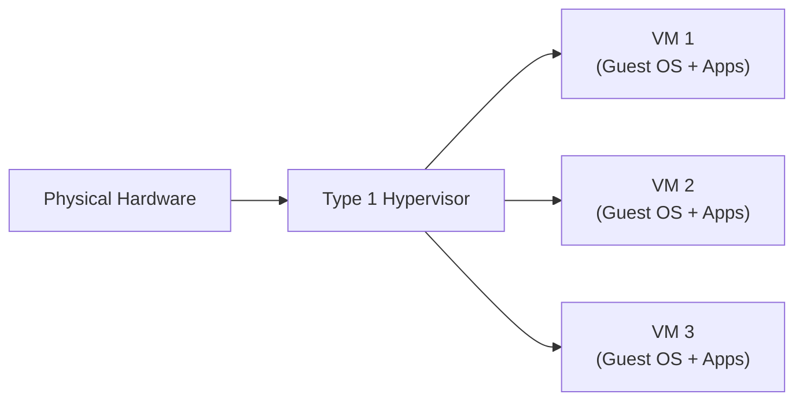
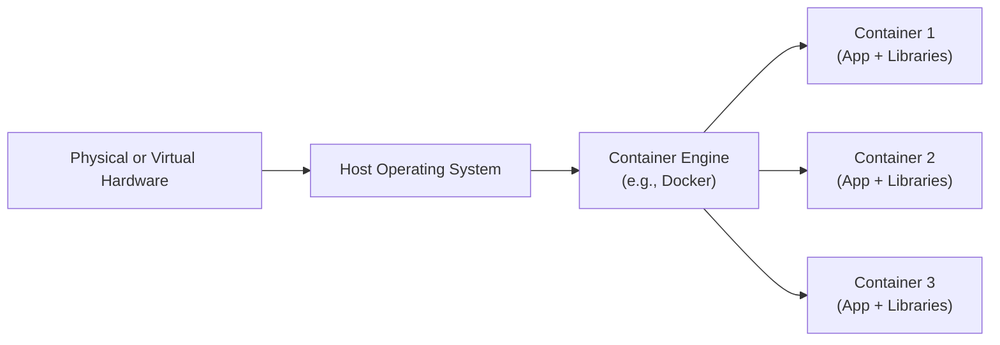

## 5.2 Operating Systems and Virtualization Concepts

In today’s digital landscape, operating systems (OS) and virtualization technologies form a critical backbone of IT architecture. They influence everything from hardware utilization to data security, and consequently, they play a major role in financial reporting systems and audits. As a Certified Public Accountant (CPA) interested in Information Systems and Controls (ISC), understanding these core concepts empowers you to evaluate the integrity and reliability of the technological infrastructure within an organization, identify risks, and propose relevant control activities.

This section examines how operating systems function as the fundamental layer between hardware and application software. We will also explore virtualization concepts, including the differences between traditional virtual machines and container-based architectures. These insights will help you grasp the risk areas, control considerations, and optimization opportunities associated with operating systems and virtualized environments.

--------------------------------------------------------------------------------

### Introduction to Operating Systems

An operating system is the foundational software that controls and coordinates all resources—hardware, software, and user interfaces—within a computing environment. It provides a structured platform on which application software can run. Typical tasks performed by an OS include:

• Managing hardware resources (CPU, memory, peripheral devices)  
• Overseeing process scheduling (deciding which process runs at any given time)  
• Handling storage and file system operations  
• Enforcing security policies (access controls, authentication)  
• Providing a user interface (command-line or graphical user interface)

When you consider an organization’s IT environment, operating systems manage the day-to-day operations for everything from personal laptops to large-scale servers hosting Enterprise Resource Planning (ERP) systems. From an accounting perspective, the OS is vital in ensuring that financial data is processed accurately and securely. Even routine tasks, such as file permissions and folder structures, directly affect data confidentiality and the reliability of transaction records.

#### Core Responsibilities of an Operating System

1. **Process and Thread Management**  
   The OS decides how to allocate processor time to multiple programs (or threads within a program). Concepts like context switching, process scheduling algorithms, and multi-threading help ensure optimal performance and responsiveness.

2. **Memory Management**  
   This function ensures that each running application is assigned the necessary amount of memory without interference from other applications. Techniques like paging, segmentation, and virtual memory management help maximize the efficient use of a system’s RAM.

3. **Device Management**  
   An OS coordinates input/output (I/O) operations from hardware devices (e.g., keyboard, mouse, printer, network adapters, graphical displays). Common device management techniques ensure seamless user experience and consistent data flow among components.

4. **File System Management**  
   The OS organizes data in structured directories and files, allowing easy retrieval and storage. File systems must ensure integrity (prevent data corruption) and compliance with access control policies, which can be of utmost importance in financial audits.

5. **User Interface and Account Management**  
   OSs typically offer a means by which a user can interact with the system: command-line interfaces (CLI) or graphical user interfaces (GUI). With account management, administrators can set privileges and define which users can access sensitive data.

6. **Security and Access Controls**  
   Operating systems enforce security measures such as password protocols, user permission levels, and in more advanced cases, encryption at the file-system level. A robust OS security framework is essential to protect financial information from unauthorized access or tampering.

#### Types of Operating Systems

• **Desktop OS** (e.g., Microsoft Windows, macOS, Linux distributions for desktop): Focuses on ease-of-use, multimedia capabilities, and supporting a wide range of applications.  
• **Server OS** (e.g., Windows Server, Linux [Ubuntu, Red Hat, SUSE], UNIX variants, IBM i): Prioritizes stability, security, and resource management for higher workloads and multi-user environments, commonly hosting databases, ERP systems, or financial applications.  
• **Mobile OS** (e.g., Android, iOS): Manages resources for mobile devices, typically building in security features like sandboxing apps and remote-wipe capabilities.

--------------------------------------------------------------------------------

### OS Architecture and Financial Data Considerations

CPAs and IT auditors often focus on potential vulnerabilities in operating system configurations that can impact the integrity and security of financial data. For instance, unpatched OS vulnerabilities can lead to exploits where attackers gain unauthorized access to critical financial records. Weak password policies or over-privileged user accounts can expose sensitive company information. Consequently, it is paramount to align operating system controls with established frameworks like COBIT, COSO Internal Control – Integrated Framework, and other industry standards (see Chapters 3.3 and 8 for more on aligning with frameworks).

When evaluating a client’s IT controls, you might look for:

• **Security Patches and Updates**: Are systems regularly updated with the latest security patches?  
• **Access Controls**: Does the OS enforce role-based access control and periodic password changes?  
• **Event Logging and Monitoring**: Are logs stored securely and reviewed for anomalies?  
• **Backup and Recovery Policies**: Are system and application data backed up consistently, and are restore tests performed?  
• **Change Management**: How are OS and application updates approved, documented, tested, and deployed?

--------------------------------------------------------------------------------

### From Single Servers to Virtual Environments

Historically, organizations ran one operating system per physical machine. As computing demands evolved, so did the need for more efficient use of hardware, leading to **virtualization**. Virtualization allows multiple independent operating systems (virtual machines) to run on a single physical host, each with its own applications and user environments.

This shift is highly relevant to accountants and auditors, as virtual machines (VMs) can centralize operations and reduce hardware costs while introducing new complexities and risks. For instance, a single compromised hypervisor could jeopardize multiple guest systems. Understanding these dynamic architectures is key for performing accurate risk assessments.

#### Key Drivers of Virtualization

1. **Hardware Efficiency**: Virtual machines share a pool of resources (CPU, memory, storage), reducing the number of physical servers needed.  
2. **Scalability**: Administrators can easily provision or decommission VMs based on fluctuating demands.  
3. **Disaster Recovery and High Availability**: Snapshots of VMs can be replicated offsite to accelerate recovery.  
4. **Isolation**: Even if two VMs run on the same physical hardware, they remain logically separate, protecting each environment from faults in others.

--------------------------------------------------------------------------------

### Virtualization: How It Works

Virtualization is achieved primarily through a software layer called a **hypervisor**. The hypervisor communicates directly with the physical hardware (Type 1) or on top of another operating system (Type 2) to create and manage virtual machines.

1. **Type 1 (Bare-Metal) Hypervisors**  
   Examples: VMware ESXi, Microsoft Hyper-V, Citrix Hypervisor (XenServer).  
   A Type 1 hypervisor runs directly on the host machine’s hardware, making it more efficient and commonly used in enterprise data centers.

2. **Type 2 (Hosted) Hypervisors**  
   Examples: VMware Workstation, Oracle VirtualBox.  
   A Type 2 hypervisor runs within a conventional OS on a host machine, making it simpler for end-user computing but typically less performant for large-scale production environments.

In either case, underlying hardware resources, such as CPU and memory, are virtualized by the hypervisor and shared among the guest operating systems (or VMs). Each VM is isolated, with its own virtual disks, network interfaces, and security regime.

Below is a simple diagram summarizing how these elements fit together in a bare-metal virtualization scenario:

> In the above diagram, each virtual machine (VM 1, VM 2, VM 3) runs a guest operating system (e.g., a Windows Server OS or a Linux distribution) and corresponding applications. However, all VMs share the same physical computing hardware, governed by the Type 1 (bare-metal) hypervisor.

--------------------------------------------------------------------------------

### Containerization vs. Traditional Virtual Machines

While virtualization allows multiple OS instances on a single host, **containerization** focuses on packaging applications with only the necessary libraries and dependencies. Each container shares the host OS kernel, making containers lighter-weight than full virtual machines. Key container technologies include Docker, Kubernetes, and other container orchestration platforms.

1. **Containers vs. VMs**  
   - **OS Layer**: VMs each have their own OS kernel, whereas containers share the host OS kernel.  
   - **Resource Footprint**: Containers are generally smaller, faster to spin up/shut down, and more efficient in resource usage than VMs.  
   - **Isolation**: Containers isolate applications at the process level, which can introduce heightened risks if vulnerabilities in the shared OS kernel are exploited.  
   - **Deployment Speed**: Container-based deployments allow rapid scaling, making them popular for DevOps and microservices architectures.

2. **Container Technology**  
   - **Docker**: A widely used container platform that allows developers to package an application with all necessary components into a portable container image.  
   - **Kubernetes**: An orchestration tool designed to manage multiple containers across a cluster of machines, handling load balancing, scaling, and fault tolerance.

Consider the following diagram illustrating container architecture on a host OS:

> Each container houses the application code, runtime, system libraries, and binaries, but shares the underlying OS kernel. This makes containers more lightweight than full VMs.

#### Why Containers Matter to CPAs

Financial institutions often adopt container solutions to rapidly develop, test, and deploy applications, including microservices that handle high-volume transactional data or specialized accounting modules. For instance, a container orchestration platform might host real-time analytics engines to process large volumes of financial transactions. From an audit perspective, you should verify that:

• Proper network segmentation and isolation measures are in place.  
• Container images are scanned for vulnerabilities.  
• Deployment processes are tightly controlled, including code versioning and change management.  
• Access to container registries is restricted based on least-privilege principles.

--------------------------------------------------------------------------------

### Financial Use Cases for Virtualization and Containers

1. **ERP Systems on Virtual Machines**  
   Organizations frequently deploy complex ERP systems (see Chapter 6) on VMs for agility and improved disaster recovery. Auditors need to confirm that the hypervisor and guest OS are securely configured and that resource demands of ERP modules are met without performance degradation.

2. **Business Continuity and High Availability**  
   Virtualization simplifies creating and maintaining backups or replicas of critical financial servers. This approach reduces downtime and ensures faster recovery, aligning with the business continuity strategies described in Chapter 9.

3. **Container-Based DevOps for Financial Software**  
   Development teams in finance may adopt container-based pipelines for building and deploying custom applications. This modern approach speeds up release cycles and reduces discrepancies between development, staging, and production environments. Auditors may examine the change management process (see Chapter 10) and container security policies to mitigate risks.

4. **Cost Optimization**  
   Virtualization and containerization often lower hardware, power, and maintenance costs. These efficiencies can directly impact an organization’s financial statements and budget allocations for IT resources.

--------------------------------------------------------------------------------

### Security and Control Considerations

When operating in a virtualized or containerized environment, you should be mindful of the following key controls:

• **Hypervisor Security**: A compromised hypervisor places all hosted VMs at risk. Frequent patching, minimal exposure on the network, and strict access policies are critical.  
• **Guest OS Hardening**: Each virtual machine must follow best practices for OS security: limiting services, configuring firewalls, and using strong authentication.  
• **Container Security**: Scanning container images for known vulnerabilities, restricting privileges in container runtime, and controlling inter-container communication are vital to preventing data breaches.  
• **Network Segmentation**: Logical isolation between VMs or containers hosting sensitive financial data and less critical environments helps contain threats. Software-defined networking (SDN) can also enforce micro-segmentation.  
• **Monitoring and Logging**: Monitoring OS-level logs, hypervisor events, and container runtime logs ensures that anomalies can be quickly identified and investigated.  
• **Incident Response Plans**: In the event of a security incident, well-documented and tested response procedures, including forensic analysis, help minimize damage (see Chapter 20).

--------------------------------------------------------------------------------

### Practical Finance Examples and Case Studies

1. **Case Study: Virtualization in a Mid-Sized Accounting Firm**  
   A regional accounting firm transitions from 20 standalone servers to a cluster of virtual machines in a single data center. By consolidating servers onto a Type 1 hypervisor, they reduce hardware expenses by 40%. However, auditors discover that local administrators configured the hypervisor interface with default passwords, posing a serious vulnerability. The firm takes corrective action, implementing strong password policies and multi-factor authentication at the hypervisor level.

2. **Case Study: Containerized Tax Reporting Application**  
   A fintech startup builds a container-based application that collects tax information from users, processes it, and generates required filings. Containers enable quick scaling during peak tax season. As part of an IT audit, CPAs discover an outdated container image with library vulnerabilities. By enforcing an automated pipeline for scanning container images, the company mitigates security risks without delaying customer service.

3. **Case Study: Real-Time Fraud Detection**  
   A financial institution leverages containers to deploy microservices issuing alerts when suspicious transactions occur in real time. By distributing containers across multiple servers, the system achieves high availability and near-instant scaling. During a risk review, the auditors confirm the microservices are restricted to a private subnet, logging every activity, and integrated with the central monitoring dashboard, ensuring compliance with internal controls.

--------------------------------------------------------------------------------

### Best Practices

• **Patch and Update Management**: Maintain regular patch cycles for both the underlying host OS and all guest systems, including containers.  
• **Least Privilege**: Configure hypervisor and container registry access to only the roles/users who truly need it.  
• **Segregate Production and Test Environments**: Inadvertent leakage or cross-contamination of data can occur if test environments share the same OS or container clusters as production.  
• **Documentation**: Maintain updated documentation of virtual machine and container deployments, network configurations, and security controls for effective audits and reviews.  
• **Automate Compliance Checks**: Tools exist to continuously scan container images, hypervisor settings, and OS configurations against benchmarks such as CIS (Center for Internet Security). Integrating such tools into your DevOps pipeline can help detect misconfigurations early.

--------------------------------------------------------------------------------

### References for Further Exploration

• “Virtualization and Cloud Computing” by VMware Press  
• “Docker Deep Dive” by Nigel Poulton  
• Official documentation for Docker (docs.docker.com) and Kubernetes (kubernetes.io)  
• Microsoft Hyper-V documentation and training resources  
• Center for Internet Security (CIS) Benchmarks for multiple operating systems and containers  

--------------------------------------------------------------------------------

## Test Your Knowledge of Operating Systems and Virtualization



### Which of the following is a primary role of an operating system?

- [x] Managing hardware resources and providing a platform for applications  
- [ ] Converting all code from legacy formats  
- [ ] Encrypting all communications without user input  
- [ ] Providing built-in tax calculation features  

> **Explanation:** An operating system controls the hardware resources such as CPU, memory, and I/O devices, enabling the proper execution of applications. While encryption or specialized functions like tax calculations may be configured, they are not the primary roles of an OS.

### Which statement best describes a Type 1 (bare-metal) hypervisor?

- [x] It runs directly on physical hardware without requiring a host operating system  
- [ ] It is installed on top of an existing desktop OS to provide virtualization  
- [ ] It must use only open-source technologies  
- [ ] It shares its kernel with guest systems  

> **Explanation:** A Type 1 hypervisor interacts directly with the hardware, unlike a Type 2 hypervisor that operates within a traditional OS layer.

### What is one key difference between containers and virtual machines?

- [x] Containers share the host OS kernel, while VMs each have their own OS kernel  
- [ ] Containers cannot be used in production environments due to security issues  
- [ ] Virtual machines do not isolate applications from each other  
- [ ] Containers need a separate hypervisor for each container  

> **Explanation:** Containers rely on the host OS kernel, making them lightweight, whereas each VM runs its own operating system instance.

### Which of the following best describes a potential risk when using container technology?

- [x] Any underlying vulnerability in the shared kernel can affect all containers  
- [ ] Containers make it impossible to scale applications  
- [ ] Container images must always be public and cannot be stored privately  
- [ ] Containers cannot be secured with firewalls or authentication controls  

> **Explanation:** Because containers share the same kernel, any kernel-level vulnerability threats can propagate across multiple containers.

### When deploying multiple ERP modules on virtual machines, which control consideration is most important?

- [x] Ensuring hypervisor security and adequate resource allocation to each VM  
- [ ] Storing all data only on one VM to reduce clutter  
- [x] Preventing privileged access to the hypervisor console from unauthorized users  
- [ ] Eliminating network segmentation between VMs to improve performance  

> **Explanation:** Protecting the hypervisor and verifying that each VM receives adequate system resources are critical measures; so is restricting privileged access to the hypervisor. Conversely, centralizing all data on one VM can present significant risks, and lack of segmentation can create vulnerabilities.

### Which of the following best exemplifies a benefit of virtualization for disaster recovery?

- [x] Rapid creation and replication of virtual machine snapshots  
- [ ] Reduced password management obligations  
- [ ] Elimination of OS patching  
- [ ] Physical duplication of all server hardware  

> **Explanation:** A major advantage of virtualization is the ease of creating snapshots and restoring them quickly, which reduces recovery time in disaster scenarios.

### In a containerized financial application, which step is crucial for security?

- [x] Regularly scanning container images for known vulnerabilities  
- [ ] Prohibiting code reviews for confidentiality  
- [x] Restricting container registry access to authorized personnel  
- [ ] Checking container logs only annually  

> **Explanation:** Regular scanning of container images and limiting registry access are core security practices. Code reviews should not be prohibited; they are a key process in ensuring secure and robust applications. Log checks should be ongoing and part of continuous monitoring.

### Which scenario highlights a typical use of containers?

- [x] Rapidly deploying microservices for real-time analytics in a financial institution  
- [ ] Replacing all physical servers with one single machine  
- [ ] Preventing any form of network monitoring  
- [ ] Hosting personal desktop operating systems across the enterprise  

> **Explanation:** Containers are commonly used to quickly spin up microservices or applications, facilitate high-volume processing, and manage real-time tasks. They are not a replacement for all servers nor a means to avoid network monitoring and segmentation.

### Which is a recommended practice when managing containers in a production environment?

- [x] Implementing a DevOps pipeline that automates container image building, scanning, and deployment  
- [ ] Sharing identical login credentials across all containers for simplicity  
- [ ] Storing passwords and certificates in container images  
- [ ] Running containers only on outdated host operating systems  

> **Explanation:** Automating container build, scan, and deployment steps ensures a consistent, secure workflow. Credentials and sensitive data must never be stored insecurely, and clearly, outdated operating systems pose security threats.

### The hypervisor layer in a virtualized setup most directly controls which of the following?

- [x] Resource allocation among guest servers  
- [ ] The internal coding of every financial program  
- [ ] All employee performance reviews  
- [ ] The content of the organizational chart  

> **Explanation:** The hypervisor handles how physical resources like memory, CPU, and storage are apportioned to each virtual machine. It does not govern HR processes or business-specific logic.



--------------------------------------------------------------------------------

## For Additional Practice and Deeper Preparation

### [Information Systems and Controls (ISC)](https://www.udemy.com/course/isc-cpa-mock-exams/?referralCode=E1217303222935C5E464)

**Information Systems and Controls (ISC) CPA Mocks:** 6 Full (1,500 Qs), Harder Than Real! In-Depth & Clear. Crush With Confidence!  

- Tackle full-length mock exams designed to mirror real ISC questions.  
- Refine your exam-day strategies with detailed, step-by-step solutions for every scenario.  
- Explore in-depth rationales that reinforce higher-level concepts, giving you an edge on test day.  
- Boost confidence and minimize anxiety by mastering every corner of the ISC blueprint.  
- Perfect for those seeking exceptionally hard mocks and real-world readiness.  

_Disclaimer: This course is not endorsed by or affiliated with the AICPA, NASBA, or any official CPA Examination authority. All content is for educational and preparatory purposes only._
