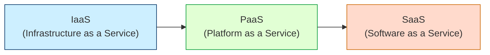

## 5.3 Cloud Computing Models (IaaS, PaaS, SaaS) and Deployment Architectures

Cloud computing has transformed how organizations store, process, and manage their data. From an accounting and audit perspective, understanding cloud service models and deployment architectures is vital for evaluating IT controls, financial reporting considerations, and compliance requirements. As organizations increasingly move critical processes and data into the cloud, CPAs must be aware of the nuanced responsibilities, risks, and controls that come with each cloud environment.

Cloud-based solutions offer a combination of flexibility, scalability, and cost-effectiveness compared to on-premises data centers. However, each cloud service model demands unique control frameworks and security postures. This section discusses the most common cloud service models—Infrastructure as a Service (IaaS), Platform as a Service (PaaS), and Software as a Service (SaaS)—and addresses typical deployment architectures (public, private, hybrid, and community clouds). Additionally, it highlights shared responsibility considerations, risks, and best-practice controls to help CPAs and auditors provide meaningful oversight and advisory services.

  
Building on topics introduced in Sections 5.1 (Hardware Components and Networks) and 5.2 (Operating Systems and Virtualization), this discussion enables a comprehensive view of how various cloud strategies can integrate with an entity’s overall IT architecture.  

Cloud Service Model Essentials
-----------------------------

Cloud service models are typically categorized by the level of abstraction provided to the end user. At one end, IaaS grants the greatest level of control (and responsibility) over infrastructure; at the other, SaaS offloads much of the technological burden onto the service provider. These models can be visualized along a continuum of responsibility and functionality.

In the shared responsibility model, both the cloud service provider (CSP) and the customer are accountable for different aspects of the technology stack. Understanding where the boundaries of responsibility lie is crucial for designing, implementing, and testing effective internal controls.

IaaS (Infrastructure as a Service)
----------------------------------

IaaS offers hardware resources—such as virtual servers, storage, and networking—on a pay-per-use basis. The CSP manages the underlying physical infrastructure, hypervisor, and often basic security of the core networking components. However, the customer has significant responsibility, including:

• Operating System (OS) Installation and Updates  
• Database Management and Configuration  
• Security Patches for OS and Applications  
• Data Encryption and Access Control  
• Network Configuration within Hosted Virtual Machines  

IaaS is often leveraged when organizations require fine-grained control over their systems or need to run proprietary software that is not supported on a more abstracted service model.

From a financial perspective, IaaS transforms capital expenditures (CapEx) such as server purchases into operational expenditures (OpEx), where costs scale with actual usage. CPAs advising clients on cost management and budgeting strategies should analyze usage metrics and invoice data carefully to confirm that monthly IaaS charges align with forecasted allocations.

Risks and Controls in IaaS:
• Misconfiguration of virtual machines (VMs) can lead to data breaches.  
• Ineffective patch management exposes systems to known vulnerabilities.  
• Unauthorized access due to weak identity management.  

Best-Practice Controls:
• Implement hardened VM images and automated configuration scripts.  
• Adopt a formal patch management program.  
• Enforce multi-factor authentication (MFA) for privileged accounts.  
• Use network segmentation to isolate critical workloads.  

PaaS (Platform as a Service)
----------------------------

PaaS provides a managed platform—comprising the runtime environment, middleware, and other development tools—on which organizations can build and deploy applications. The CSP handles the underlying infrastructure, including servers, storage, and virtualization, along with essential environment configurations like operating system patching.

In a PaaS model, the organization’s primary focus is application-level logic and data. The time and cost associated with provisioning hardware, managing OS patches, and configuring middleware are drastically reduced. This “hands-off” infrastructure management can accelerate development cycles and streamline DevOps workflows.

CPAs need to pay special attention to the inherent vendor dependency in a PaaS model. Because the CSP controls the runtime environment, any changes to the platform (e.g., forced upgrades or deprecations) can disrupt application availability and potentially trigger financial or operational risks.

Risks and Controls in PaaS:
• Potential for vendor lock-in if the platform’s frameworks are highly specialized.  
• Data and application security: the user remains responsible for protecting application-stored data.  
• Limited access to underlying system logs may hamper in-depth audits and forensic investigations.  

Best-Practice Controls:
• Conduct periodic reviews of platform features and versions supported by the CSP.  
• Establish strong encryption mechanisms and secure coding standards at the application level.  
• Integrate an application performance monitoring (APM) solution to track usage, performance, and potential anomalies.  
• Define fallback or migration strategies in the event of platform changes or service discontinuation.  

SaaS (Software as a Service)
----------------------------

SaaS solutions deliver fully functional applications to end users, with the CSP managing virtually all aspects of the underlying infrastructure, middleware, and application code. Common examples include enterprise resource planning (ERP) modules, Customer Relationship Management (CRM) systems, and various collaboration or productivity apps. Clients generally handle only user access controls and some data governance responsibilities, such as classification, encryption at rest, and user provisioning.

The SaaS model is particularly attractive to smaller organizations or departments with limited IT resources because it eliminates the need for traditional installation, maintenance, or upgrade processes. However, reliance on the vendor’s security posture, release management approach, and service-level agreements (SLAs) must be carefully monitored.

Risks and Controls in SaaS:
• Dependence on the vendor’s controls: If the vendor’s security posture is compromised, customer data is at risk.  
• Potential for data residency issues if the vendor hosts data in multiple countries.  
• Limited customization options or control in implementing advanced security features.  

Best-Practice Controls:
• Review vendor compliance reports (e.g., SOC 1®, SOC 2®) to gauge control efficacy.  
• Conduct contractual due diligence on data processing and storage locations.  
• Strengthen user provisioning and termination controls to mitigate unauthorized access.  
• Periodically export data backups to mitigate the risk of losing access if the vendor ceases operations.  

Comparing Responsibilities: IaaS vs. PaaS vs. SaaS
--------------------------------------------------

The easiest way to conceptualize these models is to consider how responsibilities shift between customers and the CSP:

• In IaaS, the customer manages the operating system and higher levels, while the CSP manages physical facilities, hardware, and network infrastructure.  
• In PaaS, the CSP manages the underlying infrastructure and operating environment, while the customer focuses on application development and data.  
• In SaaS, the CSP hosts and maintains the entire software environment, leaving the customer to manage user-level access and certain data governance obligations.

Below is a simplified diagram illustrating the increasing levels of vendor management as we transition from IaaS to SaaS:

In each model, the organization must understand the layers of responsibility that remain within its control. For instance, in an IaaS environment, the CPA might evaluate whether the organization has sufficient processes for patching operating systems and applications. In a SaaS arrangement, the CPA might focus more on access controls, vendor governance, and data integrity checks.

Deployment Architectures
------------------------

Cloud deployment architectures define how services are made available to users and how they are managed. Common deployment models include:

Public Cloud  
:   Resources are owned and operated by a third-party CSP and shared among multiple organizations. Public clouds provide high scalability and usually cost less on a per-unit basis. Security controls and compliance management may become more complex, especially regarding data residency and multi-tenant risk.

Private Cloud  
:   Computing resources are exclusively dedicated to a single organization, either hosted on-premises or managed by a third-party CSP. Private clouds allow greater customization and control over security but typically involve higher capital costs and administrative burdens.

Hybrid Cloud  
:   A combination of public and private cloud infrastructures, allowing data and applications to move seamlessly between both environments. Hybrid strategies let organizations keep sensitive or mission-critical processes in a private environment while leveraging the scalability of public clouds for less sensitive workloads.

Community Cloud  
:   A specialized model where multiple entities with common requirements (e.g., same industry or regulatory concerns) share a cloud infrastructure. Community clouds can provide cost-effective compliance solutions and foster collaboration between the community members.

Each deployment model carries trade-offs regarding performance, security, compliance, and cost. CPAs consulting on cloud adoption should weigh the entity’s operational needs, regulatory obligations, and risk appetite when evaluating an optimal architecture.

Shared Responsibility Model
---------------------------

In all cloud environments, the CSP and customer share certain responsibilities. A high-level depiction of this can be summarized as follows:

• CSP’s Responsibilities: Physical security of data centers, underlying network architecture, base-level operating systems (particularly in PaaS and SaaS), and all aspects of hardware maintenance.  
• Customer’s Responsibilities: Configuration of services, user access management, data protection, and compliance with applicable laws and regulations (e.g., GDPR, HIPAA).  

Even in a SaaS model (where the CSP handles almost everything behind the scenes), the customer is still responsible for correct user provisioning, data governance, and oversight of how data is being used or shared. The exact demarcation of responsibilities should be clearly reflected in contractual agreements and SLAs.

Accounting and Audit Considerations
-----------------------------------

From a CPA’s standpoint, cloud computing adoption can impact financial reporting and the design of internal controls:

• Cost Classification: Determine whether cloud-related expenditures should be capitalized or expensed, in accordance with relevant accounting standards.  
• Vendor Risk Management: Evaluate the CSP’s control environment (e.g., via SOC 1® or SOC 2® reports) to ensure reliability of the financial information processed or stored offsite.  
• Regulatory Compliance: Identify data residency and privacy law implications, especially if the CSP’s data centers span multiple jurisdictions.  
• Ongoing Monitoring: Confirm that management routinely reviews availability metrics, service-level commitments, and security updates from the CSP.  

For instance, an organization leveraging an ERP system in a SaaS model needs to verify that the vendor’s service-level commitments prevent undue downtime that might disrupt financial close activities. CPAs might also request access to the CSP’s vulnerability scan results, penetration test summary reports, or other relevant security attestations to inform their risk assessment.

Key Risks Across Cloud Models
-----------------------------

While the specific risk profile differs among IaaS, PaaS, and SaaS, certain overarching risks are common:

• Data Breach and Unauthorized Access: Cloud elasticity increases the attack surface, especially with widely dispersed endpoints.  
• Service Disruption: Outages at a CSP can halt business operations. Redundancy strategies and multi-region deployments help mitigate these events.  
• Compliance Violations: Inconsistent classification and handling of sensitive data may lead to noncompliance with sector-specific regulations (e.g., HIPAA for healthcare, GDPR for EU personal data).  
• Vendor Lock-In: Proprietary tools or custom development (especially in PaaS) can complicate migrations away from a CSP.  
• Contractual Ambiguities: If service-level agreements are vague about responsibilities or fail to specify support and remediation mechanisms, disputes can arise.

Best-Practice Controls
----------------------

Implementing robust controls is critical for ensuring that cloud services align with governance frameworks such as COSO and COBIT. Key controls include:

• Data Lifecycle Management: Encrypt sensitive data in transit and at rest, maintain clear retention policies, and ensure secure destruction processes.  
• Identity and Access Management (IAM): Enforce least privilege, implement MFA, and perform regular access reviews.  
• Monitoring and Logging: Enable centralized logging and real-time monitoring of suspicious events. Use Security Information and Event Management (SIEM) solutions to correlate activities across systems.  
• Vendor Due Diligence: Regularly evaluate the CSP’s compliance posture, incident response capabilities, and financial stability.  
• Business Continuity and Disaster Recovery: Define a robust continuity plan that includes data backups, diverse geographic region deployments, and tested runbooks for failover.  
• Incident Response Procedures: Document escalation paths, designate internal and external stakeholders, and rehearse simulated breach scenarios.  

By aligning these measures with overall enterprise risk management (referenced in Chapter 3), organizations can ensure consistent oversight.

Cost and Resource Management
----------------------------

A hallmark benefit of cloud computing is the pay-as-you-go pricing model. Though this can yield cost savings, cost overruns can occur if usage is not managed properly. CPAs can advise on financial management practices such as:

• Establishing budget alerts or usage thresholds.  
• Evaluating reserved instances or committed use discounts for predictable workloads.  
• Implementing tagging and categorization of resources to accurately attribute costs.  

For illustrative purposes, a simplified cost formula for a cloud deployment might be expressed as:

$$
\mathrm{Cost}_{\mathrm{Cloud}} = \mathrm{Usage} \times \mathrm{Rate} \;+\; \mathrm{AdditionalFees}
$$

Where “Usage” could include compute hours, data storage volume, or network egress traffic; “Rate” is the CSP’s per-unit pricing; and “AdditionalFees” account for charges such as data transfer or specialized support levels.

CPAs should monitor these metrics closely, especially for organizations in highly regulated sectors or those with stringent budget constraints.

Practical Example
-----------------

Imagine a medium-sized manufacturing company transitioning its on-premises ERP system to a SaaS-based solution. While the new ERP vendor assures secure hosting, the company’s management must:

1. Validate the vendor’s SOC 2® report to confirm that security, availability, and confidentiality practices meet industry standards.  
2. Set up internal controls for user management, ensuring that new hires and terminations are reflected accurately in the SaaS environment.  
3. Review SLAs around system uptime to confirm that business-critical accounting processes—like inventory reconciliations—remain unaffected during cloud-based maintenance windows.  
4. Regularly back up operational and financial data on-site or to a secondary cloud provider to mitigate unexpected downtime or, in a worst-case scenario, vendor insolvency.

Conclusion
----------

Cloud computing’s strategic value is indisputable: streamlined operations, reduced capital expenditure, and flexible scaling. Yet, these benefits bring unique control challenges from both an operational and audit standpoint. As CPAs and trusted advisors, it is crucial to understand the different cloud service models, the associated deployment architectures, and the nuanced responsibilities that each arrangement requires. Through careful oversight, robust controls, and close alignment with recognized frameworks, organizations can leverage cloud-based solutions to improve efficiency and innovation while still maintaining compliance with regulatory requirements and safeguarding critical data.

## Test Your Knowledge of Cloud Computing Models and Architectures



### Which of the following is a fundamental characteristic of IaaS?
- [ ] It eliminates customer responsibility over operating system maintenance.
- [x] It provides virtualized computing resources like servers and storage.
- [ ] It fully manages application code and user data.
- [ ] It only deals with large-scale AI deployments.

> **Explanation:** IaaS offers virtualized computing resources and leaves tasks like managing operating systems, access controls, and application updates to the customer.

### In a PaaS environment, which responsibility typically remains with the customer?
- [ ] Managing the physical server infrastructure
- [ ] Patching the operating systems at the hypervisor level
- [x] Developing and maintaining application logic
- [ ] Ensuring server rack airflow

> **Explanation:** In PaaS, the cloud provider manages the infrastructure and operating environment; customers focus on application development, logic, and data security.

### What is a key disadvantage when using SaaS solutions?
- [ ] The customer must manage networking infrastructure.
- [ ] The customer is responsible for patching all operating systems.
- [x] The customer has minimal control over updates and customization.
- [ ] The customer pays entirely on a capital expenditure basis.

> **Explanation:** SaaS providers handle updates and often limit configuration. Hence, the customer may have limited control over timing, features, or customization.

### Which of the following describes a private cloud?
- [ ] A service hosted and shared by multiple organizations with similar compliance needs.
- [x] A dedicated computing environment exclusive to one organization, either on-premises or offsite.
- [ ] A fully community-driven, open-source cloud for government agencies.
- [ ] A public environment that automatically encrypts all data.

> **Explanation:** Private clouds are designed for the exclusive use of a single organization, either on its own premises or through a dedicated CSP environment.

### Which cloud model typically demands the most oversight from an internal security team?
- [x] IaaS
- [ ] PaaS
- [ ] SaaS
- [ ] Hybrid

> **Explanation:** With IaaS, the customer retains significant control—and thus responsibility—over the operating system, middleware, and security patches.

### What primary advantage do hybrid clouds offer?
- [ ] They restrict the transfer of data among private and public environments.
- [x] They allow sensitive workloads to remain on private infrastructure while using public resources for less critical processes.
- [ ] They negate all security responsibilities for the customer.
- [ ] They eliminate the need for vendor risk management.

> **Explanation:** Hybrid clouds blend private and public resources, enabling an organization to keep sensitive data in-house while accessing the scalability of public clouds for other workloads.

### In which scenario might vendor lock-in be a significant concern?
- [ ] Deploying a basic file storage solution through IaaS with standard API endpoints
- [ ] Using a public cloud for testing ephemeral workloads
- [x] Building a highly complex application tied to proprietary frameworks in a PaaS environment
- [ ] Installing an open-source CRM in an on-premises environment

> **Explanation:** PaaS ecosystems often offer specialized tools and frameworks; if the application is tightly coupled to these, switching providers later can be difficult.

### Which of the following is a recommended best-practice control for SaaS services?
- [ ] Configuring and patching the hypervisor manually
- [ ] Maintaining an on-premises database for advanced analytics
- [ ] Handling all encryption at the hardware level
- [x] Reviewing vendor SOC 2® reports and enforcing strong user access controls

> **Explanation:** In a SaaS context, reviewing the CSP’s audit reports and implementing robust user management are crucial to ensure system integrity and compliance.

### What is one of the main risks associated with cloud-based service disruptions?
- [ ] Guaranteed zero data loss due to CSP reliability
- [ ] Unlimited CSP liability to fully compensate for downtime
- [ ] Complete elimination of data backups
- [x] Potentially halting business operations if essential processes rely on external availability

> **Explanation:** An outage at the CSP can disrupt critical processes. Hence, business continuity planning and offline backups are key.

### True or False: Under the shared responsibility model, customers of SaaS solutions have no remaining security obligations.
- [ ] True
- [x] False

> **Explanation:** Even in SaaS, customers must manage user access controls, data classification, and overall compliance obligations, retaining an important role in security.



## For Additional Practice and Deeper Preparation

### [Information Systems and Controls (ISC)](https://www.udemy.com/course/isc-cpa-mock-exams/?referralCode=E1217303222935C5E464)

Information Systems and Controls (ISC) CPA Mocks: 6 Full (1,500 Qs), Harder Than Real! In-Depth & Clear. Crush With Confidence!

- Tackle full-length mock exams designed to mirror real ISC questions.  
- Refine your exam-day strategies with detailed, step-by-step solutions for every scenario.  
- Explore in-depth rationales that reinforce higher-level concepts, giving you an edge on test day.  
- Boost confidence and minimize anxiety by mastering every corner of the ISC blueprint.  
- Perfect for those seeking exceptionally hard mocks and real-world readiness.  

_Disclaimer: This course is not endorsed by or affiliated with the AICPA, NASBA, or any official CPA Examination authority. All content is for educational and preparatory purposes only._
