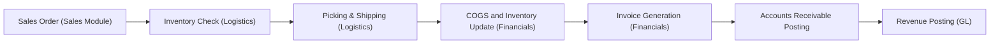
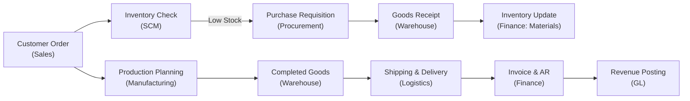

## 6.1 The Modern ERP Ecosystem: Modules and Data Flows

Enterprise Resource Planning (ERP) systems form the operational backbone of many organizations. From large multinational corporations to small and medium enterprises, ERPs facilitate the seamless flow of data between various business functions and provide a single source of truth. By unifying processes like finance, logistics, human resources (HR), and sales under a common platform, ERPs enable streamlined operations, real-time insights, and improved decision-making capabilities.

This section provides a detailed look at the major modules within an ERP ecosystem, explains how these modules operate and integrate, and illustrates how data flows across these integrated systems—from the moment a sales order is created to the final postings in the General Ledger (GL). You will also find practical examples, diagrams, and best practices that can help you understand and optimize ERP usage within an organization.

### An Overview of the Modern ERP Ecosystem

Modern ERP systems typically adopt a modular design, where each module represents a distinct functional area of the organization. These modules are interconnected so that data can be captured and shared in real time, eliminating data silos. For instance, a simple change in a sales order (e.g., a product quantity) can automatically adjust inventory levels, prompt re-order alerts in procurement, generate relevant accounting entries, and provide managers with updated cost and revenue information. 

At the heart of the ERP ecosystem lies the concept of a single, integrated database. This database stores all transactional and master data—such as customer information, vendor details, and product catalogs—used by each module. As transactions flow from one module to another, the ERP’s integration ensures consistency and integrity of data. 

Modern ERPs also increasingly include analytics, dashboards, and reporting functionalities, providing rapid insight into key metrics. With the accelerated adoption of cloud-based platforms, organizations can deploy ERP systems faster, often with less upfront capital investment. Cloud ERPs also streamline system updates, improve scalability, and facilitate secure mobile or remote access.

### Common ERP Modules

Although the exact naming and configuration can differ across ERP vendors (e.g., SAP, Oracle, Microsoft Dynamics, NetSuite, Infor), several modules are common across modern ERP deployments. Each module aims to automate and optimize specific business processes, and they work in concert to provide a holistic view of enterprise operations.

Below is a simplified table of frequently encountered ERP modules:

| Module                                      | Key Functions                                                                                       |
|--------------------------------------------|------------------------------------------------------------------------------------------------------|
| Financial Management (Fi)                  | General Ledger (GL), Accounts Payable (AP), Accounts Receivable (AR), Fixed Assets, Cash Management |
| Logistics and Supply Chain (SCM)           | Inventory Management, Warehousing, Procurement, Distribution, Shipping                               |
| Sales and Distribution (SD)                | Sales Order Processing, Pricing, Billing, Customer Relationship Management (CRM)                     |
| Human Resources / Human Capital Management | Recruitment, Payroll, Benefits, Performance Management                                              |
| Manufacturing / Production Planning        | Production Scheduling, Bill of Materials (BOM), Capacity Planning, Shop Floor Control               |
| Project Systems / Project Management       | Project Planning, Budgeting, Resource Allocation, Tracking                                          |
| Customer Relationship Management (CRM)     | Lead Management, Pipeline, Customer Support, Marketing Automation                                   |
| Analytics / Business Intelligence (BI)     | Reporting, Dashboarding, Data Warehousing, Predictive Analytics                                     |

#### Financial Management

The financial management module, sometimes referred to simply as “Finance,” is arguably the core of most ERP systems. It handles a wide spectrum of accounting and reporting tasks:

• General Ledger (GL): Holds the chart of accounts and records all entries that eventually appear in financial statements.  
• Accounts Receivable (AR): Manages customer invoices, collections, credit memos, and dunning processes.  
• Accounts Payable (AP): Processes vendor invoices, approves payments, and manages vendor credits.  
• Fixed Assets: Monitors asset acquisition, depreciation, retirement, and revaluation.  
• Cash Management: Oversees cash flow, bank reconciliations, and liquidity planning.  

Because finance touches every area involving monetary impact, real-time integration is critical. For instance, when a sales order is converted to a customer invoice, AR and the GL must update automatically. Proper financial controls, audits, and compliance reporting also revolve heavily around the integrity of data in this module.

#### Logistics and Supply Chain Management

The logistics and supply chain management (SCM) module coordinates the movement of goods and materials from suppliers to customers. This module commonly includes:
 
• Inventory Management: Adjusts inventory levels, tracks changes, and handles cycle counts.  
• Warehousing: Defines storage locations, bin management, and automates picking/packing processes.  
• Procurement and Purchasing: Generates purchase orders (POs), evaluates vendor performance, and handles goods receipts.  
• Distribution: Schedules deliveries, optimizes routes, and manages distribution centers.  
• Shipping and Logistics: Issues outbound shipments, monitors freight costs, and organizes order fulfillment.  

Since logistics and SCM rely on accurate inventory data, robust integration with other modules—particularly manufacturing and sales—is vital to prevent stock-outs and costly production bottlenecks.

#### Sales and Distribution

For many organizations, revenue generation starts with the sales process. This module handles:

• Sales Order Processing: Converts customer requests into orders with product details, pricing, and delivery dates.  
• Pricing and Discounts: Automates price lists, discounts, promotions, or special terms per customer/region.  
• Billing and Invoice Generation: Issues invoices and tracks customer payment schedules.  
• Customer Relationship Management (CRM): Manages leads, opportunities, quotations, and after-sales support.  

Sales data interfaces with logistics (for order fulfillment and shipping) and finance (for revenue booking and collections). Many ERPs treat CRM as a stand-alone or integrated submodule. The lines between pure sales modules and CRM systems are often blurred, especially in cloud-based platforms oriented around the full customer lifecycle.

#### Human Resources / Human Capital Management

The HR or Human Capital Management (HCM) module encompasses everything related to the workforce:

• Employee Data Management: Stores personal details, job roles, organizational structures.  
• Recruitment and Onboarding: Tracks applicants, job postings, and offers.  
• Payroll and Benefits: Calculates wages, tax withholdings, benefit deductions, and disburses salary payments.  
• Performance Management: Maintains performance appraisals, career development plans, and training.  
• Time and Attendance: Records work hours, leaves of absence, shift differentials, and overtime.  

Because workforce expenditures often comprise a significant portion of an organization’s operating budget, the HR module’s integration with finance is essential for accurate payroll accounting and financial forecasting.

#### Manufacturing / Production Planning

In manufacturing-centric organizations, the production planning module is crucial for cost control, resource allocation, and on-time production:

• Bill of Materials (BOM): Defines the raw materials, components, and assemblies required for a product.  
• Shop Floor Control: Tracks work-in-progress (WIP), labor hours, and machine usage.  
• Capacity Requirements Planning: Ensures that machines, labor, and materials will meet production schedules.  
• Quality Management: Handles quality checks, test parameters, defect tracking, and compliance reporting.  

Production planning integrates heavily with logistics, financials, and sales. For example, a production order triggered by sales forecasts will update raw material inventory, and then, upon completion, convert WIP into finished goods. Any variances in cost or usage feed back into management accounting and financial reporting for precise cost-of-goods-sold calculations.

#### Project Systems / Project Management

Project systems are common in consulting firms, construction companies, and businesses that deliver services or complex products over extended timelines:

• Project Planning: Establishes work breakdown structures (WBS), timelines, budgets, and resources.  
• Resource Allocation: Assigns labor, equipment, or technical resources to tasks.  
• Cost Tracking: Monitors project-related costs against budgets, including labor hours, materials, subcontracts.  
• Revenue Recognition (if relevant): Automates revenue recognition rules for contract-based projects.  

Real-time tracking of costs and tasks helps project managers control overruns and ensures that billing and revenue recognition processes align with client contracts and accounting standards.

#### Customer Relationship Management (CRM)

CRM modules in an ERP manage interactions with customers and prospects:

• Lead and Opportunity Management: Captures leads from marketing campaigns, qualifies them, and tracks through the sales pipeline.  
• Customer Support and Service: Logs incidents, manages returns or service tickets, and sets service-level agreements (SLAs).  
• Marketing Campaigns: Monitors email marketing, ad spend, event ROI (return on investment).  

Although some organizations keep CRM separate from the ERP environment, modern ERP solutions increasingly integrate CRM so that both the front-end (marketing, sales, customer service) and back-end (fulfillment, accounting) functions share a single customer record.

#### Analytics / Business Intelligence (BI)

Finally, business intelligence and analytics modules gather data from across the ERP ecosystem and convert it into actionable insights:

• Reporting and Dashboarding: Provides key performance indicators (KPIs) and operational metrics in real time.  
• Data Warehousing: Consolidates large data sets from multiple modules or external sources for historical analysis.  
• Predictive Analytics: Uses advanced algorithms and machine learning to forecast trends, detect anomalies, or suggest optimization strategies.  

Robust analytics yield data-driven insights, supporting strategic decisions in pricing, market expansion, capacity planning, financial planning, and more.

### Data Flows from Sales to Ledger

One of the most fundamental processes in any ERP is the flow of data from the initial sales transaction to its eventual recording in the company’s general ledger. Let us examine a simplified sales-to-ledger flow:

1. A potential or returning customer expresses interest in purchasing a product or service. A sales order is created in the Sales and Distribution (or CRM) module with details such as ordered items, quantity, delivery date, and agreed price.  
2. The system automatically checks inventory levels and, if needed, triggers a procurement or production order in the Logistics or Manufacturing module.  
3. Once the items are confirmed available, the outbound delivery process commences: picking, packing, and shipping documentation are created.  
4. At the time of shipping, the ERP updates the inventory records in Logistics to reflect the goods leaving the facility. This generates an accounting entry removing items from inventory (a balance sheet asset) and transferring them to a Cost of Goods Sold (COGS) account in the GL.  
5. After the goods are shipped, the system issues an invoice to the customer, typically referencing the original sales order. The invoice triggers an AR posting in the financial module. It recognizes revenue (income statement) and sets up a receivable (balance sheet).  
6. Customer payments are captured in the AR sub-ledger, which then settles open invoices. The final impact is also reflected in the General Ledger.  

The following Mermaid diagram provides a simplified overview of this flow:

At each step, relevant data crosses module boundaries, ensuring that every function—logistics, manufacturing, finance, and sales—is working with the same up-to-date information. This high level of integration is one of the primary reasons ERPs significantly reduce errors and improve organizational efficiency.

### Best Practices for ERP Implementation and Use

Organizations depend heavily on ERP systems to maintain reliable data, enforce internal controls, and generate timely insights. Below are select best practices for securing these outcomes:

• Plan and Scope Properly: Clearly define project goals, timelines, and business requirements. Align ERP modules with specific organizational needs, ensuring minimal customization where possible.  
• Map Out Data Flows: Document how data travels across modules. This helps identify key integration points, potential bottlenecks, and required custom workflows.  
• Standardize Master Data: Use consistent naming conventions and categorization for products, customers, and accounts. This improves data integrity and simplifies analytics.  
• Align Security and Access Controls: Implement role-based access, two-factor authentication (2FA), and robust password policies to protect sensitive data. Regularly review user access rights.  
• Train End-Users Thoroughly: Provide job-role-based training and ongoing support to encourage correct system usage, reduce errors, and boost adoption.  
• Leverage Audit Trails: Ensure the system’s audit trail is active to trace changes, detect anomalies, and support effective internal and external audits.  
• Periodic Reviews and Optimization: Conduct post-implementation audits and health checks to refine processes, correct inefficiencies, and stay aligned with evolving business demands.

### Common Pitfalls and Mitigation Strategies

Despite the benefits of ERP systems, organizations often encounter challenges:

• Underestimating Organizational Change: An ERP rollout can transform job roles and responsibilities. Mitigation: Develop a solid change management plan, communicate openly, and involve end-users early.  
• Inadequate Data Cleansing: Migrating poor-quality data into an ERP leads to erroneous reporting. Mitigation: Perform thorough data scrubbing, validation, and standardization before go-live.  
• Over-Customization: Excessive custom code can lead to high maintenance costs. Mitigation: Use standard ERP functionalities; customize only when absolutely necessary.  
• Disconnected Reporting: Users might spin up external spreadsheets or databases, leading to siloed data. Mitigation: Leverage built-in analytics and encourage company-wide usage of centralized dashboards.  
• Poorly Defined Access and Segregation of Duties (SoD): Combining conflicting roles within a single user profile can allow fraud or errors to go undetected. Mitigation: Implement robust SoD policies and continuous monitoring with built-in ERP tools.

### Real-World Case Studies and Examples

Case Study 1 – Manufacturing Company:  
• A mid-sized auto parts manufacturer found that its legacy system could not synchronize data between production planning and inventory. They implemented an integrated ERP with manufacturing, logistics, and financial modules. Almost immediately, they saw a 30% reduction in raw material overstock, as the system helped them better align procurement with production demand. Integration with the financial module provided real-time cost tracking, promoting a higher degree of accuracy in profit calculations.

Case Study 2 – Retail Chain:  
• A retail chain operating in multiple states struggled with scattered sales data from various point-of-sale terminals and e-commerce platforms. By implementing an ERP with a consolidated sales and distribution module, they integrated and standardized sales data entry. Automated AR postings and real-time inventory updates improved forecasting accuracy, enabling them to reduce stock-outs during peak seasons by 25%. An ancillary benefit was an analytics module that gave corporate leaders instant visibility into daily sales performance across all outlets.

These examples show how broadly beneficial ERP integration can be. From manufacturing processes to rapid retail transactions, an ERP can unify disparate functions and improve organizational agility.

### Diagram of an End-to-End ERP Data Integration

Below is a second diagram illustrating how ERP modules might connect in an even more integrated scenario, showcasing data passing between sales, production, inventory, and finance:

In this extended flow, the initial customer order triggers multiple downstream processes—inventory checks, purchase requisitions, picking and packing, and shipping. Meanwhile, finance is constantly updated on stock levels, cost changes, and revenue recognition.

### Conclusion

The modern ERP ecosystem is a transformative force that integrates diverse functions, reducing duplicate data entry and offering real-time insights for informed decision-making. By understanding the key modules—Financial Management, Logistics, Sales and Distribution, HR, Manufacturing, Project Systems, CRM, and Analytics—professionals can navigate and optimize their organizations’ ERP environments more effectively. Effective data flows ensure that every transaction has only one version of the truth, minimizing errors and strengthening internal controls.

With robust planning, thoughtful module selection, effective change management, and thorough training, an ERP can become a powerful strategic asset. It creates a unified structure for operations, fosters agility in dynamic markets, and strengthens the controls that financial professionals, including CPAs, rely upon for accurate and timely reporting.

Remember that while all ERP systems share certain fundamentals, each organization’s implementation is unique. The concepts introduced here will serve as a foundation for deeper study and practical application, including the subsequent sections of this guide and real-world engagements.

## Test Your Knowledge on Modern ERP Modules and Data Flows



### Which module typically includes General Ledger, Accounts Receivable, and Accounts Payable functionalities?

- [x] Financial Management
- [ ] Logistics
- [ ] Human Resources
- [ ] Sales and Distribution

> **Explanation:** Financial Management modules focus on core accounting processes, including the general ledger, accounts receivable, accounts payable, and other related financial activities.

### In ERP systems, what is the main advantage of having a single integrated database?

- [x] It offers a single source of truth across all modules.
- [ ] It replaces the company’s need for backups.
- [ ] It prevents employees from accessing sensitive data.
- [ ] It increases data silos and reduces efficiency.

> **Explanation:** A single database enables consistent, real-time data across all functional modules, eliminating duplicate entries and providing unified access to information.

### Which module is most directly concerned with time tracking, payroll, and performance management?

- [ ] Sales and Distribution
- [ ] Analytics/Business Intelligence
- [ ] Financial Management
- [x] Human Resources / Human Capital Management

> **Explanation:** Human Resources or Human Capital Management (HCM) deals with workforce administration, including payroll processing, time tracking, and performance evaluations.

### What happens in the ERP system immediately after a sales order is created in the Sales and Distribution module?

- [x] The system checks inventory availability in the logistics or inventory module.
- [ ] The system automatically charges the customer’s credit card.
- [ ] The system completes a final invoice and closes the transaction.
- [ ] The system retires an asset through the fixed assets module.

> **Explanation:** After a sales order is registered, the ERP typically verifies product availability with inventory data in the Logistics/SCM module before shipping or triggering any fulfillment processes.

### Why is over-customization of an ERP platform considered a potential pitfall?

- [x] It can lead to high maintenance costs and complicate system updates.
- [ ] It makes the user interface more intuitive.
- [ ] It ensures universal compatibility with all legacy systems.
- [ ] It prevents employee training requirements.

> **Explanation:** Customizing beyond standard functionalities often increases complexity and cost, especially regarding future system maintenance and updates.

### Which of the following best describes the relationship between a sales invoice and the organization’s financial records?

- [x] The invoice triggers an AR posting and recognizes revenue in the general ledger.
- [ ] The invoice is kept separately without updating any financial records.
- [ ] The invoice causes an immediate reduction in capital assets.
- [ ] The invoice triggers an employee bonus payment.

> **Explanation:** Once finalized, a sales invoice records customer receivables in the AR sub-ledger and recognizes sales revenue in the general ledger.

### Which module commonly manages Bill of Materials (BOM) and Work-in-Progress (WIP)?

- [ ] Sales and Distribution
- [ ] Analytics / Business Intelligence
- [x] Manufacturing / Production Planning
- [ ] Project Systems / Project Management

> **Explanation:** Manufacturing or Production Planning modules handle BOMs, work orders, and WIP monitoring for product-based organizations.

### What is one of the primary objectives of including Business Intelligence features in modern ERP systems?

- [ ] To eliminate the Financial Management module
- [x] To provide real-time reporting, dashboards, and predictive analytics
- [ ] To prevent any external data integration
- [ ] To reduce the need for user training

> **Explanation:** Business Intelligence features convert raw data from various modules into insights through dashboards, reporting, and analytics, empowering data-driven decisions.

### Which process occurs in the logistics module when a company is ready to ship goods to a customer?

- [x] Picking, packing, and generating a goods issue or shipping document
- [ ] Removing shipping details from the system
- [ ] Retiring or writing off the goods from the fixed asset module
- [ ] Decreasing employee wages according to shipping volume

> **Explanation:** Processing a shipment involves picking and packing goods in the warehouse, then issuing documents that update inventory and facilitate outbound logistics.

### True or False: Role-based access control in an ERP system can help address segregation of duties conflicts.

- [x] True
- [ ] False

> **Explanation:** By setting up clearly defined roles with distinct permissions, organizations can limit unauthorized transactions and reduce the risk of fraud while maintaining segregation of duties.



## For Additional Practice and Deeper Preparation

### [Information Systems and Controls (ISC)](https://www.udemy.com/course/isc-cpa-mock-exams/?referralCode=E1217303222935C5E464)

**Information Systems and Controls (ISC) CPA Mocks:** 6 Full (1,500 Qs), Harder Than Real! In-Depth & Clear. Crush With Confidence! 

- Tackle full-length mock exams designed to mirror real ISC questions.  
- Refine your exam-day strategies with detailed, step-by-step solutions for every scenario.  
- Explore in-depth rationales that reinforce higher-level concepts, giving you an edge on test day.  
- Boost confidence and minimize anxiety by mastering every corner of the ISC blueprint.  
- Perfect for those seeking exceptionally hard mocks and real-world readiness.  

_Disclaimer: This course is not endorsed by or affiliated with the AICPA, NASBA, or any official CPA Examination authority. All content is for educational and preparatory purposes only._
