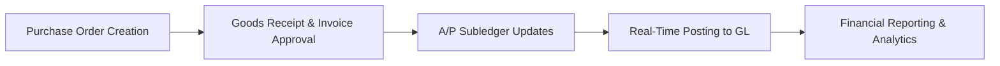

## 6.2 Accounting Information Systems within ERPs

Accounting Information Systems (AIS) form the nerve center of financial operations within an Enterprise Resource Planning (ERP) system. They integrate data from multiple business processes—purchasing, sales, production, payroll, asset management, and more—into a unified ledger. This holistic approach enables real-time or near-real-time updates to all components of the accounting cycle, providing management and stakeholders with immediate insights into financial performance, compliance status, and operational health.

An ERP solution that includes an AIS module typically features a robust general ledger, specialized subledgers, automated workflows, and built-in controls that help maintain the accuracy and integrity of financial data. With seamless linkages to broader organizational data, an integrated AIS within an ERP environment brings together financial and non-financial information, leading to more informed decisions, transparency, and improved governance. This section explores how AIS components (e.g., subledgers, general ledger interfaces, real-time transaction updates) are placed at the heart of ERP solutions, highlighting core concepts, best practices, and common pitfalls to avoid.

  
Introduction to Integrated AIS in ERP  
An AIS is designed to collect, store, process, and report financial transactions. When deeply integrated into an ERP, the AIS does not exist in isolation but rather communicates bidirectionally with all other relevant modules (e.g., Inventory Management, Human Resources, Project Management) in a seamless manner. This tight integration provides accounting professionals, auditors, controllers, and CFOs a single source of truth for the organization’s financial health.  

Historically, organizations often used separate software for accounting and operational tasks. This approach led to data silos, differing data definitions, and reconciliation nightmares. Modern ERPs have changed the narrative by orchestrating real-time or near-real-time data flows. This enables continuous updates to the general ledger and subledgers, reduces the time lag between a transaction and its recognition in the books, and enhances the reliability of financial information.

  
Key Components of Accounting Information Systems within ERPs  

Overview of Core AIS Modules  
Every AIS within an ERP has specific modules that mirror the standard financial accounting cycle. Key modules include:  
• Accounts Payable (A/P) Subledger: Records invoices from suppliers, tracks liabilities, and supports subsequent vendor payments.  
• Accounts Receivable (A/R) Subledger: Maintains customer invoices, partial payments, returns, and bad debt write-offs.  
• Fixed Assets (F/A) Subledger: Tracks asset acquisitions, disposals, depreciation, and revaluations.  
• Cash Management: Monitors bank transactions, statements, reconciliations, and liquidity planning.  
• Payroll Subledger (if integrated): Calculates employee earnings, withholdings, benefits, and taxation.  
• General Ledger (GL): The central repository of financial records that aggregates data from all subledgers, forming the basis for financial reporting.

  
Chart of Accounts and Financial Dimensions  
At the heart of every AIS is the chart of accounts (COA). The COA is a structured list of account codes that classifies all the financial transactions within an organization. A robust COA design includes:  
• Logical Groupings: Assets, Liabilities, Equity, Revenue, and Expense categories.  
• Granularity: Enough detail to perform meaningful analysis (cost centers, departments, product lines), but not so detailed as to become unwieldy.  
• Alignment with Reporting Requirements: Mapped to GAAP, IFRS, or local regulatory standards for ease of compliance.  
• Compatibility with Subledgers: Each subledger transaction flows into one or more GL accounts, which are determined by the structure of the COA.

Some modern ERP solutions also integrate “financial dimensions” or “analytic segments” into the COA to facilitate multidimensional reporting (e.g., by department, region, project, or product line). This layered approach enables deeper insight into profitability, performance, and cost drivers across various slices of the organization.

  
General Ledger and Subledgers  
The general ledger is the master record of all accounts within the organization, encompassing every financial transaction that has an economic impact. Subledgers (also known as subsidiary ledgers) are specialized record sets for specific areas of accounting that feed summarized or posting-level entries into the GL.  

For example, the Accounts Receivable subledger details each customer invoice, each payment, and any adjustments, but only the net effect of these activities (the summarized balance) passes to the “Accounts Receivable” and “Sales” accounts in the GL. Similarly, the Accounts Payable subledger accumulates transactions by vendor, and the aggregated effect is posted to the GL.  

Real-Time or Near-Real-Time Updates  
Modern ERP systems leverage transactional databases and advanced technologies like in-memory computing to transmit subledger changes into the GL in real-time or near-real-time. This instant update contrasts with older legacy systems, where subledgers often updated the general ledger through periodic (e.g., monthly or weekly) batch postings.  

Real-time integration has numerous benefits:  
• Immediate visibility into the organization’s financial position.  
• Streamlined month-end and year-end closing processes.  
• Faster detection of anomalies, fraud attempts, or misstatements.  
• Improved agility in responding to market or operational changes.

However, real-time updating also increases the need for robust data validation, error handling, and internal controls to ensure transactions are accurate upon entry. Any errors introduced into the system might propagate quickly and complicate corrections if not immediately detected.

  
Mermaid Diagram: AIS Transaction Flow  
Below is a high-level representation of how subledgers feed into the general ledger within an ERP, illustrating the flow of a typical Accounts Payable transaction:

In this diagram:  
• A represents the initial creation of the purchasing document, typically referencing vendor data, item details, and pricing.  
• B captures the receipt of goods and/or services, verification of invoice details, and authorization for payment.  
• C records the transaction in the Accounts Payable subledger by increasing the obligation to the vendor.  
• D shows a near-instantaneous or scheduled posting to the GL, ensuring the central ledger reflects the payable immediately.  
• E provides updated financial statements and performance metrics for management review.

  
Integration with Other ERP Modules  
In a fully integrated ERP, the AIS is not limited to internal accounting transactions. It also communicates with:  
• Sales and Distribution Modules: Customer orders, sales invoices, and returned merchandise link to the A/R subledger and correspondingly update sales revenue and cost of goods sold (COGS) accounts in the GL.  
• Production and Inventory Modules: Raw materials, work-in-process, and finished goods inventory movements reflect real-time changes in inventory valuation and associated expense or revenue accounts.  
• Human Resources Module (Payroll): Employee wages, tax withholdings, and benefits feed into payroll subledger accounts and subsequently to the GL.  
• Budgeting and Forecasting: Real-time entries enable top management to compare actual results against budgetary targets, bridging operational planning with financial performance reporting.  

This networked ecosystem allows organizations to reduce redundancy, lower reconciliation efforts, and maintain a unified data set that drives operational and strategic decisions.

  
Control and Compliance Considerations  
Robust internal controls within an AIS are critical for accurate financial reporting. The integration in ERP systems often includes controls such as:  
• Authorization Workflows: Automated approvals required for high-value transactions or sensitive changes (e.g., vendor master data).  
• Validation Rules: Checking data accuracy before acceptance (e.g., ensuring vendor addresses match known records or requiring correct codes in the chart of accounts).  
• Segregation of Duties: Restricting the same individual from initiating, approving, and reconciling transactions.  
• Audit Trails: Detailed logs that capture who performed transactions, at what time, and whether any changes were made post-entry.  
• Real-Time Alerts: Automated notifications triggered by threshold breaches or potential irregularities.  

These controls are designed to comply with frameworks like COSO’s Internal Control—Integrated Framework (see Chapter 3) and industry regulations such as the Sarbanes-Oxley Act (SOX) in the United States. For global organizations, local compliance considerations such as GDPR (data privacy) or IFRS reporting standards may also apply.

  
Practical Example of an Integrated AIS Workflow  
Imagine a global manufacturing firm receiving a large quantity of raw materials from an overseas supplier. Here is how the transaction flows:

1. A purchase requisition is initiated, then approved, generating a purchase order.  
2. Once the goods arrive, the receiving department updates the ERP to record the quantity, triggering an automatic A/P subledger entry linked to the supplier.  
3. The invoice from the supplier is matched against the purchase order and receiving records. Upon approval, the A/P subledger updates reflect the outstanding liability.  
4. Simultaneously, the GL’s accounts for Inventory (asset) and Accounts Payable (liability) are updated in real-time with the cost of the raw materials.  
5. Payment runs, scheduled or triggered, settle the vendor liability, reducing both cash and accounts payable in the GL.  
6. Authorized personnel can view immediate and accurate cash flow reports, inventory valuations, and liabilities in the ERP’s dashboard, enabling quick decisions on production planning or vendor negotiations.

By comparison, in batch systems, the GL updates for these transactions might not appear until the end of the day or month, potentially making the financial reports obsolete or incomplete until the batch posts.

  
AIS and Real-Time Reporting Benefits  
High-speed data processing techniques in modern ERP solutions have catalyzed the evolution from periodic to real-time accounting. With real-time reporting:  
• CFOs and finance teams monitor critical metrics (e.g., daily sales outstanding, daily payables outstanding) without waiting for a month-end close.  
• Inventory managers adjust reorder levels in response to current accounts payable capacity and immediate purchase order statuses.  
• Operational managers use up-to-the-minute cost data for optimizing production schedules or analyzing departmental overhead.  
• External stakeholders, such as investors or regulatory agencies, receive timely financial statements, improving transparency and stakeholder confidence.  

Not only does real-time reporting drive quicker decision-making, but it also opens the possibility for continuous auditing (see Chapter 31), where exceptions, anomalies, and potential fraud can be detected rapidly using data analytics and machine learning techniques.

  
Best Practices in Implementing an Integrated AIS  
1. Clearly Define the Chart of Accounts: Ensure that each account is well-documented, logically structured, and accommodates institutional growth.  
2. Validate Master Data: Thoroughly vet vendor master files, customer databases, and financial dimension setups to minimize incorrect postings.  
3. Implement Role-Based and Segregation-of-Duties Controls: Assign system permissions according to job function, preventing overlapping responsibilities that could create fraud risks.  
4. Automate Routine Transactions: Deploy recurring journal entries or batch processes for regularly scheduled events like depreciation, accruals, and currency revaluations.  
5. Plan for Data Conversion and Migration: When transitioning to a new ERP or AIS, ensure historical data is cleaned, mapped accurately, and tested thoroughly to prevent legacy errors from contaminating fresh records.  
6. Emphasize User Training and Change Management: Comprehensive training ensures staff understand not only the how but also the why behind data entry, validations, and approval processes.  
7. Continually Review and Optimize Controls: As new regulations emerge or the business evolves, ensure that AIS controls and processes remain updated and effective.

  
Common Pitfalls and How to Avoid Them  
• Underestimating Complexity: Failing to appreciate the dynamic interlinkages of subledgers, the chart of accounts, and the general ledger can cause confusion and reporting errors.  
• Poor Master Data Governance: Inaccurate or incomplete vendor and customer data can result in mis-postings. Implement ongoing data quality checks to avoid perpetuating errors.  
• Inconsistent COA Structures: If data from multiple organizational branches feed into a single GL, misaligned COA structures can introduce reconciliation issues and hamper consolidated reporting.  
• Limited End-User Training: Even an advanced AIS is ineffective if the employees lack the knowledge to use it correctly. Ensure robust training with regular refreshers.  
• Over-Reliance on Real-Time Updates: Real-time postings amplify the rate at which errors can propagate. Maintain robust validations and reconciliation checks to catch errors early.  
• Insufficient Testing of Upgrades: ERP vendors routinely release patches and upgrades. Failing to test them can disrupt mission-critical accounting processes.  

  
Case Study: Transitioning from Batch to Real-Time AIS  
A mid-sized retailer operating across multiple states used a legacy batch-based accounting system for years. Their month-end close process was notorious for running into weeks, delaying corporate strategy sessions. After implementing a modern ERP with integrated AIS modules, they experienced:  

• A 40% faster monthly closing cycle, as subledgers updated the GL daily.  
• Fewer reconciliation errors, thanks to standardized chart of accounts and immediate posting rules.  
• Enhanced cash management due to on-demand visibility into daily payables and receivables.  
• Improved morale among finance staff, who could focus on higher-value tasks like budgeting and analysis rather than on data-entry corrections.  

This transformation exemplifies how a modern, real-time AIS can be a catalyst for better financial stewardship.

  
Future Outlook for Integrated AIS  
As technology evolves, AIS within ERPs will continue to evolve in tandem with emerging trends:  
• AI and Machine Learning: Automated anomaly detection and predictive analytics for improved financial forecasting.  
• Blockchain Integrations: Self-auditing ledgers for certain high-risk or high-value transactions.  
• Internet of Things (IoT): Automated updates on inventory levels, shipping status, and even consumption data integrated directly into accounting entries.  
• Cloud and Hybrid Deployments: Scalable, secure, and globally accessible AIS modules that integrate seamlessly with on-premises or multi-cloud ecosystems.  

For CPAs, auditors, and other finance professionals, the move toward real-time, integrated AIS solutions requires a corresponding shift in mindset, skill sets, and approach to risk management. Organizations that adeptly adopt and leverage these technologies stand poised to excel in an increasingly data-driven environment.

  
References for Further Exploration  
• Romney, M. B., & Steinbart, P. J. (2018). Accounting Information Systems (14th Edition). Pearson.  
• Gelinas, U. J., & Dull, R. B. (2019). Accounting Information Systems. Cengage Learning.  
• Turner, L., Weickgenannt, A. B., & Copeland, M. K. (2020). Accounting Information Systems: Controls and Processes. Wiley.  
• COSO. (2013). Internal Control—Integrated Framework. AICPA.  
• IMA Statements on Management Accounting. (various years).

  
## Test Your Knowledge: AIS and ERP Integration Quiz



### Which of the following is the primary function of a General Ledger (GL) within an ERP-based Accounting Information System?
- [ ] It handles the detailed line items of customer invoices.  
- [ ] It approves data-entry tasks only through batch processes.  
- [x] It serves as the central record of all financial accounts and consolidates subledger data.  
- [ ] It manages only non-financial data for production planning.  

> **Explanation:** The GL is the central repository that aggregates all financial transactions from subledgers, ensuring a consolidated view of the organization's financial health.

### What is the main advantage of real-time (or near-real-time) updates between subledgers and the GL?
- [ ] Less complexity in managing large volumes of data.  
- [x] Immediate visibility into the company’s financial position.  
- [ ] Simplified chart of accounts structure.  
- [ ] Elimination of any need for internal controls.  

> **Explanation:** With real-time updating, subledger transactions are seamlessly posted to the GL, providing up-to-date insights into the organization’s financial status.

### Which AIS subledger typically records the acquisition and disposal of tangible resources such as machinery and vehicles?
- [ ] Accounts Receivable subledger.  
- [ ] Accounts Payable subledger.  
- [x] Fixed Assets subledger.  
- [ ] Cash Management subledger.  

> **Explanation:** The Fixed Assets subledger is used to track asset purchases, disposals, depreciation, and revaluation, ensuring proper accounting and regulatory compliance.

### Which of the following best describes a key risk of relying too heavily on real-time posting to the General Ledger?
- [x] Errors can propagate extremely quickly, potentially impacting multiple statements.  
- [ ] Month-end closings are rendered impossible.  
- [ ] There is no need to reconcile any transactions.  
- [ ] The chart of accounts often remains incomplete.  

> **Explanation:** Real-time updates amplify the speed at which errors can spread, creating a need for robust validation and internal controls.

### In an integrated ERP, how does the Purchasing (Procure-to-Pay) process typically affect the AIS subledgers and general ledger?
- [x] The Accounts Payable subledger is updated upon receipt and invoice approval, and the GL is simultaneously or periodically posted.  
- [ ] Only the GL is updated, while subledgers remain static.  
- [ ] Expense accounts are bypassed entirely.  
- [ ] It requires manual ledger reconciliation for every transaction.  

> **Explanation:** Upon goods receipt and invoice verification, the A/P subledger reflects the obligation, and the GL captures liabilities and inventory/value updates either in real-time or on a scheduled basis.

### Which of the following is a recommended best practice for chart of accounts (COA) in an AIS?
- [x] Design the COA for both regulatory compliance (e.g., GAAP/IFRS) and internal analytics.  
- [ ] Use random code sequences to ensure confidentiality.  
- [ ] Limit all COA entries to five digits maximum.  
- [ ] Avoid departmental codes or cost centers to keep it simple.  

> **Explanation:** A well-structured COA should meet external reporting requirements and facilitate internal managerial analysis, often using segmented account codes.

### Which control method helps prevent the same individual from initiating, approving, and reconciling transactions in an AIS?
- [x] Segregation of duties  
- [ ] Continuous budgeting  
- [x] Role-based access controls  
- [ ] Open-door policy  

> **Explanation:** Segregation of duties (SoD) and role-based access controls ensure that no single individual can perform all steps of a transaction, reducing opportunities for fraud or error.

### Which statement about master data governance in an integrated AIS is correct?
- [x] Master data accuracy is crucial because it ensures correct transaction postings and reporting.  
- [ ] Master data can be revised freely without approval for speed.  
- [ ] Vendors and customers should be merged into a single record for simplicity.  
- [ ] Master data does not impact financial statements.  

> **Explanation:** Proper governance of master data (e.g., vendors, customers, chart of accounts) is essential for accurate accounting and financial reporting within an ERP system.

### Which of the following sets best illustrates subledgers commonly found in an AIS?
- [ ] General Ledger, Marketing, Vision, and Production  
- [x] Accounts Payable, Accounts Receivable, Fixed Assets, and Payroll  
- [ ] Costing, Employee Training, Inventory Forecast, and Social Media Management  
- [ ] IT Helpdesk, Office Supplies, Travel Reimbursements, and Banking  

> **Explanation:** A/P, A/R, Fixed Assets, and Payroll are traditional AIS subledgers that feed the general ledger in an integrated ERP solution.

### A real-time posting system posts transactions to the General Ledger:
- [x] Almost instantly after authorization or validation  
- [ ] Only at month-end  
- [ ] Only at year-end  
- [ ] Never, because real-time postings bypass the GL  

> **Explanation:** Real-time systems post nearly instantaneously, ensuring AIS financial data stays current and consistent with subledgers.



## For Additional Practice and Deeper Preparation

### [Information Systems and Controls (ISC)](https://www.udemy.com/course/isc-cpa-mock-exams/?referralCode=E1217303222935C5E464)  

**Information Systems and Controls (ISC) CPA Mocks:** 6 Full (1,500 Qs), Harder Than Real! In-Depth & Clear. Crush With Confidence!

- Tackle full-length mock exams designed to mirror real ISC questions.  
- Refine your exam-day strategies with detailed, step-by-step solutions for every scenario.  
- Explore in-depth rationales that reinforce higher-level concepts, giving you an edge on test day.  
- Boost confidence and minimize anxiety by mastering every corner of the ISC blueprint.  
- Perfect for those seeking exceptionally hard mocks and real-world readiness.  

_Disclaimer: This course is not endorsed by or affiliated with the AICPA, NASBA, or any official CPA Examination authority. All content is for educational and preparatory purposes only._
