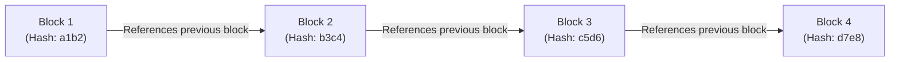
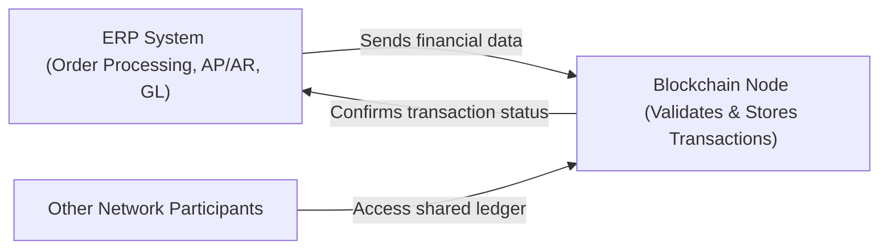

## 6.4 Blockchain Integration and Considerations for Financial Reporting

Blockchain technology is increasingly integrated into enterprise systems, reshaping how transactions are recorded, stored, and audited. Its core features—distributed ledgers, cryptographic security, and immutability—can improve transparency and reliability in financial reporting. Nonetheless, these innovations raise unique challenges in audit procedures, internal controls, and regulatory compliance. This section explores foundational blockchain architecture, practical implications for financial statement preparation, and the ways auditors and accounting professionals should adapt to this evolving landscape.

### Introduction to Blockchain
Blockchain is a distributed database or ledger shared among participants in a network. Unlike traditional centralized databases, in which a single administrator holds control, blockchain consensus mechanisms ensure all participants agree on the ledger's state. Because new transactions must align with existing data records, blockchain is commonly referred to as an “immutable ledger.”

Key characteristics include:
• Decentralization: The ledger is duplicated across multiple network nodes.  
• Cryptographic Security: Transactions are secured using secure hashing and encryption.  
• Transparency: In many blockchain designs, each participant can (at least partially) verify transactions and balances, fostering trust.  
• Immutability: Once a block is accepted into the chain, altering prior records becomes highly improbable or computationally infeasible.

When integrated into an enterprise environment, blockchain can streamline cross-entity transactions, improve record visibility, and reduce reconciliation requirements in areas such as supply chain, inventory management, and intercompany accounting.

### Basic Blockchain Architecture
Although multiple blockchain designs exist, they share core structural elements:

• Blocks: A block represents a collection of recent transactions, along with a reference (hash) to the previous block. Each block typically contains a “block header” (metadata like timestamp, version, and a cryptographic nonce) and a “block body” (individual transactions).  
• Hashes: A unique fingerprint of each block’s contents is generated using cryptographic hashing. Because each block header includes the hash of the previous block, blocks form a “chain.”  
• Consensus Mechanisms: Nodes on the network must agree on proposed transactions via algorithms like Proof of Work (PoW), Proof of Stake (PoS), or specialized enterprise algorithms for permissioned ledgers.  
• Nodes: Participants in a blockchain network who validate and store copies of the ledger. In a permissioned (private) blockchain, node membership is controlled, whereas permissionless (public) blockchains allow anyone to participate.

Below is a simplified diagram illustrating basic blockchain architecture, showing how each new block references the hash of the preceding block:

In this illustration, modifying data in Block 1 would change its resulting hash value, propagating inconsistencies through subsequent blocks. This chain of references provides a foundation for ledger immutability.

### From Traditional Ledgers to Immutable Records
Traditional financial statements rely on centralized databases, in which transaction entries can be reversed or modified by superusers or system administrators. Blockchain's immutability offers a fundamentally different approach to recordkeeping:

• Reduced Risk of Tampering: Because altering historical entries requires re-generating consensus from participating nodes, unauthorized data changes become exceedingly difficult.  
• Cryptographic Proofs: Each transaction is signed using a private key, and those signatures can be verified using the corresponding public key. This ensures authenticity and integrity of recorded data.  
• Real-Time Collaboration: Multiple parties—such as suppliers, customers, or auditors—may share a single source of records, each running a node or authorized client to interact with the ledger.

For financial reporting, this architecture can enhance data assurance in several ways, including faster validation of transactions during period-end close and streamlined compliance checks with various regulators, assuming standardization of processes.

### Integrating Blockchain with ERP and Accounting Information Systems
Many modern Enterprise Resource Planning (ERP) platforms and Accounting Information Systems (AIS) are exploring or already offering blockchain integration. Here is a simplified depiction of an integrated environment where an ERP system channels data into a blockchain ledger to secure critical financial records:

In this model, transactions (e.g., vendor invoices, sales orders) flow from the ERP to the blockchain node, which verifies the transaction’s authenticity. Once validated, the transaction becomes part of the immutable ledger. All authorized entities can then access the same verified data. Such a setup can reduce reconciliation needs among trading partners or subsidiaries while improving the timeliness of financial information available to internal stakeholders.

Practical considerations include:
• Types of Data on the Ledger: Full versus partial financial records.  
• Permissioned vs. Permissionless Blockchain: Mandatory for enterprise contexts expecting strict data access and regulatory oversight.  
• On-Chain vs. Off-Chain Data: Large volumes of data might remain off-chain, while critical transaction hashes and proofs are on-chain.  
• Governance and Roles: Defining who can write, read, or validate transactions is essential for control alignment with Chapter 3 (Governance, Frameworks, and Regulatory Environment) and Chapter 8 (IT General Controls).

### Impact on Audit and Assurance
Because transactions recorded on blockchain are theoretically immutable, auditors must adapt their traditional procedures in several ways:

• Existence and Rights/Obligations Assertions: With blockchain’s distributed records, verifying existence is more direct. Nonetheless, ownership might be ambiguous if private keys are lost or compromised, or if transactions are mislabeled.  
• Completeness Assertions: While immutability helps with data integrity, the ledger only reflects what was submitted. If transactions are never recorded, the ledger remains incomplete.  
• Accuracy and Valuation: Although the ledger itself is correct, the underlying economic substance (e.g., fair value of a crypto asset or validity of a digital token) may require corroborating procedures.  
• Cutoff and Period-End: Continuous transaction recording means period cutoff depends on consensus finality. Auditors need to understand how the blockchain network assigns timestamps and handles block reorganizations.  
• Third-Party Reliance: Auditors may rely partially on blockchain-based data from third-party networks. Understanding the governance, consensus mechanism, and node operator responsibilities becomes critical, referencing Chapter 5’s IT Infrastructure Fundamentals and Chapter 7’s Business Process considerations to ensure controls over outsourced IT environments are solid.

Moreover, specialized tools and approaches for blockchain auditing are emerging, such as node-level analytics, automated transaction tracing, and cryptographic key validation.

### Immutability’s Influence on Internal Controls
While blockchain’s immutability can reduce some forms of fraud, it requires a corresponding robust control environment to handle errors and unauthorized activity. For instance:

• Private Key Management: If private keys get stolen or lost, transactions can be irreversibly executed by unauthorized parties. Controls must be in place to prevent key compromise.  
• Onboarding and Smart Contracts: In a permissioned blockchain, verifying the identity and authority of new participants is crucial. Smart contract code accuracy requires thorough testing and continuous monitoring.  
• Governance Over Protocol Upgrades: Changes to the blockchain’s consensus rules can result in “forks,” splitting the ledger. Organizations must have policies describing procedures if a chain splits or if a major protocol upgrade is necessary.  
• Segregation of Duties: Traditional concepts (e.g., separate roles for transaction initiation, approval, and recordkeeping) remain relevant, but are implemented via cryptographic sign-offs and multi-signature protocols on the blockchain platform.

Referencing Chapter 8 (ITGC) becomes critical to identify relevant control frameworks (e.g., COBIT, COSO) and ensure robust oversight of the underlying blockchain system.

### Considerations for Financial Reporting
While the advantages of blockchain are apparent, organizations must anticipate challenges and adapt financial reporting:

• Interoperability: Multiple blockchains or hybrid ERP-blockchain architectures may create complexity in data consolidation, requiring standardization and robust data integration.  
• Regulatory Uncertainty: In certain jurisdictions, the legal status of blockchain-based records or certain tokens remains unclear, which can pose challenges to financial statement disclosures.  
• Real-Time Reporting: Blockchain’s “continuous close” potential offers near-instant transaction confirmations, but demands real-time or near-real-time control monitoring.  
• Data Privacy: Blockchain’s design is at odds with the “right to be forgotten” principle found in privacy regulations like GDPR. Organizations may store minimal data on-chain and rely on hashed references to off-chain systems.  

Accounting rulemakers also continue to refine or develop guidance for blockchain-based transactions, which can range from intangible asset treatment to revenue recognition for token-based business models.

### Case Studies in Blockchain for Financial Reporting
• Intercompany Transactions: Various conglomerates implement internal permissioned blockchains to manage transfer pricing and reconcile intercompany loan balances. This approach reduces the reliance on time-consuming manual reconciliation.  
• Supply Chain Tracking: Food and pharmaceutical companies increasingly use blockchain to trace ingredients from origin to retailer. An auditor can glean additional assurance on inventory valuations and cost tracking.  
• Cryptocurrency Holdings: Entities that hold or transact in cryptocurrencies for investment or operational uses need specialized controls around private keys, custody, and revaluation.  
• Pilot Programs with External Auditors: Some firms have collaborated with external auditors to design “audit nodes” that can directly read all relevant on-chain data to corroborate financial statements.

### Common Pitfalls and Best Practices
Blockchain implementations, if rushed or poorly planned, can introduce new risks even as they solve others. Common pitfalls include:

• Over-Hype and Under-Analysis: Implementing blockchain for every transaction may be unnecessary or inefficient. Conduct thorough cost-benefit analysis.  
• Lack of Expertise: Auditors, IT staff, and finance personnel often require specialized training to manage the complexities of blockchain-based financial reporting.  
• Failing to Address Orphan Data: Some transactions may be initiated but never confirmed, or they could be reversed during chain reorganization. Effective reconciliation and monitoring are crucial.  
• Governance Deficiencies: In permissioned blockchains, if the controlling authority fails to enforce proper access restrictions, the “immutability” advantage may be compromised.

Address these pitfalls by mapping your blockchain strategy to existing governance frameworks (discussed in Chapter 3), applying robust IT general controls (Chapter 8), and establishing incident response playbooks (Chapter 20).

### Future Outlook
As blockchain applications mature, accounting professionals can anticipate further developments:

• Convergence with Smart Contracts: Automated execution of contract terms (e.g., invoice payments or revenue sharing) may provide real-time record updates in the blockchain, reducing manual data entry.  
• Greater Regulatory Oversight: Regulatory entities worldwide continue to develop official guidance for standardizing blockchain-based records and auditing practices.  
• Advanced Auditing Tools: The next generation of audit software will likely facilitate node-based analytics, automated confirmation of on-chain transactions, and real-time risk assessment.  
• Integration with Emerging Technologies: Layering artificial intelligence and machine learning on blockchain data may streamline advanced analytics, especially for large-scale or complex financial datasets.

In preparing for these advancements, CPAs should keep pace with technological trends and ensure their skill sets align with evolving stakeholder expectations, consistent with Chapter 31’s discussion on the future of IT Audit and Advisory.

### References and Further Exploration
• AICPA. “Blockchain Essentials for Practitioners.” AICPA White Paper.  
• Committee of Sponsoring Organizations of the Treadway Commission (COSO). “Internal Control—Integrated Framework.”  
• Nakamoto, S. (2008). “Bitcoin: A Peer-to-Peer Electronic Cash System.”  
• Deloitte. “Blockchain Audit and Assurance: Navigating the New Frontier.”  
• ISACA. “Blockchain Framework and Guidance from COBIT Perspective.”  

The integration of blockchain technology promises to enhance reliability and efficiency in financial reporting. However, organizations must address the associated challenges in internal controls, data ownership, and regulatory adherence. Through careful planning, robust governance, and alignment with existing accounting frameworks, blockchain solutions can open a new era of transparency, speed, and trust in financial processes.

## Test Your Knowledge: Blockchain & Financial Reporting Quiz



### Which feature of blockchain ensures historical financial transactions cannot be easily altered?
- [x] Immutability
- [ ] Centralization
- [ ] Cloud-based architecture
- [ ] Paper-based ledger integration

> **Explanation:** Immutability refers to the inability to retroactively modify committed blocks without redoing the entire chain's consensus, making it extremely difficult to tamper with prior records.

### What is the primary mechanism used by most blockchains for validating new transactions?
- [ ] Random selection
- [ ] Manual verification
- [x] Consensus algorithms
- [ ] Private key encryption alone

> **Explanation:** Consensus algorithms, such as Proof of Work or Proof of Stake, allow network participants (nodes) to agree on the legitimacy of new transactions.  

### In a permissioned blockchain environment, which factor differentiates it most from a public blockchain?
- [ ] The underlying hash function
- [x] Restricted node membership
- [ ] Elimination of smart contracts
- [ ] Use of a single server for hosting

> **Explanation:** Permissioned networks grant access to pre-approved participants. Public blockchains allow anyone to join and validate transactions.

### How does immutability in blockchain most impact an auditor’s approach to completeness?
- [x] Auditors must still verify that all transactions were captured
- [ ] Immutability fully ensures completeness
- [ ] Immutability provides real-time evidence on non-existent transactions
- [ ] Auditors no longer need to verify inaccurate postings

> **Explanation:** While blockchain ensures recorded data is extremely difficult to change, auditors must still examine whether unrecorded transactions exist outside the chain.

### When integrating blockchain with an ERP system, which data typically resides “off-chain”?
- [x] Large supporting documents and sensitive personal data
- [ ] All cryptographic hashes
- [ ] Transaction IDs only
- [ ] Nothing; all data is on-chain

> **Explanation:** Due to storage limitations and privacy laws (GDPR, HIPAA), large attachments or highly sensitive data are often stored off-chain, while a cryptographic reference is kept on-chain.

### Which key control area is most critical for companies holding cryptocurrency assets?
- [x] Private key governance
- [ ] Physical inventory counts
- [ ] Color-coded transaction logs
- [ ] Paper-based checklists

> **Explanation:** Private keys determine ownership of cryptocurrency transactions. Losing or compromising these keys can lead to irretrievable asset loss or fraud.

### What is a main advantage of integrating blockchain for intercompany transactions?
- [x] Improved real-time reconciliation among partner entities
- [ ] Guaranteed profitability for each subsidiary
- [x] Reduced reliance on external device encryption
- [ ] Elimination of financial statement disclosures

> **Explanation:** Blockchain provides a single source of truth among multiple entities (e.g., subsidiaries), significantly decreasing manual reconciliation efforts and timing discrepancies.

### Which best describes a potential “fork” in a blockchain?
- [x] A divergence of the ledger into two separate chains
- [ ] A process that merges multiple blockchains into one
- [ ] A method for reverting all past transactions
- [ ] A way to enforce narrower read permissions

> **Explanation:** A fork occurs when participants disagree on updates or rules—leading to two distinct versions of the blockchain ledger, impacting how data is recorded going forward.

### When evaluating the reliability of blockchain-based financial data, an auditor should first:
- [x] Understand the network’s consensus mechanism and governance
- [ ] Assume data is correct due to immutability
- [ ] Ignore system access controls
- [ ] Restrict testing to a single node

> **Explanation:** Auditors must assess how transactions are validated, who has oversight, and whether consensus rules are robust before relying on blockchain data.

### When a company executes smart contracts on a blockchain for automated payments, the auditor’s focus should include:
- [x] Verifying the accuracy and completeness of contract code
- [ ] Ensuring no user credentials are ever used
- [ ] Relying solely on the existence of network nodes
- [ ] Upgrading the entire blockchain to a new platform

> **Explanation:** Smart contract logic can significantly affect financial data. Auditors should validate that contract code aligns with intended transactions and produce correct outputs.



## For Additional Practice and Deeper Preparation

### [Information Systems and Controls (ISC)](https://www.udemy.com/course/isc-cpa-mock-exams/?referralCode=E1217303222935C5E464)

**Information Systems and Controls (ISC) CPA Mocks:** 6 Full (1,500 Qs), Harder Than Real! In-Depth & Clear. Crush With Confidence!

- Tackle full-length mock exams designed to mirror real ISC questions.  
- Refine your exam-day strategies with detailed, step-by-step solutions for every scenario.  
- Explore in-depth rationales that reinforce higher-level concepts, giving you an edge on test day.  
- Boost confidence and minimize anxiety by mastering every corner of the ISC blueprint.  
- Perfect for those seeking exceptionally hard mocks and real-world readiness.  

_Disclaimer: This course is not endorsed by or affiliated with the AICPA, NASBA, or any official CPA Examination authority. All content is for educational and preparatory purposes only._
