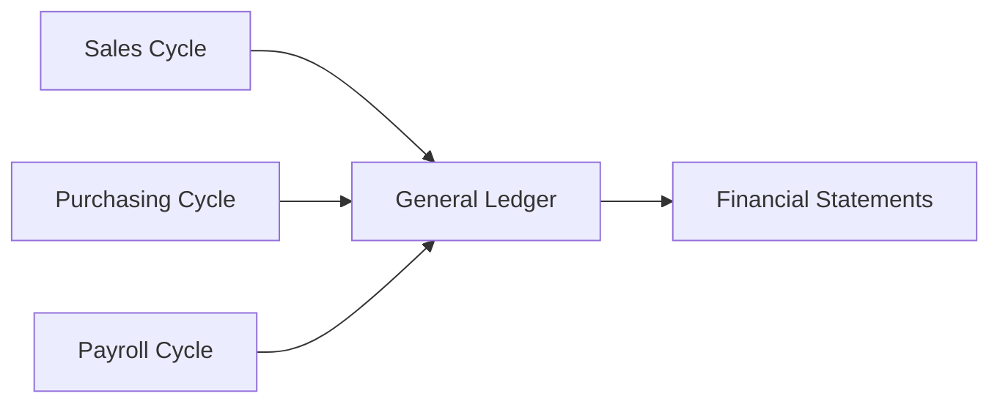
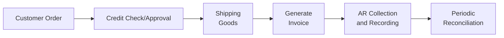
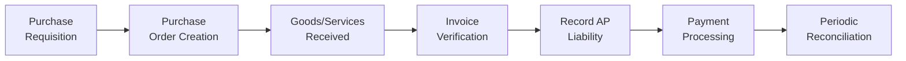
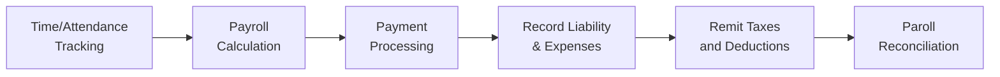

## 7.1 Core Transaction Cycles and Supporting Modules

In modern organizations, understanding core transaction cycles is critical for effective financial management, accurate reporting, regulatory compliance, and robust internal controls. The three primary transaction cycles that most directly influence financial statements and daily operations are the Sales Cycle, the Purchasing Cycle, and the Payroll Cycle. Each cycle can be understood as a chain of interconnected processes—supported by specific Accounting Information System (AIS) modules—that record, reconcile, and report financial data to all relevant stakeholders. When these cycles run smoothly and controls are properly designed, organizations can reliably capture transactions for financial reporting, mitigate fraud and error, and maintain an orderly flow of operations.

This section provides an in-depth examination of these major cycles, focusing on:
• The nature and scope of the Sales, Purchasing, and Payroll Cycles.  
• The supporting AIS modules that manage and document each cycle.  
• Typical control points and best practices to ensure accuracy, completeness, and compliance.

By mastering these concepts, CPAs and IT auditors can more effectively identify, evaluate, and test pertinent internal controls aligned with key objectives—ensuring that transactions within these cycles are valid, accurately recorded, and properly authorized.  

## Transaction Cycles: An Overview

A “transaction cycle” is a group of related processes or steps that track the movement of resources (goods, services, or funds) and supporting data through an organization’s operational and financial systems. Each cycle generally involves the initiation, authorization, execution, and recording of transactions. In an enterprise resource planning (ERP) environment, specific AIS modules collaborate to capture, process, and reconcile the critical data tied to each cycle.

Since the Sales, Purchasing, and Payroll Cycles most frequently affect an organization’s profit and loss, cash flow, and balance sheet positions, they are typically granted substantial internal control focus. Each cycle will also interface with core financial modules such as General Ledger (GL), Accounts Receivable (AR), Accounts Payable (AP), Cash Management, and Human Resources (HR). While these cycles may vary by industry and organizational size, common threads remain consistent, including the need for segregation of duties, authorization controls, data validation, and compliance with relevant accounting standards.

Below is a high-level illustration of how these cycles interconnect with one another and with the overall financial reporting system:

This diagram highlights that each cycle independently feeds into the General Ledger, generating financial data for consolidated reporting on the organization’s performance.

---

## The Sales Cycle

The Sales Cycle focuses on processing customer orders, delivering goods or services, recording receivables, and managing cash collections. Its principal objectives are:  
• Ensuring that all sales transactions are authorized (e.g., credit checks, approvals, valid pricing structures).  
• Validating that sales are accurately recorded and promptly relayed to Accounts Receivable.  
• Safeguarding against revenue recognition errors (timing, completeness, and validity).  

### Main Steps in the Sales Cycle

1. Customer Order Entry:  
   Typically initiated when a customer request is received. During this stage, the system might automatically validate product availability and pricing.  

2. Credit Approval (if required):  
   Credit checks help the organization avoid uncollectible sales. AIS modules often link to credit management submodules, which track customer credit limits and payment history.  

3. Order Fulfillment:  
   This involves picking, packing, shipping goods, or providing services. Accurate documentation (e.g., packing slips, shipping confirmations) ensures reliability in order processing.  

4. Invoicing and Billing:  
   Once products are shipped or services rendered, billing information is generated. A common AIS module for billing captures invoice data, calculates taxes, distributes invoices, and updates AR.  

5. Cash Collections and Accounts Receivable Updating:  
   Customer payments (checks, wire transfers, online platforms) are recorded, typically requiring a lockbox or defined accounts receivable payment process.  

6. Periodic Reconciliation and Reporting:  
   The Sales Cycle data is periodically posted to the General Ledger and ultimately reflected in financial reports.  

### Supporting AIS Modules

- Sales Order Processing (SOP): Manages entry and tracking of sales orders.  
- Inventory Management: Tracks inventory status and availability for each order.  
- Billing/Invoicing: Automates creation and distribution of invoices once goods or services are delivered.  
- Accounts Receivable: Posts received cash and maintains outstanding customer balances.  
- Credit and Collections: Monitors overdue invoices and enforces collection policies.  

### Key Control Points

• Authorization and Credit Limits: Prevent unauthorized transactions and mitigate credit risk.  
• Segregation of Duties: Separate sales order entry, credit approval, shipping, and cash receipt recording to reduce the risk of fraud.  
• Records Accuracy and Completeness: Automated input validation and mandatory data fields help reduce errors in order entry and shipment confirmations.  
• Reconciliation of Invoices and Shipments: Comparing shipping logs with invoiced data ensures that no shipped orders go unbilled or generate duplicate invoices.  
• Restrictive Endorsements on Checks: Safeguard customer payments against misappropriation; ideally, use lockbox services.  
• Monitoring and Exception Reports: Detect anomalies such as sales exceeding credit limits or consecutive partial shipments.  

Below is a simplified diagram showing the flow of documents and data in a Sales Cycle:

---

## The Purchasing Cycle

The Purchasing Cycle (also frequently referred to as the Expenditure Cycle or Procure-to-Pay Process) deals with acquiring goods or services, storing or utilizing them, recording liabilities, and making payments. Effective administration of this cycle reduces risk of overpayments, missed vendors’ invoices, or fraud (e.g., fictitious vendors).

### Main Steps in the Purchasing Cycle

1. Purchase Requisition:  
   Department managers or authorized staff create a requisition requesting a certain good or service.  

2. Purchase Order (PO) Approval:  
   Once the requisition is approved, procurement issues a formal PO to the vendor. This step often involves an approval workflow in the AIS based on financial thresholds and role-based permissions.  

3. Receiving and Inspection:  
   When goods are delivered, they are inspected for quality and quantity. A receiving report is generated and matched against the PO and vendor’s packing slip.  

4. Vendor Invoice Processing:  
   The vendor sends an invoice, which is matched against the PO and receiving report in a three-way match process (PO, receiving report, invoice). This ensures the organization only pays for goods actually ordered and received.  

5. Accounts Payable Recording and Payment:  
   Once the invoice is verified, the liability is recorded in the Accounts Payable module. Payments are later made via checks or electronic funds transfers (EFT).  

6. Periodic Reconciliation and Reporting:  
   Summaries of outstanding payables, purchase accruals, and realized expenses feed into the General Ledger for financial reporting and cash flow planning.  

### Supporting AIS Modules

- Purchase Requisition/Order Processing: Initiates and manages internal requests and POs.  
- Vendor Master Data: Stores essential details about vendors, including payment terms and contact information.  
- Receiving and Inspection: Records deliveries, facilitating the match with POs and eventually with vendor invoices.  
- Accounts Payable: Captures, tracks, and manages the organization’s liabilities to vendors, issues vendor payments, and updates the General Ledger.  
- Cash Disbursements: Automates or supports payment processes such as checks, ACH transfers, or wire transfers.  

### Key Control Points

• Approval Requirements: Ensure POs are approved according to delegated authority and consistent with budgeting.  
• Three-Way Match: A cornerstone control that matches the PO, receiving report, and vendor invoice to verify the legitimacy of payment.  
• Vendor Master File Controls: Prevent unauthorized vendors or erroneous vendor information by implementing restricted access and segregation of duties for vendor data updates.  
• Payment Authorization: Ensure all disbursements are authorized, with checks/EFTs requiring dual signatures or multi-factor approval (especially for large amounts).  
• Proper Cutoff: Confirm that expenses are recognized in the correct period.  
• Segregation of Duties: Keep roles for requisitioning, receiving, invoice processing, and payment authorization distinct to reduce fraud risk.  

Below is an illustrative diagram of the Purchasing Cycle:

---

## The Payroll Cycle

The Payroll Cycle encompasses the processes needed to compensate employees accurately and on time, along with the requisite statutory reporting and payments (tax withholdings, payroll deductions). Because salaries and wages are often a significant expense for most entities, controlling payroll errors, fraud (e.g., ghost employees, inflated hours), and unauthorized pay rates is paramount.

### Main Steps in the Payroll Cycle

1. Time and Attendance Data Collection:  
   Employee hours, productivity, or project-based input is collected. Automated time-keeping systems often interface directly with the Payroll module.  

2. Payroll Calculation:  
   Gross pay is calculated based on hours worked (or contractual salaries), pay rates, commissions, and bonuses. The system then computes statutory withholdings (income tax, social security, Medicare) and voluntary deductions (401(k), insurance contributions, union dues).  

3. Pay Distribution:  
   Fund disbursements are typically done via direct deposit, checks, or pay cards. The payroll system updates the employee’s net pay and the bank or cash ledger.  

4. Preparation of Payroll Reports and Journal Entries:  
   Summaries of gross pay, deductions, and employer taxes funnel into periodic reports (both internal and external, such as tax authorities). A summary entry is posted to the General Ledger for each pay period.  

5. Payment of Payroll Liabilities:  
   Employers must remit withheld amounts and employer contributions to the appropriate agencies (e.g., IRS, insurance providers).  

6. Periodic Reconciliation and Regulatory Reporting:  
   This includes period-end reconciliation of payroll-related accruals, W-2 or 1099 preparation in the United States, T4 in Canada, etc.  

### Supporting AIS Modules

- Human Resources (HR) System: Maintains employee master data, including roles, salaries, benefits, and tax details.  
- Time and Attendance: Automates capture of employee attendance and ensures accurate integration into payroll calculations.  
- Payroll Calculation and Processing: Central module that calculates gross and net pay, taxes, and deductions.  
- General Ledger Interface: Posts periodic summary payroll expenses and remittances for statutory withholdings.  
- Tax and Regulatory Reporting: Helps comply with federal, state/provincial, or local requirements for payroll taxes and contributions.  

### Key Control Points

• Access Controls Over Employee Master Data: Restrict who can add or modify employee records, rates, or deductions to prevent ghost employees or unauthorized raises.  
• Segregation of Duties: Separate HR (employee hiring and data management), payroll calculation, and final pay distribution roles.  
• Time Reporting Validations: Validate reported hours against schedules or management approvals.  
• Automated Tax Tables and Deductions: Ensure timely updates to tax tables and accurate application of benefit deductions.  
• Bank Reconciliation of Payroll Account: Confirm that the amounts charged to payroll clearing accounts match actual payments.  
• Independent Review of Payroll Registers: Management or internal audit can spot-check payroll registers for irregularities.  

Below is a simplified diagram of the Payroll Cycle:

---

## Linking the Cycles to Supporting Modules

A well-integrated AIS architecture ties these three cycles together with overarching modules such as the General Ledger, Banking, and Reporting tools. For instance, if an organization uses an ERP system such as SAP, Oracle, or Microsoft Dynamics:

• The Sales Cycle is often tied to modules named Sales & Distribution (SAP), Order to Cash, or similar.  
• The Purchasing Cycle is often labeled Materials Management, Procurement, or Purchase to Pay.  
• The Payroll Cycle can reside within a Human Capital Management (HCM) or HR module.  

Data from each of these specialized modules is ultimately aggregated into the General Ledger. Auditors often follow transactions from these subledgers to the General Ledger to ensure the completeness and validity of data.  

---

## Best Practices and Common Pitfalls

### Best Practices

• Leverage Automated Approval Workflows  
  Minimizing manual intervention in approval processes reduces error and potential fraud. Configuring system-based rules for credit limits, purchase order thresholds, or payroll changes grants greater consistency and transparency.

• Conduct Periodic Cross-Functional Reviews  
  Encouraging collaboration among finance, operations, and IT can detect anomalies and inefficiencies in transaction processing. Regular reviews of exception reports can also uncover areas of emerging risk.

• Implement Segregation of Duties in AIS  
  Ensure that security roles in the AIS reflect multiple layers of review, with key tasks (e.g., vendor creation, payment approvals) separated among different individuals or groups.

• Use Continuous Monitoring or Real-Time Controls  
  Modern AIS and ERP systems often allow for real-time alerts or triggers when suspicious activities occur (e.g., a sudden spike in payroll hours, an unusually large invoice, or shipments to new addresses).

• Maintain a Robust Audit Trail  
  A well-designed AIS will log all critical transactions, capturing changes in master data, user IDs for approvals, and timestamps. An audit trail is indispensable for investigations and external audits.

### Common Pitfalls

• Over-Reliance on Automated Controls Without Proper Monitoring  
  Even strong automated controls can fail or be bypassed if underlying master data or system parameters are incorrect. Periodic manual spot checks are still essential.

• Inadequate Vendor and Customer Master Data Maintenance  
  Errors in vendor or customer data can lead to misdirected shipments, duplicate payments, or extended credit to risky clients.

• Insufficient Management Overrides Review  
  Managerial overrides may be necessary in special circumstances but should be tracked, documented, and subject to higher-level reviews to prevent misuse.

• Lack of Contingency Planning or Backup for Payroll  
  Failing to plan for system downtime can disrupt payroll processing and pay distribution, creating substantial employee dissatisfaction and potential legal exposure.

---

## Real-World Scenario

Imagine a mid-sized manufacturing company implementing a new ERP system to replace disparate legacy systems. In the Sales Cycle, they design an automated credit check that references real-time credit agency data. The Purchasing Cycle merges purchase requisitions, approvals, and vendor invoices into a single “Procure-to-Pay” module that automatically flags any mismatch between the PO, receiving report, and the vendor invoice. Meanwhile, the Payroll Cycle integrates with an on-site time-clock system that logs employee hours directly into HR software, drastically reducing manual data entry errors.

Following go-live, the company detects a rising number of exceptional transactions flagged by the new system (e.g., near-credit-limit sales, repeated partial shipments, or short deliveries). They respond proactively by revisiting their automated approval thresholds and improving staff training. Within three months, the exception rate falls … simultaneously reducing negative inventory balances, unfulfilled POs, and payroll timesheet adjustments. This scenario underscores how integrated AIS functionalities significantly bolster internal controls once properly configured and monitored.

---

## Conclusion

The Sales, Purchasing, and Payroll Cycles serve as the bedrock of financial and operational activity in most organizations. When well-defined and supported by robust AIS modules—Sales Order Processing, Inventory Management, Billing, Accounts Receivable, Procurement, Accounts Payable, Payroll, and HR—these cycles can deliver timely, accurate, and reliable data for decision-making and external reporting. Effectively designed controls and segregation of duties, combined with continuous monitoring, help prevent fraud, detect errors, and keep the organization in compliance with accounting standards and regulations.

Professional accountants, auditors, and IT specialists who master these transaction cycles and the associated controls can provide substantial value by reducing risks, improving efficiency, and ensuring trustworthy financial statements. As technology continues to evolve, new solutions like automated workflows, AI-based anomaly detection, and predictive analytics will further enhance the reliability and agility of these foundational processes.

---

## Quiz on Core Transaction Cycles and Supporting Modules



### In the Sales Cycle, which control best addresses the risk of credit sales to customers who might default on payment?

- [ ] Automated billing schedules
- [ ] Physical inventory counts
- [x] Credit checks and authorized credit limits
- [ ] Automated reorder point triggers

> **Explanation:** Credit checks and authorized credit limits ensure that customers are able to pay, thus mitigating the risk of sales to unqualified or high-risk accounts.

### Which of the following most directly helps ensure that an organization pays only for goods actually received?

- [ ] Two-Way Match of PO and Receiving Report
- [ ] Management Review of AP Aging
- [x] Three-Way Match among PO, Receiving Report, and Vendor Invoice
- [ ] Cash Reconciliation

> **Explanation:** A three-way match (PO, Receiving Report, Invoice) verifies the order, receipt, and billed amount all align, ensuring that only legitimate liabilities are paid.

### In the Payroll Cycle, which master data control is critical for preventing “ghost employees”?

- [x] Restricting access to add or modify employee records to authorized personnel
- [ ] Setting an automatic rehire flag for seasonal workers
- [ ] Posting payroll expenses to a suspense account
- [ ] Quarterly destroying all payroll records

> **Explanation:** Only authorized HR personnel should be able to add or edit employee information; restricting this access prevents the creation of fictitious employees.

### Which AIS module typically handles the recording of sales invoices and updates customer balances?

- [ ] Human Resources
- [x] Accounts Receivable
- [ ] Materials Management
- [ ] Tax Reporting

> **Explanation:** The AR module records sales invoices as receivables, then tracks and updates these customer balances when payment is received.

### A “purchase requisition” is critical in which step of the Purchasing Cycle?

- [x] Initiating the need for goods or services
- [ ] Matching purchase orders to vendor invoices
- [x] Requesting approval for an upcoming purchase
- [ ] Concluding the payment process

> **Explanation:** A purchase requisition signals an internal need to buy goods or services and triggers the formal purchasing process. It is also subject to approval thresholds to ensure legitimacy.

### What is the key objective of the Three-Way Match control in the Purchasing Cycle?

- [x] Ensure lien release forms are properly filed
- [ ] Merge vendor records with bank statements
- [ ] Automate petty cash reconciliation
- [x] Match PO, receiving, and invoicing details to verify validity and accuracy

> **Explanation:** The Three-Way Match ensures that the goods received and invoiced align with the purchase order, preventing overpayments or payment for unreceived items.

### In the Sales Cycle, which process directly precedes the billing step?

- [x] Shipping of goods or delivery of services
- [ ] Cash receipts processing
- [x] Credit memo issuance
- [ ] Periodic bank reconciliation

> **Explanation:** Typically, once goods are shipped or services rendered, the organization bills the customer, linking shipping details to invoicing.

### Which of the following is a critical control in the Payroll Cycle to ensure wage accuracy?

- [x] Validating reported hours against authorized time records
- [ ] Assigning credit limits to employees
- [x] Automatically sending GL updates after each invoice
- [ ] Reconciling petty cash daily

> **Explanation:** Checking hours against authorized time records and payroll schedules helps ensure employees are paid for actual time worked.

### What best describes segregation of duties in the Sales Cycle?

- [x] Splitting up tasks such as order entry, credit approval, shipping, and collection
- [ ] Combining AR and AP roles for more efficiency
- [ ] Automating all sales tasks in a single user account
- [ ] Granting all employees equal system access rights

> **Explanation:** Segregation of duties in the Sales Cycle reduces the risk of fraud or errors by ensuring no single individual controls multiple key steps in the same transaction flow.

### True or False: A robust AIS typically consolidates the Sales, Purchasing, and Payroll transactions directly into the General Ledger, facilitating comprehensive financial reporting.

- [x] True
- [ ] False

> **Explanation:** AIS integrates individual cycles (Sales, Purchasing, Payroll) and merges their data into the General Ledger for accurate, efficient financial reporting.



---

## For Additional Practice and Deeper Preparation

### [Information Systems and Controls (ISC)](https://www.udemy.com/course/isc-cpa-mock-exams/?referralCode=E1217303222935C5E464)

**Information Systems and Controls (ISC) CPA Mocks:** 6 Full (1,500 Qs), Harder Than Real! In-Depth & Clear. Crush With Confidence!

- Tackle full-length mock exams designed to mirror real ISC questions.  
- Refine your exam-day strategies with detailed, step-by-step solutions for every scenario.  
- Explore in-depth rationales that reinforce higher-level concepts, giving you an edge on test day.  
- Boost confidence and minimize anxiety by mastering every corner of the ISC blueprint.  
- Perfect for those seeking exceptionally hard mocks and real-world readiness.

_Disclaimer: This course is not endorsed by or affiliated with the AICPA, NASBA, or any official CPA Examination authority. All content is for educational and preparatory purposes only._
