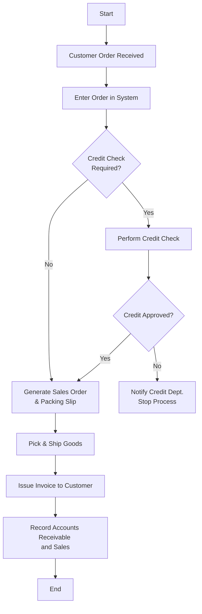
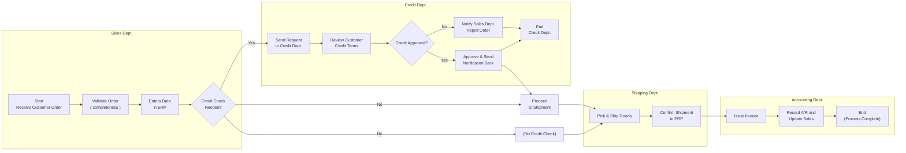

## 7.2 Flowcharting and Business Process Diagrams

Flowcharting and business process diagrams are essential tools for Certified Public Accountants (CPAs) and other finance professionals seeking to understand and evaluate how transactions move through an organization’s systems. Diagrams transform abstract processes into visual representations, enabling deeper insights into control design, risk management, and operational efficiency. This section focuses on standard flowcharting techniques, key symbols, best practices, and illustrative examples that guide you in mapping processes—from the moment a transaction is initiated to the point at which it is recorded in the financial statements. By mastering these techniques, you can more effectively spot potential control deficiencies, identify segregation-of-duties conflicts, and design more robust internal control structures.

--------------------------------------------------------------------------------
### Importance of Flowcharting in Accounting and IT
Flowcharts provide a bird’s-eye view of a sequence of activities or a business process. In the context of information systems (IS) and controls, they serve multiple purposes:

• Clarifying Roles and Responsibilities: Flowcharts highlight the specific tasks of individuals or departments within a process.  
• Identifying Control Points: By explicitly marking where approvals, verifications, or reconciliations occur, flowcharts help pinpoint control strengths and weaknesses.  
• Streamlining Communication: Visual diagrams facilitate discussions between accountants, IT professionals, and management regarding system complexities.  
• Enhancing Efficiency and Accuracy: Detailed flowcharts are instrumental in redesigning processes for reduced redundancy and improved cost-effectiveness.  
• Aiding in Compliance and Audit: In disciplines governed by frameworks such as COSO, COBIT, and NIST, flowcharting contributes to meeting compliance requirements by establishing clear, documented controls.

--------------------------------------------------------------------------------
### Overview of Common Flowchart Types
Different flowchart styles cater to various information needs:

• System (or Process) Flowcharts: Present the flow of data or transactions through information systems, describing how inputs are transformed into outputs.  
• Document Flowcharts: Trace physical documents or data flows across organizational departments, emphasizing control points for physical/logical documents.  
• Program Flowcharts: Illustrate the logic of a software program, typically used by developers for coding and debugging. Though these can be complex, they may be relevant in IT audits when assessing system modifications or integrations.  
• Business Process Diagrams (BPMN): Use Business Process Model and Notation to capture end-to-end process flows, roles, tasks, and events, making them especially useful for interdepartmental communication.

--------------------------------------------------------------------------------
### Standard Flowchart Symbols
The symbols below are widely recognized in both accounting and information technology contexts:

• Terminator (Start/End): An oval or pill-shaped symbol indicating the beginning or conclusion of a flow.  
• Process: A rectangle indicating a task, function, or activity within the process.  
• Decision: A diamond symbol signaling a branching point where a question must be answered for the process to proceed along one of several paths.  
• Document: A rectangle with a wavy base, representing the creation or use of a physical or electronic document.  
• Manual Input: A parallelogram or skewed rectangle, showing a user manually entering data into a system.  
• On-Page Connector: A small circle or lettered symbol used to continue the flow on the same page.  
• Off-Page Connector: A pentagon (often labeled with a letter, number, or reference) that directs the reader to a corresponding connector on another page.  
• Data Storage: A cylinder or open-ended rectangle (depending on the convention) illustrating where data is stored in a database or a file.  
• Arrow/Flow Line: A line with an arrowhead indicating the direction of data or document flow.

Below is a concise reference table for basic flowcharting symbols that are commonly used in accounting and IT process documentation:

| Symbol          | Name             | Description                                                                 |
|-----------------|------------------|-----------------------------------------------------------------------------|
| Oval            | Terminator       | Start/end of the process flow                                               |
| Rectangle       | Process          | A task or series of tasks performed                                         |
| Diamond         | Decision         | A branching point requiring a yes/no or true/false response                 |
| Document        | Document         | A paper or electronic document relevant to the process                      |
| Parallelogram   | Manual Input     | Data entry performed by a person                                            |
| Cylinder        | Data Storage     | Storing data in a database or storage system                                |
| Arrow           | Flow Line        | Indicates direction or flow of the process                                  |
| Circle or Letter| Connector        | On- or off-page connector reference                                         |

--------------------------------------------------------------------------------
### Constructing a Basic Accounting Flowchart
A well-designed flowchart follows a logical sequence (often top-to-bottom or left-to-right). Take the following best practices into account:

• Consistent Orientation: Arrange symbols and flows consistently (e.g., top to bottom).  
• Labeling Precision: Use short, clear labels for each symbol, ensuring consistent terminology.  
• Minimal Clutter: Avoid crossing lines whenever possible. If lines must cross, use connectors or bridging to maintain clarity.  
• Clear Decision Paths: Every diamond (decision symbol) must have at least two labeled exit arrows.  
• Sufficient White Space: Organize symbols in a way that leaves room for additional annotations or references to internal controls.

--------------------------------------------------------------------------------
### Flowchart Example: Sales Transaction from Initiation to Recording
Below is a simplified flowchart that depicts a typical sales transaction process. This example traces a customer order from receipt to final recording in the accounting books.  

Explanation of Key Segments:

1. Order Receipt: The process begins when a customer order arrives. A flowchart symbol (rectangle) captures the tasks of receiving and entering the order into the system.  
2. Credit Check: A decision symbol (diamond) prompts verification of whether a credit check is necessary, frequently driven by company policy. If required, the process includes a further decision diamond to determine if credit is approved.  
3. Shipping and Invoicing: Upon credit approval, the sales order is generated, goods are picked, packed, and shipped. The system automatically or manually generates an invoice.  
4. Recording Transactions: Finally, the process ends with Accounts Receivable (A/R) and Sales recorded in the general ledger (GL), completing the transaction cycle from initiation to accounting recognition.

In practice, you will insert additional steps or control points for approvals, segregation of duties, and compliance with internal policies. For instance, the shipping department will verify the order quantity against the packing slip, and the billing department will ensure that the invoice matches the shipped quantity and prices.

--------------------------------------------------------------------------------
### Business Process Model and Notation (BPMN)
While traditional flowcharts remain popular for their simplicity, Business Process Model and Notation (BPMN) offers a richer semantic framework for depicting business processes, events, participants, and inter-departmental interactions. It is widely used in enterprise resource planning (ERP) systems, complex process redesign initiatives, and cross-functional mapping.

Key BPMN Elements:
• Pools and Lanes: Define responsibilities by department or role.  
• Events (Start, Intermediate, End): Capture triggers, timers, or other events that start, interrupt, or end a process.  
• Tasks: Represent activities within a process scope (equivalent to flowchart process rectangles).  
• Gateways (Diamonds): Indicate splits or merges in the process flow, similar to flowchart decision points.  
• Message Flows: Represent communication between distinct process participants.

--------------------------------------------------------------------------------
### Example of a BPMN Diagram Within an ERP Environment
The following Mermaid-based BPMN-style diagram demonstrates how different departments (Sales, Credit, Shipping, Accounting) collaborate for the same sales transaction process depicted in the earlier flowchart.

Description:

1. Sales Dept.: Initiates the order, enters data into the ERP, and checks if a credit check is required.  
2. Credit Dept.: Receives credit check requests, reviews customer terms, and communicates approval or rejection back to the sales team.  
3. Shipping Dept.: Once approved, shipping staff picks and ships goods, confirming the shipment details in the ERP.  
4. Accounting Dept.: Receives shipment confirmation, issues the invoice, records the A/R, and updates the financials.

--------------------------------------------------------------------------------
### Integrating Internal Controls Within Flowcharts and BPMN
Flowcharts and BPMN diagrams can highlight specific internal controls within a process. For example:

• **Authorization Controls**: Show who must approve a transaction through symbols or annotations.  
• **Segregation of Duties**: Visually split tasks between different lanes (e.g., one for the Sales Dept. and one for the Credit Dept.).  
• **Verification Steps**: Insert decision symbols or events to represent actions like three-way matching (purchase order, shipping document, and invoice).  
• **Exception Handling**: Use branching to depict how outliers or errors are addressed and escalated.  

By embedding these control steps, readers can quickly identify how each control is initiated, executed, and monitored.

--------------------------------------------------------------------------------
### Advantages and Limitations of Flowcharts
Before standardizing flowcharts as part of your documentation or audit methodology, consider the following:

• Advantages:  
  – Simple Visual Communication: Flowcharts are easy to grasp for both technical and non-technical stakeholders.  
  – Uniform Understanding: Reduced misinterpretation of textual narratives and complex instructions.  
  – Problem and Risk Identification: Gaps or redundancies in a process often become clearer when mapped graphically.  
  – Basis for Automation: Well-documented processes can be easily transformed into automated workflows, especially in ERP or RPA (Robotic Process Automation) setups.

• Limitations:  
  – Maintenance Overhead: Process changes require consistent updates of diagrams. Out-of-date flowcharts can create confusion.  
  – Can Become Overly Complex: Large organizations with sprawling transactions might need advanced BPMN or hierarchical flowcharts to maintain clarity.  
  – Not a Substitute for Narrative: Flowcharts complement, but do not replace, detailed documentation of responsibilities, policies, or regulatory compliance requirements.

--------------------------------------------------------------------------------
### Tracing a Transaction Through a Flowchart: A Case Study
Imagine a mid-sized retail chain implementing a new sales processing system. As the auditor or internal control specialist:

1. **Identify Major Steps**: From customer order intake to final financial reporting.  
2. **Assign Departments**: Sales, Shipping, Accounting, etc.  
3. **Pinpoint Key Controls**: Approval thresholds for credit, verification of shipments, separation of duties for record-keeping.  
4. **Draw the Process with Standard Symbols**: Show multiple decision points and connectors to make the chain of events clear.  
5. **Analyze the Diagram**: Are there bypasses to certain controls? Are tasks consolidated into a single role that poses a segregation-of-duties risk?  
6. **Recommend Improvements**: Suggest additional control steps (e.g., daily credit review by a separate function) and ensure the process steps are feasible.

This visual approach often leads to immediate clarity about potential bottlenecks or control weaknesses that might otherwise go unnoticed.

--------------------------------------------------------------------------------
### Common Pitfalls in Flowcharting
• **Overcomplicating the Diagram**: Trying to capture every minor detail can cause confusion. Instead, maintain a big-picture perspective.  
• **Using Inconsistent Symbol Definitions**: Different notations can create ambiguity. A standardized legend is advisable.  
• **Missing Decision Paths**: Failing to label all branches from a decision diamond can lead to incomplete process representation.  
• **Ignoring Iterative Processes**: Some tasks are repeated several times (e.g., invoice revisions). Depict these loops clearly.  
• **Not Involving Key Stakeholders**: Flowcharts should incorporate insights from everyone involved in the process, including staff who execute daily tasks and managers who oversee them.

--------------------------------------------------------------------------------
### Best Practices for Effective Flowcharts and Business Process Diagrams
1. **Start With High-Level Processes**: Map from a bird’s-eye perspective before adding layers of detail.  
2. **Define Clear Scope**: Specify which part of the process or system the flowchart covers, ensuring it aligns with audit or business objectives.  
3. **Use Consistent Icons and Colors**: For example, use one color for processes, another for decisions, or use lane shading to emphasize departmental responsibilities.  
4. **Review and Validate**: Involve process owners and relevant stakeholders to verify accuracy.  
5. **Document Assumptions**: If a step is assumed to be performed automatically or outside the system, note this to avoid confusion.  
6. **Update Regularly**: Schedule reviews to keep flowcharts in sync with business changes, especially after system upgrades, new regulatory requirements, or organizational restructuring.

--------------------------------------------------------------------------------
### Conclusion
Flowcharts and business process diagrams lie at the heart of effective audit practices, risk management, and system documentation in modern accounting environments. They make complex processes accessible, reduce misunderstandings, and highlight the interplay between various departments and controls. Whether you choose a simple flowchart or adopt BPMN for complex ERP environments, these visual tools are indispensable for uncovering inefficiencies, non-compliance risks, and control gaps.

In the next sections of this chapter (7.3 Evaluating Processing Integrity Controls in Major Cycles, 7.4 Common Control Deficiencies and Mitigation Techniques, and 7.5 Third-Party and Vendor Risk Management), you will see how detailed mapping of cycles and controls serves as the backbone for a thorough risk assessment and control analysis. By honing your skills in flowcharting and business process diagramming, you build a strong foundation for effective auditing, consulting, and compliance work.

--------------------------------------------------------------------------------
### References and Further Reading
• AICPA. “Audit and Accounting Guide: Audit Sampling.” A comprehensive reference for sampling methodologies in financial audits and IT contexts.  
• BPMN 2.0 Specification. Official resource to learn the ins and outs of BPMN.  
• COSO Internal Control—Integrated Framework. Explains how to align visual process controls with a larger internal control structure.  
• Taylor, G. “Accounting Information Systems: Understanding Business Processes.” A helpful textbook focusing on AIS documentation and flowcharting best practices.  

--------------------------------------------------------------------------------

## Test Your Knowledge of Flowcharting and Business Process Diagrams



### Which symbol is typically used to denote a decision point in a standard flowchart?
- [ ] Rectangle
- [ ] Oval
- [x] Diamond
- [ ] Arrow  

> **Explanation:** Diamonds represent decision points in flowcharts, requiring a yes/no or true/false branch.

### What is an advantage of using flowcharts in accounting processes?
- [x] They simplify complex process steps into a clear, visual depiction.
- [ ] They eliminate the need for any written documentation.
- [ ] They are solely for IT professionals and do not concern accountants.
- [ ] They automatically prevent errors in transaction recording.

> **Explanation:** Flowcharts visually communicate complex processes, but they do not replace written documentation nor fully prevent errors by themselves.

### In BPMN, which element is used to denote the division of responsibilities among different departments or roles?
- [x] Lanes
- [ ] Decision diamonds
- [ ] Arrow connectors
- [ ] Data storage cylinders

> **Explanation:** BPMN pools and lanes visually segment tasks according to the department or role responsible, clarifying accountability.

### Which of the following is considered a best practice when developing a flowchart?
- [x] Use consistent symbols and color schemes throughout.
- [ ] Always start with the most detailed task first.
- [ ] Represent all decision points as rectangles.
- [ ] Never label loops or iterative tasks.

> **Explanation:** Ensuring consistency in formatting is crucial for clarity. Rectangles denote processes, not decisions, and iterative tasks should be clearly labeled.

### Why might an organization choose BPMN over a standard flowchart?
- [x] BPMN provides richer semantics for complex, cross-departmental processes.
- [ ] BPMN requires fewer resources to create.
- [x] BPMN can depict advanced event handling, such as message flows and timers.
- [ ] BPMN is less recognized by stakeholders and regulators.

> **Explanation:** BPMN offers advanced features for multi-departmental processes, event handling, and message flows, making it suitable for complex enterprise scenarios.

### What is the primary role of a flowchart connector symbol?
- [x] It indicates how the process continues on the same or another page.
- [ ] It is used interchangeably with a terminator.
- [ ] It duplicates the process steps for printing.
- [ ] It shows the final step of authorization.

> **Explanation:** Connectors unify layouts and indicate continuation points when the diagram flows from one page or segment to another.

### In which scenario is flowcharting most likely to uncover hidden control weaknesses?
- [x] Analyzing the end-to-end process flow for a sales transaction cycle.
- [ ] Reading a high-level financial statement footnote.
- [x] Mapping out an inventory process that crosses multiple functional areas.
- [ ] Creating a simple organizational chart with staff photos.

> **Explanation:** Flowcharts reveal how tasks and responsibilities move across departments, making it easier to detect opportunities for error or fraud.

### Which of the following is a common pitfall when designing a flowchart?
- [x] Over-complicating diagrams with too many details.
- [ ] Labeling each shape or arrow.
- [ ] Indicating both normal and exception paths.
- [ ] Using diamonds for decisions.

> **Explanation:** Including unnecessary details can clutter a flowchart, making it difficult to follow. Labels for shapes and arrows are essential, not pitfalls.

### How can you best capture control points in a flowchart or BPMN diagram?
- [x] Incorporate authorization, verification, or segregation-of-duties steps within the diagram.
- [ ] Remove all decision symbols to focus only on standard processes.
- [ ] Use off-page connectors whenever a control needs to be highlighted.
- [ ] Never mention formal control steps in visual documentation.

> **Explanation:** Specifically indicating where authorization, verification, or segregation-of-duties controls occur makes it easier to identify and evaluate control quality.

### Flowcharts are helpful because they allow readers to:
- [x] Easily visualize the flow of operations, identify potential control weaknesses, and reduce misinterpretations.
- [ ] Eliminate the entire need for narratives or policy documents in an audit.
- [ ] Guarantee that financial data will be error-free.
- [ ] Bypass the credit approval processes.

> **Explanation:** Flowcharts help clarify and visualize processes, but they do not negate the need for thorough documentation, nor can they guarantee error-free transactions.



--------------------------------------------------------------------------------

## For Additional Practice and Deeper Preparation

### [Information Systems and Controls (ISC)](https://www.udemy.com/course/isc-cpa-mock-exams/?referralCode=E1217303222935C5E464)

**Information Systems and Controls (ISC) CPA Mocks:** 6 Full (1,500 Qs), Harder Than Real! In-Depth & Clear. Crush With Confidence!

- Tackle full-length mock exams designed to mirror real ISC questions.  
- Refine your exam-day strategies with detailed, step-by-step solutions for every scenario.  
- Explore in-depth rationales that reinforce higher-level concepts, giving you an edge on test day.  
- Boost confidence and minimize anxiety by mastering every corner of the ISC blueprint.  
- Perfect for those seeking exceptionally hard mocks and real-world readiness.

_Disclaimer: This course is not endorsed by or affiliated with the AICPA, NASBA, or any official CPA Examination authority. All content is for educational and preparatory purposes only._
