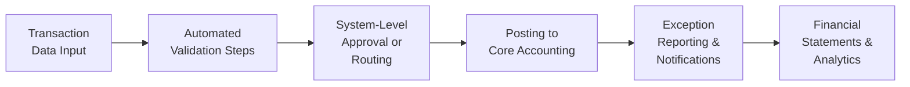

## 7.3 Evaluating Processing Integrity Controls in Major Cycles

Processing integrity is the cornerstone of reliable financial reporting and effective internal controls. It ensures that data flowing through major transaction cycles—such as the revenue, expenditure, payroll, and production cycles—is complete, accurate, and valid. From an IT control perspective, processing integrity covers not only automated validation routines and system checks but also manual oversight and review steps embedded in the workflow.

In this section, we discuss the importance of processing integrity, break down how it is achieved across various business cycles, and examine both automated and manual control methods. We also provide real-world examples, case studies, and best practices for evaluating whether processing integrity controls are effectively designed and operated.

--------------------------------------------------------------------------------

### Understanding Processing Integrity

Processing integrity refers to the reliability of an information system in collecting, processing, storing, and distributing data. It covers three main components:

• Completeness – Ensuring no valid transaction is omitted.  
• Accuracy – Ensuring data is captured, processed, and reported without error.  
• Validity – Ensuring every transaction recorded aligns with legitimate business events authorized by management.

Without proper processing integrity, financial statements and managerial reports risk containing material misstatements, which undermine decision-making and potentially breach regulatory requirements.

--------------------------------------------------------------------------------

### The Role of Processing Integrity in Major Transaction Cycles

Major transaction cycles—commonly including the revenue, expenditure (purchases and accounts payable), payroll, production, and financing cycles—collectively drive the core financial data of an organization. Detailed in Section 7.1 of this chapter, these cycles encapsulate the end-to-end flow of transactions, from initiation to recording in the accounting system.

1. Revenue Cycle  
   • Initiation: Sales orders, contract approvals, customer credit checks  
   • Processing: Invoice generation, shipment, cash receipts  
   • Recording: Updating customer accounts, recognizing revenue  
   
2. Expenditure Cycle  
   • Initiation: Purchase requisitions, vendor selection, purchase orders  
   • Processing: Receipts of goods or services, invoice approval, payment runs  
   • Recording: Updating accounts payable and expense ledgers, posting payments
   
3. Payroll Cycle  
   • Initiation: Time and attendance capture, employee payroll data updates  
   • Processing: Calculation of wages, benefits, taxes  
   • Recording: Posting of payroll expenses, liabilities in the general ledger
   
4. Production Cycle (in manufacturing settings)  
   • Initiation: Production orders, bill of materials (BOM), scheduling  
   • Processing: Material usage, labor tracking, work-in-process movement  
   • Recording: Costing entries, finished goods inventory adjustments
   
5. Financing Cycle  
   • Initiation: Cash management decisions, capital injections, debt issuance  
   • Processing: Interest accrual, debt repayment, dividend payments  
   • Recording: Adjustments to equity and liabilities, recognition of finance charges

In each cycle, incomplete, inaccurate, or invalid transactions can distort financial outcomes. Therefore, robust controls—both automated and manual—are critical to preserving data integrity from transaction initiation to final reporting.

--------------------------------------------------------------------------------

### Components of Processing Integrity Controls

The COSO Internal Control – Integrated Framework (discussed in Chapter 3) highlights five components of internal control that help uphold processing integrity:

• Control Environment – The “tone at the top” and company culture around internal controls.  
• Risk Assessment – Ongoing processes for identifying and analyzing data integrity risks.  
• Control Activities – Specific policies and procedures (including IT and manual controls) designed to mitigate identified risks.  
• Information & Communication – Systems and processes that share relevant, timely, and reliable information across stakeholders.  
• Monitoring Activities – Ongoing or periodic assessments of control performance, completeness, and accuracy.

COBIT 2019 (covered in Section 3.3) further elaborates on IT governance measures, ensuring alignment of IT controls with corporate risk appetite and compliance requirements.

--------------------------------------------------------------------------------

### Automated Controls Preserving Completeness, Accuracy, and Validity

Automated controls are system-based measures that execute consistently with minimal human intervention. They are typically configured within an Enterprise Resource Planning (ERP) system or other specialized transaction-processing software:

• Field Edit Checks  
  - Prevent invalid data formats from entering the system (e.g., limiting numeric fields to digits only).  
  - Validate data ranges or codes (e.g., valid customer IDs or vendor codes).

• Auto-Calculation and Posting  
  - Automate price extensions, tax calculations, and depreciation.  
  - Eliminate manual errors in routine calculations.

• System-Triggered Notifications  
  - Alert relevant personnel when a transaction exceeds approved thresholds (e.g., large purchases, high-risk credit customers).  
  - Prevent unauthorized changes to master data (e.g., vendor banking information) by requiring system-level approvals.

• Batch Control Totals  
  - Match the number of transactions entered with system-calculated totals.  
  - Identify mismatches before final posting to detect missing or duplicated transactions.

• Referential Integrity  
  - Maintain logical relationships between tables in a database (e.g., matching an invoice to a valid sales order).  
  - Prevent transactions from being processed if a linked record is missing or invalid.

• Automated Reconciliations  
  - Compare sub-ledger data (e.g., accounts receivable or payable) with general ledger control accounts at scheduled intervals.  
  - Generate exception reports highlighting variances for further investigation.

#### Diagram: Typical Processing Flow With Automated Controls

In this flow, each step includes pre-defined controls that act as “checkpoints,” ensuring data retains completeness, accuracy, and validity before moving forward.

--------------------------------------------------------------------------------

### Manual Controls Preserving Completeness, Accuracy, and Validity

Despite advances in automation, manual controls remain valuable for critical reviews, approvals, and contextual decision-making that a system cannot fully automate:

• Management Approvals and Reviews  
  - Department heads manually review significant transactions (e.g., large capital expenditures, discounted sales orders).  
  - Oversee unusual or high-risk transactions flagged by the system.

• Reconciliations and Exception Handling  
  - Accounting staff reconcile transaction logs, bank statements, or vendor statements with system outputs.  
  - Investigate discrepancies by examining underlying documents.

• Segregation of Duties (SoD)  
  - Separate responsibilities for initiating, approving, and recording transactions.  
  - Limit the risk of intentional or unintentional errors or fraud.

• Independent Checks on Performance  
  - Internal audit departments or external consultants periodically evaluate transaction processing accuracy.  
  - Verify that supporting documents match recorded transactions and that policies are followed.

• Physical Evidence of Authorization  
  - Written or electronic sign-offs on batch totals, purchase orders, or payroll runs.  
  - Documented oversight for policy compliance.

• Analytical Reviews  
  - Compare trends, budgets, and prior periods to identify anomalies (e.g., sudden spikes in expenses, unusual revenue fluctuations).

--------------------------------------------------------------------------------

### Hybrid Controls: Combining Automation and Human Oversight

Increasingly, organizations leverage tools like workflow automation paired with managerial checkpoints. This hybrid approach balances the consistency of automated routines with the critical thinking of subject matter experts. For example:

• Auto-Approvals for Low-Value Transactions  
  - Small purchases below a certain threshold may auto-approve without further review.  
  - Large transactions automatically route to a cost-center manager for verification.

• Alerts to Human Reviewers  
  - A system flags “exception cases” (e.g., negative inventory, overdue deliveries, suspiciously high expense reimbursements).  
  - Designated employees investigate flagged items before the system finalizes them.

• Advanced Data Analytics with Human Interpretation  
  - Tools like machine learning anomaly detection isolate unusual transactions.  
  - Controllers and auditors interpret flagged transactions in context to confirm or reject them.

--------------------------------------------------------------------------------

### Evaluating Control Effectiveness

Assessing whether controls maintain reliable transaction recording often involves a combination of methods illustrated in Chapter 4 (Key Concepts of IT Audit and Assurance):

• Walkthroughs  
  - Tracing a sample transaction from initiation to recording to confirm each step’s control functionality.

• Testing of Key Controls  
  - Re-performance, where the auditor re-executes the control or uses a simulation environment to verify outcomes.  
  - Inquiry and observation of key personnel carrying out the control.

• Sampling Methods  
  - Selecting representative transaction batches from each cycle to test for completeness, accuracy, and validity.

• Control Exception Analysis  
  - Investigating system log anomalies, override attempts, or user-generated error messages.  
  - Scrutinizing unposted or aborted transactions for potential control failures.

• Benchmarking Automated Controls  
  - For stable systems with proven, unchanged programs, external auditors or internal audit can perform less frequent testing once reliability is established.

--------------------------------------------------------------------------------

### Common Pitfalls and Challenges

Despite their importance, processing integrity controls are not immune from deficiencies:

• Overreliance on Automated Controls  
  - Employees may assume the system is always correct and neglect follow-up on system-generated exceptions.

• Poorly Maintained Master Data  
  - Invalid vendor or customer records, outdated pricing, or incomplete product information can corrupt transaction data.

• Inadequate Change Management  
  - Unapproved system changes can bypass essential validations or inadvertently disable existing controls (see Chapter 10 for detailed guidelines).

• Inconsistent Application of Manual Controls  
  - If managers skip monthly reconciliations or signature approvals occur without real scrutiny, errors or fraudulent transactions go undetected.

• Segregation of Duties Conflicts  
  - Resource constraints in smaller organizations or unmonitored user permissions allow one individual to initiate, approve, and record transactions.

--------------------------------------------------------------------------------

### Case Study: Processing Integrity in the Revenue Cycle

Consider a mid-sized wholesale distributor with an ERP system integrated into its warehouse and sales operations. The organization’s key completeness, accuracy, and validity challenges include:

• Ensuring all shipped orders are invoiced (completeness).  
• Capturing correct sales prices and product quantities (accuracy).  
• Authorizing only legitimate customer orders (validity).

To address these, they implement:

• Automated price lookups to prevent unit price errors.  
• System-enforced shipment logs that automatically generate an invoice.  
• Managerial approvals for orders above a certain credit limit.  
• Tiered workflow for order changes triggered by system alerts if modifications exceed threshold.  
• Monthly reconciliation of shipping logs with invoice registers by the accounting department.

Auditors verify the reliability of these controls through transaction walkthroughs, data analytics to spot outliers, and random sampling of order and shipping records. In each test, the final invoice matches the authorized sales order, and the EDM (Electronic Document Management) system ties shipping records to invoice line items.

--------------------------------------------------------------------------------

### Best Practices and Recommendations

1. Harmonize Manual and Automated Controls  
   • Define clear responsibilities for each control and ensure no overlap that confuses roles.  
   • Conduct regular training on manual checks, especially for new hires or those responsible for final approvals.

2. Maintain Up-to-Date Documentation  
   • Document key processes and configuration settings (e.g., system validation rules).  
   • Regularly review and update control procedures to reflect changes in business operations or regulations.

3. Monitor System Logs and Exception Reports  
   • Analyze user activity logs, high-risk transactions, and repeated override attempts.  
   • Act promptly on errors or anomalies identified in logs and exceptions.

4. Leverage Data Analytics  
   • Use predictive models and anomaly detection to identify unusual transactions or system events.  
   • Supplement audits with continuous monitoring tools for real-time alerts.

5. Emphasize Change and Patch Management  
   • Use structured change approval processes (see Chapter 10) to ensure no unauthorized changes undermine processing integrity.  
   • Test updates, patches, or ERP improvements in a separate environment before production.

--------------------------------------------------------------------------------

### Practical Guidance: Implementing Processing Integrity Controls

• Start With a Risk Prioritization Exercise  
  - Identify the transaction cycles with the greatest impact on financial statements and where errors or fraud could be most damaging.

• Choose Controls Proportional to Risk  
  - Simple, repetitive tasks may be fully automated.  
  - High-value or sensitive transactions require robust manual oversight.

• Integrate Controls Into the Workflow  
  - Build on the concept of “exit points,” where transactions cannot advance without successful control checks (e.g., an approval step within an ERP’s automated workflow).

• Conduct Routine Post-Implementation Reviews  
  - Evaluate whether controls remain appropriate after major organizational or system changes.  
  - Solicit user feedback; staff interacting daily with the system can often spot control shortcomings quickly.

• Document and Communicate  
  - Record results of routine control operation tests, highlight exceptions, and track remediation.  
  - Communicate updates on control changes to all relevant teams: finance, operations, IT, and senior management.

--------------------------------------------------------------------------------

### References for Further Exploration

• AICPA. (2023). Audit and Accounting Guide – Understanding Internal Controls.  
• COSO. (2013). Internal Control – Integrated Framework.  
• COBIT 2019: Framework for IT Governance (ISACA).  
• “Data Analytics in Auditing” (Chapter 14) for continuous monitoring strategies.  
• “Edwards, J. (2019). Practical Guide to ERP Systems and Controls,” for a comprehensive overview of ERP-based controls.

--------------------------------------------------------------------------------

## Master Processing Integrity Controls Quiz



### Which of the following best defines processing integrity as it relates to transaction data?

- [ ] Data is encrypted before transmission.
- [x] Data is complete, accurate, and valid throughout its lifecycle.
- [ ] Data can be accessed by all employees freely.
- [ ] Data is stored according to archival guidelines.

> **Explanation:** Processing integrity focuses specifically on completeness (no omissions), accuracy (error-free), and validity (authorized and legitimate transactions) from data input through final reporting.

### Which automated control prevents the entry of invalid data types into specific form fields?

- [ ] Batch totals
- [x] Field edit checks
- [ ] Physical inventory counts
- [ ] Cash flow reconciliations

> **Explanation:** Field edit checks help ensure that only the correct format of data (e.g., numeric, date, or text) can be entered, thus preventing certain errors at the point of data capture.

### Which of the following is a manual control designed to ensure completeness in the revenue cycle?

- [ ] System-enforced referential integrity checks
- [ ] Auto-calculation of invoice amounts
- [x] Monthly reconciliation of shipping logs to invoices
- [ ] Automated posting of correct general ledger codes

> **Explanation:** Monthly reconciliation where the accountant manually compares shipping logs to invoices helps identify unbilled shipments, preventing missing transactions and ensuring completeness.

### When two employees share the responsibilities of authorizing purchases, processing payments, and recording transactions, the company is most likely violating which principle?

- [ ] Data encryption
- [x] Segregation of duties
- [ ] Risk assessment
- [ ] Benchmarking

> **Explanation:** Segregation of duties aims to reduce the risk of undetected fraud and material misstatements by ensuring separate individuals are responsible for conflicting tasks.

### Which approach combines automated and manual controls for higher-value or more complex transactions?

- [x] Hybrid controls
- [ ] Auto-approvals only
- [x] System alerts plus managerial review
- [ ] Postpone all high-value transaction approvals

> **Explanation:** Hybrid controls leverage automated thresholds (e.g., for smaller transactions) while manual oversight reviews the exceptions or larger transactions.

### Which method involves tracing a sample transaction from its source documents all the way to final recording to verify control effectiveness?

- [ ] Risk assessment
- [ ] Analytical review
- [x] Walkthrough
- [ ] Predictive analytics

> **Explanation:** A walkthrough allows auditors or evaluators to follow a transaction step-by-step, confirming that each control along the path is functioning correctly.

### Which of the following is an example of a control activity specifically preventing the duplication of transactions?

- [x] Batch control totals
- [ ] Narrative memoranda
- [x] System-generated error logs for mismatch in batch counts
- [ ] Manual monthly budget reports

> **Explanation:** Batch control totals verify that the count of transactions entered matches the system total, catching any duplication or omission of records during batch processing.

### In an ERP system, if an order exceeds a customer’s credit limit, it is routed to a manager for approval. This is primarily which type of control?

- [x] Automated control with human oversight
- [ ] Purely manual control
- [ ] Purely automated control that never involves management
- [ ] Control environment

> **Explanation:** The system automatically flags the transaction (automated) and requires a manager’s intervention (manual oversight) before continuing, exemplifying a hybrid control.

### Which of the following best describes how data analytics can support continuous process integrity?

- [x] Identifying unusual patterns in real time for further investigation
- [ ] Restricting user access to the system
- [ ] Tracking only manual errors
- [ ] Preventing external audits

> **Explanation:** Data analytics goes beyond restricting access by analyzing transaction patterns, spotting anomalies, and notifying stakeholders to ensure quick resolution of potential integrity issues.

### Processing integrity controls primarily target:

- [x] True
- [ ] False

> **Explanation:** Processing integrity controls primarily target completeness, accuracy, and validity. The statement is true.



--------------------------------------------------------------------------------

## For Additional Practice and Deeper Preparation

### [Information Systems and Controls (ISC)](https://www.udemy.com/course/isc-cpa-mock-exams/?referralCode=E1217303222935C5E464)

**Information Systems and Controls (ISC) CPA Mocks:** 6 Full (1,500 Qs), Harder Than Real! In-Depth & Clear. Crush With Confidence!

• Tackle full-length mock exams designed to mirror real ISC questions.  
• Refine your exam-day strategies with detailed, step-by-step solutions for every scenario.  
• Explore in-depth rationales that reinforce higher-level concepts, giving you an edge on test day.  
• Boost confidence and minimize anxiety by mastering every corner of the ISC blueprint.  
• Perfect for those seeking exceptionally hard mocks and real-world readiness.

_Disclaimer: This course is not endorsed by or affiliated with the AICPA, NASBA, or any official CPA Examination authority. All content is for educational and preparatory purposes only._
