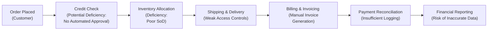

## 7.4 Common Control Deficiencies and Mitigation Techniques

Effective internal controls ensure that business processes operate efficiently, transactions are recorded accurately, and financial information is reliable. In the context of information systems, control deficiencies can arise due to human error, technology limitations, ambiguous procedures, or rapidly changing business environments. In this section, we examine common control deficiencies in business processes, their real-world implications, and recommend techniques or compensating controls to address them. In doing so, we reference leading frameworks—COSO Internal Control – Integrated Framework, COBIT 2019, and ITIL—which guide organizations in designing and implementing robust and sustainable controls.

------------------------------------------------------------------------------
### Understanding Control Deficiencies

A control deficiency exists when the design or operation of a control does not allow management or employees, in the normal course of business, to detect or prevent errors or misstatements in a timely manner. Within an organization’s information systems, deficiencies usually emerge from:

• Misconfigured system access rights.  
• Poorly documented procedures.  
• Inadequate oversight or segregation of duties.  
• Missing or poorly designed control checkpoints.  
• Technology changes (e.g., new software) without corresponding updates to controls.  

For CPAs and IT professionals, identifying whether a deficiency is significant or material hinges on understanding potential impacts on financial statements and associated user decisions. Rapidly addressing deficiencies is critical for maintaining system integrity and meeting compliance requirements.

------------------------------------------------------------------------------
### 1) Inadequate Segregation of Duties

Segregation of duties (SoD) is essential to ensure that no single individual has control over all phases of a transaction. This control concept significantly reduces the risk of fraud or unintentional misuse of resources.

#### Real-World Example
An accounts payable clerk with full system rights to enter new vendors, approve invoices, and designate payments could misdirect company funds. In one reported case, an employee created fictitious vendors in the system and approved unauthorized payments to personal bank accounts. This misconfiguration remained undetected for months because the clerk had unrestricted access across all transaction stages.

#### Potential Impact
• Undetected fraud or manipulation of records.  
• Overstated or understated expenses and liabilities.  
• Erosion of trust and credibility among stakeholders.

#### Recommended Remedial Actions
• Separate vendor setup from invoice approval.  
• Use role-based access control (RBAC) to limit rights to post or approve transactions.  
• Implement mandatory dual checks for payment releases.  

#### Compensating Controls
• Periodic vendor master file changes review by an independent party.  
• Bi-monthly or monthly vendor payment reconciliation by the accounting manager.  
• Automated triggers or alerts for unusual or high-value payment requests.

------------------------------------------------------------------------------
### 2) Weak Access Controls

Ineffective access controls frequently stem from misconfigured user accounts, unprotected databases, or overreliance on default passwords. Unauthorized system access can lead to data tampering, data leaks, or manipulation of financial records.

#### Real-World Example
A retail organization left critical point-of-sale (POS) data in a shared network folder with no password protection. An opportunistic employee discovered the folder and updated sales entries, increasing personal incentives based on store performance. The lack of password settings and role restrictions enabled this tampering.

#### Potential Impact
• Transaction-level errors or deliberate modifications.  
• Data privacy breaches, legal penalties, and reputational damage.  
• Possible non-compliance with regulations like PCI DSS or GDPR.

#### Recommended Remedial Actions
• Implement multifactor authentication for critical systems.  
• Enforce strong password policies (combination of length, complexity, and periodic rotations).  
• Segregate system privileges so that standard users cannot perform admin-level tasks.  

#### Compensating Controls
• Monitor login activity with an automated tool that flags suspicious behavior.  
• Quarterly access reviews to confirm that employees have the correct level of access.  
• “Break-glass” accounts for emergencies, with usage logs reviewed by management.

------------------------------------------------------------------------------
### 3) Insufficient Logging and Monitoring

Without effective logging and monitoring functions, organizations struggle to detect or investigate anomalies and control deficiencies. Logs serve as the audit trail and remain critical in identifying patterns of misuse, diagnosing security events, and providing evidence in compliance audits.

#### Real-World Example
A financial services firm maintained no automated monitoring of user access to its ERP system. A departing employee intentionally ran mass data extraction queries on customer accounts. The firm only discovered the incident two months later when an unauthorized customer list appeared in the market.

#### Potential Impact
• Delayed detection of malicious activities.  
• Non-compliance with internal and external audit requirements.  
• Increased likelihood of reputational and financial harm.

#### Recommended Remedial Actions
• Activate detailed system logs capturing user activities and modifications.  
• Use Security Information and Event Management (SIEM) tools for real-time or near real-time alerting.  
• Maintain a clear retention policy to store logs in a secure, tamper-evident repository.

#### Compensating Controls
• Regular log reviews by dedicated security staff or external specialists.  
• Implement continuous monitoring for suspicious patterns.  
• Independent verification of critical transactions by a governance or compliance team.

------------------------------------------------------------------------------
### 4) Lack of Automated Controls in Transaction Processing

Manual steps within business processes introduce higher error rates and increase the potential for manipulation of data. Automated controls, on the other hand, significantly enhance efficiency and reduce the risk of manual processing errors.

#### Real-World Example
A manufacturing company relied on manual checks to ensure that purchase orders matched invoices and receiving documents. Under time constraints, employees often skipped the manual matching process, resulting in duplicate payments and difficulty reconciling monthly statements.

#### Potential Impact
• Duplicate or inaccurately recorded transactions.  
• Overpayment or under-billing of customers.  
• Inefficiencies and high labor costs in rework or corrections.

#### Recommended Remedial Actions
• Implement automated three-way matching (purchase order, goods receipt, and invoice).  
• Set system-based thresholds that automatically flag anomalies for review.  
• Integrate standardized data formats to minimize manual reconciliations.

#### Compensating Controls
• Random sampling of manually processed transactions by management for accuracy checks.  
• Rotational assignment of review tasks to mitigate staff complacency.  
• Use of data analytics to identify anomalies (e.g., unusual vendor-payment pairs).

------------------------------------------------------------------------------
### 5) Poorly Documented Policies and Procedures

Clear documentation underpins the effective design and operation of internal controls. When policies are outdated or non-existent, employees may rely on personal judgment or outdated norms, creating inconsistent control application.

#### Real-World Example
A growing startup made frequent changes to its revenue recognition practices to accommodate new product lines and promotions. However, the accounting policy manual remained outdated and lacked standard guidelines. This gap led to inconsistencies in recognizing discounts and rebates, resulting in revenue misstatements.

#### Potential Impact
• Inconsistent processes that reintroduce known errors.  
• Increased dependency on key employees or “tribal knowledge.”  
• Difficulties in training new staff or transitioning to advanced systems.

#### Recommended Remedial Actions
• Develop an up-to-date, centralized repository of policies and procedures.  
• Involve cross-functional teams when updating policies to capture all relevant perspectives.  
• Institute periodic policy reviews to reflect changes in regulations or company operations.

#### Compensating Controls
• Conduct management oversight or approval for transactions outside documented policies.  
• Enable internal audits to verify adherence to documented processes.  
• Provide web-based training modules or annual refreshers on policies.

------------------------------------------------------------------------------
### 6) Failing to Update Controls for System Changes

IT environments evolve rapidly. Implementing new software, upgrading existing infrastructure, or changing business processes often introduces new control risks. If control designs are not updated, the organization faces gaps in coverage and potential security blind spots.

#### Real-World Example
A multinational retailer migrated to a new e-commerce platform but did not update its payment processing controls. Certain discount codes and promotional schemes bypassed approval steps and were automatically applied, leading to unintended profit erosion and inaccurate revenue reporting.

#### Potential Impact
• Unrecognized revenue-influencing exploits.  
• Unintended enhancement of staff privileges, tension with existing SoD.  
• Inadequate audit trails and control coverage.

#### Recommended Remedial Actions
• Implement formal change management procedures (see Chapter 10 for guidance).  
• Conduct pre- and post-implementation reviews of newly deployed systems to validate control alignment.  
• Involve cross-functional stakeholders (IT, finance, operations) in system plan rollouts and testing.

#### Compensating Controls
• Comprehensive user acceptance testing (UAT) with documented sign-offs.  
• End-of-life reviews to ensure that outmoded systems are securely decommissioned.  
• Monitor performance data post-launch to detect anomalies or performance dips.

------------------------------------------------------------------------------
### 7) Unauthorized or Unverified Master Data Changes

Master data, such as customer profiles, vendor master records, or product catalogs, forms the backbone for transaction processing accuracy. Unauthorized or unverified modifications to master data can undermine all downstream controls.

#### Real-World Example
A global logistics provider discovered multiple fictitious client records created by an insider to disguise fraudulent shipments. Because controls did not require an independent review of new or changed client data, the fraud continued undetected for months.

#### Potential Impact
• Invoicing discrepancies, misrouted shipments, or financial misstatements.  
• Erosion of data integrity across multiple dependent systems.  
• Reputational harm once discovered externally.

#### Recommended Remedial Actions
• Enhance role-based permissions: only select individuals can modify master data.  
• Introduce an approval workflow for adding or updating master records.  
• Maintain an audit trail specific to changes in master data tables.

#### Compensating Controls
• Conduct periodic master data audits, verifying accuracy and validity.  
• Deploy system triggers to highlight significant or unusual master data changes.  
• Track system prompts requiring dual authorization for high-risk updates (e.g., vendor bank details).

------------------------------------------------------------------------------
### 8) Ineffective Physical and Environmental Controls

While digital vulnerabilities often take center stage, physical and environmental controls—such as securing server rooms or ensuring stable power supplies—remain equally vital. Weaknesses here create opportunities for theft, hardware damage, or data center disruptions.

#### Real-World Example
A small financial office relied on a single, adjacent power circuit for all servers and networking equipment. A localized power trip brought down the entire accounting system during month-end reconciliations, dramatically delaying financial closings and salary processing.

#### Potential Impact
• Inability to process critical transactions.  
• Permanent hardware damage or data corruption.  
• Potential for data theft if devices are left in unsecured areas.

#### Recommended Remedial Actions
• Install uninterruptible power supplies (UPS) and backup generators in critical areas.  
• Implement secured server rooms with keycard access and video surveillance.  
• Develop a facilities maintenance plan, including regular checks of HVAC systems.

#### Compensating Controls
• Schedule routine backups and store them offsite or in the cloud.  
• Maintain vendor agreements for rapid hardware replacements or site recovery.  
• Conduct periodic site inspections by facilities management or third-party assessors.

------------------------------------------------------------------------------
### 9) Broken or Missing Audit Trails

An audit trail is a secure and chronological record of transactions or events. Gaps in the audit trail hamper investigations, reduce visibility into employee actions, and expose the business to regulatory scrutiny.

#### Real-World Example
A chain of retail outlets used a custom point-of-sale system that only stored the last seven days of receipt data on a local drive. When a potential fraud case surfaced, management could not retrieve older transactions to build a full timeline of events.

#### Potential Impact
• Inability to investigate irregularities or gather evidence for legal cases.  
• Reduced data reliability across operational and financial reporting.  
• Non-compliance with regulations requiring extended record-keeping (e.g., SOX archiving requirements).

#### Recommended Remedial Actions
• Ensure that high-importance transactions are captured and retained according to company and regulatory records-retention guidelines.  
• Use database journals and system logs for chronological user actions.  
• Separate archived data from production databases to maintain performance while preserving records.

#### Compensating Controls
• Independent third-party backup services that provide robust retention scheduling.  
• Documented policies for data retention and destruction timelines (see Chapter 11).  
• Clear traceability of transaction IDs across different modules and systems.

------------------------------------------------------------------------------
### 10) Inconsistent Reconciliations and Exception Handling

Reconciliations—including bank, inventory, and other account reconciliations—are vital in identifying control lapses. Failure to reconcile consistently or to address exceptions in a timely manner can mask issues ranging from simple errors to malicious fraud.

#### Real-World Example
An online subscription business did not regularly reconcile credit card submission data with settlement reports from the payment gateway. Over six months, the business overlooked a processing error that resulted in double billing of certain customers, leading to reputational damage and refunds.

#### Potential Impact
• Loss of customer confidence due to billing errors.  
• Overstated or understated balances on the balance sheet.  
• Increased exposure to litigation or regulatory fines for unresolved discrepancies.

#### Recommended Remedial Actions
• Establish a strict schedule for reconciliations by type (e.g., daily for cash, monthly for credit cards).  
• Create formal procedures for escalation of unreconciled items.  
• Integrate automated reconciliation tools where viable.

#### Compensating Controls
• Frequent variance analysis between system records and external statements.  
• Involvement of senior management when large or recurring discrepancies emerge.  
• Independent internal audits focusing on the reconciliation processes.

------------------------------------------------------------------------------
### Sample Visualization: Control Deficiencies in an Order-to-Cash Process

Below is a simplified Mermaid diagram illustrating how control deficiencies can propagate through an order-to-cash business process if not identified and mitigated (e.g., insufficient approvals or missing audit trails):

In this scenario, multiple control weaknesses in different process steps (credit checks, inventory allocation, billing) can accumulate and cause severe downstream effects on financial reporting. By identifying each weakness and instituting robust mitigation strategies—such as automated approval workflows, role-based access control, or automated reconciliation—organizations significantly reduce their exposure to errors and fraud.

------------------------------------------------------------------------------
### Best Practices in Addressing Control Deficiencies

• Prioritize deficiencies based on risk: Focus on high-impact, high-likelihood areas first.  
• Create a fraud risk matrix: Map control deficiencies to potential fraud schemes or operational disruptions.  
• Engage in continuous monitoring: Use automated tools, along with periodic testing, to verify that controls are functioning as intended.  
• Cross-reference with frameworks: Align controls with COSO, COBIT 2019, or relevant industry standards for robust coverage and compliance.  
• Train and educate staff: Controls are only as strong as the people applying them. Conduct regular training to cultivate a security-first culture.  

------------------------------------------------------------------------------
### Conclusion

Common control deficiencies often surface due to a combination of procedural oversight, lax governance, and technological evolution. By understanding how these lapses manifest in real-world scenarios—ranging from inadequate segregation of duties to unmonitored system changes—organizations can devise practical, effective controls that are both preventive and detective in nature. From introducing automated checks and robust access controls to ensuring logs are properly maintained, organizations should adopt a multi-pronged approach that integrates people, processes, and technology.  

Building and maintaining a culture that supports accountability, transparency, and collaboration among stakeholders is central. By continuously monitoring risk areas and updating mechanisms in line with new technologies and regulations, organizations remain agile and guarded against new threats. As explored in subsequent chapters (e.g., Chapter 8: IT General Controls), implementing effective designs and ongoing evaluations of IT controls and business processes is crucial for upholding integrity in financial reporting and safeguarding stakeholder interests.

------------------------------------------------------------------------------

## Quiz on Common Control Deficiencies



### Which of the following is a primary risk if an organization does not enforce segregation of duties in processing vendor invoices?
- [ ] Better operational efficiencies
- [x] Increased likelihood of fraudulent payments
- [ ] More accurate financial statements
- [ ] Improved access to logs and audit trails

> **Explanation:** Without segregation of duties, one person could create and approve fraudulent invoices, increasing the risk that unauthorized or manipulated transactions remain undetected.

### Which control issue is associated with not regularly monitoring system logs or retaining those logs for an appropriate period?
- [x] Delayed detection of intrusive or fraudulent activities
- [ ] Greater processing efficiencies in daily business tasks
- [ ] Enhanced transparency into transaction-level data
- [ ] Reduced reliance on manual procedures

> **Explanation:** Without adequate logging and monitoring, suspicious or malicious activities can go undetected, leaving the organization exposed for extended periods.

### A manufacturing company processes three-way matches (purchase order, receiving report, invoice) manually. Which deficiency might arise from this approach?
- [x] Higher risk of duplicate payments or inaccurate posting
- [ ] Guarantee of zero accounting errors
- [ ] Real-time updates to the general ledger
- [ ] Seamless integration with bank settlement processes

> **Explanation:** Manual processes are prone to human error. Without an automated approach, there is a heightened risk of mismatched documents, leading to potential duplicate payments or misstatements.

### Which of the following types of control is best described as a detective control?
- [x] Reviewing daily logs of system and application events
- [ ] Performing dual approvals for high-value purchases
- [ ] Implementing prophylactic role-based access controls
- [ ] Encrypting sensitive data at rest

> **Explanation:** Detective controls identify and report issues after they occur. Reviewing logs is a detective measure, whereas dual approvals and encryption are preventive controls.

### Inadequate user access reviews often lead to:
- [x] Employees retaining privileges beyond their current role
- [ ] Strengthening of defense-in-depth strategy through layered security
- [x] Elevated risk of data manipulation by former or unauthorized users
- [ ] Automatic lockouts for suspicious login attempts

> **Explanation:** Access reviews ensure that users only hold necessary privileges, preventing the risk of unauthorized activities. Overlooked privilege assignments can create dangerous loopholes in security.

### A key difference between compensating controls and primary controls is that compensating controls:
- [x] Offset specific weaknesses when it is impractical to implement a primary control
- [ ] Completely replace the need for core, fundamental controls
- [ ] Are always automated rather than manual
- [ ] Must be tested less frequently than primary controls

> **Explanation:** Compensating controls are designed to reduce the risk associated with a deficient primary control. They do not supplant the primary control but provide an additional safety measure.

### Which scenario highlights a misconfiguration in master data?
- [x] A new vendor added to the system without an independent review
- [ ] A manager requiring dual signatures for large purchases
- [x] A vendor’s bank account details changed without authorization
- [ ] Automated flags for suspicious transaction values

> **Explanation:** Master data changes, such as adding a vendor or modifying a vendor’s bank account details, must be subject to independent review to prevent fraud and misstatements.

### An organization struggles with periodic outages due to unstable power supply in its data center. This deficiency is primarily in:
- [x] Physical and environmental controls
- [ ] Multifactor authentication procedures
- [ ] Role-based access controls
- [ ] Encryption key management strategies

> **Explanation:** Physical and environmental controls address issues like power supply, HVAC, and structural security. Failure in these areas can cause system outages and data loss.

### Why is it critical to document policies and procedures adequately?
- [x] They provide consistent instructions to all employees
- [ ] They increase the likelihood of known fraud attempts
- [ ] They eliminate the need for any management oversight
- [ ] They restrict the flexibility of operational processes

> **Explanation:** Written policies and procedures create standardization and consistency, reducing reliance on informal practices or individual interpretations.

### A manual reconciliation of billing statements is prone to errors. True or False?
- [x] True
- [ ] False

> **Explanation:** Manual reconciliations inherently carry a greater risk of human error and omissions compared to automated or semi-automated tools.



------------------------------------------------------------------------------

## For Additional Practice and Deeper Preparation

### [Information Systems and Controls (ISC)](https://www.udemy.com/course/isc-cpa-mock-exams/?referralCode=E1217303222935C5E464)

**Information Systems and Controls (ISC) CPA Mocks:** 6 Full (1,500 Qs), Harder Than Real! In-Depth & Clear. Crush With Confidence!

- Tackle full-length mock exams designed to mirror real ISC questions.  
- Refine your exam-day strategies with detailed, step-by-step solutions for every scenario.  
- Explore in-depth rationales that reinforce higher-level concepts, giving you an edge on test day.  
- Boost confidence and minimize anxiety by mastering every corner of the ISC blueprint.  
- Perfect for those seeking exceptionally hard mocks and real-world readiness.  

_Disclaimer: This course is not endorsed by or affiliated with the AICPA, NASBA, or any official CPA Examination authority. All content is for educational and preparatory purposes only._

------------------------------------------------------------------------------

### References and Further Reading

• COSO (Committee of Sponsoring Organizations). “Internal Control – Integrated Framework.” (2013).  
• ISACA. “COBIT 2019 Framework: Governance and Management Objectives.”  
• AICPA. “Audit and Accounting Guide: Information Technology and Entity-Level Controls.”  
• GAO. “Standards for Internal Control in the Federal Government (Green Book).”  
• IT Governance Institute. “ITIL 4: A pocket guide.”  
