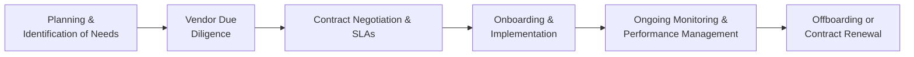

## 7.5 Third‑Party and Vendor Risk Management

Third‑party and vendor relationships have become an indispensable part of modern organizations, providing specialized products, services, and expertise that help companies remain competitive. While these relationships can yield significant operational and financial benefits, they also introduce unique risks that must be carefully managed. This section offers a detailed look at how to vet and monitor vendors, conduct due diligence, ensure robust contract clauses, and perform periodic performance reviews. It builds upon the foundation of business process controls introduced earlier in this chapter and intersects with concepts in IT General Controls (see Chapter 8), security measures (see Part IV), and governance and risk management frameworks (see Chapter 3).

Organizations seeking to comply with frameworks like COSO Internal Control – Integrated Framework and COBIT 2019 must integrate rigorous third‑party oversight into their risk management strategies. This includes understanding the sorts of risks third‑party providers bring, implementing effective contractual safeguards, and engaging in ongoing monitoring to detect issues early and mitigate them effectively.

---

### Importance of Third‑Party and Vendor Risk Management

As businesses shift more of their processes to external providers—whether for software development, payroll solutions, cloud hosting platforms, or specialized consulting—a new layer of complexity arises. Potential risks include:

• Operational Risk: Vendors may fail to meet service level agreements (SLAs), jeopardizing business continuity.  
• Reputational Risk: A vendor’s misconduct can harm the hiring organization’s public image.  
• Compliance Risk: Vendors may process regulated data subject to legal or industry mandates (e.g., GDPR, HIPAA), making compliance oversight crucial.  
• Financial Risk: Vendor insolvency or financial disputes can create cash flow problems or service disruptions.  
• Information Security Risk: Vendors with poor security controls can expose the hiring organization to data breaches or cyberattacks.  

When properly managed, these third‑party relationships can yield strategic advantages while minimizing disruptions, legal liabilities, and significant financial losses.

---

### Vendor Risk Management Lifecycle

A structured lifecycle helps organizations systematically approach ongoing vendor relationships. While implementations vary, a common lifecycle includes:

• Planning and Identification of Needs  
• Vendor Selection and Due Diligence  
• Contract Negotiation and Onboarding  
• Ongoing Monitoring and Performance Review  
• Offboarding or Contract Renewal  

Below is a Mermaid diagram illustrating the vendor risk management lifecycle:

Each phase in the diagram will be explored in greater depth.

---

### Planning and Identification of Needs

Before engaging a vendor, organizations must thoroughly assess their strategic objectives, financial constraints, regulatory obligations, and operational requirements. During this foundational stage, teams should:

• Identify the specific business need or gap that the vendor is expected to fill.  
• Define selection criteria (e.g., industry expertise, cost, security standards).  
• Outline preliminary requirements (technical, operational, legal, and compliance).

By clarifying these requirements, the organization sets a clear benchmark against which potential vendors can be evaluated.

---

### Vendor Selection and Due Diligence

Thorough due diligence is a cornerstone of successful third‑party risk management. Before finalizing any agreement, it is crucial to measure the vendor’s capabilities, financial soundness, and alignment with compliance obligations.

#### Common Areas of Due Diligence

• Financial Stability: Examine financial statements, credit ratings, and business sustainability. Understanding a vendor’s liquidity and solvency can confirm their capacity to deliver services long‑term.  
• Security Practices: Review the vendor’s information security policies, network security controls, and breach response plans. Ask for security certifications like ISO 27001 or SOC 2® (see Part V of this guide).  
• Regulatory Compliance: Confirm whether the vendor must comply with regulations such as GDPR or HIPAA. Verify alignment with these mandates, as the hiring organization may be implicated otherwise.  
• Operational Capabilities: Assess the vendor’s infrastructure, staffing levels, technology stack, and approach to disaster recovery (see Chapter 9 on System Availability and Business Continuity).  
• Reputation and References: Request references and case studies. Negative press coverage or unresolved legal disputes can signal high risk.  

#### Vendor Risk Scoring

Many organizations employ a vendor risk scoring model to quantify threats more systematically. Each category (e.g., security, financial stability) can be assigned a rating, which, when aggregated, determines whether the organization is taking on an acceptable level of risk. Higher‑risk vendors may require deeper scrutiny, more frequent audits, or more robust contract terms.

---

### Contract Negotiation and Onboarding

Once a vendor is deemed acceptable through due diligence, the organization proceeds with contract negotiation and onboarding. Well‑structured contracts lay out expectations, responsibilities, and remedies if something goes wrong.

#### Key Contract Clauses

• Scope of Work: Document what services the vendor provides, including any deliverables, timelines, or milestones.  
• Service Level Agreements (SLAs): Define measurable performance metrics such as uptime, response times, and issue-resolution windows. Include remedies or penalties for SLA breaches.  
• Data Security and Confidentiality: Outline responsibilities for protecting sensitive data. Include encryption requirements, access controls, and data handling rules (see Chapters 16 and 19 on cyber and data confidentiality).  
• Audit and Inspection Rights: Grant the organization the right to audit the vendor’s processes, especially if dealing with sensitive or regulated data.  
• Indemnification and Liability Limits: Clarify each party’s responsibilities. Some contracts establish strict liability caps, while others require the vendor to indemnify the organization for specified damages or regulatory fines.  
• Data Breach Notification: Require prompt notification in case of a security breach, specifying timelines and contact methods.  
• Termination Clauses: Define conditions for contract termination, including vendor insolvency, repeated SLA violations, or data breaches.

#### Example: Contracting with a Cloud Services Provider

Consider a mid‑size accounting firm migrating its internal financial reporting system to a public cloud provider. The contract addresses uptime SLAs at 99.9%, data encryption in transit and at rest, automatic backups, and the right to request independent SOC 2® reports twice a year. By specifying performance guarantees and liability caps, the accounting firm ensures service reliability for mission‑critical workloads and mitigates costly disruptions.

---

### Ongoing Monitoring and Performance Review

Even after a contract is signed and onboarding is complete, third‑party risk management remains an ongoing responsibility. Continuous vendor oversight helps an organization stay informed of new or changing risks, gradually building a track record of performance that can guide future decision‑making.

#### Performance Metrics

• Uptime and System Availability: Typically measured against the promised SLA.  
• Response Times: The speed with which vendors address queries, troubleshoot errors, or resolve reported issues.  
• Quality Defects or Error Rates: Useful in manufacturing or software development relationships to measure consistency.  
• Compliance Metrics: Indicators that measure adherence to regulatory mandates or internal policies, such as encryption coverage or patching frequency.

#### Monitoring Techniques

• Periodic Vendor Audits: Formal reviews of vendor controls, sometimes including on‑site inspections and interviews.  
• Self‑Assessment Questionnaires: Standardized forms that vendors complete to confirm their continued compliance with security, privacy, and regulatory obligations.  
• Third‑Party Assessments: While formal audits like SOC 1® or SOC 2® are critical for regulated industries, specialized assessments targeting cybersecurity, environmental standards, or labor practices may also be warranted.  
• Performance Scorecards: Summaries of key metrics (e.g., system availability, incident response time). Scorecards can be reviewed monthly or quarterly to facilitate data‑driven decision‑making.

---

### Periodic Risk Reassessment

It is prudent to reassess the vendor’s risk profile at regular intervals or when significant changes occur (e.g., business acquisitions, major security events, or reorganizations). A periodic risk assessment involves:

• Updating risk scoring models.  
• Reviewing evidence of control design and operating effectiveness (e.g., IT General Controls from Chapter 8).  
• Mapping any new regulatory requirements that may affect the vendor’s obligations.  
• Evaluating incident logs and historical performance data.

Frequent risk reassessment ensures that both sides remain aligned on expectations, compliance, and evolving business goals.

---

### Offboarding or Contract Renewal

When a contract nears expiration, an organization must decide whether to renew or offboard. This phase includes:

• Contract Negotiation for Renewal: Organizations may seek improved terms, reduced fees, or higher levels of service based on past performance.  
• Transition and Migration: If the decision is to terminate or switch vendors, clear planning is essential to migrate data, finalize obligations, and avoid service disruptions.  
• Final Performance Evaluation: Captures lessons learned and best practices, informing future vendor relationships.

---

### Common Pitfalls

Even well‑run vendor risk programs can encounter challenges. Common pitfalls include:

• Overreliance on a Single Vendor: Leads to concentration risk if the vendor underperforms or experiences a critical incident.  
• Poor Contract Management: Failure to document changes or enforce contract clauses can create compliance and financial risks.  
• Infrequent Reviews: Risks evolve over time. Infrequent assessments miss new or escalating vendor risks.  
• Lack of Vendor Engagement: Vendors who are not onboard with compliance and security measures can hinder risk management objectives.

---

### Illustrative Case Study

An international retail chain outsources its payment processing to a specialized financial technology (fintech) provider. While performing due diligence, the retail chain discovers that the fintech vendor uses an outdated encryption protocol, exposing credit card data to potential cyberattacks. Recognizing a major security gap, the retailer requests a more robust encryption mechanism, along with contractually mandated annual penetration tests and real-time security monitoring.

By proactively identifying these deficiencies, the retailer mitigates its exposure to PCI DSS compliance violations and reduces the likelihood of a large‑scale data breach that might lead to costly regulatory penalties and severe reputational damage.

---

### Tools and Technologies

Vendor risk management has spurred the development of specialized software solutions and frameworks. These tools often integrate with broader Governance, Risk, and Compliance (GRC) platforms, enabling:

• Automated Vendor Questionnaires: Streamlining self‑assessment data gathering.  
• Centralized Contract Repositories: Maintaining all contract documents and amendments in a single system for easy retrieval and version control.  
• Real‑Time Notifications: Alerting stakeholders of critical changes in vendor status, such as credit rating downgrades or threat intelligence alerts.  
• Risk Dashboards: Providing high‑level insights and trends, enabling senior management to make informed decisions.

---

### Best Practices and Key Takeaways

• Align Third‑Party Oversight with Enterprise Strategy: Ensure vendor partnerships support overall goals, not just cost‑savings.  
• Employ Robust Contractual Safeguards: SLAs, audit clauses, and data protection requirements reduce legal and compliance exposure.  
• Maintain Regular Communication: Foster open dialogue with vendors regarding performance, emerging risks, and compliance requirements.  
• Periodically Reassess Risk: Business contexts evolve, and so must your understanding of third‑party threats.  
• Document Rigorously: Keep detailed records of audits, vendor communications, and remediation plans for accountability and historical reference.

---

### Further References

• COBIT 2019 Framework: Offers detailed governance guidance relevant to outsourcing and third‑party relationships.  
• AICPA SOC Suite of Services: SOC 1®, SOC 2®, and SOC for Cybersecurity reporting standards inform vendor assurance practices (see Part V).  
• NIST Cybersecurity Framework: Useful for evaluating security posture and risk management.  
• ISO 27001/27002: Standards addressing information security management and controls, often used in vendor due diligence.  
• PCI DSS: Specific requirements for organizations handling credit card data.

---

## Test Your Knowledge: Third‑Party and Vendor Risk Management



### Which of the following best describes an operational risk posed by third‑party vendors?

- [ ] Damage to the organization's brand image caused by public scandal
- [x] Inability of a vendor to deliver goods or services in accordance with the contract
- [ ] Inclusion of inadequate liability clauses in vendor agreements
- [ ] Vendor’s failure to comply with data privacy regulations

> **Explanation:** Operational risk typically relates to a vendor’s ability to meet contractual obligations. In this case, failing to deliver goods or services on time or to specifications is an operational threat.

### During the due diligence stage of vendor selection, which document or assessment is most valuable for reviewing the vendor’s information security posture?

- [ ] PCI DSS Self-Assessment Questionnaire (SAQ)
- [ ] The vendor’s most recent marketing collateral
- [x] SOC 2® report focusing on the Security Trust Services Criteria
- [ ] The vendor’s annual financial statements

> **Explanation:** A SOC 2® report targeting Security Criteria provides in-depth insight into a vendor’s security controls, making it highly relevant for evaluating the vendor’s ability to protect information.

### Which clause in a vendor contract typically specifies the maximum allowable downtime or time to recover after a disruption?

- [x] Service Level Agreements (SLAs)
- [ ] Data Transfer Clause
- [ ] Limitation of Liability Clause
- [ ] Force Majeure Clause

> **Explanation:** Service Level Agreements (SLAs) exist to define expected service performance metrics, including uptime commitments and recovery times.

### Why is vendor oversight an ongoing process rather than a one-time event?

- [ ] Vendors insist on renegotiating contracts annually
- [x] Risks evolve over time as regulations, business needs, and vendor operations change
- [ ] Contracts do not legally permit one-time evaluations
- [ ] There is no standardized way to evaluate vendors initially

> **Explanation:** Because business contexts, regulations, and vendor operations evolve, continuous monitoring and renewed risk assessments are necessary to manage ongoing risks.

### When assessing a vendor’s data encryption practices, which of the following details is most critical to confirm?

- [x] The vendor uses current industry-standard encryption (e.g., AES-256) for data at rest and in transit
- [ ] The vendor provides unlimited bandwidth for data transfer
- [x] The vendor employs state-of-the-art intrusion monitoring
- [ ] The vendor’s legal team reviews contracts annually

> **Explanation:** Ensuring that data is secure in transit and at rest is paramount to protecting confidentiality. Industry-standard encryption protocols (e.g., AES-256) help maintain a robust security posture.

### Which of the following is an example of reputational risk resulting from a vendor relationship?

- [x] An outsourced supplier caught using unethical labor practices
- [ ] The vendor’s CFO resigns
- [ ] The vendor’s software is temporarily offline due to maintenance
- [ ] A missed contract renewal deadline

> **Explanation:** An unethical labor practice scandal can publicly tarnish the hiring organization’s reputation if consumers perceive the company as contributing or turning a blind eye to malpractice.

### Which step of vendor risk management involves shutting down vendor accounts, retrieving company data, and ensuring knowledge transfer?

- [x] Offboarding
- [ ] Contract Negotiation
- [x] Ongoing Monitoring
- [ ] Planning and Identification of Needs

> **Explanation:** Offboarding includes carefully ending the relationship while protecting the organization’s data and interests, ensuring clear documentation and smooth knowledge transfer.

### What is the primary purpose of conducting on-site audits of vendors?

- [ ] To renegotiate the contract rates
- [ ] To fulfill legal obligations under all circumstances
- [ ] To assess the vendor’s marketing strategies 
- [x] To directly examine and validate the vendor’s operational, security, and control environments

> **Explanation:** On-site audits allow organizations to verify that vendors adhere to contractual requirements, security policies, and regulatory obligations, providing hands-on oversight and evidence gathering.

### Which of the following is a key benefit of having centralized contract repositories for all vendor agreements?

- [x] Easier tracking of contract versions, renewal dates, and performance clauses
- [ ] Encouraging vendors to compete with each other on price
- [ ] Eliminating the need for legal oversight in contract negotiations
- [ ] Automating all manual performance tracking tasks

> **Explanation:** Centralized contract repositories streamline version control, facilitate timely renewals, and provide easy retrieval of contract details—improving overall contract management efficiency.

### True or False: A robust vendor risk management process is only necessary for organizations that operate in highly regulated industries.

- [x] True
- [ ] False

> **Explanation:** Vendor risks are present in virtually every industry, from financial services to manufacturing. While highly regulated fields have more stringent requirements, all organizations benefit from strong vendor oversight to avoid operational, financial, and reputational pitfalls.



---

## For Additional Practice and Deeper Preparation

### [Information Systems and Controls (ISC)](https://www.udemy.com/course/isc-cpa-mock-exams/?referralCode=E1217303222935C5E464)

**Information Systems and Controls (ISC) CPA Mocks:** 6 Full (1,500 Qs), Harder Than Real! In-Depth & Clear. Crush With Confidence!

- Tackle full-length mock exams designed to mirror real ISC questions.  
- Refine your exam-day strategies with detailed, step-by-step solutions for every scenario.  
- Explore in-depth rationales that reinforce higher-level concepts, giving you an edge on test day.  
- Boost confidence and minimize anxiety by mastering every corner of the ISC blueprint.  
- Perfect for those seeking exceptionally hard mocks and real-world readiness.  

_Disclaimer: This course is not endorsed by or affiliated with the AICPA, NASBA, or any official CPA Examination authority. All content is for educational and preparatory purposes only._
