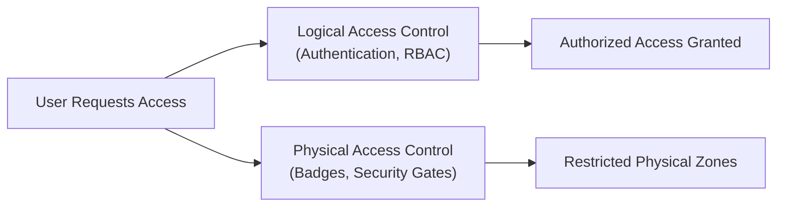
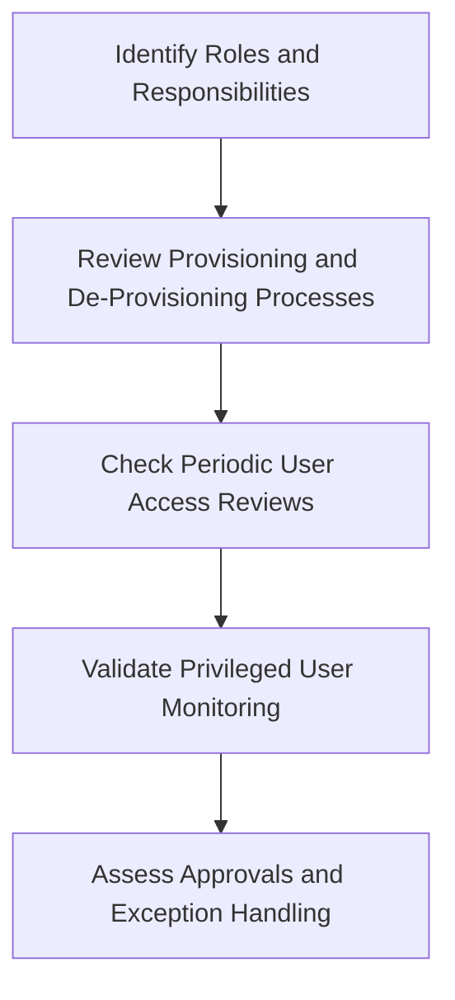

## 8.1 Access to Programs and Data

Access to programs and data is a critical component of IT General Controls (ITGC) and an essential area of focus for CPAs involved in IT audit, assurance, and advisory work. Proper access controls protect the integrity, confidentiality, and availability of information assets. This section delves deeply into the distinction between physical and logical access controls, explores best practices for securing systems, and outlines testing methods to verify that access rights are properly assigned and maintained.

------------------------------------------------------------
### Importance of Access Controls
Access controls safeguard an organization’s data, applications, and technology infrastructure from unauthorized use or exposure. By enforcing well-designed access controls, companies can:

• Maintain data confidentiality by ensuring only authorized users can view sensitive information.  
• Protect program integrity by preventing unauthorized changes to system components.  
• Preserve availability of mission-critical resources through effective monitoring and mitigation of access-related threats.  

Access controls are not only a technical necessity; they are instrumental in demonstrating compliance with regulatory requirements and industry frameworks such as COBIT 2019, COSO’s Internal Control—Integrated Framework, PCI DSS, HIPAA, GDPR, and many more. CPAs engaged in IT audits must evaluate these controls to form a reliable opinion on the integrity of an entity’s financial and operational systems.

------------------------------------------------------------
### Physical vs. Logical Access Controls
Access to programs and data can be broadly divided into physical and logical categories. Both are essential to the overall security posture.

#### Physical Access Controls
Physical access controls relate to the tangible methods used to restrict entry to resources. They operate at data centers, server rooms, office locations, or other critical facilities. Key elements include:

• Locks and Key Cards: Secure server rooms, offices, and cabinets behind locked doors that only authorized individuals can open, often via electronic key card access systems or biometrics.  
• Security Personnel and Surveillance: Guards, video monitoring, and visitor logs enhance on-site security.  
• Environmental Considerations: Fire suppression systems, redundant power supplies, and temperature/humidity controls also factor into physical protection.  

Physical security breaches can undermine even the most robust logical controls, so organizations must ensure that the premises housing IT infrastructure are secure from unauthorized entry, theft, or damage.

#### Logical Access Controls
Logical access controls govern electronic access to data and programs. They apply across networks, databases, and operating systems. Key elements include:

• Authentication Mechanisms: Password policies, multi-factor authentication (MFA), and biometric logins.  
• Authorization and Role-Based Access Control (RBAC): Assigning permissions in accordance with the principle of least privilege, ensuring users only have access to the data and functions required for their roles.  
• User Account Management: Lifecycle processes covering onboarding, transfers, promotions, and terminations to ensure permissions remain current and appropriate.  
• Session Management: Mechanisms such as secure time-outs, idle session locks, and single sign-on (SSO) platforms.  
• Monitoring and Logging: Tracking user activities, generating alerts for suspicious behavior, and maintaining audit trails.  

Logical access controls protect digital assets from threats such as internal misuse, external hacking, and data leakage. Effective design and operation of these controls is a cornerstone of ITGC, and it is critical that auditors assess their adequacy when evaluating the control environment.

**Figure 1**: High-level overview of physical and logical access controls. Both dimensions work in tandem to protect programs and data.

------------------------------------------------------------
### Core Principles Underlying Access Controls
Despite their different domains, physical and logical access controls share common underlying principles:

• Principle of Least Privilege (PoLP): Users receive only the minimum level of access (physical or logical) necessary to perform their job functions.  
• Defense-in-Depth: Multiple layers of security controls (locks, intrusion detection, encryption, privileges, etc.) to reduce the likelihood of a breach.  
• Separation of Duties (SoD): Split critical tasks or privileges among multiple persons to minimize the risk of fraud or error.  
• Regular Recertifications: Periodic reviews and attestations ensure that elevated privileges remain necessary and are not misused.  
• Continuous Monitoring: Proactive detection of anomalies and suspicious activities through logs, alerts, and analytics.

------------------------------------------------------------
### Access Governance Frameworks
Auditors evaluating a client’s access governance structure often align their reviews with recognized frameworks. Examples include:

• **COBIT 2019**: Provides governance and management objectives for IT, including “Ensure Security” (APO13) and “Manage Security Services” (DSS05).  
• **COSO Internal Control—Integrated Framework**: Promotes control environment, risk assessment, control activities, information/communication, and monitoring; relevant to access controls under monitoring and control activities.  
• **ISO/IEC 27001**: Encourages systematic management of information security, including physical security (A.11) and access control (A.9).  

By using these frameworks, organizations can systematically design, implement, monitor, and improve their access controls while ensuring compliance with regulatory standards.

------------------------------------------------------------
### Key Elements of Logical Access Management
The management of logical access is typically more complex than physical access. Here are the main components addressed in an audit or assurance context:

#### 1. User Provisioning and De-Provisioning
• **Onboarding**: New employees, contractors, or vendors should only be granted access after proper authorization, background checks (if applicable), and completion of required training.  
• **Transfers**: Changes in roles or departments require reassessment of access rights to avoid excessive or conflicting privileges.  
• **Terminations**: Immediately remove or disable accounts upon employee departure to eliminate the risk of unauthorized system access.

#### 2. Privileged Access Management (PAM)
• Protect and monitor accounts with broad system rights such as database administrators and network engineers.  
• Implement strict dual controls (e.g., password vaults) for sensitive privileged accounts.  
• Enforce strong multi-factor authentication and usage logging for all privileged activity.

#### 3. Authentication Controls
• **Password Policies**: Length, complexity, rotation intervals, and account lockout thresholds.  
• **Multi-Factor Authentication (MFA)**: Additional layers (e.g., token, biometric) significantly reduce the risk of unauthorized access from compromised passwords.  
• **Single Sign-On (SSO)**: Streamlines user experience and centralizes authentication, but requires strict security to prevent large-scale compromise.

#### 4. Authorization / Role-Based Access Control (RBAC)
• Grant roles that logically group users by responsibilities (e.g., “Accounting Clerk,” “IT Support,” “Finance Manager”) and assign system privileges based on these roles.  
• Maintain documentation of role definitions and regularly review to ensure continuing appropriateness.  
• Align with the principle of least privilege to prevent unused or excessive access.

#### 5. Monitoring and Reporting
• **Event Logging**: Track login attempts, privilege changes, file access, and system modifications.  
• **Log Correlation**: Use Security Information and Event Management (SIEM) solutions to identify patterns of malicious access or suspicious behavior.  
• **Periodic Access Reviews**: Conduct user access reviews at intervals to ensure all accounts match approved roles and responsibilities.

------------------------------------------------------------
### Physical Access Management Considerations
Physical access management addresses who can enter server rooms, data centers, and areas housing critical IT infrastructure:

• **External Building Security**: Guard desks or reception areas, video surveillance, perimeter fencing, locked gates, signage, and intrusion alarms.  
• **Data Center/Server Room Security**: RFID badges, biometric readers, mantraps, or other restricted entries for high-security areas.  
• **Visitor Management**: Check-in/check-out logs, visitor IDs, escort policies, and restricted zones.  
• **Equipment Protection**: Lock racks, store backup media securely, and minimize physical USB device usage near servers.  

Physical security is especially relevant for compliance with standards such as PCI DSS (requirement to protect cardholder data storage facilities) and HIPAA (physical safeguards for protected health information).

------------------------------------------------------------
### Typical Test Steps for Verifying Correct Access Rights
Auditors and assurance professionals perform a variety of tests to confirm the proper design and operating effectiveness of access controls. Below is a structured approach:

**Figure 2**: Typical steps to verify access rights.

1. **Review Policies and Procedures**  
   Confirm the organization has comprehensive policies describing user access management, including the aspects of user provisioning, password usage, and termination processes. Evaluate whether procedures align with regulatory standards and leading practices (e.g., COBIT, ISO 27001).

2. **Examine Access Approval Documentation**  
   • Sample recently created user accounts (e.g., new hires, vendor accounts) and confirm they followed the required approval sequences.  
   • Check if access requests included a valid business justification and manager authorization.

3. **Assess Privileged Access**  
   • Identify users holding privileged accounts (e.g., domain administrators, database administrators).  
   • Verify that each privileged account had formal approval and that elevated rights are still necessary.  
   • Evaluate existing monitoring solutions to ensure logs are regularly reviewed.

4. **Test Terminated and Transferred Users**  
   • Select a sample of terminated employees and verify their accounts were disabled on or before the last day of employment.  
   • For employees who moved between roles, confirm removal of old privileges and assignment of new ones as per updated responsibilities.

5. **Check Password Policies and MFA Enforcement**  
   • Evaluate password settings in the Active Directory or other identity management systems.  
   • Check if multi-factor authentication is enforced for sensitive or high-risk systems.

6. **Observe Physical Access Controls**  
   • Conduct a walkthrough of the data center or server rooms to confirm locked doors, ID badges, and visitor logs are in place.  
   • Validate camera surveillance and review footage or sign-in sheets to see if restricted areas are effectively monitored.

7. **Review User Access Recertifications**  
   • Check if the organization performs periodic recertifications for user accounts and privileges.  
   • Verify that any discrepancies found during recertifications are promptly remediated.

8. **Inspection of Exception Handling**  
   • Ensure “emergency access” or “firecall” IDs are controlled and monitored.  
   • Verify exceptions are formally requested, approved, monitored, and promptly revoked when no longer needed.

------------------------------------------------------------
### Common Pitfalls and Challenges
1. **Excessive Privileges**  
   Over-authorizing user roles or leaving unused permissions in place increases the chance of unauthorized data manipulation or data leakage.

2. **Delayed Deactivation of Access**  
   Failing to remove access for terminated employees or contractors promptly can expose systems to revenge attacks or theft of confidential data.

3. **Weak or Infrequently Changed Passwords**  
   Users may select easily guessable passwords or seldom change them, making brute-force or social engineering attacks more likely to succeed.

4. **Shadow IT and Orphaned Accounts**  
   Teams or individuals sometimes implement their own systems outside the official channels, leading to missed or unknown accounts that are unmonitored.

5. **Insufficient Monitoring**  
   Without routine log reviews or robust SIEM solutions, suspicious activities may go unnoticed. This gap amplifies the risk of data breaches and fraud.

------------------------------------------------------------
### Best Practices for Effective Access Controls
• **Enforce Strong Identity and Access Management (IAM)**: Centralize all user identity data in a well-governed system that lists every account, role, and privilege.  
• **Apply the Principle of Least Privilege**: Grant necessary rights only, revoke unused ones, segment privileges, and routinely review.  
• **Implement Privileged Access Management**: Restrict use of high-level accounts, track all privileged commands, and enable real-time alerts.  
• **Automate Provisioning and De-Provisioning**: Use workflow-driven solutions to eliminate manual errors and overlooked tasks.  
• **Conduct Regular Training**: Educate employees on how to handle passwords, detect social engineering, and report suspicious activities.  
• **Adopt Continuous Monitoring**: Collect and correlate logs from various sources to promptly detect unusual user behavior or device activities.

------------------------------------------------------------
### Practical Illustrative Scenario
Consider a mid-sized financial services organization that processes sensitive client data. The CFO’s administrative assistant received privileges to approve transactions above a certain threshold. Due to a role transfer, the assistant later moved to a support function but retained elevated financial privileges. An external phishing attack compromised the assistant’s credentials, allowing the attacker to access and approve high-value fraudulent transactions. The breach was only identified weeks later during a routine reconciliation.

In this scenario, multiple access control deficiencies were exposed:  
• The assistant maintained excessive privileges beyond her new role.  
• There was no timely recertification of user access rights.  
• Alerts for large monetary transactions were insufficiently monitored, allowing the fraud to continue unnoticed for an extended period.

Through this example, the importance of robust logical access controls aligned with job function (the principle of least privilege) becomes immediately clear. Regular user access reviews, recertifications, and continuous monitoring can significantly reduce such risks.

------------------------------------------------------------
### References for Further Exploration
• **COBIT 2019 Framework**: (ISACA) – Detailed guidance on governance and management of enterprise IT, focusing on policies and procedures for securing access.  
• **NIST Special Publication 800-53**: Catalog of security and privacy controls, including access control requirements.  
• **ISO/IEC 27001**: International standard for information security management systems, covering both physical and logical controls.  
• **SANS Institutes**: Offers training and research across areas of cybersecurity, including identity and access management best practices.  
• **AICPA Trust Services Criteria**: Provides criteria for securing systems, especially relevant for SOC 2® engagements.

---

## Secure Access: Are You Prepared?



### Which principle ensures that a user is granted the minimum level of access needed to perform their job duties?
- [ ] Segregation of Duties
- [ ] Dual Control
- [x] Principle of Least Privilege
- [ ] Zero-Trust
> **Explanation:** The principle of least privilege states that users should only have necessary rights to fulfill their tasks. This approach limits damage from credential theft or misuse.

### Which of the following is a physical access control?
- [ ] Password-protected screensaver
- [ ] Role-based access management
- [ ] Firewall
- [x] Biometric door lock
> **Explanation:** Physical access controls protect physical entry points, such as biometric door locks or keycard systems.

### Which best describes onboarding and offboarding in the logical access process?
- [ ] The process of splitting critical tasks among employees
- [x] Assigning and removing user rights when employees are hired or leave
- [ ] Enforcing server room security
- [ ] Monitoring user activities through logs
> **Explanation:** Onboarding assigns new employees the necessary credentials, while offboarding removes them when employees exit or change roles.

### What is the primary purpose of a periodic user access review?
- [ ] To reset all user passwords
- [ ] To enable single sign-on (SSO)
- [x] To ensure that all users have only appropriate and required privileges
- [ ] To establish network segmentation
> **Explanation:** User access reviews verify that privileges match an individual’s current role and that no unauthorized accounts exist.

### Which of the following is NOT a common pitfall of access management?
- [x] Regular password changes based on best practices
- [ ] Excessive user privileges
- [ ] Shadow IT accounts
- [ ] Weak password policies
> **Explanation:** Regularly updating passwords based on sound policies is not a shortcoming but a recommended best practice.

### What physical security measure typically involves a locked enclosure requiring two sets of doors that cannot open simultaneously?
- [ ] Firewall
- [ ] Badge reader
- [ ] Two-factor authorization
- [x] Mantrap
> **Explanation:** A mantrap is a security control with two sequentially locked doors to control physical entry, often used in data centers.

### Which of the following ensures that privileged accounts have a secondary or higher level of security and centralized oversight?
- [ ] Single Sign-On (SSO)
- [x] Privileged Access Management (PAM)
- [ ] Kerberos
- [ ] Intrusion Detection System
> **Explanation:** PAM solutions require extra layers of security and oversight for high-risk administrative accounts, including stricter authentication and monitoring.

### What aspect of access control deals specifically with tracking visitor entry and exits in restricted areas?
- [ ] Authentication
- [ ] Multifactor verification
- [x] Physical security and visitor management
- [ ] Role-based access control
> **Explanation:** Visitor management falls under physical security, as it involves regulating and recording who enters a secured physical area.

### Which of the following describes the process of evaluating logs and system activities to detect suspicious user behavior?
- [ ] Trust Services Criteria
- [ ] Role-Based Access Control (RBAC)
- [x] Continuous Monitoring
- [ ] Mandatory Access Control
> **Explanation:** Continuous monitoring uses logs, alerts, and analytic tools to spot anomalies that may indicate unauthorized access or misuse.

### A user has been transferred from the Accounting Department to the Marketing Department but continues to retain previous accounting privileges. This ongoing practice violates which of the following?
- [x] Principle of Least Privilege
- [ ] Emergency access
- [ ] Dual control
- [ ] Service level agreement
> **Explanation:** The principle of least privilege is compromised if a user still has unneeded privileges from a former role, potentially exposing sensitive financial processes.



---

## For Additional Practice and Deeper Preparation

### [Information Systems and Controls (ISC)](https://www.udemy.com/course/isc-cpa-mock-exams/?referralCode=E1217303222935C5E464)

**Information Systems and Controls (ISC) CPA Mocks:** 6 Full (1,500 Qs), Harder Than Real! In-Depth & Clear. Crush With Confidence!

- Tackle full-length mock exams designed to mirror real ISC questions.  
- Refine your exam-day strategies with detailed, step-by-step solutions for every scenario.  
- Explore in-depth rationales that reinforce higher-level concepts, giving you an edge on test day.  
- Boost confidence and minimize anxiety by mastering every corner of the ISC blueprint.  
- Perfect for those seeking exceptionally hard mocks and real-world readiness.  

_Disclaimer: This course is not endorsed by or affiliated with the AICPA, NASBA, or any official CPA Examination authority. All content is for educational and preparatory purposes only._
