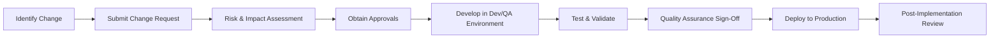

## 8.2 Program Changes

Effective program change controls are an essential pillar of IT General Controls (ITGC). They ensure that all system- and software-related modifications are vetted, approved, tested, and deployed in a manner that protects integrity, availability, and reliability throughout the organization’s information systems. From a CPA’s perspective, robust change management processes form a key checkpoint in assessing the overall IT control environment. This article covers how to design, implement, and maintain program change controls that align with industry frameworks such as COBIT 2019, COSO’s Internal Control–Integrated Framework, and various regulatory requirements. It also offers best practices, common pitfalls, and real-world examples that help illustrate effective oversight of program changes in an organization.

Introduction to Change Management  
Change management includes all steps necessary to propose, evaluate, authorize, develop, test, and implement alterations to applications, databases, operating systems, networks, or any other IT component. These changes can range from minor software patches and bug fixes to major system upgrades or the deployment of new ERP modules, as discussed in Chapter 6 (Enterprise Resource Planning (ERP) and Accounting Information Systems). Poorly controlled updates can compromise data integrity, security, and compliance. Conversely, well-executed processes minimize disruptions, maintain stable system operations, and provide a clear audit trail.

Formal Change Management: Underlying Principles  
Formalizing the change management process helps organizations track each modification from request through post-implementation review. Below are some core principles:

• Segregation of Duties (SoD): Ensuring that no single person can unilaterally develop, test, approve, and deploy changes reduces fraud risk and accidental errors.  
• Documentation and Transparency: Each request must be documented in a central repository, capturing details such as purpose, scope, expected impact, lines of code or modules to be changed, and testing steps.  
• Mandatory Approvals: Proper authorization from management, system owners, and control function representatives (e.g., Compliance, IT Security) is required before changes proceed.  
• Comprehensive Testing: Changes should always be tested in isolated environments (development, QA/staging) before final production deployment.  
• Continuous Monitoring: Periodic reviews and logs of approved changes help identify unauthorized modifications and track the overall health of the organization’s IT environment.

Below is a high-level diagram that outlines a typical change management lifecycle:

Each phase in this sequence:  
• Documents the requested change.  
• Assesses risk level.  
• Requires explicit approval from authorized personnel.  
• Ensures thorough testing and operational readiness before release.  
• Establishes a feedback loop through post-implementation reviews.

Key Components of a Formal Change Management Program  

Change Request Submission  
A standardized template or system for submitting change requests fosters uniformity and clarity. Requests typically include:  
• Title or brief description.  
• Business justification and objectives.  
• Expected timeline for development, testing, and deployment.  
• Potential interdependencies with other systems or modules.  
• Risk categorization (low, medium, high).

Risk and Impact Assessment  
Once a change request is submitted, an IT or project management office typically classifies it based on key impact areas:  
• Data Integrity: Will this change affect financial data or data used for internal or external reporting?  
• System Availability: Could implementing this change disrupt critical business processes, especially during peak transaction periods?  
• Regulatory Compliance: Does the request impact regulated systems or data, such as HIPAA or PCI DSS data?  
• Security Concerns: Is there a potential introduction of new vulnerabilities, or does the code handle sensitive information that requires encryption?  
A robust methodology for rating each risk dimension (e.g., “low,” “moderate,” or “high” impact) helps management determine the necessary level of oversight, the type of testing environment, and sign-off thresholds.

Approvals and Leadership Oversight  
All requested changes, particularly those deemed high-risk or mission-critical, require formal sign-offs. Typical stakeholders include:  
• Business Process Owners: Validate the business need.  
• IT Project Manager or Application Owner: Confirm feasibility and resource availability.  
• IT Security Officer or Compliance Department: Ensure alignment with data protection and regulatory mandates.  
• Audit or Control Function Team: May be required for especially high-risk or compliance-related items to ensure that relevant internal controls remain effective.

Version Control Mechanisms  
Version control ensures that all code modifications are tracked and adhered to a consistent naming or indexing convention. This practice is indispensable for:  
• Rolling back to a stable version if a deployment introduces errors.  
• Monitoring which developer made specific code changes.  
• Maintaining parallel development streams (e.g., for separate features or urgent patches).  
• Creating a historical record that fosters transparency and accountability.

Popular tools like Git, Subversion, or Microsoft TFS (Team Foundation Server) support branching, merging, and tagging—functions that empower teams to systematically control changes throughout the development lifecycle. Proper version control also ties directly into a continuous integration/continuous deployment (CI/CD) pipeline, as discussed in Chapter 10 (IT Change Management) of this guide.

Documentation Requirements  
Documentation is a cornerstone of robust change management. An audit trail must capture the “who, what, when, where, and why” of every modification. CPA candidates should remember that well-documented changes significantly streamline audit procedures, reduce the risk of misreporting, and provide evidence of a strong internal control environment. At a minimum, documentation should include:  
• Change Request Form: Including business justification, risk classification, and impacted systems.  
• Approval Records: Signatures or electronic approvals from the relevant stakeholders, reflecting the final decision to proceed.  
• Testing and QA Results: Detailed results, screenshots, or logs indicating successful user acceptance tests (UATs), integration tests, and any identified defects or rework.  
• Deployment Plan: Step-by-step instructions for implementing the change in production, along with contingency measures if deployment fails.  
• Post-Implementation Review Outcomes: Final sign-off that the change operates as intended without negative impacts on system performance or data integrity.

Real-World Example: ERP Upgrade  
Consider a mid-sized manufacturer looking to add a new module to its ERP system to handle supply chain management. Because the change involves the main accounting information system, the project is classified as high-risk. The CFO requires that the change management group:  
1. Complete a full business requirements document.  
2. Conduct an impact assessment on accounts payable and inventory modules.  
3. Gain approvals from the CFO, IT Director, and Security Officer.  
4. Develop and thoroughly test the changes (including data migration scripts) in the QA environment.  
5. Perform user acceptance testing with a small group in the QA environment to confirm that invoice entries and inventory receipts remain accurate.  
6. Deploy in production only after a final go/no-go sign-off.  
7. Conduct a post-deployment review one week later to verify no anomalies or disruptions resulted in the financial close process.

Common Pitfalls  
Weak or nonexistent change management processes can lead to serious business and audit risks:  
• Unauthorized Changes: Without strong oversight, employees or contractors could deploy changes that introduce financial inaccuracies or malicious code.  
• Insufficient Documentation: Auditors cannot verify if a change followed required protocols or if system Source-of-Record data remains reliable.  
• Lack of Testing: Releasing code changes into production without adequate QA can lead to system outages or data corruption.  
• Poor Rollback Strategies: Inadequate version control or incomplete backup procedures before a deployment may complicate reverting to a functional state if something goes wrong.  
• Overlapping Roles: Combining incompatible developer, tester, and approver roles in one individual undermines segregation of duties, which is a hallmark of internal control design for financial and IT processes.

Testing Program Changes During Audits  
When CPAs or internal auditors test these controls, they commonly perform the following procedures:  
• Select a sample of recent program changes and inspect the completeness of documentation (i.e., change request forms, approvals, impact assessments).  
• Verify that changes were tested in non-production environments and demonstrate evidence of successful UAT.  
• Assess whether access to migrate code to production is restricted to authorized personnel only, separate from the development team.  
• Check that emergency changes follow established approval procedures within a defined timeframe.  
• Evaluate the presence and effectiveness of version control by reviewing system logs or repository commits.

Aligning with COSO and COBIT 2019  
Under the five components of the COSO framework—Control Environment, Risk Assessment, Control Activities, Information & Communication, and Monitoring—program changes fall primarily under Control Activities. Sound governance mechanisms align responsibilities, define oversight committees, and ensure consistent processes for IT changes. COBIT 2019 also presents dedicated practices for managing changes and releases (APO06 and BAI06 in the COBIT domain). Incorporating these frameworks helps organizations scale and continuously refine their program change procedures.

Best Practices to Strengthen Change Management  
• Develop clear, concise policy documents and standard operating procedures that detail each step in the change management lifecycle.  
• Leverage specialized tools (ticketing systems like ServiceNow, Jira, or Azure DevOps) for real-time transparency into change requests, testing progress, and approvals.  
• Implement automated workflow notifications to alert approvers and stakeholders of pending tasks or critical milestones.  
• Maintain separate environments (development, QA, production) with strong access restrictions. Production changes should only be made by administrators specifically authorized for that purpose.  
• Conduct routine post-implementation reviews to capture lessons learned and identify improvement opportunities.

Challenges in Large or Rapidly Changing Environments  
Organizations with high transaction volumes, short release cycles, or multiple parallel projects often struggle to keep pace with formal change management controls. DevOps principles, Agile methodologies, and continuous integration/continuous delivery (CI/CD) pipelines (see Chapter 10) offer valuable methods to reinforce discipline and oversight, even in fast-moving contexts. Automated testing, code scans for security vulnerabilities, and real-time dashboards can support audits and ensure that control risk remains acceptable.

Encouraging a Culture of Accountability  
Change management transcends mere process. It requires an organizational mindset that values system stability, data accuracy, and compliance. This culture of accountability is cultivated by top management’s commitment, training for all personnel on standard operating procedures, and the proactive involvement of internal audit teams. By building a culture of integrity around system changes, organizations fortify the entire control environment against potential financial, reputational, and operational risks.

Conclusion  
Program changes can be a prime area of weakness if not carefully governed; however, when well-managed according to industry best practices and regulatory guidelines, they become an engine for continuous improvement. For CPAs working in audit or advisory roles, knowledge of formal change management, approvals, version control, and documentation is critical for evaluating overall ITGC effectiveness and ensuring reliable financial and operational reporting. These best practices not only help maintain compliance with frameworks such as COSO, COBIT 2019, and relevant data privacy laws but also enable businesses to adapt more effectively to market demands and technological innovations.

## Test Your Knowledge: Mastering Program Change Controls



### Which principle is most essential for preventing a single individual from controlling the entire change process?
- [ ] Change Freeze Window
- [x] Segregation of Duties (SoD)
- [ ] DevOps Integration
- [ ] Centralized Logging

> **Explanation:** Segregation of duties (SoD) ensures that no single person can create, approve, and deploy changes without oversight, reducing both error and fraud risks.

### Which of the following is a typical first step in any formal change management process?
- [ ] Implementing the change directly in production
- [ ] Creating a rollback strategy
- [ ] Performing user acceptance testing
- [x] Submitting a detailed change request

> **Explanation:** A new change typically starts with submitting a change request that outlines the need, scope, and risk assessment. This ensures proper documentation and review before proceeding.

### Which document is most critical to maintain as evidence that stakeholders gave explicit permission for a program change?
- [ ] Master Data Management Record
- [ ] Incident Response Report
- [ ] Emergency Authorization Ticket
- [x] Signed Approval or Authorization Record

> **Explanation:** Signed approvals or authorization records demonstrate that relevant stakeholders have reviewed and formally approved the change request before implementation.

### What is a key advantage of using version control in program changes?
- [x] The ability to revert to a stable version if deployment fails
- [ ] Elimination of the need to document changes
- [ ] Complete elimination of system downtime during updates
- [ ] Segregation of development and production data

> **Explanation:** Version control tracks code modifications and allows teams to roll back to a stable version if something goes wrong, which is vital for mitigating deployment risk.

### Which of the following best describes the fundamental purpose of a post-implementation review?
- [ ] To automate further program changes
- [ ] To approve emergency fixes exclusively
- [x] To evaluate whether the change met its objectives and identify areas for improvement
- [ ] To eliminate oversight responsibilities by management

> **Explanation:** A post-implementation review examines whether the change achieved its intended outcomes, detects possible unintended side effects, and highlights improvements.

### Which of the following is a common risk when testing activities are bypassed in the change management workflow?
- [ ] Enhanced system speeds
- [ ] Improved user satisfaction
- [ ] More cost-effective process
- [x] Introduction of critical errors or disruptions in production

> **Explanation:** Skipping or truncating testing increases the likelihood of introducing harmful bugs, data corruption, or security vulnerabilities into the live environment.

### Which method helps ensure that developers do not inadvertently introduce unauthorized changes during code merges?
- [ ] Single-tier environment setup
- [x] Pull or merge request review process
- [ ] Unlimited access to production code
- [x] Peer review for final code acceptance

> **Explanation:** Pull or merge request workflows in version control require peers or management to review and approve code changes before merging them, enhancing oversight.

### What is a key benefit of having separate development, QA, and production environments in change management?
- [x] It safeguards the production environment from untested code changes
- [ ] It merges all user roles under one environment
- [ ] It accelerates changes by eliminating approvals
- [ ] It reduces traceability by combining logs

> **Explanation:** Maintaining distinct environments prevents errors introduced in development or QA from affecting live production operations, enhancing overall system stability.

### Which action is essential to ensure a rollback can be performed quickly if a new code deployment fails in production?
- [x] Creating an up-to-date backup or snapshot prior to deployment
- [ ] Enabling emergency overrides for all developers
- [ ] Deploying changes directly in the live environment
- [ ] Cutting out the testing phase to deploy faster

> **Explanation:** Having a recent backup or snapshot allows the system to be restored to a known working state, mitigating potential downtime or data corruption.

### Post-implementation reviews primarily focus on confirming that:
- [x] The changes align with business objectives and do not introduce new issues
- [ ] The code is completely restricted from further development
- [ ] The organization no longer needs change management in the future
- [ ] The IT staff can be replaced by automated scripts

> **Explanation:** Post-implementation reviews ensure that the change produced the expected result, functioned as intended, and did not adversely impact the rest of the environment.



---

## For Additional Practice and Deeper Preparation

### [Information Systems and Controls (ISC)](https://www.udemy.com/course/isc-cpa-mock-exams/?referralCode=E1217303222935C5E464)

**Information Systems and Controls (ISC) CPA Mocks:** 6 Full (1,500 Qs), Harder Than Real! In-Depth & Clear. Crush With Confidence!

- Tackle full-length mock exams designed to mirror real ISC questions.  
- Refine your exam-day strategies with detailed, step-by-step solutions for every scenario.  
- Explore in-depth rationales that reinforce higher-level concepts, giving you an edge on test day.  
- Boost confidence and minimize anxiety by mastering every corner of the ISC blueprint.  
- Perfect for those seeking exceptionally hard mocks and real-world readiness.

_Disclaimer: This course is not endorsed by or affiliated with the AICPA, NASBA, or any official CPA Examination authority. All content is for educational and preparatory purposes only._
