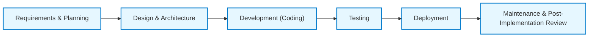

## 8.3 Program Development

Program development, in the context of Information Technology General Controls (ITGC), requires organized and systematic processes to ensure delivered solutions meet stated requirements while maintaining compliance with enterprise-wide controls. This process typically involves several stages, each with designated sign-off gates and acceptance tests. These milestones help organizations confirm that objectives, quality standards, and risk thresholds are met at every point of the project.

This section provides a comprehensive overview of new software development within an organization, focusing on the importance of checkpoints (sign-off gates) and different levels of acceptance testing. We will explore best practices, practical examples, and control perspectives that are critical for CPAs and IT auditors responsible for ensuring successful program development.

  
## Understanding the Program Development Lifecycle

While there are many software development methodologies (e.g., Waterfall, Agile, Hybrid, DevOps), nearly all share common foundational phases:

• Requirements and Planning  
• Design and Architecture  
• Development (Coding)  
• Testing  
• Deployment  
• Maintenance and Post-Implementation Review  

At each of these phases, sign-off gates and acceptance tests serve as vital internal controls, ensuring that the project team adheres to requirements and quality standards, and that stakeholders have a clear understanding of progress and expectations.

Below is a high-level Mermaid diagram illustrating a generic lifecycle and the main sign-off gates along the way:

  
## Requirements and Planning Phase

The requirements and planning phase lays the groundwork for any software initiative, defining the program’s scope, goals, and viability. In many organizations, this stage requires:

• Business Requirements Definition: Collecting user stories or business use cases that articulate the functionality the software must provide.  
• Feasibility Analysis: Assessing whether the project is technically feasible, financially viable, and aligns with strategic objectives.  
• Project Charters and Governance: Outlining budget, timeline, success criteria, and resource allocation.  

### Sign-Off Gate: Requirements Approval

When documentation is comprehensive and accurate, key stakeholders (e.g., project sponsors, business owners, IT, risk management) formally sign off. This sign-off serves as the first control point. It ensures that the business case and requirements are both realistic and agreed upon by all parties. Once approved, the project can proceed to design and architecture.

### Acceptance Testing Reference

Although formal acceptance testing occurs later, early validation from business users and subject-matter experts helps confirm the correctness and completeness of initial requirements. Informal “requirements acceptance” steps reduce rework and guard against scope creep.

  
## Design and Architecture Phase

After finalizing requirements, the team translates them into an architectural blueprint of the system. In this stage, architects and senior developers produce an overall design, including:

• System Diagrams: Representing data flow, modules, and interfaces.  
• Technical Specifications: Outlining software frameworks, libraries, hardware or cloud infrastructure, and integration points.  
• Security and Control Requirements: Detailing authentication, authorization, and data protection measures in compliance with frameworks such as COBIT or NIST.  

### Sign-Off Gate: Architecture and Design Approval

This second gate ensures the proposed solution addresses the business drivers and complies with internal and external controls. At this point, organizations often involve cybersecurity specialists, data governance teams, and compliance officers to validate that security and regulatory considerations are adequately addressed.

### Acceptance Testing Reference

While detailed acceptance testing scripts are not finalized in this stage, the design documentation establishes a reference point from which acceptance criteria can be more explicitly defined. For instance, if the system must handle a certain number of concurrent users, that requirement will drive future testing scenarios.

  
## Development (Coding) Phase

During the coding phase, developers build the software based on the approved design. Key steps in this phase include:

• Setting Up the Environment: Configuring development environments, continuous integration pipelines, and source control repositories.  
• Writing and Reviewing Code: Coding the functionality, conducting peer reviews, and adhering to coding standards.  
• Unit Testing: Developers test discrete modules or functions to verify they produce the required results in isolation.  

### Sign-Off Gate: Iteration or Module Completion

In agile methodologies, continuous integration ensures code merges are frequent; approval often happens in smaller increments. In more traditional approaches (e.g., Waterfall), entire modules may require approval before proceeding to system integration. Either way, sign-off ensures completed units meet design specifications and pass all relevant unit tests.

### Acceptance Testing Reference

Even though acceptance testing is generally part of a dedicated test phase, many organizations incorporate early acceptance-related checks into their code review procedures. For example, if end-user workflows are straightforward enough, a preliminary user test might take place on a small scale during coding. This additional control can catch design and usability issues early, before formal user acceptance testing (UAT).

  
## Testing Phase

The testing phase aims to validate the software against requirements, uncover bugs, and ensure risk factors are mitigated. Organizations often break down testing into multiple layers:

• Integration Testing: Ensuring that modules and subsystems interact correctly.  
• System Testing: Testing the entire application under expected use conditions.  
• User Acceptance Testing (UAT): End users execute real-world scenarios in a controlled environment to verify the system meets functional and business requirements.  
• Performance and Stress Testing: Testing the system’s responsiveness and stability under peak loads or in failure conditions.  
• Security Testing: Vulnerability scanning, penetration testing, and control validation.

### Sign-Off Gate: Test Completion and Quality Assurance

Once the software has undergone the relevant portions of testing, the Quality Assurance (QA) team and stakeholders issue formal approval. This approval indicates that the application meets the predefined acceptance criteria. If high-severity defects remain unresolved, the release may be deferred until those issues are fixed.

### Acceptance Testing Focus

In particular, user acceptance testing is usually the most critical sign-off. UAT acceptance signals that actual business users confirm the software meets day-to-day operational needs. Here, traceability from original requirements to test cases is crucial. CPAs reviewing ITGCs typically verify that robust UAT steps occurred and that outcome logs, issue trackers, and sign-off documents exist to support compliance and risk mitigation.

  
## Deployment Phase

After successfully passing acceptance tests, the software is ready for deployment to production. Deployment steps might vary depending on technical and organizational constraints, but they commonly include:

• Production Environment Setup: Finalizing servers, cloud configurations, or containers.  
• Data Migration: Transferring relevant data from legacy systems or test environments.  
• Go-Live Strategy: Planning rollout (phased or full) and communicating to stakeholders.

### Sign-Off Gate: Go-Live Authorization

Management sign-off is crucial at this juncture. It typically involves:

• Confirming any remaining defects do not impede critical functions.  
• Securing relevant business, financial, and operational approvals.  
• Ensuring that rollback procedures or contingency plans are in place.

### Acceptance Testing Validation

Although major acceptance testing is completed before deployment, a final “operational acceptance” check often takes place. This final check can include verifying the system’s infrastructure performance, final integration tasks, and reviewing compliance with relevant regulatory standards. Only when these conditions are satisfied does the official “go-live” decision occur.

  
## Maintenance and Post-Implementation Review

Once operational, the system enters a maintenance phase to address bugs, implement minor enhancements, and monitor its performance. From an ITGC perspective:

• Post-Implementation Review (PIR): Evaluates the solution’s success against budget, timelines, and objectives.  
• Ongoing Patch Management and Minor Releases: Controls around code changes (see Chapter 10: IT Change Management) continue to apply.  
• Continuous Improvement: Feedback loops help identify improvements, additional training needs, and future system enhancements.

### Sign-Off Gate: Project Closure

The final sign-off typically concludes the project life cycle, confirming the software meets the needs and is stable in production. This phase includes project closure documentation, lessons learned, and a turn over to an operational support team.  

### Acceptance Testing in Maintenance

In maintenance or minor release cycles, smaller acceptance tests may be conducted to ensure new features or bug fixes meet updated or ongoing business requirements without introducing regressions.

  
## Practical Example: Developing a New Invoicing Module

Consider an organization adding a new invoicing module to its existing ERP system. Below are the typical sign-off gates and acceptance tests:

1. Requirements Sign-Off: Business owners approve design for automated invoice generation.  
2. Design Approval: Architecture blueprint ensures integration with existing accounts receivable, with robust data encryption for sensitive customer data.  
3. Coding Gate: Developer peer reviews confirm compliance with coding standards.  
4. Testing Approval: QA validates that the module processes various invoice types (e.g., recurring, one-off) accurately in system and integration tests.  
5. UAT Sign-Off: Finance teams generate test invoices, confirm proper ledger postings. Minor discrepancies are resolved, culminating in a final acceptance sign-off.  
6. Deployment Authorization: IT leadership acknowledges go-live readiness, after performing limited “parallel run” testing in production-like conditions.  
7. Post-Implementation Review: Management confirms that invoices are generated on schedule, with correct amounts. Maintenance protocols are established for future updates.

  
## Key Controls and Best Practices

1. Traceability Matrix: Create a requirements traceability matrix that links each requirement to its corresponding design, implementation, and test case. This ensures nothing gets overlooked and acceptance criteria remain transparent.  
2. Segregation of Duties: Promote separation of roles—for instance, developers should not be solely responsible for final acceptance or deployment. This reduces the risk of unauthorized changes entering production (see also Chapter 8.2: Program Changes).  
3. Documented Testing Procedures: Formal test plans and sign-off documents demonstrate compliance with frameworks like COSO and COBIT.  
4. Stakeholder Engagement: Involving end-users from early phases fosters alignment and expedites acceptance in later stages.  
5. Quality Assurance Checklists: Structured checklists for code quality, design, and user interface add consistency and prevent missing critical review points.  
6. Ensuring Repeatability: Standardizing sign-off forms and acceptance test criteria across projects creates uniformity and predictable outcomes.

  
## Common Pitfalls

1. Scope Creep: Expanding requirements late in development without revisiting sign-off gates or adjusting acceptance tests.  
2. Poor Documentation: Rushed or incomplete artifacts can lead to unclear acceptance criteria or ambiguous review checkpoints.  
3. Lack of User Involvement: Minimal stakeholder feedback prior to launch predisposes a project to user dissatisfaction during UAT.  
4. Weak Testing Strategy: Skipping certain tests (e.g., security or performance) until it’s too late can create large rework efforts or operational vulnerabilities.  
5. Underestimated Complexity: Overly simplistic planning around data conversions or interdependencies can derail the entire schedule and acceptance plan.  

  
## Conclusion

Robust program development processes that incorporate sign-off gates and structured acceptance testing increase the likelihood of delivering high-quality software solutions that achieve their intended objectives. CPAs working in IT audit or advisory roles rely on these preset checkpoints as confirmations that organizational and regulatory compliance requirements have been fulfilled.

This big-picture view captures the essence of how new software is developed and controlled, ensuring appropriate documentation, testing, and approvals are embedded at each phase. When effectively implemented, these controls support both the reliability of financial reporting (where relevant) and the broader operational integrity of a system.

  
## References and Further Reading

• Project Management Institute (PMI): A Guide to the Project Management Body of Knowledge (PMBOK Guide)  
• ISACA. COBIT® 2019 Framework: Introduction & Methodology  
• NIST SP 800-53: Security and Privacy Controls for Information Systems and Organizations  
• AICPA. Guide to Audit Data Analytics  
• Agile Alliance: agilealliance.org/  
• ITIL 4: itil4.org/  

  
## Test Your Knowledge: Program Development and Sign-Off Gates



### Which phase typically involves feasibility studies, gathering stakeholder requirements, and establishing a project charter?

- [x] Requirements and Planning
- [ ] Design and Architecture
- [ ] Development (Coding)
- [ ] Maintenance and Post-Implementation

> **Explanation:** The Requirements and Planning phase focuses on confirming feasibility, finalizing scope, and obtaining initial approvals before design work begins.

### What is the primary purpose of sign-off gates in the program development process?

- [x] Ensuring each phase meets agreed-upon criteria before proceeding
- [ ] Delegating the project budget to stakeholders
- [ ] Avoiding documentation to expedite timelines
- [ ] Only focusing on technical design elements

> **Explanation:** Sign-off gates serve as formal checkpoints to verify that objectives, deliverables, and risk thresholds are met at each project milestone before moving forward.

### During which phase are end users most likely to test the software in scenarios that mimic real-world operations?

- [ ] Requirements and Planning
- [ ] Design and Architecture
- [ ] Development (Coding)
- [x] Testing (User Acceptance Testing)

> **Explanation:** User Acceptance Testing (UAT) typically happens in the Testing phase, allowing business users to confirm that the solution meets operational needs and business requirements.

### Which best practice ensures developers do not solely control deployment to the production environment?

- [x] Segregation of Duties
- [ ] Single sign-on
- [ ] Continuous deployment
- [ ] One-person review boards

> **Explanation:** Segregation of Duties assigns different individuals or teams to various roles (e.g., coding, testing, deployment) to prevent unauthorized changes from reaching production unobserved.

### In a Waterfall methodology, which sign-off gate often comes directly after completing detailed design?

- [x] Architecture and Design Approval
- [ ] Maintenance and Post-Implementation Review
- [ ] System Testing Approval
- [ ] Go-Live Authorization

> **Explanation:** After completing the detailed design phase in a traditional Waterfall approach, the team typically seeks the Architecture and Design Approval before starting development.

### What risk arises if a team expands project requirements late in the development phase without revisiting sign-off gates?

- [x] Scope Creep
- [ ] Improved security
- [ ] Increased compliance checks
- [ ] Easier maintenance

> **Explanation:** Adding new features, functionality, or requirements late in the process without formal sign-off changes leads to scope creep, threatening cost, schedule, and quality.

### Which testing activity focuses on verifying the entire system’s performance under different stress conditions?

- [ ] Unit Testing
- [ ] Integration Testing
- [x] Performance and Stress Testing
- [ ] User Acceptance Testing

> **Explanation:** Performance and Stress Testing evaluates how the entire application behaves under peak loads, measuring throughput, latency, and overall stability.

### Which of the following describes a key outcome of a Post-Implementation Review?

- [x] Evaluating the solution’s success against established objectives
- [ ] Eliminating all future patches
- [ ] Releasing untested modules
- [ ] Hiding project documentation

> **Explanation:** A Post-Implementation Review checks performance, budget alignment, user satisfaction, and any ongoing maintenance requirements, so the organization can learn and improve future implementations.

### Which document helps keep track of how each requirement is addressed throughout design, development, and testing?

- [x] Requirements Traceability Matrix
- [ ] User Manual
- [ ] Agile Task Board
- [ ] Meeting Minutes

> **Explanation:** A Requirements Traceability Matrix maps requirements to corresponding design elements, test cases, and implementation details, ensuring end-to-end coverage.

### True or False: A final operational acceptance check is performed only if major acceptance testing uncovered critical issues.

- [x] True
- [ ] False

> **Explanation:** An operational acceptance check can be performed even without critical issues; it’s a final validation that the software, infrastructure, and processes are functioning as intended in the production environment.



## For Additional Practice and Deeper Preparation

### [Information Systems and Controls (ISC)](https://www.udemy.com/course/isc-cpa-mock-exams/?referralCode=E1217303222935C5E464)

**Information Systems and Controls (ISC) CPA Mocks:** 6 Full (1,500 Qs), Harder Than Real! In-Depth & Clear. Crush With Confidence!

- Tackle full-length mock exams designed to mirror real ISC questions.  
- Refine your exam-day strategies with detailed, step-by-step solutions for every scenario.  
- Explore in-depth rationales that reinforce higher-level concepts, giving you an edge on test day.  
- Boost confidence and minimize anxiety by mastering every corner of the ISC blueprint.  
- Perfect for those seeking exceptionally hard mocks and real-world readiness.

_Disclaimer: This course is not endorsed by or affiliated with the AICPA, NASBA, or any official CPA Examination authority. All content is for educational and preparatory purposes only._
