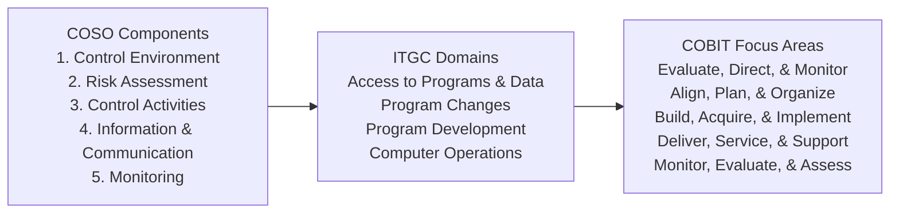
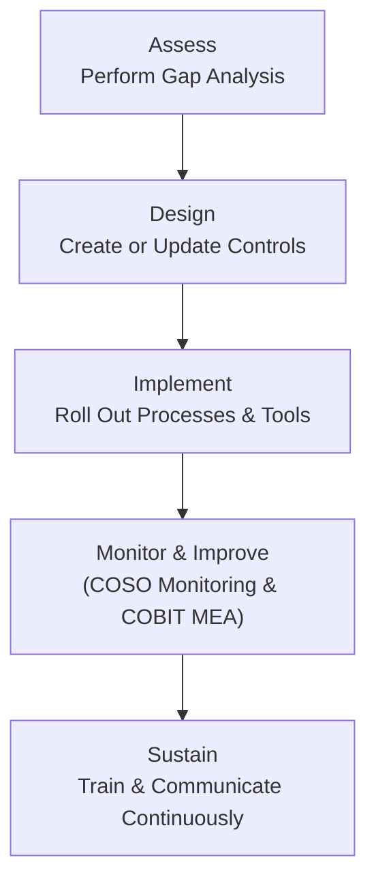

## 8.5 Aligning ITGCs with COSO and COBIT

Information Technology General Controls (ITGCs) establish the foundation for reliable information systems that support financial reporting and overall governance. These controls intersect with well-known frameworks such as the Committee of Sponsoring Organizations of the Treadway Commission (COSO) Internal Control – Integrated Framework and ISACA’s Control Objectives for Information and Related Technologies (COBIT). By understanding how ITGCs map to COSO and COBIT, organizations can create a holistic control environment that optimally addresses risks, supports compliance, and drives continuous improvement.

This section explores the key ITGC domains recognized by many organizations—Access to Programs and Data, Program Changes, Program Development, and Computer Operations—and demonstrates how they align with both the five COSO components and selected COBIT domains/principles. Understanding these alignments helps CPAs, auditors, and security professionals ensure that IT capabilities effectively enable the broader business strategies while maintaining robust internal controls.

--------------------------------------------------------------------------------

## Overview of ITGC Domains

Before diving into the alignment, it is essential to recap the primary ITGC domains. While the exact naming and categorization can vary among organizations, these four domains are commonly used:

• Access to Programs and Data: Encompasses policies and procedures that govern the logical and physical access to systems, applications, and information.  
• Program Changes: Covers the change management process, ensuring all modifications to systems and applications are authorized, tested, and properly tracked.  
• Program Development: Deals with methodology and controls in the creation or significant enhancement of systems and applications, from design through implementation.  
• Computer Operations: Focuses on day-to-day operational controls, such as job scheduling, backup and recovery, incident handling, and system monitoring.

Understanding each of these domains lays the groundwork for mapping them to both COSO and COBIT, ensuring a consistent control environment across an organization’s IT landscape.

--------------------------------------------------------------------------------

## COSO Internal Control – Integrated Framework Recap

COSO’s Internal Control – Integrated Framework consists of five interrelated components:

1. Control Environment: The set of standards, processes, and structures providing the basis for carrying out internal controls.  
2. Risk Assessment: The process for identifying and assessing the likelihood and impact of risks, including those arising from IT.  
3. Control Activities: Actions established through policies and procedures to help ensure that management directives are carried out.  
4. Information & Communication: Processes to capture and exchange the information needed to conduct, manage, and control operations.  
5. Monitoring: Ongoing evaluations, separate evaluations, or a combination of both used to ascertain whether the components of internal control are present and functioning.

The table below provides a high-level mapping between the four ITGC domains and the five COSO components, illustrating how they can be mutually reinforcing. Note that many controls can intersect multiple COSO components.

--------------------------------------------------------------------------------

## COBIT Overview

COBIT (Control Objectives for Information and Related Technologies) is a framework created by ISACA to help organizations develop, organize, and implement strategies around IT governance and management. The COBIT model can be organized into five major domains or focus areas:

• Evaluate, Direct, and Monitor (EDM)  
• Align, Plan, and Organize (APO)  
• Build, Acquire, and Implement (BAI)  
• Deliver, Service, and Support (DSS)  
• Monitor, Evaluate, and Assess (MEA)

These domains collectively cover the end-to-end governance and management of enterprise IT. Each has multiple processes, but at a higher level, they align with the lifecycle of IT governance—starting at strategic direction and culminating in execution, maintenance, and oversight.

--------------------------------------------------------------------------------

## Why Align ITGCs with COSO and COBIT?

1. Comprehensive Risk Coverage: Integrating ITGCs with COSO ensures that IT-related risks are evaluated in conjunction with broader organizational risks, maximizing visibility and consistency in risk management practices.  
2. Unified Governance: Aligning with COBIT fosters coherence between governance objectives (e.g., accountability, performance optimization) and IT operations.  
3. Regulatory and Audit Preparedness: Many regulations and industry standards call for a robust internal control environment. Both COSO and COBIT frameworks are widely recognized, making them valuable references for auditors and regulators.  
4. Operational Excellence: By harmonizing ITGCs, COSO, and COBIT, organizations can embed continuous improvement and accountability into their systems, ensuring controls remain effective over time.

--------------------------------------------------------------------------------

## Visual Representation of Alignment

Below is a simple Mermaid diagram illustrating the interconnections among COSO components, ITGC domains, and COBIT focus areas:

• Left Node (COSO): Emphasizes the five broad areas of internal control.  
• Middle Node (ITGC Domains): Key categories of IT General Controls that reside within (and enable) the COSO framework.  
• Right Node (COBIT): Governance and management activities that implement, monitor, and evaluate ITGCs.

--------------------------------------------------------------------------------

## Mapping Table: ITGCs to COSO and COBIT

Below is a mapping table demonstrating how each ITGC domain typically aligns with COSO components and COBIT domains. Note that your organization may categorize or name controls differently, but the essence remains the same.

| **ITGC Domain**            | **COSO Component(s)**                                                    | **COBIT Domain(s)**                                 | **Key Alignment Points**                                                                                                                   |
|----------------------------|--------------------------------------------------------------------------|-----------------------------------------------------|--------------------------------------------------------------------------------------------------------------------------------------------|
| **Access to Programs and Data** | Control Environment Control Activities Information & Communication | APO (Align, Plan, and Organize) DSS (Deliver, Service, and Support) | • Clear segregation of duties (<em>Control Environment</em>)  • Authentication & authorization policies (<em>Control Activities</em>)  • Secure communication channels (<em>Information & Communication</em>)  • Role-based access aligns with APO • Operational safeguards monitored in DSS |
| **Program Changes**        | Control Activities Monitoring                                         | BAI (Build, Acquire, and Implement) MEA (Monitor, Evaluate, and Assess) | • Change management policies (<em>Control Activities</em>)  • Review of changes to meet business and regulatory requirements (<em>Monitoring</em>)  • Formal approval and testing processes in BAI  • Post-implementation reviews in MEA                                                    |
| **Program Development**    | Risk Assessment Control Activities Information & Communication      | APO (Align, Plan, and Organize) BAI (Build, Acquire, and Implement)   | • Identification of risks in new systems (<em>Risk Assessment</em>)  • Adequate design of development lifecycle controls (<em>Control Activities</em>)  • Collaboration between developers and business leads (<em>Information & Communication</em>)  • Strategic alignment in APO • Implementation processes in BAI |
| **Computer Operations**    | Control Environment Control Activities Monitoring                  | DSS (Deliver, Service, and Support) MEA (Monitor, Evaluate, and Assess) | • Operational policies and procedures (<em>Control Environment</em>)  • Backup & recovery, job scheduling (<em>Control Activities</em>)  • Ongoing performance monitoring (<em>Monitoring</em>)  • Execution of IT operations in DSS  • Continuous evaluation in MEA                           |

--------------------------------------------------------------------------------

## Deep Dive: ITGC to COSO Alignment

1. Access to Programs and Data → COSO Control Environment & Control Activities  
   - Organizations must define clear roles, responsibilities, and culture supporting integrity and ethical values (Control Environment).  
   - Effective identity and access management ensures that users only have privileges aligned with job responsibilities (Control Activities).

2. Program Changes → COSO Control Activities & Monitoring  
   - Change management procedures, including authorization and testing, fall under Control Activities.  
   - Regular reviews of change activities by an independent party ensure that unauthorized or erroneous changes are detected (Monitoring).

3. Program Development → COSO Risk Assessment & Control Activities  
   - The Risk Assessment component encompasses identifying project risks and ensuring appropriate mitigations.  
   - Control Activities, such as stage-gate reviews, secure coding practices, or user acceptance testing, provide assurance that new systems meet organizational requirements.

4. Computer Operations → COSO Monitoring & Control Environment  
   - System reliability is enhanced when monitoring procedures (performance metrics, incident tracking) directly inform management decision-making.  
   - Establishing a strong control environment for day-to-day operations fosters a culture of accountability and continuous improvement.

--------------------------------------------------------------------------------

## Deep Dive: ITGC to COBIT Alignment

1. Access to Programs and Data → COBIT APO & DSS  
   - Align, Plan, and Organize (APO): Security policies, role-based access models, and identification of resource requirements.  
   - Deliver, Service, and Support (DSS): Operational procedures for granting and revoking access, monitoring user activities, and reporting security events.

2. Program Changes → COBIT BAI & MEA  
   - Build, Acquire, and Implement (BAI): Emphasizes controls for documenting and testing changes, using standardized methodologies.  
   - Monitor, Evaluate, and Assess (MEA): Ensures that changes achieve the stated objectives and remain aligned with overall governance requirements.

3. Program Development → COBIT APO & BAI  
   - Align, Plan, and Organize (APO): Involves the strategic alignment of IT development with business objectives, clarifying requirements, and establishing standards.  
   - Build, Acquire, and Implement (BAI): Focuses on practical execution, including configuration management, secure coding, quality assurance, and deployment.

4. Computer Operations → COBIT DSS & MEA  
   - Deliver, Service, and Support (DSS): Addresses continuity management, operational incident management, and performing scheduled tasks.  
   - Monitor, Evaluate, and Assess (MEA): Requires periodic or continuous assessment of operational metrics, identifying improvement opportunities, and verifying compliance.

--------------------------------------------------------------------------------

## Practical Examples and Case Studies

1. Financial Services Firm – Access to Programs and Data  
   - Scenario: A bank must grant employees secure access to sensitive client information.  
   - Implementation: Role-based access control was implemented to align with COSO’s Control Environment focus on clarity of responsibilities. COBIT DSS processes monitored who accessed specific data sets and generated alerts for suspicious activity.

2. Retail Organization – Program Changes  
   - Scenario: A large retailer’s ecommerce platform requires continuous updates to keep competitive.  
   - Implementation: The retailer followed a formal change management policy (BAI) ensuring all code modifications were peer-reviewed, tested, and approved before deployment (COSO Control Activities). Post-release monitoring was part of COSO Monitoring, complemented by COBIT MEA to assess effectiveness.

3. Manufacturing Company – Computer Operations  
   - Scenario: Automated production lines rely on integrated ERP systems for just-in-time inventory.  
   - Implementation: The company put in place daily operational procedures, including job scheduling, data backups, and real-time monitoring (COSO Control Environment, COBIT DSS). They also established monthly reviews (COSO Monitoring, COBIT MEA) to measure system uptime and incident response effectiveness.

--------------------------------------------------------------------------------

## Best Practices for Aligning ITGCs with COSO and COBIT

• Engage Senior Leadership: Senior management must sponsor and support ITGC initiatives, emphasizing the importance of IT risk management as part of the broader corporate risk culture.  
• Standardize Documentation: Maintain clear, concise documentation of ITGCs, linking them explicitly to COSO components and COBIT domains. This fosters consistency and transparency across audits and reviews.  
• Automate Where Possible: Automated monitoring, reporting tools, and workflow solutions reduce human error and deliver real-time insights, aligning well with COBIT’s principle of continuous improvement.  
• Conduct Regular Training: Educate control owners and operators about COSO, COBIT, and how ITGC domains fit together. Periodic refreshers ensure alignment remains intact amid organizational changes.  
• Leverage Technology for Monitoring: Since COBIT emphasizes continuous performance measurement, leveraging Key Performance Indicators (KPIs) enables timely course corrections when controls deviate from expectations.  
• Incorporate Continuous Risk Assessments: COSO highlights dynamic risk assessment. Embed this thinking into every IT project lifecycle stage (BAI), from planning (APO) to operational support (DSS).

--------------------------------------------------------------------------------

## Common Pitfalls and Challenges

• Overly Complex Frameworks: Attempting to adopt every aspect of COSO and COBIT verbatim can overwhelm organizations, particularly small and medium-sized enterprises. Tailor the frameworks proportionally to maturity level and risk appetite.  
• Inadequate Ownership: If ITGC ownership is unclear—whether in the IT department, risk management, or both—misalignments and control gaps can arise. Proper roles and responsibilities must be formalized.  
• Lack of Cross-Functional Collaboration: ITGC, COSO, and COBIT alignment requires buy-in from finance, IT, legal, and other departments. Working in silos diminishes the effectiveness of controls.  
• Insufficient Monitoring: Implementing strong controls without continuous monitoring (COSO Monitoring, COBIT MEA) can lead to a false sense of security. Controls must be reviewed regularly to confirm ongoing relevance and effectiveness.

--------------------------------------------------------------------------------

## Implementation Roadmap Example

An implementation roadmap can further clarify how to integrate ITGC with COSO and COBIT:

1. Perform a Gap Analysis: Use the mapping table to compare current ITGC practices with COSO components and COBIT domains.  
2. Prioritize Remediation: Identify high-risk areas (e.g., Access to Programs and Data) and focus on those first.  
3. Design Controls: Define processes, responsibilities, and supporting documentation aligned with the relevant COSO and COBIT elements.  
4. Communicate Policies: Use cross-functional training and communication channels to ensure every stakeholder understands the updated procedures and their significance.  
5. Monitor & Iterate: Regularly reassess the effectiveness of implemented solutions, apply continuous improvements, and document lessons learned.

--------------------------------------------------------------------------------

## Illustrative Mermaid Diagram of an Implementation Lifecycle

• Assess: Evaluate existing controls against the COSO and COBIT frameworks.  
• Design: Develop or refine ITGC policies based on discovered gaps.  
• Implement: Launch the updated processes and supporting technology.  
• Monitor & Improve: Measure effectiveness and fine-tune controls.  
• Sustain: Maintain an ongoing training program and open channels to capture new risks and lessons.

--------------------------------------------------------------------------------

## References for Further Exploration

• COSO – “Internal Control – Integrated Framework”: Official publication and executive summary available on the COSO website.  
• ISACA – “COBIT 2019 Framework”: The standard guide for governance and management of enterprise IT.  
• IIA (Institute of Internal Auditors) – “Global Technology Audit Guide (GTAG)”: Provides deeper insights into IT auditing methodologies.  
• ISACA – “IT Control Objectives for Sarbanes-Oxley”: Focuses on aligning IT controls with key financial reporting requirements.  
• AICPA – “Guide to SOC 1® and SOC 2® Examinations”: Offers additional context for how ITGCs play a role in attestation engagements.

Use these resources to deepen your comprehension of controlling and monitoring enterprise IT. Understanding these principles ultimately helps CPAs and assurance professionals evaluate, design, and advise on robust control environments that serve both business and regulatory needs.

--------------------------------------------------------------------------------

## Test Your Knowledge: ITGC Alignment with COSO & COBIT



### Which COSO component focuses on establishing the organizational culture, ethics, and role definitions for control effectiveness?
- [ ] Risk Assessment
- [x] Control Environment
- [ ] Control Activities
- [ ] Monitoring

> **Explanation:** The Control Environment involves leadership culture, tone at the top, and established structures, all of which collectively set the foundation for other controls.

### Which ITGC domain primarily addresses entitlement management, user authentication, and segregation of duties?
- [x] Access to Programs and Data
- [ ] Program Changes
- [ ] Program Development
- [ ] Computer Operations

> **Explanation:** The Access to Programs and Data domain ensures that only authorized individuals can access systems and workloads, maintaining proper business and security boundaries.

### In COBIT, which focus area is primarily concerned with incident handling, user support, and operational continuity?
- [ ] BAI (Build, Acquire, and Implement)
- [x] DSS (Deliver, Service, and Support)
- [ ] APO (Align, Plan, and Organize)
- [ ] MEA (Monitor, Evaluate, and Assess)

> **Explanation:** DSS covers the management of service operations, including incidents and day-to-day support tasks crucial for stable operations.

### When mapping Program Changes to COSO, which two components are most relevant?
- [ ] Risk Assessment and Information & Communication
- [x] Control Activities and Monitoring
- [ ] Control Environment and Monitoring
- [ ] Control Activities and Information & Communication

> **Explanation:** Program Changes involve structured procedures and regular reviews—key elements of COSO’s Control Activities and Monitoring components.

### According to COBIT, which domain would encompass strategic alignment of new software development initiatives with business requirements?
- [ ] DSS (Deliver, Service, and Support)
- [ ] MEA (Monitor, Evaluate, and Assess)
- [x] APO (Align, Plan, and Organize)
- [ ] EDM (Evaluate, Direct, and Monitor)

> **Explanation:** APO ensures that technology decisions, including new software projects, align with business goals and planning activities.

### Which is an example of a best practice for maintaining alignment among ITGCs, COSO, and COBIT?
- [ ] Assigning all responsibility for ITGCs to the IT department alone
- [ ] Treating COBIT as optional for any regulated industry
- [x] Standardizing documentation to show clear mapping among controls, COSO components, and COBIT domains
- [ ] Storing all policies offline without performance metrics

> **Explanation:** Standardizing documentation clarifies the relationships among different frameworks, ensuring consistency and transparency.

### What is the primary focus of the MEA (Monitor, Evaluate, and Assess) domain within COBIT?
- [x] Periodic or continuous monitoring of controls and performance
- [ ] Designing and implementing new IT systems
- [x] Measuring the effectiveness of ongoing processes and controls
- [ ] Delivering and supporting operational services

> **Explanation:** MEA emphasizes active oversight and measurement, ensuring controls meet their objectives and remain aligned with enterprise goals.

### Which COSO component includes communication channels to inform stakeholders about control processes and responsibilities?
- [ ] Monitoring
- [x] Information & Communication
- [ ] Control Activities
- [ ] Risk Assessment

> **Explanation:** Information & Communication involves disseminating policy updates, progress reports, and control awareness to relevant parties.

### Which of the following is a hallmark of a well-structured IT General Control environment in the context of COSO’s Monitoring component?
- [x] Ongoing evaluation of control execution and timely remediation of identified gaps
- [ ] Reliance on a single annual audit with minimal interim checks
- [ ] Lack of defined metrics for control performance
- [ ] No requirement for incident reporting or tracking

> **Explanation:** Effective Monitoring necessitates continuous or periodic evaluations, generating data and insight that can be swiftly acted upon to close gaps and enhance operations.

### True or False: Overly complex frameworks with no tailoring to organizational needs can lead to ineffective implementation of ITGCs.
- [x] True
- [ ] False

> **Explanation:** Attempting to adopt frameworks like COSO and COBIT without customizing them to the organization’s size, structure, and risk profile often results in burdensome procedures that don’t add value.



--------------------------------------------------------------------------------

## For Additional Practice and Deeper Preparation

### [Information Systems and Controls (ISC)](https://www.udemy.com/course/isc-cpa-mock-exams/?referralCode=E1217303222935C5E464)

Information Systems and Controls (ISC) CPA Mocks: 6 Full (1,500 Qs), Harder Than Real! In-Depth & Clear. Crush With Confidence!

- Tackle full-length mock exams designed to mirror real ISC questions.  
- Refine your exam-day strategies with detailed, step-by-step solutions for every scenario.  
- Explore in-depth rationales that reinforce higher-level concepts, giving you an edge on test day.  
- Boost confidence and minimize anxiety by mastering every corner of the ISC blueprint.  
- Perfect for those seeking exceptionally hard mocks and real-world readiness.

_Disclaimer: This course is not endorsed by or affiliated with the AICPA, NASBA, or any official CPA Examination authority. All content is for educational and preparatory purposes only._
