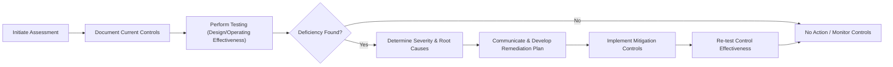
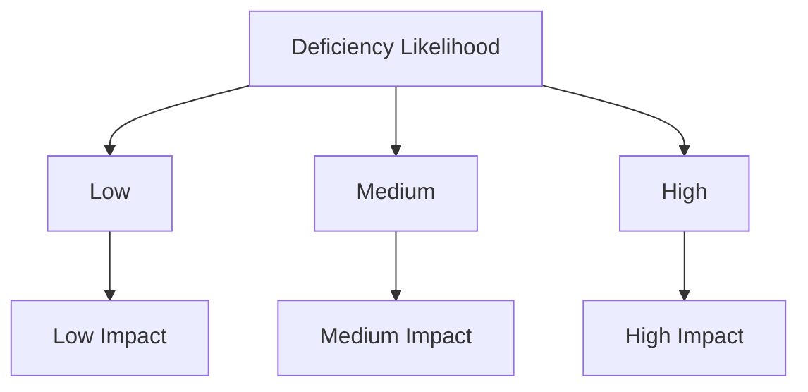

## 8.6 Identifying Control Deficiencies and Mitigation

Identifying control deficiencies and developing appropriate mitigation strategies are central to ensuring that an organization’s Information Systems (IS) and internal control frameworks remain both reliable and compliant. Control deficiencies, when left unaddressed, can expose organizations to financial misstatements, data breaches, and regulatory penalties. In this section, we examine how to systematically identify IT General Control (ITGC) deficiencies, evaluate their significance, and implement tailored mitigation measures. We also reference concepts from broader frameworks such as COBIT 2019, COSO Internal Control – Integrated Framework, and relevant regulatory guidelines, providing real-world examples and best practices.

An understanding of the risks posed by an ineffective or missing control is crucial for CPAs and IT auditors, particularly in engagements that demand a high level of assurance regarding financial data integrity. By discerning the root causes behind control weaknesses and applying appropriate countermeasures, organizations can enhance the security, integrity, and availability of their information systems.

Use this section in combination with other parts of Chapter 8, such as the fundamental domains of ITGCs, for a holistic view of building and maintaining robust controls.  

---

Building upon the earlier chapters’ discussions of IT control frameworks, common business processes, and audit considerations, this section aims to equip readers with the knowledge required to identify deficiencies and counter them effectively. Whether your role involves an IT audit of a small firm or a large multinational enterprise, the concepts explained here will help you recognize potential areas of vulnerability and propose suitable remediation.

### The Importance of Identifying Control Deficiencies

Control deficiencies represent gaps or weaknesses in the design or operation of controls, which could allow misstatements or unauthorized activities to go undetected. These weaknesses may lead to:

• Financial reporting errors or fraud that remain undiscovered.  
• Regulatory noncompliance, causing fines and reputational damage.  
• Security breaches resulting in data loss, theft, or manipulation.  
• Compromise of system resilience and overall business continuity.

Uncovering control deficiencies timely is essential because it provides an opportunity to improve operational efficiency and safeguard stakeholders’ interests. The key is establishing a systematic process for both detection and remediation before significant harm can occur.

### Common Indicators of Control Deficiencies

Identifying a control deficiency starts with understanding the common indicators. Organizations often detect red flags through:

• Audit findings or compliance deviations.  
• Excessive override of established policies and procedures.  
• Unexplained financial variances or missing supporting documentation.  
• Ineffective user access management and repeated password reset requests.  
• Frequent system downtimes or unusual data processing delays.  

By actively monitoring these signals, auditors and control owners can spot inefficiencies and vulnerabilities. Proactively addressing even minor anomalies can prevent major issues from escalating.

### Categories of Control Deficiencies

Control deficiencies typically fall into three broad categories, which often serve as a guide to the severity and required remedial actions:

• Design Deficiency: Arises when a control is either improperly or insufficiently designed to accomplish its intended objective. For instance, a system’s password policy may be poorly constructed, allowing users to reuse old passwords indefinitely.  
• Operating Deficiency: Occurs when a control that is adequately designed is not executed correctly or consistently, possibly due to a lack of training or oversight.  
• Compensating Deficiency: Refers to a situation where a control may be bypassed, but other controls or processes partially offset that risk. Although a compensating control might reduce the severity of a deficiency, the deficiency itself still needs attention.

### Steps to Identifying Control Deficiencies

Accurate identification of control deficiencies involves structured steps that help distinguish minor issues from those that can have material impacts. Below is a simple flow chart, illustrated using Mermaid.js, that outlines a common approach for isolating control weaknesses within an IT environment.

1. Initiate Assessment: Begin by formulating an assessment scope, identifying which systems, processes, and areas present the highest risk.  
2. Document Current Controls: Record the controls that exist within scope. This often means collecting policies, procedure guides, configuration settings, and system logs.  
3. Perform Testing: Conduct testing using a mix of inquiry, observation, and inspection. Evaluate both the design and operational effectiveness of each control.  
4. Determine Severity & Root Causes: Identify the significance of each deficiency, and confirm why it exists (e.g., poor design, lack of enforcement, or resource constraints).  
5. Communicate & Develop Remediation Plan: Share the findings with stakeholders, aiming for a collaboration-driven approach to draft remediation plans.  
6. Implement Mitigation Controls: Execute the recommended corrective measures, ensuring alignment with broader compliance and business objectives.  
7. Re-test Control Effectiveness: Validate that the remediation measures have successfully addressed the deficiency.

### Typical ITGC Deficiencies and Mitigation Strategies

Below are some commonly observed ITGC deficiencies, together with potential mitigation steps or preventive controls that organizations may implement.

–––––––––––––––––––––––––––––––––––––––––––––––––––––

ACCESS TO PROGRAMS AND DATA

• Deficiency Example: Absence of a robust user access review process. Unauthorized individuals may retain access to critical systems or files after job reassignments or terminations.  
• Potential Mitigation:  
  – Implement periodic access reviews (e.g., quarterly), with managers validating their teams’ user rights.  
  – Enforce automated removal of access rights upon termination via integration with the HR system.  
  – Employ multifactor authentication (MFA) solutions for sensitive data.  

• Deficiency Example: Weak password policy allowing simple passwords and indefinite password life.  
• Potential Mitigation:  
  – Enforce complexity requirements (alphanumeric, special characters).  
  – Automate expiration after a set interval (e.g., 60 or 90 days).  
  – Employ Single Sign-On (SSO) solutions with robust session management.

–––––––––––––––––––––––––––––––––––––––––––––––––––––

PROGRAM CHANGES

• Deficiency Example: Changes migrated into production without an independent review.  
• Potential Mitigation:  
  – Require formal change requests for every modification.  
  – Establish segregation of duties so that the individual who develops a change is not the one who approves its deployment into production.  
  – Validate that an authorized reviewer has tested and signed off on the change prior to go-live.

• Deficiency Example: Incomplete or undocumented patch management procedures.  
• Potential Mitigation:  
  – Maintain a regularly updated patch calendar that documents release dates, patch types, and responsibilities.  
  – Automate patch deployment in test environments before production, with robust fallback mechanisms.  
  – Integrate vulnerability scanning to ensure that missing patches are flagged.

–––––––––––––––––––––––––––––––––––––––––––––––––––––

PROGRAM DEVELOPMENT

• Deficiency Example: Inadequate user acceptance testing (UAT) for newly developed or significantly modified applications leads to errors upon deployment.  
• Potential Mitigation:  
  – Create detailed UAT plans that include test scenarios for typical transactions, boundary conditions, and negative testing.  
  – Assign user representatives from different departments to ensure coverage of all user requirements.  
  – Document UAT results, sign-offs, and any identified defects that require fixes before production deployment.

• Deficiency Example: Lack of secure coding guidelines, leading to vulnerabilities such as SQL injection or cross-site scripting.  
• Potential Mitigation:  
  – Implement secure coding standards aligned with frameworks like OWASP.  
  – Provide developer training on secure coding practices.  
  – Use automatic static and dynamic code analysis tools to detect common vulnerabilities.

–––––––––––––––––––––––––––––––––––––––––––––––––––––

COMPUTER OPERATIONS

• Deficiency Example: Inadequate backup schedules and offsite storage processes, resulting in incomplete or delayed data recovery.  
• Potential Mitigation:  
  – Utilize automated, periodic backups stored securely offsite or in the cloud.  
  – Conduct regular test restores to validate the integrity and timeliness of backups.  
  – Clearly define Recovery Time Objectives (RTO) and Recovery Point Objectives (RPO) to guide the backup solution selection.

• Deficiency Example: Lack of system monitoring and incident response procedures. Alerts of system downtime or anomalies could be missed.  
• Potential Mitigation:  
  – Implement a Security Information and Event Management (SIEM) solution for real-time alerts and continuous monitoring.  
  – Standardize incident response plans with clear roles and escalation protocols.  
  – Conduct periodic drills (tabletop or simulation) to ensure readiness.

–––––––––––––––––––––––––––––––––––––––––––––––––––––

### Assessing the Severity of Deficiencies

Once a deficiency is recognized, it is crucial to assess its potential impact by understanding its likelihood and severity. You can think of each deficiency on two axes: (1) Probability of Occurrence, (2) Magnitude of Impact. This is aligned with COSO’s risk assessment approach, which requires considering both financial and operational ramifications.

Some organizations use a heat map approach to visualize the risk profile of control deficiencies:

In practice, you might create a matrix that combines the risk likelihood (low, medium, high) with the potential impact (low, medium, high). Deficiencies deemed high likelihood and high impact may further be classified as material weaknesses, especially in financial audit contexts, demanding immediate corrective action.  

### Formulating Effective Remediation Plans

Creating a structured remediation plan for identified deficiencies not only ensures compliance and security but also improves operational excellence. A remediation plan is often laid out in a table form and includes these key elements:

• Description of the deficiency, including root causes.  
• Owner or person responsible for addressing the deficiency.  
• Proposed corrective actions.  
• Timelines and checkpoints.  
• Dependencies and required resources.  
• Measurement metrics to gauge success.

Below is an example of a remediation plan excerpt:

| Deficiency                    | Root Cause             | Owner        | Corrective Action                                                | Due Date    | Success Measures                     |
|------------------------------|------------------------|-------------|------------------------------------------------------------------|------------|--------------------------------------|
| Inadequate Access Reviews    | Missing Review Policy  | IT Manager   | Develop formal access review policy. Automate review reminders.  | 30 Days     | No unauthorized access post-review    |
| Weak Password Policy         | Lax Policy Standards   | Security Lead | Enforce complexity and password expiration rules.               | 60 Days     | 100% compliance with new guidelines   |
| Patch Management Gaps        | Lack of Process        | Operations   | Create patch schedule, test updates in QA environment.           | 45 Days     | No major unpatched vulnerabilities    |

### Communication and Governance

Effective communication of identified deficiencies to stakeholders is essential. Senior management and governance committees (e.g., the Audit Committee) need to be aware of significant ITGC issues, especially if they can escalate into material weaknesses. Timely updates on remediation progress help maintain accountability and provide a roadmap for ongoing efforts.

Best practices for presenting deficiencies to governance bodies include:

• Providing succinct summaries of identified issues.  
• Outlining the business impact and compliance concerns (if any).  
• Highlighting resource requirements to fix or mitigate each deficiency.  
• Summarizing progress on existing remediation plans, including successes and delays.

### Preventive Controls versus Detective Controls

While addressing identified deficiencies, it’s often beneficial to build a stronger environment overall by incorporating preventive controls rather than relying predominantly on detective measures. Preventive controls are designed to stop errors or fraud before they occur, whereas detective controls identify issues after they have happened. Whenever possible, fortify the environment so that errors seldom arise, reducing the quantity of detective control activities needed to catch them.

Example:

• Preventive: Enforcing role-based access so that only authorized developers can edit production code.  
• Detective: Reviewing system access logs monthly to identify any unauthorized system changes.  

An organization with robust preventive controls usually sees fewer significant deficiencies, as many potential threats are neutralized upstream.

### Practical Case Study

Consider a mid-sized financial services firm receiving repeated audit findings about excessive privileged account creation. Each year, the external auditor flags that multiple administrators hold overlapping rights. On closer inspection, the firm finds:

• There was no formal process for removing redundant privileges once a specific project ended.  
• IT administrators had partial oversight but lacked tools for centralized monitoring.  
• Technical constraints in the legacy system made it difficult to ensure segregation of duties.

Remediation included:

• Implementing an Identity and Access Management (IAM) system to track and manage entitlements.  
• Creating a policy requiring periodic reviews of all privileged accounts, with managers accountable for sign-off.  
• Training IT and end users on the importance of least-privilege principles in daily operations.  

After nine months, a follow-up assessment showed minimal unauthorized permission assignments, significantly reducing the firm’s risk posture.  

### Continuous Improvement and Monitoring

Establishing strong ITGCs and correcting identified deficiencies is not a finite project but an ongoing process. Continuous improvement involves:

• Periodic re-assessments and internal audits to detect newly emerging risks or evolving deficiencies.  
• Benchmarking controls against standards such as COBIT 2019 for ongoing alignment with industry best practices.  
• Updating policies, procedures, and system configurations as business needs, technology, and regulatory requirements change.  

A continuous monitoring strategy can significantly shorten the timeframe between identifying a deficiency and taking corrective action. Automated tools for logging and alerting make it possible to detect suspicious activities in near real-time, while analytics-driven solutions can highlight anomalies that human operators might overlook.

### Additional Best Practices for Mitigation

1. Leverage Cross-Functional Teams: Involve stakeholders from finance, operations, and IT security when formulating remediation strategies, fostering a balanced approach.  
2. Develop Formal Training Programs: Many control issues arise due to staff unawareness or improper execution. Provide targeted training on new or existing controls.  
3. Prioritize Material Weaknesses: Address high-impact and high-likelihood deficiencies first to minimize organizational risk.  
4. Create Scalability in Controls: As your organization grows, adapt controls to handle higher transaction volumes, more applications, and diverse user populations.  
5. Document Thoroughly: Keep a clear paper trail for each deficiency identified, including root cause analysis and all remediation steps, to facilitate both internal review and external audits.

### References and Further Reading

• American Institute of Certified Public Accountants (AICPA): Guidance on internal controls and IT audits  
• COBIT 2019 Framework by ISACA: Comprehensive IT governance framework and assessment methodologies  
• COSO Internal Control – Integrated Framework: Foundational reference for designing, implementing, and evaluating controls  
• NIST SP 800-53: Catalog of security and privacy controls for federal information systems and organizations  
• ITIL: Discusses best practices in IT service management, including change management and incident response  

---

## Test Your Knowledge: Control Deficiencies and Mitigation



### Which of the following is a key symptom of an ITGC deficiency?

- [ ] Frequent changes to policy and procedure manuals  
- [x] Unauthorized user accounts persisting after employee terminations  
- [ ] Regularly scheduled system maintenance windows  
- [ ] Presence of multiple levels of system approval processes  

> **Explanation:** When former employees still have authorized system access, it signals a breakdown in user access controls.

### What is the primary distinction between a design deficiency and an operating deficiency?

- [ ] The design deficiency is always more difficult to remediate  
- [x] A design deficiency involves inadequate controls from the start, whereas an operating deficiency occurs when well-designed controls are not performed correctly  
- [ ] An operating deficiency only applies to publicly traded companies  
- [ ] A design deficiency only occurs in technology-related processes  

> **Explanation:** A design deficiency arises when a control, from the outset, is insufficiently formulated. An operating deficiency means the control is conceptually sound but not consistently performed as intended.

### Which of the following best exemplifies a preventive control that helps reduce the risk of unauthorized system changes?

- [ ] Detailed monthly audit logs  
- [ ] Penetration testing on a quarterly basis  
- [x] Restricting production access to authorized personnel only  
- [ ] Investigating security incidents after a breach has occurred  

> **Explanation:** Granting access solely to authorized personnel helps keep wrongful system changes from happening in the first place.

### What is the first primary step once a control deficiency is identified?

- [ ] Immediately report the deficiency to the external auditor  
- [ ] Discontinue the process associated with the deficiency  
- [x] Determine root causes behind the deficiency  
- [ ] Document the deficiency in the annual report  

> **Explanation:** Pinpointing root causes enables a targeted approach to implementing corrective actions and ensures the deficiency is addressed effectively.

### Which method below is most effective for prioritizing remediation of multiple ITGC deficiencies?

- [x] Evaluate each deficiency’s likelihood and potential impact  
- [ ] Remediate all deficiencies simultaneously  
- [ ] Address the easiest deficiencies first  
- [ ] Select the deficiencies that will take the least time to fix  

> **Explanation:** Risk-based remediation ensures that deficiencies posing the greatest threat to the organization are handled first.

### What is a key advantage of continuous monitoring systems?

- [x] Faster detection and remediation of emerging risks  
- [ ] Lower initial setup costs than manual control checks  
- [ ] Reduction in the complexity of control environments  
- [ ] Elimination of the need for detective controls  

> **Explanation:** Continuous monitoring allows near real-time detection of anomalies and issues, enabling quicker responses to potential deficiencies.

### Which deficiency classification often relies on other controls to reduce the overall level of risk?

- [ ] Material weakness  
- [x] Compensating deficiency  
- [ ] Operating deficiency  
- [ ] Design deficiency  

> **Explanation:** A compensating deficiency refers to a control that is absent or ineffective but offset, at least partly, by other controls.

### Why is robust patch management vital for ITGC?

- [ ] It eliminates the need for user authentication protocols  
- [ ] It makes it impossible for malicious intruders to exploit vulnerabilities  
- [x] It helps ensure that known software weaknesses are promptly addressed  
- [ ] It replaces system requirements with cloud-based solutions  

> **Explanation:** Patch management regularizes updates to fix known security and functionality issues in software, reducing the risk of exploit.

### What is the value of a governance committee (e.g., Audit Committee) in addressing ITGC deficiencies?

- [ ] To replace the external auditor’s opinion on controls  
- [x] To oversee remediation actions, ensure accountability, and allocate resources  
- [ ] To develop new hardware solutions for IT operations  
- [ ] To negotiate with third-party suppliers for lower-level controls  

> **Explanation:** Governance bodies provide oversight, resources, and strategic direction for addressing critical control weaknesses.

### True or False: Detective controls should always be prioritized over preventive controls because they are easier to implement.

- [ ] True  
- [x] False  

> **Explanation:** Preventive controls typically offer a more robust approach by stopping errors and unauthorized activities before they occur. Detective controls are important but often serve as a safety net after the fact.



---

## For Additional Practice and Deeper Preparation

### [Information Systems and Controls (ISC)](https://www.udemy.com/course/isc-cpa-mock-exams/?referralCode=E1217303222935C5E464)  

**Information Systems and Controls (ISC) CPA Mocks:** 6 Full (1,500 Qs), Harder Than Real! In-Depth & Clear. Crush With Confidence!

- Tackle full-length mock exams designed to mirror real ISC questions.  
- Refine your exam-day strategies with detailed, step-by-step solutions for every scenario.  
- Explore in-depth rationales that reinforce higher-level concepts, giving you an edge on test day.  
- Boost confidence and minimize anxiety by mastering every corner of the ISC blueprint.  
- Perfect for those seeking exceptionally hard mocks and real-world readiness.

_Disclaimer: This course is not endorsed by or affiliated with the AICPA, NASBA, or any official CPA Examination authority. All content is for educational and preparatory purposes only._
