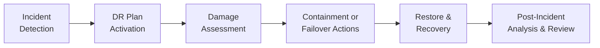

## 9.1 Disaster Recovery Planning and Business Resiliency

Disaster Recovery (DR) Planning and Business Resiliency are fundamental areas within an organization’s overall risk management strategy. They are designed to ensure that critical business functions can continue or be restored quickly in the face of natural disasters, cyberattacks, hardware failures, and other unforeseeable disruptive events. In the context of a CPA’s responsibilities—whether auditing clients’ IT functions or advising on risk mitigation—understanding DR and resiliency is paramount to ensuring the integrity of financial information and the smooth operation of an organization’s systems.

Modern businesses operate in a highly interconnected environment, exposing them to a variety of risks that can lead to operational downtime. A sound disaster recovery plan outlines concrete steps for restoring critical systems as quickly and efficiently as possible. Business resiliency, in turn, broadens the focus to ensure continuity of processes, people, and technology, enabling organizations not just to recover, but to thrive in turbulent circumstances.

This section delves into the foundational elements of disaster recovery and business resiliency, outlining the phases of a DR lifecycle, key metrics such as Recovery Time Objective (RTO) and Recovery Point Objective (RPO), and offering real-world case studies that highlight how organizations plan for—and overcome—disastrous situations.

  
### Understanding Disaster Recovery and Business Resiliency

Disaster recovery typically centers on restoring technology systems to normality after a significant unplanned event. Business resiliency, on the other hand, incorporates the broader perspective: the ability of an organization to adjust to disruptions, maintain continuous operations, and protect people, processes, and technology.

Key components include:

• Identification of critical assets and systems.  
• Specification of recovery strategies (both technical and operational).  
• Assurance that people, processes, and technology can bounce back quickly with minimal downtime or data loss.  

For CPAs, effective DR planning is critical for compliance with certain regulatory and audit requirements. It is also a principle of due diligence to protect stakeholder interests, avoid reputational harm, and ensure continuity of financial data.

  
### Core Terminology: RTO, RPO, and Related Metrics

Two pivotal metrics drive most DR plans:

• Recovery Time Objective (RTO): The maximum allowable time it takes to restore services after a disaster. If an organization has an RTO of four hours for its financial systems, that indicates the goal is to resume operations within four hours of the disruption.  
• Recovery Point Objective (RPO): The maximum acceptable data loss measured in time. An RPO of 15 minutes means a company cannot afford to lose more than 15 minutes of transactional data.  

Other noteworthy terms include:

• Maximum Tolerable Downtime (MTD): The absolute upper limit of downtime before catastrophic costs or damage occurs.  
• Work Recovery Time (WRT): The period between systems coming back online and a full return to “business as usual.”  
• High Availability (HA): A strategy that ensures systems are up and operational for as close to 100% of the time as possible, often used as a complement to DR solutions.  

  
### Phases of the Disaster Recovery Plan

A typical DR plan follows a lifecycle comprising several stages: incident detection, activation, assessment, containment or failover, restore and recovery, and post-incident analysis.

Below is a visual representation of the DR cycle. Each node in the diagram corresponds to a specific stage, illustrating how DR tasks progress from detection and response to restoration and review.

  
#### Incident Detection

• Monitoring systems and alerts: Network monitoring tools, intrusion detection systems (IDS), and user reports often provide the first signals of a potential issue.  
• Escalation protocols: Quick escalation to the DR team ensures that key personnel are informed, and analysis can begin promptly.  

Disasters may present as hardware failures, data breaches, cyberattacks, or natural catastrophes. Early detection allows more time to contain the problem and minimize damage.

  
#### DR Plan Activation

• Decision to invoke DR: Based on predetermined thresholds (e.g., severity of the disruption, expected downtime), incident managers decide whether to activate the DR plan.  
• Key roles and responsibilities: The DR plan should identify individuals responsible for specific tasks, such as switching over to a secondary data center or communicating critical updates to stakeholders.  

  
#### Damage Assessment

• Understanding the scope of disruption: Assess the severity of system outages, data corruption, and physical or technical damage.  
• Potential impact analysis: Identify which business processes are affected, focusing on the most critical ones first. Consider financial, reputational, and operational repercussions.  

  
#### Containment or Failover Actions

• Containment activities: Steps to limit further damage and protect unaffected systems. This could involve shutting down compromised segments of the network or isolating infected systems.  
• Failover procedures: If services are mirrored to an alternate site (or to a cloud-based environment), failover procedures redirect operations to minimize downtime.  

  
#### Restore and Recovery

• Restoration of data and systems: Efforts to rebuild or restore mission-critical systems from backups, replication sites, or inadvertently archived data.  
• Verification and testing: Validation that the restored environment is fully operational, secure, and meets integrity requirements (especially critical for financial reporting).  
• Documenting recovery activities: Meticulous logs facilitate compliance and post-incident review.  

  
#### Post-Incident Analysis & Review

• Detailed review: Conduct a thorough “lessons learned” session to determine areas of improvement in the DR plan.  
• Update DR plan: Make necessary adjustments to processes, documentation, and system configurations.  
• Reporting to stakeholders: Provide transparency to regulators, management, and possibly the public, depending on the severity.  

  
### Real-World Example of a DR Plan in Action

Consider a mid-sized financial services firm that relies heavily on its customer-facing portal and back-end accounting system. Here is how a properly executed DR plan could play out:

1. Incident detection: The network monitoring system flags an unusual surge in traffic, and a real-time intrusion detection alert reveals a potential Distributed Denial of Service (DDoS) attack.  
2. DR plan activation: The incident manager decides to activate the DR plan, notifying IT security, system administrators, and the firm’s DR coordinator.  
3. Damage assessment: Initial investigation reveals the main server environment is overwhelmed, but data has not been leaked or corrupted.  
4. Containment or failover: The team reroutes incoming traffic to a secondary data center hosted in a different region. The security team applies additional filtering rules to limit malicious traffic.  
5. Restore and recovery: The secondary site is brought fully online, and the portal remains accessible. In parallel, the primary system undergoes cleaning and sanitizing. After traffic normalizes, the IT team systematically reverts services to the primary site.  
6. Post-incident analysis: A review uncovers the need for improved intrusion prevention capabilities and additional capacity in the secondary data center for future DDoS attacks. The DR plan is updated accordingly.  

This scenario underscores how efficient detection, a well-written DR plan, role clarity, and swift failover actions can prevent massive financial and reputational damage.

  
### Integrating Business Continuity and Disaster Recovery

Disaster recovery often goes hand-in-hand with business continuity management (BCM), as illustrated in the preceding sections. While DR is predominantly technology-driven, BCM encompasses broader considerations such as human resources, physical office space, and supply chain continuity. These broader elements can include:

• Alternate workplace: Ensuring that employees can relocate to or virtually access an alternate site if the primary office becomes inaccessible.  
• Communication plans: Pre-approved messaging and channels for informing employees, customers, regulators, and the public.  
• Regulatory considerations: Depending on jurisdiction, certain industries (like banking or healthcare) have legal mandates requiring thorough DR and BCM plans.  

By interlocking DR and BCM strategies, an organization develops a holistic blueprint to continue mission-critical operations, even in the face of catastrophic events.

  
### Testing and Maintenance of the DR Plan

A DR plan is not a “one-and-done” document. Regular tests and drills are crucial to ensure readiness and identify weaknesses. Common testing methods include:

• Tabletop Exercises: Team members walk through a simulated scenario, discussing roles and potential responses.  
• Partial Simulations: Core systems are taken offline in a controlled manner to test the failover capabilities.  
• Full Simulations: Primary sites are shut down, and operations shift entirely to hot or warm backup sites to validate real-world resiliency.  

After each test, teams document successes, challenges, and recommended improvements. If material changes occur within the organization’s IT environment (e.g., new software deployments, major upgrades, mergers, or acquisitions), the DR plan should also be updated accordingly.

  
### Common Pitfalls and Mitigation Strategies

Even well-structured DR plans can stumble if not maintained and executed properly. Common pitfalls include:

• Lack of Up-to-Date Documentation: If the DR plan is outdated or not version-controlled, system changes may render it ineffective.  
• Insufficient Funding: DR and business resiliency require budget allocation—without it, hardware, off-site backups, and training may be inadequate.  
• Poor Communication Channels: Without clear procedures for how and when to communicate, confusion can lead to redundant or conflicting instructions.  
• Overlooking Supply Chain Dependencies: Critical vendors and partners also need robust DR measures. Contracts should clarify responsibilities and expectations.  
• Infrequent Testing: Plans are often put on the shelf and never tested, severely undermining their feasibility during a real crisis.  

Mitigating these pitfalls often boils down to consistent review, stakeholder alignment, communication, and top-down support from organizational leadership.

  
### Practical Guidance and Examples

• Implementing Automated Cloud Backups: Cloud service providers often offer snapshot-based backups or continuous replication. Ensure these backups align with your RPO requirements.  
• Setting a Realistic RTO: For many organizations, aiming for near-zero downtime with real-time replication can be cost-prohibitive. Striking the right balance of risk tolerance, budget, and technology capacity is crucial.  
• Considering Third-Party Validation: Engaging an external auditor or consultant to test and evaluate your DR plan can reveal blind spots and foster stakeholder confidence.  
• Prioritizing Applications and Systems: Not all applications are equal. Tier your systems by impact level—focus resources first on the most mission-critical ones.  

  
### Conclusion

Disaster Recovery Planning and Business Resiliency are two sides of the same coin—ensuring business operations continue in the face of disruptions and quickly resume normalcy when interruptions occur. The process starts with vigilant monitoring and clear detection, followed by a well-designed plan specifying responsible parties and concrete steps for assessment, containment, and restoration. Organizations that invest time and resources in testing and continuously improving their DR strategies stand to save tremendous costs while preserving both data integrity and customer trust.

For CPAs and other accounting professionals, aligning IT controls with business objectives is key to preventing losses, ensuring regulatory compliance, and upholding stakeholder confidence. By actively engaging in DR planning, professionals help safeguard critical financial processes and data, a hallmark of excellence in today’s dynamic risk environment.

  
## Master Your Disaster Recovery Knowledge



### Which of the following best describes the purpose of a disaster recovery plan?

- [x] To outline specific procedures for restoring critical systems and data after a disruption  
- [ ] To eliminate the possibility of any disruption or incident  
- [ ] To increase the frequency of unplanned outages  
- [ ] To provide a financial budgeting framework for technology upgrades  

> **Explanation:** A DR plan documents how an organization will recover critical IT infrastructure and functions after a disruptive event. It cannot eliminate disruptions entirely but reduces downtime and data loss.

### In the context of business resiliency, which statement is correct about RTO (Recovery Time Objective)?

- [x] It specifies the maximum amount of time allowed for services to be offline after an incident  
- [ ] It measures the bandwidth capacity of the disaster recovery site  
- [ ] It outlines the cost of establishing a failover data center  
- [ ] It indicates the number of servers needed for redundancy  

> **Explanation:** RTO focuses on how quickly systems must be restored before significant losses occur. It is a time-based target, not a direct measure of costs or hardware capacity.

### Which phase of the DR lifecycle typically comes right after an incident is detected?

- [ ] Damage assessment  
- [ ] Restore and recovery  
- [x] DR plan activation  
- [ ] Post-incident analysis  

> **Explanation:** Once an incident is detected, the next step is often to activate the DR plan. This step involves mobilizing key team members and making a decision to declare a disaster status if specific criteria are met.

### What is a primary difference between disaster recovery (DR) and business continuity management (BCM)?

- [ ] DR focuses on ensuring employees have the correct training, while BCM focuses solely on technology  
- [ ] There is no meaningful difference; they are synonymous  
- [x] DR is technology-centric, while BCM covers broader organizational aspects such as people, facilities, and communication  
- [ ] DR deals only with data backups, while BCM deals only with regulatory compliance  

> **Explanation:** Disaster recovery largely aims at restoring IT systems, whereas business continuity includes continuity of people, processes, workplace arrangements, and communication.

### Which of the following is NOT a common pitfall in DR planning?

- [ ] Infrequent testing of the plan  
- [x] Comprehensive documentation that is regularly updated  
- [ ] Ignoring supply chain dependencies  
- [ ] Under-allocation of funds for necessary backup systems  

> **Explanation:** A pitfall is something that can cause problems. “Comprehensive documentation that is regularly updated” is, in fact, a best practice, not a pitfall.

### What is the primary purpose of post-incident analysis?

- [ ] To penalize employees for their mistakes  
- [ ] To permanently shut down the affected systems  
- [x] To identify improvements for future events and update the DR plan  
- [ ] To reassign staff to different departments  

> **Explanation:** Post-incident analysis (or lessons learned) is a crucial step in refining processes, identifying weaknesses, and improving the overall DR strategy.

### Which statement accurately describes a tabletop exercise for disaster recovery?

- [ ] It involves taking an actual production system offline  
- [x] It is a discussion-based session where team members walk through a hypothetical scenario  
- [ ] It is a live failover test to a secondary data center  
- [ ] It requires short-term power outages in the data center  

> **Explanation:** A tabletop exercise is a low-risk, discussion-centered activity used to validate roles, responsibilities, and the completeness of the DR plan without impacting live systems.

### In a DR scenario, which measurement focuses on the acceptable maximum age of the data recovered?

- [ ] Recovery Time Objective (RTO)  
- [x] Recovery Point Objective (RPO)  
- [ ] Maximum Tolerable Downtime (MTD)  
- [ ] Work Recovery Time (WRT)  

> **Explanation:** RPO measures how far back in time the organization can tolerate data loss, specifying the maximum acceptable time window from the last data backup to the point of disruption.

### Which step in the DR lifecycle typically includes shutting down compromised systems to prevent further spread of damage?

- [ ] Post-incident analysis  
- [x] Containment or failover  
- [ ] Restore and recovery  
- [ ] Damage assessment  

> **Explanation:** Once the scope of damage is understood, containment or failover is triggered to isolate compromised systems or transfer operations to alternate sites, limiting further impact.

### True or False: A properly maintained DR plan should be tested periodically and updated after each major change in the IT environment.

- [x] True  
- [ ] False  

> **Explanation:** Regular testing and updates are crucial to ensure the DR plan remains aligned with evolving systems, infrastructures, and organizational needs.



## For Additional Practice and Deeper Preparation

### [Information Systems and Controls (ISC)](https://www.udemy.com/course/isc-cpa-mock-exams/?referralCode=E1217303222935C5E464)

Information Systems and Controls (ISC) CPA Mocks: 6 Full (1,500 Qs), Harder Than Real! In-Depth & Clear. Crush With Confidence!

- Tackle full-length mock exams designed to mirror real ISC questions.  
- Refine your exam-day strategies with detailed, step-by-step solutions for every scenario.  
- Explore in-depth rationales that reinforce higher-level concepts, giving you an edge on test day.  
- Boost confidence and minimize anxiety by mastering every corner of the ISC blueprint.  
- Perfect for those seeking exceptionally hard mocks and real-world readiness.  

_Disclaimer: This course is not endorsed by or affiliated with the AICPA, NASBA, or any official CPA Examination authority. All content is for educational and preparatory purposes only._
