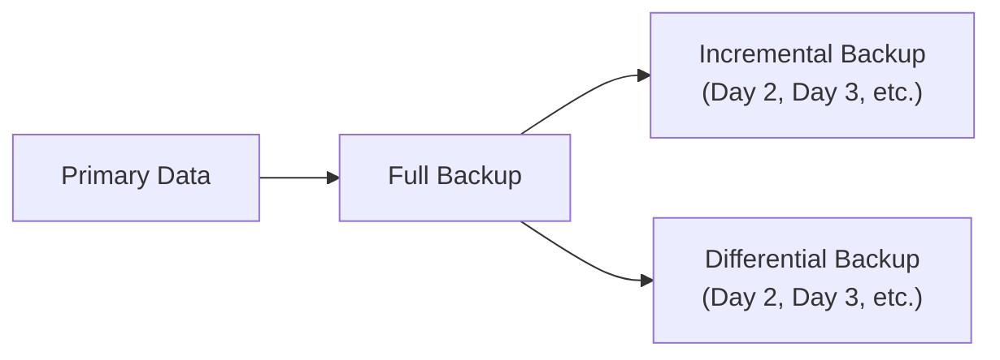
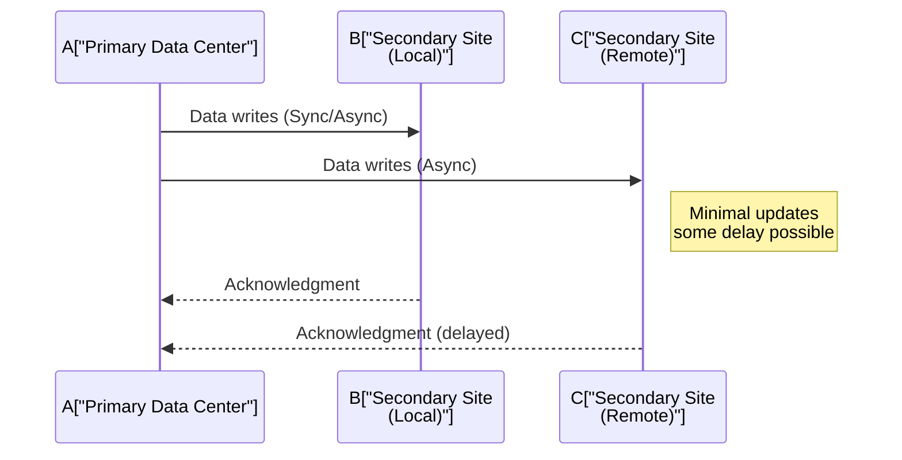

## 9.2 Redundancy and Replication Strategies (Mirroring, Backup Procedures)

Ensuring data availability and continuity is one of the most critical responsibilities in managing modern information systems. Even brief downtimes can result in significant financial loss, reputational harm, and regulatory consequences—particularly within organizations responsible for storing and handling sensitive financial and accounting data. For CPAs and IT professionals alike, understanding redundancy and replication strategies is essential for developing robust business continuity plans that minimize downtime and data loss.

This section explores the fundamental concepts of redundancy, data mirroring, and backup procedures—specifically comparing full, incremental, and differential backups, as well as continuous replication approaches. We will dissect the cost-versus-business-impact trade‑offs so that you can determine the most appropriate strategy for your organization or your clients.

--------------------------------------------------------------------------------

### Importance of Redundancy and Replication in Business Continuity

Redundancy and replication are integral to keeping critical systems available. By creating multiple copies of data or system components, organizations mitigate the risk of total failures. Specifically, these strategies help organizations achieve:

• Reduced System Downtime: Rapid response and automated failover mechanisms shorten or eliminate interruption in service.  
• Lower Risk of Data Loss: Multiple copies (onsite or offsite) of key transaction records, customer data, and financial statements reduce exposure to data loss.  
• Regulatory Compliance: Many regulations require safeguarding sensitive information and ensuring records remain accessible for auditing and compliance. Redundancy and replication help meet these demands (e.g., HIPAA, GDPR, or SOC engagements).  
• Operational Continuity: Key processes (e.g., payroll, AP/AR, financial reporting) can continue, or be quickly restored, in the event of hardware failures, cyberattacks, or other disruptions.  

Although redundancy and replication introduce costs—both in technology investments and administrative overhead—they play a pivotal role in safeguarding an organization’s operations.

--------------------------------------------------------------------------------

### Key Terminology

Before diving into specific redundancy and replication strategies, let’s define a few important terms:

• Recovery Time Objective (RTO): The targeted duration to restore operations after a disruptive event. Shorter RTO goals often require more sophisticated and expensive redundancy.  
• Recovery Point Objective (RPO): The maximum length of time in which data might be lost following a major incident. Lower RPOs typically mean more frequent or real-time replication.  
• Failover: The process of switching to a redundant or standby system, network, or data center upon detecting a failure.  
• Backup Window: The time period during which backups occur. Minimizing this window can reduce disruptions.  

--------------------------------------------------------------------------------

### Replication and Mirroring Strategies

Replication or mirroring creates a real-time or near-real-time copy of data on a secondary system. This approach is often used in mission-critical environments with stringent RPO and RTO requirements. Depending on your operational and financial constraints, you might adopt one of the following replication strategies:

• Synchronous Replication: Every write to the primary server is immediately mirrored to the secondary site. Although this ensures the secondary site is always up to date, it can introduce latency and is more expensive due to specialized hardware or network requirements.  
• Asynchronous Replication: Data writes occur on the primary site first, and changes are propagated to the secondary site with a slight delay. This approach is less costly and reduces latency but may result in some data loss in the event of a sudden failure.  
• Near-Synchronous Replication: Strikes a balance by batching updates and sending them rapidly. This can keep data almost current with modest overhead.  

Mirroring typically refers to two identical copies of data that can be switched (or “failed over”) rapidly. Database and storage-level mirroring solutions exist, such as real-time data mirroring for Microsoft SQL Server or Oracle. These configurations can be a key part of an overall high-availability architecture.

From a CPA’s perspective, real-time replication is especially relevant for safeguarding financial transactions. If an organization must ensure the integrity and availability of ledger entries (e.g., preventing incomplete ledger transactions in the event of a system crash), synchronous or near-synchronous replication can help minimize the risk.

--------------------------------------------------------------------------------

### Backup Strategies: Full, Incremental, and Differential

While replication focuses on keeping a secondary environment up to date, backup procedures capture data snapshots at specific intervals. These point-in-time backups can be restored if data corruption or loss occurs. Organizations often combine replication and backup to maximize flexibility and coverage.

#### Full Backups
A full backup copies all data in the system. This method is straightforward in terms of restoration because it’s a single snapshot that contains every file, database, and application at the time of backup. However:
• It can be time-consuming and resource-intensive.  
• It requires significant storage capacity.  
• It is typically performed on a weekly or periodic basis rather than daily.  

Despite higher costs, full backups remain essential. They serve as baseline images for incremental or differential backups and can be used if incremental or differential recoveries become complex or unavailable.

#### Incremental Backups
Incremental backups only capture data that has changed since the last incremental (or full) backup. This approach is the most storage-efficient among the three common backup types:
• Significantly reduces backup times because only changed blocks of data are included.  
• Speeds up daily backups, which can be performed more frequently (e.g., once or multiple times per day).  
• Restoration requires the last full backup plus all incremental backups. If any backup in the chain is missing or corrupted, it complicates the restore process.  

For instance, if your organization completes a full backup on Sunday and incremental backups each day thereafter, a Wednesday restore requires the Sunday full backup plus the Monday and Tuesday incremental backups. CPAs counting on near-real-time backups for transaction cycles or year-end closings should ensure the incremental chain is well-managed and tested for integrity.

#### Differential Backups
A differential backup copies all data changed since the last full backup. It offers a middle ground between full and incremental methods:
• Less time-consuming than a full backup, but captures more data than an incremental.  
• Restoration requires only the last full backup and the latest differential backup.  
• Size of differential backups grows each day until the next full backup.  

For example, if a full backup happens on Saturday, the subsequent differential backup on Sunday will include everything changed since Saturday. On Monday, the next differential will also capture everything changed since Saturday—so it becomes cumulatively larger. However, to restore Monday’s backup, you need only the Saturday full backup plus the Monday differential.  

--------------------------------------------------------------------------------

### Comparing Backup Types: A Practical Illustration

Below is a simplified diagram illustrating how full, incremental, and differential backups work in relation to each other.

| Backup Type  | Description                                                       | Pros                          | Cons                                                                       | Usage Example                                                                               |
|--------------|-------------------------------------------------------------------|-------------------------------|----------------------------------------------------------------------------|---------------------------------------------------------------------------------------------|
| Full         | Copies entire dataset                                            | Easiest to restore  Self-contained snapshot                                                           | High storage cost  Longest time to execute                                            | Ideal for baseline backups performed weekly or monthly                                      |
| Incremental  | Only data changed since last full or incremental backup          | Efficient in storage  Fast backup times                                                               | Restoration requires each incremental  Risk of partial chain failure affects recovery  | Suitable for daily or frequent backups when storage and speed are priorities                |
| Differential | All changes since the last full backup                           | Easier to restore than incremental  One chain from latest full to differential                       | Growth in size every day  Some overhead cost more than incremental                     | Good compromise between large full backups and detailed incremental backups                 |

Each method offers a unique balance of cost, time, and data availability. An audit engagement might require frequent backups over a short period to capture all relevant transactions. Balancing these methods helps ensure you have both quick turnaround for daily operations and complete data sets for compliance or year-end financials.

--------------------------------------------------------------------------------

### Direct Replication vs. Periodic Backups

Beyond the structured methods of full, incremental, and differential, some organizations choose to implement direct or “continuous” replication solutions for data protection. These systems capture changes in near-real time and replicate them to an offsite or secondary environment. The primary distinction from typical scheduled backups is the granularity and frequency of data updates.

• Advantages:  
  – Almost zero data loss if synchronous replication is used.  
  – Rapid failover in the event the primary system fails.  
  – Near real-time recovery and minimal RTO/RPO.  

• Disadvantages:  
  – Higher cost for storage, bandwidth, and specialized replication software.  
  – Potential for data corruption to propagate quickly if not carefully monitored.  
  – More complex testing procedures.  

An example scenario is a global financial institution that replicates transactions between multiple data centers. Because tolerating even a few minutes of downtime can cost millions, such entities often invest heavily in direct replication. For a smaller business with moderate data volumes, an incremental strategy performed nightly or a combination of differential backups and cloud archiving may suffice.

--------------------------------------------------------------------------------

### Cost vs. Business Impact Trade-offs

The choice of backup and replication strategies requires weighing potential business losses from downtime or data corruption against the costs of the associated technology.

• **Hardware and Software Expenditure**: Synchronous replication may demand specialized SAN (Storage Area Network) appliances or enterprise-level solutions, driving hardware and license costs up.  
• **Personnel and Administration**: IT staff must monitor backup jobs and replication statuses, test restoration, and maintain multiple environments.  
• **Downtime Consequences**: A major outage can trigger missed financial filings, lost revenue, reputational damage, or regulatory fines.  
• **RPO/RTO Requirements**: Organizations with strict RPO and RTO constraints (e.g., in healthcare or high-speed trading) require advanced redundancy and real-time replication. Others may tolerate brief downtime in exchange for lower overhead.  

To illustrate, consider a rapidly growing online retailer that processes thousands of orders per hour. A minimal RTO (say, two hours or less) might justify both real-time replication and nightly full backups. But a smaller accounting firm might accept a 24-hour RTO, enabling incremental nightly backups to a third-party cloud service.  

--------------------------------------------------------------------------------

### Real-World Example: Financial Transaction Systems

Imagine a finance department for a mid-sized retailer. Their systems record point-of-sale transactions, manage accounts payable/receivable, and connect to an ERP solution. The CFO and CPA want near real-time accuracy in reporting, especially during peak sale seasons. Here’s a potential solution stack:

1. **Weekly Full Backups** on Sunday night to create a baseline.  
2. **Differential Backups** every evening from Monday to Saturday to simplify the restore process.  
3. **Local Replication** of the accounting database in near-synchronous mode for minimal operational downtime and quick failover in case of localized hardware failure.  
4. **Monthly Integrity Tests** to validate the recoverability of backups and the effectiveness of replication.  

In this approach, the business benefits from:  
• A single-step restore (full + latest differential) during the week.  
• Minimal data loss if the primary accounting database fails.  
• Manageable costs compared to fully synchronous replication across multiple geographies.  

--------------------------------------------------------------------------------

### Best Practices and Considerations

1. **Regular Testing**: Merely having backups or replication isn’t enough. Test restorations regularly to verify data integrity and recovery times.  
2. **Encryption and Security**: Use encryption-at-rest and in-transit for recommended backups to prevent unauthorized disclosure of sensitive data.  
3. **Documented Procedures**: Maintain clear, updated policies for backup schedules, replication tasks, and failover processes.  
4. **Offsite Storage**: Keep backups in a geographically separate location or in the cloud to protect against localized disasters.  
5. **Monitoring and Alerting**: Implement real-time alerting for failed backups or replication tasks. Red flags should trigger immediate investigation.  
6. **Lifecycle Management**: Define how long backups are retained and how replication snapshots are rotated. Align these periods with regulatory and operational needs.  

--------------------------------------------------------------------------------

### Diagram: Multi-Site Replication

The following Mermaid sequence diagram illustrates a simplified multi-site replication flow between a primary data center (Site A) and multiple secondary sites (Site B, Site C). The approach can incorporate synchronous or asynchronous updates.

By distributing data across multiple sites, organizations strengthen their resilience. Even if a catastrophic event disrupts Site A, Site B or Site C can step in, maintaining access to financial and operational data.

--------------------------------------------------------------------------------

### Practical Steps for CPAs and IT Teams

1. **Align with Strategic Objectives**: Work with senior management to identify the acceptable risk level regarding downtime and data loss.  
2. **Risk Assessment**: Determine which systems need the highest levels of redundancy and what level of RPO/RTO is realistic.  
3. **Cost-Benefit Analysis**: Weigh technology costs (hardware, licenses) against the potential losses from irrecoverable data or missed compliance deadlines.  
4. **Evaluate Automation and Cloud**: Cloud-based backup solutions can simplify offsite storage, while infrastructure-as-code methods can streamline replication setups in DevOps.  
5. **Continuous Improvement**: As the business evolves—especially if new regulations come into play—review and update the redundancy strategy.  

--------------------------------------------------------------------------------

### Concluding Thoughts

Redundancy and replication strategies are vital for safeguarding organizational data, especially when dealing with mission-critical financial and accounting systems. By evaluating the trade-offs between cost, complexity, and the desired recovery objectives, CPAs and IT professionals can craft a balanced, effective solution. Whether it’s the simplicity of weekly full backups or the sophistication of into-the-second replication, these methods collectively serve a unified purpose: to ensure that vital information systems remain available, accurate, and protected against a broad array of disruptions.

--------------------------------------------------------------------------------

## Mastering Redundancy and Replication: A Systems Availability Quiz



### Which term refers to the maximum length of time in which data may be lost during a recovery event?

- [ ] Recovery Time Objective (RTO)
- [x] Recovery Point Objective (RPO)
- [ ] Mean Time to Failure (MTTF)
- [ ] Return on Investment (ROI)

> **Explanation:** Recovery Point Objective (RPO) defines the maximum tolerable period in which data might be lost due to a major incident, reflecting how far back in time the data recovery process must go.

### Which backup type includes every single file or piece of data, regardless of changes?

- [x] Full backup
- [ ] Incremental backup
- [ ] Differential backup
- [ ] Continuous backup

> **Explanation:** A full backup copies all data in the system. It is the most comprehensive but requires the greatest amount of time and storage space.

### When using incremental backups after a full backup, what is needed to perform a complete restore?

- [ ] Only the most recent differential backup
- [ ] Only the most recent incremental backup
- [x] The most recent full backup plus every incremental since the full backup
- [ ] No backups are required if real-time replication is in place

> **Explanation:** An incremental backup captures only changes since the last incremental, so you must have the original full backup and each incremental backup in sequence to restore fully.

### Which replication method ensures data is written to both primary and secondary sites simultaneously?

- [x] Synchronous replication
- [ ] Asynchronous replication
- [ ] Snapshot-based replication
- [ ] Offsite backup storage

> **Explanation:** Synchronous replication updates the secondary site instantly with each transaction on the primary site, ensuring zero or near-zero data loss but sometimes introducing latency.

### Which is a primary disadvantage of asynchronous replication?

- [ ] Minimal network bandwidth
- [ ] Higher storage requirements
- [x] Potential data loss if a failure occurs before updates are sent to the secondary
- [ ] Extremely high-latency performance

> **Explanation:** Because data is sent to the secondary site with a delay, any sudden failure at the primary site could result in some data not yet replicated (data loss).

### In the context of backups, differential backups:

- [x] Capture all changes since the last full backup
- [ ] Capture all changes since the last incremental backup
- [ ] Are more storage-efficient than incremental backups
- [ ] Do not require a baseline full backup

> **Explanation:** Differential backups copy all changes since the last full backup. This method simplifies recovery to two sets: the last full and the most recent differential.

### Which statement best describes a cost vs. business impact consideration for replication?

- [x] The tighter the RPO/RTO, the more expensive the replication infrastructure
- [ ] Real-time replication has no additional cost
- [x] Asynchronous replication solves all compliance requirements
- [ ] Synchronous replication always reduces bandwidth costs

> **Explanation:** Tighter RPO/RTO aims mean higher investment in technology and infrastructure. Real-time replication generally demands specialized hardware, robust bandwidth, and expertise, translating into higher costs.

### What is an advantage of full backups combined with differential backups over purely incremental backups?

- [x] Recovery only requires the latest full backup plus a single differential backup
- [ ] Lower storage usage than incremental backups
- [ ] Faster to execute each day
- [ ] Eliminates the need to archive old data

> **Explanation:** With differential backups, you only need the last full backup and the most recent differential to restore. This can simplify the recovery process vs. chain-based incremental backups.

### What is a common pitfall of real-time replication?

- [ ] Delayed transaction writes
- [ ] Reduced data availability
- [x] The possibility of replicating errors or corruption quickly
- [ ] Lower cost compared to standard backups

> **Explanation:** Real-time or near-real-time replication can replicate software bugs, data entry errors, or malicious changes instantly if not carefully monitored and managed.

### Is it advisable to test backup restorations and replication failover scenarios in real-world conditions?

- [x] True
- [ ] False

> **Explanation:** Regular testing of backups and replication procedures helps ensure that data is recoverable, verifying that RPO and RTO objectives can be met under real conditions.



--------------------------------------------------------------------------------

## For Additional Practice and Deeper Preparation

### [Information Systems and Controls (ISC)](https://www.udemy.com/course/isc-cpa-mock-exams/?referralCode=E1217303222935C5E464)

**Information Systems and Controls (ISC) CPA Mocks:** 6 Full (1,500 Qs), Harder Than Real! In-Depth & Clear. Crush With Confidence!

- Tackle full-length mock exams designed to mirror real ISC questions.  
- Refine your exam-day strategies with detailed, step-by-step solutions for every scenario.  
- Explore in-depth rationales that reinforce higher-level concepts, giving you an edge on test day.  
- Boost confidence and minimize anxiety by mastering every corner of the ISC blueprint.  
- Perfect for those seeking exceptionally hard mocks and real-world readiness.  

_Disclaimer: This course is not endorsed by or affiliated with the AICPA, NASBA, or any official CPA Examination authority. All content is for educational and preparatory purposes only._
