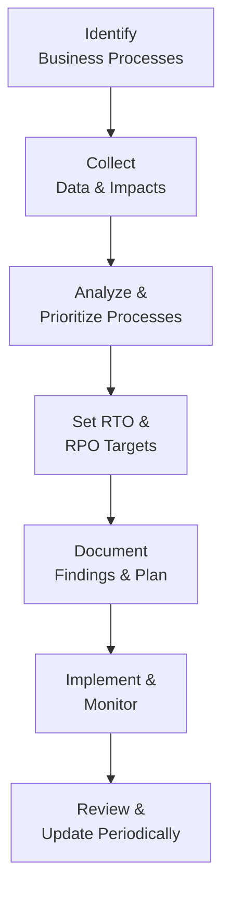

## 9.3 Business Impact Analysis (BIA): Identifying Critical Functions

A critical pillar of effective system availability and business continuity is a robust Business Impact Analysis (BIA). A BIA systematically identifies key business processes, evaluates their dependencies, and estimates the impact of disruptions on organizational performance and finances. From an accounting, auditing, and information systems perspective, a BIA informs strategic decisions on resource allocation, recovery objectives, and risk mitigation techniques. This section delves into how to identify and classify critical functions, prioritize business processes, and apply a streamlined template to conduct a BIA efficiently.

Effective BIAs align closely with the broader frameworks covered in other chapters (see Chapter 1 for an introduction to ISC, Chapter 7 for a discussion of core transaction cycles, and Chapter 9.1 for Disaster Recovery Planning). Additionally, organizations that work within regulated environments or adhere to frameworks such as COSO Internal Control—Integrated Framework, COBIT 2019, ISO 22301, or NIST SP 800-34 benefit further by integrating their compliance mandates with business continuity efforts.

-------------------

### Understanding the Purpose of a Business Impact Analysis

A BIA aims to:

• Identify which business processes are most critical to an organization’s operation.  
• Rapidly assess how downtime or data loss would affect financial stability, reputation, regulatory compliance, and operational capacity.  
• Pinpoint interdependencies among processes, IT assets, personnel, and external vendors.  
• Establish priorities (e.g., how soon processes must be restored) and define Recovery Time Objectives (RTOs) and Recovery Point Objectives (RPOs).  
• Provide decision-makers with data to allocate resources effectively during contingencies.

Real-world example: A medium-sized insurance firm might rely heavily on a claims processing application. If this application goes down, policyholders cannot submit claims, leading to potential reputational damage and possible regulatory repercussions. Thus, the BIA process helps the insurer identify the application’s criticality, set a brief RTO (e.g., 2-4 hours), and commit financial resources to robust backup and failover measures.

-------------------

### Key Components of a BIA

Although the specific methodology can vary across industries and frameworks, most BIAs share the following components:

1. Inventory of Business Processes: A detailed catalog of each process, existing IT resources, owners, and dependencies.  
2. Impact Assessment: Evaluation of the financial, operational, reputational, legal, and contractual impacts if a process is disrupted.  
3. Recovery Objectives: Determination of RTO (how quickly a process should be restored) and RPO (the extent of tolerable data loss).  
4. Prioritization of Processes: Ranking of processes based on criticality and impact severity, aiding in resource allocation.  
5. Documentation and Reporting: Creation of reports illustrating the BIA methodology, findings, and recommended remediation or backup strategies.  
6. Ongoing Maintenance: Regular review and updates, particularly when IT systems change or new processes are introduced.

-------------------

### Classifying Business Processes by Priority

One of the most important outcomes of the BIA is establishing which processes are truly “critical.” While many organizations use unique schemes, most classification methods center on varying degrees of impact (e.g., high, medium, or low) and the time window in which a process must resume to avoid unacceptable losses.

Below is a sample priority classification system:

| **Classification** | **Description**                                                                                   | **Examples**                                                                           | **Typical RTO**          |
|--------------------|---------------------------------------------------------------------------------------------------|----------------------------------------------------------------------------------------|--------------------------|
| **Priority 1**     | Mission-critical. Its failure causes immediate operational, regulatory, or financial repercussions.| Core financial postings, claims processing, real-time transaction systems             | Under 4 hours            |
| **Priority 2**     | Important. Its disruption significantly impedes productivity but may not halt all operations.     | CRM systems, HR payroll processing, key management reports                             | 24–48 hours              |
| **Priority 3**     | Supporting. Its disruption has moderate impact; manual workarounds or delays may be acceptable.   | Employee training portals, marketing campaign tools                                    | 72 hours or more         |
| **Priority 4**     | Non-critical. Minimal impact on financials or reputation; typically can be restored last.         | Internal knowledge base, archived historical data, certain administrative functions    | Up to 1 week or longer   |

Organizations should tailor these classifications to their industry, size, and stakeholder needs. For instance, a heavily regulated industry (e.g., banking) may consider compliance-related functions as Priority 1, even if short-term financial loss is minimal.

-------------------

### Determining Impact Criteria

To gauge how severely an interruption affects your organization, consider several criteria in conjunction:

• Financial Impact: Lost revenue, penalty fees, increased operating costs, or intangible costs such as lost investments.  
• Operational Impact: Degraded services, backlog in critical operations, or compromised workflows that affect subsequent processes.  
• Reputational Influence: Criticism from customers, negative social media coverage, or regulatory scrutiny.  
• Compliance/Legal Obligations: Non-adherence to government or industry regulations can yield fines or legal actions.  
• Strategic or Competitive Ramifications: Missed business opportunities or a damaged market position.

Many organizations use a scoring matrix in which each criterion (financial, operational, reputational, compliance, strategic) is weighted. Higher-scoring processes result in a higher classification and, correspondingly, a shorter allowable downtime.

-------------------

### Recovery Time Objective (RTO) and Recovery Point Objective (RPO)

Two crucial metrics frequently arise during BIA discussions:

1. **Recovery Time Objective (RTO)**: The maximum acceptable downtime for a service or function before causing irreversible or intolerable consequences. This metric guides the organization’s strategy in defining how quickly they must restore resources during an outage.

2. **Recovery Point Objective (RPO)**: The maximum amount of data loss (computed in terms of time) the organization can tolerate without detrimental effects. RPO shapes how often backups, transaction logs, or replication must be performed.

For CPAs evaluating the organization’s readiness level, verifying that RTOs and RPOs are consistent with business objectives and stakeholder expectations is a fundamental step. Overly optimistic RTOs can lead to underfunded disaster recovery strategies, while overly generous RPOs can result in unacceptable data loss.

-------------------

### Visualizing the BIA Process

The BIA process can be depicted in a simplified lifecycle diagram. Below is a Mermaid.js diagram. Note the conventional shape usage (e.g., rectangles for tasks, diamonds for decisions).

• “Identify Business Processes” (Step A) includes listing all processes and sub-processes.  
• “Collect Data & Impacts” (Step B) involves analyzing downtime impact across financial, operational, and reputational dimensions.  
• “Analyze & Prioritize Processes” (Step C) rates each process’s criticality using a criteria-based scoring or classification scheme.  
• “Set RTO & RPO Targets” (Step D) ensures each prioritized process has a defined downtime allowance and acceptable data loss threshold.  
• “Document Findings & Plan” (Step E) preserves results, recommended controls, and dependencies in a structured format.  
• “Implement & Monitor” (Step F) ensures alignment with actual IT and operational practices.  
• “Review & Update Periodically” (Step G) closes the loop, incorporating business changes, system upgrades, or new regulations.

-------------------

### Step-by-Step Template for Conducting a BIA

The following template outlines a high-level sequence of tasks to guide CPA firms, IT auditors, or internal stakeholders. While each organization might adapt this approach, the core elements remain largely universal.

1. **Project Initiation**
   - Define the BIA’s purpose, scope, and objectives.  
   - Obtain executive sponsorship to ensure resources and organizational buy-in.  
   - Identify key stakeholders (IT, finance, operations, legal, HR, third parties).

2. **Data Gathering**
   - Interview process owners and department heads to capture details on processes, IT dependencies, and resource requirements.  
   - Collect relevant documentation, such as process flowcharts, standard operating procedures (SOPs), and system architecture diagrams.

3. **Impact Analysis**
   - Assess financial, operational, reputational, compliance, and strategic impacts.  
   - Where possible, gather historical data on past incidents or near-misses to refine impact estimates.

4. **Classification and Prioritization**
   - Assign each process a priority level based on the severity and timing of potential impacts.  
   - Integrate stakeholder input to ensure alignment with strategic and operational goals.

5. **Set Recovery Objectives**
   - Determine RTO and RPO for each process, balancing risk tolerance with available technology and budgets.  
   - Document assumptions about technology availability, staff skill sets, and vendor support.

6. **Documentation, Reporting, and Validation**
   - Summarize findings in a BIA report with clear action items.  
   - Validate with leadership and process owners.  
   - Distribute summary or departmental-level findings to ensure broad awareness.

7. **Implementation and Continuous Improvement**
   - Integrate BIA results into risk management, business continuity, and IT procurement decisions.  
   - Revisit BIA periodically, especially after major organizational changes (e.g., mergers, new ERP system implementation, or expansions).

-------------------

### Using the BIA to Enhance Business Continuity and Audit Readiness

A well-executed BIA does more than just highlight critical processes—it links business objectives to technology solutions, enhances internal control environments, and supports compliance with auditing standards. In the context of accounting and finance:

• **Identifying Key Financial Processes**: Processes like general ledger posting, payroll, tax calculation, and revenue recognition often appear at or near the top of BIA rankings.  
• **Strengthening Controls**: BIA findings can inform stronger IT General Controls (refer to Chapter 8 for deeper coverage) and more targeted application controls in major transaction cycles (Chapter 7).  
• **Supporting SOC Examinations**: Service organizations that undergo SOC 1® or SOC 2® examinations can use BIA outcomes to improve descriptions of risk management, control environments, and availability commitments.

-------------------

### Common Pitfalls and Best Practices

• **Pitfall: Underestimating Dependencies**  
  Many organizations focus on a single process without understanding the prerequisites or services required for its operation. Best practice involves mapping dependencies—such as underlying database services, network infrastructure, or third-party services.

• **Pitfall: Overcomplicating the Analysis**  
  Large enterprises sometimes generate overly detailed BIA reports that become unwieldy. Best practice is to keep the analysis to meaningful depth; extremely granular detail can slow decision-making.

• **Pitfall: Lack of Stakeholder Engagement**  
  The business continuity or IT team alone cannot conduct an accurate BIA. Involve department heads, legal, finance controllers, external vendors, and auditors in discussions. This ensures that all relevant impacts are captured.

• **Best Practice: Align BIA with Broader Risk Management**  
  Integrate the BIA with enterprise risk management (ERM). For example, leverage COSO ERM frameworks (Chapter 3.2) and link BIA outcomes with the organization’s top strategic risks.

• **Best Practice: Use Real-World Testing**  
  Regularly conduct tabletop exercises or simulation testing to validate BIA assumptions. If a critical system’s RTO is 4 hours, test whether IT teams can truly achieve that restoration time under realistic conditions.

-------------------

### Example: BIA for a Mid-Tier Manufacturing Company

Imagine a mid-tier manufacturing company that supplies automotive components worldwide. The organization’s BIA exercise identified several key processes:

• Inventory and Procurement (Priority 1): A short disruption leads to halted production lines, penalty fees from customers, and missed delivery deadlines. The BIA sets a 4-hour RTO.  
• Shipping and Logistics (Priority 2): Delays cause less immediate cost but can still bolster backlog. RTO is 24 hours.  
• HR and Payroll (Priority 2 or 3): Important to maintain employee satisfaction, but possible to delay with partial manual processes. RTO is 48 hours.  
• Marketing and Branding (Priority 3): Not critical for daily operations, short breaks can be mitigated. RTO is 72 hours.  
• Product Research & Development (Priority 4): R&D is vital for future competitiveness but can tolerate short-term disruptions. RTO is 1 week.

This approach ensures that the manufacturing company’s continuity plan invests in robust system redundancy for Priority 1 processes, while devoting proportionately fewer resources to lower-priority functions.

-------------------

### Summary and References

A Business Impact Analysis is a foundational step for any comprehensive business continuity and disaster recovery strategy. By classifying processes according to impact, setting realistic recovery objectives, and regularly updating your assessments, you ensure that your organization can bounce back swiftly from disruptions. More importantly, BIAs enable clear decision-making around budgeting, technology investments, and staffing—helping pass audits with a favorable outcome.

For additional reading and closer alignment to authoritative standards, explore:

• NIST SP 800-34, “Contingency Planning Guide for Federal Information Systems.”  
• ISO 22301, “Business Continuity Management Systems—Requirements.”  
• COBIT 2019, “Framework for the Governance and Management of Enterprise IT.”  
• COSO ERM, “Enterprise Risk Management—Integrating with Strategy and Performance.”

-------------------

## Test Your Knowledge: Business Impact Analysis Quiz



### Which of the following best describes a key purpose of the Business Impact Analysis (BIA)?

- [ ] Reducing the budget for IT infrastructure.  
- [x] Identifying critical functions and determining the impact of their disruption.  
- [ ] Training personnel on new software releases.  
- [ ] Ensuring only the finance department handles crisis management.  

> **Explanation:** The core purpose of a BIA is to identify critical business functions and assess the potential impacts and risks associated with a disruption. Reducing budgets or focusing only on software training is outside the primary scope of a BIA.

### What is the main difference between RTO (Recovery Time Objective) and RPO (Recovery Point Objective)?

- [ ] RTO measures the acceptable data loss, while RPO measures the duration of system outage.  
- [x] RTO measures the acceptable time a system can be down, while RPO measures how much data loss is tolerable.  
- [ ] RTO always requires zero downtime, while RPO accounts for unlimited data loss.  
- [ ] RTO and RPO are interchangeable terms.  

> **Explanation:** RTO focuses on the maximum allowable downtime, and RPO focuses on the allowable data loss in terms of time. They address distinct dimensions of continuity planning.

### Which of the following impact categories is typically assessed in a BIA?

- [x] Financial, operational, reputational, compliance, and strategic impacts  
- [ ] Visual designs and aesthetics  
- [ ] Strictly market share metrics  
- [ ] Only financial and reputational costs  

> **Explanation:** A standard BIA evaluates multiple dimensions: financial, operational, reputation, compliance, and strategic. Market share, brand aesthetics, or other narrow focuses may be part of your broader risk analysis but are not the sole BIA categories.

### What is the best practice when determining process criticality?

- [x] Incorporate both quantitative data (revenues, costs) and qualitative insights (such as reputational damage).  
- [ ] Focus solely on quantitative data, like sales figures.  
- [ ] Estimate impacts based on general opinion or gut feeling.  
- [ ] Use only publicly available competitor metrics.  

> **Explanation:** Determining process criticality requires a balanced approach, using tangible metrics (e.g., financial data) and intangible aspects (e.g., brand image, customer trust).

### In a priority classification system, which of the following best fits Priority 1?

- [x] A process whose disruption immediately halts revenue generation and breaches regulatory requirements.  
- [ ] A process that provides valuable but optional employee training sessions.  
- [x] A process that underpins financial postings and real-time transactions.  
- [ ] A process with an acceptable downtime of several days.  

> **Explanation:** Priority 1 processes are mission-critical functions that must not go down for more than a short period (e.g., hours). Real-time transaction systems or functions governed by strict regulations clearly match this definition.

### Which statement correctly reflects a common BIA pitfall?

- [x] Underestimating dependencies across different business processes.  
- [ ] Classifying all processes as Priority 3 or 4.  
- [ ] Documenting the RTO for each process.  
- [ ] Updating the BIA on a scheduled basis.  

> **Explanation:** Underestimating or overlooking cross-functional dependencies is a classic pitfall in BIAs. Properly recognizing dependencies is essential for accurate impact assessment.

### What is one best practice for ensuring that BIA findings remain current?

- [x] Perform ongoing maintenance and re-evaluation whenever major changes occur.  
- [ ] Archive BIA documents for future review without ongoing updates.  
- [x] Complete a single BIA at inception and never repeat it.  
- [ ] Outsource the BIA to a third party without internal input.  

> **Explanation:** Because business operations, regulations, and technologies evolve quickly, it’s crucial to regularly update the BIA to reflect new realities and maintain its relevance.

### Why is stakeholder engagement important in the BIA process?

- [x] It ensures that relevant information—including critical dependencies, financial impacts, and compliance concerns—are accurately captured.  
- [ ] Stakeholders should only be consulted once the final BIA results are published.  
- [ ] BIA is strictly an IT responsibility, so stakeholder input is optional.  
- [ ] It helps marketing teams bypass legal and compliance requirements.  

> **Explanation:** BIAs touch multiple departments. Stakeholders from operations, finance, legal, IT, and other areas can provide insights that shape accurate impact assessments and realistic recovery objectives.

### What is a realistic approach to managing BIA complexity?

- [x] Develop a clear scope and focus on critical processes first, expanding detail as necessary.  
- [ ] Include every possible business detail in a single BIA document.  
- [ ] Outsource the entire BIA to an external contractor without oversight.  
- [ ] Only interview IT employees for data collection.  

> **Explanation:** Managing BIA complexity usually involves starting with a clear scope focusing on mission-critical processes. Then you can refine or expand as needed, preventing the process from becoming unwieldy.

### Even though R&D can be vital to future competitiveness, why might it be classified under a lower priority?

- [x] Short-term disruption might have less immediate financial or regulatory impact compared to daily operations.  
- [ ] R&D is universally unimportant.  
- [ ] Technology teams cannot handle R&D needs.  
- [ ] R&D never influences revenue generation.  

> **Explanation:** Research & Development often contributes to long-term innovation and profitability but may not require the same immediate recovery demands as sales or transactional systems. Hence, disruptions may be tolerable for a longer timeframe.



-------------------

## For Additional Practice and Deeper Preparation

### [Information Systems and Controls (ISC)](https://www.udemy.com/course/isc-cpa-mock-exams/?referralCode=E1217303222935C5E464)

**Information Systems and Controls (ISC) CPA Mocks:** 6 Full (1,500 Qs), Harder Than Real! In-Depth & Clear. Crush With Confidence!

• Tackle full-length mock exams designed to mirror real ISC questions.  
• Refine your exam-day strategies with detailed, step-by-step solutions for every scenario.  
• Explore in-depth rationales that reinforce higher-level concepts, giving you an edge on test day.  
• Boost confidence and minimize anxiety by mastering every corner of the ISC blueprint.  
• Perfect for those seeking exceptionally hard mocks and real-world readiness.

_Disclaimer: This course is not endorsed by or affiliated with the AICPA, NASBA, or any official CPA Examination authority. All content is for educational and preparatory purposes only._
