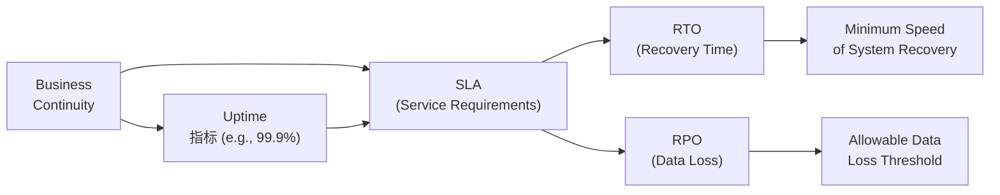

## 9.4 Metrics and Agreements (Uptime, SLAs, Recovery Time Objectives)

In today’s fast-paced, technology-driven business environment, system availability and quick recovery from disruptions are paramount. Companies rely on financial, accounting, and operational data to drive decisions and maintain competitive advantages. Even brief downtime can result in lost revenue, reputational damage, and regulatory compliance issues. This section delves into the key metrics and agreements that guide system availability requirements in an organization: uptime, service level agreements (SLAs), and recovery time objectives (RTO). We also explore how recovery point objectives (RPO) shape recovery scope for data and processes.

────────────────────────────────────────────────────────────────────────

### Overview of Key Availability Concepts

Ensuring availability involves setting clear targets for how often systems must be operational, how quickly they can be restored when incidents occur, and how much data loss is acceptable if a system failure happens. These targets and objectives allow IT managers, auditors, and stakeholders to plan, invest, and measure performance against established benchmarks.

• **Uptime** measures the total time that an IT service, system, or application is operational and available to end users.  
• **Service Level Agreements (SLAs)** formalize the guaranteed availability and performance levels between a service provider (internal or external) and the client (the business or user).  
• **Recovery Time Objective (RTO)** determines how quickly a service or process must be resumed following a disruption.  
• **Recovery Point Objective (RPO)** addresses how much data the organization can afford to lose in the event of a disaster or outage.

Understanding and applying these metrics involve aligning technology capabilities with business needs and risk appetite.

────────────────────────────────────────────────────────────────────────

### Uptime Metrics and Calculations

System uptime is often expressed as a percentage of total available time in a given measurement period. A high uptime percentage suggests robust infrastructure design, proper redundancy, and effective maintenance processes. Commonly referenced tiers of availability include “three nines” (99.9%), “four nines” (99.99%), or even “five nines” (99.999%). However, higher availability targets often come with exponentially higher costs.

#### Basic Uptime Formula

A standardized calculation for uptime percentage is shown as follows:


\text{Availability} \;(\%) = 
\left( \frac{\text{Total Uptime}}{\text{Total Uptime} + \text{Total Downtime}} \right) \times 100


where:  
• Total Uptime = the time (in hours, minutes, or seconds) during which the system is operational.  
• Total Downtime = the time during which the system is not functional or accessible.

#### Example: Calculating Monthly Uptime

Suppose a company operates its ERP for 30 days in a month (720 hours). During this period, the ERP experiences 2 hours of downtime. The system uptime is:

• Total Uptime = 720 - 2 = 718 hours  
• Total Downtime = 2 hours  


\text{Availability} = \left( \frac{718}{720} \right) \times 100 
\approx 99.72\%


Even 2 hours of downtime results in the SLA dropping below 99.9%. While 99.72% might seem high, the difference between 99.72% and 99.9% can be crucial in regulated industries or high-volume ecommerce environments where minutes of downtime can translate into significant financial or reputational losses.

#### Tracking Partial Downtime and Performance Degradation

It is important to differentiate between complete outages and partial performance degradation. Some organizations define “downtime” strictly as system unavailability, while others include application slowdowns that significantly degrade user experience. Clarifying these definitions in SLAs fosters accurate measurement and reporting.

────────────────────────────────────────────────────────────────────────

### Service Level Agreements (SLAs)

SLAs formalize the contractual expectations between a service provider and a client regarding the performance and availability of systems. They also specify remedies or penalties if requirements are not met, including monetary credits or contract term extensions for the customer.

#### Key Components of an SLA

1. **Service Description**  
   Defines the scope of services covered by the SLA, including system components (servers, databases, network devices) and relevant operational details (peak usage hours, exception scenarios).

2. **Performance Metrics**  
   Outlines the specific metrics being measured, such as uptime percentage, response time, throughput, or transaction processing rate. Uptime is typically expressed as a monthly or quarterly target to handle anomaly spikes in usage or maintenance windows.

3. **Responsibilities and Roles**  
   Clarifies the duties of both the service provider and the client, including:  
   • Maintenance schedules and activities.  
   • Collaboration on major changes or updates.  
   • Resource provisioning and capacity planning.

4. **Reporting and Monitoring**  
   Specifies how metric data is collected, analyzed, and reported (e.g., real-time dashboards, monthly performance reports). It also delineates the tools used to measure availability, so that parties agree on reliability and accuracy.

5. **Penalties, Remedies, and Escalation**  
   Details the repercussions if the service provider fails to meet the SLA. This might include financial compensation, remission of service fees, or contract termination. Escalation paths (internal or external) are established for intractable or chronic SLA violations.

#### Importance for Auditors and CPAs

From a CPA’s perspective, an SLA provides measurable performance targets that influence internal controls, risk assessments, and business continuity planning. If an SLA is not met, it could potentially lead to financial statement misstatements if key systems (like accounting or transaction platforms) fail to process data accurately. SLAs also shape contingency budgets, as organizations may factor SLA-related penalties or additional investments to ensure compliance.

────────────────────────────────────────────────────────────────────────

### Recovery Time Objectives (RTO) and Recovery Point Objectives (RPO)

IT disruptions can stem from hardware failures, software bugs, cyberattacks, or natural disasters. Two critical metrics—RTO and RPO—help define an organization’s resilience strategy. They also underpin decisions regarding backup frequency, data replication, redundancy, and other availability considerations.

#### Recovery Time Objective (RTO)

RTO represents how quickly an organization needs to restore a service, application, process, or entire data center following an outage. A typical formulation is:


\text{RTO} = \text{Target Restoration Time} - \text{Outage Start Time}


In practice, RTO depends on:  
• **Business tolerance:** The maximum time a critical process can be down without causing severe financial or operational harm.  
• **Technical capabilities:** The speed at which IT resources can restore systems, including failover to backup sites, data restoration, or system rebuilds.  
• **Compliance and regulatory** factors: Certain regulatory environments (e.g., financial services, healthcare) demand faster recoveries to protect stakeholders.

##### Real-World RTO Example  
A large financial institution states that its online banking system must be recoverable within 30 minutes (RTO = 30 minutes). If an outage occurs at 1:00 PM, operations must resume no later than 1:30 PM to avoid potential regulatory or reputational repercussions.

#### Recovery Point Objective (RPO)

RPO defines the acceptable amount of data loss in a disaster scenario, indicating how far the organization can roll back or restore from backups. An RPO of 24 hours typically means that daily backups are acceptable and the organization can lose data generated between the most recent backup and the point of failure.

##### RPO vs. RTO: Defining the Recovery Scope

• **RTO** focuses on how quickly systems must be restored.  
• **RPO** determines how much data can be lost, which influences backup frequency or replication strategy.  

Together, RTO and RPO shape technical, operational, and financial planning for disaster recovery and business continuity. While RTO drives the speed of restoration processes, RPO dictates the granularity and frequency of data protection.

────────────────────────────────────────────────────────────────────────

### How RTO and RPO Define the Recovery Scope

When analyzing business continuity strategies, it is essential to consider the interplay between RTO and RPO. An organization with an RTO of two hours and an RPO of one hour will need solutions (e.g., near-real-time data replication) to ensure minimal downtime and minimal data loss. Conversely, a small office with limited resources might find classifying a 48-hour RTO and 24-hour RPO acceptable, given its risk tolerance, budget, and regulatory environment.

Below is a conceptual diagram illustrating the relationship among Uptime, SLA, RTO, and RPO.

In this diagram:

• “Business Continuity” (A) is the overarching goal.  
• “Uptime” (B) contributes to meeting the SLA (C), ensuring the system is generally available.  
• The SLA (C) also encompasses RTO (D) and RPO (E) objectives.  
• RTO (D) defines the speed of recovery (F), while RPO (E) establishes allowable data loss (G).  

────────────────────────────────────────────────────────────────────────

### Balancing Cost and Availability

Pursuing higher availability metrics (such as five nines) often requires significant investment in redundant infrastructure, load balancing, failover clusters, and advanced monitoring tools. Similarly, achieving near-zero downtime or near-zero data loss typically involves more complex architecture (e.g., synchronous data replication across multiple geographical data centers), which can be cost-prohibitive for smaller organizations.

Balancing cost and risk is a major challenge:

1. **Cost-Effectiveness Analysis**  
   Weigh the investment in high availability (redundant hardware, expensive cloud solutions) against potential losses from downtime or data corruption.

2. **Tiered Services**  
   Organizations might set different RTOs and RPOs for different systems, prioritizing mission-critical applications (e.g., order processing, financial ledgers) over less critical processes (e.g., internal analytics).

3. **Regular Testing**  
   Even with robust infrastructure, assumptions can fail if not tested regularly. Conducting regular disaster recovery (DR) drills ensures the organization can meet stated RTO/RPO commitments.

────────────────────────────────────────────────────────────────────────

### Practical Examples and Case Studies

1. **Global Ecommerce Platform**  
   • Uptime SLA: 99.999% (“five nines”)  

   • Calculated effect of downtime: Each minute offline results in thousands of dollars of lost sales and marketing impact.  

   • RTO/RPO: RTO of 15 minutes, RPO of near-zero data loss, achieved through geo-redundant data centers with synchronous replication.  

   • Financial Impact: Despite the high infrastructure costs, the risk of a multi-million-dollar revenue hit during a major outage justifies the investment.

2. **Regional Manufacturing Firm**  
   • Uptime SLA: 99.9%  

   • Calculated effect of downtime: 1 hour of downtime in a month might impede production lines, but buffer stock and delayed shipments mitigate consumer impact.  

   • RTO/RPO: RTO of 8 hours, RPO of 24 hours, relying on daily backups.  

   • Financial Impact: Downtime often leads to overtime or minor shipping delays. The cost of more complex solutions is not offset by the potential production disruptions.

3. **Local Law Office**  
   • Uptime SLA: 99%  

   • Calculated effect of downtime: The law firm can delay some tasks but has critical deadlines for court filings, which requires at least basic backups.  

   • RTO/RPO: RTO of 12 hours, RPO of 24 hours (end-of-day backups suffice).  

   • Financial Impact: Sensitivity is around missing regulatory deadlines or losing critical documents. A robust archive and simple offsite backup system meet business needs at a relatively low cost.

Each organization tailors available solutions to their specific operational, regulatory, and financial context.

────────────────────────────────────────────────────────────────────────

### Common Pitfalls and Best Practices

1. **Overly Ambitious SLA Commitments**  
   Organizations may commit to near-perfect availability in their SLAs, creating unachievable expectations. Ensure all parties understand the true capabilities and potential constraints of existing infrastructure.

2. **Omitting Clear Definitions of Downtime**  
   Not specifying partial downtimes or degrading performance as an outage can lead to disputes over SLA breach. Clarify performance thresholds in SLA agreements.

3. **Lack of Adequate Testing**  
   Achieving RTO/RPO objectives requires rehearsals, including failover drills, data restore exercises, and real-time simulations. Paper-based strategies without practical testing frequently fail under real crises.

4. **Ignoring Changing Business Needs**  
   As a company grows, prior assumptions regarding acceptable RTO/RPO may no longer hold. Continual assessment and revision of DR plans and SLAs are critical to meet changing demands.

5. **Underestimating Incident Escalation Paths**  
   If responsibilities for incident detection, communication, and resolution are unclear, response times can lag, making SLA targets harder to meet. A solid chain of command and documented responsibilities are vital.

────────────────────────────────────────────────────────────────────────

### Guidance for CPAs and IT Auditors

• **Risk Assessment**  
  Evaluate how availability metrics and SLAs align with business objectives. Gaps can expose the organization to unanticipated losses or hidden liabilities.  

• **Control Testing**  
  Test the effectiveness of backup and restore procedures, ensuring they meet stated RTO/RPO. Verify appropriate logging and monitoring for downtime events.  

• **Documentation and Evidence**  
  Ensure the organization documents each downtime incident thoroughly. Evidence of timely incident resolution and compliance with SLA terms is crucial.  

• **Contract and Vendor Review**  
  Examine vendor SLAs for clarity on responsibilities, escalation processes, and compensation models. Where relevant, third-party assurance (e.g., SOC reports) can validate vendor claims.

────────────────────────────────────────────────────────────────────────

### References and Further Reading

• **COBIT 2019 Framework** – Outlines IT governance principles that include measuring and monitoring availability.  
• **NIST Special Publication 800-34** – Provides guidance on Contingency Planning and business continuity best practices.  
• **ITIL (Information Technology Infrastructure Library)** – Offers guidelines on service design, service operations, and continual service improvement of IT services.  
• **AICPA SOC 2® Guidance** – Discusses Trust Services Criteria, including availability, confidentiality, and other security principles.  
• **COSO ERM Framework** – Emphasizes risk management and the importance of aligning uptime/RTO/RPO metrics with an organization’s strategic objectives.

────────────────────────────────────────────────────────────────────────

## Test Your Knowledge: System Availability and SLAs



### Which formula best represents system availability expressed as a percentage?

- [ ] (Total Downtime / (Total Uptime + Total Downtime)) × 100
- [ ] (Total Downtime / Total Uptime) × 100
- [x] (Total Uptime / (Total Uptime + Total Downtime)) × 100
- [ ] (Total Downtime / Total Uptime) × 1000

> **Explanation:** Availability is generally calculated by dividing total uptime by the sum of uptime and downtime, then multiplying by 100 to determine the percentage.

### What is the main difference between Recovery Time Objective (RTO) and Recovery Point Objective (RPO)?

- [ ] RTO deals with data loss while RPO deals with system availability.
- [ ] RTO focuses on how quickly the organization must recover, while RPO focuses on acceptable data loss.
- [x] RTO focuses on the time to restore operations, while RPO focuses on acceptable data loss.
- [ ] RTO and RPO both focus solely on system uptime.

> **Explanation:** RTO defines how quickly operations must resume following a disruption, while RPO defines how much data (back in time) the organization can afford to lose.

### Which of the following best describes an SLA penalty?

- [ ] A financial incentive given to a service provider for excellent performance.
- [x] A remedy or credit offered to the client when service levels fall below agreed targets.
- [ ] A troubleshooting measure included in the SLA for identifying downtime causes.
- [ ] A security measure used to protect sensitive data.

> **Explanation:** SLAs often include penalty clauses allowing service recipients to receive credits or refunds if providers fail to meet agreed-upon performance metrics.

### In determining acceptable downtime, which consideration is most important for a critical financial application?

- [x] Business tolerance and regulatory requirements.
- [ ] The number of developers on staff.
- [ ] The size of the data center’s physical footprint.
- [ ] The type of encryption used for data in transit.

> **Explanation:** For financial applications, regulatory compliance and business tolerance for downtime are paramount in defining how quickly services need to be restored.

### If a service provider promises 99.999% uptime, what is the maximum total annual downtime allowed?

- [ ] 1 hour
- [x] Approximately 5 minutes
- [ ] About 52.5 minutes
- [ ] 8 hours

> **Explanation:** “Five nines” equates to roughly 5.26 minutes of downtime per year.

### A company’s RPO is 4 hours. Which scenario aligns with this RPO?

- [x] The organization can restore data from backups taken every 4 hours, risking up to 4 hours of data loss.
- [ ] The system must be back online within 4 hours.
- [ ] The organization keeps live replication to ensure no data is ever lost.
- [ ] The service provider warns that downtime will not exceed 4 hours.

> **Explanation:** An RPO of 4 hours refers to how much data can be lost, implying backups or replication intervals occur every 4 hours.

### What is a common pitfall if SLAs do not address partial performance degradation?

- [ ] It creates a scenario where multiple SLAs exist for the same service.
- [ ] It imposes no need for RTO or RPO metrics.
- [x] Disputes may arise because slow performance might not count as “downtime” under the SLA.
- [ ] It forces the organization to adopt continuous real-time backups.

> **Explanation:** Without specifying what counts as downtime versus degraded performance, misunderstandings about SLA compliance can arise.

### Which of the following is the primary purpose of an SLA monitoring and reporting clause?

- [x] To define how metrics will be tracked, measured, and communicated between service provider and client.
- [ ] To guarantee 100% uptime for all technology services.
- [ ] To enable organizations to skip regular testing of disaster recovery plans.
- [ ] To establish threat intelligence sharing among different industry players.

> **Explanation:** Monitoring and reporting provisions explain how the service provider and client will observe and report on system performance, ensuring transparency on meeting availability targets.

### When balancing cost with high availability, what practice might an organization consider?

- [ ] Eliminating backup solutions to reduce expenses.
- [x] Implementing tiered RTOs and RPOs, giving priority to mission-critical systems.
- [ ] Abolishing the use of SLAs to prevent disputes.
- [ ] Using one-size-fits-all solutions for every application.

> **Explanation:** Tiered SLAs allow an organization to prioritize critical systems with higher availability needs while allowing less critical systems to have lower (and less expensive) redundancy and backup requirements.

### True or False: A business continuity plan that does not regularly test failover and restore procedures is likely to meet its SLA commitments.

- [ ] True
- [x] False

> **Explanation:** Without regular testing, organizations might face unexpected challenges in real incidents, potentially failing to meet SLA commitments.



────────────────────────────────────────────────────────────────────────

## For Additional Practice and Deeper Preparation

### [Information Systems and Controls (ISC)](https://www.udemy.com/course/isc-cpa-mock-exams/?referralCode=E1217303222935C5E464)

**Information Systems and Controls (ISC) CPA Mocks:** 6 Full (1,500 Qs), Harder Than Real! In-Depth & Clear. Crush With Confidence!

- Tackle full-length mock exams designed to mirror real ISC questions.  
- Refine your exam-day strategies with detailed, step-by-step solutions for every scenario.  
- Explore in-depth rationales that reinforce higher-level concepts, giving you an edge on test day.  
- Boost confidence and minimize anxiety by mastering every corner of the ISC blueprint.  
- Perfect for those seeking exceptionally hard mocks and real-world readiness.

_Disclaimer: This course is not endorsed by or affiliated with the AICPA, NASBA, or any official CPA Examination authority. All content is for educational and preparatory purposes only._
