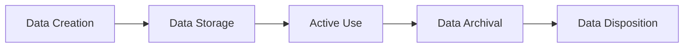

## 11.1 Creation, Storage, Active Use, Archival, and Disposition of Data

The data life cycle underpins how modern organizations govern information assets. Understanding each phase of the data journey—starting from creation and acquisition, through active use and retention, to final deletion—is critical for meeting organizational objectives and compliance obligations. CPAs and other financial professionals must be conversant with data management best practices, confidentiality factors, and regulatory considerations to accurately assess internal controls and advise stakeholders. This section provides a comprehensive exploration of best practices across all data life cycle stages.

Organizations routinely gather and process data spanning clients, employees, financial transactions, and vendor relationships. Properly handling this information reduces operational risk, ensures business continuity, and protects sensitive content. Data governance frameworks such as COBIT 2019, COSO ERM, and industry-specific standards (e.g., GDPR for data privacy, HIPAA for healthcare, PCI DSS for payment card information) all emphasize the need for structured, secure, and well-documented data management. When combined with technology-enabled controls, these frameworks guide effective data handling policies.

Below is a high-level illustration of the typical data life cycle:

In the sections that follow, we examine each phase in detail, including practical real-world scenarios, common pitfalls, and strategies to mitigate risks.

### Data Creation

Data creation is the entry point of the data life cycle. Organizations collect data from numerous sources, such as new customer onboarding forms, point-of-sale systems, enterprise resource planning (ERP) modules, and manual data-entry processes. During this stage, there are critical tasks:

• Establishing Data Quality and Accuracy: Ensuring that data is accurate at entry reduces reconciliation errors and control exceptions later. Validation rules (e.g., required fields, format checks) detect incomplete or erroneous information.  
• Classification and Labeling: Mark each record with a classification (Confidential, Restricted, Public, etc.) before it enters internal systems. This helps define the appropriate security measures and retention requirements.  
• Logging and Traceability: Tag data with source identifiers, timestamps, or user IDs to support future audits or validations. This chain-of-custody approach is vital when responding to compliance inquiries or investigating discrepancies.  

Compliance Concerns  
• GDPR requires user consent and data minimization: Collect only what is necessary.  
• For healthcare providers governed by HIPAA, safeguarding protected health information (PHI) starts at data collection.  
• PCI DSS demands strict controls around creation/transmission of credit card data.  

Real-World Example  
In a retail setting, an online ecommerce platform might collect customer credit card information during the checkout process. At data creation, the system should tokenize or encrypt sensitive card data, removing it as soon as possible (e.g., upon successful authorization) to mitigate risk.

### Data Storage

Once data is created, it must be securely stored in accordance with classification requirements. Storage environments vary, spanning on-premises servers, cloud-based solutions, databases, or offline archives. Best practices in this phase include:

• Secure Configuration: Ensure servers or cloud containers meet the baseline security hardening standards (e.g., encryption at rest, role-based access controls).  
• Redundancy and Backup: Regular backups, stored separately from the primary environment, protect organizations against data loss from hardware failures or cyberattacks.  
• Data Encryption and Key Management: For sensitive and confidential information, encryption keys should be governed by a robust key management system.  
• Lifecycle Tagging: Metadata helps track each record’s retention period or compliance obligations.  

Compliance Concerns  
• GDPR imposes “privacy by design” and “storage limitation” principles, requiring secure storage with minimal retention.  
• PCI DSS dictates that cardholder data should never be stored unencrypted on systems connected to the public internet.  
• Other industry-specific guidelines, such as NIST, prescribe encryption standards and recommended physical security protocols for stored data.  

Real-World Example  
A large financial services firm uses a hybrid cloud arrangement, storing transactional data in a high-availability, on-premises data center while sending cold backups to a cloud-based archive. Data is encrypted at rest using AES-256 and classified under “Confidential” so that any unauthorized retrieval triggers immediate alerts and administrative reviews.

### Active Use

During the active use phase, data supports ongoing operations—ranging from analyzing financial records to generating managerial dashboards and fulfilling customer requests. Ensuring data integrity and security at this stage is essential:

• Access Controls and Authorization: Only personnel with a genuine business need should gain access. Employ multi-factor authentication and role-based privileges to limit opportunities for unauthorized manipulation or disclosure of data.  
• Real-time Monitoring and Anomaly Detection: Implement logging and monitoring solutions (e.g., SIEM software) that identify abnormal access patterns or suspicious data manipulations.  
• Version Control and Change Tracking: For critical records, version control helps track modifications, clarifying who changed content, when they changed it, and why. This capability is invaluable for audits.  
• Confidentiality During Processing: Data in use often resides in memory or intermediate storage. Safeguards such as in-memory encryption (in advanced systems) or ephemeral storage mechanisms can reduce exposure.  

Compliance Concerns  
• For regulated data, ongoing compliance must persist throughout processing. GDPR mandates that users have control over their personal data, including the right to rectify or erase.  
• Sarbanes-Oxley (SOX) emphasis on data integrity extends to systems hosting financial statements data.  
• In healthcare, HIPAA’s Security Rule demands activity logging and usage tracking to detect improper PHI handling.  

Real-World Example  
In an ERP-enabled manufacturing firm, real-time production data streams to managerial dashboards for scheduling decisions. Access is restricted to production supervisors, and a SIEM tool continuously monitors requests for data. Anomalies—like a general user’s attempt to view production metrics—trigger immediate security alerts, protecting trade secrets from internal mishandling or corporate espionage.

### Data Archival

Archiving moves data no longer actively used—but still valuable—from primary storage to lower-cost, less-frequently accessed storage systems. This could include tape backup libraries, cloud-based “cold” storage, or offsite physical archives. Key considerations:

• Retention Policy Alignment: Retain data (including financial records, audit logs, or legal documents) for as long as dictated by compliance and management needs.  
• Archival Integrity: Maintain data in formats that stay usable across evolving technologies. For instance, if data is archived in a proprietary system, ensure future tools can read it.  
• Security Controls on Archived Data: Archived data can contain personal or confidential information. Protect archives with encryption, limit access, and regularly test retrievability.  

Compliance Concerns  
• Financial records retention is often governed by laws like the Securities Exchange Act (for public companies), local tax codes, or the AICPA’s recommendations.  
• GDPR’s “right to be forgotten” introduces complexities: Data that is no longer needed must be anonymized or purged, subject to special legal limitations.  
• HIPAA and other sector-specific laws often require that certain records are retained securely for multiple years, even if no longer in daily operational use.  

Real-World Example  
A CPA firm might archive client tax returns and working papers after finalizing the annual audit or tax cycle. To meet the firm’s internal policy of retaining documents for seven years, these files are encrypted and placed into a write-once-read-many (WORM) archival solution, ensuring data integrity.  

### Data Disposition

Disposition is the final stage of the data life cycle. Properly disposing of data means removing it when it no longer holds business or compliance value. This stage is critical for freeing up resources, mitigating retaining unnecessary information, and adhering to data minimization principles. Best practices:

• Sanitization and Secure Deletion: Overwrite or cryptographically erase data to prevent unauthorized recovery. Simply pressing “delete” or “format” is typically insufficient, especially for confidential data.  
• Compliance Confirmation: Validate that deletion is consistent with all relevant legal, regulatory, and business requirements. Verification mechanisms, such as third-party certificates of destruction, ensure accountability.  
• Chain-of-Custody Documentation: Maintain records of data destruction activities in case of legal inquiries or compliance audits.  

Compliance Concerns  
• GDPR’s “right to erasure” requires organizations to thoroughly remove personal data upon request, with minimal risk of re-identification.  
• Disposal of credit card data under PCI DSS must confirm that no block of memory or storage can be recovered.  
• Various industry regulations treat electronic and physical disposal similarly—paper records containing PII, for instance, must be shredded or pulverized by authorized vendors.  

Real-World Example  
A financial services organization that receives a request from a former client to erase all personal data must ensure that even archived records are scrubbed or anonymized, absent a lawful requirement to keep them. The company implements thorough data sanitization measures while documenting the process to remain auditable.

### Best Practices and Controls Across the Data Life Cycle

Data life cycle management is most effective when supplemented by well-defined governance processes and a strong internal control environment:

• Data Classification Schemes: Consistently apply tiered data classification (e.g., Public, Internal, Confidential, Highly Confidential) throughout the organization to determine handling requirements.  
• Policies and Procedures: Document guidelines for each stage, including standard operating procedures (SOPs) and reference checklists.  
• Employee Training and Awareness: People remain the weak link in data security. Regular, targeted training around phishing, social engineering, data handling, and retention is crucial.  
• Periodic Testing and Audits: Assess compliance with internal policies, bridging gaps quickly. Use external or internal auditors to verify encryption controls, retention schedules, and disposal logs.  
• Technology Solutions: Tools for data discovery, classification, encryption, and monitoring can automate compliance workflows—leading to better oversight.  

### Case Study: A Mid-Sized CPA Firm

Consider a mid-sized CPA firm handling thousands of client financial records annually. To comply with state-level privacy laws (and bolster client trust), the firm invests in:

• A client portal that requires multi-factor authentication for data uploads (Creation).  
• Cloud-based encrypted storage with daily automated backups (Storage).  
• A structured approach to accessing data, restricting usage rights to assigned engagement teams (Active Use).  
• Annual archiving of client documents into a cold-storage environment, retaining them in an encrypted format for seven years (Archival).  
• Automatic disposal notifications triggered after final retention dates, ensuring sanitized deletion upon management approval (Disposition).  

In this scenario, the CPA firm demonstrates a complete life cycle approach. By integrating layered access controls, multi-factor authentication, routine encryption, and timely deletion, the firm mitigates data security risks while complying with professional standards.

### Common Pitfalls and How to Avoid Them

• Neglecting Metadata Policies: Without proper metadata, organizations struggle to track data ownership, classification, or retention obligations.  
• Over-retaining Data: Storing data beyond its useful life can cause hidden liabilities, especially if a breach happens or if there is a legal request for discovery.  
• Insufficient Auditing: Failing to log or monitor access leaves significant blind spots.  
• Poor Key Management: Losing control of encryption keys renders data inaccessible—or worse, accessible to unintended parties.  
• Inadequate Disposal Verification: Simple file deletion is not secure. Use secure wiping or destruction methods.

### Conclusion

Data management is not merely an IT concern: it intersects with governance, risk management, and compliance objectives entrusted to CPAs and financial professionals. Each stage of the data life cycle—from creation to final disposition—carries unique responsibilities for maintaining data accuracy, security, and privacy. Through stringent policies, robust technical controls, and consistent oversight, organizations can significantly reduce the risk of data loss, privacy violations, and financial misstatements.

By understanding the intricacies of data creation, storage, active use, archival, and disposition, CPAs can more effectively plan and assess controls, advise on data governance frameworks, and guide businesses toward responsible data practices. This holistic approach ensures alignment with the modern demands of regulatory compliance, stakeholder trust, and operational excellence.

-------------------------------------------------------------------------------------

## Test Your Knowledge: Data Life Cycle Management Quiz



### During the data creation phase, which control helps ensure that records are accurate at their initial entry point?

- [x] Validation rules to detect incomplete or erroneous data
- [ ] Regularly scheduled data wipes
- [ ] Encryption keys stored on-premises
- [ ] Data warehousing

> **Explanation:** Validation rules at data entry ensure accuracy and completeness, reducing the risk of human error and incomplete data.

### Which of the following best describes a key consideration when storing data according to classification requirements?

- [x] Encryption at rest and layered access control
- [ ] Eliminating all user profiles to streamline access
- [ ] Using unencrypted backups for cost efficiency
- [ ] Prohibiting all external vendor involvement

> **Explanation:** Encrypting sensitive data at rest, applying robust access controls, and following secure backup practices align with classification requirements and compliance standards.

### What is the main purpose of role-based access control (RBAC) during the active use phase?

- [x] Restricting data access to personnel with a legitimate business need
- [ ] Alerting the CEO about every login attempt
- [ ] Sending automatic marketing emails to employees
- [ ] Decreasing the costs of cybersecurity insurance premiums

> **Explanation:** RBAC ensures only authorized individuals can modify or view data, preserving confidentiality and integrity.

### Archiving data involves moving information to lower-cost or offline storage primarily to:

- [x] Retain important records not in daily operational use
- [ ] Speed up data creation processes
- [ ] Replace older operational systems
- [ ] Eliminate the need to monitor access controls

> **Explanation:** Archiving retains data that must be kept for compliance or historical insight while minimizing storage costs and performance demands on production systems.

### Which compliance requirement specifically introduces a “right to be forgotten” that compels organizations to delete personal data upon request?

- [x] GDPR
- [ ] HIPAA
- [x] GDPR
- [ ] PCI DSS

> **Explanation:** The General Data Protection Regulation (GDPR) grants individuals the right to request that organizations erase their personal data under certain conditions.

### In the data disposition stage, which action most effectively prevents discarded data from being recovered?

- [x] Securely overwriting or cryptographically erasing data
- [ ] Relabeling data as dormant
- [ ] Copying data to a new server
- [ ] Using default operating system deletion tools only

> **Explanation:** Secure overwriting or cryptographic erasure ensures data is irretrievable, which is important for compliance and data security.

### What is a best practice for ensuring future readability of archived data?

- [x] Maintaining data in flexible, commonly used formats
- [ ] Stripping all metadata from stored files
- [x] Maintaining data in flexible, commonly used formats
- [ ] Immediately compressing files to reduce size

> **Explanation:** Using standardized or well-documented file formats ensures that data will remain accessible in the face of evolving technologies.

### Why is documenting the chain-of-custody for data destruction important?

- [x] It helps maintain audit trails and prove compliance
- [ ] It allows unauthorized personnel to reverse any deletions
- [ ] It permits indefinite storage of personal data
- [ ] It sanitizes used hardware automatically

> **Explanation:** Documenting the destruction process verifies that sensitive data was disposed of according to policy, offering proof in legal or regulatory examinations.

### How do multi-factor authentication (MFA) and role-based privileges interact to protect data during active use?

- [x] MFA confirms user identity, and role-based privileges restrict the scope of data access
- [ ] MFA replaces logs, and role-based privileges store encryption keys
- [ ] MFA automatically deletes data, and role-based privileges create new credentials
- [ ] MFA validates data creation, and role-based privileges degrade data classification

> **Explanation:** MFA ensures that only legitimate users can log in, and role-based privileges limit the user’s access to data according to their role or responsibilities.

### True or False: Over-retaining data can increase an organization’s risks because it may be subject to broader discovery requests and potential breaches.

- [x] True
- [ ] False

> **Explanation:** Retaining data longer than necessary can heighten legal exposure and cybersecurity risks, making it a best practice to dispose of data once it is no longer needed.



-------------------------------------------------------------------------------------

## For Additional Practice and Deeper Preparation

### [Information Systems and Controls (ISC)](https://www.udemy.com/course/isc-cpa-mock-exams/?referralCode=E1217303222935C5E464)

**Information Systems and Controls (ISC) CPA Mocks:** 6 Full (1,500 Qs), Harder Than Real! In-Depth & Clear. Crush With Confidence!

- Tackle full-length mock exams designed to mirror real ISC questions.  
- Refine your exam-day strategies with detailed, step-by-step solutions for every scenario.  
- Explore in-depth rationales that reinforce higher-level concepts, giving you an edge on test day.  
- Boost confidence and minimize anxiety by mastering every corner of the ISC blueprint.  
- Perfect for those seeking exceptionally hard mocks and real-world readiness.  

_Disclaimer: This course is not endorsed by or affiliated with the AICPA, NASBA, or any official CPA Examination authority. All content is for educational and preparatory purposes only._
