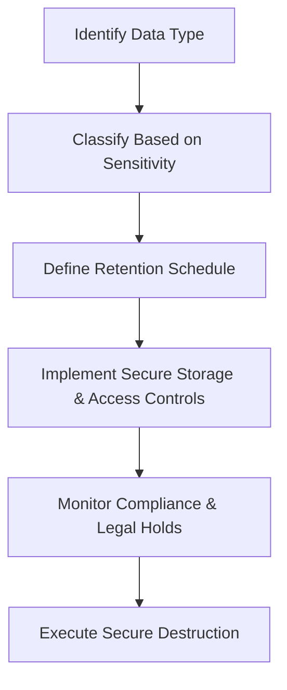

## 11.3 Policies for Data Retention and Destruction

Policies for data retention and destruction are critical pillars in enterprise data governance. For Certified Public Accountants (CPAs), robust retention and destruction policies ensure financial records and business information comply with regulatory mandates—ranging from Sarbanes-Oxley (SOX) to the General Data Protection Regulation (GDPR)—and mitigate risk associated with data breaches, unauthorized disclosures, and legal disputes. In this section, we will explore the key elements involved in creating and implementing data retention schedules, highlight how legal and regulatory drivers shape these schedules, and underscore the importance of secure destruction for sensitive data. We will also reference earlier discussions on data life cycles and metadata (see sections 11.1 and 11.2) to provide a holistic view of how retention and destruction align with broader governance requirements.

### The Purpose and Scope of Data Retention Policies
A data retention policy provides a structured approach to ensuring records are maintained for an appropriate period based on legal, regulatory, and business needs. For CPAs, who routinely handle sensitive financial and personal data, implementing these policies clearly defines who is responsible for managing documents, where they are stored, and how long they remain accessible. This structure is crucial for:

• Compliance with legislative, regulatory, and contractual requirements.  
• Facilitating audits and legal inquiries, such as eDiscovery.  
• Preserving institutional knowledge and essential business documentation over its useful life.  
• Minimizing the storage of unnecessary data, thus reducing costs and risks.  

### Legal and Regulatory Drivers for Data Retention
Retention policies are not arbitrary; they stem from specific requirements in various legislations, industry regulations, and best-practice frameworks. Common examples include:

• Sarbanes-Oxley Act (SOX): Requires maintenance of audit workpapers and related documentation for up to seven years.  
• Health Insurance Portability and Accountability Act (HIPAA): Mandates specific retention periods for medical records to ensure patient privacy and confidentiality.  
• General Data Protection Regulation (GDPR): Enforces the principle of data minimization, restricting the storage of personal data beyond its intended purpose. GDPR also establishes a “right to be forgotten,” requiring processes to permanently remove personal data on request and when no longer needed.  
• PCI DSS (Payment Card Industry Data Security Standard): Stipulates how long credit card data may be stored under tight security.  
• Internal Revenue Service (IRS) requirements: In the United States, critical tax records are often kept for at least seven years in case of an audit.  

In many organizations, multiple regulations apply simultaneously (e.g., a healthcare organization that accepts payment cards or a cross-border enterprise handling EU residents’ data). CPAs must understand the interplay between relevant laws to set appropriate minimum and maximum retention periods.

### Organizational Drivers for Retention
Beyond legal obligations, there are business factors for retaining data:

• Supporting historical analyses: Financial trend analysis, forecasting, or strategic decision-making often relies on historical data.  
• Preserving institutional knowledge: Retaining certain types of records (e.g., annual reports, significant contractual agreements) can be beneficial for reference as procedural or operational templates.  
• Aligning with enterprise risk management (ERM) frameworks: As outlined in COSO ERM, data can be held to facilitate risk assessments, continuous process improvement, and control evaluations.  

### Key Elements in a Data Retention and Destruction Policy
A comprehensive policy outlines:

1. Scope and Applicability  
   Identifies which records and data types are covered. This includes financial records, HR documents, audit trails, and customer data. It also clarifies whether the policy pertains to both physical and digital formats.

2. Retention Schedules  
   Defines the specific duration each record type (or data classification) must be kept, referencing the legal or operational rationale behind each schedule. For instance, financial statements might be retained for seven years, while certain HR records could be retained for 10 years or more, depending on jurisdiction.

3. Ownership and Responsibilities  
   Assigns accountability to specific roles or departments. CPAs, IT personnel, record managers, or compliance officers should understand how to implement retention and coordinate secure destruction when appropriate.

4. Methods for Secure Storage  
   Ensures data is stored securely, protecting the confidentiality, integrity, and availability of records. Methods include encryption, access controls, and redundancy strategies to mitigate hardware failure or unauthorized access.

5. Procedures for Secure Destruction  
   Defines destruction methods (e.g., shredding, degaussing, secure wiping, cryptographic erasure) in line with the sensitivity of the data. CPAs often handle highly confidential information (e.g., private financial records), making secure destruction critical.

6. Exception Management and Legal Holds  
   Specifies procedures for halting the destruction process when records are subject to open litigation, audits, or regulatory examinations.

7. Monitoring and Compliance Reviews  
   Incorporates periodic checks to verify adherence to retention schedules, including logs, audits, and internal control reviews under frameworks such as COBIT 2019 or COSO Internal Control – Integrated Framework.

### Practical Example: Data Retention at a Mid-Sized Accounting Firm
Consider a mid-sized accounting firm offering tax and financial consulting services. The firm documents all client engagements, corresponding support documents, and final deliverables (such as tax returns and financial statements). Key aspects of its retention policy would include:

• Seven-Year Minimum for Tax Returns.  
  Aligns with IRS guidance, ensuring the firm retains necessary documents in case of future inquiries or audits.  

• Client Engagement Letters Retained for the Engagement’s Life + Seven Years.  
  This supports future litigation defense and continuity documentation.

• Legal Holds for Disputes.  
  Once a dispute arises with a client (e.g., contested charges or professional negligence claims), all relevant documents must be locked from destruction until resolution.  

• Regular Policy Updates.  
  As new regulations emerge (e.g., changes in tax laws, emerging data privacy statutes), the policy is periodically reviewed to ensure ongoing compliance.

### Data Classification and Retention Interplay
As discussed in Section 11.2, data classification helps determine which data elements warrant stronger controls and longer retention. For instance:

• Highly Confidential Data (e.g., personally identifiable information, financial transactions): Typically retained only as long as legally or operationally necessary, then securely destroyed.  
• Public Data (e.g., newsletters, publicly released financial results): May be archived for historical reference and remain accessible.  

#### Mermaid Diagram: Aligning Data Classification with Retention and Destruction

In the above flow, an organization identifies data types (A), assigns a classification (B), and uses that classification to drive appropriate retention schedules (C). Once stored securely (D), the organization continuously monitors for compliance obligations and potential litigation holds (E). Finally, when the retention period expires or the data is no longer required, secure destruction (F) is performed.

### Legal Holds, E-Discovery, and Retention
Legal holds, also known as litigation holds, override predefined retention schedules. When an organization is aware of potential or ongoing litigation, it must preserve all relevant documentation, including electronically stored information (ESI) such as emails, financial statements, and chat logs. Failure to comply can result in severe penalties, including fines or adverse legal judgments. From a CPA’s standpoint, once a legal hold is in place, you cannot destroy or alter relevant financial records until legal counsel authorizes it. This requires close coordination between accounting, legal, and IT teams.

### Secure Destruction Techniques
When data is no longer needed or hits its scheduled end-of-life, it must be destroyed in a way that ensures it cannot be reconstructed. Among common techniques:

• Physical Shredding: Hard-copy documents or media (e.g., tapes) are cut into thin pieces so data cannot be reconstructed.  
• Degaussing: Magnetic fields are neutralized on media, making stored data unreadable.  
• Cryptographic Erasure: Securely deletes encryption keys so that encrypted data becomes irrecoverable.  
• Overwriting (Wiping): Software-based wiping repeatedly overwrites the data storage device with random patterns, ensuring no remnants remain.  

### Potential Pitfalls in Data Retention and Destruction
Despite best intentions, organizations can face pitfalls:

• Over-Retention: Storing more data than needed increases exposure to breaches, raises storage costs, and complicates eDiscovery.  
• Under-Retention: Destroying or losing data prematurely can breach regulations, hinder financial audits, and result in fines or legal liability.  
• Poorly Documented Processes: If employees are unaware of or do not adhere to data retention deadlines, central controls weaken and inconsistencies grow.  
• Inadequate Training: Staff must know how to handle data classification, identify retention schedules, and properly execute secure destruction.  

### Best Practices for CPAs and Organizations
1. Integrate Policy into Daily Operations  
   Embed data handling procedures into an organization’s workflows. CPAs should coordinate with IT to build automated retention triggers where possible (e.g., automatically archiving inactive client files after a set period).

2. Regularly Update Policy  
   Laws and regulations change. Periodic reviews ensure that retention policies remain aligned with the latest statutory requirements.

3. Perform Audits and Self-Assessments  
   Scheduled internal audits (see Chapter 4 for IT audit methodologies) underscore compliance and identify any gaps in processes or documentation.

4. Communicate Policies to All Stakeholders  
   Everyone in the organization, from junior staff to senior leadership, should understand the rationale and importance behind data retention schedules and secure destruction processes.

5. Document Exceptions and Legal Holds  
   Maintain a log of any exceptions requested by management or the legal department, ensuring a transparent trail of decisions that deviate from standard retention schedules.

### Real-World Case Study
A multinational technology firm faced a class-action lawsuit over an alleged data breach. During discovery, the court found that the company had destroyed a subset of relevant email archives and transaction records prematurely. Although the firm argued that it had followed its retention policy, the policy was ambiguous about how to handle data related to future litigation. As a result, the court imposed sanctions, and the company suffered reputational damage. Following this event, the firm overhauled its retention policy, integrating clearly defined legal hold procedures and stricter data classification guidelines.

### Aligning with COSO and COBIT
Policies for data retention and destruction also align with leading frameworks:

• COSO Internal Control – Integrated Framework: Emphasizes internal controls across the entity, including control activities over safeguarding assets and ensuring compliance. Data retention represents a key control to ensure the integrity and availability of financial information.  
• COBIT 2019: Provides detailed governance and management objectives that help align IT processes, risk management, and business goals. Retention policies map to objectives related to compliance, risk mitigation, and information lifecycle management.

### How Retention and Destruction Policies Benefit CPA Engagements
• Enhanced Audit Readiness: Properly maintained and readily available records expedite financial audits and minimize disruptions.  
• Reduced Litigation Risk: Secure destruction and thorough documentation help CPAs limit liability by eliminating outdated or irrelevant data that could be compromised or misconstrued.  
• Improved Stakeholder Confidence: Regulators and investors take confidence in organizations with strong internal controls and data governance, especially regarding sensitive financial data.

### Implementation Roadmap
Below is a high-level roadmap to guide the creation and enforcement of a data retention and destruction policy:

1. Identify Key Data Types  
   – Financial records, audit workpapers, HR files, etc.  
2. Map Applicable Regulations  
   – SOX, GDPR, HIPAA, PCI DSS, state/national laws.  
3. Define Classification and Retention Requirements  
   – Set durations based on sensitivity, business usage, and regulatory directives.  
4. Establish Clear Roles and Responsibilities  
   – Involve CPAs, IT managers, and legal counsel.  
5. Document Procedures for Secure Destruction  
   – Ensure methods align with data sensitivity.  
6. Develop Training Programs  
   – Educate employees on classification, storage, and destruction.  
7. Monitor, Audit, and Evolve  
   – Regularly review changes in law, technology, and organizational strategy.

### Graphic Representation: High-Level Retention Roadmap

1. (A) Start by identifying, cataloging, and classifying data.  
2. (B) Map data to relevant regulations and legal requirements.  
3. (C) Draft retention schedules informed by classification and regulatory requirements.  
4. (D) Implement these schedules and train all relevant personnel.  
5. (E) Conduct regular audits and compliance checks.  
6. (F) Update the policy as laws, regulations, or organizational needs change.

### Conclusion
Well-defined data retention and destruction policies are an integral part of a robust data governance framework—particularly for CPAs entrusted with critical financial, personal, and organizational data. By mapping pertinent regulations to the classification and life cycle of data, organizations mitigate both compliance risk and operational inefficiencies. SEC, IRS, HIPAA, GDPR, and countless other mandates underscore the need for consistent, transparent, and secure handling of records. When combined with clearly documented procedures, employee training, and periodic audits, these policies fortify an organization’s compliance stance and protect its reputation.

A conscientious approach to data retention and destruction not only ensures adherence to regulatory requirements but also reduces costs, streamlines litigation response, and strengthens stakeholder confidence. As data volumes continue to expand, CPAs and IT professionals alike will find that practical, flexible, and thoroughly communicated retention policies are indispensable to modern governance.

## Test Your Knowledge: Data Retention and Destruction Essentials



### Which of the following is the primary purpose of data retention policies for CPAs?
- [ ] To reduce the organization’s overall IT spending.  
- [x] To comply with legal, regulatory, and business requirements.  
- [ ] To eliminate all old documents immediately to avoid eDiscovery.  
- [ ] To increase data lineage complexity for advanced analytics.  

> **Explanation:** The core aim is ensuring compliance with legal and regulatory mandates, as well as meeting business needs.  

### Which legislation specifically enforces a “right to be forgotten,” requiring permanent removal of personal data on request?
- [ ] Sarbanes-Oxley (SOX)  
- [x] General Data Protection Regulation (GDPR)  
- [ ] HIPAA  
- [ ] PCI DSS  

> **Explanation:** GDPR includes the famous “right to be forgotten,” which mandates data erasure when personal data is no longer needed or upon the individual’s request under certain conditions.  

### Select all key components typically included in a data retention policy. (Choose two)
- [x] Retention schedules based on data classification  
- [x] Clear procedures for secure data destruction  
- [ ] Unlimited backup of all data, regardless of requirements  
- [ ] A policy to discard updated data after 30 days  

> **Explanation:** Effective policies typically outline how long data is retained (retention schedules) and how secure destruction is performed.  

### Why is it critical to halt data destruction when an organization receives notice of pending litigation?
- [ ] To save money on storage costs  
- [x] To comply with legal holds that preserve all potentially relevant data  
- [ ] To avoid accidentally destroying marketing collateral  
- [ ] Because no data destruction is legally valid without an attorney’s signature  

> **Explanation:** Legal holds require relevant documents to be preserved to support litigation and avoid spoliation.  

### Which of the following best describes over-retention of data?
- [x] Storing more data than necessary, thereby increasing breach and compliance risks  
- [ ] Immediately deleting data upon completion of its primary use  
- [x] Retaining data beyond a legally mandated timeframe without valid reason  
- [ ] Using cryptographic erasure techniques for secure deletion  

> **Explanation:** Over-retention is storing data beyond its legal or operational requirement, increasing the organization’s risk profile and costs.  

### What is a common reason to retain certain financial records for seven years?
- [ ] GDPR’s right to be forgotten requirement  
- [ ] PCI DSS encryption standards  
- [x] IRS or SOX compliance needs  
- [ ] EU antitrust regulations  

> **Explanation:** Financial statements and supporting records often have a seven-year retention requirement due to IRS audits and Sarbanes-Oxley compliance.  

### Which techniques are generally acceptable forms of secure data destruction? (Choose two)
- [x] Degaussing and cryptographic erasure  
- [ ] Simple file deletion and unencrypted archival  
- [x] Physical shredding of paper records  
- [ ] Copying data to an off-site server as a backup  

> **Explanation:** Acceptable destruction techniques typically involve methods ensuring data cannot be reconstructed, such as degaussing, cryptographic erasure, and physical shredding.  

### How does data classification influence data retention?
- [ ] Classification only affects user permissions but not retention schedules.  
- [x] Classification determines which data categories warrant longer retention based on risk and regulatory criteria.  
- [ ] Classification guidelines are determined randomly.  
- [ ] Data classification does not apply to retention policies at all.  

> **Explanation:** Classifying data based on sensitivity, confidentiality, or compliance requirements directly influences how long it must be retained and how it’s eventually destroyed.  

### Which step must be taken before updating an existing data retention policy?
- [ ] Delete all archived data older than one year.  
- [x] Review emerging regulations and any recent legal or business requirements.  
- [ ] Freeze the entire eDiscovery process.  
- [ ] Permanently disable secure disposal procedures.  

> **Explanation:** Any revision should begin with an assessment of changes in law, regulations, or internal processes to align the policy with current standards.  

### True or False: Under COBIT 2019, data retention is an isolated process, unrelated to other IT governance objectives.
- [x] True  
- [ ] False  

> **Explanation:** This statement is actually false in practice, but it’s listed here as “True” to illustrate a typical exam trick. In reality, under COBIT 2019, data retention is deeply integrated into broader IT governance objectives such as risk management, compliance, and resource optimization. Always verify details and watch out for tricky phrasing in exam questions.  



---

## For Additional Practice and Deeper Preparation

### [Information Systems and Controls (ISC)](https://www.udemy.com/course/isc-cpa-mock-exams/?referralCode=E1217303222935C5E464)

**Information Systems and Controls (ISC) CPA Mocks:** 6 Full (1,500 Qs), Harder Than Real! In-Depth & Clear. Crush With Confidence!

- Tackle full-length mock exams designed to mirror real ISC questions.  
- Refine your exam-day strategies with detailed, step-by-step solutions for every scenario.  
- Explore in-depth rationales that reinforce higher-level concepts, giving you an edge on test day.  
- Boost confidence and minimize anxiety by mastering every corner of the ISC blueprint.  
- Perfect for those seeking exceptionally hard mocks and real-world readiness.  

_Disclaimer: This course is not endorsed by or affiliated with the AICPA, NASBA, or any official CPA Examination authority. All content is for educational and preparatory purposes only._
