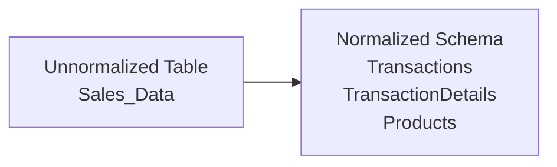

## 12.1 Relational Databases, Schemas, and Normalization

Relational databases are the backbone of many corporate information systems, including Enterprise Resource Planning (ERP) platforms and various accounting information systems. A robust understanding of relational database principles—particularly schemas and normalization—is critical for CPAs, auditors, and IT professionals who evaluate, design, or interact with financial data structures. Equally important is understanding how well-designed relational databases can enhance data integrity, reduce redundancy, and support compliance with regulatory requirements. In this section, we explore how relational databases work, what database schemas entail, and how normalization helps create efficient data models that are both logically consistent and capable of safeguarding data quality.

--------------------------------------------------------------------------------

## Overview of Relational Databases

A relational database organizes data into tables (also called relations), each composed of rows and columns. This model is attributed to Edgar F. Codd, who introduced the relational model in the 1970s. At their core, relational databases rely on well-defined relationships among data items:

• Rows (Records/Tuples): Each row within a table represents a single record in the dataset, such as a single transaction, customer account, or product line item.  
• Columns (Attributes/Fields): Each column in a table captures a specific characteristic of a record. Examples include Customer_ID, Transaction_Date, and Amount.  
• Primary Keys (PK): A primary key is a column (or set of columns) whose values uniquely identify each row in a table (e.g., invoice number).  
• Foreign Keys (FK): A foreign key is a column (or set of columns) in one table that references the primary key of another table, thus creating relationships between tables.  

By storing data in carefully defined tables, relational databases make it easier to retrieve, modify, and maintain records while minimizing redundancy—a key advantage over poorly structured file systems or unnormalized data repositories.

### Real-World Relevance for CPAs and Auditors
• Financial Data Assurance: Relational databases support accurate financial records by enforcing referential integrity (e.g., each invoice must be linked to a valid customer) and consistent data entry rules.  
• Streamlined Reporting: Structured data models enable easier generation of standardized financial statements, compliance reports, and ad hoc analyses.  
• Internal Control and Audit Trails: Built-in features such as constraints and transaction logs facilitate compliance, internal control monitoring, and audit readiness—topics frequently examined in engagements involving IT controls (refer to Chapter 4: Key Concepts of IT Audit and Assurance).

--------------------------------------------------------------------------------

## Understanding Database Schemas

A database schema is the “blueprint” or overarching structure that dictates how data is organized and how different tables relate to one another. It defines:

• The tables in the database.  
• Columns or attributes each table will contain, including data types (e.g., INT, CHAR, DECIMAL).  
• Primary keys, foreign keys, and other constraints (e.g., NOT NULL, CHECK constraints).  
• Views, indexes, and stored procedures (for some systems).  

### Logical vs. Physical Schemas
• Logical Schema: Describes how data is organized conceptually—what tables, columns, and relationships exist. This is where normalization rules (1NF, 2NF, 3NF) primarily apply.  
• Physical Schema: Specifies how data is stored on disk or in memory, including file organization, partitioning, or indexing. While a physical schema can impact performance, it does not typically alter the logical structure or relationships.

### Advantages of Clear, Documented Schemas
• Consistency: Ensures all stakeholders (developers, auditors, data analysts) can uniformly interpret the data structure.  
• Enhanced Governance: Simplifies applying compliance measures, such as data retention policies and access control frameworks, aligning with Section 11.1 Data Life Cycle and Governance.  
• Streamlined Collaborations: Reduces errors and misunderstandings among multi-disciplinary teams (e.g., finance, IT, external auditors).

--------------------------------------------------------------------------------

## Introduction to Normalization

Normalization is the systematic process of organizing data in a relational database to reduce redundancy and improve data integrity. By dividing a large, unstructured table into smaller, well-structured tables and defining relationships between them, normalization mitigates:

• Update Anomalies: Inconsistency when modifying data that appears in multiple places.  
• Insert Anomalies: Difficulty adding new records when data is either incomplete or depends on another nonexistent record.  
• Delete Anomalies: Accidental or unintended data loss when deleting a record that shares data fields with other records.

The primary normal forms are:

1. First Normal Form (1NF): Eliminate repeating groups/arrays; ensure each column has atomic (indivisible) values.  
2. Second Normal Form (2NF): Ensure every non-key column is fully dependent on the entire primary key. (Only applies when there is a composite primary key.)  
3. Third Normal Form (3NF): Eliminate transitive dependencies, so that non-key columns depend only on the primary key and not on other non-key attributes.

While there are higher normal forms such as Boyce-Codd Normal Form (BCNF), 4NF, and 5NF, auditing contexts typically center around 1NF, 2NF, and 3NF for ensuring data integrity in typical corporate systems.

### Functional Dependencies
Normalization rules hinge on the concept of functional dependencies. In simple terms, a column X functionally determines column Y (expressed as:
  
  $X \rightarrow Y$
  
) if the value of X uniquely identifies the value of Y within the table. The alignment of functional dependencies according to normal forms ensures a stable, anomaly-free design.

--------------------------------------------------------------------------------

## Step-by-Step Normalization Example

Below is a condensed illustration of how an initial unnormalized table might evolve through normalization steps. While such examples can vary, the following scenario uses a simplified sales data framework frequently encountered in accounting systems.

### Unnormalized Table (Sales_Data)

Imagine a single table called Sales_Data that records each sales transaction. It might look like this:

| TransactionID | CustomerName | CustomerEmail        | ProductID | ProductName | UnitPrice | QuantityPurchased | OrderDate   |
|--------------:|:------------:|:--------------------:|:---------:|:-----------:|:---------:|:----------------:|:-----------:|
| 1001          | Alice Martin | alice@domain.com     | P101      | Copier      | 200       | 2                | 2025-01-15  |
| 1002          | Bob White    | bob@domain.com       | P102      | Printer     | 150       | 1                | 2025-01-15  |
| 1003          | Alice Martin | alice@domain.com     | P103      | Scanner     | 100       | 2                | 2025-01-16  |
| 1004          | Charlie Gray | charlie@domain.com   | P101      | Copier      | 200       | 1                | 2025-01-16  |

Here, multiple data elements (e.g., customer email, product name, unit price) are repeated. Redundancies can lead to update anomalies (changing “alice@domain.com” requires updating multiple rows), insert anomalies (cannot add a new product without creating a transaction record), and delete anomalies (removing a transaction might eliminate needed product or customer information).

### First Normal Form (1NF)

1NF requires:  
• Atomic column values (no repeating or nested fields).  
• Each record is uniquely identifiable (often by a primary key).

In the example, each column already appears to hold atomic values. However, the single table approach lumps together data about customers, products, and transactions into one entity. Still, as a minimal criterion for 1NF, the table meets the requirement of having each column hold atomic data. You might designate TransactionID as the primary key.

But you typically move toward separate tables to manage repeated attributes. At this stage, you might extract repeating groups into separate rows, ensuring no multi-valued attributes. Let’s assume each row remains strictly one product per row. So our table can qualify for 1NF, but it’s still not ideal.

### Second Normal Form (2NF)

2NF applies to tables with a composite primary key—e.g., if the primary key were (TransactionID, ProductID). A table violates 2NF if any non-key attribute depends only on part of that composite key.

In the current scenario, let’s assume we treat (TransactionID, ProductID) as our composite key. Then examine dependencies:  
• CustomerName and CustomerEmail depend only on TransactionID, but not on ProductID.  
• ProductName and UnitPrice depend only on ProductID, but not on TransactionID.  
• QuantityPurchased depends on both TransactionID and ProductID because it links a particular purchase quantity to a specific transaction-product combination.

To satisfy 2NF, we must remove partial dependencies so that all non-key attributes fully depend on the entire primary key. Hence, we split out the table into two new tables, focusing on the concept that one table captures “Transaction-level” attributes and the other captures “Product-level” attributes in the context of a transaction:

• Transactions Table  

| TransactionID (PK) | CustomerName | CustomerEmail        | OrderDate   |
|--------------------:|:------------:|:--------------------:|:-----------:|
| 1001                | Alice Martin | alice@domain.com     | 2025-01-15  |
| 1002                | Bob White    | bob@domain.com       | 2025-01-15  |
| 1003                | Alice Martin | alice@domain.com     | 2025-01-16  |
| 1004                | Charlie Gray | charlie@domain.com   | 2025-01-16  |  

• TransactionDetails Table  

| TransactionID (PK-part) | ProductID (PK-part) | ProductName | UnitPrice | QuantityPurchased |
|-------------------------:|:-------------------:|:-----------:|:---------:|:-----------------:|
| 1001                     | P101               | Copier      | 200       | 2                |
| 1002                     | P102               | Printer     | 150       | 1                |
| 1003                     | P103               | Scanner     | 100       | 2                |
| 1004                     | P101               | Copier      | 200       | 1                |

Now, each non-key attribute depends on both parts of the composite key in TransactionDetails (TransactionID, ProductID)—or purely on TransactionID in the Transactions table.

### Third Normal Form (3NF)

3NF addresses transitive dependencies—where non-key attributes depend on other non-key attributes rather than only on the primary key.

Notice in TransactionDetails, ProductName and UnitPrice are functionally dependent on ProductID, which is part of the composite key. While that’s acceptable in 2NF, we might consider whether to separate product information into its own table if the product details can change independently of the transaction:

• Products Table  

| ProductID (PK) | ProductName | UnitPrice |
|---------------:|:-----------:|:---------:|
| P101           | Copier      | 200       |
| P102           | Printer     | 150       |
| P103           | Scanner     | 100       |

• TransactionDetails Table (Revised)  

| TransactionID (PK-part) | ProductID (PK-part) | QuantityPurchased |
|-------------------------:|:-------------------:|:-----------------:|
| 1001                     | P101               | 2                |
| 1002                     | P102               | 1                |
| 1003                     | P103               | 2                |
| 1004                     | P101               | 1                |

We have removed transitive dependency between ProductID → ProductName, UnitPrice from TransactionDetails. Thus:

• Transactions table holds attributes that depend only on TransactionID.  
• Products table holds attributes that depend only on ProductID.  
• TransactionDetails ties them together to indicate which product was sold on which transaction, and in what quantity.

In 3NF, all non-key columns must depend solely on the primary key (or in composite key situations, the entire composite key) without involving transitive relationships. This new design ensures data consistency, prevents anomalies, and generally aligns with best practices for many accounting and ERP solutions.

### A Simple Entity-Relationship (ER) Overview

Below is a simplified Mermaid.js flowchart depicting the conceptual movement from an unnormalized table (left) to normalized tables (right):

> Note: In more complex systems, you might also have a Customers table to store customer details, thereby removing repeated attributes such as CustomerName and CustomerEmail from the Transactions table.

--------------------------------------------------------------------------------

## Balancing Performance and Complexity

Although normalization offers clear benefits, such as reducing data anomalies and improving data integrity, there is a key trade-off to consider:

- Higher Normalization:  
  • Benefits: Less redundancy, higher data integrity, reduced update anomalies.  
  • Drawback: Retrieving data from multiple tables often requires JOIN operations, potentially impacting system performance—especially in environments with large volumes of transactions or complex queries.

- Lower Normalization (or Denormalization):  
  • Benefits: Fewer table joins can lead to faster read performance, beneficial for analytical querying and data warehousing.  
  • Drawback: Greater redundancy can lead to more anomalies, increased storage requirements, and more complex update operations.

Many modern ERP systems (see Chapter 6) leverage a hybrid approach, maintaining normalized structures for day-to-day transaction processing (Online Transaction Processing, OLTP) and implementing carefully selected denormalizations or star-schemas in data warehouses for faster reporting (Online Analytical Processing, OLAP). The appropriate balance depends on the organization’s operational needs, transaction volumes, and existing IT infrastructure.

--------------------------------------------------------------------------------

## Best Practices, Pitfalls, and Real-World Scenarios

• Thorough Analysis of Functional Dependencies: To properly normalize a database, first identify all functional dependencies. Missing a dependency leads to partial or transitive anomalies that degrade reliability.  
• Watch Out for Over-Normalization: Over-engineering the schema can lead to too many tables, forcing complicated multi-table joins. This can hamper reporting speed.  
• Periodic Reviews and Data Governance: As the business evolves, new attributes, new tables, and revised relationships may be required. A robust data governance framework (Chapter 11) should enforce periodic schema evaluations.  
• Integration with Legacy Systems: Mergers and acquisitions often introduce legacy systems that are unnormalized or use different database paradigms. Auditors and CPAs must remain vigilant about data inconsistencies when migrating or consolidating data.  
• Monitoring Changes in Vendor Master Data: For instance, if product descriptions or pricing data is repeated in multiple systems, failing to isolate product information in a dedicated table can lead to mispricing or incomplete financial statements.

--------------------------------------------------------------------------------

## Further Reading and References

• Elmasri, R. & Navathe, S. B. (2015). Fundamentals of Database Systems. Pearson.  
• Coronel, C., Morris, S., & Rob, P. (2021). Database Systems: Design, Implementation, & Management. Cengage Learning.  
• AICPA. (2021). Guide to Data Analytics – offers insights into data handling and ensures compliance across varying regulatory frameworks.

Normalization is a powerful method for structuring data and ensuring its long-term quality and integrity. In the chapters ahead, we delve deeper into advanced database topics, including SQL commands (Chapter 12.2) and data governance (Chapter 11), which all rely on a solid understanding of relational models and well-designed schemas.

--------------------------------------------------------------------------------

## Test Your Knowledge: Relational Database Normalization and Schemas



### In a relational database, how is data primarily organized?

- [x] Data is organized into tables containing rows and columns.
- [ ] Data is stored in flat text files with no defined structure.
- [ ] Data is stored as documents that contain nested objects and arrays by default.
- [ ] Data is accessed only through hierarchical pointers.

> **Explanation:** The fundamental concept in a relational database is storing data in tables (relations) made up of rows (records) and columns (fields).

### What is the main goal of normalization in database design?

- [ ] Improving the database’s physical storage layout.
- [ ] Reducing query execution speed at all costs.
- [x] Eliminating data redundancy and preventing update anomalies.
- [ ] Merging multiple disparate databases into a single database.

> **Explanation:** Normalization focuses on reducing redundancy and anomalies by logically restructuring table relationships and removing partial or transitive dependencies.

### Which of the following accurately describes a primary key in a relational table?

- [x] A field or set of fields that uniquely identifies each row in a table.
- [ ] A field used strictly for referencing external systems.
- [ ] A randomly generated integer used only for testing.
- [ ] A set of fields that store identical values across different rows.

> **Explanation:** A primary key guarantees uniqueness and is critical for differentiating records in a relational table.

### In the context of normalization, what does “1NF” require?

- [ ] That every non-key attribute depends on the entire primary key.
- [ ] That no table contain more than 10 columns.
- [x] That each column holds atomic (indivisible) values and no repeating groups.
- [ ] That all foreign keys must be integers.

> **Explanation:** First Normal Form (1NF) ensures there are no repeated columns and that all column values are atomic.

### Which statement best describes the difference between 2NF and 3NF?

- [x] 2NF eliminates partial dependencies on a composite key, while 3NF eliminates transitive dependencies among non-key attributes.
- [ ] 2NF requires a single primary key, while 3NF allows multiple primary keys.
- [x] 2NF ensures each row has unique atomic values, while 3NF merges tables with similar data.
- [ ] 2NF focuses on read performance, while 3NF focuses on write performance.

> **Explanation:** 2NF deals with ensuring full functional dependency on the entire composite primary key. 3NF goes further by removing transitive dependencies (non-key columns depending on other non-key columns).

### What is a functional dependency?

- [ ] A foreign key relationship that never changes.
- [x] A relationship where one attribute uniquely determines another attribute.
- [ ] A set of constraints that specify physical storage layouts.
- [ ] A rule that states all columns must be text fields.

> **Explanation:** A functional dependency exists when one attribute (or set of attributes) uniquely determines another attribute in a relational table.

### When might an organization consider partial denormalization?

- [x] When faster read performance is critical, and the cost of extra data redundancy is acceptable.
- [ ] When they want to reduce all forms of data redundancy to zero.
- [x] When they have no foreign key constraints in place.
- [ ] When they want to ensure maximum compliance with third normal form.

> **Explanation:** Denormalization can improve read performance by reducing the number of table JOINs, though it increases the risk of data anomalies.

### If ProductName and UnitPrice in the TransactionDetails table depend on ProductID, which normal form might be violated if they remain in the TransactionDetails table?

- [ ] 1NF
- [ ] 2NF
- [x] 3NF
- [ ] BCNF

> **Explanation:** Storing ProductName and UnitPrice directly in TransactionDetails introduces a transitive dependency, thereby violating 3NF.

### Which practice helps prevent “insert anomalies” in a relational database?

- [x] Ensuring each table is in at least second or third normal form.
- [ ] Allowing multiple addresses in a single row separated by commas.
- [ ] Removing primary key constraints.
- [ ] Using physical partitions for each table.

> **Explanation:** Normalizing tables so each table is responsible for a single subject area helps avoid insert anomalies, where adding new records becomes cumbersome or impossible due to table design flaws.

### In a properly normalized database, all non-key columns must depend on which of the following?

- [x] The primary key, and nothing else.
- [ ] A randomly generated ID that changes daily.
- [ ] Foreign keys in other tables.
- [ ] No dependencies are required if 1NF is satisfied.

> **Explanation:** Third Normal Form stipulates that every non-key attribute must depend only on the primary key, which helps ensure data consistency and prevent anomalies.



--------------------------------------------------------------------------------

## For Additional Practice and Deeper Preparation

### [Information Systems and Controls (ISC)](https://www.udemy.com/course/isc-cpa-mock-exams/?referralCode=E1217303222935C5E464)

**Information Systems and Controls (ISC) CPA Mocks:** 6 Full (1,500 Qs), Harder Than Real! In-Depth & Clear. Crush With Confidence!

- Tackle full-length mock exams designed to mirror real ISC questions.  
- Refine your exam-day strategies with detailed, step-by-step solutions for every scenario.  
- Explore in-depth rationales that reinforce higher-level concepts, giving you an edge on test day.  
- Boost confidence and minimize anxiety by mastering every corner of the ISC blueprint.  
- Perfect for those seeking exceptionally hard mocks and real-world readiness.  

_Disclaimer: This course is not endorsed by or affiliated with the AICPA, NASBA, or any official CPA Examination authority. All content is for educational and preparatory purposes only._
