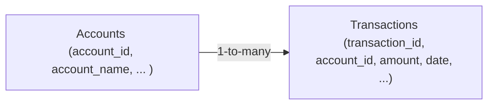

## 12.2 SQL Queries: Common Commands, Clauses, Operators

In modern accounting and auditing environments, data management often hinges on the effective use of SQL (Structured Query Language). CPAs, auditors, and data-driven professionals rely on SQL to query enterprise financial records, identify anomalies, and ensure the integrity of transactional data. This section explores how SQL works, emphasizing both fundamental queries and intermediate techniques often encountered in financial and operational audits. By the end of this chapter, you will be able to write efficient SQL queries using common commands, clauses, and operators for financial statement analysis, management reporting, compliance checks, and more.

  
### Importance of SQL for CPAs and IS Professionals

Accountants need data quickly and accurately. With SQL, professionals can:

• Retrieve specific transaction details from an ERP system.  
• Validate the completeness and accuracy of journal entries.  
• Identify unusual patterns in accounts payable, accounts receivable, or payroll data.  
• Create summary reports for audit committees or financial statements.  

Moreover, SQL-based analytics can reveal critical insights about operational efficiency, compliance with regulations, and early warnings of fraud or misstatements. By mastering SQL commands, you elevate your ability to manage, interpret, and secure important financial and operational datasets.

  
### Overview of Common SQL Components

SQL queries typically follow a standard pattern:

1. SELECT: Defines the columns or expressions to be returned.  
2. FROM: Specifies the table(s) or view(s) from which data is retrieved.  
3. WHERE: Applies conditions to filter rows.  
4. GROUP BY: Aggregates data based on one or more columns.  
5. HAVING: Filters grouped data by specifying conditions on aggregate results.  
6. ORDER BY: Sorts the final results in ascending or descending order.  
7. JOINS: Combines rows from multiple tables.  

Operators (e.g., comparison operators like =, <>, or logical operators like AND, OR) are used throughout the query to narrow or expand search results. Below is a conceptual illustration of how these components flow together in a typical query.

  
### SQL Basic Syntax and Structure

A simple SQL query can be expressed as follows:

SELECT column1, column2, ...
FROM table_name
WHERE condition1 AND/OR condition2
GROUP BY column(s)
HAVING aggregated_condition
ORDER BY column(s) ASC/DESC;

Although not every clause is required at all times, understanding each available clause is crucial for building efficient queries.

  
### Diagram: Table Relationship for Financial Data

To illustrate how different tables interact in a typical accounting system, consider the following simplistic entity-relationship (ER) diagram. It shows how Accounts and Transactions tables might be related:

In this diagram, each record in the Accounts table can have many related entries in the Transactions table, but each transaction row typically corresponds to only one account record. This relationship is commonly used in SQL queries to link account details with their respective financial transactions.

  
### SELECT Statement

The SELECT statement specifies which columns or data you want to retrieve. It is the foundation of almost every SQL query.

• Basic Syntax:

SELECT column1, column2, ...
FROM table_name;

• Example (Accounting Context):

Imagine you have a table called invoices with columns such as invoice_id, client_id, amount, and invoice_date. To view all columns in the invoices table:

SELECT *
FROM invoices;

This query returns the entire dataset. However, retrieving all columns may not always be efficient. Hence, you can specify only the needed columns:

SELECT invoice_id, amount
FROM invoices;

  
### FROM Clause

The FROM clause indicates the table or views from which the query will pull data. It can include multiple tables if you use JOINs.

• Single Table:

SELECT account_name
FROM accounts;

• Multiple Tables (with JOINs, discussed later):

SELECT a.account_id, t.amount
FROM accounts a
JOIN transactions t ON a.account_id = t.account_id;

  
### WHERE Clause

The WHERE clause filters the data. Only rows that satisfy the condition(s) are returned.

• Common Comparisons: =, <>, >, <, >=, <=  
• Logical Operators: AND, OR, NOT  
• Example (Filtering Unpaid Invoices):

SELECT invoice_id, amount
FROM invoices
WHERE status = 'UNPAID'
  AND invoice_date >= '2024-01-01';

In this example, the query returns invoices that are unpaid and have an invoice_date on or after January 1, 2024.

  
### GROUP BY Clause

The GROUP BY clause is essential when using aggregate functions like SUM, AVG, COUNT, MIN, or MAX. It consolidates rows into groups based on specified columns.

• Aggregate Functions:  
  – SUM(column): Adds the values in a given column.  
  – AVG(column): Calculates the average value in a column.  
  – COUNT(column): Counts non-null values in a column.  
  – MIN(column): Finds the smallest value in a column.  
  – MAX(column): Finds the largest value in a column.

• Example (Summarizing by Account):

SELECT account_id, SUM(amount) AS total_transactions
FROM transactions
GROUP BY account_id;

This query totals the transaction amounts for each account. The result might be used in financial reconciliations to confirm that the total for each account matches the ledger.

  
### HAVING Clause

HAVING is similar to WHERE but applies to aggregated data. After grouping, you might want to filter out certain groups based on their aggregated values.

• Example (Filtering High-Value Accounts):

SELECT account_id, SUM(amount) AS total_amount
FROM transactions
GROUP BY account_id
HAVING SUM(amount) > 50000;

This query displays only accounts with a total transaction amount greater than 50,000.

  
### ORDER BY Clause

ORDER BY sorts query results. It can sort by one or more columns, either in ascending (ASC) or descending (DESC) order.

• Example (Ordering Largest Transactions First):

SELECT transaction_id, amount
FROM transactions
ORDER BY amount DESC;

This query ranks transactions from the highest to the lowest amount, which can be helpful in identifying high-value transactions for closer review or audit testing.

  
### SQL Operators

Operators refine your queries by combining or comparing values:

1. Arithmetic Operators (+, -, *, /): Perform basic math.  
2. Comparison Operators (=, <>, <, >, <=, >=): Compare values.  
3. Logical Operators (AND, OR, NOT): Combine multiple conditions in WHERE or HAVING clauses.  
4. BETWEEN and IN:  
   – BETWEEN: Used for range checks.  
   – IN: Checks if a value matches any value in a set.  
5. LIKE: Matches patterns within string columns used frequently for wildcard searches.  
6. IS NULL / IS NOT NULL: Checks for missing (NULL) values.  

  
### JOINS

Joins allow you to retrieve data from multiple related tables. Different types of JOINs help shape the resulting dataset:

• INNER JOIN: Returns rows when there is at least one match in both tables.  
• LEFT JOIN: Returns all rows from the left table, and matched rows from the right table.  
• RIGHT JOIN: Returns all rows from the right table, and matched rows from the left table.  
• FULL JOIN (or FULL OUTER JOIN): Returns rows when there is a match in one of the tables.

  
#### Example: INNER JOIN

Imagine you have two tables: accounts (for general ledger accounts) and transactions (for daily transactions). If you want to see which transactions belong to which accounts:

SELECT a.account_name, t.transaction_id, t.amount
FROM accounts a
INNER JOIN transactions t
    ON a.account_id = t.account_id
WHERE t.transaction_date >= '2024-01-01';

This query displays only the matching records where each transaction’s account_id has a corresponding entry in the accounts table, and filters rows to those posted after January 1, 2024.

  
#### Example: LEFT JOIN

To view all accounts, even those that do not have transactions, you can use a LEFT JOIN:

SELECT a.account_name, t.transaction_id, t.amount
FROM accounts a
LEFT JOIN transactions t
    ON a.account_id = t.account_id;

In this scenario, if an account has no transactions, you will see NULL for transaction_id and amount columns, enabling you to detect inactive or unused accounts quickly.

  
### Practice Queries

Below are some brief practice queries involving SELECT, GROUP BY, and JOINS. Feel free to modify column names, tables, and date ranges for your scenario.

• Identify High-Dollar Invoices:

SELECT customer_id, SUM(amount) AS total_revenue
FROM invoices
WHERE invoice_date BETWEEN '2024-01-01' AND '2024-12-31'
GROUP BY customer_id
HAVING SUM(amount) > 100000;

• Top 10 Vendors by Amount Paid:

SELECT v.vendor_name, SUM(p.payment_amount) AS total_paid
FROM vendors v
INNER JOIN payments p
  ON v.vendor_id = p.vendor_id
GROUP BY v.vendor_name
ORDER BY total_paid DESC
LIMIT 10;

(Note: Some SQL dialects use SELECT TOP 10 rather than LIMIT 10.)

  
### Real-World Case Example

Consider a mid-sized manufacturing company needing to audit its expenditure on raw materials. By combining the purchases table (storing item_name, invoice_date, vendor_id, and cost) with the vendors table (containing vendor_id, vendor_name, and contact details) in a single query, the CPA’s team can identify the top expenditure categories, how much was spent on each material, and whether any potential overspending or anomalies exist. A carefully crafted GROUP BY with the SUM function clarifies total spending on each material type, while an INNER JOIN merges relevant vendor details, ensuring that any subsequent follow-up with suppliers is straightforward.

  
### Best Practices

1. Use Aliases: Shorten table names by assigning aliases (e.g., `accounts a`) to make queries more readable.  
2. Minimal SELECT: Request only the columns you need. Avoid `SELECT *` in production queries to reduce overhead.  
3. Proper Indentation: Format SQL statements for clarity using line breaks and indentation essential for complex queries.  
4. Indexing for Performance: Create or leverage existing indexes on columns used in JOIN conditions or WHERE clauses.  
5. Validate Results: Always cross-check query results with known data sets or sample records before finalizing official reports.  

  
### Common Pitfalls

• Missing WHERE Conditions: Accidentally returning huge result sets or inaccurate data.  
• Incorrect JOIN Type: Using an INNER JOIN when a LEFT JOIN is needed can inadvertently exclude important rows.  
• Overly Complex Joins: Overcomplicating queries or referencing too many tables can degrade performance.  
• Unhandled NULL Values: Failing to filter or account for NULL values in your calculations.  
• Aggregation Errors: Misplacing GROUP BY or HAVING clauses can produce incorrect or incomplete group summaries.

  
### Closing Thoughts

Mastering SQL commands, clauses, and operators is an invaluable skill for CPAs, auditors, and IT professionals. It empowers you to quickly gather accurate financial data, perform targeted analyses, and generate meaningful insights without relying exclusively on IT support. In subsequent chapters (e.g., Chapter 14 on “Data Integration and Analytics”), we will delve further into how to integrate SQL-based data with business intelligence tools, building upon these foundational querying skills.

Remember to practice regularly. Whether you are building dashboards for management reporting or investigating anomalies in the general ledger, consistent use of SELECT, WHERE, GROUP BY, HAVING, and JOIN clauses will accelerate your comfort and proficiency in writing complex queries.  

---

## Essential SQL Queries for Financial Data Quiz



### Which clause in an SQL statement is primarily used to filter rows before data aggregation?

- [ ] GROUP BY
- [ ] HAVING
- [x] WHERE
- [ ] ORDER BY

> **Explanation:** The WHERE clause is evaluated before aggregation, filtering out rows that do not meet specified conditions. HAVING filters after the grouping takes place.

### Which keyword can be used to limit the number of rows returned by a query in certain SQL dialects (e.g., MySQL, PostgreSQL)?

- [ ] TOP
- [x] LIMIT
- [ ] MAX
- [ ] TRUNCATE

> **Explanation:** LIMIT (e.g., LIMIT 10) restricts the number of rows returned in certain SQL dialects. Some dialects use TOP instead (e.g., MS SQL Server).

### Which JOIN type returns all rows from the left table and matched rows from the right table?

- [ ] INNER JOIN
- [x] LEFT JOIN
- [ ] RIGHT JOIN
- [ ] FULL JOIN

> **Explanation:** A LEFT JOIN returns all rows from the left (first-named) table and the matched rows from the right (second-named) table. Unmatched rows in the right table appear as NULL columns in the results.

### What is the primary purpose of the HAVING clause?

- [ ] To specify the table from which to select columns
- [x] To filter aggregated results
- [ ] To specify the columns in the output
- [ ] To sort the final results

> **Explanation:** As opposed to WHERE, which filters row-by-row, HAVING filters the groups formed by GROUP BY and is used primarily on aggregate functions.

### Which operator is used to test for a set of possible matching conditions?

- [ ] BETWEEN
- [ ] HAVING
- [x] IN
- [ ] IS NOT NULL

> **Explanation:** IN is used to specify multiple possible values for a column. For example, WHERE country IN ('USA','Canada','Mexico').

### Which of the following clauses is used to sort query results?

- [ ] SELECT
- [ ] JOIN
- [x] ORDER BY
- [ ] GROUP BY

> **Explanation:** ORDER BY sorts your query output in ascending (ASC) or descending (DESC) order by one or more columns.

### What best describes an INNER JOIN?

- [x] It returns only rows with matching values in both tables.
- [ ] It returns all rows from the left table only.
- [ ] It returns all rows from both tables, whether they match or not.
- [ ] It matches rows based on data type only.

> **Explanation:** An INNER JOIN shows intersection rows that satisfy the JOIN condition in both tables.

### When selecting specific columns, which is considered a best practice?

- [x] Listing only the required columns in the SELECT statement
- [ ] Always using SELECT *
- [ ] Using ORDER BY in every query
- [ ] Hiding columns in the WHERE clause

> **Explanation:** It is a best practice to select only needed columns to improve performance and clarity, rather than using SELECT *.

### Which clause might you use to remove groups that do not meet certain aggregated criteria?

- [ ] ORDER BY
- [ ] WHERE
- [x] HAVING
- [ ] FROM

> **Explanation:** The HAVING clause filters groups that do not meet the conditions applied to aggregated data.

### A NULL value means:

- [x] No data or missing data in that field
- [ ] Zero
- [ ] A negative value
- [ ] "N/A" as a string literal

> **Explanation:** NULL indicates the absence of a value. It is not the same as zero, an empty string, or "N/A."



---

## For Additional Practice and Deeper Preparation

### [Information Systems and Controls (ISC)](https://www.udemy.com/course/isc-cpa-mock-exams/?referralCode=E1217303222935C5E464)  

**Information Systems and Controls (ISC) CPA Mocks:** 6 Full (1,500 Qs), Harder Than Real! In-Depth & Clear. Crush With Confidence!

- Tackle full-length mock exams designed to mirror real ISC questions.  
- Refine your exam-day strategies with detailed, step-by-step solutions for every scenario.  
- Explore in-depth rationales that reinforce higher-level concepts, giving you an edge on test day.  
- Boost confidence and minimize anxiety by mastering every corner of the ISC blueprint.  
- Perfect for those seeking exceptionally hard mocks and real-world readiness.

_Disclaimer: This course is not endorsed by or affiliated with the AICPA, NASBA, or any official CPA Examination authority. All content is for educational and preparatory purposes only._
