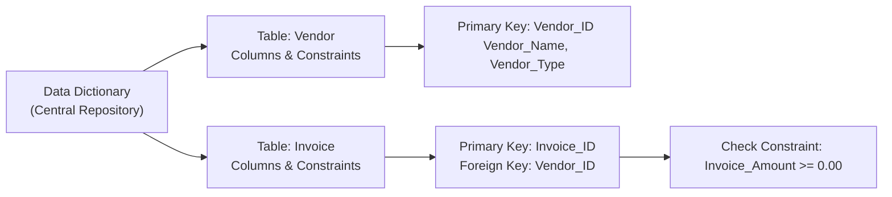

## 12.3 Data Dictionary and Data Integrity Controls

A consistent, accurate, and well-managed data environment is vital in modern organizations, particularly those operating complex financial or accounting systems. One key component in ensuring that consistency and accuracy is the data dictionary—a central repository of information about the data elements used throughout the enterprise. Equally important are data integrity controls such as primary keys, foreign keys, and other constraints that preserve the reliability and correctness of the data. In this section, we explore how a data dictionary improves consistency in financial and operational systems, discuss the role of constraints in maintaining data integrity, and review best practices for designing, auditing, and maintaining these elements in a corporate setting.

### Understanding the Role of the Data Dictionary

A data dictionary is often described as the “blueprint” or “catalog” of an organization’s data. It houses critical information about each data element, including:

• Field names and aliases  
• Data types (e.g., integer, varchar, date)  
• Field length and format (e.g., maximum 50 characters, YYYY-MM-DD)  
• Default values and allowable ranges  
• Business definitions and descriptions of meaning and usage  
• Security classifications (e.g., private, confidential, public)  
• Access restrictions and ownership  

In many organizations, the data dictionary is an official document—sometimes an actual database table or specialized tool—used to ensure everyone uses consistent definitions and formats for data. This consistency is crucial for accurate financial reporting because even small discrepancies in definitions (e.g., the meaning of “Closing Date” vs. “Settlement Date”) can result in material misstatements.

### Benefits for CPAs and IT Auditors

1. Consistency in Financial Reporting:  
   CPAs rely on underlying data to be trustworthy. A data dictionary that enforces the same nomenclature and definitions across financial modules (e.g., in ERP systems) reduces the risk of multiple interpretations.  

2. Streamlined Audits:  
   IT auditors and financial auditors can use the data dictionary to understand expected data structure and flow quickly. Auditors can more easily detect anomalies against defined standards, simplifying the discovery of potential material errors.  

3. Regulatory and Compliance Alignment:  
   Maintaining a comprehensive data dictionary aids compliance with frameworks such as COBIT®, COSO, and various data privacy regulations. By clearly labeling sensitive data elements, organizations can demonstrate robust governance.  

4. Minimizing Redundant Data Collection:  
   Redundancies and inconsistencies often arise when various business units create new data fields that replicate existing ones. A data dictionary flags potential duplication and requisite usage restrictions.  

5. Improved System Integration:  
   Mergers, acquisitions, or expansions often require integrating separate financial or logistical systems. Having a central data dictionary avoids mismatches in field definitions that might cause errors in interfacing between modules or external systems.

### Key Components of a Data Dictionary

While each organization’s data dictionary may appear unique, most robust dictionaries share these core components:

• Table or Entity Name: Identifies the database table or conceptual entity (e.g., “Vendors,” “Chart_of_Accounts,” “Invoices”).  
• Column Name or Attribute: Lists each column or attribute in a table, such as “Vendor_ID” or “Account_Number.”  
• Data Type: Indicates the data type and size (e.g., DECIMAL(10,2), VARCHAR(100)).  
• Constraints: Points out any constraints (e.g., PRIMARY KEY, FOREIGN KEY, NOT NULL).  
• Definition and Description: Specifies the function or meaning of this data field, typically in clear business terms.  
• Ownership and Stewardship: Identifies which person or department is responsible for the accuracy and update of the data field.  
• Security Classification: Defines sensitivity level—whether the field is classified as public, restricted, confidential, or governed by specific regulations (e.g., HIPAA).  

### Designing and Maintaining a Data Dictionary

Designing a data dictionary is not a one-time effort but an ongoing process. Key steps include:

• Capturing Metadata: Start by gathering all relevant metadata, including existing database schemas, naming conventions, descriptions, and relationships. Automated tools can parse a database’s system catalogs to populate the dictionary initially.  
• Establishing Naming Conventions: Define consistent naming standards (e.g., “PRD_” prefix for production tables, “VEND_” for vendor-related attributes). Common naming structures lower confusion and expedite debugging.  
• Ensuring Stakeholder Input: Invite top-level sponsors from Finance, IT, and Operations to provide their perspectives. This collaboration reduces the risk of developing definitions that don’t reflect actual usage.  
• Version Control: As business requirements change, so do data structures. It’s crucial to maintain version histories of your data dictionary and document any modifications.  
• Centralized Repository: Storing your dictionary in a single, authoritative source—whether a specialized tool or a shared system environment—makes it easier to synchronize updates across business units.  

### Data Integrity Controls and Constraints

While a data dictionary provides the “map” of an organization’s data environment, data integrity controls ensure the “ground truth” of that data remains correct, valid, and reliable. These controls are essential in preventing data corruption, unauthorized manipulation, and referential mismatches.

Key forms of data integrity controls include:

• Primary Keys: Uniquely identifies each record within a table. For instance, “Account_ID” might be the primary key in an “Accounts” table.  
• Foreign Keys: Enforces referential integrity by ensuring a record in one table references a valid primary key in another table (e.g., “Vendor_ID” in the “Invoices” table referring to “Vendor_ID” in the “Vendors” table).  
• Unique Constraints: Makes certain that values in designated fields remain distinct (e.g., an “Email_Address” field in a “Vendors” table).  
• Check Constraints: Restricts the allowable values within a column to maintain domain integrity (e.g., ensuring an “Invoice_Amount” is greater than or equal to zero).  
• Not Null Constraints: Mandates that specified columns contain no NULL (empty) values where logically required (e.g., “Invoice_Number” in the “Invoices” table must always have a value).  

These constraints, when combined, reduce erroneous transactions, enable accurate report generation, and make the audit trail more transparent.

### Primary Keys and Foreign Keys

Primary keys (PK) and foreign keys (FK) form the bedrock of relational database integrity:

• Primary Key (PK):  
  – A PK is a column or a set of columns that identifies a row in a table uniquely.  
  – Commonly auto-generated (e.g., sequential ID numbers) to prevent collisions or duplicates.  
  – In financial contexts, an “Account_Number” might serve as a PK in a Chart of Accounts, ensuring each account is distinctly recognized.  

• Foreign Key (FK):  
  – An FK in one table references the PK of another table.  
  – Enforces referential integrity by preventing the insertion of invalid references (e.g., blocking an “Invoice” transaction for a non-existent “Vendor_ID”).  
  – Aligns with real-world relationships, such as linking transactions to valid customer or vendor records.  

By maintaining these keys, organizations avoid a range of data anomalies, such as orphaned records or duplication, which can directly undermine the reliability of financial reports.

### Mapping Data Dictionary to Integrity Controls

The data dictionary should explicitly document the constraints and relationships that exist in a system’s schema. For example, if the “Invoice_Header” table has a foreign key to the “Customer_Master” table, the data dictionary entry for “Customer_ID” would highlight:

• Its foreign key status referencing “Customer_Master.Customer_ID.”  
• Allowable value ranges (if applicable).  
• Implications for data entry or synchronization with other systems.  

With these details documented, internal and external auditors can quickly verify that the data architecture aligns with the business rules and that system controls are functioning appropriately.

### Practical Financial Scenario: Accounts Payable

Consider a simplified Accounts Payable (AP) system:

• “Vendor” Table – Contains a “Vendor_ID” (PK), “Vendor_Name,” and “Vendor_Type.”  
• “Invoice” Table – Contains “Invoice_ID” (PK), “Invoice_Number,” “Vendor_ID” (FK to “Vendor.Vendor_ID”), “Invoice_Date,” “Payment_Due_Date,” and “Invoice_Amount.”  

In the “Invoice” table, referencing a valid “Vendor_ID” in the “Vendor” table ensures that no invoice is processed for a non-existent or invalid vendor. If the data dictionary includes an entry for “Invoice_Amount” indicating a check constraint that ensures Invoice_Amount must be >= 0.00, the organization is automatically blocking negative or nonsensical invoice entries. By thoroughly defining each of these fields in the dictionary, staff and auditors know precisely what these fields represent and the constraints in place.

Below is a high-level Mermaid diagram illustrating the data dictionary’s role in referencing tables and constraints:

By centralizing all this information in the data dictionary, finance professionals and IT auditors have a single reference to confirm definitions and check constraint operation.

### Common Challenges and Pitfalls

1. Incomplete Documentation:  
   Failing to update the data dictionary as systems evolve leads to confusion. Outdated definitions can cause improper data usage or inaccurate reporting.  

2. Ad Hoc Constraints:  
   Some organizations implement constraints sporadically (e.g., a partial set of foreign keys or conditional constraints enforced only in front-end applications). This inconsistent approach undermines referential integrity.  

3. Overreliance on Application Logic:  
   Relying solely on the application layer for validation, instead of leveraging database-level constraints, risks data corruption if the application bypasses or incorrectly enforces rules.  

4. Shadow Systems & Spreadsheets:  
   Many organizations rely on spreadsheets or legacy systems that are not integrated with the main database, leading to data that is not subject to the same dictionary or constraints.  

5. Resistance to Change:  
   Business units may be reluctant to implement new definitions or constraints if it complicates existing processes. A robust change management plan is needed to ensure smooth adoption.

### Best Practices and Strategies

• Document Constraints in the Data Dictionary:  
  Each column should indicate whether it is a primary key, foreign key, unique constraint, or subject to check constraints.  

• Maintain Alignment with Business Processes:  
  Ensure new fields or modifications are mapped to the correct business process. For example, if a new “Late_Fees” column is introduced into the “Invoice” table, the data dictionary should define how it is calculated and any constraints (e.g., cannot be less than 0).  

• Enforce Constraints at the Database Level:  
  Whenever possible, enforce integrity at the database level to guarantee consistency across all external and internal applications.  

• Review Regularly:  
  Integrate dictionary and constraints review into internal audit or periodic control reviews. Any system changes (like migrations to new ERP modules) should involve re-verification.  

• Leverage Governance Frameworks:  
  Align data dictionary processes and data integrity controls with recognized frameworks such as COBIT®, COSO, or ITIL®. This alignment often makes external audits more efficient and transparent.  

### Case Study: Merging with a Newly Acquired Subsidiary

A mid-sized manufacturing firm recently acquired a smaller specialized parts supplier. During integration, the acquiring company discovered that the supplier used entirely different data field names and definitions for key components (e.g., “Supp_ID” for vendor ID, no reference table for addresses, or misaligned invoice structures). By developing a unified data dictionary:

• The merged entity established consistent definitions (e.g., standardizing “Vendor_ID” as the key field).  
• Schemas were updated to include foreign keys referencing “Vendor” or “Address” tables.  
• Duplicate fields (e.g., “ContactNumber,” “Phone,” or “MobileNo”) were eliminated, minimizing the risk of incomplete or inconsistent data.  

Throughout the process, both companies’ CPAs and IT auditors validated that financial transactions were not adversely affected by these integrations. The data dictionary served as the common language guiding the database migration, preserving data integrity and supporting accurate reporting.  

### Summary and Next Steps

Data dictionaries establish uniform definitions and metadata across the organization, enabling consistent understanding of financial data elements. They work in tandem with constraints like primary keys, foreign keys, and check conditions to enforce data integrity—preventing costly errors, ensuring confidence in financial statements, and streamlining audit processes. As business requirements grow more complex and regulatory scrutiny intensifies, the dual pillars of a robust data dictionary and well-managed data integrity controls will continue to be critical.

For CPAs, IT auditors, and finance professionals, the next step is:
• Evaluate your current data dictionary. Is it complete, and how often is it updated?  
• Identify gaps in constraints that might leave your system open to inconsistencies.  
• Document and communicate these gaps to management to solicit support for improvements.  
• Establish a process to keep the data dictionary and constraints in sync as your systems grow and evolve.  

By prioritizing these actions, organizations can strengthen the reliability of their data, enhance their internal control environment, and foster resilient financial reporting.

## Test Your Knowledge: Data Dictionary and Data Integrity Controls



### Which of the following is a primary function of a data dictionary?  
- [x] Serving as a central repository that defines data names, types, and relationships  
- [ ] Encrypting database fields for security  
- [ ] Handling backups and disaster recovery tasks  
- [ ] Scheduling automated tasks and triggers  

> **Explanation:** A data dictionary documents metadata about database elements, such as column names, data types, and relationships, ensuring consistent use of data across an organization.

### A primary key in a database table is:  
- [x] A unique identifier for each record in the table  
- [ ] A secondary index used to expedite search operations  
- [ ] A column that may contain duplicate values  
- [ ] The set of columns used for storing unstructured data  

> **Explanation:** The primary key must be unique for each table record, ensuring no two rows have the same identifier.

### Which constraint ensures that a record in one table cannot reference a non-existent record in another table?  
- [x] Foreign key constraint  
- [ ] Not Null constraint  
- [ ] Unique constraint  
- [ ] Check constraint  

> **Explanation:** A foreign key constraint enforces referential integrity by ensuring all references to another table match an existing primary key.

### In a data dictionary, which detail is typically documented for each column?  
- [x] Data type, size, and definition of the column  
- [ ] Specific user passwords granting row-level access  
- [ ] Exact physical location of data on the disk  
- [ ] Economic entity theory definitions  

> **Explanation:** A data dictionary commonly includes the column data type, size, business definition, and other metadata needed for consistent understanding and usage.

### A check constraint in a database table is designed to:  
- [x] Enforce domain integrity by restricting allowable values for a column  
- [ ] Generate automatic incremental numbers for a primary key  
- [x] Stop negative or invalid entries from being saved  
- [ ] Automatically update all referencing records when the primary key changes  

> **Explanation:** Check constraints protect data integrity by limiting possible values in a column to a specified range or format.

### What is a common pitfall when maintaining a data dictionary?  
- [x] Failing to update definitions as systems evolve  
- [ ] Including too many details, such as data types and ownership  
- [ ] Storing the dictionary in a centralized location  
- [ ] Restricting dictionary access to internal auditors only  

> **Explanation:** If the organization doesn’t keep the data dictionary updated, it can quickly become obsolete and lead to inconsistencies or misunderstandings of the data.

### Which is true about primary keys and foreign keys?  
- [x] Primary keys uniquely identify records; foreign keys reference primary keys in another table  
- [ ] Primary keys and foreign keys must be the same column name in both tables  
- [x] Primary keys are defined in the “parent” table, foreign keys exist in the “child” table  
- [ ] The concept only applies to hierarchical databases but not relational databases  

> **Explanation:** In a relational context, primary keys serve as unique identifiers in one (parent) table. A foreign key in another (child) table references that primary key to maintain referential integrity.

### Why might CPAs be particularly interested in data integrity controls?  
- [x] To ensure the accuracy and reliability of financial statements  
- [ ] To eliminate the need for external audit support  
- [ ] To replace the standard chart of accounts with specialized fields  
- [ ] To create more complex database structures with no clear business purpose  

> **Explanation:** Strong data integrity controls provide assurance for transaction correctness and reduce the risk of material misstatement in financial reporting.

### Which of the following best describes a “shadow system”?  
- [x] A departmental or ad hoc data store not officially integrated with the main system  
- [ ] A copy of the production database used for disaster recovery  
- [ ] A generic name for external vendor systems utilized under contract  
- [ ] A method for synchronizing foreign key references automatically  

> **Explanation:** Shadow systems are often spreadsheets or stand-alone applications that circumvent official controls and can lead to data inconsistencies if not managed properly.

### For a field that must never be left empty or null, which constraint should be applied?  
- [x] NOT NULL  
- [ ] UNIQUE  
- [ ] FOREIGN KEY  
- [ ] CHECK  

> **Explanation:** The NOT NULL constraint ensures a data field always contains a value.



## For Additional Practice and Deeper Preparation

### [Information Systems and Controls (ISC)](https://www.udemy.com/course/isc-cpa-mock-exams/?referralCode=E1217303222935C5E464)  

**Information Systems and Controls (ISC) CPA Mocks:** 6 Full (1,500 Qs), Harder Than Real! In-Depth & Clear. Crush With Confidence!

- Tackle full-length mock exams designed to mirror real ISC questions.  
- Refine your exam-day strategies with detailed, step-by-step solutions for every scenario.  
- Explore in-depth rationales that reinforce higher-level concepts, giving you an edge on test day.  
- Boost confidence and minimize anxiety by mastering every corner of the ISC blueprint.  
- Perfect for those seeking exceptionally hard mocks and real-world readiness.  

_Disclaimer: This course is not endorsed by or affiliated with the AICPA, NASBA, or any official CPA Examination authority. All content is for educational and preparatory purposes only._
