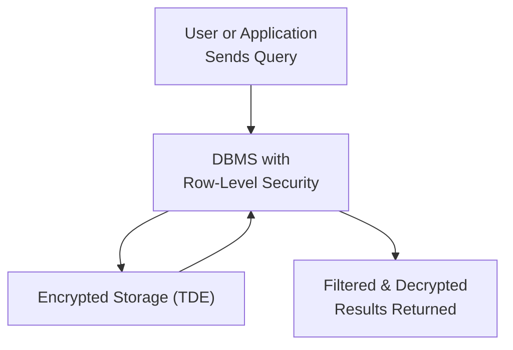

## 12.4 Database Security and User Access

Effective database security is essential for safeguarding sensitive financial and non-financial data from unauthorized access, loss, and manipulation. As the volumes of information stored in modern databases continue to grow, organizations and CPAs must develop robust mechanisms to protect data at every level: from physical hardware to the application layer. This section explores key topics in database security—including encryption at rest, row-level security, and best-practice guidelines for managing privileges—providing CPAs with foundational knowledge to help assess, design, and improve an organization’s data security posture.

Database security and user access controls also tie directly into many regulatory frameworks and compliance mandates, such as HIPAA, GDPR, and PCI DSS. From an audit and assurance perspective, robust policies and practices in these areas reduce the risk of material misstatements, data breaches, and reputational damage. Both internal and external auditors must examine the design, implementation, and operating effectiveness of relevant controls to ensure complete and accurate financial reporting.

--------------------------------------------------------------------------------

### Overview of Database Security

At its core, database security encompasses processes, tools, and policies that protect the integrity, confidentiality, and availability of data stored in database management systems (DBMS). This includes:

• Preventing unauthorized access or misuse of data.  
• Ensuring that legitimate users can retrieve data reliably and accurately.  
• Protecting the organization’s data assets against cyberattacks, system failures, and other disruptions.  

Database security aligns with many other elements of IT risk management, including network security, operating system hardening, application security, and identity and access management (IAM). As a CPA or IT auditor, understanding how user access is granted, monitored, and revoked is key to ensuring that data remains secure.

--------------------------------------------------------------------------------

### Encryption at Rest

Encryption at rest is one of the most powerful tools for safeguarding data in the event of physical theft, unauthorized server access, or accidental hardware disposal. By converting plaintext data into ciphertext, you ensure that the data remains indecipherable without the appropriate decryption key. Encryption addresses both regulatory compliance requirements (e.g., HIPAA, GDPR) and industry best practices.

#### How Encryption at Rest Works

When data is “at rest,” it is stored on a physical or virtual medium such as a disk, tape, or cloud-based storage platform. Modern DBMS solutions and third-party tools commonly provide built-in encryption features for data at rest:

• Transparent Data Encryption (TDE): Many relational DBMS (e.g., Microsoft SQL Server, Oracle, IBM Db2, PostgreSQL) support TDE, which automatically encrypts pages of data before writing them to disk. Decryption occurs when the data is read into memory.  
• File/Folder-level Encryption: Tools such as BitLocker (Windows) or dm-crypt (Linux) encrypt entire volumes or file systems. This can be a simpler solution in smaller deployments but might not offer granular, row-level or column-level encryption.  
• Column-level Encryption: Sensitive data fields (e.g., credit card numbers, SSNs) can be individually encrypted using database functions or external libraries, providing fine-grained protection.

#### Implementation Considerations

Encryption at rest requires additional CPU resources, key management procedures, and strategic planning about how encryption keys will be stored. Typical considerations include:

• Key Management: Keys should be securely stored, often separate from the production environment, to avoid a single point of compromise. Hardware Security Modules (HSMs) or Key Management Services (KMS) (often provided by cloud service providers) can help.  
• Performance Impact: While modern CPUs offer hardware-level cryptographic acceleration, encryption can still affect performance. Proper testing ensures that system throughput remains acceptable.  
• Compliance Requirements: Some regulations mandate encryption of certain data types or storage media. Auditors often confirm the existence and effectiveness of the organization’s encryption policy.

#### Verifying Encryption at Rest

Auditors can verify the efficacy of encryption controls by:

1. Reviewing Policies and Procedures: Evaluate whether documented policies exist for encryption, key management, and incident response.  
2. Inspecting Database Settings: Validate TDE configuration or verify other encryption settings in the DBMS.  
3. Reviewing Key Management Processes: Inspect key rotation plans, access controls over key storage, and logs of key usage or changes.  
4. Performing Penetration Tests or Vulnerability Scans: Attempt data file extraction to confirm that stolen files appear encrypted and are unreadable without the decryption key.

--------------------------------------------------------------------------------

### Row-Level Security (RLS)

Row-level security (RLS) is a powerful feature that allows organizations to restrict the data returned by queries to only those rows for which the user has appropriate privileges. Instead of creating numerous database views or separate tables for different user roles, RLS applies policies that dynamically filter out rows.

#### How Row-Level Security Works

RLS functions by associating a security policy or predicate function with a table. That policy uses user or session attributes—such as the user’s role, department, or geographic region—to determine which rows can be accessed. For example, an accounting manager in Division A might only see financial transactions for Division A, while a higher-level corporate user sees all divisions.

#### Key Benefits

• Data Segmentation: Reduces the risk of unauthorized disclosures.  
• Simplicity: Centralizes access logic in the DBMS, reducing complexity at the application layer.  
• Regulatory Compliance: Facilitates compliance with privacy regulations that require limiting data exposure, such as GDPR or HIPAA, by ensuring that personally identifiable information (PII) or protected health information (PHI) is only accessible to authorized individuals.

#### Common Implementation Examples

• Label-based Control: Some databases allow you to tag table rows with data classification labels. The RLS policy references the user’s clearance to determine access.  
• Tenant-based Access: In multi-tenant SaaS environments, RLS is used to maintain data isolation, ensuring Client A cannot see data related to Client B.

#### Audit and Assurance of RLS

For assurance professionals, verifying the effectiveness of RLS includes:

• Reviewing the policy definition in the database for logical correctness.  
• Testing user-specific scenarios to confirm that seen data is appropriately filtered.  
• Inspecting logs to ensure attempted unauthorized access triggers alerts or rejections.

--------------------------------------------------------------------------------

### Privilege Management: Best-Practice Guidelines

Managing who has access to which data (and how) is the foundation of effective database security. Privilege management defines how permissions are granted, monitored, and revoked throughout an employee’s lifecycle at the company, and controls how service accounts for applications function within the DBMS.

#### Principle of Least Privilege

At the heart of secure privilege management lies the principle of least privilege (PoLP), which states that users and processes should only have the minimal rights and privileges necessary to complete their duties. This includes restricting users to a read-only role unless they explicitly need write or administrative capabilities.

#### Role-based Access Control (RBAC)

Role-based access control groups privileges according to job functions rather than assigning them directly to individuals. For example, an “Accounts Payable Clerk” role may have read/write permissions to vendor tables, while a “Reporting Analyst” role has read-only permissions across several tables.

Benefits of RBAC:

• Easier Administration: Assign new employees to roles rather than specifying granular permissions.  
• Simplified Auditing: Each role can be reviewed to ensure its permissions remain aligned with current policies.  
• Scalability: Allows rapid onboarding or offboarding of employees with minimal risk of oversight.

#### Regular Privilege Reviews (Access Recertifications)

Even well-designed access controls can degrade over time if roles and user accounts are not periodically reviewed. Regular access recertifications:

• Ensure that employees who change departments lose unneeded privileges and gain only what is necessary.  
• Identify dormant accounts or roles that can be deactivated (e.g., employees who left the company).  
• Confirm principle of least privilege remains intact as organizational structures shift.

#### Segregation of Duties (SoD)

Segregation of duties is essential for preventing fraud and unintentional errors, especially in financial systems. For instance, employees who approve payments should not be able to modify vendor master data. Within the database context, this might mean restricting privileges so that a single administrator cannot create database users, assign privileges, and modify financial records unilaterally without oversight. Pairing SoD with robust logging and monitoring reduces the likelihood of collusion and fraudulent transactions going undetected.

#### Service Accounts and Application Roles

Service accounts are often used by applications to connect to the database. These accounts typically require limited, specialized permissions. When poorly managed, they can become the weakest link in the database’s security posture. Recommendations include:

• Use Strong, Long Passwords: Or, where available, replace passwords with certificate-based authentication or tokens.  
• Limit the Scope of Permissions: The application should only have access to essential tables and stored procedures; other schemas or tables remain restricted.  
• Rotate Credentials Regularly: Reduce the chance of compromised credentials being used indefinitely.  
• Monitor Service Accounts for Anomalies: Build alerts to detect unusual query patterns or usage times.

--------------------------------------------------------------------------------

### Common Threats and Pitfalls

Below are a few key areas where security gaps commonly arise:

• Default or Shared Credentials: Using default database credentials significantly increases the threat of unauthorized access.  
• Overprivileged Users: Granting “superuser” or “sysadmin” rights to multiple users or service accounts bypasses many internal controls.  
• Lack of Monitoring: Without proper logging and audit trails, malicious activity can remain undetected for an extended period.  
• Poor Key Management: Mishandling encryption keys can negate the benefits of encryption at rest.  
• Inconsistent RBAC Implementation: Mixing direct privilege grants with roles can cause confusion and inadvertently allow too broad an access scope.  

--------------------------------------------------------------------------------

### Diagram: Overview of Encryption at Rest and Row-Level Security

Below is a simplified Mermaid diagram that shows how data flows through encrypted storage and how row-level security filters rows based on user context:

• A: The user or application sends a SQL query to the database.  
• B: The DBMS, which has row-level security policies configured, evaluates which rows the user is permitted to see.  
• C: The raw data on disk is encrypted via TDE (or a similar method). When the DBMS engine reads the files, it decrypts the data as needed.  
• D: Only rows matching the security policies are returned to the user, in decrypted form.  

--------------------------------------------------------------------------------

### Practical Examples and Case Studies

1. **Financial Services Company Implementing RLS**  
   A financial services organization maintains a central database containing customer investment portfolios. To ensure compliance with internal governance and local privacy regulations, they implement row-level security so that specific Relationship Managers can only view portfolios attributed to their region and assigned client accounts. As part of their annual internal audit, the company reviews the RLS policies and performs test queries as different roles to confirm proper scoping.

2. **Encryption at Rest in a Multi-cloud Environment**  
   A CPA firm uses Microsoft Azure for hosting an SQL database of client tax returns. The data at rest is protected by Transparent Data Encryption, and compliance with encryption is tested through regular external audits. When the firm expands to another provider, AWS, they implement AES-256 keys managed by AWS Key Management Service (KMS) for S3-based data warehousing. A consistent encryption approach across platforms facilitates compliance with data protection regulations in each client’s jurisdiction.

3. **Regular Privilege Review Gone Wrong**  
   In one scenario, a manufacturing company discovered that an ex-employee account was still active, with a manager-level role assigned. This oversight occurred because the IT department did not conduct a quarterly privileged access review for the DBMS. An internal control deficiency was reported to the audit committee, prompting the company to immediately strengthen its on/offboarding processes and adopt more rigorous recertification schedules.

--------------------------------------------------------------------------------

### Tools and Technologies

When implementing database security, organizations can leverage a variety of tools:

• **Native Database Features**: Built-in encryption (TDE, column-level encryption), row-level security (in PostgreSQL, SQL Server, Oracle Label Security).  
• **Security Information and Event Management (SIEM)**: Solutions like Splunk, IBM QRadar, or Azure Sentinel help aggregate logs and monitor suspicious activity.  
• **Database Firewalls**: Offer real-time monitoring of SQL traffic to block anomalous or malicious queries before they reach the DBMS.  
• **Privilege Management Software**: Tools like CyberArk or BeyondTrust can automate user provisioning, track privileged sessions, and enforce SoD requirements.  
• **Key Management Services (KMS)**: AWS KMS, Azure Key Vault, or on-premises HSM solutions for secure key life cycle management.

--------------------------------------------------------------------------------

### Best Practices Checklist

Below is a non-exhaustive checklist for CPAs and IT auditors to ensure a robust approach to database security and user access:

• Confirm that a documented encryption policy is in place, detailing which data is encrypted and how keys are managed.  
• Verify that TDE or alternative encryption solutions are enabled for production databases containing sensitive data.  
• Review RLS or similar mechanisms to confirm that user access is restricted to only the data they need.  
• Conduct regular privilege reviews, ensuring that no orphaned or excessively privileged accounts exist.  
• Implement role-based access control (RBAC) for consistent and scalable privilege management.  
• Enforce password policies, including complexity, expiration, and rotation requirements.  
• Monitor database logs for suspicious activity, including large data extractions or repeated failed login attempts.  
• Align database audit trails with organization-wide logging and monitoring systems (SIEM).  
• Document a process for revoking and archiving old user accounts upon employee termination.  
• Periodically test database security via vulnerability scans and penetration tests.

--------------------------------------------------------------------------------

### Challenges and Considerations

• **Performance Overheads**: Encryption at rest, row-level security filtering, and real-time monitoring can introduce latency. Balancing security with performance requires careful tuning and testing.  
• **Complex Organizational Structures**: Large organizations with many departments might find it challenging to maintain consistent role definitions and SoD rules. A robust governance process is critical for ensuring roles remain accurate over time.  
• **Evolving Threat Landscape**: Cyber threats targeting databases change rapidly, requiring organizations to stay abreast of new vulnerabilities and patch releases.  
• **Regulatory Compliance**: Different jurisdictions impose varying requirements for storing, encrypting, and handling specific data elements. Multi-national entities must ensure compliance in every region where data is stored or processed.

--------------------------------------------------------------------------------

### References and Further Reading

1. **NIST SP 800-53** – Provides comprehensive guidelines on security and privacy controls.  
2. **AICPA Guidance** – Explore AICPA resources for additional best practices on SOC engagements related to IT environments.  
3. **Database Vendor Documentation** – Microsoft Docs (SQL Server), Oracle Documentation, PostgreSQL Docs, and IBM Db2 Knowledge Center for native security features.  
4. **ISO/IEC 27001** – International standard that outlines a framework for information security management systems, including encryption and access controls.  

--------------------------------------------------------------------------------

## Database Security and User Access Quiz



### Which of the following best describes the primary goal of encryption at rest?

- [ ] To accelerate database queries.  
- [ ] To mask data for testing and development.  
- [x] To protect stored data from being accessed if physical media is compromised.  
- [ ] To ensure internal database functions run only over SSL.  

> **Explanation:** Encryption at rest ensures that even if a malicious actor gains access to physical storage media (e.g., disk or backup tapes), the data remains unreadable without valid decryption keys.

### What is a main advantage of row-level security (RLS)?

- [ ] It enables seamless OS-level encryption for disk volumes.  
- [x] It dynamically filters the data each user is authorized to see.  
- [ ] It allows multiple administrators to share the same credentials.  
- [ ] It eliminates the need for database backups.  

> **Explanation:** RLS enforces access rules at the row level based on the querying user, ensuring only relevant records are returned.

### Which is a fundamental principle of best-practice privilege management?

- [ ] Full-access privileges for DBAs in all cases.  
- [x] Grant users only the level of access strictly necessary for their job.  
- [ ] Shared credentials to allow faster onboarding.  
- [ ] Giving every user the ability to approve new accounts.  

> **Explanation:** The Principle of Least Privilege is foundational, limiting what any single user can do, thereby reducing the organization’s attack surface.

### In the context of segregation of duties (SoD), which scenario is most appropriate?

- [ ] A single DBA can create user accounts, assign privileges, and modify financial records.  
- [x] The finance manager approves vendor payments, while IT handles user and role creation.  
- [ ] The security analyst is allowed to directly edit financial transactions when errors occur.  
- [ ] Everyone in the company shares a single “admin” account for convenience.  

> **Explanation:** Proper segregation of duties calls for splitting tasks between multiple people or departments to prevent conflicts of interest and reduce fraud risk.

### Which statement regarding Transparent Data Encryption (TDE) is correct?

- [x] TDE encrypts database files at the storage level and decrypts data when read into memory.  
- [ ] TDE encrypts each individual column in a table by default.  
- [ ] TDE automatically backups all user data to an offsite location.  
- [ ] TDE only encrypts logs, not the main data files.  

> **Explanation:** TDE generally operates at the page or file level, automatically encrypting data as it is written to disk, then transparently decrypting it upon retrieval.

### What is a major operational consideration when implementing encryption at rest?

- [ ] Eliminating password requirements.  
- [x] Managing and securing encryption keys.  
- [ ] Reducing application monitoring.  
- [ ] Restricting the use of SIEM systems.  

> **Explanation:** Encryption keys must be stored securely, rotated periodically, and protected to prevent unauthorized decryption of sensitive data.

### Why are regular privilege reviews important?

- [ ] They automatically enforce encryption of all columns.  
- [x] They ensure employees still need the level of access they have and remove unnecessary privileges.  
- [ ] They confirm backup processes are in place.  
- [ ] They allow an organization to skip vulnerability testing.  

> **Explanation:** Roles and responsibilities shift over time, and regular reviews reduce the risk of dormant or overprivileged accounts being exploited.

### Which of the following tools or features is specifically designed to segment users to only see data relevant to them?

- [ ] Transparent Data Encryption (TDE)  
- [x] Row-Level Security (RLS)  
- [ ] Full text indexing  
- [ ] SIEM systems  

> **Explanation:** RLS enables dynamic filtering at the row level based on user attributes, making it a robust way to strictly segment data visibility.

### What is a leading practice for service account usage?

- [ ] Provide service accounts with full administrative rights.  
- [x] Grant service accounts only minimal privileges needed for application tasks.  
- [ ] Avoid tracking usage in logs to protect confidentiality.  
- [ ] Regularly share the service account credentials across departments.  

> **Explanation:** Following the principle of least privilege, administrators should confine service accounts to only those database objects and operations the application actually needs.

### An effective approach for verifying that data at rest is indeed encrypted might include:

- [x] Reviewing file system or disk backups to confirm they appear in encrypted form.  
- [ ] Asking users if they believe their data is safe.  
- [ ] Turning off all database logs.  
- [ ] Deleting the database temporarily.  

> **Explanation:** By viewing backup files or the raw data files outside the DBMS process, an auditor can confirm that protected files are unreadable without the decryption key.



--------------------------------------------------------------------------------

## For Additional Practice and Deeper Preparation

### [Information Systems and Controls (ISC)](https://www.udemy.com/course/isc-cpa-mock-exams/?referralCode=E1217303222935C5E464)  

Information Systems and Controls (ISC) CPA Mocks: 6 Full (1,500 Qs), Harder Than Real! In-Depth & Clear. Crush With Confidence!

- Tackle full-length mock exams designed to mirror real ISC questions.  
- Refine your exam-day strategies with detailed, step-by-step solutions for every scenario.  
- Explore in-depth rationales that reinforce higher-level concepts, giving you an edge on test day.  
- Boost confidence and minimize anxiety by mastering every corner of the ISC blueprint.  
- Perfect for those seeking exceptionally hard mocks and real-world readiness.  

_Disclaimer: This course is not endorsed by or affiliated with the AICPA, NASBA, or any official CPA Examination authority. All content is for educational and preparatory purposes only._
