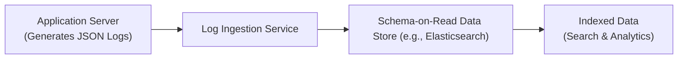
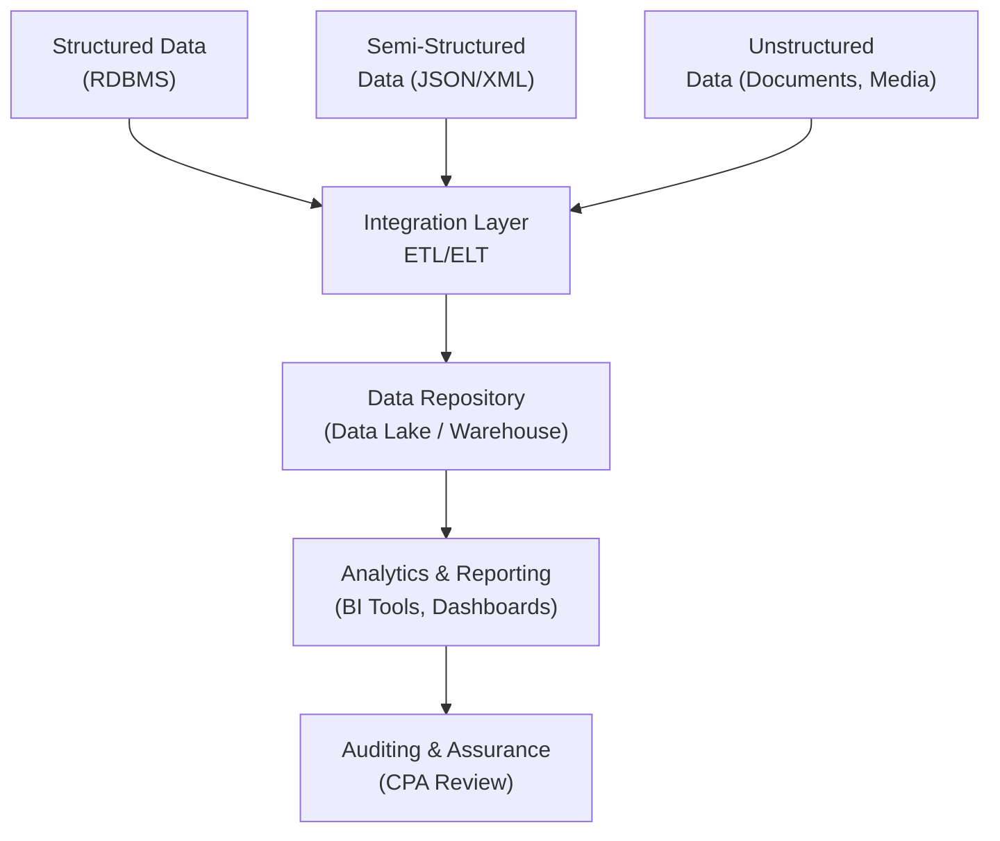

## 13.3 Managing Structured, Semi‑Structured, and Unstructured Data

Effective data management is essential for organizations that must collect, store, analyze, and report increasingly large volumes of information. For CPAs and other accounting professionals involved in Information Systems and Controls (ISC), a foundational understanding of structured, semi-structured, and unstructured data is critical for ensuring accurate and reliable financial reporting, audits, and advisory services. This chapter aims to deepen your knowledge of data management techniques and the challenges of handling different data types in modern IT environments. We also address search and indexing complexities unique to each data category and practical techniques for overcoming them.

This section builds on concepts introduced in Chapter 11 (Data Life Cycle and Governance) and Chapter 14 (Data Integration and Analytics). Together, these chapters equip you with a robust toolkit to navigate the complexities of corporate data ecosystems confidently.

---

### Understanding Different Data Types

At the core of efficient data management is recognizing the different categories of data you may encounter:

• Structured Data  
• Semi-Structured Data  
• Unstructured Data  

Although these categories overlap in practice, understanding their key characteristics helps in designing effective data storage, retrieval, and governance strategies.

---

### Structured Data

Structured data typically resides in fixed fields within records or files, often contained in relational databases (e.g., SQL Server, Oracle, MySQL). Some characteristics of structured data include:

• Predefined Schema: Tables, rows, and columns define how data is stored and accessed.  
• Ease of Querying: SQL (Structured Query Language) can be used to retrieve and manipulate data.  
• Data Validation: Constraints such as primary keys and data types maintain data integrity.

#### Common Use Cases

• Financial Transaction Records: The ledgers and journal entries in an ERP system or Accounting Information System (see Chapter 6) typically use structured data to ensure consistency and control over financial transactions.  
• Customer Relationship Management (CRM) Databases: Most CRM solutions rely on structured tables to standardize customer data (names, addresses, phone numbers, purchase details, etc.).  
• Inventory Management: Product codes, supplier IDs, and quantity fields are structured to facilitate real-time queries and automated reordering logic.

#### Advantages and Challenges

• Advantages:  
  – Fast, well-defined queries (via SQL).  
  – Easy integration with business intelligence tools (OLAP cubes, dashboards).  
  – Strong data integrity support (constraints, foreign keys).  

• Challenges:  
  – Limited flexibility when schemas need updates or expansions.  
  – Typically unsuitable for large volumes of irregular or free-form data.  

---

### Semi-Structured Data

Semi-structured data maintains certain organizational properties (e.g., tags, key-value pairs) but does not fit entirely into rigid relational models. A common example is JSON (JavaScript Object Notation) logs, which are widely used in web and cloud applications to capture application events, user interactions, or system alerts.

#### Characteristics

• Flexible Schema on Read: Unlike relational databases where the schema is enforced at write time, many semi-structured data stores allow flexible structures that adapt to evolving data fields.  
• Hierarchical or Tag-Based Organization: Elements are packaged in nested structures (XML files, JSON, or YAML).  
• Rapidly Changing Fields: As the application modifies how data is captured, new fields can appear without requiring changes to a relational schema.

#### Common Use Cases

• JSON Logs or Documents: Modern applications often store log data and metrics in JSON format, facilitating easier transport, parsing, and analytics.  
• IoT Data Streams: Sensor readings frequently arrive in flexible key-value pairs (e.g., device_id, temperature, location).  
• Data Interchange: XML-based B2B data transactions or JSON-based APIs across different services.

#### Advantages and Challenges

• Advantages:  
  – Flexible structure that evolves without major migrations.  
  – Continued ability to extract meaningful relationships using specialized query engines (e.g., Elasticsearch, MongoDB).  
  – Potentially more efficient for storing certain hierarchical or nested data.  

• Challenges:  
  – Can still require advanced indexing to achieve efficient queries, especially for large amounts of JSON logs.  
  – Lack of strict schema enforcement can lead to inconsistent data if governance is weak.  
  – More complex analytics queries compared to structured data.

---

### Unstructured Data

Unstructured data consists of information without a predefined model or schema. This category covers a wide range of content:

• Textual Data: Emails, social media posts, PDF documents, Word files.  
• Multimedia Data: Images, videos, audio recordings.  
• Complex Collections: Large data repositories of medical imaging for healthcare audits or security footage in compliance reviews.

#### Characteristics

• No Uniform Structure: Data lacks formal schemas or consistent tagging.  
• High Volume: Often involves large file sizes (videos, high-resolution images).  
• Challenging Retrieval: Simple text search might be insufficient; specialized solutions (e.g., optical character recognition, video indexing) are needed.

#### Common Use Cases

• Document Management Systems (DMS): Invoices, contracts, and other internal documentation stored for compliance or reference.  
• Email Archives: Large volumes of messages that might need to be retrieved for litigation support or audit evidence.  
• Social Media Analytics: Tweets, Facebook posts, and other social data used for sentiment analysis, brand monitoring, or forecasting.

#### Advantages and Challenges

• Advantages:  
  – Potentially huge source of insights, especially when combined with advanced analytics and machine learning techniques.  
  – Can capture qualitative aspects that structured data might miss (e.g., context in an email).  

• Challenges:  
  – Difficult to analyze at scale without advanced tools.  
  – Storage planning can be complex given the size and format variability.  
  – Governance and classification require automated tagging or sophisticated content understanding.

---

### Relevance for CPAs and Auditors

In the modern business environment, CPAs must be prepared to handle data from multiple sources with diverse formats. Some key considerations:

• Audit Trail Verification: System logs (often semi-structured) are increasingly critical evidence for verifying transaction flows and identifying anomalies.  
• Regulatory Compliance: Data privacy regulations (GDPR, HIPAA) apply to all data formats. Ensuring protected information is handled correctly requires robust governance frameworks.  
• Business Process Efficiency: Automating data processing can improve accuracy in financial statements, especially where unstructured data (e.g., invoice PDFs) needs to be recognized, validated, and recorded.  
• Due Diligence: Mergers and acquisitions often require analyzing unstructured or semi-structured data from multiple departments or sources.

---

### Indexing and Search Complexities

#### Structured Data Indexing

For data stored in relational databases, indexing strategies typically involve B-tree or hash-based indexes on structured fields. Queries can quickly locate the data using well-defined keys or combinations (e.g., indexing on invoice_number for AP Queries). CPAs might encounter issues with:

• Over-Indexing: Having too many indexes can slow down inserts and updates.  
• Under-Indexing: Poor indexing can degrade query performance, especially for large transaction volumes (e.g., millions of ledger entries).  
• Partitioning: Large datasets may be horizontally partitioned (sharded) across different servers to handle concurrency and improve performance.

#### Semi-Structured Data Indexing

Semi-structured sources like JSON logs or XML files typically undergo indexing in specialized data stores (e.g., Elastic Stack, MongoDB). Key complexities include:

• Nested and Dynamic Fields: JSON documents can have nested or newly introduced fields, requiring dynamic field indexing strategies.  
• Parsing Overhead: Some data stores must parse each JSON record to build indexes, which can be time-consuming for high-velocity log data.  
• Full-Text Search Integration: Semi-structured data often includes partial free-form text that needs advanced indexing (inverted indexes) for effective searching.

Below is a conceptual diagram illustrating how semi-structured data (JSON logs) might be ingested and indexed in a modern system:

#### Unstructured Data Indexing

Indexing unstructured material is more complex. Advanced tools like Apache Lucene (the core of Elasticsearch) or specialized content management systems parse text to build inverted indexes. Multimedia data often requires metadata extraction or AI-based tagging:

• Document Parsing: OCR (Optical Character Recognition) for scanned PDFs or images to produce text for indexing.  
• Natural Language Processing (NLP): Used for sentiment analysis, entity extraction, and topic modeling.  
• Metadata Repositories: Systems store and index metadata (e.g., file name, creation date, author, or format) to enable faster searches.

---

### Practical Examples and Case Studies

#### Example 1: Large-Scale Invoice Management

A global manufacturing company receives thousands of invoices each month in different formats (some in PDF, some from EDI streams in semi-structured format). The company:

1. Uses an OCR tool to convert each invoice PDF into searchable text.  
2. Extracts key invoice fields (structured data such as invoice number, date, etc.) and sends them to the ERP system.  
3. Stores the original PDF in a content management system, enabling advanced searches on text or metadata.  
4. Employs an indexing strategy combining a relational database for structured fields and a separate search engine for faster text queries across the unstructured documents.

This approach ensures timely payment processing, stronger internal controls, and quick retrieval of specific invoices during external audits.

#### Example 2: Financial Forensic Analysis with Log Data

An e-commerce enterprise processes millions of daily transactions. To detect anomalous web transactions or fraudulent behavior:

1. The website generates JSON logs capturing user IDs, timestamps, transaction details, and IP addresses.  
2. These logs flow into a specialized big-data repository, such as a NoSQL database or Elasticsearch cluster.  
3. Advanced indexing allows investigators in the accounting and internal audit department to quickly search for suspicious patterns (e.g., repeated transactions from the same IP, excessive chargebacks).  
4. Visual dashboards built on top of the indexed logs provide real-time detection, aligning with the enterprise’s governance and risk management framework (see Chapters 3 and 4).

#### Example 3: Unstructured Email Analysis in Mergers

During the due diligence phase of a merger, a company must evaluate email correspondence for compliance and potential legal or regulatory issues:

1. Emails, traditionally unstructured, are ingested into an enterprise archive system.  
2. The system extracts metadata (sender, recipient, subject, date) and indexes email bodies for text searches.  
3. Powerful search capabilities enable lawyers and auditors to search for references to specific keywords or individuals, drastically simplifying compliance checks.  

The result is a more efficient legal discovery process and reduced risk of overlooking critical information.

---

### Best Practices for Managing Diverse Data Types

1. Data Classification and Governance  
   – Establish clear data classification frameworks (refer to Chapter 11) that address compliance obligations and internal policies.  
   – Document how each classification level (e.g., confidential, restricted, public) applies to structured, semi-structured, and unstructured data sources.

2. Consistent Metadata and Taxonomies  
   – For unstructured and semi-structured data, create standard naming conventions (e.g., file naming, folder structures) and optionally tagging guidelines.  
   – Consider metadata repositories to catalog data location, usage, and owners.

3. Appropriate Data Storage Technologies  
   – Use relational databases for stable, frequently queried structured datasets.  
   – Adopt NoSQL or specialized document databases for flexible and rapidly changing data.  
   – Employ search engines or distributed file systems for large-scale unstructured data.

4. Index Strategically  
   – Balance indexing needs with performance overhead.  
   – Consider partial indexing for large logs, focusing on critical fields while archiving older data.  
   – Regularly analyze query patterns to optimize or revise index strategies.

5. Data Quality Assurance  
   – Implement validation checks on ingestion (for example, ensuring date formats are correct and required fields are present).  
   – Use data profiling and cleansing utilities to maintain consistent records across multiple data types.

6. Security and Access Management  
   – Leverage role-based access controls (RBAC) (see Chapter 18) to protect sensitive data, ensuring only authorized personnel can view or query certain data subsets.  
   – For unstructured or semi-structured data, integrate solutions that provide encryption at rest and in transit.

7. Automated Archiving and Retention  
   – Set up automated archival policies that transfer older data to cheaper storage solutions if it is not frequently accessed (e.g., cold storage for logs older than 90 days).  
   – Define data retention schedules aligned with regulatory requirements (e.g., Sarbanes-Oxley Act or local data protection laws).

8. Continual Monitoring and Optimization  
   – Routine performance audits on indexing strategies.  
   – Implement real-time monitoring solutions to track data usage patterns and infrastructure load.  
   – Evaluate the cost-effectiveness of storing data in certain formats or platforms as business requirements evolve.

---

### Potential Pitfalls and Challenges

1. Data Silos: Different departments may store data in various formats with minimal coordination, hindering cross-functional analysis.  
2. Compliance Risks: Without proper classification and data lifecycle oversight, sensitive data might be overlooked when responding to subpoenas or fulfilling regulatory obligations.  
3. Inadequate Governance: Lack of consistent policies on metadata, naming conventions, or version control can result in duplications and confusion.  
4. Skill Gaps: Specialized indexing or data analytics platforms (e.g., Elastic Stack, Hadoop, NoSQL) require new skills, which may be unfamiliar to traditional CPA roles.  
5. Performance Bottlenecks: Insufficient resources—memory, processing power, or network bandwidth—can hamper ingestion pipelines or indexing tasks.

---

### Visualizing Data Management Strategies

The following diagram provides a simplified overview of an enterprise data management flow that includes structured, semi-structured, and unstructured data types:

In this flow:
• Structured, semi-structured, and unstructured data sources feed into an integration layer that processes the data (through ETL/ELT frameworks).  
• A central repository (data lake, data warehouse, or hybrid) consolidates all data in raw or refined form.  
• Business Intelligence (BI) and analytics tools provide insights, while auditors perform assurance procedures on the data’s accuracy and completeness.

---

### Conclusion

Managing structured, semi-structured, and unstructured data effectively is no small feat—yet it is increasingly pivotal for organizations navigating complex regulatory obligations and the need for real-time business intelligence. CPAs and finance professionals with hands-on knowledge of data management strategies, governance principles, and indexing solutions can deliver more comprehensive audits and strategic insights. By maintaining robust data classification protocols, optimizing indexing practices, and fostering a culture of continuous monitoring and improvement, businesses can transform raw, diverse datasets into valuable information assets.

Stay current on emerging technologies such as machine learning and natural language processing, as they continue to expand how organizations handle unstructured and semi-structured data. Combining technical awareness with strong governance principles will ensure financial professionals remain trusted partners in data-driven decision-making—and well-prepared for the evolving demands of the modern marketplace.

---

## Test Your Knowledge: Managing Structural Diversity of Data



### Which of the following best describes semi-structured data?

- [ ] Data stored in relational tables with fixed columns and rows.  
- [x] Data with a flexible schema often stored in formats like JSON or XML.  
- [ ] Multimedia content such as images or audio files without consistent structure.  
- [ ] Digitized financial forms stored in plain text format.  

> **Explanation:** Semi-structured data is partially organized (often in a hierarchical or tag-based format) but not rigidly confined to tables and rows. JSON and XML logs are common examples.

---

### Which of the following is NOT typically considered a characteristic of structured data?

- [ ] Highly organized data fields.  
- [ ] Easily queried using SQL.  
- [ ] Rigid schema enforcement.  
- [x] Free-form text with no defined schema.  

> **Explanation:** Structured data adheres to well-defined schemas enforced by relational databases. Free-form text without a schema is generally unstructured or semi-structured.

---

### In a CPA firm’s forensic investigation, the logs from an online store are stored in JSON. Why is this data classified as semi-structured?

- [x] They contain tags and fields but are not stored in fixed table structures.  
- [ ] The data volume is too large for standard relational databases.  
- [ ] They cannot be queried by any form of SQL.  
- [ ] JSON logs contain only unstructured data.  

> **Explanation:** JSON logs have a flexible tag-based format that does not rely on the rigid rows/columns of relational systems, making them semi-structured.

---

### Which of the following best illustrates unstructured data?

- [ ] Daily sales transactions in a relational database.  
- [ ] Detailed inventory statuses in nested JSON documents.  
- [x] Email archives containing plain text messages, images, and attachments.  
- [ ] Key-value pair data streams from IoT sensors.  

> **Explanation:** Emails (with or without images, file attachments, etc.) are classic examples of unstructured data due to their variable, free-form content.

---

### What is one primary benefit of employing role-based access controls (RBAC) for unstructured data repositories?

- [x] Restricting the ability to view sensitive documents based on the user’s role.  
- [ ] Automatically converting unstructured data to structured format.  
- [x] Ensuring that only authorized personnel can read confidential documents.  
- [ ] Generating a formal schema that the unstructured data must follow.  

> **Explanation:** RBAC enforces security by assigning permissions based on organizational roles, preventing unauthorized users from accessing sensitive data.

---

### Over-indexing in structured data environments can lead to which negative outcome?

- [x] Slowed transaction performance due to extra overhead on writes.  
- [ ] Loss of data integrity due to schema discrepancies.  
- [ ] Omission of important data fields from search results.  
- [ ] Enhanced system performance due to more refined queries.  

> **Explanation:** While indexes can speed up reads, excessive indexing can slow down updates and inserts because each index must be maintained whenever data is written.

---

### When indexing large JSON files, which factor is most critical for performance?

- [x] Parsing overhead to identify all fields for indexing.  
- [ ] Ensuring all data is converted to relational tables first.  
- [ ] Disabling full-text indexing to speed queries.  
- [ ] Restricting the maximum size of the JSON file to 1 MB.  

> **Explanation:** JSON logs often feature nested structures, and each field must be parsed before indexing. The time and resources required for parsing can impact performance significantly.

---

### What is a key challenge in working with unstructured data?

- [ ] Fields cannot be nested in hierarchical structures.  
- [x] Information retrieval often requires advanced tools like NLP or OCR.  
- [ ] It is highly consistent and predictable in format.  
- [ ] Databases cannot store unstructured data in any form.  

> **Explanation:** Unstructured data varies widely in format (emails, PDFs, images, audio, etc.), requiring more complex techniques such as NLP or OCR to make it searchable and analyzable.

---

### A manufacturing company wants to store maintenance reports, some in PDF form and others as JSON logs. Which approach most effectively manages both formats?

- [ ] Converting all PDF files to structured tables by manual reentry.  
- [x] Using a combination of a full-text search engine for PDFs and a NoSQL database for JSON logs.  
- [ ] Storing everything in a single relational table.  
- [ ] Refusing to store unstructured data to avoid complexity.  

> **Explanation:** PDFs require a text-based search solution that can handle free-form content, while JSON logs can be handled efficiently by a NoSQL or document-based database that can manage dynamic fields.

---

### True or False: Under-indexing can negatively impact query performance when dealing with large transactional datasets.

- [x] True  
- [ ] False  

> **Explanation:** With too few or poorly designed indexes, queries can become very slow, especially when they must scan large volumes of transactional data.



---

## For Additional Practice and Deeper Preparation

### [Information Systems and Controls (ISC)](https://www.udemy.com/course/isc-cpa-mock-exams/?referralCode=E1217303222935C5E464)

**Information Systems and Controls (ISC) CPA Mocks:** 6 Full (1,500 Qs), Harder Than Real! In-Depth & Clear. Crush With Confidence!

- Tackle full-length mock exams designed to mirror real ISC questions.  
- Refine your exam-day strategies with detailed, step-by-step solutions for every scenario.  
- Explore in-depth rationales that reinforce higher-level concepts, giving you an edge on test day.  
- Boost confidence and minimize anxiety by mastering every corner of the ISC blueprint.  
- Perfect for those seeking exceptionally hard mocks and real-world readiness.

_Disclaimer: This course is not endorsed by or affiliated with the AICPA, NASBA, or any official CPA Examination authority. All content is for educational and preparatory purposes only._
