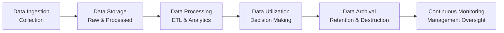

## 13.4 Governance Challenges in Big Data

Big data has ushered in a new era of opportunity for organizations across every industry. The ability to collect, process, and analyze colossal amounts of data in near-real-time opens the door to incisive strategic insights, predictive analytics, and next-generation customer experiences. However, alongside these transformative capabilities arise a myriad of governance challenges. These challenges revolve around managing massive data volumes responsibly, ensuring regulatory compliance, and maintaining stakeholder trust through robust security measures and privacy safeguards.

This section explores some of the most pressing governance challenges in big data today, supplemented by real-world examples of data mishandling, best practices for risk mitigation, and practical frameworks to guide compliance and responsible data use. For deeper explorations on data life cycles and governance structures, see Chapter 11: Data Life Cycle and Governance. Readers should also consult Chapter 19: Data Confidentiality and Privacy Controls for a more detailed discussion on safeguarding sensitive information.

Introduction to Big Data Governance

In a big data environment, governance is more than a one-time policy exercise – it’s an ongoing, dynamic process. Data can come from disparate sources (internal systems, social media feeds, IoT devices, third-party data aggregators, cloud-based services, etc.), leading to operational complexity, compliance risks, and potential security vulnerabilities. Poor governance practices may result in inaccurate data analytics, legal repercussions, or reputational harm.

Governing big data effectively requires:

• Establishing clear accountability over data quality and security.  
• Defining policies that reflect both regulatory requirements and ethical considerations.  
• Implementing controls that maintain data confidentiality and integrity throughout its life cycle.  
• Continuously monitoring and adjusting governance approaches to account for evolving threats and organizational goals.

The Complexity of Big Data

Big data is characterized by four major “V” dimensions: volume, velocity, variety, and veracity. Each of these magnifies governance concerns:

• Volume. The sheer size of data sets can overwhelm traditional processing and storage solutions, straining existing controls and audit processes.  
• Velocity. Rapid data generation and real-time analysis can outpace governance updates, requiring automated, agile control mechanisms.  
• Variety. Structurally diverse data (structured, semi-structured, unstructured) demands flexible governance frameworks capable of handling everything from text logs to images and video.  
• Veracity. Data quality and integrity can be challenging to maintain when ingestion pipelines run continuously and data sources vary widely in reliability.

These challenges complicate basic corporate governance principles defined by frameworks like COSO’s Internal Control Integrated Framework or COBIT 2019. Although these frameworks remain indispensable reference points, big data environments call for extended processes, advanced technologies, and heightened vigilance.

Privacy Considerations

Privacy has become a fundamental governance priority in the era of big data. As data sets grow, they often include personally identifiable information (PII) or sensitive stakeholder data. Privacy regulations, such as the General Data Protection Regulation (GDPR) in the European Union and the California Consumer Privacy Act (CCPA) in the United States, have underscored the importance of:

• Consent Management. Users must be aware of and agree to how their data is collected and used.  
• Right to be Forgotten. Individuals have the right to request erasure of their data under certain circumstances.  
• Data Minimization. Organizations should only collect the data they need for a stated purpose, retaining it only as long as necessary.  
• Transparent Data Use. Communicating clearly how data is used to generate insights, targeting marketing campaigns, or improving services.

Ensuring compliance often requires cross-disciplinary support from legal, IT, and operations teams. From a CPA’s perspective, privacy is also linked to reputational risk and consumer trust, both of which have direct financial implications for the organization.

Security Challenges at Scale

Security is a core pillar of data governance. In big data scenarios, expanding data repositories and fast-paced analytics pipelines create a broader attack surface. Hackers and cybercriminals view large data stores as high-value targets, making robust security essential. With reference to topics in Chapter 16: Foundations of Cybersecurity and Chapter 19: Data Confidentiality and Privacy Controls, key considerations include:

• Authorization and Access Control. Implement role-based access and the principle of least privilege, ensuring only necessary personnel have clearance to sensitive data.  
• Encryption at Rest and In Transit. Large-scale encryption strategies are vital to protect data flows among distributed systems, cloud environments, and on-premises data centers.  
• Monitoring and Incident Response. Continual network and activity monitoring allows early detection of suspicious behavior, while a well-prepared incident response plan minimizes fallout from potential breaches.  
• Third-Party Vendor Risks. Many organizations rely on third-party platforms to manage, process, or store data. Comprehensive vendor risk assessments and mandatory security controls can mitigate vulnerabilities.

Regulatory Compliance and Oversight

A substantial element of big data governance is maintaining compliance with varying international, federal, and industry-specific regulations:

• Cross-Border Data Transfers. Large, multinational organizations must understand encryption standards, allowable data exports, and possible restrictions on storing EU data outside the EU.  
• Sector-Specific Requirements. Industries like healthcare (HIPAA), finance (GLBA), and payment processing (PCI DSS) have stringent data security mandates.  
• Transparency and Accountability. Regulators expect organizations to produce audit trails, incident logs, and track the chain-of-custody for sensitive data sets.  

Oversight boards or committees within organizations may also impose internal guidelines that can be stricter than baseline regulatory standards. Properly documented governance policies enable management to communicate guidelines effectively and track compliance with minimal ambiguity.

Real-World Examples of Data Mishandling

Cambridge Analytica–Facebook Scandal  
In 2018, a now-defunct political consulting firm gained unauthorized access to the personal data of millions of Facebook users. Originally collected under the guise of an academic research project, the data was later used to build detailed voter profiles. This scandal highlighted:  
• How quickly data can be repurposed beyond its original intent.  
• The importance of transparent data-sharing agreements and user consent.  
• The reputational damage and lawsuits that can result from poor big data governance.

Equifax Breach  
In 2017, a massive breach at Equifax exposed personal data of over 140 million individuals. Attackers exploited known vulnerabilities in a web application, and Equifax’s lack of timely patching underscored critical governance lapses, including:  
• Poor patch management and insufficient vulnerability assessments.  
• Limited oversight of potential insecure configurations.  
• Delayed incident response and disclosure, damaging public trust and leading to regulatory scrutiny and fines.

Several other incidents, from healthcare data leaks to large-scale retail credit card breaches, reinforce the continuing imperative for properly governed big data ecosystems.

Data Governance Lifecycle

Organizations should apply governance principles throughout the overarching data lifecycle, from initial ingestion through to archival or deletion. This continuous approach demands proactive, consistent monitoring and updates to policies and controls. The following diagram illustrates a typical high-level big data lifecycle, showing where governance checkpoints can be applied:

• Data Ingestion/Collection. Enforce data classification upon entry, applying metadata tags for privacy levels, confidentiality ratings, and appropriate handling.  
• Data Storage. Encrypt data and segment storage environments based on sensitivity.  
• Data Processing (ETL & Analytics). Implement secure pipelines, track transformations, and create logs that establish an auditable trail of data usage.  
• Data Utilization. Enforce role-based controls, ensuring only authorized personnel can derive insights from sensitive data.  
• Data Archival / Retention & Destruction. Apply retention policies aligned with regulatory timelines; securely delete or purge data after its required retention period.  
• Continuous Monitoring / Management Oversight. Use automated tools to assess data flows, detect policy violations, and initiate timely remediation steps.

Frameworks for Governance

Several frameworks can guide big data governance implementation. COBIT 2019 (discussed in Chapter 3: Governance, Frameworks, and Regulatory Environment) emphasizes policy development, process optimization, and performance metrics. COSO ERM (Chapter 3.2) extends risk management concepts to digital environments. Meanwhile, ISO/IEC 38500 offers principles for effective IT governance, and NIST (National Institute of Standards and Technology) provides a wealth of standards for security controls. Mixing and matching elements from these frameworks is common practice, provided careful alignment with organizational needs and regulatory obligations.

Common Governance Pitfalls

• Lack of Organizational Buy-In. Governance programs can crumble without executive sponsorship and a clear “tone from the top.”  
• Data Silos and Fragmented Ownership. Decentralized big data environments can result in duplicated efforts and lack of transparency over data flows.  
• Overcomplicated Policies. Excessively complex rules or unscalable manual workflows hamper adoption. Governance solutions should balance rigor with usability.  
• Insufficient Training. Employees need consistent education about data handling procedures, potential threats, and best practices.  

Best Practices for Effective Big Data Governance

• Establish a Data Governance Body. A dedicated governance committee (or multiple committees) ensures policies remain aligned with business objectives, compliance requirements, and evolving threats.  
• Integrate Governance with Analytics Workflows. Consider how analytics teams interact with data in real time. Embedding governance checks in continuous integration/continuous deployment (CI/CD) pipelines helps maintain compliance.  
• Embrace Automation. AI-driven tools and automated data cataloging systems can accelerate data classification, identify anomalous usage patterns, and streamline compliance.  
• Adopt Data Stewardship Roles. Assign data stewards who collaborate with compliance officers to oversee daily data operations, ensuring alignment with a broader governance framework.  
• Implement “Privacy by Design.” Incorporate privacy considerations from the start of product development or system implementation.  
• Monitor Regularly. Conduct periodic reviews that test the adequacy of controls, patch management, and vendor adherence to security requirements.

Practical Financial Examples

• Predictive Budgeting. Government agencies using big data for budgeting forecasts must handle sensitive taxpayer data with vigilance. Ensuring data traceability from submission through predictive modeling is critical to retaining public trust.  
• Customer Credit Scoring. Financial institutions use big data to refine credit models. Inaccuracy or mishandling of consumer loan applications can lead to regulatory fines and reputational harm if consumers are wrongly scored due to ungoverned data.  
• Mergers and Acquisitions. In large-scale acquisitions, data sets from multiple organizations merge. Proper governance ensures that the combined entity follows consistent privacy and security rules, preventing vulnerabilities and compliance lapses.  

Conclusion

Big data brings unprecedented advantages for organizations eager to leverage analytics-driven insights. However, it also amplifies existing governance challenges, requiring robust, carefully orchestrated processes. Regardless of industry, entity size, or level of technology adoption, effective governance is a core linchpin of responsible data management. By deploying a proactive approach—combining regulatory knowledge, internal controls, and ethical considerations—organizations can transform big data from a looming liability into a well-managed, valuable strategic asset.

Below you will find a set of quiz questions to test your understanding of key governance concepts in massive data environments. Continue refining your knowledge with cross references to Chapter 14 for data integration details and Chapter 17 for more network-level security considerations.

## Big Data Governance Knowledge Quiz



### Effective data governance in big data requires which of the following measures to address volume, velocity, variety, and veracity?

- [x] Comprehensive controls that are adaptable, process-driven, and continuously monitored  
- [ ] Strict reliance on manual audits across all data workflows  
- [ ] Minimizing the use of encryption to speed up data analytics  
- [ ] Complete elimination of real-time ingestion to simplify systems  

> **Explanation:** Massive data sets generated at high speeds and from assorted sources demand flexible governance frameworks. This typically requires automated controls, ongoing monitoring, and reliable encryption methods.  

### What is a key privacy principle under regulations like GDPR?

- [x] Data minimization  
- [ ] Collecting data indefinitely for any possible future use  
- [ ] Sharing personal data without consent to improve analytics  
- [ ] Password reuse for multiple accounts  

> **Explanation:** Regulations such as GDPR emphasize collecting only the data that is strictly necessary for stated purposes. The principle of data minimization helps prevent unnecessary storage of sensitive or irrelevant personal data.  

### Which practice best protects sensitive data across its life cycle in big data environments?

- [x] Consistent encryption of data at rest and in transit  
- [ ] Storing all data in a single spreadsheet without password protection  
- [ ] Granting open access to all employees for innovation purposes  
- [ ] Relying solely on a firewall for cybersecurity  

> **Explanation:** Encryption at rest and in transit is crucial in safeguarding data. Coupled with layered security and access control, encryption helps protect against unauthorized access or data exposure.  

### What critical oversight was highlighted by the Equifax breach?

- [x] Delayed or insufficient patch management can lead to large-scale vulnerabilities  
- [ ] Having multiple network firewalls is unnecessary and overcomplicates security  
- [ ] Targeted penetration tests invalidate the need to patch known software flaws  
- [ ] Customer data is too large to meaningfully secure  

> **Explanation:** The Equifax breach demonstrated that failing to regularly patch known software vulnerabilities can result in catastrophic data exposure, underscoring the need for robust, timely security updates.  

### Which statement accurately describes the “privacy by design” philosophy?

- [x] Incorporate privacy considerations throughout the entire system development lifecycle  
- [ ] Implement privacy measures only after a major data breach to show remorse  
- [x] Evaluate user data needs and potential risks before deploying features  
- [ ] Focus on revenue generation over data security  

> **Explanation:** Privacy by design integrates privacy into processes, products, and applications right from the initial design phase. This includes building controls and evaluating privacy impacts before new features go live.  

### In big data environments, what is one reason automating data governance through AI and ML tools is beneficial?

- [x] Automated tools can detect anomalies and apply consistent classification at scale  
- [ ] It completely eliminates the need for human oversight  
- [ ] Automation only applies to advanced analytics, not governance  
- [ ] It bypasses the need for encryption protocols  

> **Explanation:** Automated classification and anomaly detection tools can greatly assist in managing large, dynamic data repositories, enhancing early threat detection and policy enforcement. Human oversight remains essential, but automation supplies efficiency and consistency.  

### Which of the following is a common pitfall in big data governance?

- [x] Fragmented ownership of data and siloed management practices  
- [ ] Clear communication of data responsibilities  
- [x] Having a well-defined data dictionary and lineage tracking  
- [ ] Ongoing training programs  

> **Explanation:** When data is scattered across departments or platforms (often referred to as “data silos”), responsibilities can become unclear, risking compliance and integrity issues. Consolidated governance frameworks help mitigate these silos.  

### Why is third-party vendor risk particularly concerning in big data projects?

- [x] External parties might have less stringent data protection measures, increasing potential vulnerabilities  
- [ ] The risk is identical to in-house operations, so vendor oversight is unnecessary  
- [ ] Vendors generally take total responsibility for data governance  
- [ ] Third parties are exempt from data breach notifications  

> **Explanation:** Third-party service providers may not apply the same level of security rigor as the primary organization, necessitating contractually mandated security controls, oversight, and regular audits to ensure compliance.  

### Which scenario best illustrates a real-world misuse of big data?

- [x] Unauthorized use of personal data for profiling and influencing voter behavior  
- [ ] Using anonymized data sets strictly for internal improvements  
- [ ] Complying with all regional privacy regulations  
- [ ] Encrypting sensitive information before analysis  

> **Explanation:** The Cambridge Analytica–Facebook scandal is an excellent example of unauthorized data usage where personal data was allegedly harvested and exploited to influence voter behavior, violating key privacy principles.  

### Data governance policies should be:

- [x] True  
- [ ] False  

> **Explanation:** Data governance policies should be dynamic, meaning they evolve as regulations, technologies, and organizational objectives change. Static or outdated policies fail to address emerging risks associated with big data growth.  



## For Additional Practice and Deeper Preparation

### [Information Systems and Controls (ISC)](https://www.udemy.com/course/isc-cpa-mock-exams/?referralCode=E1217303222935C5E464)

Information Systems and Controls (ISC) CPA Mocks: 6 Full (1,500 Qs), Harder Than Real! In-Depth & Clear. Crush With Confidence!

• Tackle full-length mock exams designed to mirror real ISC questions.  
• Refine your exam-day strategies with detailed, step-by-step solutions for every scenario.  
• Explore in-depth rationales that reinforce higher-level concepts, giving you an edge on test day.  
• Boost confidence and minimize anxiety by mastering every corner of the ISC blueprint.  
• Perfect for those seeking exceptionally hard mocks and real-world readiness.

_Disclaimer: This course is not endorsed by or affiliated with the AICPA, NASBA, or any official CPA Examination authority. All content is for educational and preparatory purposes only._
