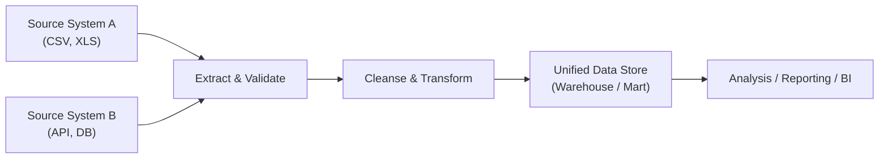

## 14.1 Combining Data from Disparate Sources for Analysis

Data analysis often involves pulling information from multiple systems, files, and data stores. For CPAs and financial professionals, reconciling these various data sets in a meaningful way is critical for tasks such as financial reporting, profitability analysis, audit testing, compliance monitoring, and strategic insights. This section addresses how to combine data from disparate sources into a unified platform for timely, relevant, and accurate analysis. We will look at the significance of data integration, typical pitfalls (including inconsistent data formats, missing fields, and heterogeneous system architectures), and best-practice data cleansing and transformation steps. The concepts presented here form the bedrock for advanced analytics and continuous auditing covered elsewhere in this guide.

Building on data management principles from Chapter 11 (Data Life Cycle and Governance), Chapter 13 (Data Warehousing and Big Data Environments), and preceding topics in Chapter 12 (Database Structures and Administration), this section provides an in-depth look at the processes and controls necessary to ensure successful data blending across a range of environments and applications (e.g., ERP systems, CRM platforms, e-commerce portals, or custom in-house applications).

## Importance of Disparate Data Integration

Modern organizations rely on a variety of technologies to record, store, and process data. In the context of financial audits, a CPA may need to analyze data drawn from one system for inventory, another for accounting, and yet another for point-of-sale transactions. The ability to reconcile these sources efficiently and accurately can make or break the reliability of reported financial information.

• Comprehensive Decision-Making: Access to complete, unfragmented data enables deeper insights and better-informed decisions. Auditors gain confidence in the completeness and accuracy of data when they can track transactions through disparate systems.  
• Efficiency Gains: Automated and well-controlled integration can significantly reduce manual intervention, decreasing the chance for errors while improving turnaround times for monthly, quarterly, or annual reporting.  
• Risk Management: When data exists in silos and is inconsistently processed, the risks of omission, duplication, and contradiction increase. A unified approach reduces oversights and fosters an environment of consistent control and governance.  
• Regulatory Compliance: Many regulations and standards require data traceability, transparency, and accuracy. A robust integration framework facilitates compliance with regulations such as the Sarbanes-Oxley Act (SOX), the General Data Protection Regulation (GDPR), and others highlighted in Chapter 3.  

## Typical Challenges and Pitfalls

Combining data from varied sources is rarely straightforward. Each system may have its own data format, timestamps, versioning, and validation logic. Some systems may store numeric fields in text form, or produce CSV files with different delimiters, while others may run on older database structures that demand specialized connectors. 

Below are a few common pitfalls:

• Inconsistent Data Formats: Data may come in different file types (CSV, Excel, XML, JSON), or even from external APIs with unique parameter definitions. This inconsistency can introduce parsing errors and reconciliation challenges.  
• Different Data Definitions: Fields may appear to have the same name across different systems (e.g., “TransactionID” or “VendorCode”), but in practice they record different information or follow different naming conventions.  
• Missing or Incomplete Fields: Some data sets may omit certain fields or fill them with null or placeholder values, making it challenging to perform accurate joins or comparisons.  
• Duplicate Records: Consolidating data from multiple sources can lead to duplicated transactions or customer entries if unique identifiers are not well-managed across those systems.  
• Timing Differences and Latency: Data capture schedules may vary, leading to periods where one system’s data is up-to-date while another lags behind. This discrepancy can skew period-end reporting or cause confusion in real-time analyses.  
• Legacy Systems: In certain organizations, older systems are still in use and not well supported by modern integration tools. CPA professionals must adapt to or upgrade these systems to maintain data quality.  
• Security and Privacy Concerns: When combining streams of data that may contain confidential financial or personal information, privacy regulations and confidentiality principles must be carefully considered.  

Understanding these pitfalls is the first step toward implementing robust processes and tools to integrate data from disparate sources securely, consistently, and effectively.  

## Step-by-Step Data Integration Process

While every organization will have its unique data architecture, the following process outlines a typical workflow for combining data from disparate sources:

1. Identify and Document Data Sources  
   The first step is to inventory all the systems, databases, and external applications that create, store, or consume data. Proper documentation helps set expectations around data structures, availability, volume, frequency of updates, and security constraints.

2. Extract Data from Multiple Sources  
   Data is pulled from the source systems, often using specialized connectors, APIs, or standardized formats such as CSV. This “Extract” step in traditional ETL (Extract, Transform, Load) or ELT (Extract, Load, Transform) processes involves verifying user access credentials, scheduling routines, handling concurrency, and ensuring minimal disruption to the source environments.

3. Cleanse and Validate Data  
   During the “Transform” phase, cleaning and validation are the key tasks. This involves removing duplicates, reconciling data formats, standardizing units of measure, handling missing values (e.g., applying imputation or leaving them blank based on the use-case), and ensuring metadata consistency. Proactive data profiling techniques help identify anomalies, such as out-of-range values or potential data entry errors.

4. Transform Data for a Common Schema  
   Converting data to a standardized format, known as a canonical model or common schema, helps unify the disparate data sets. For example, currency fields in different modules might be converted to a single currency for consolidated financial statements. Product categories from an online store might be mapped to the official chart of accounts for uniform reporting.

5. Load Data into Target or Integrated Storage  
   The final data is placed into a data warehouse, data mart, data lake, or integrated transaction system for further analysis. Phase “Load” ensures that the data is recorded in a safe, structured manner, often accompanied by indexing and partitioning strategies to optimize performance.  

6. Data Governance and Security Checks  
   Effective governance includes assigning data owners, applying role-based access controls, maintaining audit trails, and ensuring that privacy rules (e.g., GDPR) are upheld. This step is continuous rather than simply the last in the process.  

The following Mermaid flowchart provides a conceptual view of a typical data integration workflow:

In this diagram:  
• Source System A and Source System B represent two disparate data sources.  
• Extract & Validate (Node B) is where data is initially read into the integration layer.  
• Cleanse & Transform (Node C) is the step for eliminating duplicates, correcting data formats, and creating a consistent schema.  
• Unified Data Store (Node E) represents data storage where integrated information is housed, ready for end reporting or deeper analytics.  
• Analysis / Reporting / BI (Node F) is the environment in which all data from multiple sources is finally combined, visualized, and interpreted.  

## Data Cleansing Steps

Data cleaning is a foundational aspect of any integration project. For CPA professionals, special attention to data accuracy and completeness is imperative for reliable financial statements and audits. Typical data cleansing steps include:

• Removing Invalid Records: Filter out records that do not meet validation rules (e.g., negative quantity in a sales order if not logically acceptable).  
• Correcting Inconsistent Fields: For instance, standardize date formats (MM/DD/YYYY vs. DD/MM/YYYY), unify text case for names, or ensure consistency in naming conventions (e.g., “S&P 500” vs. “SP500”).  
• Managing Missing Data: Either remove incomplete data (if minimal and irrelevant), fill gaps using estimated values or default placeholders, or flag them as incomplete and route them for manual review. The choice depends on the nature of the analysis.  
• Addressing Duplicate Entries: Consolidate records that appear multiple times within the integrated data set using robust matching criteria (e.g., comparing multiple fields such as name, address, or unique transaction identifiers).  
• Validation with Business Logic: Use rules relevant to finance and accounting, such as verifying that the sum of journal entries in a batch is zero, or that revenue entries match known price lists. These checks reduce the number of erroneous records that could mislead an audit or subsequent analysis.  

**Example Case Study:**  
Consider a retail organization with both an online store and a network of physical stores, each using a different sales management system. After extracting the daily sales data from the online platform (JSON with product SKUs, transaction IDs, and timestamps) and from the brick-and-mortar system (Excel with product codes typed in by store staff), the data cleansing process must reconcile product codes, handle missing fields (e.g., SKU not provided or typed incorrectly at the store), remove duplicates (e.g., partial or repeated transactions), and standardize date formats so that the integrated data set produces a single, accurate record of total sales. This record then confidently feeds the organization’s general ledger and financial statements.  

## Tools and Technologies

A variety of tools facilitate data integration and transformation. These range from open-source software to full-scale enterprise platforms. Below are some frequent categories:

• ETL Platforms: Tools like Informatica, Talend, IBM InfoSphere DataStage, or Microsoft SSIS (SQL Server Integration Services) are known for robust data extraction, transformation, and loading capabilities.  
• Data Virtualization: Solutions such as Denodo or Tibco offer real-time data aggregation without needing to physically move or store data in a centralized warehouse.  
• Cloud-Based Integration Services: Platforms like Azure Data Factory, AWS Glue, and Google Cloud Data Fusion provide ready-made connectors and severless compute to handle large-scale integrations and transformations.  
• Scripting and Programming Frameworks: Python libraries (pandas, PySpark) or R have become an integral part of data wrangling in many finance and audit contexts, especially for customized transformations, big data analytics, or machine learning.  

Selecting the right tool depends on factors such as data volume, budget, connectivity requirements, staff skill sets, and regulatory or compliance constraints. For smaller organizations, Excel macros or smaller ETL scripts might be enough. Large enterprises typically employ more comprehensive data integration platforms with advanced automation and orchestration.  

## Managing Changes and Ongoing Updates

Data integration is not a one-time event. Systems evolve, new data sources emerge, and requirements expand as the business grows:

• Version Control: Keep track of changes in data definitions, transformation rules, or business logic to avoid confusion and ensure auditability.  
• Ongoing Monitoring: Automated alerts for data volume spikes, anomalies, or transformation failures help quickly identify potential issues.  
• Incremental Loads vs. Full Loads: Implement strategies to capture and integrate only the changed or new data (incremental loads), reducing the processing overhead while maintaining data freshness.  
• Continuous Improvement Cycle: Periodically review integration logic, business rules, and system performance. Incorporate user feedback to refine transformations or add new data fields.  

In many cases, DevOps and DataOps practices have emerged as best-of-breed approaches to continuous integration, automated testing, and real-time monitoring in data analytics environments. These frameworks emphasize collaboration between data professionals, IT operations, and business stakeholders, enabling more rapid adaptation to business changes and technology updates.  

## Defining Control Objectives and KPIs

As emphasized in Chapter 4 (Key Concepts of IT Audit and Assurance), well-designed internal controls over data integration are indispensable for reliable financial reporting. CPAs, internal auditors, and external compliance officers should collaborate to define specific control objectives:

• Completeness: Do all transactions from each source feed into the integrated environment without omission?  
• Accuracy: Are the extracted or transformed data fields recorded correctly?  
• Validity: Do the integrated data sets exclude false or anomalous entries?  
• Timeliness: Is the data integrated frequently enough to meet operational or reporting requirements?  
• Security and Privacy: Are the integrated data pathways protected against unauthorized access or disclosure?  

To measure the performance and reliability of the integration process, organizations typically use Key Performance Indicators (KPIs). Examples include the percentage of rejected or cleaned records, average time for data availability, incident response times, or the number of manual interventions required per month.  

## Best Practices for CPA Professionals

1. **Establish Clear Data Ownership**  
   Assign data owners or stewards who are accountable for quality, integrity, and security. This is especially important since the same data field might have different owners across multiple business processes (e.g., the sales department for revenue data, the accounting department for ledger transactions).

2. **Create Detailed Documentation**  
   Maintain comprehensive data dictionaries, transformation rule documents, and process flow diagrams. In any engagement, external auditors will appreciate quick reference materials that clarify data fields and business logic.

3. **Leverage Reconciliation Processes**  
   Implement automated reconciliation routines to compare integrated data with source totals. For example, total sales recorded in the integrated database should match the sum of sales in individual source systems for a given period. Discrepancies generate alerts, prompting investigation.

4. **Validate Against External Systems or Benchmarks**  
   Cross-check integrated data with external systems where available (e.g., shipping records, payment gateways, vendor statements) for additional assurance regarding data completeness and accuracy.

5. **Regularly Update Mapping Tables**  
   As product lines, chart of accounts, or organizational structures change, keep the mapping logic for transformations current. Stale mappings lead to reporting inaccuracies and confusion.  

6. **Plan for Variability and Growth**  
   Systems will change, new data sources will appear, and data volumes will expand. Ensure that the underlying architecture can scale, and build a culture of continuous improvement.  

7. **Deploy Auditable and Repeatable Processes**  
   Favor automated ETL and job scheduling for consistent, transparent, and repeatable data integration steps. Document every stage thoroughly so audits can verify that processes follow best practices.  

8. **Consider Data Privacy Regulations**  
   Where personal or sensitive information is handled (such as health data, personally identifiable information, or payment details), ensure that transformations and data storage comply with GDPR, HIPAA, PCI DSS, or local privacy rules.  

## Real-World Example: Consolidating Global Subsidiary Data

Imagine a multinational enterprise with subsidiaries on multiple continents. Each subsidiary employs a slightly different ERP or accounting package, generating monthly trial balances in distinct formats and local currencies. To create consolidated financial statements, the parent organization must integrate these trial balances into a single corporate data warehouse.

1. **Extraction and Validation**: Each subsidiary uploads CSV files or uses API endpoints for direct reporting feeds. The parent’s integration team checks for data completeness (e.g., verifying that all accounts are present) and consistent currency codes.  
2. **Transformation**: Standard account codes are mapped to the corporate chart of accounts, currency fields are converted to the parent’s functional currency, and missing fields are flagged for local finance teams to correct.  
3. **Consolidation**: All subsidiary data merges into the corporate data warehouse. Automatic checks ensure that intercompany transactions net out properly, highlighting any mismatches for further investigation.  
4. **Ongoing Monitoring**: Each month, the integration pipeline runs automatically, sending email alerts for any anomalies. Repeated issues prompt a root-cause analysis, potentially leading to refinement in local ERP processes or mapping logic.  

Through effective data integration, executive management gains timely, standardized, and reliable insights into the enterprise’s financial health, while reducing the time it takes to close the books each month.  

## Conclusion

Combining data from disparate sources for analysis is both a technical and organizational challenge. Effective data integration fuels a company’s ability to produce accurate, timely, and insightful information — essential for robust financial reporting, decision-making, audit readiness, and compliance. By recognizing the typical pitfalls (such as inconsistent formats and missing fields) and applying systematic cleansing steps, organizations can safeguard the integrity of their integrated data sets.

CPA professionals benefit greatly from understanding and applying best practices in data integration. This knowledge ensures they can anticipate issues, design and evaluate controls that protect data quality, and provide meaningful advisory guidance to clients and employers. Successful integration requires collaboration between finance, IT, and operational teams; a thorough implementation of reliable tools and processes; and a strong commitment to enterprise-level data governance.  

For deeper insights, consider exploring specialized courses on ETL tools, database administration, and data governance frameworks. Chapter 15 delves into Business Process Modeling and Improvement, offering a complementary overview of analyzing workflows and bridging process gaps that often surface during data integration.  

## Test Your Knowledge: Disparate Data Integration Quiz



### Which of the following is one of the most common pitfalls when integrating data from multiple sources?
- [x] Inconsistent data formats that require standardized transformations
- [ ] Having too many individuals involved in the data integration process
- [ ] Overreliance on standard enterprise resource planning (ERP) software
- [ ] Concerns solely about disk storage costs
> **Explanation:** Inconsistent data formats across different files or systems often pose a substantial challenge, requiring standardized transformations and normalization before the data can be effectively integrated.

### Which data cleansing step helps to ensure that each record of combined data is represented only once?
- [ ] Filling missing fields with placeholder values  
- [ ] Standardizing field names  
- [x] Removing or merging duplicate entries  
- [ ] Adopting a uniform date format across the datasets  
> **Explanation:** Removing or merging duplicate records ensures each data entry is represented uniquely, preventing inaccurate or skewed results due to repetition.

### How does creating a common (canonical) schema benefit data integration projects?
- [x] It ensures that disparate data fields are mapped to a consistent set of definitions
- [ ] It forces all data sources to use a single export file type
- [ ] It removes the need for data validation
- [ ] It eliminates the need for data dictionaries
> **Explanation:** A common schema (also called a canonical model) maps each field to consistent definitions and formats, simplifying subsequent transformations and analyses.

### What is a recommended approach when dealing with time-lagged updates across multiple data sources?
- [x] Implement incremental loading to capture only new or changed records
- [ ] Skip integrating the source with slower updates to avoid confusion
- [ ] Overwrite the integrated data store each time in full  
- [ ] Rely on manual re-entering of delayed records
> **Explanation:** An incremental loading strategy helps keep the integrated dataset in sync by capturing new or changed data without repeatedly loading entire datasets, reducing processing time and potential disruption.

### Among the following, which is the best approach for handling missing fields during data integration?
- [x] Decide on a consistent missing-data strategy (imputation, removal) based on relevance and risk
- [ ] Immediately discard any record that has missing fields
- [x] Flag records missing crucial fields for manual review
- [ ] Automate filling missing values using random guesses
> **Explanation:** Missing data management often combines an established strategy (e.g., imputation, removal) with human oversight if the data is critical to financial reporting. This two-pronged approach maintains reliability without discarding all data outright.

### Why is regular monitoring important in ongoing data integration?
- [x] It identifies anomalies or errors quickly, ensuring accuracy
- [ ] It replaces the need for initial ETL planning
- [ ] It guarantees compliant data regardless of system changes
- [ ] It eliminates the need for user access controls
> **Explanation:** Automated or scheduled monitoring helps detect integration failures, anomalies, and errors as they occur, leading to quick resolution and maintaining a high standard of data accuracy.

### Which of the following helps maintain the integrity of data transformations when underlying business processes change?
- [x] Version control and thorough documentation of transformation rules
- [ ] Eliminating all data transformations
- [x] Frequent staff rotations across departments
- [ ] Relying on anecdotal user feedback alone
> **Explanation:** Version control systems track changes in extract, transform, and load routines, making it easier to audit, roll back, or adjust the data pipeline when business rules or processes evolve.

### What is one best practice to ensure data from multiple ERP systems is accurately reconciled?
- [x] Implement standardized reconciliation checks comparing integrated totals to source system totals
- [ ] Only combine data once every fiscal year to reduce overhead
- [ ] Expand the chart of accounts to include every possible field from each system
- [ ] Ignore minor discrepancies for the sake of simplicity
> **Explanation:** Automated checks that compare key financial figures between the integrated data store and underlying ERP systems help identify and resolve discrepancies, safeguarding data completeness and accuracy.

### Which is a primary reason many organizations ultimately choose cloud-based integration services?
- [x] Scalability and flexibility for large-volume or evolving data needs
- [ ] Lack of desire for real-time data access
- [ ] Complete freedom from needing data governance policies
- [ ] Guaranteed cost-free solutions
> **Explanation:** Cloud-based integration services can quickly scale to accommodate large or variable data volumes and offer more flexibility as systems and data pipelines evolve. They still require governance oversight, but ease the technical burden.

### In data integration, “completeness” as a control objective refers to:
- [x] Ensuring no transactions are omitted from the integrated environment
- [ ] Making sure that all transactions are processed in less than one second
- [ ] Guaranteeing no changes are ever made to the original data
- [ ] Eliminating any need for data auditing
> **Explanation:** Completeness ensures that all pertinent transactions or records from each source environment successfully make it into the integrated data store without accidental omission.



## For Additional Practice and Deeper Preparation

### [Information Systems and Controls (ISC)](https://www.udemy.com/course/isc-cpa-mock-exams/?referralCode=E1217303222935C5E464)

Information Systems and Controls (ISC) CPA Mocks: 6 Full (1,500 Qs), Harder Than Real! In-Depth & Clear. Crush With Confidence!

- Tackle full-length mock exams designed to mirror real ISC questions.  
- Refine your exam-day strategies with detailed, step-by-step solutions for every scenario.  
- Explore in-depth rationales that reinforce higher-level concepts, giving you an edge on test day.  
- Boost confidence and minimize anxiety by mastering every corner of the ISC blueprint.  
- Perfect for those seeking exceptionally hard mocks and real-world readiness.  

_Disclaimer: This course is not endorsed by or affiliated with the AICPA, NASBA, or any official CPA Examination authority. All content is for educational and preparatory purposes only._
